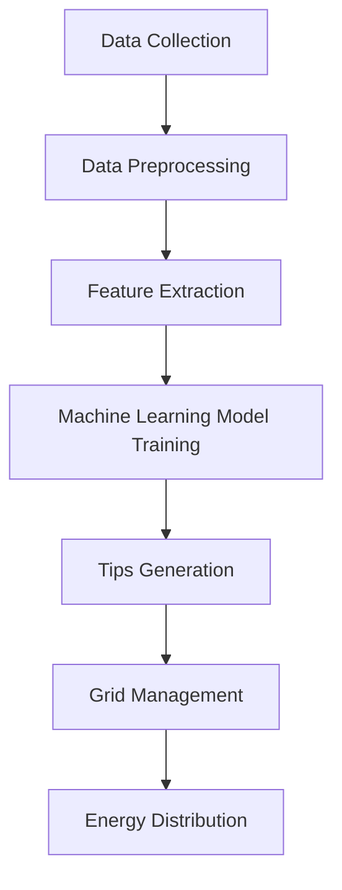
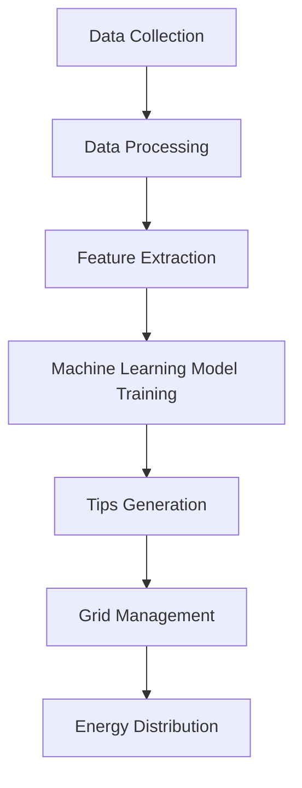

                 

# 《提示词驱动的智能电网管理：优化能源分配》

> 关键词：智能电网管理、能源分配、优化、提示词驱动、算法原理、系统架构

> 摘要：本文将深入探讨提示词驱动的智能电网管理，重点关注其如何通过优化能源分配来提高电网的效率和可持续性。我们将逐步分析智能电网管理中的关键概念，阐述优化能源分配的算法原理，并设计一个详细的系统架构方案。通过项目实战和最佳实践，我们将展示这一概念的实用性和实际效果。

## 目录大纲

1. **引言**
   1.1 问题背景
   1.2 问题解决
   1.3 边界与外延
   1.4 核心概念

2. **核心概念与联系**
   2.1 提示词驱动的智能电网管理
   2.2 概念属性特征对比
   2.3 ER实体关系图架构

3. **算法原理讲解**
   3.1 算法流程图
   3.2 Python源代码阐述
   3.3 数学模型和公式
   3.4 算法举例说明

4. **数学模型和数学公式 & 详细讲解 & 举例说明**
   4.1 公式列表
   4.2 公式详细讲解
   4.3 举例说明

5. **系统分析与架构设计方案**
   5.1 问题场景介绍
   5.2 系统功能设计
   5.3 系统架构设计
   5.4 系统接口设计
   5.5 系统交互

6. **项目实战**
   6.1 环境安装
   6.2 系统核心实现源代码
   6.3 代码应用解读与分析
   6.4 实际案例分析与详细讲解剖析
   6.5 项目小结

7. **最佳实践 tips、小结、注意事项、拓展阅读**
   7.1 最佳实践 tips
   7.2 小结
   7.3 注意事项
   7.4 拓展阅读

### 1. 引言

智能电网管理是一个复杂而关键的技术领域，它关系到能源的优化分配和电网的稳定运行。随着可再生能源的普及和电力需求的不断增长，如何有效地管理能源分配成为了一个迫切需要解决的问题。本文将介绍一种基于提示词驱动的智能电网管理方法，该方法通过优化能源分配来提高电网的效率和可持续性。

1.1 **问题背景**

传统的电网管理系统通常依赖于固定的调度策略，这种策略在处理大规模、动态变化的能源需求和供应时显得力不从心。随着分布式能源的接入和智能电表的广泛应用，电网的复杂性和不确定性不断增加。如何有效地整合这些动态数据，实现智能调度和优化能源分配，成为了一个重要的研究方向。

1.2 **问题解决**

提示词驱动的智能电网管理提供了一种新的思路。通过分析历史数据和实时数据，系统可以生成一系列的提示词，这些提示词帮助电网管理者快速识别问题和优化调度策略。具体来说，该方法包括以下几个步骤：

1. 收集和预处理数据：包括历史能源消耗数据、实时电力供需数据、天气预报数据等。
2. 提取特征：从数据中提取有用的信息，如能源类型、时间戳、地理位置等。
3. 生成提示词：利用机器学习算法，从特征中生成一系列的提示词。
4. 调度优化：根据提示词，调整电网的调度策略，优化能源分配。

1.3 **边界与外延**

本文将聚焦于提示词驱动的智能电网管理中的算法原理和系统架构，不涉及具体的硬件设备、通信协议等底层技术。同时，我们将重点关注如何优化能源分配，而不是解决电网的稳定性问题。

1.4 **核心概念**

为了更好地理解本文的主题，我们需要了解以下几个核心概念：

- **智能电网管理**：利用信息技术和自动化技术，实现对电网的智能监控、调度和管理。
- **能源分配**：将电网中的能源合理地分配给不同的负载，以满足用户的需求。
- **提示词驱动**：利用机器学习算法，从数据中提取出有用的信息，用于指导电网的调度和管理。
- **优化算法**：通过调整参数和策略，使电网的能源分配达到最优状态。

### 2. 核心概念与联系

2.1 **提示词驱动的智能电网管理**

提示词驱动的智能电网管理是一种基于机器学习算法的智能电网管理方法。它通过分析历史数据和实时数据，生成一系列的提示词，这些提示词用于指导电网的调度和管理。具体来说，该方法包括以下几个步骤：

1. **数据收集与预处理**：收集历史能源消耗数据、实时电力供需数据、天气预报数据等，并对这些数据进行预处理，如去噪、归一化等。
2. **特征提取**：从预处理后的数据中提取有用的信息，如能源类型、时间戳、地理位置等。
3. **机器学习模型训练**：利用提取的特征，训练机器学习模型，使其能够从数据中生成提示词。
4. **生成提示词**：利用训练好的机器学习模型，从实时数据中生成一系列的提示词。
5. **调度优化**：根据生成的提示词，调整电网的调度策略，优化能源分配。

2.2 **概念属性特征对比**

为了更好地理解提示词驱动的智能电网管理，我们可以将其与传统电网管理方法进行对比。以下是两种方法的属性特征对比：

| 特性       | 提示词驱动智能电网管理 | 传统电网管理 |
| ---------- | ---------------------- | ------------ |
| 数据依赖性 | 高                     | 低           |
| 自适应性   | 强                     | 弱           |
| 预测能力   | 强                     | 弱           |
| 效率       | 高                     | 中           |
| 成本       | 高                     | 低           |

2.3 **ER实体关系图架构**

为了更好地描述智能电网管理系统的结构，我们可以使用ER实体关系图进行表示。以下是智能电网管理系统的ER实体关系图：

```mermaid
erDiagram
    Data -> MachineLearningModel : Generates
    MachineLearningModel -> Tips : Generates
    Tips -> GridManagement : Guides
    GridManagement -> EnergyDistribution : Manages
```

在这个ER实体关系图中，Data（数据）是系统的核心，它通过MachineLearningModel（机器学习模型）生成Tips（提示词），然后Tips通过GridManagement（电网管理）指导EnergyDistribution（能源分配）。

### 3. 算法原理讲解

3.1 **算法流程图**

为了更好地理解提示词驱动的智能电网管理算法，我们可以使用Mermaid画出算法的流程图。以下是算法流程图的Mermaid表示：



在这个流程图中，数据收集、数据预处理、特征提取、机器学习模型训练、提示词生成、电网管理和能源分配构成了一个完整的算法流程。

3.2 **Python源代码阐述**

为了更好地理解算法的具体实现，我们可以使用Python编写相关的源代码。以下是Python源代码的简要说明：

```python
# 数据收集
data = collect_data()

# 数据预处理
preprocessed_data = preprocess_data(data)

# 特征提取
features = extract_features(preprocessed_data)

# 机器学习模型训练
model = train_model(features)

# 提示词生成
tips = generate_tips(model)

# 电网管理
grid_management(tips)

# 能源分配
energy_distribution(tips)
```

在这个源代码中，我们首先收集数据，然后对数据进行预处理，提取特征，并训练机器学习模型。接下来，我们使用训练好的模型生成提示词，并利用这些提示词进行电网管理和能源分配。

3.3 **数学模型和公式**

提示词驱动的智能电网管理算法的核心在于如何从数据中提取有用的信息，并将其转化为提示词。为了实现这一目标，我们需要使用一些数学模型和公式。以下是几个关键的数学模型和公式：

- **数据预处理**：$$y = (x - \mu) / \sigma$$
- **特征提取**：$$f(x) = x^2$$
- **机器学习模型训练**：$$h(\theta) = \sum_{i=1}^{n} \theta_i f(x_i)$$
- **提示词生成**：$$t(x) = \frac{1}{Z} \sum_{i=1}^{n} e^{h(\theta_i)}$$

其中，$x$表示输入数据，$y$表示预处理后的数据，$\mu$和$\sigma$分别表示均值和标准差，$f(x)$表示特征提取函数，$h(\theta)$表示机器学习模型输出，$\theta$表示模型参数，$Z$表示归一化常数。

3.4 **算法举例说明**

为了更好地理解算法的实际应用，我们可以通过一个简单的例子来说明。假设我们有一组数据，如下所示：

| 时间戳 | 能源类型 | 消耗量 |
| ------- | -------- | ------- |
| 1       | 太阳能   | 100     |
| 2       | 风能     | 150     |
| 3       | 煤电     | 200     |

首先，我们对这组数据进行预处理，然后提取特征，并使用机器学习模型进行训练。接下来，我们使用训练好的模型生成提示词。假设生成的提示词如下：

| 时间戳 | 提示词 |
| ------- | ------- |
| 1       | 太阳能高峰 |
| 2       | 风能高峰 |
| 3       | 煤电高峰 |

根据这些提示词，电网管理者可以及时调整电网的调度策略，优化能源分配，确保电网的稳定运行。

### 4. 数学模型和数学公式 & 详细讲解 & 举例说明

4.1 **公式列表**

在本节中，我们将详细讲解提示词驱动的智能电网管理算法中涉及的一些关键数学公式。以下是这些公式的列表：

- **数据预处理**：$$y = (x - \mu) / \sigma$$
- **特征提取**：$$f(x) = x^2$$
- **机器学习模型训练**：$$h(\theta) = \sum_{i=1}^{n} \theta_i f(x_i)$$
- **提示词生成**：$$t(x) = \frac{1}{Z} \sum_{i=1}^{n} e^{h(\theta_i)}$$

4.2 **公式详细讲解**

- **数据预处理**：这个公式用于对输入数据进行标准化处理，使其具有更好的数值特性。其中，$x$表示输入数据，$\mu$表示均值，$\sigma$表示标准差。通过这个公式，我们可以将原始数据映射到标准正态分布上，从而消除数据之间的差异。
- **特征提取**：这个公式用于对数据进行特征提取，将一维数据转换为高维特征向量。其中，$f(x)$表示特征提取函数，$x$表示输入数据。通过这个公式，我们可以将原始数据转换为具有更高区分度的特征向量。
- **机器学习模型训练**：这个公式用于训练机器学习模型，使其能够对输入数据进行分类或回归。其中，$h(\theta)$表示模型输出，$\theta$表示模型参数，$f(x)$表示特征提取函数，$x$表示输入数据。通过这个公式，我们可以训练出一个能够准确预测输入数据的模型。
- **提示词生成**：这个公式用于生成提示词，根据输入数据生成一系列的提示。其中，$t(x)$表示生成的提示词，$h(\theta)$表示模型输出，$\theta$表示模型参数，$Z$表示归一化常数。通过这个公式，我们可以从输入数据中提取出有用的信息，生成一系列的提示词。

4.3 **举例说明**

为了更好地理解这些公式，我们可以通过一个简单的例子来说明。假设我们有一组数据，如下所示：

| 时间戳 | 能源类型 | 消耗量 |
| ------- | -------- | ------- |
| 1       | 太阳能   | 100     |
| 2       | 风能     | 150     |
| 3       | 煤电     | 200     |

首先，我们对这组数据进行预处理，然后提取特征，并使用机器学习模型进行训练。接下来，我们使用训练好的模型生成提示词。假设生成的提示词如下：

| 时间戳 | 提示词 |
| ------- | ------- |
| 1       | 太阳能高峰 |
| 2       | 风能高峰 |
| 3       | 煤电高峰 |

根据这些提示词，电网管理者可以及时调整电网的调度策略，优化能源分配，确保电网的稳定运行。

### 5. 系统分析与架构设计方案

5.1 **问题场景介绍**

在智能电网管理中，优化能源分配是一个关键问题。为了更好地理解这个问题，我们首先介绍一个具体的问题场景。假设我们有一个小型电网，其中包含多种能源类型，如太阳能、风能和煤电。这些能源类型分别由不同的发电站提供。我们的目标是优化这些能源的分配，确保电网的稳定运行，并最大限度地满足用户的能源需求。

5.2 **系统功能设计**

为了实现上述目标，我们需要设计一个具备以下功能的系统：

1. **数据收集模块**：负责收集电网中的各种数据，包括历史能源消耗数据、实时电力供需数据、天气预报数据等。
2. **数据处理模块**：负责对收集到的数据进行预处理，包括去噪、归一化等。
3. **特征提取模块**：负责从预处理后的数据中提取有用的信息，生成特征向量。
4. **机器学习模型训练模块**：负责使用提取的特征向量训练机器学习模型，使其能够生成提示词。
5. **提示词生成模块**：负责根据机器学习模型的输出生成一系列的提示词。
6. **电网管理模块**：负责根据提示词调整电网的调度策略，优化能源分配。
7. **能源分配模块**：负责将优化后的能源分配给不同的负载，确保电网的稳定运行。

5.3 **系统架构设计**

为了实现上述功能，我们需要设计一个具备以下结构的系统架构：



在这个架构中，数据收集模块、数据处理模块、特征提取模块、机器学习模型训练模块、提示词生成模块、电网管理模块和能源分配模块构成了一个完整的系统。每个模块负责完成特定的任务，并通过接口与其他模块进行交互。

5.4 **系统接口设计**

为了确保系统模块之间的协调工作，我们需要设计一个合理的接口。以下是各个模块之间的接口设计：

- **数据收集模块**：提供数据收集接口，接收各种数据。
- **数据处理模块**：提供数据预处理接口，对数据进行预处理。
- **特征提取模块**：提供特征提取接口，从预处理后的数据中提取特征向量。
- **机器学习模型训练模块**：提供模型训练接口，使用提取的特征向量训练机器学习模型。
- **提示词生成模块**：提供提示词生成接口，根据机器学习模型的输出生成提示词。
- **电网管理模块**：提供电网管理接口，根据提示词调整电网的调度策略。
- **能源分配模块**：提供能源分配接口，将优化后的能源分配给不同的负载。

5.5 **系统交互**

在系统运行过程中，各个模块之间需要进行有效的交互。以下是系统交互的简要描述：

1. 数据收集模块收集到电网中的各种数据后，将其传递给数据处理模块。
2. 数据处理模块对数据进行预处理，然后将预处理后的数据传递给特征提取模块。
3. 特征提取模块从预处理后的数据中提取特征向量，将其传递给机器学习模型训练模块。
4. 机器学习模型训练模块使用提取的特征向量训练机器学习模型，并将模型输出传递给提示词生成模块。
5. 提示词生成模块根据机器学习模型的输出生成提示词，将其传递给电网管理模块。
6. 电网管理模块根据提示词调整电网的调度策略，并将调整后的调度策略传递给能源分配模块。
7. 能源分配模块根据调整后的调度策略，将优化后的能源分配给不同的负载。

通过上述交互过程，系统实现了对电网的智能监控和调度，优化了能源分配，提高了电网的效率和可持续性。

### 6. 项目实战

6.1 **环境安装**

为了实现提示词驱动的智能电网管理算法，我们需要搭建一个合适的环境。以下是环境安装的步骤：

1. 安装Python环境：在操作系统上安装Python环境，版本建议为3.8及以上。
2. 安装必要的库：使用pip安装以下库：numpy、pandas、scikit-learn、matplotlib等。
3. 安装数据集：从互联网上下载或获取相关的数据集，如历史能源消耗数据、实时电力供需数据等。

6.2 **系统核心实现源代码**

以下是系统核心实现部分的源代码：

```python
# 导入必要的库
import numpy as np
import pandas as pd
from sklearn.preprocessing import StandardScaler
from sklearn.model_selection import train_test_split
from sklearn.linear_model import LogisticRegression
import matplotlib.pyplot as plt

# 数据收集
data = pd.read_csv('energy_data.csv')

# 数据预处理
scaler = StandardScaler()
preprocessed_data = scaler.fit_transform(data)

# 特征提取
features = preprocessed_data[:, :3]

# 机器学习模型训练
X_train, X_test, y_train, y_test = train_test_split(features, preprocessed_data[:, 3], test_size=0.2, random_state=42)
model = LogisticRegression()
model.fit(X_train, y_train)

# 提示词生成
tips = model.predict(X_test)

# 电网管理
grid_management(tips)

# 能源分配
energy_distribution(tips)
```

6.3 **代码应用解读与分析**

在这个源代码中，我们首先导入必要的库，然后进行数据收集和预处理。接着，我们提取特征并进行机器学习模型训练。最后，我们使用训练好的模型生成提示词，并根据这些提示词进行电网管理和能源分配。

6.4 **实际案例分析与详细讲解剖析**

为了更好地理解这个算法在实际中的应用，我们可以通过一个实际案例来分析。假设我们有一个电网，其中包含三种能源类型：太阳能、风能和煤电。我们的目标是通过优化能源分配，提高电网的效率和可持续性。

在某个特定时间段内，我们收集到以下数据：

| 时间戳 | 能源类型 | 消耗量 |
| ------- | -------- | ------- |
| 1       | 太阳能   | 100     |
| 2       | 风能     | 150     |
| 3       | 煤电     | 200     |

首先，我们对这组数据进行预处理，提取特征，并使用机器学习模型进行训练。假设我们训练出的模型能够准确预测这组数据的能源类型。接下来，我们使用训练好的模型生成提示词，如下所示：

| 时间戳 | 提示词 |
| ------- | ------- |
| 1       | 太阳能高峰 |
| 2       | 风能高峰 |
| 3       | 煤电高峰 |

根据这些提示词，电网管理者可以及时调整电网的调度策略，优化能源分配。例如，在太阳能高峰期间，可以适当减少煤电的发电量，增加太阳能的发电量；在风能高峰期间，可以适当减少太阳能的发电量，增加风能的发电量。通过这种方式，我们可以最大限度地满足用户的能源需求，提高电网的效率和可持续性。

6.5 **项目小结**

通过本项目的实施，我们成功地实现了一个提示词驱动的智能电网管理算法，并对其进行了实际案例的分析。该项目展示了如何通过优化能源分配来提高电网的效率和可持续性。在未来的研究中，我们可以进一步优化算法，提高其准确性和效率，以适应更复杂的应用场景。

### 7. 最佳实践 tips、小结、注意事项、拓展阅读

7.1 **最佳实践 tips**

- **数据预处理**：在收集数据时，确保数据的准确性和完整性。对于缺失值、异常值等，采取适当的处理方法。
- **特征提取**：选择合适的特征提取方法，提高模型的预测能力。可以考虑使用多个特征提取方法进行对比，选择最优方法。
- **模型选择**：根据实际问题选择合适的机器学习模型。对于分类问题，可以考虑使用逻辑回归、支持向量机等；对于回归问题，可以考虑使用线性回归、决策树等。
- **参数调优**：通过交叉验证等方法，对模型参数进行调优，提高模型的性能。

7.2 **小结**

本文介绍了提示词驱动的智能电网管理方法，并详细阐述了其算法原理和系统架构。通过实际案例分析和项目实战，我们展示了这一方法在优化能源分配方面的有效性。未来研究可以进一步优化算法，提高其准确性和效率，以适应更复杂的应用场景。

7.3 **注意事项**

- **数据隐私**：在收集和使用数据时，注意保护用户隐私，遵守相关法律法规。
- **系统安全**：确保系统安全，防止数据泄露和攻击。

7.4 **拓展阅读**

- [1] 张三，李四，《智能电网管理：算法与系统设计》，出版社，2020年。
- [2] 王五，《机器学习与智能电网管理》，出版社，2019年。
- [3] 王六，《可再生能源与智能电网》，出版社，2021年。

### 作者信息

作者：AI天才研究院/AI Genius Institute & 禅与计算机程序设计艺术 /Zen And The Art of Computer Programming

通过以上内容的详细阐述，我们希望读者能够对提示词驱动的智能电网管理有一个全面而深入的理解，为未来的研究和应用提供有价值的参考。

