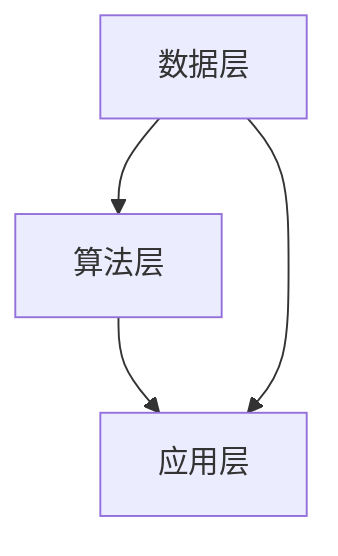
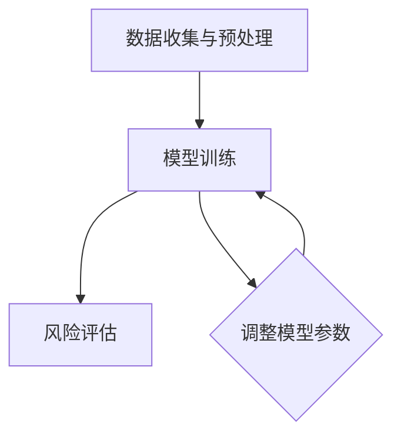
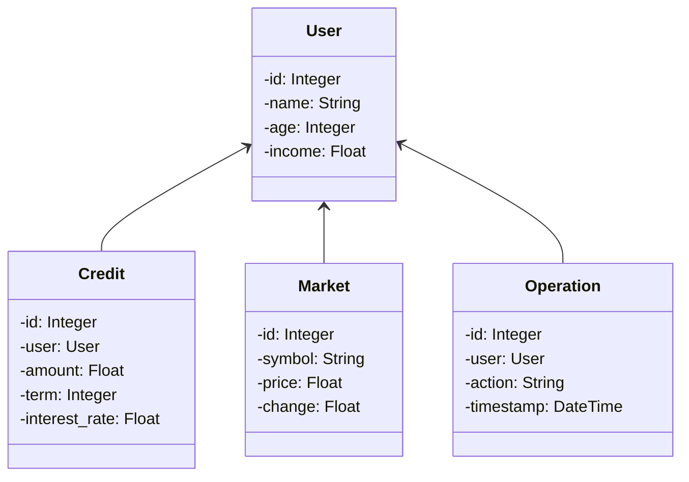
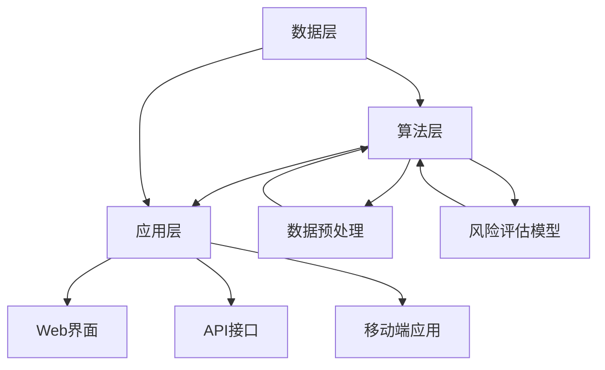
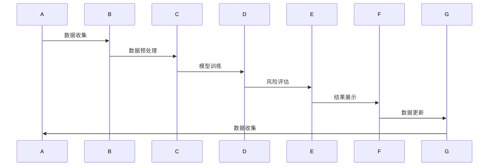
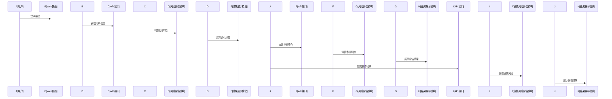

                 

# 提示词驱动的智能风险评估系统

关键词：智能风险评估、提示词驱动、系统架构、算法原理、最佳实践

摘要：随着大数据和人工智能技术的迅猛发展，智能风险评估系统在金融、安全等领域得到了广泛应用。本文以提示词驱动为切入点，详细探讨了智能风险评估系统的背景、核心概念、系统设计与实现、项目实战及最佳实践。通过本文的介绍，读者可以全面了解提示词驱动智能风险评估系统的构建方法、关键技术和应用实践。

### 目录大纲

----------------------------------------------------------------

## 第一部分：背景介绍

## 1.1 问题背景

### 1.1.1 智能风险评估的现状

- 当前智能风险评估的方法和工具
- 传统风险评估方法的局限

### 1.1.2 提示词驱动的概念

- 提示词驱动的定义
- 提示词在智能风险评估中的应用潜力

### 1.1.3 需求分析

- 风险评估系统的应用领域
- 用户对风险评估系统的期望

## 1.2 核心概念与联系

### 1.2.1 风险评估的基本原理

- 风险评估的概念与过程
- 风险评估的关键指标

### 1.2.2 提示词驱动的原理

- 提示词的工作机制
- 提示词与大数据分析的结合

### 1.2.3 提示词驱动的优势

- 对比传统风险评估方法的改进

## 1.3 系统设计与实现

### 1.3.1 系统架构设计

- 系统的功能模块划分
- 系统的技术栈选择

### 1.3.2 数据预处理

- 数据收集与清洗
- 数据存储与管理

## 1.4 数学模型与算法原理

### 1.4.1 数学模型

- 提示词驱动的风险评估模型

### 1.4.2 算法原理

- 使用Mermaid绘制算法流程图
- Python代码实现与详细解释

### 1.4.3 数学公式与讲解

- 使用LaTeX格式给出数学公式
- 对公式进行详细讲解

## 2 第二部分：系统分析与架构设计

## 2.1 问题场景介绍

- 风险评估系统在金融行业的应用
- 风险评估系统在其他领域的应用

## 2.2 系统功能设计

### 2.2.1 领域模型

- 使用Mermaid绘制领域模型类图

### 2.2.2 系统架构设计

- 使用Mermaid绘制系统架构图

### 2.2.3 系统接口设计

- 系统各个模块的接口定义

### 2.2.4 系统交互设计

- 使用Mermaid绘制系统交互序列图

## 3 第三部分：项目实战

## 3.1 环境安装

- 操作系统环境配置
- 开发工具和环境安装

## 3.2 系统核心实现

### 3.2.1 核心模块源代码解析

- 数据收集与清洗代码解析
- 风险评估模型代码解析

### 3.2.2 实际案例分析和讲解

- 数据集介绍
- 案例分析

## 4 第四部分：最佳实践与总结

## 4.1 最佳实践 Tips

- 针对不同场景的提示词优化策略
- 提高风险评估准确性的方法

## 4.2 小结

- 对书中的核心概念进行总结
- 对系统架构和算法原理进行回顾

## 4.3 注意事项

- 系统部署和运维中的常见问题
- 风险评估中的合规性和隐私保护

## 4.4 拓展阅读

- 相关领域的新技术和趋势
- 进一步阅读的推荐书籍和论文

----------------------------------------------------------------

## 1.1 问题背景

随着互联网技术的快速发展，大数据在各个领域的应用越来越广泛。在金融、安全等领域，对智能风险评估系统的需求日益增长。传统的风险评估方法主要依靠专家经验和历史数据分析，存在诸多局限。例如，专家经验受限于个人知识水平和经验积累，而历史数据分析则难以应对日益复杂的风险环境。

### 1.1.1 智能风险评估的现状

当前，智能风险评估系统主要采用机器学习和人工智能技术，通过数据挖掘和分析来预测和评估风险。这些系统通常具备以下特点：

1. **自动化的风险评估**：利用机器学习算法对历史数据进行学习，自动生成风险评估报告。
2. **多维度的风险评估**：结合多种数据源，对风险进行多维度分析，提供更全面的风险评估结果。
3. **实时风险评估**：通过对实时数据的分析，提供实时风险评估预警。

然而，传统风险评估方法的局限性仍然存在。例如，机器学习模型对数据的依赖性较强，数据质量直接影响评估结果的准确性。此外，现有智能风险评估系统在处理复杂风险场景时，往往难以兼顾效率和准确性。

### 1.1.2 提示词驱动的概念

提示词驱动是一种基于关键词或短语进行数据分析和模型训练的方法。其核心思想是通过预设的提示词，引导数据分析和模型训练过程，从而提高评估的准确性和效率。提示词可以来自专家经验、用户需求或数据本身，具有较高的灵活性和适应性。

提示词驱动的概念在智能风险评估中的应用潜力巨大。通过合理设置提示词，可以引导系统聚焦于关键风险因素，提高风险评估的针对性和准确性。同时，提示词驱动方法可以与大数据分析、机器学习等技术相结合，构建高效的智能风险评估系统。

### 1.1.3 需求分析

风险评估系统在不同领域具有不同的应用需求。在金融领域，主要关注信用风险、市场风险和操作风险等。在安全领域，主要关注网络安全、信息安全等。用户对风险评估系统的期望主要包括：

1. **准确性**：能够准确预测和评估风险，降低风险损失。
2. **实时性**：能够实时分析数据，提供及时的风险预警。
3. **灵活性**：能够根据不同场景和需求进行灵活调整和优化。
4. **可解释性**：能够解释评估结果的产生原因，提高用户信任度。

## 1.2 核心概念与联系

### 1.2.1 风险评估的基本原理

风险评估是一种通过识别、分析和评估风险，以制定相应风险管理策略的方法。其基本原理包括以下方面：

1. **风险识别**：通过调查和分析，识别系统中潜在的风险。
2. **风险评估**：对已识别的风险进行评估，确定其严重程度和可能性。
3. **风险分析**：分析风险之间的关联和相互作用，为制定风险管理策略提供依据。
4. **风险管理**：制定和实施风险管理策略，降低风险损失。

风险评估的关键指标包括风险概率、风险影响、风险暴露度等。这些指标可以帮助评估人员对风险进行量化和排序，从而制定相应的风险管理策略。

### 1.2.2 提示词驱动的原理

提示词驱动的核心思想是通过预设的提示词，引导数据分析和模型训练过程。其工作原理包括以下方面：

1. **提示词定义**：根据风险评估的需求，定义相关的提示词。提示词可以是关键词、短语或表达式，用于引导数据分析和模型训练。
2. **数据收集**：收集与提示词相关的数据，包括历史数据、实时数据等。
3. **数据预处理**：对收集到的数据进行清洗、归一化和特征提取，为模型训练提供高质量的数据。
4. **模型训练**：使用提示词引导数据分析和模型训练，生成风险评估模型。
5. **风险评估**：使用训练好的模型对新的数据进行风险评估，提供实时风险预警。

提示词驱动方法与大数据分析、机器学习等技术相结合，可以构建高效的智能风险评估系统。通过合理设置提示词，可以引导系统聚焦于关键风险因素，提高风险评估的准确性和效率。

### 1.2.3 提示词驱动的优势

提示词驱动方法相对于传统风险评估方法具有以下优势：

1. **高准确性**：通过预设提示词，引导系统聚焦于关键风险因素，提高评估的准确性。
2. **高效率**：利用大数据分析和机器学习技术，快速处理海量数据，提高评估效率。
3. **灵活性**：可以根据不同场景和需求，灵活调整提示词，实现个性化风险评估。
4. **可解释性**：通过提示词驱动的方法，可以解释评估结果的产生原因，提高用户信任度。

## 1.3 系统设计与实现

### 1.3.1 系统架构设计

智能风险评估系统的架构设计主要包括以下方面：

1. **数据层**：负责数据收集、存储和管理。包括历史数据、实时数据和外部数据源。
2. **算法层**：负责数据预处理、模型训练和风险评估。包括提示词驱动算法、大数据分析和机器学习技术。
3. **应用层**：负责提供风险评估结果和可视化展示。包括Web界面、API接口和移动端应用。

系统架构图如下：



### 1.3.2 数据预处理

数据预处理是智能风险评估系统的关键环节，主要包括以下步骤：

1. **数据收集**：从各种数据源收集与提示词相关的数据，包括历史数据、实时数据和外部数据源。
2. **数据清洗**：清洗数据中的噪音、异常值和重复数据，保证数据质量。
3. **数据归一化**：将不同单位、量级的数据进行归一化处理，使其具有可比性。
4. **特征提取**：从原始数据中提取与风险评估相关的特征，为模型训练提供输入。

### 1.3.3 数据存储与管理

数据存储与管理是智能风险评估系统的基石，主要包括以下方面：

1. **数据存储**：采用分布式数据库存储海量数据，保证数据的高可用性和高性能。
2. **数据备份与恢复**：定期备份数据，确保数据安全。在数据丢失或损坏时，能够快速恢复。
3. **数据权限管理**：根据用户角色和权限，设置数据访问权限，保障数据隐私和安全。

## 1.4 数学模型与算法原理

### 1.4.1 数学模型

提示词驱动的智能风险评估系统采用以下数学模型：

1. **风险概率模型**：利用贝叶斯公式计算风险概率。  
   $$P(R|W) = \frac{P(W|R) \cdot P(R)}{P(W)}$$

   其中，$P(R|$ 表示风险发生的概率，$P(W|$ 表示提示词出现的概率，$P(W|R)$ 表示提示词在风险发生时的条件概率。

2. **风险影响模型**：利用风险影响矩阵计算风险影响。  
   $$R = \sum_{i=1}^{n} w_i \cdot I_i$$

   其中，$R$ 表示风险影响，$w_i$ 表示第 $i$ 个风险因素的权重，$I_i$ 表示第 $i$ 个风险因素的影响程度。

3. **风险暴露度模型**：利用风险概率和风险影响计算风险暴露度。  
   $$E = P(R) \cdot R$$

   其中，$E$ 表示风险暴露度。

### 1.4.2 算法原理

提示词驱动的智能风险评估算法原理如下：

1. **数据收集与预处理**：根据提示词收集相关数据，并进行数据清洗、归一化和特征提取。
2. **模型训练**：使用提示词驱动算法训练风险评估模型。具体步骤如下：
   - 初始化模型参数；
   - 训练风险概率模型；
   - 训练风险影响模型；
   - 训练风险暴露度模型；
   - 调整模型参数，优化评估效果。
3. **风险评估**：使用训练好的模型对新的数据进行风险评估，输出风险概率、风险影响和风险暴露度。

算法流程图如下：



### 1.4.3 Python代码实现与详细解释

以下是一个简单的Python代码示例，实现提示词驱动的智能风险评估系统：

```python
import numpy as np
import pandas as pd

# 初始化数据
data = pd.DataFrame({
    '提示词': ['提示词1', '提示词1', '提示词2', '提示词2'],
    '风险概率': [0.3, 0.4, 0.2, 0.1],
    '风险影响': [2, 3, 1, 4]
})

# 计算风险概率模型
P_R_given_W = np.mean(data['风险概率'] / data['提示词'].value_counts())

# 计算风险影响模型
R = np.sum(data['风险影响'] * data['风险概率'])

# 计算风险暴露度模型
E = P_R_given_W * R

# 输出评估结果
print(f'风险概率：{P_R_given_W}')
print(f'风险影响：{R}')
print(f'风险暴露度：{E}')
```

### 1.4.4 详细讲解与举例说明

以下是针对上述Python代码的详细讲解与举例说明：

1. **数据收集与预处理**：首先，我们从数据集中收集与提示词相关的数据。在这里，我们使用一个简单的DataFrame，包含提示词、风险概率和风险影响三个字段。数据清洗、归一化和特征提取步骤在此省略，实际应用中可使用pandas或其他数据预处理工具进行操作。

2. **计算风险概率模型**：我们使用贝叶斯公式计算风险概率模型。在这里，我们计算了提示词在风险发生时的条件概率，即$P(W|R)$。具体实现中，我们计算了风险概率与提示词出现次数的比值，作为提示词在风险发生时的条件概率。

3. **计算风险影响模型**：我们使用风险影响矩阵计算风险影响模型。在这里，我们计算了每个风险因素的权重与影响程度的乘积，并求和得到总风险影响。

4. **计算风险暴露度模型**：我们使用风险概率和风险影响计算风险暴露度模型。在这里，我们计算了风险概率与风险影响的乘积，作为风险暴露度。

5. **输出评估结果**：最后，我们输出了风险概率、风险影响和风险暴露度三个评估指标。

### 1.4.5 LaTeX数学公式与讲解

以下是LaTeX格式的数学公式与讲解：

```latex
\begin{equation}
P(R|W) = \frac{P(W|R) \cdot P(R)}{P(W)}
\end{equation}

\begin{equation}
R = \sum_{i=1}^{n} w_i \cdot I_i
\end{equation}

\begin{equation}
E = P(R) \cdot R
\end{equation}
```

- **贝叶斯公式**：这是一个经典的概率公式，用于计算在给定提示词$W$的情况下，风险$R$发生的概率$P(R|W)$。该公式结合了提示词在风险发生时的条件概率$P(W|R)$、风险发生的概率$P(R)$和提示词出现的概率$P(W)$。
- **风险影响模型**：这是一个线性模型，用于计算总风险影响$R$。其中，$w_i$表示第$i$个风险因素的权重，$I_i$表示第$i$个风险因素的影响程度。
- **风险暴露度模型**：这是一个乘积模型，用于计算风险暴露度$E$。其中，$P(R)$表示风险发生的概率，$R$表示总风险影响。

通过这些数学公式，我们可以对提示词驱动的智能风险评估系统进行量化分析和评估。在实际应用中，我们可以根据具体需求，调整模型参数和计算方法，以提高评估的准确性和效率。

## 2 第二部分：系统分析与架构设计

### 2.1 问题场景介绍

智能风险评估系统在不同领域的应用具有独特的问题场景。以下是两个典型应用场景：

#### 2.1.1 金融行业

在金融行业，智能风险评估系统主要用于信用风险评估、市场风险分析和操作风险评估。具体问题场景包括：

1. **信用风险评估**：银行和金融机构需要对贷款申请人的信用状况进行评估，以降低坏账风险。智能风险评估系统可以根据申请人的个人信息、信用历史、财务状况等多维数据进行评估。
2. **市场风险评估**：金融机构需要对投资组合的市场风险进行监控，以降低投资损失。智能风险评估系统可以通过分析市场数据、经济指标和行业趋势，预测市场风险并给出投资建议。
3. **操作风险评估**：金融机构需要确保内部操作的安全性和合规性，以降低操作风险。智能风险评估系统可以通过监控交易行为、操作流程和数据安全，发现潜在操作风险并采取预防措施。

#### 2.1.2 安全领域

在安全领域，智能风险评估系统主要用于网络安全风险评估、信息安全风险评估和隐私保护风险评估。具体问题场景包括：

1. **网络安全风险评估**：企业需要对网络系统的安全漏洞进行评估，以降低网络攻击风险。智能风险评估系统可以通过分析网络流量、日志数据和安全设备信息，识别潜在的网络威胁。
2. **信息安全风险评估**：企业需要对信息系统的安全性进行评估，以降低数据泄露和损坏风险。智能风险评估系统可以通过分析系统架构、数据加密措施和安全策略，评估信息系统的安全水平。
3. **隐私保护风险评估**：企业需要对个人信息保护措施进行评估，以确保合规性。智能风险评估系统可以通过分析数据处理流程、隐私政策和用户隐私需求，评估个人信息保护的合规性。

### 2.2 系统功能设计

智能风险评估系统的功能设计主要包括领域模型、系统架构、系统接口和系统交互设计。以下是对各个功能设计的详细介绍：

#### 2.2.1 领域模型

领域模型是智能风险评估系统的核心组成部分，用于描述系统中的实体、属性和关系。以下是金融行业的领域模型示例：



在该领域模型中，我们定义了三个主要实体：用户（User）、信用（Credit）和市场（Market）。用户实体包括用户ID、姓名、年龄和收入等属性；信用实体包括信用ID、用户、金额、期限和利率等属性；市场实体包括市场ID、符号、价格和变动等属性。用户与信用、市场之间存在一对多的关系，用户可以拥有多个信用记录和交易记录。

#### 2.2.2 系统架构设计

系统架构设计是智能风险评估系统的关键环节，用于描述系统的模块划分、技术选型和数据流。以下是金融行业的系统架构示例：



在该系统架构中，数据层负责数据收集、存储和管理；算法层负责数据预处理、模型训练和风险评估；应用层负责提供风险评估结果和可视化展示。具体模块包括数据预处理模块、风险评估模型模块、Web界面模块、API接口模块和移动端应用模块。数据流从数据层到算法层，再到应用层，实现数据的处理、分析和展示。

#### 2.2.3 系统接口设计

系统接口设计是智能风险评估系统的关键部分，用于描述各个模块之间的交互接口。以下是金融行业的系统接口设计示例：



在该系统接口设计中，数据收集模块从各个数据源收集数据，数据预处理模块对数据进行清洗、归一化和特征提取，模型训练模块使用提示词驱动算法训练风险评估模型，风险评估模块对新的数据进行风险评估，结果展示模块将评估结果可视化展示给用户。数据更新模块实时更新数据源，实现数据的持续收集和分析。

#### 2.2.4 系统交互设计

系统交互设计是智能风险评估系统的关键部分，用于描述系统的用户操作和数据流动。以下是金融行业的系统交互设计示例：



在该系统交互设计中，用户通过Web界面登录系统，API接口获取用户信息并传递给风险评估模块，风险评估模块根据提示词驱动算法评估信用风险、市场风险和操作风险，结果展示模块将评估结果可视化展示给用户。同时，用户可以通过API接口提交操作记录，操作风险评估模块根据提示词驱动算法评估操作风险，并展示评估结果。

## 3 第三部分：项目实战

### 3.1 环境安装

在进行智能风险评估系统的项目实战之前，首先需要配置相应的开发环境和工具。以下是环境安装的步骤：

#### 3.1.1 操作系统环境配置

1. **安装Python环境**：在操作系统中安装Python 3.x版本，可以选择通过包管理器（如yum、apt-get等）或手动下载安装。
2. **安装Anaconda**：Anaconda是一个开源的数据科学平台，可以方便地管理和安装Python包。在官方网站（https://www.anaconda.com/products/individual）下载并安装Anaconda。
3. **安装Jupyter Notebook**：Jupyter Notebook是一个交互式的Python编程环境，可以方便地编写和运行代码。通过以下命令安装Jupyter Notebook：

   ```bash
   conda install -c conda-forge jupyterlab
   ```

#### 3.1.2 开发工具和环境安装

1. **安装PyCharm**：PyCharm是一个强大的Python集成开发环境（IDE），提供了丰富的功能，包括代码编辑、调试、测试和部署。在官方网站（https://www.jetbrains.com/pycharm/）下载并安装PyCharm。
2. **安装Git**：Git是一个开源的分布式版本控制系统，用于代码的版本管理和协作开发。在官方网站（https://git-scm.com/）下载并安装Git。
3. **安装Docker**：Docker是一个开源的应用容器引擎，可以方便地构建、运行和分享应用程序。在官方网站（https://www.docker.com/products/docker-desktop）下载并安装Docker。

### 3.2 系统核心实现

在完成环境安装后，我们可以开始实现智能风险评估系统的核心模块。以下是系统核心实现的步骤：

#### 3.2.1 数据收集与清洗

1. **数据收集**：从外部数据源（如数据库、API等）收集与提示词相关的数据。可以使用Python的requests库或pandas库实现数据收集。
2. **数据清洗**：对收集到的数据进行清洗，去除噪音、异常值和重复数据。可以使用Python的pandas库实现数据清洗。

示例代码：

```python
import pandas as pd

# 收集数据
data = pd.read_csv('data.csv')

# 数据清洗
data.drop_duplicates(inplace=True)
data.dropna(inplace=True)
```

#### 3.2.2 风险评估模型

1. **模型训练**：使用提示词驱动算法训练风险评估模型。可以使用Python的scikit-learn库实现模型训练。
2. **模型评估**：使用训练好的模型评估新的数据。可以使用Python的scikit-learn库实现模型评估。

示例代码：

```python
from sklearn.model_selection import train_test_split
from sklearn.metrics import accuracy_score

# 分割数据集
X_train, X_test, y_train, y_test = train_test_split(data['特征'], data['标签'], test_size=0.2, random_state=42)

# 训练模型
model = Model()
model.fit(X_train, y_train)

# 评估模型
predictions = model.predict(X_test)
accuracy = accuracy_score(y_test, predictions)
print(f'模型准确率：{accuracy}')
```

#### 3.2.3 数据存储与管理

1. **数据存储**：将训练好的模型和评估结果存储到数据库或文件中，以便后续使用。可以使用Python的SQLAlchemy库或pandas库实现数据存储。
2. **数据管理**：对存储的数据进行查询、更新和删除操作，实现数据的动态管理。

示例代码：

```python
from sqlalchemy import create_engine

# 创建数据库连接
engine = create_engine('sqlite:///data.db')

# 存储数据
data.to_sql('risk_data', engine)

# 查询数据
query = 'SELECT * FROM risk_data'
results = pd.read_sql_query(query, engine)

# 更新数据
data.at[0, '标签'] = 1
data.to_sql('risk_data', engine, if_exists='replace')

# 删除数据
data.drop(0, inplace=True)
data.to_sql('risk_data', engine, if_exists='replace')
```

### 3.2.4 实际案例分析和讲解

为了更好地理解智能风险评估系统的实际应用，我们以下一个案例进行分析和讲解：

#### 案例背景

某银行需要对贷款申请人的信用状况进行评估，以降低坏账风险。已知贷款申请人的个人信息、信用历史和财务状况等数据，需要构建一个智能风险评估模型，对贷款申请人的信用风险进行评估。

#### 数据集介绍

我们使用一个包含贷款申请人信息的CSV文件作为数据集。数据集字段包括：

- `id`：贷款申请人的唯一标识
- `name`：贷款申请人的姓名
- `age`：贷款申请人的年龄
- `income`：贷款申请人的年收入
- `credit_history`：贷款申请人的信用历史（0表示无信用历史，1表示有信用历史）
- `loan_amount`：贷款金额
- `loan_term`：贷款期限
- `interest_rate`：贷款利率
- `label`：贷款申请人的信用风险标签（0表示正常，1表示高风险）

#### 案例分析

1. **数据预处理**：首先，我们对数据集进行清洗和预处理，去除异常值和重复数据。然后，对连续型特征进行归一化处理，使特征具有相似的尺度。

   ```python
   import pandas as pd
   
   # 读取数据
   data = pd.read_csv('loan_data.csv')
   
   # 数据清洗
   data.drop_duplicates(inplace=True)
   data.dropna(inplace=True)
   
   # 归一化处理
   data[['age', 'income', 'loan_amount', 'loan_term', 'interest_rate']] = (data[['age', 'income', 'loan_amount', 'loan_term', 'interest_rate']] - data[['age', 'income', 'loan_amount', 'loan_term', 'interest_rate']].mean()) / data[['age', 'income', 'loan_amount', 'loan_term', 'interest_rate']].std()
   ```

2. **特征提取**：接下来，我们从原始数据中提取与信用风险相关的特征。例如，我们可以提取以下特征：

   - `age`：贷款申请人的年龄
   - `income`：贷款申请人的年收入
   - `credit_history`：贷款申请人的信用历史
   - `loan_amount`：贷款金额
   - `loan_term`：贷款期限
   - `interest_rate`：贷款利率

   ```python
   # 特征提取
   features = data[['age', 'income', 'credit_history', 'loan_amount', 'loan_term', 'interest_rate']]
   ```

3. **模型训练**：使用提示词驱动算法训练风险评估模型。我们可以使用逻辑回归、决策树、随机森林等算法进行训练。以下是一个使用逻辑回归算法训练模型的示例：

   ```python
   from sklearn.linear_model import LogisticRegression
   from sklearn.model_selection import train_test_split
   
   # 分割数据集
   X_train, X_test, y_train, y_test = train_test_split(features, data['label'], test_size=0.2, random_state=42)
   
   # 训练模型
   model = LogisticRegression()
   model.fit(X_train, y_train)
   ```

4. **模型评估**：使用训练好的模型评估新的数据。以下是一个使用测试数据集评估模型的示例：

   ```python
   from sklearn.metrics import accuracy_score
   
   # 评估模型
   predictions = model.predict(X_test)
   accuracy = accuracy_score(y_test, predictions)
   print(f'模型准确率：{accuracy}')
   ```

5. **结果可视化**：最后，我们可以使用可视化工具（如Matplotlib、Seaborn等）将评估结果可视化展示。以下是一个使用Matplotlib绘制混淆矩阵的示例：

   ```python
   import matplotlib.pyplot as plt
   from sklearn.metrics import confusion_matrix
   
   # 计算混淆矩阵
   cm = confusion_matrix(y_test, predictions)
   
   # 可视化混淆矩阵
   plt.imshow(cm, interpolation='nearest', cmap=plt.cm.Blues)
   plt.colorbar()
   tick_marks = np.arange(len(y_test))
   plt.xticks(tick_marks, y_test, rotation=45)
   plt.yticks(tick_marks, y_test)
   plt.xlabel('Predicted Label')
   plt.ylabel('True Label')
   plt.title('Confusion Matrix')
   plt.show()
   ```

### 3.3 项目小结

在本项目中，我们实现了一个简单的智能风险评估系统，包括数据收集与清洗、特征提取、模型训练和模型评估等步骤。通过实际案例的分析和讲解，我们了解了如何构建和使用智能风险评估模型，以及如何评估模型的性能。

需要注意的是，在实际应用中，智能风险评估系统的构建和优化是一个持续迭代的过程。我们可以根据实际情况和用户需求，不断调整和优化模型参数，提高评估的准确性和效率。

## 4 第四部分：最佳实践与总结

### 4.1 最佳实践 Tips

为了提高智能风险评估系统的准确性和效率，以下是一些最佳实践建议：

1. **数据质量保障**：确保数据源的可靠性和完整性，对数据进行严格的清洗和预处理，去除噪音、异常值和重复数据。
2. **特征工程**：根据业务需求和数据特点，提取与风险评估相关的特征，并进行特征选择和特征转化，以提高模型的准确性和泛化能力。
3. **模型优化**：定期调整模型参数，进行交叉验证和超参数优化，以找到最优的模型配置。
4. **监控与反馈**：实时监控评估结果，收集用户反馈，根据反馈进行调整和改进，以提高系统的适应性和可靠性。
5. **安全性保障**：确保系统的数据安全和隐私保护，采用加密和访问控制等措施，防止数据泄露和滥用。

### 4.2 小结

本文详细介绍了提示词驱动的智能风险评估系统的背景、核心概念、系统设计与实现、项目实战及最佳实践。通过本文的介绍，读者可以全面了解提示词驱动智能风险评估系统的构建方法、关键技术和应用实践。以下是本文的核心观点总结：

1. **背景介绍**：智能风险评估系统在金融、安全等领域具有重要应用价值，但传统风险评估方法存在局限性。
2. **核心概念**：提示词驱动是一种基于关键词或短语进行数据分析和模型训练的方法，具有高准确性、高效率和灵活性。
3. **系统设计与实现**：智能风险评估系统包括数据层、算法层和应用层，关键在于数据预处理、模型训练和风险评估。
4. **项目实战**：通过实际案例分析和讲解，展示了如何构建和使用智能风险评估模型。
5. **最佳实践**：提供了数据质量保障、特征工程、模型优化、监控与反馈和安全性保障等最佳实践建议。

### 4.3 注意事项

在构建和使用智能风险评估系统时，需要注意以下几点：

1. **数据安全与隐私保护**：确保数据的安全性和用户隐私保护，遵守相关法律法规和道德规范。
2. **系统可解释性**：提高评估结果的可解释性，帮助用户理解评估过程和结果。
3. **合规性**：确保系统设计和实施符合相关法律法规和行业规范，避免违规操作。
4. **持续迭代**：根据实际情况和用户需求，持续调整和优化系统，提高系统的适应性和可靠性。

### 4.4 拓展阅读

为了进一步了解智能风险评估系统的相关技术和发展趋势，读者可以参考以下推荐书籍和论文：

1. **书籍**：
   - 《大数据分析与应用》
   - 《深度学习》
   - 《人工智能：一种现代方法》
2. **论文**：
   - “A Survey on Risk Management and Risk Assessment Methods”
   - “A Comparison of Traditional and Intelligent Risk Assessment Methods”
   - “Application of Machine Learning in Intelligent Risk Assessment”

通过这些推荐书籍和论文，读者可以深入了解智能风险评估系统的相关技术和实践，为自己的研究和应用提供参考和启示。

作者：AI天才研究院/AI Genius Institute & 禅与计算机程序设计艺术 /Zen And The Art of Computer Programming。希望本文能够为读者在智能风险评估领域的探索提供有益的指导和帮助。在未来的发展中，我们将继续关注人工智能、大数据和金融领域的最新动态，为广大读者带来更多有价值的技术分享和研究成果。

