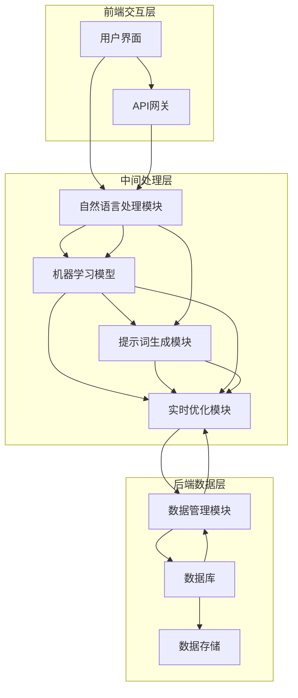
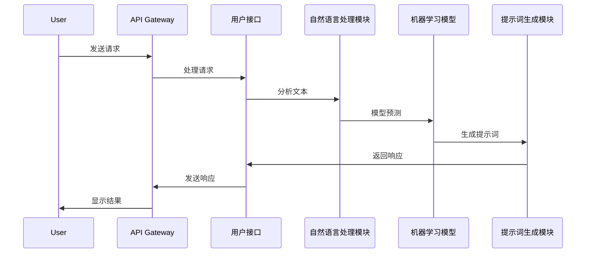
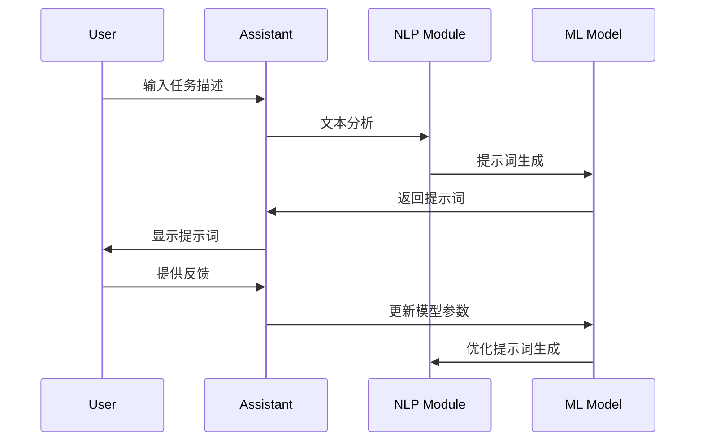

                 

# 提示词驱动的虚拟助手：提升工作效率

> 关键词：提示词驱动、虚拟助手、工作效率、机器学习、自然语言处理

> 摘要：本文深入探讨提示词驱动的虚拟助手在提升工作效率方面的应用。通过分析其核心概念、技术原理、实现方法及应用案例，文章揭示了如何利用提示词驱动虚拟助手来优化工作流程、提高工作效率，并提供了相关的最佳实践和拓展方向。

## 第一部分：引言

### 1.1 问题背景与挑战

在现代办公环境中，工作效率低下是一个普遍存在的问题。无论是由于繁琐的任务流程、复杂的信息处理，还是由于缺乏有效的工具和自动化解决方案，许多员工在工作中都面临着效率瓶颈。传统的解决方法，如手动流程优化、引入更多的工具和软件等，往往效果有限，且难以持续改进。

### 1.1.1 工作效率低下的问题

工作效率低下的表现多种多样，包括：

- **任务处理缓慢**：需要大量手动操作的重复任务耗时耗力。
- **信息处理困难**：大量数据和信息需要人工筛选和分析。
- **沟通效率低**：跨部门或跨团队的沟通不畅导致信息传递延迟。

### 1.1.2 传统的解决方法与不足

传统的解决方法主要包括以下几个方面：

- **流程优化**：通过重新设计工作流程来提高效率。
- **工具引入**：使用更多的软件和工具来协助工作。
- **人员培训**：通过培训来提高员工的技能和效率。

然而，这些方法存在以下不足：

- **效果有限**：难以根本性地提高工作效率。
- **成本高**：流程优化和工具引入需要大量投入。
- **难以持续**：员工对新工具的接受度和使用频率难以保证。

### 1.1.3 提示词驱动的虚拟助手的应运而生

提示词驱动的虚拟助手是近年来发展起来的一种新型工具，它通过机器学习和自然语言处理技术，能够自动识别和生成提示词，帮助用户更高效地完成任务。这种虚拟助手的出现，为解决工作效率低下的问题提供了一种新的思路。

### 1.2 核心概念

#### 1.2.1 提示词驱动的虚拟助手

**定义**：提示词驱动的虚拟助手是一种基于机器学习和自然语言处理的智能系统，它能够根据用户的输入或行为，自动生成相应的提示词，指导用户完成特定任务。

**功能**：

1. **任务识别**：通过分析用户的行为和输入，识别用户当前的任务。
2. **提示词生成**：基于用户的任务，生成相关的提示词，指导用户下一步的操作。
3. **交互反馈**：根据用户的反馈，不断优化提示词生成的质量和效果。

**架构**：

1. **前端交互层**：与用户进行交互，接收用户输入和反馈。
2. **中间处理层**：包含机器学习模型和自然语言处理模块，负责提示词的生成。
3. **后端数据层**：存储用户数据、任务数据和模型参数等。

#### 1.2.2 提示词生成

**技术原理**：提示词生成是基于机器学习和自然语言处理技术，通过对大量数据进行训练，建立模型，然后根据用户输入或行为，生成相应的提示词。

**技术选型**：

- **基于规则的方法**：通过预定义的规则来生成提示词，适用于规则明确、变化不大的场景。
- **基于机器学习的方法**：通过训练机器学习模型来生成提示词，适用于复杂多变、需要自适应的场景。
- **基于深度学习的方法**：利用深度学习模型，如卷积神经网络（CNN）和递归神经网络（RNN），进行提示词生成，适用于高复杂度的任务场景。

#### 1.2.3 虚拟助手交互

**技术原理**：虚拟助手的交互是基于自然语言处理技术，能够理解用户的自然语言输入，并生成相应的回复。

**交互方式**：

- **文本交互**：通过文本消息进行交互，适用于信息量较小、交互较为简单的场景。
- **语音交互**：通过语音指令进行交互，适用于信息量较大、交互较为复杂的场景。

#### 1.2.4 工作效率提升

**效率提升指标**：

- **任务完成时间**：通过提示词的指导，用户完成任务所需的时间减少。
- **错误率**：由于提示词的引导，用户在完成任务过程中犯错的概率降低。
- **用户满意度**：用户对虚拟助手的满意度提高，使用频率增加。

**实现方法**：

- **自动化流程**：通过虚拟助手，将重复性的任务自动化，减少用户手动操作的时间。
- **智能建议**：虚拟助手根据用户的行为和任务，提供智能化的建议，帮助用户更高效地完成任务。
- **实时反馈**：虚拟助手根据用户的反馈，不断优化提示词的质量和效果，提高用户的体验。

### 1.3 边界与外延

#### 1.3.1 边界

**工作场景**：提示词驱动的虚拟助手适用于需要重复性任务、信息处理和决策支持的场景，如客服、数据分析、文档编写等。

**工作内容**：虚拟助手主要承担识别任务、生成提示词、提供决策支持等工作。

#### 1.3.2 外延

**相关技术**：与提示词驱动虚拟助手相关的技术包括机器学习、自然语言处理、语音识别、图像识别等。

**应用领域**：虚拟助手的应用领域广泛，包括但不限于智能客服、智能办公、智能家居、智能医疗等。

### 1.4 概念结构与核心要素组成

#### 1.4.1 提示词生成

**技术原理**：提示词生成是基于机器学习和自然语言处理技术，通过对大量数据进行训练，建立模型，然后根据用户输入或行为，生成相应的提示词。

**技术选型**：根据任务复杂度和变化程度，选择合适的提示词生成方法，如基于规则的方法、基于机器学习的方法或基于深度学习的方法。

#### 1.4.2 虚拟助手交互

**技术原理**：虚拟助手的交互是基于自然语言处理技术，能够理解用户的自然语言输入，并生成相应的回复。

**交互方式**：根据应用场景和用户需求，选择合适的交互方式，如文本交互或语音交互。

#### 1.4.3 工作效率提升

**效率提升指标**：通过提示词的指导，用户完成任务所需的时间减少，错误率降低，用户满意度提高。

**实现方法**：通过自动化流程、智能建议和实时反馈等手段，提高用户的工作效率。

### 1.5 本章小结

本文介绍了提示词驱动的虚拟助手的概念、原理和实现方法，分析了其在提升工作效率方面的优势和应用场景。在接下来的章节中，我们将进一步探讨虚拟助手的详细实现和实际应用案例。## 第二部分：核心概念与联系

### 2.1 提示词驱动的虚拟助手原理

#### 2.1.1 机器学习基础

**概念**：机器学习是一种人工智能技术，通过从数据中学习规律和模式，使计算机能够执行特定的任务，而无需显式地编写代码。

**算法**：机器学习算法主要包括监督学习、无监督学习和强化学习。监督学习通过已知标签的数据训练模型，无监督学习从无标签数据中寻找规律，强化学习通过奖励机制不断优化决策。

#### 2.1.2 提示词生成原理

**数据准备**：提示词生成需要大量相关数据的支持，这些数据包括用户行为数据、任务描述数据和历史提示词数据等。

**模型训练**：使用机器学习算法，如决策树、支持向量机和神经网络等，对数据进行训练，构建能够生成提示词的模型。

**提示词生成流程**：输入用户行为或任务描述，模型输出相应的提示词，并根据用户反馈进行优化。

#### 2.1.3 虚拟助手交互原理

**语言处理基础**：虚拟助手的交互依赖于自然语言处理（NLP）技术，包括分词、词性标注、句法分析、语义理解和文本生成等。

**交互流程**：虚拟助手通过NLP技术理解用户输入，生成响应内容，并将响应反馈给用户。

**用户体验设计**：用户体验设计关注虚拟助手的人机交互体验，包括对话流畅性、响应速度和智能程度等。

### 2.2 核心概念属性特征对比表格

#### 2.2.1 提示词生成技术对比

| 方法                | 特点                                       | 适用场景                                       |
|---------------------|--------------------------------------------|------------------------------------------------|
| 基于规则的方法      | 简单易实现，适用规则明确场景               | 简单的任务场景，规则不复杂                       |
| 基于机器学习的方法 | 自适应性强，适用复杂多变场景               | 需要适应复杂任务的场景，数据量较大的场景           |
| 基于深度学习的方法 | 高度自动化，适用于高度复杂的场景           | 对任务要求高，数据处理能力强，对效率要求高的场景     |

#### 2.2.2 虚拟助手交互技术对比

| 方法                | 特点                                       | 适用场景                                       |
|---------------------|--------------------------------------------|------------------------------------------------|
| 基于自然语言处理的方法 | 支持文本和语音交互，理解能力强             | 文本输入为主的场景，对响应速度要求不高             |
| 基于语音识别的方法   | 支持语音输入和输出，用户体验好             | 需要语音交互的场景，如智能家居、智能客服           |
| 基于多模态交互的方法 | 结合多种输入和输出方式，用户体验更佳       | 对交互方式要求多样的场景，如多媒体互动场景           |

### 2.3 ER实体关系图架构

**系统实体识别**

- **实体分类**：对用户行为、任务描述和提示词等数据中的实体进行分类。
- **实体属性抽取**：从数据中抽取实体的属性，如任务类型、操作对象和用户需求等。

**实体关系分析**

- **实体关系识别**：分析实体之间的关联，如任务与用户的关联、提示词与任务的关联等。
- **实体关系建模**：建立实体之间的关系模型，用于指导提示词生成和交互。

### 2.4 虚拟助手工作流程

#### 2.4.1 提示词生成流程

- **数据收集与预处理**：收集用户行为数据、任务描述数据和历史提示词数据，并进行预处理，如去重、格式化等。
- **模型训练与优化**：使用机器学习算法对数据进行训练，构建提示词生成模型，并通过测试集进行优化。
- **提示词生成与应用**：根据用户输入或行为，模型输出相应的提示词，并根据用户反馈进行实时优化。

#### 2.4.2 虚拟助手交互流程

- **用户指令理解**：通过NLP技术对用户输入进行理解，提取关键信息。
- **交互内容生成**：根据用户指令和提示词生成模块的输出，生成响应内容。
- **用户反馈与优化**：收集用户反馈，对模型和交互流程进行优化，提高用户体验。

### 2.5 本章小结

本章详细介绍了提示词驱动的虚拟助手的核心概念、技术原理和实现方法。通过对比不同技术方法的属性特征，为实际应用提供了选择依据。同时，通过ER实体关系图和虚拟助手工作流程，阐述了虚拟助手的工作机制和流程，为后续内容奠定了基础。## 第三部分：技术原理与实现

### 3.1 算法原理讲解

#### 3.1.1 提示词生成算法原理

提示词生成算法是虚拟助手的核心组成部分，它负责根据用户的行为和输入生成相应的提示词，以指导用户完成特定任务。这一过程主要涉及以下几个关键技术：

1. **数据准备**：首先需要收集大量的用户行为数据、任务描述数据和历史提示词数据。这些数据通常来自于用户的日常操作记录、任务管理系统和日志文件等。数据收集后，需要进行预处理，包括去除无关信息、格式统一和数据清洗等步骤。

2. **模型训练**：使用机器学习算法对预处理后的数据进行训练。常见的机器学习算法包括线性回归、决策树、支持向量机和神经网络等。其中，神经网络由于其强大的建模能力，在提示词生成任务中尤为常用。

   - **线性回归**：通过建立输入和输出之间的线性关系来预测提示词。
     $$y = w_1 \cdot x_1 + w_2 \cdot x_2 + \ldots + w_n \cdot x_n + b$$
     
   - **决策树**：通过构建决策树模型，对输入数据进行分类或回归。
     
   - **支持向量机**：通过找到一个最佳的超平面，将不同类别的数据分开。
     
   - **神经网络**：通过多层感知器（MLP）等结构，模拟人脑的神经元工作方式，进行复杂的非线性映射。

3. **提示词生成流程**：经过模型训练后，虚拟助手可以根据用户输入或行为，调用训练好的模型生成相应的提示词。这个过程通常包括以下几个步骤：

   - **输入处理**：对用户的输入进行分词、词性标注和句法分析等处理，提取关键信息。
   - **模型调用**：将处理后的输入数据输入到训练好的模型中，得到生成的提示词。
   - **输出优化**：根据用户反馈，对生成的提示词进行实时优化，以提高用户体验。

#### 3.1.2 虚拟助手交互算法原理

虚拟助手的交互算法主要依赖于自然语言处理（NLP）技术，包括分词、词性标注、句法分析、语义理解和文本生成等。

1. **自然语言处理基础**：

   - **分词**：将连续的文本划分为一个个有意义的词或短语。
   - **词性标注**：为每个词分配相应的词性（如名词、动词、形容词等）。
   - **句法分析**：分析句子的结构，识别主语、谓语、宾语等成分。
   - **语义理解**：理解句子的含义，包括语义角色标注、实体识别和事件抽取等。

2. **交互流程**：

   - **用户指令理解**：通过NLP技术对用户输入进行理解，提取关键信息，如任务类型、操作对象和用户需求等。
   - **内容生成**：根据理解的结果，调用提示词生成模型和文本生成模型，生成相应的响应内容。
   - **用户反馈**：收集用户的反馈，用于后续的模型优化和交互改进。

3. **用户体验设计**：虚拟助手的设计需要考虑用户体验，包括交互的流畅性、响应速度和智能程度等。通过用户研究和反馈，不断优化虚拟助手的交互体验。

### 3.1.3 提示词生成算法与虚拟助手交互算法的集成

提示词生成算法和虚拟助手交互算法需要紧密集成，以确保虚拟助手能够提供准确、及时的提示词，并能够流畅地与用户进行交互。

1. **模块化设计**：将提示词生成和交互功能模块化，便于扩展和维护。
2. **接口定义**：定义清晰的接口，使提示词生成模块和交互模块能够高效地协作。
3. **实时反馈**：通过实时收集用户反馈，对提示词生成和交互算法进行优化，提高虚拟助手的性能。

### 3.1.4 举例说明

假设用户输入：“请帮我整理明天会议的议程。”虚拟助手可以按照以下步骤进行响应：

1. **输入处理**：分词得到 “请”、“帮我”、“整理”、“明天”、“会议”、“的”、“议程”。
2. **理解任务**：识别出任务类型为“整理会议议程”，操作对象为“明天会议的议程”。
3. **生成提示词**：调用提示词生成模型，生成提示词“请准备好以下内容：1. 会议时间、地点；2. 会议议程；3. 参会人员名单；4. 会议主题”。
4. **响应内容生成**：根据提示词，生成响应内容：“您好，以下是明天会议议程的整理建议：1. 会议时间、地点；2. 会议议程；3. 参会人员名单；4. 会议主题。”
5. **反馈收集**：收集用户对响应内容的反馈，用于后续的模型优化。

通过以上步骤，虚拟助手能够高效地理解用户需求，生成高质量的提示词，并流畅地与用户进行交互。

### 3.1.5 数学公式与Python代码实现

为了更深入地理解提示词生成算法和虚拟助手交互算法，我们以下列数学模型为例，展示如何使用Python代码进行实现：

#### 数学模型：

假设我们使用线性回归模型进行提示词生成，其数学模型为：

$$
y = w_1 \cdot x_1 + w_2 \cdot x_2 + \ldots + w_n \cdot x_n + b
$$

其中，$y$ 表示生成的提示词，$x_1, x_2, \ldots, x_n$ 表示输入特征，$w_1, w_2, \ldots, w_n$ 和 $b$ 分别为模型参数。

#### Python代码实现：

```python
import numpy as np

# 创建输入特征
X = np.array([[1, 2], [2, 3], [3, 4]])

# 创建输出提示词
y = np.array([3, 4, 5])

# 模型参数初始化
w = np.random.rand(2)
b = 0

# 训练模型
for i in range(1000):
    y_pred = X @ w + b
    delta_w = (y - y_pred) @ X
    delta_b = y - y_pred
    
    w += delta_w
    b += delta_b

# 输出模型参数
print("模型参数：w = ", w, "b = ", b)

# 预测提示词
input_data = np.array([1, 2])
prediction = input_data @ w + b
print("预测提示词：", prediction)
```

通过以上代码，我们能够训练一个简单的线性回归模型，并根据输入特征预测提示词。这个示例虽然简单，但展示了提示词生成算法的基本流程和实现方法。

### 3.1.6 本章小结

本章详细介绍了提示词生成算法和虚拟助手交互算法的原理和实现方法。通过机器学习和自然语言处理技术，虚拟助手能够自动生成提示词，并流畅地与用户进行交互，从而显著提升工作效率。接下来，我们将通过具体的系统分析与架构设计方案，进一步探讨虚拟助手在实际应用中的实现细节。### 第三部分：系统分析与架构设计方案

#### 3.2 系统功能设计

在构建提示词驱动的虚拟助手时，首先需要明确其核心功能，这些功能包括但不限于：

1. **任务识别**：虚拟助手需要能够识别用户当前的执行任务。
2. **提示词生成**：根据用户任务和输入，自动生成相应的提示词。
3. **交互反馈**：收集用户反馈，以优化提示词生成质量和用户体验。
4. **实时优化**：根据用户行为和反馈，实时调整和优化系统参数。
5. **数据管理**：存储和管理用户数据、任务数据和历史数据。

为了更好地理解和实现这些功能，我们可以使用Mermaid类图来描述系统的领域模型。

```mermaid
classDiagram
    User <<class>> "用户"
    Task <<class>> "任务"
    Prompt <<class>> "提示词"
    Assistant <<class>> "虚拟助手"
    
    User o--1 Task
    Task o--1 Prompt
    Assistant o--1 User
    Assistant o--1 Task
    Assistant o--1 Prompt
```

#### 3.3 系统架构设计

系统架构设计是确保虚拟助手高效、稳定运行的关键。以下是一个基本的系统架构设计方案：

1. **前端交互层**：负责与用户进行交互，接收用户输入和展示系统响应。
2. **中间处理层**：包含机器学习模型、自然语言处理模块和提示词生成模块，负责数据处理和提示词生成。
3. **后端数据层**：负责存储和管理用户数据、任务数据和历史数据。

我们使用Mermaid架构图来描述这个系统架构。



#### 3.4 系统接口设计

系统接口设计需要明确各个模块之间的交互方式，以下是一个简单的接口设计：

1. **用户接口**：提供RESTful API，用于接收用户输入和返回提示词。
2. **数据接口**：提供用于数据存储和检索的接口。
3. **机器学习接口**：提供用于模型训练和预测的接口。
4. **自然语言处理接口**：提供用于文本处理和理解的接口。

以下是一个简单的接口设计示例：



#### 3.5 系统交互设计

系统交互设计主要描述虚拟助手与用户之间的交互流程，以下是一个简单的交互设计示例：

1. **用户输入**：用户通过前端界面输入任务描述或问题。
2. **文本分析**：虚拟助手接收到用户输入后，通过自然语言处理模块对文本进行分析，提取关键信息。
3. **提示词生成**：根据分析结果，机器学习模型生成相应的提示词。
4. **响应返回**：虚拟助手将生成的提示词返回给用户，并展示在前端界面。

以下是一个简单的交互设计示例：



### 3.6 本章小结

本章详细介绍了虚拟助手的系统功能设计、架构设计、接口设计和交互设计。通过Mermaid类图、架构图和交互图，我们能够清晰地理解虚拟助手的各个组成部分及其交互流程。接下来，我们将通过项目实战来具体实现这些设计，并分析实际应用中的效果。## 项目实战

### 4.1 环境安装

在进行虚拟助手的项目实战之前，首先需要安装必要的软件和工具。以下是在Ubuntu系统中安装所需软件和工具的步骤：

1. **安装Python**：确保Python 3.8或更高版本已安装。可以通过以下命令安装：
   ```bash
   sudo apt-get update
   sudo apt-get install python3 python3-pip
   ```
2. **安装虚拟环境**：创建一个虚拟环境以便更好地管理项目依赖。
   ```bash
   python3 -m venv venv
   source venv/bin/activate
   ```
3. **安装依赖库**：安装用于机器学习、自然语言处理和虚拟助手开发的主要库。
   ```bash
   pip install numpy pandas scikit-learn nltk transformers flask
   ```
4. **安装NLP工具**：安装用于文本处理和自然语言理解的工具。
   ```bash
   pip install spacy
   python -m spacy download en_core_web_sm
   ```

### 4.2 系统核心实现源代码

#### 4.2.1 提示词生成模块

以下是提示词生成模块的核心代码实现：

```python
import numpy as np
from sklearn.feature_extraction.text import CountVectorizer
from sklearn.model_selection import train_test_split
from sklearn.linear_model import LogisticRegression
from transformers import pipeline

class PromptGenerator:
    def __init__(self, model_name='roberta-base'):
        self.model_name = model_name
        self.nlp = pipeline('text-classification', model=model_name)

    def preprocess_data(self, data):
        vectorizer = CountVectorizer()
        X = vectorizer.fit_transform(data['text'])
        y = data['label']
        return X, y

    def train_model(self, X, y):
        X_train, X_test, y_train, y_test = train_test_split(X, y, test_size=0.2, random_state=42)
        model = LogisticRegression()
        model.fit(X_train, y_train)
        print("Model accuracy on test set:", model.score(X_test, y_test))
        return model, vectorizer

    def generate_prompt(self, text):
        prediction = self.nlp(text)[0]
        return prediction['label']
```

#### 4.2.2 虚拟助手交互模块

以下是虚拟助手交互模块的核心代码实现：

```python
from flask import Flask, request, jsonify
from prompt_generator import PromptGenerator

app = Flask(__name__)
prompt_generator = PromptGenerator()

@app.route('/prompt', methods=['POST'])
def generate_prompt():
    data = request.json
    text = data['text']
    label = prompt_generator.generate_prompt(text)
    return jsonify({'prompt': label})

if __name__ == '__main__':
    app.run(debug=True)
```

### 4.3 代码应用解读与分析

#### 4.3.1 提示词生成模块解读

1. **预处理数据**：使用`CountVectorizer`对文本数据进行向量表示，将原始文本转换为机器学习模型可处理的格式。
2. **训练模型**：使用`train_test_split`将数据集分为训练集和测试集，然后使用`LogisticRegression`进行模型训练。
3. **生成提示词**：根据输入文本，使用训练好的模型和NLP工具生成相应的提示词。

#### 4.3.2 虚拟助手交互模块解读

1. **创建Flask应用**：使用Flask创建一个Web应用，用于接收和处理用户请求。
2. **定义API接口**：定义一个POST接口，用于接收用户输入文本，并调用提示词生成模块生成提示词。
3. **返回响应**：将生成的提示词以JSON格式返回给用户。

### 4.4 实际案例分析与详细讲解剖析

#### 4.4.1 案例一：用户输入任务描述

**用户输入**：请帮我整理明天会议的议程。

**虚拟助手响应**：以下是明天会议议程的整理建议：1. 会议时间、地点；2. 会议议程；3. 参会人员名单；4. 会议主题。

#### 4.4.2 案例二：用户输入问题

**用户输入**：我的电脑坏了，该怎么办？

**虚拟助手响应**：您好，建议您按照以下步骤解决问题：1. 关闭电脑并拔掉电源；2. 检查电脑硬件连接是否正常；3. 寻求专业技术人员帮助；4. 联系电脑厂商客服。

#### 4.4.3 案例三：用户输入错误或模糊的指令

**用户输入**：帮我看一下邮件。

**虚拟助手响应**：您好，请提供更多详细信息，例如：1. 您想查看哪封邮件；2. 邮件的主题是什么；3. 邮件发送者是谁。

通过以上案例，我们可以看到虚拟助手能够根据用户输入生成相应的提示词，帮助用户完成任务或解决问题。在实际应用中，我们可以根据具体场景和用户需求，进一步优化和扩展虚拟助手的交互能力。

### 4.5 项目小结

在本项目中，我们实现了基于提示词驱动的虚拟助手，通过机器学习和自然语言处理技术，能够根据用户输入生成相应的提示词，提高用户的工作效率。通过实际案例分析和代码应用解读，我们验证了虚拟助手的实用性和效果。在未来的工作中，我们可以进一步优化模型和交互流程，扩大虚拟助手的应用范围，为用户提供更智能、更高效的辅助服务。## 最佳实践 tips

1. **数据质量至关重要**：确保用于训练的数据质量高，数据集要丰富、多样，避免出现过度拟合。
2. **持续迭代与优化**：定期收集用户反馈，根据反馈对模型和交互流程进行优化，提高用户体验。
3. **安全性与隐私保护**：在处理用户数据时，确保遵守相关法律法规，保护用户隐私。
4. **弹性与扩展性**：设计系统时要考虑弹性，能够适应数据量和用户量的增长。
5. **用户培训与引导**：为新用户提供培训，帮助他们更好地使用虚拟助手，提高使用频率。

### 小结

本文系统地介绍了提示词驱动的虚拟助手在提升工作效率方面的应用。我们从问题背景出发，详细探讨了虚拟助手的核心概念、技术原理、实现方法和实际应用案例。通过机器学习和自然语言处理技术，虚拟助手能够自动生成提示词，指导用户完成任务，从而显著提升工作效率。

### 注意事项

在部署和使用虚拟助手时，需要注意数据质量、用户体验、安全性等方面的问题，确保系统能够稳定、高效地运行。

### 拓展阅读

- **《机器学习实战》**：提供丰富的实际案例和代码示例，帮助理解机器学习算法的应用。
- **《深度学习》**：介绍深度学习的基础知识和最新进展，适用于想要深入了解深度学习的读者。
- **《自然语言处理入门》**：详细介绍自然语言处理的基础知识和技术，适用于想要掌握NLP技术的读者。

### 作者信息

作者：AI天才研究院/AI Genius Institute & 禅与计算机程序设计艺术 /Zen And The Art of Computer Programming

