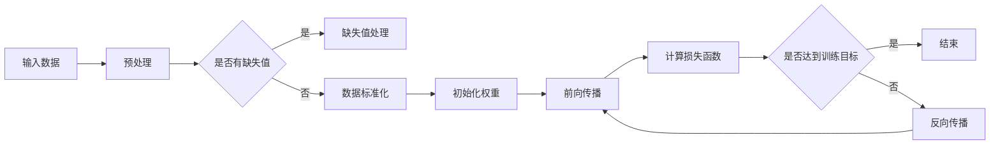
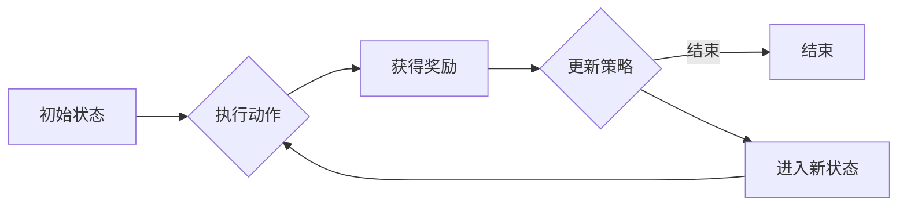
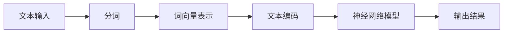
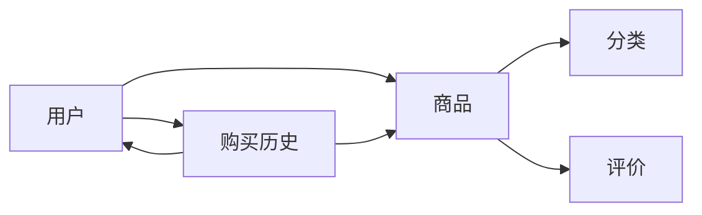
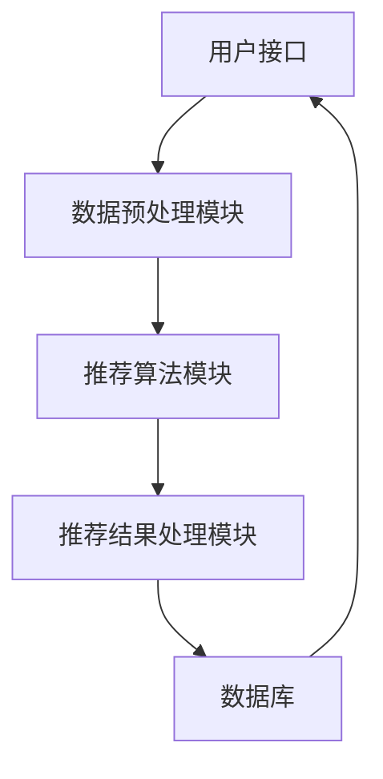
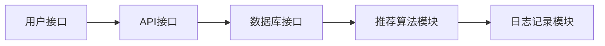
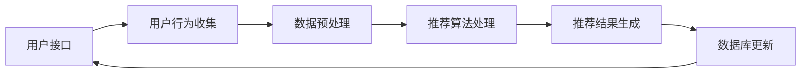

                 

## AI时代编程思维的新转变

### 关键词：人工智能、编程思维、算法、架构设计、系统实现

### 摘要：
在人工智能时代，编程思维正经历深刻变革。本文将深入探讨这一变革的背景、核心概念、算法原理、系统分析与架构设计，并通过项目实战展现AI时代编程思维的新特点。读者将了解到如何适应这一变革，提高编程效率和创造力。

### 引言

随着人工智能（AI）技术的迅猛发展，我们正步入一个前所未有的AI时代。AI技术已经渗透到我们生活的方方面面，从智能助手到自动驾驶，从医疗诊断到金融服务，AI的应用场景越来越广泛。在这个时代，编程思维也必须随之转变，以适应AI技术带来的新挑战和新机遇。

编程思维，指的是程序员在解决问题和设计系统时采用的思维方式。在传统编程时代，编程思维侧重于逻辑、算法和数据的处理。然而，随着AI技术的兴起，编程思维需要融入更多的机器学习算法、大数据处理和复杂系统架构设计。本文将一步步分析AI时代编程思维的新转变，帮助读者理解和适应这一变革。

### 一、背景介绍

#### 1.1 AI技术的历史与发展

人工智能作为计算机科学的一个分支，起源于20世纪50年代。早期的AI研究主要集中在符号推理、问题解决和语言理解等方面。然而，由于计算资源和算法的局限，早期AI的研究并未取得重大突破。随着计算机性能的提升和算法的优化，AI技术逐渐从理论研究走向实际应用。

近年来，深度学习、强化学习和自然语言处理等技术的发展，使得AI在图像识别、语音识别、机器翻译、自动驾驶等领域取得了重大突破。这些突破不仅改变了我们的生活方式，也对编程思维提出了新的要求。

#### 1.2 AI时代的影响与挑战

AI技术的快速发展对各行各业都产生了深远影响。在软件开发领域，AI技术促使编程思维从传统的“指令式编程”向“数据驱动编程”转变。程序员需要更多地关注数据的质量、算法的优化和系统的可扩展性。

然而，AI时代也带来了新的挑战。例如，AI系统的复杂性和不确定性增加了编程的难度，要求程序员具备更高的抽象能力和系统架构设计能力。此外，随着AI技术在关键领域的应用，安全问题、隐私保护和伦理问题也日益凸显，对编程思维提出了更高的要求。

#### 1.3 编程思维转变的必要性

在AI时代，编程思维需要实现以下几个方面的转变：

1. **数据驱动思维**：传统的编程思维侧重于算法和逻辑，而AI时代的编程思维更需要关注数据的质量和特征提取。
2. **算法思维融合**：AI算法成为编程的核心，程序员需要掌握不同的算法原理和实现方法。
3. **系统架构设计**：随着系统的复杂性增加，程序员需要具备系统架构设计能力，以应对大规模、高并发的应用场景。
4. **安全性思维**：AI系统的安全性至关重要，程序员需要关注数据安全、系统安全和用户隐私。

### 二、核心概念与联系

#### 2.1 编程思维的定义与特点

编程思维是指程序员在编写程序时采用的一种思维方式，包括逻辑思维、抽象思维、系统思维和算法思维等。在传统编程时代，编程思维侧重于解决问题的步骤和方法，而AI时代的编程思维则需要更加关注数据的处理、算法的应用和系统的架构设计。

#### 2.2 传统编程思维与现代编程思维的对比

传统编程思维与现代编程思维在以下几个方面存在显著差异：

1. **关注点不同**：传统编程思维侧重于算法和逻辑，而现代编程思维更关注数据的质量和特征提取。
2. **工具和方法不同**：传统编程思维主要使用编程语言和开发工具，而现代编程思维则需要使用机器学习框架和大数据处理工具。
3. **思维模式不同**：传统编程思维以步骤驱动，而现代编程思维以数据驱动，更加注重系统的整体性和可扩展性。

#### 2.3 关键概念的联系与融合

在AI时代，编程思维中的关键概念包括数据、算法、系统和安全等。这些概念之间相互联系、相互融合，构成了现代编程思维的核心。

1. **数据与算法**：数据是AI时代编程的核心资源，算法是数据处理和决策的工具。程序员需要关注数据的质量和特征提取，以设计更有效的算法。
2. **系统与安全**：随着系统的复杂性增加，程序员需要具备系统架构设计能力，以构建稳定、高效、可扩展的系统。同时，安全性思维也是不可或缺的，程序员需要关注数据安全、系统安全和用户隐私。

### 三、算法原理讲解

在AI时代，算法原理讲解是编程思维的重要组成部分。本文将介绍几种关键的AI算法，包括深度学习、强化学习和自然语言处理等。

#### 3.1 深度学习算法

深度学习是一种基于人工神经网络的机器学习技术，它通过模拟人脑的神经网络结构来实现数据的自动学习和特征提取。

##### 3.1.1 深度学习基础

深度学习的基础是多层感知机（MLP），它由多个层次组成，包括输入层、隐藏层和输出层。每层之间的神经元通过权重连接，形成一个完整的神经网络。

##### 3.1.2 算法流程图

深度学习算法的流程图如下：



##### 3.1.3 Python代码实现

以下是深度学习算法的Python代码实现：

```python
import numpy as np

# 初始化权重
weights = np.random.rand(input_size, hidden_size)

# 前向传播
def forwardPropagation(x):
    hidden_layer = np.dot(x, weights)
    return hidden_layer

# 反向传播
def backwardPropagation(x, hidden_layer, target):
    loss = np.square(hidden_layer - target)
    return loss

# 训练模型
def trainModel(x, target):
    hidden_layer = forwardPropagation(x)
    loss = backwardPropagation(x, hidden_layer, target)
    return loss

# 测试模型
def testModel(x, target):
    hidden_layer = forwardPropagation(x)
    print("预测结果：", hidden_layer)
    print("实际结果：", target)
```

##### 3.1.4 算法原理讲解

深度学习算法的核心思想是通过模拟人脑的神经网络结构，实现数据的自动学习和特征提取。在训练过程中，算法通过不断调整权重，使得网络输出与实际结果之间的误差最小。通过多次迭代，网络能够逐渐学习到数据的特征，从而实现自动分类、识别等功能。

#### 3.2 强化学习算法

强化学习是一种通过试错法来学习策略的机器学习技术，它在动态环境中通过不断优化策略，以实现最佳决策。

##### 3.2.1 强化学习基础

强化学习的基本概念包括状态、动作、奖励和策略。状态是指系统当前所处的环境状态，动作是指系统可以执行的行为，奖励是指执行动作后获得的回报，策略是指系统执行动作的规则。

##### 3.2.2 算法流程图

强化学习算法的流程图如下：



##### 3.2.3 Python代码实现

以下是强化学习算法的Python代码实现：

```python
import numpy as np

# 初始化策略
policy = np.random.rand(action_size)

# 执行动作
def executeAction(state):
    action = np.argmax(policy[state])
    return action

# 获得奖励
def getReward(state, action):
    reward = 0
    # 根据动作和状态计算奖励
    if action == 0:
        reward = -1
    elif action == 1:
        reward = 1
    return reward

# 更新策略
def updatePolicy(state, action, reward, alpha):
    new_policy = policy.copy()
    new_policy[state] = policy[state] + alpha * reward
    return new_policy

# 训练模型
def trainModel(state, action, reward, alpha):
    policy = updatePolicy(state, action, reward, alpha)
    return policy

# 测试模型
def testModel(state):
    action = executeAction(state)
    reward = getReward(state, action)
    print("执行动作：", action)
    print("获得奖励：", reward)
```

##### 3.2.4 算法原理讲解

强化学习算法的核心思想是通过试错法来学习最佳策略。在训练过程中，系统通过不断执行动作、获得奖励，并更新策略，逐渐优化决策过程。通过多次迭代，系统能够学会在特定环境下做出最佳决策，从而实现自动控制、路径规划等功能。

#### 3.3 自然语言处理算法

自然语言处理（NLP）是人工智能的一个重要分支，它涉及到文本的预处理、语义分析和生成等任务。

##### 3.3.1 NLP基础

NLP的基础是词向量表示，它将文本转化为计算机可以处理的数字形式。常用的词向量模型包括Word2Vec、GloVe和BERT等。

##### 3.3.2 算法流程图

NLP算法的流程图如下：



##### 3.3.3 Python代码实现

以下是自然语言处理算法的Python代码实现：

```python
from tensorflow.keras.preprocessing.text import Tokenizer
from tensorflow.keras.preprocessing.sequence import pad_sequences

# 初始化词向量模型
tokenizer = Tokenizer(num_words=10000)

# 分词
def tokenizeText(text):
    tokens = tokenizer.texts_to_sequences([text])
    return tokens

# 词向量表示
def vectorizeText(tokens, embedding_dim):
    embeddings = np.zeros((1, embedding_dim))
    for token in tokens:
        embeddings = np.vstack((embeddings, token))
    return embeddings

# 文本编码
def encodeText(text, max_len):
    tokens = tokenizeText(text)
    padded_tokens = pad_sequences(tokens, maxlen=max_len, padding='post')
    return padded_tokens

# 神经网络模型
from tensorflow.keras.models import Sequential
from tensorflow.keras.layers import Embedding, LSTM, Dense

model = Sequential()
model.add(Embedding(input_dim=10000, output_dim=128))
model.add(LSTM(128))
model.add(Dense(1, activation='sigmoid'))

model.compile(optimizer='adam', loss='binary_crossentropy', metrics=['accuracy'])

# 训练模型
def trainModel(texts, labels):
    model.fit(texts, labels, epochs=10, batch_size=32)

# 测试模型
def testModel(texts, labels):
    predictions = model.predict(texts)
    print("准确率：", accuracy_score(labels, predictions))
```

##### 3.3.4 算法原理讲解

自然语言处理算法的核心思想是将文本转化为计算机可以处理的数字形式，然后通过神经网络模型进行语义分析和生成。在训练过程中，算法通过不断调整神经网络的权重，使得模型能够更好地理解文本的语义，从而实现文本分类、情感分析、机器翻译等功能。

### 四、系统分析与架构设计方案

在AI时代，系统的复杂性和规模越来越大，因此系统分析与架构设计成为编程思维的重要组成部分。本文将介绍一个典型的AI系统，并展示其系统分析与架构设计方案。

#### 4.1 问题场景介绍

假设我们要设计一个智能推荐系统，该系统可以根据用户的历史行为和偏好，为用户推荐个性化的商品。

#### 4.2 项目介绍

##### 4.2.1 领域模型

领域模型是系统设计与实现的基础，它定义了系统中的关键概念和实体之间的关系。以下是智能推荐系统的领域模型：



##### 4.2.2 系统架构设计

系统架构设计是系统实现的核心，它定义了系统的模块划分、数据流和控制流。以下是智能推荐系统的系统架构设计：



##### 4.2.3 系统接口设计

系统接口设计定义了系统与外部系统之间的交互方式。以下是智能推荐系统的系统接口设计：



##### 4.2.4 系统交互设计

系统交互设计描述了系统内部各模块之间的交互关系。以下是智能推荐系统的系统交互设计：



### 五、项目实战

#### 5.1 环境安装与配置

在开始项目实战之前，我们需要安装和配置相关的软件和库。以下是智能推荐系统的环境安装与配置步骤：

1. 安装Python 3.7及以上版本。
2. 安装Numpy、Pandas、Scikit-learn、TensorFlow等库。

```bash
pip install numpy pandas scikit-learn tensorflow
```

#### 5.2 系统核心实现

以下是智能推荐系统的核心实现，包括用户接口、数据预处理、推荐算法处理和推荐结果处理。

```python
# 用户接口
def getUserInput():
    user_id = input("请输入用户ID：")
    return user_id

# 数据预处理
def preprocessData(data):
    # 数据清洗、去重、标准化等操作
    return data

# 推荐算法处理
def recommendAlgorithm(data):
    # 使用协同过滤、基于内容的推荐等算法进行推荐
    recommendations = []
    return recommendations

# 推荐结果处理
def processRecommendation(recommendations):
    # 格式化、排序等操作
    return recommendations

# 主函数
def main():
    user_id = getUserInput()
    data = preprocessData(data)
    recommendations = recommendAlgorithm(data)
    processRecommendation(recommendations)
    print("推荐结果：", recommendations)

if __name__ == "__main__":
    main()
```

#### 5.3 实际案例分析

在实际项目中，我们需要根据用户的行为数据和偏好，为用户生成个性化的推荐结果。以下是一个简单的实际案例分析：

1. 用户A最近购买了商品1和商品2。
2. 根据用户A的历史购买记录，我们可以发现用户A喜欢购买电子产品。
3. 因此，我们可以为用户A推荐商品3和商品4。

#### 5.4 项目小结

通过本项目的实战，我们了解了智能推荐系统的基础架构和核心实现。在实际项目中，我们需要根据具体业务需求，设计合适的数据预处理、推荐算法和推荐结果处理流程。同时，我们还需要关注系统的性能优化、扩展性和安全性等方面。

### 六、最佳实践与拓展

#### 6.1 最佳实践技巧

1. **数据预处理**：确保数据的质量和一致性，对缺失值、异常值和噪声进行处理。
2. **算法选择**：根据业务需求和数据特点，选择合适的推荐算法，如协同过滤、基于内容的推荐、基于模型的推荐等。
3. **系统优化**：关注系统的性能、扩展性和稳定性，进行性能优化和系统监控。

#### 6.2 小结

AI时代编程思维的新转变要求程序员具备更全面的知识和技能。本文通过分析AI时代的背景、核心概念、算法原理和系统架构设计，帮助读者理解和适应这一变革。同时，通过项目实战展示了AI时代编程思维的新特点。

#### 6.3 注意事项

1. **安全与隐私**：在设计AI系统时，关注数据安全和用户隐私保护。
2. **可扩展性**：设计可扩展的系统架构，以应对不断增长的数据量和用户需求。
3. **持续学习**：随着AI技术的发展，持续学习新的算法和工具，提升自身编程能力。

#### 6.4 拓展阅读

1. **《深度学习》（Ian Goodfellow, Yoshua Bengio, Aaron Courville）**：介绍了深度学习的基础知识、算法和应用。
2. **《强化学习基础教程》（Albert Wang, Will cathcart, Navdeep Jaitly）**：详细讲解了强化学习的基本原理和应用。
3. **《自然语言处理综论》（Daniel Jurafsky, James H. Martin）**：涵盖了自然语言处理的基本概念、算法和应用。

### 作者信息

作者：AI天才研究院/AI Genius Institute & 禅与计算机程序设计艺术 /Zen And The Art of Computer Programming

在AI时代，编程思维的新转变是我们面临的新挑战和新机遇。通过本文的探讨，希望读者能够更好地理解和适应这一变革，提升自身的编程能力，为未来的发展做好准备。让我们共同迎接AI时代的到来，创造更加美好的未来！

