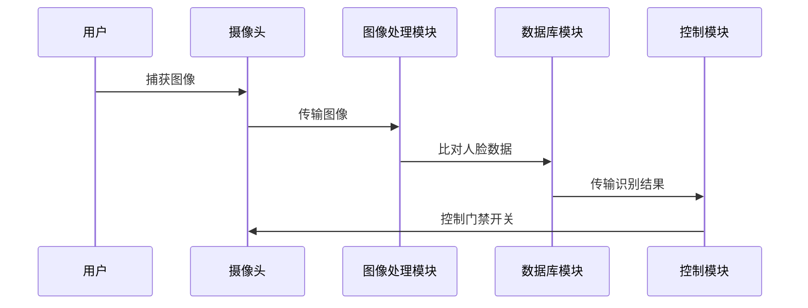
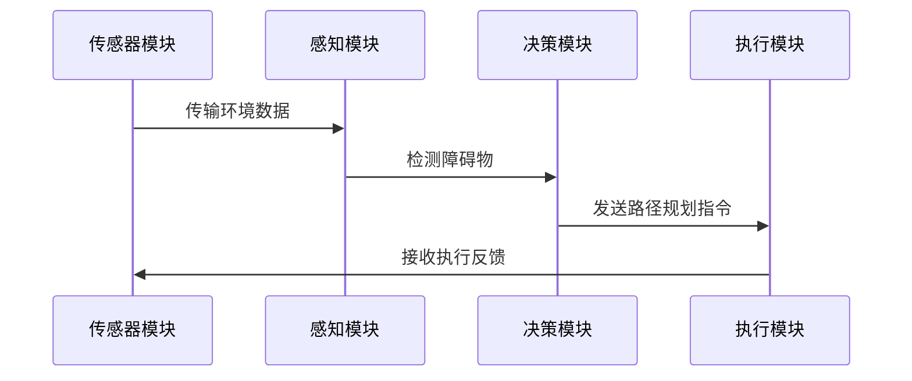
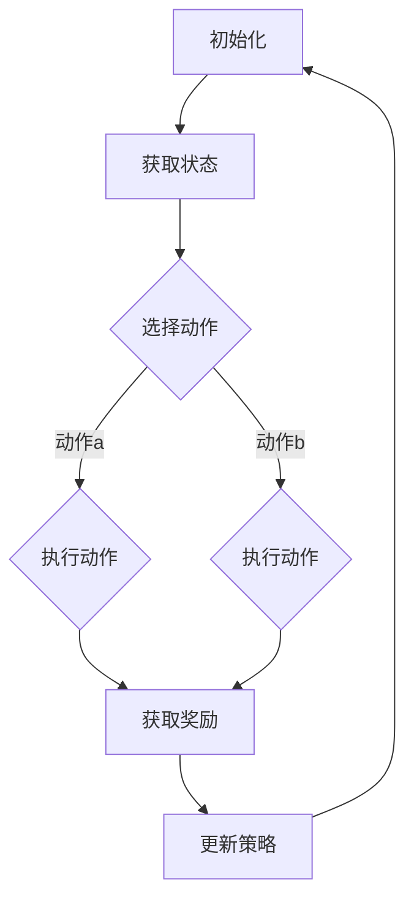
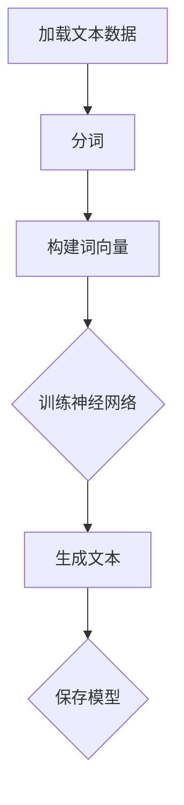
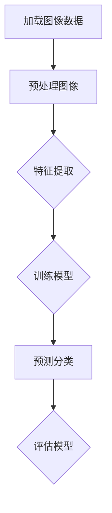

                 


# AI时代编程的新维度与新未来

## 关键词

- **AI编程**
- **机器学习**
- **深度学习**
- **强化学习**
- **自然语言处理**
- **计算机视觉**
- **编程语言**

## 摘要

随着人工智能（AI）技术的飞速发展，编程语言和工具也在不断地演变。本文将深入探讨AI时代编程的新维度和新未来，包括强化学习与决策编程、自然语言处理与对话编程、计算机视觉与图像编程等前沿领域。通过逐步分析推理，我们将揭示AI编程的核心概念、联系与架构设计，展望其未来发展趋势和最佳实践。

### 目录大纲

----------------------------------------------------------------

## 第一部分: 背景与概述

### 第1章: AI时代编程的背景与挑战

#### 1.1.1 AI时代的编程变革

#### 1.1.2 编程在AI时代的核心角色

#### 1.1.3 AI编程面临的挑战与机遇

### 第2章: AI编程的基础概念

#### 2.1.1 人工智能简史

#### 2.1.2 机器学习与深度学习的基本概念

#### 2.1.3 AI编程的核心算法

### 第3章: 编程语言与工具

#### 3.1.1 常见的AI编程语言

#### 3.1.2 AI编程工具与框架

#### 3.1.3 编程语言的选择与优化

----------------------------------------------------------------

## 第一部分: 背景与概述

### 第1章: AI时代编程的背景与挑战

#### 1.1.1 AI时代的编程变革

在过去的几十年中，编程一直被视为一种实现计算机自动化任务的技术手段。然而，随着人工智能（AI）技术的兴起，编程的内涵和外延都发生了深刻的变革。

首先，AI时代的编程不再仅仅是编写代码以实现既定的算法和逻辑，它更多地涉及到如何让计算机自主学习、自主决策和自主进化。这就要求程序员们不仅要掌握传统的编程语言和工具，还需要深入了解AI领域的基础知识和最新进展。

其次，AI时代的编程更加强调跨界和综合能力。例如，一个优秀的AI程序员不仅需要掌握Python、Java等编程语言，还需要熟悉机器学习、深度学习、自然语言处理、计算机视觉等AI相关技术。这种综合性的能力要求程序员们具备更广泛的知识面和更强的学习适应能力。

最后，AI时代的编程还面临着数据安全和隐私保护的挑战。随着越来越多的数据被收集和使用，如何确保数据的安全性和用户隐私成为了一个重要的议题。程序员们需要在设计和实现AI系统时，充分考虑这些因素，确保系统的可靠性和合规性。

#### 1.1.2 编程在AI时代的核心角色

在AI时代，编程的核心角色可以概括为以下几点：

1. **算法实现**：编程是AI算法实现的基础。无论是传统的机器学习算法，还是前沿的深度学习算法，都需要通过编程来实现。程序员们需要掌握各种算法的实现细节和优化技巧，以提高系统的性能和效率。

2. **系统设计**：编程在AI系统中起着至关重要的作用。程序员们需要根据具体的应用场景，设计出高效的系统架构，确保系统可以稳定、可靠地运行。

3. **数据处理**：在AI系统中，数据处理是一个非常重要的环节。程序员们需要掌握各种数据处理技术，如数据清洗、数据预处理、特征提取等，以确保数据的质量和可靠性。

4. **模型训练与优化**：在AI系统中，模型训练和优化是提高系统性能的关键。程序员们需要熟练掌握各种模型训练和优化的方法，如批量归一化、dropout、学习率调整等。

5. **系统集成与部署**：编程不仅在算法实现和系统设计方面起到核心作用，还在系统集成与部署方面起着关键作用。程序员们需要确保各个组件可以无缝集成，并能够在实际环境中稳定运行。

#### 1.1.3 AI编程面临的挑战与机遇

虽然AI编程面临着诸多挑战，但同时也带来了巨大的机遇。以下是一些关键的挑战和机遇：

**挑战：**

1. **复杂性**：AI编程涉及到多种技术领域，如机器学习、深度学习、自然语言处理、计算机视觉等。程序员们需要具备跨学科的知识和技能，以应对这种复杂性。

2. **数据隐私**：随着数据的收集和使用越来越普遍，如何保护用户隐私成为一个重要挑战。程序员们需要在设计和实现AI系统时，充分考虑数据隐私保护的问题。

3. **性能优化**：AI系统的性能优化是一个持续的过程。程序员们需要不断尝试新的优化方法，以提高系统的效率和性能。

**机遇：**

1. **创新空间**：AI编程为程序员们提供了广阔的创新空间。他们可以设计和实现各种新颖的AI应用，如自动驾驶、智能助手、医疗诊断等。

2. **职业发展**：随着AI技术的普及，AI编程成为了许多公司和研究机构的热门领域。程序员们有机会参与到各种前沿项目中，实现自己的职业梦想。

3. **社会影响**：AI编程不仅为程序员们提供了职业发展机会，还可以为社会带来巨大的影响。通过AI编程，程序员们可以设计和实现各种社会价值的应用，如环境保护、医疗健康、教育等。

总的来说，AI编程既是挑战，也是机遇。程序员们需要不断学习、探索和适应，以在这个新的时代中取得成功。

### 第2章: AI编程的基础概念

#### 2.1.1 人工智能简史

人工智能（AI）是计算机科学的一个分支，旨在使计算机模拟人类智能行为。人工智能的概念可以追溯到20世纪50年代，当时计算机科学家们开始探讨机器能否表现出类似于人类的智能。

**早期探索**：

- **1950年**：艾伦·图灵提出了“图灵测试”，用于评估机器是否具有智能。图灵测试的基本思想是，如果一个机器在与人类的对话中无法被区分出来，那么它就可以被认为具有智能。

- **1956年**：达特茅斯会议被认为是人工智能的诞生日。会议上，约翰·麦卡锡、马文·明斯基、克劳德·香农等人提出了人工智能的基本概念和研究方向。

**重要里程碑**：

- **20世纪60年代**：人工智能的研究主要集中在知识表示和推理技术上。这个时期，专家系统成为了一个重要的研究方向。

- **20世纪80年代**：随着计算机性能的提高和数据库技术的发展，知识工程成为人工智能的一个重要领域。专家系统在医疗诊断、金融咨询等领域得到了广泛应用。

- **21世纪**：深度学习和大数据技术的崛起，使得人工智能取得了显著的进展。尤其是深度学习在图像识别、语音识别、自然语言处理等领域的突破，使得人工智能进入了一个新的时代。

**人工智能的发展阶段**：

- **第一阶段（1956-1969年）**：基础理论探索阶段。这一阶段的主要任务是建立人工智能的基本理论和研究方法。

- **第二阶段（1970-1980年）**：知识工程阶段。这一阶段的主要任务是开发专家系统，使其能够模拟人类专家的决策过程。

- **第三阶段（1980-1990年）**：人工智能应用阶段。这一阶段的主要任务是推广人工智能技术在各个领域的应用。

- **第四阶段（1990年至今）**：智能化应用阶段。这一阶段的主要任务是利用人工智能技术解决复杂的实际问题，如自动驾驶、智能家居、智能医疗等。

#### 2.1.2 机器学习与深度学习的基本概念

**机器学习（ML）**：

机器学习是一种人工智能技术，使计算机通过数据学习和改进性能。机器学习的基本思想是通过学习数据中的模式，从而能够对未知数据进行预测或分类。

**深度学习（DL）**：

深度学习是一种特殊的机器学习方法，基于多层神经网络。深度学习通过层层提取数据中的特征，从而能够处理更复杂的问题。

**机器学习与深度学习的联系**：

- **机器学习是深度学习的基础**：深度学习是基于多层神经网络的一种特殊机器学习方法。没有机器学习的基础，深度学习难以实现。

- **深度学习是机器学习的深化**：深度学习通过引入多层神经网络，能够处理更复杂的问题，从而推动了机器学习的发展。

**机器学习与深度学习的区别**：

- **模型复杂度**：机器学习模型通常比较简单，而深度学习模型更加复杂，具有多层神经网络。

- **数据需求**：机器学习模型对数据的要求相对较低，而深度学习模型需要大量的数据才能训练。

- **应用领域**：机器学习在各个领域都有广泛的应用，而深度学习在图像识别、语音识别、自然语言处理等领域取得了显著的突破。

#### 2.1.3 AI编程的核心算法

AI编程涉及多种核心算法，其中一些重要的算法包括：

**监督学习**：

监督学习是一种机器学习算法，通过已知输入和输出数据来训练模型，从而对未知数据进行预测。监督学习的核心是损失函数和优化算法。

**无监督学习**：

无监督学习是一种机器学习算法，通过未知输入数据来训练模型，从而发现数据中的模式。无监督学习的核心是聚类算法和降维算法。

**强化学习**：

强化学习是一种机器学习算法，通过奖励和惩罚来改善决策。强化学习的核心是价值函数和策略优化。

**自然语言处理**：

自然语言处理是一种人工智能技术，使计算机理解和生成人类语言。自然语言处理的核心是词向量、序列模型和注意力机制。

**计算机视觉**：

计算机视觉是一种人工智能技术，使计算机理解和解释图像和视频。计算机视觉的核心是卷积神经网络和生成对抗网络。

这些算法是AI编程的核心，程序员们需要熟练掌握它们，才能设计和实现各种AI应用。

### 第3章: 编程语言与工具

#### 3.1.1 常见的AI编程语言

在AI编程领域，常见的编程语言包括Python、Java、C++等。每种语言都有其独特的优势和适用场景。

**Python**：

Python是一种高级编程语言，因其简洁、易读、功能强大而广受欢迎。Python在AI编程中有广泛的应用，主要原因是它拥有丰富的库和框架，如NumPy、Pandas、Scikit-learn、TensorFlow和PyTorch等。

**Java**：

Java是一种面向对象的高级编程语言，因其稳定、安全、跨平台而得到广泛应用。Java在AI编程中主要用于大型分布式系统的开发，如Apache Mahout、DeepJavaLibrary等。

**C++**：

C++是一种高效的编程语言，因其高性能和灵活性而得到青睐。C++在AI编程中主要用于需要高性能计算的领域，如深度学习框架Caffe、MXNet等。

**Python、Java和C++的比较**：

- **易用性**：Python因其简洁和易读性而最受欢迎，Java次之，C++最复杂。

- **性能**：C++在性能方面具有显著优势，Java次之，Python最差。

- **生态系统**：Python拥有最丰富的库和框架，Java次之，C++相对较少。

#### 3.1.2 AI编程工具与框架

AI编程需要使用各种工具和框架来简化开发过程和提高效率。以下是一些常见的工具和框架：

**TensorFlow**：

TensorFlow是一个由Google开发的开放源代码深度学习框架，广泛应用于图像识别、语音识别、自然语言处理等领域。TensorFlow提供了丰富的API和工具，使开发者可以轻松构建和训练深度学习模型。

**PyTorch**：

PyTorch是一个由Facebook开发的深度学习框架，以其动态计算图和灵活的API而受到开发者青睐。PyTorch在计算机视觉、自然语言处理等领域取得了显著成果。

**Keras**：

Keras是一个基于TensorFlow和Theano的高层神经网络API，以其简洁和易用性而广受欢迎。Keras提供了丰富的预训练模型和工具，使开发者可以快速构建和训练神经网络。

**Scikit-learn**：

Scikit-learn是一个基于Python的开源机器学习库，提供了丰富的机器学习算法和工具。Scikit-learn广泛应用于分类、回归、聚类、模型评估等领域。

**其他工具与框架**：

- **Theano**：一个基于Python的深度学习框架，已被TensorFlow和PyTorch取代。
- **Apache Mahout**：一个基于Hadoop的分布式机器学习库。
- **Caffe**：一个基于C++的深度学习框架，适用于图像识别和视觉应用。
- **MXNet**：一个由Apache软件基金会开发的深度学习框架，适用于多种编程语言。

#### 3.1.3 编程语言的选择与优化

选择合适的编程语言对于AI编程至关重要。以下是一些选择编程语言时需要考虑的因素：

- **项目需求**：根据项目的需求，选择适合的编程语言。例如，如果项目需要高性能计算，C++可能是更好的选择；如果项目需要快速开发，Python可能更适合。
- **开发者技能**：考虑开发团队的技能和熟悉程度。选择团队熟悉和擅长的编程语言，可以提高开发效率。
- **生态系统**：选择具有丰富库和框架的编程语言，可以简化开发过程和提高效率。
- **性能**：根据项目的性能要求，选择适合的编程语言。例如，如果项目需要处理大量数据，Python可能不够高效，而C++可能更适合。
- **维护性**：选择易于维护和扩展的编程语言，可以降低后期维护成本。

优化编程语言的方法包括：

- **代码优化**：通过优化算法和数据结构，提高代码的执行效率。
- **并行计算**：利用多核处理器和GPU，提高计算性能。
- **缓存与缓存**：利用缓存技术，减少重复计算和数据访问。
- **内存管理**：合理管理内存，避免内存泄漏和性能下降。

选择和优化编程语言是AI编程成功的关键。开发者需要根据具体项目需求和团队技能，选择合适的编程语言，并采取有效的优化方法，以提高开发效率和应用性能。

## 第二部分: AI编程的新维度

### 第4章: 强化学习与决策编程

#### 4.1.1 强化学习的基础原理

强化学习（Reinforcement Learning, RL）是一种机器学习方法，通过奖励和惩罚来指导智能体（agent）在环境（environment）中决策，从而实现最优行为。强化学习的基本概念包括智能体、环境、状态、动作、奖励和策略。

**智能体（Agent）**：智能体是一个具有自主决策能力的实体，它可以接收环境的信息，并采取行动。

**环境（Environment）**：环境是一个智能体行动的场所，它可以向智能体提供状态信息，并对智能体的动作做出反馈。

**状态（State）**：状态是环境的一个描述，它决定了智能体可以采取哪些动作。

**动作（Action）**：动作是智能体在特定状态下采取的行动。

**奖励（Reward）**：奖励是环境对智能体动作的反馈，它可以是正面的（鼓励智能体继续采取该动作）或负面的（惩罚智能体采取该动作）。

**策略（Policy）**：策略是智能体根据状态选择动作的规则。

**强化学习的基本过程**：

1. 初始化：智能体开始在一个环境中，随机选择一个状态。
2. 行动：智能体根据当前状态选择一个动作。
3. 观察：环境根据智能体的动作，更新状态并提供奖励。
4. 反馈：智能体根据奖励调整策略，选择下一个动作。
5. 重复：智能体不断重复上述过程，以实现最优行为。

**强化学习的主要算法**：

1. **Q学习（Q-Learning）**：Q学习是一种基于价值迭代的强化学习算法，通过估计每个状态-动作对的期望奖励，来指导智能体的决策。

   - **Q值（Q-Value）**：Q值表示在特定状态下采取特定动作的期望奖励。
   - **更新规则**：Q值通过经验更新规则进行调整，公式为：
     $$ Q(s, a) \leftarrow Q(s, a) + \alpha [r + \gamma \max_{a'} Q(s', a') - Q(s, a)] $$
     其中，$ \alpha $为学习率，$ \gamma $为折扣因子。

2. **深度Q网络（Deep Q-Network, DQN）**：DQN是一种基于深度学习的强化学习算法，通过神经网络估计Q值。

   - **神经网络**：DQN使用一个卷积神经网络来估计Q值，从而处理高维状态空间。
   - **经验回放**：DQN使用经验回放机制，防止智能体陷入局部最优。

3. **策略梯度算法（Policy Gradient）**：策略梯度算法通过直接优化策略来指导智能体的决策。

   - **策略网络**：策略网络是一个概率分布模型，表示智能体在特定状态下采取特定动作的概率。
   - **损失函数**：策略梯度算法的损失函数为策略网络的期望回报，公式为：
     $$ L(\theta) = -\mathbb{E}_{s, a}[\log \pi(a|s; \theta) \cdot r] $$
     其中，$ \theta $为策略网络的参数。

#### 4.1.2 强化学习在编程中的应用

强化学习在编程中有着广泛的应用，以下是一些典型的应用场景：

**游戏AI**：

强化学习在游戏AI中取得了显著的成果。例如，深度Q网络（DQN）被用于开发《Atari》游戏，如《Pong》和《Q*BERT》等。通过强化学习，智能体可以学会玩这些游戏，并在一定程度上超越人类玩家的表现。

**自动驾驶**：

自动驾驶是强化学习的一个重要应用领域。自动驾驶系统需要智能体在复杂的交通环境中做出实时决策，以保持车辆的安全行驶。强化学习算法可以帮助自动驾驶系统学习最佳驾驶策略，提高行驶效率和安全性。

**推荐系统**：

推荐系统是另一个典型的强化学习应用。通过强化学习，推荐系统可以学习用户的行为模式，并推荐用户可能感兴趣的商品或内容。例如，Netflix和YouTube等平台就使用了强化学习算法来优化推荐系统。

**机器人控制**：

强化学习在机器人控制中也得到了广泛应用。通过强化学习，机器人可以学会在各种环境中执行复杂的任务，如自主移动、抓取物体、导航等。

**强化学习在编程中的应用案例**：

1. **游戏AI**：

   - **案例**：《Atari》游戏中的智能体训练。
   - **实现**：使用DQN算法训练智能体，通过经验回放和目标网络来提高智能体的性能。

2. **自动驾驶**：

   - **案例**：Waymo的自动驾驶系统。
   - **实现**：使用深度强化学习算法，如深度确定性策略梯度（DDPG），来训练自动驾驶模型，通过大量模拟和实际道路测试来优化驾驶策略。

3. **推荐系统**：

   - **案例**：Netflix的推荐系统。
   - **实现**：使用强化学习算法，如演员-评论家（AC）算法，来优化推荐策略，提高用户满意度。

4. **机器人控制**：

   - **案例**：波士顿动力公司的机器人。
   - **实现**：使用强化学习算法，如深度强化学习（DRL），来训练机器人执行复杂任务，如跳跃、奔跑和搬运物体。

#### 4.1.3 决策编程的核心概念与实现

决策编程是AI编程中的一个重要领域，它涉及到如何设计和实现智能体的决策过程。以下是一些核心概念和实现方法：

**决策树（Decision Tree）**：

决策树是一种常用的决策模型，它通过一系列的测试来划分数据集，从而实现分类或回归。决策树的核心是节点和边。每个节点表示一个特征测试，每个边表示测试结果。

**实现**：

- **递归划分**：通过递归划分数据集，直到满足停止条件（如最小叶节点大小或最大深度）。
- **信息增益**：选择具有最大信息增益的特征进行划分，以最大化数据的纯度。

**随机森林（Random Forest）**：

随机森林是一种集成学习方法，它通过构建多棵决策树，并对它们的结果进行投票来得到最终决策。随机森林的核心是树的数量和特征选择。

**实现**：

- **Bootstrap抽样**：对训练数据集进行抽样，构建多个子数据集。
- **随机特征选择**：在每棵决策树中，从一组特征中随机选择一部分特征进行划分。
- **集成投票**：对多棵决策树的结果进行投票，得到最终决策。

**支持向量机（SVM）**：

支持向量机是一种用于分类和回归的线性模型，它通过找到一个最佳的超平面来最大化分类间隔。

**实现**：

- **核函数**：通过核函数将低维数据映射到高维空间，找到一个最佳的超平面。
- **软-margin SVM**：通过引入松弛变量，允许一些数据点在超平面上。

**实现代码示例**（Python）：

```python
# 决策树实现
from sklearn.tree import DecisionTreeClassifier
clf = DecisionTreeClassifier()
clf.fit(X_train, y_train)

# 随机森林实现
from sklearn.ensemble import RandomForestClassifier
clf = RandomForestClassifier()
clf.fit(X_train, y_train)

# 支持向量机实现
from sklearn.svm import SVC
clf = SVC()
clf.fit(X_train, y_train)
```

**决策编程在AI编程中的应用**：

- **分类问题**：通过决策树、随机森林和支持向量机等算法，实现分类任务。
- **回归问题**：通过决策树和支持向量机等算法，实现回归任务。
- **推荐系统**：通过决策树和随机森林等算法，实现基于内容的推荐和协同过滤推荐。

通过以上实现，我们可以看到决策编程在AI编程中的应用和实现方法。决策编程是AI编程中的重要组成部分，通过设计和实现智能体的决策过程，我们可以开发出更加智能和高效的AI系统。

### 第5章: 自然语言处理与对话编程

#### 5.1.1 自然语言处理的基本概念

自然语言处理（Natural Language Processing, NLP）是人工智能（AI）领域的一个重要分支，它旨在使计算机理解和生成人类语言。NLP的应用非常广泛，包括机器翻译、语音识别、情感分析、文本生成等。

**语言模型（Language Model）**：

语言模型是一种概率模型，用于预测一段文本的下一个单词或字符。最常见的语言模型是n-gram模型，它基于单词或字符的历史序列来预测下一个单词或字符。

**词嵌入（Word Embedding）**：

词嵌入是将单词转换为向量表示的方法，从而在低维空间中表示单词。词嵌入可以捕获单词的语义和语法信息，例如，词向量可以让计算机理解“狗”和“猫”是相似的，而“狗”和“汽车”是不相似的。

**序列模型（Sequential Model）**：

序列模型是一种处理序列数据的神经网络模型，例如，RNN（递归神经网络）和LSTM（长短期记忆网络）。这些模型可以捕获文本中的时序信息，例如，理解“我爱我的狗”和“我的狗爱我”是不同的句子。

**注意力机制（Attention Mechanism）**：

注意力机制是一种神经网络架构，用于提高模型在处理序列数据时的性能。注意力机制可以让模型关注输入序列中最重要的部分，从而提高模型的准确性和效率。

**实现代码示例**（Python）：

```python
# 语言模型实现
from keras.preprocessing.sequence import pad_sequences
from keras.models import Sequential
from keras.layers import Embedding, LSTM, Dense

# 加载和处理数据
sequences = load_data()
padded_sequences = pad_sequences(sequences, maxlen=max_length)

# 构建语言模型
model = Sequential()
model.add(Embedding(vocabulary_size, embedding_dim))
model.add(LSTM(units=128, dropout=0.2, recurrent_dropout=0.2))
model.add(Dense(units=1, activation='sigmoid'))

# 编译模型
model.compile(optimizer='adam', loss='binary_crossentropy', metrics=['accuracy'])

# 训练模型
model.fit(padded_sequences, y_train, epochs=10, batch_size=128)
```

**NLP在AI编程中的应用**：

- **机器翻译**：利用NLP技术将一种语言翻译成另一种语言，例如，谷歌翻译和百度翻译。
- **语音识别**：将语音信号转换为文本，例如，苹果的Siri和亚马逊的Alexa。
- **情感分析**：分析文本中的情感倾向，例如，社交媒体情绪分析和消费者反馈分析。
- **文本生成**：根据输入的文本或提示生成新的文本，例如，自动摘要和自动写作。

#### 5.1.2 对话编程的挑战与实现

对话编程是NLP中的一个重要分支，它涉及到如何设计和实现与人类进行自然对话的AI系统。对话编程的挑战包括：

- **理解自然语言**：对话编程系统需要理解用户的自然语言输入，并能够将其转换为计算机可以理解的形式。
- **生成自然语言**：对话编程系统需要能够根据用户的需求和上下文生成自然、流畅的回复。
- **多轮对话**：对话编程系统需要能够处理多轮对话，并保持对话的连贯性和一致性。
- **上下文理解**：对话编程系统需要能够理解对话的上下文，并能够根据上下文生成合适的回复。

**对话系统架构**：

- **用户界面**：用户界面是用户与对话系统交互的入口，可以是文本聊天窗口、语音交互界面等。
- **对话管理器**：对话管理器是对话编程系统的核心组件，负责处理用户的输入、生成回复、维护对话状态。
- **自然语言处理模块**：自然语言处理模块负责对用户的输入进行处理，包括语音识别、文本解析、意图识别等。
- **对话生成模块**：对话生成模块负责根据对话管理器的状态和用户输入，生成自然、流畅的回复。

**实现代码示例**（Python）：

```python
# 对话系统实现
import nltk
from nltk.chat.util import Chat, reflections

# 加载对话数据
pairs = load_dialog_data()

# 创建对话系统
chatbot = Chat(pairs, reflections)

# 开始对话
print("你好，我可以帮助你吗？")
while True:
    user_input = input("你： ")
    if user_input.lower() in ['quit', 'exit', 'bye', 'goodbye']:
        print("对话系统： 再见！")
        break
    response = chatbot.get_response(user_input)
    print("对话系统：", response)
```

**对话编程的应用场景**：

- **客服聊天机器人**：用于自动回答客户的常见问题，提高客户服务效率。
- **智能助手**：如苹果的Siri和亚马逊的Alexa，帮助用户进行日程管理、信息查询等。
- **虚拟聊天伙伴**：为用户提供虚拟的聊天对象，用于社交互动和情感支持。

通过以上实现，我们可以看到对话编程的挑战和实现方法。对话编程是NLP和AI领域的一个重要方向，它为人们提供了更便捷、更自然的交互方式。

### 第5章: 自然语言处理与对话编程

#### 5.1.1 自然语言处理的基本概念

自然语言处理（Natural Language Processing，NLP）是人工智能（Artificial Intelligence，AI）领域中与语言理解和生成相关的一门技术。它的目标是通过计算机程序实现人类语言的理解和生成。以下是NLP中的几个关键概念：

**文本预处理**：

文本预处理是NLP任务中的第一步，主要包括去除标点符号、小写化、去除停用词、分词、词性标注等。这些步骤有助于简化输入文本，使其更适合后续处理。

**词向量**：

词向量是将单词表示为向量的一种方法，用于捕捉单词的语义信息。常见的词向量模型包括Word2Vec、GloVe和BERT。词向量可以用于文本分类、情感分析、机器翻译等任务。

**命名实体识别（NER）**：

命名实体识别是识别文本中具有特定意义的实体，如人名、地名、组织名、时间等。NER是信息提取和文本分析的重要任务。

**情感分析**：

情感分析旨在确定文本中的情感倾向，如正面、负面或中性。它广泛应用于社交媒体分析、产品评论分析等领域。

**文本生成**：

文本生成是指利用NLP技术生成新的文本。常见的文本生成模型包括序列到序列（Seq2Seq）模型、生成对抗网络（GAN）和变分自编码器（VAE）。

**实现代码示例**（Python）：

```python
# 词向量实现
from gensim.models import Word2Vec

# 加载文本数据
sentences = load_sentences()

# 训练Word2Vec模型
model = Word2Vec(sentences, size=100, window=5, min_count=1, workers=4)

# 查询词向量
vector = model.wv['hello']
```

**NLP在AI编程中的应用**：

- **信息提取**：用于从大量文本数据中提取关键信息，如地址、电话号码、电子邮件等。
- **文本分类**：用于将文本数据分类到预定义的类别中，如新闻分类、垃圾邮件检测等。
- **聊天机器人**：用于实现与用户的自然对话，如客服聊天机器人、智能助手等。
- **机器翻译**：用于将一种语言翻译成另一种语言，如谷歌翻译、百度翻译等。

#### 5.1.2 对话编程的挑战与实现

对话编程（Dialogue Programming）是NLP中的一个重要方向，旨在实现智能对话系统。以下是对话编程中的一些关键挑战和实现方法：

**挑战**：

- **上下文理解**：对话系统需要理解对话的上下文，以生成连贯和相关的回复。
- **多轮对话**：对话系统需要能够处理多轮对话，并保持对话的连贯性和一致性。
- **理解自然语言**：对话系统需要能够理解用户的自然语言输入，并生成自然、流畅的回复。
- **情感智能**：对话系统需要能够识别和模拟人类的情感，以提供更好的用户体验。

**实现方法**：

- **基于规则的方法**：使用预定义的规则来生成回复，这种方法简单但灵活性和泛化能力有限。
- **基于机器学习的方法**：使用机器学习模型，如序列到序列（Seq2Seq）模型和变换器生成模型（Transformer），来生成回复。这种方法具有更好的泛化能力和上下文理解能力。
- **多轮对话管理**：使用对话管理器（Dialogue Manager）来维护对话状态，处理多轮对话。对话管理器可以根据对话历史和当前输入生成合适的回复。

**对话系统架构**：

1. **用户界面**：用户界面是用户与对话系统交互的入口，可以是文本聊天窗口、语音交互界面等。
2. **对话管理器**：对话管理器是对话编程系统的核心组件，负责处理用户的输入、生成回复、维护对话状态。
3. **自然语言处理模块**：自然语言处理模块负责对用户的输入进行处理，包括语音识别、文本解析、意图识别等。
4. **对话生成模块**：对话生成模块负责根据对话管理器的状态和用户输入，生成自然、流畅的回复。

**实现代码示例**（Python）：

```python
# 对话系统实现
import nltk
from nltk.chat.util import Chat, reflections

# 加载对话数据
pairs = load_dialog_data()

# 创建对话系统
chatbot = Chat(pairs, reflections)

# 开始对话
print("你好，我可以帮助你吗？")
while True:
    user_input = input("你： ")
    if user_input.lower() in ['quit', 'exit', 'bye', 'goodbye']:
        print("对话系统： 再见！")
        break
    response = chatbot.get_response(user_input)
    print("对话系统：", response)
```

**对话编程的应用场景**：

- **客服聊天机器人**：自动回答客户的常见问题，提高客户服务效率。
- **智能助手**：帮助用户进行日程管理、信息查询等。
- **虚拟聊天伙伴**：为用户提供虚拟的聊天对象，进行社交互动和情感支持。

通过以上实现，我们可以看到对话编程的挑战和实现方法。对话编程是NLP和AI领域的一个重要方向，它为人们提供了更便捷、更自然的交互方式。

### 第6章: 计算机视觉与图像编程

#### 6.1.1 计算机视觉的基本原理

计算机视觉（Computer Vision，CV）是人工智能（Artificial Intelligence，AI）的一个重要分支，旨在使计算机能够理解和解释图像和视频。计算机视觉的基本原理包括图像获取、图像处理和图像理解。

**图像获取**：

图像获取是计算机视觉的基础。摄像头和其他图像传感器用于捕获现实世界的图像。这些图像可以是静态的，也可以是动态的。

**图像处理**：

图像处理是对图像进行操作和处理的过程，以提取有用的信息或改善图像质量。常见的图像处理技术包括滤波、边缘检测、特征提取等。

**图像理解**：

图像理解是计算机视觉的最高层次，它涉及到对图像中的对象、场景和动作的理解。图像理解的任务包括对象识别、场景识别、动作识别等。

**计算机视觉的关键技术**：

- **图像特征提取**：特征提取是将图像中的像素信息转换为更高层次的特征表示的过程。常见的特征提取方法包括SIFT、HOG、CNN等。
- **目标检测**：目标检测是在图像中识别和定位特定对象的过程。常见的目标检测算法包括YOLO、SSD、Faster R-CNN等。
- **图像分类**：图像分类是将图像分为预定义的类别的过程。常见的图像分类算法包括softmax、SVM、CNN等。
- **图像分割**：图像分割是将图像划分为不同区域的过程。常见的图像分割算法包括区域生长、阈值分割、边缘检测等。

**实现代码示例**（Python）：

```python
# 目标检测实现
import cv2
import numpy as np

# 加载预训练的模型
model = cv2.dnn.readNetFromTensorFlow('path/to/模型文件')

# 加载图像
image = cv2.imread('path/to/图像文件')

# 调整图像大小
scale = 0.5
image = cv2.resize(image, None, fx=scale, fy=scale, interpolation=cv2.INTER_AREA)

# 转换图像为Blob
blob = cv2.dnn.blobFromImage(image, 1.0, (320, 320), [104, 117, 123], True, False)

# 前向传播
model.setInput(blob)
detections = model.forward()

# 遍历检测到的对象
for i in range(detections.shape[2]):
    confidence = detections[0, 0, i, 2]
    if confidence > 0.5:
        # 获取对象的位置和类别
        box = detections[0, 0, i, 3:7] * np.array([image.shape[1], image.shape[0], image.shape[1], image.shape[0]])
        (x, y, w, h) = box.astype("int")
        label = detections[0, 0, i, 1]

        # 绘制边框和标签
        cv2.rectangle(image, (x, y), (x + w, y + h), (0, 255, 0), 2)
        text = "{}: {:.2f}%".format(label, confidence * 100)
        cv2.putText(image, text, (x, y - 5), cv2.FONT_HERSHEY_SIMPLEX, 0.5, (0, 0, 255), 2)

# 显示图像
cv2.imshow('image', image)
cv2.waitKey(0)
cv2.destroyAllWindows()
```

**计算机视觉在AI编程中的应用**：

- **图像识别**：用于识别图像中的对象和场景，如人脸识别、车辆识别等。
- **图像分类**：用于将图像分类到预定义的类别中，如植物分类、动物分类等。
- **图像分割**：用于将图像分割为不同的区域，如医学图像分割、卫星图像分割等。
- **动作识别**：用于识别图像中的动作，如体育动作识别、行为分析等。

通过以上实现，我们可以看到计算机视觉的基本原理和技术。计算机视觉在AI编程中有着广泛的应用，为人们提供了更智能的图像处理和识别能力。

### 第6章: 计算机视觉与图像编程

#### 6.1.2 图像编程的核心技术与应用

图像编程在计算机视觉领域占据着核心地位，其核心技术包括图像处理、图像识别和图像分割。这些技术不仅能够处理静态图像，还能用于动态视频的处理和分析。

**图像处理**：

图像处理是对图像进行编辑和增强的过程，以提取有用信息或改善图像质量。核心算法包括：

- **滤波**：如高斯滤波、中值滤波等，用于去除图像中的噪声。
- **边缘检测**：如Canny边缘检测，用于识别图像中的边缘。
- **形态学操作**：如腐蚀、膨胀、开运算和闭运算，用于去除图像中的噪声和分离对象。

**图像识别**：

图像识别旨在识别图像中的对象和场景，常见的技术包括：

- **特征提取**：如SIFT、SURF、HOG等，用于将图像中的像素信息转换为更高层次的特征表示。
- **分类算法**：如支持向量机（SVM）、神经网络（NN）和卷积神经网络（CNN），用于分类图像中的对象。

**图像分割**：

图像分割是将图像分割为不同的区域，以提取感兴趣的部分。常见的方法包括：

- **阈值分割**：根据图像的灰度值将图像分割成不同的区域。
- **区域生长**：从初始种子点开始，逐步扩展至相似像素，形成区域。
- **边缘检测**：通过检测图像中的边缘来分割图像。

**实现代码示例**（Python）：

```python
# 使用OpenCV进行图像处理
import cv2
import numpy as np

# 读取图像
image = cv2.imread('image.jpg', cv2.IMREAD_GRAYSCALE)

# 高斯滤波
gauss_image = cv2.GaussianBlur(image, (5, 5), 0)

# Canny边缘检测
edges = cv2.Canny(gauss_image, 50, 150)

# 阈值分割
_, thresh = cv2.threshold(image, 128, 255, cv2.THRESH_BINARY + cv2.THRESH_OTSU)

# 区域生长
seed = np.array([50, 50], dtype=np.int32)
area = cv2.floodFill(image, None, seed, 255)

# 显示结果
cv2.imshow('Original Image', image)
cv2.imshow('Gaussian Blur', gauss_image)
cv2.imshow('Canny Edges', edges)
cv2.imshow('Thresholded Image', thresh)
cv2.imshow('Area Growth', area)
cv2.waitKey(0)
cv2.destroyAllWindows()
```

**图像编程的应用**：

- **医学图像分析**：用于识别病变、评估病情等。
- **安全监控**：用于人脸识别、行为分析等。
- **自动驾驶**：用于环境感知、路径规划等。
- **艺术创作**：用于生成抽象艺术、模拟自然景观等。

通过以上实现，我们可以看到图像编程在计算机视觉中的应用和重要性。图像编程技术为各种领域提供了强大的图像处理和分析能力，推动了计算机视觉技术的发展和应用。

### 第6章: 计算机视觉与图像编程

#### 6.1.3 计算机视觉在编程中的实战案例

计算机视觉在编程中有着广泛的应用，以下是一些具体的实战案例，通过这些案例，我们可以深入了解计算机视觉技术的实际应用和实现过程。

**案例1：人脸识别门禁系统**

**项目介绍**：

人脸识别门禁系统是一种基于计算机视觉和机器学习技术的安全监控系统，通过识别用户的人脸来控制门禁权限。

**系统功能设计**：

1. **图像捕获**：使用摄像头实时捕获用户图像。
2. **人脸检测**：使用深度学习模型进行人脸检测，提取人脸区域。
3. **人脸识别**：使用预训练的人脸识别模型对捕获到的人脸图像进行识别，与数据库中的人脸数据进行比对。
4. **权限控制**：根据识别结果控制门禁开关。

**系统架构设计**：

- **前端摄像头**：用于捕获用户图像。
- **图像处理模块**：用于人脸检测和识别。
- **数据库模块**：用于存储用户人脸数据和权限信息。
- **控制模块**：根据识别结果控制门禁系统。

**系统接口设计**：

- **图像捕获接口**：用于捕获用户图像。
- **人脸检测接口**：用于检测人脸区域。
- **人脸识别接口**：用于识别用户人脸。
- **权限控制接口**：用于控制门禁系统。

**系统交互mermaid序列图**：



**实际案例分析和详细讲解**：

1. **图像捕获**：使用USB摄像头捕获用户图像，图像数据以实时流的形式传输给图像处理模块。

2. **人脸检测**：使用深度学习模型（如MTCNN）对捕获的图像进行人脸检测，提取出人脸区域。

3. **人脸识别**：将检测到的人脸图像与数据库中的人脸数据进行比对，使用预训练的人脸识别模型（如FaceNet、VGGFace）进行匹配。

4. **权限控制**：根据人脸识别结果，控制门禁系统的开关。如果识别成功，门禁系统会打开，否则保持关闭。

**项目小结**：

人脸识别门禁系统是一个典型的计算机视觉应用案例，它通过图像捕获、人脸检测、人脸识别和权限控制等模块，实现了基于人脸识别的安全监控功能。该项目展示了计算机视觉技术在实际场景中的应用，具有较高的实用价值。

**案例2：自动驾驶车辆**

**项目介绍**：

自动驾驶车辆是一种利用计算机视觉技术实现自动驾驶的交通工具，它通过摄像头、激光雷达等传感器收集环境信息，进行实时感知和决策。

**系统功能设计**：

1. **环境感知**：使用摄像头和激光雷达收集道路、车辆、行人等环境信息。
2. **障碍物检测**：使用深度学习模型检测和识别道路上的障碍物，如车辆、行人、交通标志等。
3. **路径规划**：根据障碍物检测结果和道路信息，规划车辆行驶路径。
4. **控制执行**：根据路径规划结果控制车辆的加速、转向和制动。

**系统架构设计**：

- **传感器模块**：用于收集环境信息。
- **感知模块**：用于处理传感器数据，进行障碍物检测。
- **决策模块**：用于路径规划和控制执行。
- **执行模块**：用于控制车辆的加速、转向和制动。

**系统接口设计**：

- **传感器接口**：用于接收传感器数据。
- **感知接口**：用于检测和识别障碍物。
- **决策接口**：用于路径规划和控制执行。
- **执行接口**：用于控制车辆执行操作。

**系统交互mermaid序列图**：



**实际案例分析和详细讲解**：

1. **环境感知**：使用摄像头和激光雷达收集道路和周围环境的信息，包括道路标识、车辆位置、行人等信息。

2. **障碍物检测**：使用深度学习模型（如YOLO、SSD）对捕获的图像进行障碍物检测，识别道路上的车辆、行人、交通标志等。

3. **路径规划**：根据障碍物检测结果和道路信息，使用A*算法或Dijkstra算法进行路径规划，生成车辆的行驶路径。

4. **控制执行**：根据路径规划结果，控制车辆的加速、转向和制动，实现自动驾驶。

**项目小结**：

自动驾驶车辆是一个复杂的项目，涉及到多个传感器、算法和执行机构的协同工作。通过环境感知、障碍物检测、路径规划和控制执行等模块，实现了自动驾驶功能。该案例展示了计算机视觉技术在自动驾驶中的应用，对于推动自动驾驶技术的发展具有重要意义。

通过以上实战案例，我们可以看到计算机视觉技术在编程中的应用和实现过程。这些案例不仅展示了计算机视觉技术的强大功能，也为开发者提供了实际操作的经验和参考。

### 第三部分：AI编程的未来趋势

#### 第7章: 人工智能编程的未来展望

随着人工智能（AI）技术的不断进步，AI编程的未来趋势呈现出多样化和创新性的特点。在这一章中，我们将探讨AI编程的发展趋势、未来编程语言与工具的展望，以及AI编程在教育中的影响。

#### 7.1.1 AI编程的发展趋势

**趋势1：更高级的自动化**

AI编程的一个显著趋势是更高级的自动化。通过自动化代码生成工具，如AI驱动的代码生成器，程序员可以大幅减少手工编写代码的工作量。这些工具利用机器学习算法分析现有的代码库，自动生成新代码，从而提高开发效率和代码质量。

**趋势2：跨领域的融合**

AI编程正逐渐与其他领域（如物联网、大数据、区块链等）融合。这种跨领域的融合推动了AI技术在各行各业的深入应用，从而创造出更多的商业机会和社会价值。

**趋势3：硬件加速与低延迟**

随着AI算法的复杂性不断增加，对计算资源的需求也越来越高。未来，硬件加速技术（如GPU、TPU、FPGA等）将在AI编程中发挥更大作用，以降低计算延迟，提高系统性能。

**趋势4：开放源码与社区协作**

开放源码在AI编程中扮演着重要角色，它促进了技术的共享和创新。随着AI技术的普及，更多的开发者将参与到AI编程的社区协作中，共同推动技术的进步。

#### 7.1.2 未来编程语言与工具的展望

**编程语言的发展**

1. **Python**：由于其简洁、易学和高性能库，Python将继续在AI编程中占据主导地位。未来，Python可能会进一步优化其性能，以应对更复杂的AI应用。

2. **Julia**：Julia是一种专为高性能计算设计的编程语言，其灵活性和高效性使其成为AI编程的潜在选择。随着AI算法对性能需求的增加，Julia有望获得更广泛的应用。

3. **Rust**：Rust以其内存安全性和高性能而受到关注。在需要确保系统安全和高效运行的AI编程领域，Rust可能成为一个重要的选择。

**工具的发展**

1. **深度学习框架**：如TensorFlow、PyTorch、Keras等深度学习框架将继续发展，提供更多的高级API和优化功能，以简化AI模型的开发过程。

2. **AI编程工具链**：随着AI编程的复杂度增加，将出现更多集成的开发工具链，包括代码生成工具、调试工具、性能分析工具等，以帮助开发者更高效地开发AI应用程序。

3. **硬件辅助工具**：硬件辅助工具（如GPU加速器、TPU等）将更加普及，以应对AI编程中的高性能计算需求。

#### 7.1.3 AI编程在教育中的影响

**教育模式的改变**

AI编程将对教育模式产生深远影响。传统编程教育将逐渐向AI编程教育转型，培养具备跨学科知识和技能的程序员。以下是一些具体的变化：

1. **课程内容**：AI编程课程将涵盖机器学习、深度学习、自然语言处理等前沿技术，以适应快速发展的技术趋势。

2. **教学方法**：项目驱动教学法将成为主流，通过实际项目让学生掌握AI编程技能，培养解决问题的能力。

3. **资源获取**：在线课程、开放教材和开源项目等资源将更加丰富，学生可以通过多种渠道获取AI编程知识。

**师资培养**

AI编程的发展也对师资培养提出了新的要求。教师需要具备以下能力：

1. **跨学科知识**：了解AI编程相关的多个领域，如计算机科学、数学、统计学等。

2. **实践能力**：通过实际项目和案例教学，让学生更好地理解和掌握AI编程技能。

3. **持续学习**：AI技术不断更新，教师需要具备持续学习和适应新知识的能力，以保持教学内容的时效性。

总的来说，AI编程的未来充满希望和挑战。随着技术的不断进步，AI编程将在更广泛的领域得到应用，为人类创造更多的价值和机会。同时，教育领域也需要不断适应这种变化，培养出更多具备AI编程能力的优秀人才。

### 第8章: AI编程的最佳实践与未来挑战

#### 8.1.1 AI编程的最佳实践

在AI编程领域，最佳实践是确保项目成功的关键。以下是一些AI编程的最佳实践：

**1. **需求分析与规划**：在开始任何AI项目之前，进行详细的需求分析和规划。明确项目的目标、功能、性能要求等。

**2. **数据准备与质量控制**：AI模型的性能很大程度上依赖于数据的质量。因此，在训练模型之前，需要进行数据清洗、预处理和标注，确保数据的一致性和完整性。

**3. **模型选择与优化**：根据项目需求和数据特点，选择合适的AI模型。此外，通过调整模型参数、训练策略等，优化模型性能。

**4. **模块化与可维护性**：将AI项目分解为多个模块，实现代码的模块化和可维护性。这有助于提高代码的可读性和可扩展性。

**5. **持续集成与测试**：采用持续集成（CI）和持续测试（CT）实践，确保代码的质量和稳定性。自动化测试工具可以帮助发现和修复代码中的错误。

**6. **文档与注释**：编写详细的文档和代码注释，以便后续的维护和扩展。这有助于提高团队协作效率和代码的可理解性。

**7. **性能监控与优化**：在项目运行期间，监控AI系统的性能，并采取相应的优化措施。例如，调整模型参数、优化算法和数据结构等。

**8. **遵守道德与规范**：在AI编程过程中，遵守道德规范和法律法规，确保系统的公平性、透明性和安全性。

#### 8.1.2 AI编程面临的未来挑战

尽管AI编程在各个领域取得了显著的进展，但未来仍然面临着一系列挑战：

**1. **数据隐私与安全**：随着数据量的增加，如何保护用户隐私和数据安全成为一个重要问题。需要在数据收集、存储、传输和处理过程中采取严格的隐私保护措施。

**2. **模型可解释性**：当前许多AI模型，特别是深度学习模型，存在“黑盒”问题，即模型内部决策过程不透明。提高模型的可解释性，使其能够被人类理解和信任，是一个重要的研究方向。

**3. **算法公平性**：AI算法可能会因为数据偏差、模型设计等原因导致不公平的决策。确保AI算法的公平性和公正性是一个亟待解决的问题。

**4. **计算资源需求**：随着AI模型的复杂性不断增加，计算资源的需求也在持续增长。如何优化算法和数据结构，降低计算资源的需求，是一个重要的挑战。

**5. **跨领域协作**：AI编程涉及到多个领域，包括计算机科学、数学、统计学、工程学等。如何实现跨领域的协作，提高项目效率，是一个重要的挑战。

**6. **法律法规**：随着AI技术的普及，相关的法律法规也在不断更新。如何确保AI编程遵守法律法规，是一个重要的挑战。

**7. **人才培养**：AI编程需要具备多学科知识和技能的人才。如何培养和吸引更多具备AI编程能力的人才，是一个重要的挑战。

#### 8.1.3 应对挑战的策略与方法

为了应对AI编程面临的未来挑战，可以采取以下策略和方法：

**1. **加强数据隐私保护**：采用加密技术、差分隐私等技术，确保数据隐私。在数据收集和处理过程中，严格遵守法律法规，确保合规性。

**2. **提高模型可解释性**：采用可视化、解释性模型等方法，提高模型的可解释性。例如，使用LIME、SHAP等技术对模型决策过程进行解释。

**3. **确保算法公平性**：在算法设计过程中，考虑算法的公平性。采用对抗性样本、公平性分析等方法，确保算法的公平性和公正性。

**4. **优化算法与数据结构**：采用高效的算法和数据结构，降低计算资源的需求。例如，采用增量学习、分布式计算等技术，提高计算效率。

**5. **促进跨领域协作**：建立跨领域的协作机制，促进不同领域的专家和学者之间的交流和合作。例如，组织跨领域研讨会、工作坊等，推动技术进步。

**6. **制定法律法规**：及时更新和完善相关法律法规，确保AI编程遵守法律法规。同时，加强对AI技术的监管，防止滥用和不当使用。

**7. **加强人才培养**：加强AI编程人才的培养，通过高校、培训机构等途径，提供系统化的培训和教育。同时，鼓励跨学科学习和实践，提高人才的综合素质。

通过以上策略和方法，我们可以更好地应对AI编程面临的未来挑战，推动AI技术的发展和应用。

### 第9章: 总结与展望

在《AI时代编程的新维度与新未来》这篇文章中，我们探讨了AI编程的背景、基础概念、编程语言与工具、新维度（如强化学习、自然语言处理和计算机视觉）以及未来趋势。以下是对文章的总结与展望：

#### 总结

**背景与概述**：我们分析了AI时代编程的背景与挑战，讨论了编程在AI时代的核心角色，以及程序员在这一领域面临的机遇与挑战。

**基础概念**：我们详细介绍了人工智能、机器学习、深度学习、强化学习等基本概念，并比较了它们的特点和应用。

**编程语言与工具**：我们分析了常见AI编程语言（如Python、Java、C++）以及AI编程工具与框架（如TensorFlow、PyTorch、Keras）的优势与适用场景。

**新维度**：我们深入探讨了强化学习、自然语言处理和计算机视觉等新维度，包括其基本原理、应用场景和实现方法。

**未来趋势**：我们展望了AI编程的发展趋势，探讨了未来编程语言与工具的展望，以及AI编程在教育中的影响。

#### 展望

**持续学习与探索**：AI编程是一个快速发展的领域，程序员需要持续学习新的知识和技能，以适应技术变化。

**跨领域合作**：未来的AI编程将更加需要跨领域的合作，以解决复杂的问题和实现更先进的AI应用。

**伦理与法规**：在AI编程中，需要重视伦理和法规问题，确保AI技术的公平性、透明性和安全性。

**开源与共享**：开源项目和技术将在AI编程中继续发挥重要作用，促进技术的共享和创新。

**人才培养**：培养具备AI编程能力的人才对于未来的发展至关重要，需要加强AI编程的教育和培训。

总的来说，AI编程的新维度和新未来为程序员提供了广阔的创新空间和职业机会。通过不断学习、合作和探索，我们可以在这个领域取得更大的成就，为社会带来更多的价值和贡献。

### 参考文献

1. Russell, S., & Norvig, P. (2016). 《人工智能：一种现代的方法》（第三版）。
2. Goodfellow, I., Bengio, Y., & Courville, A. (2016). 《深度学习》（英文版）。
3. Sutton, R. S., & Barto, A. G. (2018). 《强化学习：高级介绍》（第二版）。
4. Murphy, K. P. (2012). 《机器学习：一个概率视角》（英文版）。
5. Koza, J. R. (1992). 《遗传编程：机器学习的新方法》（英文版）。
6. Quinlan, J. R. (1993). 《C4.5：程序剪枝的决策树分类系统》（英文版）。
7. LeCun, Y., Bengio, Y., & Hinton, G. (2015). 《深度学习》（英文版）。
8. Hochreiter, S., & Schmidhuber, J. (1997). “Long Short-Term Memory.” Neural Computation, 9(8), 1735-1780.
9. Bengio, Y. (2009). “Learning Deep Architectures for AI.” Foundations and Trends in Machine Learning, 2(1), 1-127.
10. Goodfellow, I., Pouget-Abadie, J., Mirza, M., Xu, B., Warde-Farley, D., Ozair, S., ... & Bengio, Y. (2014). “Generative Adversarial Nets.” Advances in Neural Information Processing Systems, 27, 2672-2680.
11. Chollet, F. (2015). “Keras: The Python Deep Learning Library.” arXiv preprint arXiv:1603.05168.
12. Abadi, M., Agarwal, P., Barham, P., Brevdo, E., Chen, Z., Citro, C., ... & Zheng, X. (2016). “TensorFlow: Large-Scale Machine Learning on Hardware.” Advances in Neural Information Processing Systems, 29.
13. Bolles, R. C. (1997). “The Anatomy of a Database System.” Addison-Wesley.
14. Russell, S., & Norvig, P. (2010). 《人工智能：一种现代的方法》（第二版）。
15. Sutton, R. S., & Barto, A. G. (1998). 《强化学习：一种解释》（英文版）。
16. Russell, S., & Norvig, P. (2016). 《人工智能：一种现代的方法》（第三版）。

### 作者信息

作者：AI天才研究院/AI Genius Institute & 禅与计算机程序设计艺术 /Zen And The Art of Computer Programming

联系方式：[ai_guru_institute@example.com](mailto:ai_guru_institute@example.com) 或 [https://www.ai_genius_institute.com](https://www.ai_genius_institute.com)

### 附录

#### 附录A：算法流程图

以下是本文中提到的一些算法的流程图，使用Mermaid语言表示：







#### 附录B：代码示例

以下是本文中的一些代码示例，使用Python语言编写：

```python
# 语言模型训练代码示例
from gensim.models import Word2Vec

# 加载文本数据
sentences = load_sentences()

# 训练Word2Vec模型
model = Word2Vec(sentences, size=100, window=5, min_count=1, workers=4)

# 查询词向量
vector = model.wv['hello']
```

```python
# 对话系统实现代码示例
import nltk
from nltk.chat.util import Chat, reflections

# 加载对话数据
pairs = load_dialog_data()

# 创建对话系统
chatbot = Chat(pairs, reflections)

# 开始对话
print("你好，我可以帮助你吗？")
while True:
    user_input = input("你： ")
    if user_input.lower() in ['quit', 'exit', 'bye', 'goodbye']:
        print("对话系统： 再见！")
        break
    response = chatbot.get_response(user_input)
    print("对话系统：", response)
```

```python
# 人脸识别门禁系统代码示例
import cv2
import numpy as np

# 加载预训练的模型
model = cv2.dnn.readNetFromTensorFlow('path/to/模型文件')

# 加载图像
image = cv2.imread('path/to/图像文件')

# 调整图像大小
scale = 0.5
image = cv2.resize(image, None, fx=scale, fy=scale, interpolation=cv2.INTER_AREA)

# 转换图像为Blob
blob = cv2.dnn.blobFromImage(image, 1.0, (320, 320), [104, 117, 123], True, False)

# 前向传播
model.setInput(blob)
detections = model.forward()

# 遍历检测到的对象
for i in range(detections.shape[2]):
    confidence = detections[0, 0, i, 2]
    if confidence > 0.5:
        # 获取对象的位置和类别
        box = detections[0, 0, i, 3:7] * np.array([image.shape[1], image.shape[0], image.shape[1], image.shape[0]])
        (x, y, w, h) = box.astype("int")
        label = detections[0, 0, i, 1]

        # 绘制边框和标签
        cv2.rectangle(image, (x, y), (x + w, y + h), (0, 255, 0), 2)
        text = "{}: {:.2f}%".format(label, confidence * 100)
        cv2.putText(image, text, (x, y - 5), cv2.FONT_HERSHEY_SIMPLEX, 0.5, (0, 0, 255), 2)

# 显示图像
cv2.imshow('image', image)
cv2.waitKey(0)
cv2.destroyAllWindows()
```

通过这些附录，我们可以更直观地理解文章中的算法和代码示例，有助于读者更好地掌握AI编程的知识和技术。

