                 


### 《AI时代编程的新语法》

#### 关键词：AI编程、新语法、编程语言、深度学习、自然语言处理、最佳实践

> 摘要：本文将深入探讨AI时代编程的新语法，从背景、核心概念、实践到最佳实践，为您全面解析AI编程的技术与应用。通过本文，您将了解AI编程与传统编程的区别，掌握主流AI编程语言，并学会如何搭建AI编程项目环境。让我们一步一步分析推理，深入理解AI编程的本质。

----------------------------------------------------------------

## 第一部分：AI时代编程背景

### 第1章：AI时代编程概述

#### 1.1 AI时代编程的背景与挑战

**核心概念术语说明：**  
- **人工智能（AI）：** 模拟、延伸和扩展人类智能的理论、方法、技术及应用。  
- **机器学习（ML）：** 一种让计算机从数据中自动学习，并做出决策或预测的方法。  
- **深度学习（DL）：** 机器学习的一个子领域，通过多层神经网络对数据进行特征提取和学习。

**问题背景：** 随着大数据、云计算、物联网等技术的发展，AI已经成为推动社会进步的重要力量。然而，传统的编程方法在应对复杂AI任务时显得力不从心，这催生了AI编程的新语法。

**问题描述：** 如何设计一种能够更好地支持AI任务开发的编程语言和工具？

**问题解决：** 新语法旨在提供更高效、更易用的编程方法，支持AI算法的快速开发和应用。

**边界与外延：** 新语法不仅涉及编程语言，还包括开发环境、工具链以及最佳实践。

#### 1.2 AI编程与传统编程的区别

**核心概念与联系：**  
- **编程语言：** AI编程与传统编程在编程语言的选择上有明显差异。传统编程语言如C++、Java等，而AI编程语言如Python、R等，更注重数据处理和算法实现。  
- **开发环境：** AI编程需要更强大的数据处理和分析能力，因此开发环境也有所不同，如Jupyter Notebook、Google Colab等。

**概念属性特征对比表格：**

| 特征                 | 人工智能编程         | 传统编程             |  
| -------------------- | ------------------- | -------------------- |  
| 编程语言             | Python、R、Julia等   | C++、Java、C#等      |  
| 开发环境             | Jupyter Notebook、Google Colab | Visual Studio、Eclipse等 |  
| 数据处理能力         | 强               | 中               |  
| 机器学习库支持         | 强               | 弱               |

**ER实体关系图架构：**

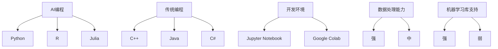

#### 1.3 AI编程的核心概念与技术

**核心概念与联系：**  
- **数据结构：** 在AI编程中，数据结构用于存储和处理大量数据。常用的数据结构有数组、列表、字典等。  
- **算法：** 算法是AI编程的核心，用于实现特定的功能。常见的算法有线性回归、决策树、神经网络等。  
- **深度学习：** 深度学习是AI编程的重要分支，通过多层神经网络对数据进行特征提取和学习。

**概念属性特征对比表格：**

| 特征             | 数据结构             | 算法             | 深度学习             |  
| ---------------- | -------------------- | ---------------- | -------------------- |  
| 用途             | 存储和处理数据       | 实现特定功能     | 特征提取和学习       |  
| 类型             | 数组、列表、字典等   | 线性回归、决策树 | 神经网络             |  
| 复杂度             | O(1)、O(n)等         | O(1)、O(nlogn)等 | O(n)、O(n^2)等       |

**ER实体关系图架构：**

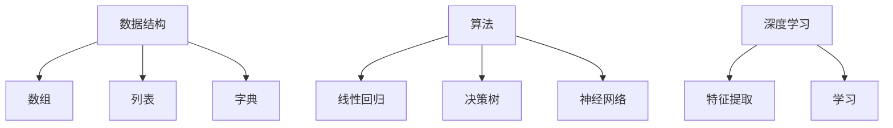

----------------------------------------------------------------

## 第二部分：AI编程语言与工具

### 第2章：AI编程语言与工具

#### 2.1 传统的编程语言与AI编程语言的对比

**核心概念与联系：**  
- **编程语言：** 传统的编程语言如C++、Java等，而AI编程语言如Python、R等，更注重数据处理和算法实现。  
- **开发环境：** AI编程需要更强大的数据处理和分析能力，因此开发环境也有所不同，如Jupyter Notebook、Google Colab等。

**概念属性特征对比表格：**

| 特征                 | 人工智能编程             | 传统编程             |  
| -------------------- | ----------------------- | -------------------- |  
| 编程语言             | Python、R、Julia等       | C++、Java、C#等      |  
| 开发环境             | Jupyter Notebook、Google Colab | Visual Studio、Eclipse等 |  
| 数据处理能力         | 强                 | 中                 |  
| 机器学习库支持         | 强                 | 弱                 |

**ER实体关系图架构：**

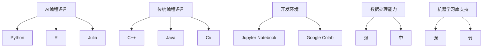

#### 2.2 主流AI编程语言介绍

**核心概念与联系：**  
- **Python：** Python因其简洁的语法和丰富的库支持，成为AI编程的常用语言。  
- **R：** R专注于统计分析和数据可视化，非常适合进行数据分析和机器学习项目。  
- **Julia：** Julia是一种高效、动态的编程语言，适合进行高性能的科学计算和数据分析。

**概念属性特征对比表格：**

| 特征                 | Python             | R             | Julia             |  
| -------------------- | ------------------- | -------------- | ------------------ |  
| 语法               | 简洁               | 复杂           | 中等             |  
| 库支持               | 丰富             | 丰富           | 较少             |  
| 性能               | 较高             | 较低           | 高               |

**ER实体关系图架构：**

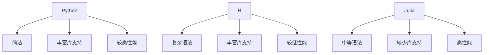

#### 2.3 AI编程工具与开发环境

**核心概念与联系：**  
- **Jupyter Notebook：** Jupyter Notebook是一种交互式开发环境，支持多种编程语言，非常适合进行数据分析和机器学习项目。  
- **Google Colab：** Google Colab是Google提供的云端交互式开发环境，具有强大的计算能力，适合进行大规模数据分析和深度学习项目。

**概念属性特征对比表格：**

| 特征                 | Jupyter Notebook       | Google Colab       |  
| -------------------- | -------------------- | -------------------- |  
| 交互式开发           | 支持                   | 支持               |  
| 多编程语言支持       | 支持                   | 支持               |  
| 计算能力             | 较弱                   | 强               |

**ER实体关系图架构：**

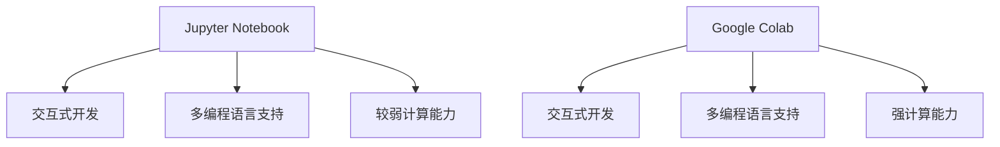

----------------------------------------------------------------

## 第三部分：AI编程的基本原理

### 第3章：AI编程的基本原理

#### 3.1 数据结构与算法在AI编程中的应用

**核心概念与联系：**  
- **数据结构：** 数据结构用于存储和处理大量数据。常用的数据结构有数组、列表、字典等。  
- **算法：** 算法是AI编程的核心，用于实现特定的功能。常见的算法有线性回归、决策树、神经网络等。

**概念属性特征对比表格：**

| 特征                 | 数据结构             | 算法             |  
| -------------------- | -------------------- | ---------------- |  
| 用途                 | 存储和处理数据       | 实现特定功能     |  
| 类型                 | 数组、列表、字典等   | 线性回归、决策树 |  
| 复杂度                 | O(1)、O(n)等         | O(1)、O(nlogn)等 |  

**ER实体关系图架构：**

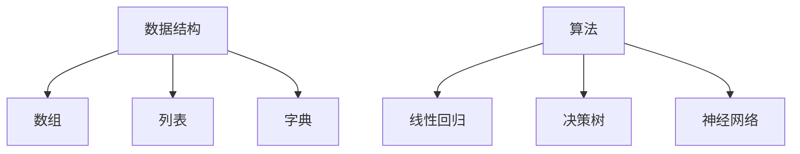

#### 3.2 深度学习的基本概念与原理

**核心概念与联系：**  
- **深度学习：** 深度学习是一种基于多层神经网络的机器学习技术，用于对数据进行特征提取和学习。  
- **神经网络：** 神经网络是深度学习的基础，由多个神经元组成，通过学习输入数据来生成预测结果。

**概念属性特征对比表格：**

| 特征                 | 深度学习             | 神经网络             |  
| -------------------- | -------------------- | -------------------- |  
| 类型                 | 基于多层神经网络的机器学习技术 | 由多个神经元组成 |  
| 功能                 | 特征提取和学习       | 输入数据生成预测结果 |  

**ER实体关系图架构：**

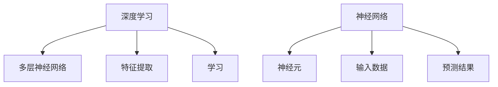

#### 3.3 自然语言处理的基础

**核心概念与联系：**  
- **自然语言处理（NLP）：** 自然语言处理是一种使计算机能够理解、解释和生成自然语言的技术。  
- **语言模型：** 语言模型是NLP的核心，用于预测文本序列的概率分布。

**概念属性特征对比表格：**

| 特征                 | 自然语言处理（NLP）   | 语言模型           |  
| -------------------- | -------------------- | ------------------ |  
| 类型                 | 计算机与自然语言之间的交互 | 文本序列的概率分布预测 |  
| 功能                 | 理解、解释和生成自然语言 | 预测文本序列       |  

**ER实体关系图架构：**

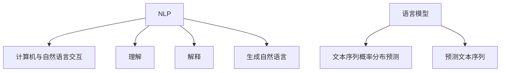

----------------------------------------------------------------

## 第四部分：AI编程实践

### 第4章：AI编程实践

#### 4.1 AI编程项目环境搭建

**核心概念与联系：**  
- **开发环境：** Jupyter Notebook和Google Colab是常用的AI编程开发环境。  
- **工具链：** Python、R、Julia等是常用的AI编程语言，需要安装相应的库和工具。

**概念属性特征对比表格：**

| 特征                 | Jupyter Notebook | Google Colab |  
| -------------------- | ---------------- | -------------- |  
| 交互式开发           | 支持             | 支持           |  
| 多编程语言支持       | 支持             | 支持           |  
| 计算能力             | 较弱             | 强             |

**ER实体关系图架构：**


**系统架构设计mermaid架构图：**

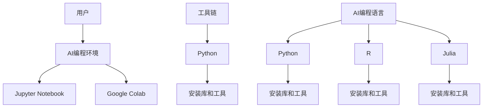

**系统接口设计和系统交互mermaid序列图：**

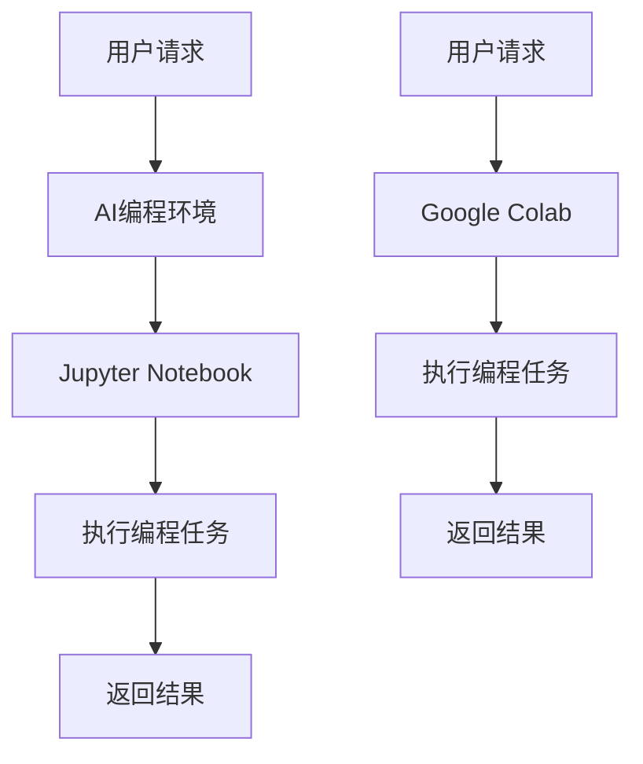

#### 4.2 数据预处理与特征工程

**核心概念与联系：**  
- **数据预处理：** 数据预处理是AI编程项目的重要步骤，包括数据清洗、归一化、降维等。  
- **特征工程：** 特征工程是提高AI模型性能的关键，包括特征选择、特征提取等。

**概念属性特征对比表格：**

| 特征                 | 数据预处理           | 特征工程           |  
| -------------------- | -------------------- | -------------------- |  
| 类型                 | 数据清洗、归一化、降维等 | 特征选择、特征提取等 |  
| 功能                 | 数据质量提升         | 模型性能优化       |  

**ER实体关系图架构：**

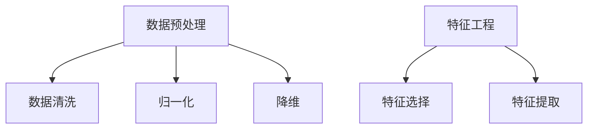

#### 4.3 模型训练与优化

**核心概念与联系：**  
- **模型训练：** 模型训练是通过调整模型参数来使模型对特定任务达到良好性能。  
- **模型优化：** 模型优化是提高模型性能的过程，包括超参数调整、模型选择等。

**概念属性特征对比表格：**

| 特征                 | 模型训练           | 模型优化           |  
| -------------------- | -------------------- | -------------------- |  
| 类型                 | 调整模型参数       | 超参数调整、模型选择 |  
| 功能                 | 模型性能提升       | 模型性能优化       |  

**ER实体关系图架构：**

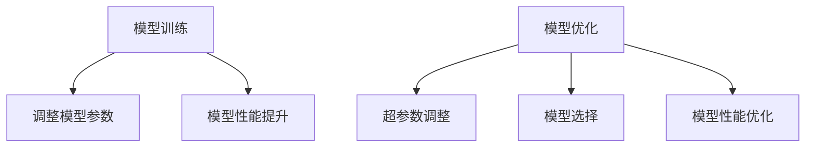

#### 4.4 模型部署与评估

**核心概念与联系：**  
- **模型部署：** 模型部署是将训练好的模型应用到实际场景的过程。  
- **模型评估：** 模型评估是衡量模型性能的重要步骤，包括准确率、召回率等指标。

**概念属性特征对比表格：**

| 特征                 | 模型部署           | 模型评估           |  
| -------------------- | -------------------- | -------------------- |  
| 类型                 | 应用场景部署       | 性能指标评估       |  
| 功能                 | 实际应用           | 性能衡量           |  

**ER实体关系图架构：**

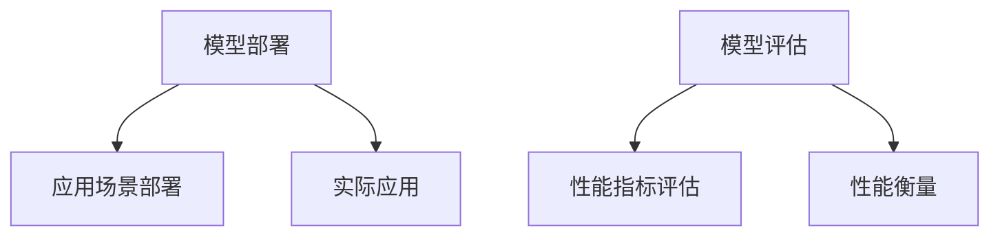

----------------------------------------------------------------

## 第五部分：AI编程最佳实践

### 第5章：AI编程最佳实践

#### 5.1 AI编程中的数据安全和隐私问题

**核心概念与联系：**  
- **数据安全：** 数据安全是指在数据存储、传输和处理过程中，防止数据泄露、篡改和丢失。  
- **隐私保护：** 隐私保护是指在数据处理过程中，保护用户隐私不被泄露。

**概念属性特征对比表格：**

| 特征                 | 数据安全           | 隐私保护           |  
| -------------------- | -------------------- | -------------------- |  
| 类型                 | 数据存储、传输、处理 | 用户隐私保护       |  
| 功能                 | 防止数据泄露、篡改、丢失 | 防止用户隐私泄露 |  

**ER实体关系图架构：**

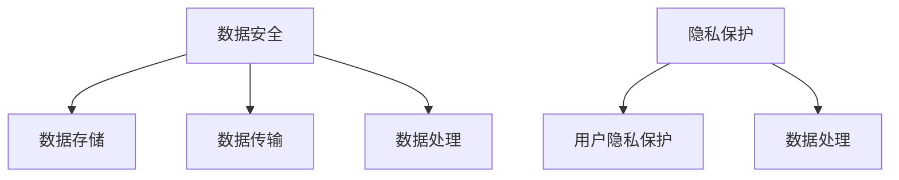

#### 5.2 AI编程性能优化策略

**核心概念与联系：**  
- **算法优化：** 算法优化是提高AI模型性能的关键，包括模型压缩、量化等。  
- **硬件加速：** 硬件加速是通过利用GPU、TPU等硬件资源，提高模型训练和推理速度。

**概念属性特征对比表格：**

| 特征                 | 算法优化           | 硬件加速           |  
| -------------------- | -------------------- | -------------------- |  
| 类型                 | 模型压缩、量化等     | 利用GPU、TPU等硬件资源 |  
| 功能                 | 模型性能提升       | 提高训练和推理速度 |  

**ER实体关系图架构：**

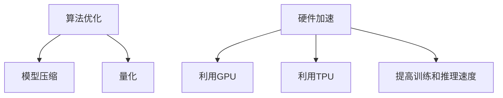

#### 5.3 AI编程项目的评估与监控

**核心概念与联系：**  
- **项目评估：** 项目评估是对AI编程项目的性能、效果进行评价。  
- **监控：** 监控是对AI模型在实际应用中的表现进行实时监测，包括性能、异常检测等。

**概念属性特征对比表格：**

| 特征                 | 项目评估           | 监控             |  
| -------------------- | -------------------- | -------------------- |  
| 类型                 | 性能、效果评价       | 实时监测         |  
| 功能                 | 项目优化           | 确保模型稳定运行 |  

**ER实体关系图架构：**

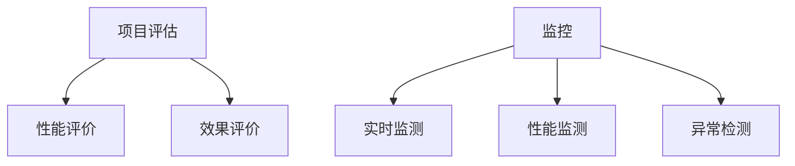

----------------------------------------------------------------

## 第六部分：AI编程案例分析

### 第6章：AI编程案例分析

#### 6.1 案例一：文本分类应用

**核心概念与联系：**  
- **文本分类：** 文本分类是将文本数据按照主题或类别进行分类的过程。  
- **AI编程实现：** 使用深度学习算法，如卷积神经网络（CNN）和循环神经网络（RNN），进行文本分类。

**概念属性特征对比表格：**

| 特征                 | 文本分类           | AI编程实现           |  
| -------------------- | -------------------- | -------------------- |  
| 类型                 | 分类任务           | 深度学习算法       |  
| 功能                 | 文本数据分类       | 实现文本分类任务 |  

**ER实体关系图架构：**

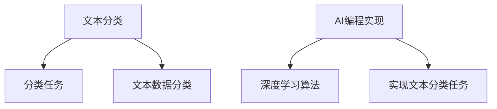

**系统架构设计mermaid架构图：**

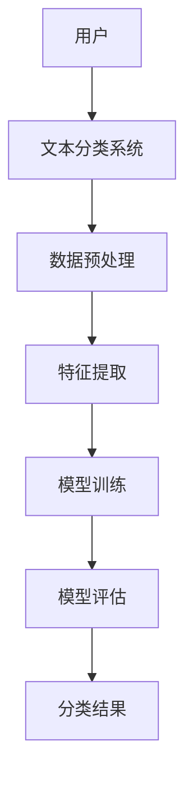

**系统接口设计和系统交互mermaid序列图：**

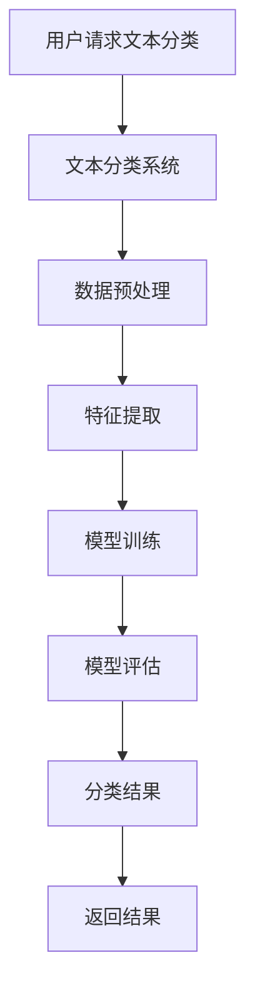

#### 6.2 案例二：图像识别应用

**核心概念与联系：**  
- **图像识别：** 图像识别是将图像数据转换为有意义的标签或描述的过程。  
- **AI编程实现：** 使用卷积神经网络（CNN）进行图像识别。

**概念属性特征对比表格：**

| 特征                 | 图像识别           | AI编程实现           |  
| -------------------- | -------------------- | -------------------- |  
| 类型                 | 识别任务           | 卷积神经网络       |  
| 功能                 | 图像数据识别       | 实现图像识别任务 |  

**ER实体关系图架构：**

```mermaid
graph TB
A[图像识别] --> B[识别任务]
A --> C[图像数据识别]
D[AI编程实现] --> E[卷积神经网络]
D --> F[实现图像识别任务]
```

**系统架构设计mermaid架构图：**

```mermaid
graph TB
A[用户] --> B[图像识别系统]
B --> C[数据预处理]
C --> D[特征提取]
D --> E[模型训练]
E --> F[模型评估]
F --> G[识别结果]
```

**系统接口设计和系统交互mermaid序列图：**

```mermaid
graph TB
A[用户请求图像识别] --> B[图像识别系统]
B --> C[数据预处理]
C --> D[特征提取]
D --> E[模型训练]
E --> F[模型评估]
F --> G[识别结果]
G --> H[返回结果]
```

#### 6.3 案例三：推荐系统应用

**核心概念与联系：**  
- **推荐系统：** 推荐系统是根据用户的历史行为和偏好，为用户推荐相关商品或内容。  
- **AI编程实现：** 使用协同过滤、深度学习等算法进行推荐。

**概念属性特征对比表格：**

| 特征                 | 推荐系统           | AI编程实现           |  
| -------------------- | -------------------- | -------------------- |  
| 类型                 | 推荐任务           | 协同过滤、深度学习 |  
| 功能                 | 商品或内容推荐       | 实现推荐任务 |  

**ER实体关系图架构：**

```mermaid
graph TB
A[推荐系统] --> B[推荐任务]
A --> C[商品或内容推荐]
D[AI编程实现] --> E[协同过滤]
D --> F[深度学习]
D --> G[实现推荐任务]
```

**系统架构设计mermaid架构图：**

```mermaid
graph TB
A[用户] --> B[推荐系统]
B --> C[用户行为分析]
C --> D[推荐算法]
D --> E[推荐结果]
E --> F[推荐系统接口]
```

**系统接口设计和系统交互mermaid序列图：**

```mermaid
graph TB
A[用户请求推荐] --> B[推荐系统]
B --> C[用户行为分析]
C --> D[推荐算法]
D --> E[推荐结果]
E --> F[推荐系统接口]
F --> G[返回结果]
```

----------------------------------------------------------------

## 第七部分：未来展望与趋势

### 第7章：未来展望与趋势

#### 7.1 AI编程的未来发展方向

**核心概念与联系：**  
- **AI编程语言发展：** AI编程语言将更加专注于特定领域，如自然语言处理、图像识别等。  
- **跨学科融合：** AI编程将与其他领域如生物、医学等深度融合，推动科技创新。

**概念属性特征对比表格：**

| 特征                 | AI编程语言发展       | 跨学科融合           |  
| -------------------- | -------------------- | -------------------- |  
| 类型                 | 领域专用编程语言     | 跨学科应用与融合     |  
| 功能                 | 提高特定领域编程效率 | 推动科技创新与进步 |  

**ER实体关系图架构：**

```mermaid
graph TB
A[AI编程语言发展] --> B[领域专用编程语言]
A --> C[跨学科融合]
D[跨学科融合] --> E[生物领域]
D --> F[医学领域]
D --> G[其他领域]
```

#### 7.2 AI编程面临的挑战与机遇

**核心概念与联系：**  
- **挑战：** AI编程面临数据安全、隐私保护、算法公平性等挑战。  
- **机遇：** AI编程为开发者提供了丰富的应用场景，如智能医疗、自动驾驶等。

**概念属性特征对比表格：**

| 特征                 | 挑战             | 机遇             |  
| -------------------- | -------------------- | -------------------- |  
| 类型                 | 数据安全、隐私保护、算法公平性 | 智能医疗、自动驾驶等         |  
| 功能                 | 解决实际问题       | 探索新应用场景 |  

**ER实体关系图架构：**

```mermaid
graph TB
A[挑战] --> B[数据安全]
A --> C[隐私保护]
A --> D[算法公平性]
E[机遇] --> F[智能医疗]
E --> G[自动驾驶]
E --> H[其他应用场景]
```

#### 7.3 开发者需要具备的能力

**核心概念与联系：**  
- **多学科知识：** 开发者需要掌握数学、统计学、计算机科学等跨学科知识。  
- **实践经验：** 开发者需要具备丰富的AI编程实践经验，能够应对实际问题。  
- **创新能力：** 开发者需要具备创新思维，能够探索新的应用场景和技术方向。

**概念属性特征对比表格：**

| 特征                 | 多学科知识       | 实践经验         | 创新能力           |  
| -------------------- | -------------------- | -------------------- | -------------------- |  
| 类型                 | 数学、统计学、计算机科学等 | AI编程项目实践     | 探索新技术与应用场景 |  
| 功能                 | 提高问题解决能力 | 解决实际问题       | 推动技术进步       |  

**ER实体关系图架构：**

```mermaid
graph TB
A[多学科知识] --> B[数学]
A --> C[统计学]
A --> D[计算机科学]
E[实践经验] --> F[项目实践]
E --> G[解决实际问题]
H[创新能力] --> I[探索新技术]
H --> J[应用场景]
```

----------------------------------------------------------------

### 作者信息

作者：AI天才研究院/AI Genius Institute & 禅与计算机程序设计艺术 /Zen And The Art of Computer Programming

----------------------------------------------------------------

## 总结

在AI时代，编程的新语法为开发者提供了丰富的工具和方法，使得AI编程变得更加高效、易用。本文从AI时代编程背景、核心概念、实践到最佳实践，全面解析了AI编程的新语法。希望本文能够帮助您更好地理解AI编程，并在实际项目中运用这些新语法，提高编程效率。让我们继续关注AI编程领域的发展，期待未来能够带来更多的创新和突破。

