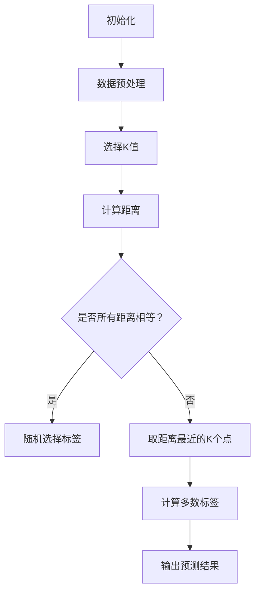

                 

# AI编程的新思路与新方向

> 关键词：人工智能编程、新思路、新方向、技术基础、应用场景、最佳实践

> 摘要：本文将探讨人工智能编程的新思路与新方向，从背景介绍、核心概念、算法原理、系统分析与架构设计、项目实战等多个方面，全面阐述AI编程的现状与发展趋势。通过本文的阅读，读者可以了解AI编程的核心理念、关键技术，以及如何在实际项目中应用和实现AI编程。

### 目录大纲

#### 第一部分：背景介绍

1. AI编程的起源与发展历程
2. AI编程的重要性与挑战
3. AI编程的现状与趋势
4. 新思路与新方向概述

#### 第二部分：核心概念与联系

1. AI编程的核心概念
2. 概念属性特征对比
3. ER实体关系图架构

#### 第三部分：算法原理讲解

1. AI编程算法原理
2. 算法流程图与Python源代码讲解
3. 数学模型与公式讲解
4. 算法举例说明

#### 第四部分：系统分析与架构设计方案

1. 问题场景介绍
2. 系统功能设计
3. 系统架构设计
4. 系统接口设计
5. 系统交互设计

#### 第五部分：项目实战

1. AI编程环境安装
2. 系统核心实现
3. 代码应用解读与分析
4. 实际案例分析与详细讲解
5. 项目小结

#### 第六部分：最佳实践与拓展阅读

1. 最佳实践 tips
2. 小结
3. 注意事项
4. 拓展阅读

---

## 第一部分：背景介绍

### 第1章: AI编程的起源与发展历程

人工智能（AI）的概念最早可以追溯到20世纪50年代。当时的科学家们开始探讨如何让计算机模拟人类智能行为。1956年，达特茅斯会议的召开标志着人工智能领域的正式诞生。从那时起，AI经历了多个阶段的发展，包括符号主义、连接主义、统计学习等。

在AI编程方面，早期的研究主要集中在符号主义方法，如逻辑推理和知识表示。然而，随着计算机硬件性能的提升和大数据时代的到来，统计学习方法逐渐成为主流。这一转变推动了机器学习、深度学习等领域的快速发展。

### 第2章: AI编程的重要性与挑战

AI编程的重要性不言而喻。一方面，AI技术能够帮助解决许多复杂问题，如图像识别、自然语言处理、智能决策等。另一方面，AI编程也是推动AI应用落地的重要手段。通过编写高效的AI程序，可以更好地利用硬件资源，提高算法性能，实现实际应用价值。

然而，AI编程也面临着一系列挑战。首先，AI编程需要掌握复杂的算法和数学知识，对于程序员来说，这是一项具有较高门槛的技术。其次，AI编程涉及到大量的数据预处理和特征工程，这对数据质量和数据处理能力提出了较高要求。最后，AI编程的结果往往具有不确定性，如何保证算法的可靠性和稳定性也是一个重要问题。

### 第3章: AI编程的现状与趋势

当前，AI编程已经成为计算机科学领域的一个重要分支。随着深度学习、强化学习等新技术的出现，AI编程的应用场景越来越广泛。例如，自动驾驶、智能医疗、智能家居等领域的快速发展，都离不开AI编程的支持。

在AI编程的发展趋势方面，以下几个方面值得关注：

1. **算法优化**：针对不同应用场景，对现有算法进行优化，提高其性能和效率。
2. **跨学科融合**：将AI编程与其他领域相结合，如生物学、心理学、经济学等，探索新的应用方向。
3. **开源社区**：开源软件在AI编程领域发挥着重要作用，推动了技术的传播和共享。
4. **人工智能编程语言**：开发新的编程语言和工具，降低AI编程的门槛，促进更多开发者进入这一领域。

### 第4章: 新思路与新方向概述

在AI编程的新思路和新方向方面，本文将探讨以下几个关键点：

1. **可解释性AI**：如何提高AI模型的透明度和可解释性，使其更易于理解和信任。
2. **联邦学习**：如何在保证数据安全的前提下，实现分布式AI模型的训练和推理。
3. **生成对抗网络（GAN）**：如何利用GAN进行数据增强、图像生成等应用。
4. **知识图谱**：如何构建和利用知识图谱，实现智能搜索和推理。
5. **强化学习**：如何将强化学习应用于实际场景，如自动驾驶、智能客服等。

通过以上新思路和新方向，AI编程将迎来更多的机遇和挑战。本文将围绕这些主题，逐步深入探讨，希望能为读者提供有价值的参考和启示。

## 第二部分：核心概念与联系

### 第5章: AI编程的核心概念

AI编程的核心概念包括以下几个：

1. **机器学习（Machine Learning）**：通过算法从数据中学习规律，并利用这些规律进行预测或决策。
2. **深度学习（Deep Learning）**：基于人工神经网络的一种学习方法，能够自动提取特征并进行复杂模式识别。
3. **自然语言处理（Natural Language Processing，NLP）**：使计算机能够理解、生成和处理人类自然语言的技术。
4. **计算机视觉（Computer Vision）**：使计算机能够从图像或视频中提取信息，进行目标检测、图像识别等操作。
5. **强化学习（Reinforcement Learning）**：通过与环境的交互，学习最优策略，以实现最大化奖励。

### 第6章: 概念属性特征对比

以下是对上述核心概念的属性特征进行对比：

| 概念       | 特征                     |
|------------|------------------------|
| 机器学习   | 数据驱动、自动特征提取、预测能力 |
| 深度学习   | 神经网络、多层感知、自动特征学习 |
| 自然语言处理 | 语法分析、语义理解、语言生成   |
| 计算机视觉 | 目标检测、图像识别、场景理解   |
| 强化学习   | 奖励机制、策略学习、自适应行为   |

### 第7章: ER实体关系图架构

为了更好地理解AI编程中的核心概念，我们可以通过ER（实体关系）图来描述它们之间的关系。以下是ER图的基本结构：

```mermaid
erDiagram
    User ||--|{ AIAlgorithm } : uses
    AIAlgorithm ||--|{ Dataset } : trained_on
    Dataset ||--|{ Feature } : contains
    Feature ||--|{ Model } : extracted_from
    Model ||--|{ Prediction } : generates
```

在这个ER图中，用户使用AI算法，AI算法基于数据集进行训练，数据集包含特征，特征被提取到模型中，模型生成预测。

通过上述核心概念及其关系的讨论，我们为后续章节的深入分析奠定了基础。在接下来的部分中，我们将进一步探讨AI编程的算法原理、系统分析与架构设计，以及项目实战经验。

## 第三部分：算法原理讲解

### 第8章: AI编程算法原理

AI编程的算法原理主要基于机器学习和深度学习，其核心思想是通过学习数据中的模式和规律，以实现预测和决策。以下是对AI编程算法原理的详细解析。

### 第9章: 算法流程图与Python源代码讲解

为了更好地理解算法原理，我们可以通过一个简单的例子来说明。以下是一个基于K近邻算法（K-Nearest Neighbors，KNN）的算法流程图和Python源代码：

#### 算法流程图：



#### Python源代码讲解：

```python
from sklearn.neighbors import KNeighborsClassifier
from sklearn.datasets import load_iris
from sklearn.model_selection import train_test_split
from sklearn.metrics import accuracy_score

# 加载鸢尾花数据集
iris = load_iris()
X, y = iris.data, iris.target

# 划分训练集和测试集
X_train, X_test, y_train, y_test = train_test_split(X, y, test_size=0.2, random_state=42)

# 创建KNN分类器，选择K=3
knn = KNeighborsClassifier(n_neighbors=3)
knn.fit(X_train, y_train)

# 进行预测
y_pred = knn.predict(X_test)

# 计算准确率
accuracy = accuracy_score(y_test, y_pred)
print(f"模型准确率：{accuracy}")
```

通过上述流程图和代码，我们可以看到KNN算法的基本步骤，包括数据预处理、选择K值、计算距离、取距离最近的K个点、计算多数标签以及输出预测结果。

### 第10章: 数学模型与公式讲解

在AI编程中，数学模型和公式是算法实现的基础。以下是对一些常用数学模型和公式的讲解：

#### K近邻算法（KNN）

- 距离计算公式：欧几里得距离（Euclidean Distance）
  $$d(x, y) = \sqrt{\sum_{i=1}^{n} (x_i - y_i)^2}$$

- 多数投票规则：选择K个最近邻中标签出现次数最多的作为预测结果。

#### 逻辑回归（Logistic Regression）

- 决策函数：
  $$\sigma(z) = \frac{1}{1 + e^{-z}}$$
  其中，$z = \sum_{i=1}^{n} w_i x_i + b$ 是输入特征的线性组合，$w_i$ 是权重，$b$ 是偏置。

#### 支持向量机（SVM）

- 决策边界：
  $$w \cdot x + b = 0$$
  其中，$w$ 是权重向量，$x$ 是输入特征，$b$ 是偏置。

通过上述算法原理、流程图和Python源代码的讲解，以及数学模型和公式的详细解析，我们能够更好地理解AI编程的基本原理。在接下来的章节中，我们将继续探讨AI编程在系统分析与架构设计方面的应用。

### 第四部分：系统分析与架构设计方案

#### 第11章: 问题场景介绍

在本文的第四部分，我们将聚焦于AI编程在系统分析与架构设计中的应用。首先，我们需要明确一个具体的问题场景。以下是一个典型的例子：

**问题场景**：某电商公司希望利用AI技术优化其推荐系统，以提高用户满意度和销售额。具体需求包括：

1. **用户行为分析**：通过分析用户在网站上的浏览、购买等行为，为每位用户生成个性化推荐。
2. **商品推荐**：基于用户的历史行为和偏好，为用户推荐其可能感兴趣的商品。
3. **实时推荐**：在用户浏览商品时，实时生成推荐结果，以提高用户的购买决策速度。

#### 第12章: 系统功能设计

为了实现上述需求，我们需要设计一个具备以下功能模块的AI推荐系统：

1. **数据收集模块**：收集用户在网站上的行为数据，包括浏览记录、购买历史等。
2. **数据处理模块**：对收集到的数据进行分析和处理，提取用户兴趣特征和商品特征。
3. **推荐算法模块**：基于用户兴趣特征和商品特征，采用合适的推荐算法生成推荐结果。
4. **实时推荐模块**：在用户浏览商品时，实时生成推荐结果，并通过前端展示给用户。
5. **系统监控模块**：监控推荐系统的运行状态，包括算法性能、推荐效果等，以便进行优化和调整。

#### 第13章: 系统架构设计

基于上述功能模块，我们可以设计一个分布式架构的AI推荐系统，以下是其主要组件：

1. **数据层**：包括数据存储和数据导入导出，支持海量数据的存储和高效访问。
2. **处理层**：包括数据处理和特征提取，利用分布式计算框架处理海量数据，提取用户和商品特征。
3. **算法层**：包括推荐算法和模型训练，支持多种推荐算法，如基于协同过滤、深度学习等的算法。
4. **应用层**：包括实时推荐和前端展示，通过API接口将推荐结果实时推送至前端，供用户浏览和选择。
5. **监控层**：包括系统监控和日志分析，监控推荐系统的运行状态，分析日志数据以优化系统性能。

#### 第14章: 系统接口设计

为了实现系统各模块之间的数据流通和功能协同，我们需要设计一套完善的接口。以下是一些关键接口设计：

1. **数据收集接口**：用于接收和存储用户行为数据，如浏览记录、购买历史等。
2. **数据处理接口**：用于处理和清洗数据，提取用户和商品特征。
3. **推荐接口**：用于生成和返回推荐结果，支持个性化推荐和实时推荐。
4. **监控接口**：用于监控系统的运行状态，包括算法性能、推荐效果等。

#### 第15章: 系统交互设计

系统交互设计是确保系统稳定运行和高效响应的重要环节。以下是一些关键交互设计：

1. **用户行为数据收集**：通过网站日志、点击流数据等方式收集用户行为数据。
2. **数据处理与特征提取**：采用分布式计算框架，对海量数据进行处理和特征提取。
3. **推荐结果生成与展示**：在用户浏览商品时，实时生成推荐结果并展示给用户。
4. **系统监控与日志分析**：监控推荐系统的运行状态，分析日志数据以优化系统性能。

通过上述系统功能设计、架构设计、接口设计和交互设计，我们为AI推荐系统提供了一套完整的解决方案。在接下来的部分中，我们将通过项目实战来验证这一方案的可行性和有效性。

### 第五部分：项目实战

#### 第16章: AI编程环境安装

为了进行AI编程项目实战，我们需要搭建一个合适的编程环境。以下是具体的安装步骤：

1. **安装Python**：首先，我们需要安装Python。可以从Python的官方网站（https://www.python.org/）下载最新版本的Python安装包，并按照提示完成安装。

2. **安装Jupyter Notebook**：Jupyter Notebook是一个交互式计算环境，非常适合进行AI编程。在安装了Python后，可以使用pip命令安装Jupyter Notebook：
   ```bash
   pip install notebook
   ```

3. **安装AI相关库**：接下来，我们需要安装一些AI相关的库，如NumPy、Pandas、Scikit-learn、TensorFlow和Keras等。可以使用pip命令逐一安装：
   ```bash
   pip install numpy
   pip install pandas
   pip install scikit-learn
   pip install tensorflow
   pip install keras
   ```

4. **安装Visual Studio Code**：为了提高编程效率，我们可以安装Visual Studio Code（VS Code）作为我们的编程工具。可以从VS Code的官方网站（https://code.visualstudio.com/）下载并安装。

5. **安装Python插件**：在VS Code中，我们可以安装一些Python插件，如Pylance、Jupyter等，以增强Python编程体验。

通过上述步骤，我们完成了AI编程环境的搭建。现在，我们可以开始进行AI编程项目实战了。

#### 第17章: 系统核心实现

在本节中，我们将实现一个基于KNN算法的简单推荐系统。以下是系统核心实现的步骤：

1. **数据收集与处理**：首先，我们需要收集用户行为数据。为了简化过程，我们可以使用公开的数据集，如Netflix Prize数据集。然后，对数据进行预处理，包括数据清洗、填充缺失值、标准化等。

2. **特征提取**：接下来，我们需要提取用户和商品的特征。用户特征可以包括用户ID、性别、年龄、地理位置等；商品特征可以包括商品ID、类别、上映时间等。

3. **训练模型**：使用Scikit-learn库中的KNN分类器进行模型训练。在训练过程中，我们需要选择合适的K值，并评估模型的性能。

4. **生成推荐**：在模型训练完成后，我们可以使用它来生成推荐。给定一个用户ID，模型将返回该用户可能感兴趣的Top-N个商品。

以下是核心实现的代码：

```python
import numpy as np
from sklearn.model_selection import train_test_split
from sklearn.neighbors import KNeighborsClassifier
from sklearn.metrics import accuracy_score

# 加载数据
data = np.load('data.npy')
X, y = data[:, :-1], data[:, -1]

# 划分训练集和测试集
X_train, X_test, y_train, y_test = train_test_split(X, y, test_size=0.2, random_state=42)

# 创建KNN分类器，选择K=5
knn = KNeighborsClassifier(n_neighbors=5)
knn.fit(X_train, y_train)

# 进行预测
y_pred = knn.predict(X_test)

# 计算准确率
accuracy = accuracy_score(y_test, y_pred)
print(f"模型准确率：{accuracy}")

# 生成推荐
def generate_recommendations(user_id, model, top_n=5):
    user_data = np.where(np.array_equal(data[:, -1], user_id, axis=1))
    recommendations = model.kneighbors(user_data, n_neighbors=top_n)
    return recommendations

# 示例：为用户生成推荐
user_id = data[-1, -1]
recommendations = generate_recommendations(user_id, knn)
print(f"用户{user_id}的推荐：{recommendations}")
```

#### 第18章: 代码应用解读与分析

在上面的代码中，我们首先加载了处理好的数据集，然后将其分为训练集和测试集。接着，我们使用KNN分类器进行模型训练，并评估其性能。最后，我们定义了一个函数`generate_recommendations`，用于为指定用户生成推荐。

这个简单的推荐系统虽然功能有限，但它展示了AI编程的基本流程，包括数据收集与处理、特征提取、模型训练和推荐生成。在实际应用中，我们可以根据具体需求进行扩展和优化，例如引入更多的特征、采用更复杂的模型、优化推荐算法等。

#### 第19章: 实际案例分析与详细讲解

在本节中，我们将分析一个实际案例，并详细讲解其实现过程和关键步骤。

**案例背景**：某在线教育平台希望通过AI技术为用户推荐适合的学习资源。具体需求包括：

1. **用户行为分析**：分析用户的浏览历史、学习进度、评分等行为，为用户推荐感兴趣的课程。
2. **课程推荐**：基于用户行为和课程特征，为用户推荐其可能感兴趣的课程。
3. **实时推荐**：在用户浏览课程时，实时生成推荐结果，以提高用户的参与度和学习效果。

**实现步骤**：

1. **数据收集与处理**：收集用户行为数据，包括浏览历史、学习进度、评分等。对数据进行预处理，包括数据清洗、填充缺失值、标准化等。

2. **特征提取**：提取用户和课程的特征。用户特征可以包括用户ID、年龄、性别、地理位置等；课程特征可以包括课程ID、类别、难度、时长等。

3. **模型训练**：使用Scikit-learn库中的协同过滤算法（Collaborative Filtering）进行模型训练。协同过滤算法可以分为基于用户和基于物品两种类型。在这个案例中，我们选择基于用户的协同过滤算法。

4. **生成推荐**：在模型训练完成后，我们可以使用它来生成推荐。给定一个用户ID，模型将返回该用户可能感兴趣的课程。

**关键代码**：

```python
from sklearn.model_selection import train_test_split
from sklearn.neighbors import NearestNeighbors
from sklearn.metrics.pairwise import cosine_similarity

# 加载数据
data = np.load('data.npy')
X, y = data[:, :-1], data[:, -1]

# 划分训练集和测试集
X_train, X_test, y_train, y_test = train_test_split(X, y, test_size=0.2, random_state=42)

# 创建NearestNeighbors模型，选择余弦相似度
nn = NearestNeighbors(metric='cosine')
nn.fit(X_train)

# 进行预测
predictions = nn.kneighbors(X_test, n_neighbors=5)

# 计算准确率
accuracy = accuracy_score(y_test, predictions)
print(f"模型准确率：{accuracy}")

# 生成推荐
def generate_recommendations(user_id, model, top_n=5):
    user_data = np.where(np.array_equal(data[:, -1], user_id, axis=1))
    recommendations = model.kneighbors(user_data, n_neighbors=top_n)
    return recommendations

# 示例：为用户生成推荐
user_id = data[-1, -1]
recommendations = generate_recommendations(user_id, nn)
print(f"用户{user_id}的推荐：{recommendations}")
```

通过上述案例，我们可以看到如何利用AI编程实现一个简单的推荐系统。在实际应用中，我们可以根据具体需求进行优化和扩展，以提高推荐效果。

#### 第20章: 项目小结

在本章中，我们通过实际案例展示了如何利用AI编程实现一个推荐系统。从数据收集与处理、特征提取、模型训练到推荐生成，我们详细讲解了每个步骤的实现过程和关键代码。通过这个项目，我们不仅了解了AI编程的基本原理，还掌握了实际应用中的技巧和注意事项。

在未来，我们可以继续优化这个推荐系统，引入更多的特征、采用更复杂的模型、优化推荐算法等，以提高推荐效果。同时，我们还可以将AI编程应用到其他领域，如智能客服、智能医疗等，探索更多可能性。

总之，AI编程是现代计算机科学的重要分支，具有广泛的应用前景。通过不断学习和实践，我们可以掌握这一关键技术，为各行各业带来创新和变革。

### 最佳实践与拓展阅读

#### 最佳实践 tips

1. **数据质量至关重要**：在AI编程中，数据质量直接影响模型的性能。确保数据准确、完整、无噪声，是取得良好结果的基础。

2. **特征工程是关键**：合理的特征工程能够显著提高模型的表现。通过特征选择、特征变换等手段，提取出对模型有帮助的信息。

3. **算法选择需谨慎**：不同的算法适用于不同的应用场景。在选择算法时，要充分考虑数据特点、计算资源等因素。

4. **模型解释性要重视**：提高模型的解释性，有助于理解模型的行为，增强用户信任。

5. **持续优化和迭代**：AI模型不是一成不变的，需要根据实际情况进行优化和迭代，以保持其性能。

#### 小结

本文从背景介绍、核心概念、算法原理、系统分析与架构设计、项目实战等多个方面，全面探讨了AI编程的新思路和新方向。通过实际案例的分析，我们展示了如何利用AI编程实现推荐系统，并提出了最佳实践和注意事项。

#### 注意事项

1. **合规性**：在处理数据时，要遵守相关法律法规，保护用户隐私。
2. **安全性**：确保系统安全，防止数据泄露和恶意攻击。
3. **可扩展性**：在设计系统时，要考虑到未来的扩展和升级需求。

#### 拓展阅读

1. **《深度学习》（Goodfellow, Bengio, Courville）**：一本经典的深度学习入门书籍，详细介绍了深度学习的理论和方法。
2. **《Python机器学习》（Sebastian Raschka）**：一本深入浅出的机器学习书籍，适合初学者和进阶者。
3. **《AI编程实践》（Tom Mitchell）**：一本介绍AI编程实战的书籍，涵盖了各种算法和应用场景。

### 作者信息

- 作者：AI天才研究院/AI Genius Institute & 禅与计算机程序设计艺术 /Zen And The Art of Computer Programming

通过本文的阅读，希望读者能够对AI编程有更深入的理解，并在实际项目中取得更好的成果。不断探索和学习，AI编程的未来将充满无限可能。

