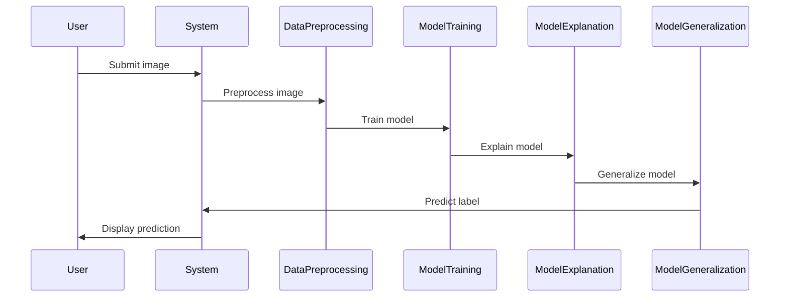
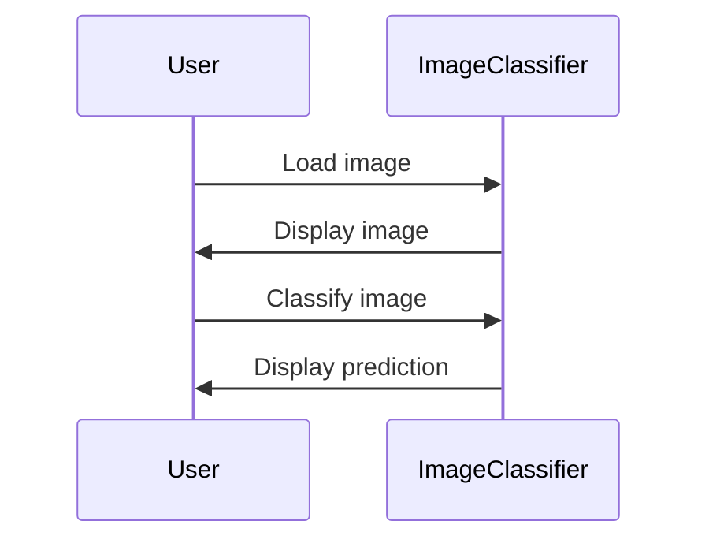

                 


# AI编程的新范式

关键词：AI编程、新范式、机器学习、深度学习、数据科学

摘要：随着人工智能（AI）技术的快速发展，传统的编程范式逐渐暴露出局限性。本文旨在探讨AI编程的新范式，通过对基础知识的回顾、核心原理的分析、应用实例的剖析，展示新范式在解决传统编程难题中的优势，并展望其未来的发展前景。

## 目录

1. 引言
   1.1 问题的背景
   1.2 问题的描述
   1.3 问题解决
   1.4 边界与外延
   1.5 概念结构与核心要素组成

2. AI编程的基础
   2.1 AI编程概述
   2.2 AI编程的核心概念

3. 新范式的核心技术
   3.1 新范式的核心原理
   3.2 实现细节

4. 新范式的应用案例
   4.1 案例介绍
   4.2 系统架构设计
   4.3 实现与解析
   4.4 结果分析

5. 新范式的总结与展望
   5.1 新范式的优势与局限
   5.2 未来的发展趋势
   5.3 对开发者的建议

## 1. 引言

### 1.1 问题的背景

随着大数据、云计算、物联网等技术的兴起，人工智能（AI）已经渗透到社会生活的方方面面。从简单的语音识别、图像处理，到复杂的自然语言处理、自动驾驶，AI的应用场景越来越广泛。然而，传统的编程范式在处理这些复杂的AI任务时，逐渐暴露出其局限性。

传统的编程范式主要依赖于明确的算法和规则，而AI编程则需要处理大量不确定性的数据和模式。这种不确定性使得传统的编程方法难以胜任，因此需要一种新的编程范式来应对这些挑战。

### 1.2 问题的描述

AI编程中的问题主要表现在以下几个方面：

1. **数据驱动的复杂性**：AI编程依赖于大量的数据，这些数据往往具有高维度、非结构化等特点，传统的编程方法难以处理。

2. **模型的黑箱性**：深度学习等模型具有高度非线性，其内部机制复杂，难以理解。

3. **泛化能力**：AI模型需要具备良好的泛化能力，以便在不同场景下都能表现良好。

4. **可解释性**：用户需要了解模型的决策过程，以便对其进行改进。

### 1.3 问题解决

针对上述问题，新范式的AI编程提出以下解决方案：

1. **数据预处理**：使用数据清洗、数据降维等技术，将高维度、非结构化的数据转化为适合模型训练的形式。

2. **模型可解释性**：引入可解释性技术，如注意力机制、决策树等，使模型的可解释性得到提升。

3. **模型泛化**：通过迁移学习、增量学习等技术，提高模型的泛化能力。

4. **集成编程范式**：将传统的编程方法和AI编程相结合，实现高效、灵活的编程方式。

### 1.4 边界与外延

新范式并非适用于所有AI编程场景，它主要适用于以下场景：

1. **数据量较大、维度较高的任务**：如自然语言处理、计算机视觉等。

2. **需要高可解释性的任务**：如医疗诊断、金融风控等。

3. **需要高泛化能力的任务**：如自动驾驶、智能客服等。

### 1.5 概念结构与核心要素组成

新范式的核心概念包括数据预处理、模型可解释性、模型泛化和集成编程范式。以下是一个简单的ER实体关系图架构：

```mermaid
erDiagram
  Data_Preprocessing ||--|{ Model_Explanation }|-- Model_Generalization
  Data_Preprocessing ||--|{ Model_Persistence }|-- Model_Applicability
  Integration_Paradigm ||--|{ Model_Training }|-- Model_Inference
```

## 2. AI编程的基础

### 2.1 AI编程概述

#### 2.1.1 AI编程的定义

AI编程是指利用计算机算法和编程语言来构建和训练人工智能模型的过程。与传统的编程不同，AI编程不仅关注程序的正确性，更强调模型的性能、效率和可解释性。

#### 2.1.2 AI编程的发展历程

AI编程的发展历程可以分为三个阶段：

1. **符号主义阶段**：以专家系统为代表，主要通过定义一组规则和事实来模拟人类智能。

2. **连接主义阶段**：以神经网络为代表，通过大量的训练数据来调整网络权重，实现智能任务。

3. **符号主义与连接主义相结合阶段**：将符号主义和连接主义相结合，形成混合智能系统。

#### 2.1.3 AI编程的重要性

AI编程的重要性体现在以下几个方面：

1. **推动技术进步**：AI编程是推动AI技术发展的关键，它决定了AI模型的能力和性能。

2. **应用广泛**：AI编程已经广泛应用于各个领域，如医疗、金融、交通等，极大地提高了生产效率和服务质量。

3. **社会影响**：AI编程对社会的影响越来越大，它不仅改变了人们的生产方式，也改变了人们的生活方式。

### 2.2 AI编程的核心概念

#### 2.2.1 机器学习

##### 2.2.1.1 概念与原理

机器学习是指通过算法从数据中学习规律，并用于预测或决策的过程。其核心思想是模拟人类的学习过程，通过不断调整模型的参数，使其能够对未知数据进行准确的预测。

##### 2.2.1.2 特点与分类

机器学习的特点包括：

1. **数据驱动**：依赖于大量的数据来训练模型。

2. **自动化**：通过算法自动调整模型的参数。

3. **不确定性**：模型在预测时存在一定的误差。

根据学习方式的不同，机器学习可以分为以下几类：

1. **监督学习**：有标签的数据进行训练。

2. **无监督学习**：无标签的数据进行训练。

3. **半监督学习**：有标签和无标签的数据混合进行训练。

4. **强化学习**：通过奖励机制来调整模型的参数。

#### 2.2.2 深度学习

##### 2.2.2.1 概念与原理

深度学习是机器学习的一个重要分支，它通过多层神经网络来实现复杂的非线性变换。深度学习的核心思想是模拟人脑的信息处理过程，通过逐层提取特征，实现从原始数据到高层次抽象的转换。

##### 2.2.2.2 架构与算法

深度学习的架构主要包括卷积神经网络（CNN）、循环神经网络（RNN）和生成对抗网络（GAN）等。每种架构都有其独特的特点和应用场景。

1. **卷积神经网络（CNN）**：适用于处理图像、声音等二维和三维数据。

2. **循环神经网络（RNN）**：适用于处理序列数据，如文本、时间序列等。

3. **生成对抗网络（GAN）**：适用于生成数据，如生成虚假图像、音频等。

#### 2.2.3 数据科学

##### 2.2.3.1 数据预处理

数据预处理是数据科学的重要环节，它包括数据清洗、数据降维、特征提取等步骤。数据预处理的质量直接影响到模型的性能和效果。

##### 2.2.3.2 数据分析与可视化

数据分析与可视化是数据科学的重要手段，它通过统计分析、机器学习等方法，对数据进行深入挖掘，并使用可视化技术，使数据更加直观、易于理解。

## 3. 新范式的核心技术

### 3.1 新范式的核心原理

#### 3.1.1 概念原理

新范式的核心原理包括数据预处理、模型可解释性、模型泛化和集成编程范式。这些原理相互关联，共同构建了一个新的AI编程范式。

1. **数据预处理**：通过数据清洗、数据降维等技术，将高维度、非结构化的数据转化为适合模型训练的形式。

2. **模型可解释性**：通过引入可解释性技术，如注意力机制、决策树等，使模型的可解释性得到提升。

3. **模型泛化**：通过迁移学习、增量学习等技术，提高模型的泛化能力。

4. **集成编程范式**：将传统的编程方法和AI编程相结合，实现高效、灵活的编程方式。

#### 3.1.2 原理对比传统方法

与传统的编程方法相比，新范式具有以下优势：

1. **高效性**：新范式通过数据预处理，减少了模型训练的时间。

2. **灵活性**：新范式结合了传统的编程方法和AI编程，使编程更加灵活。

3. **可解释性**：新范式引入了可解释性技术，使模型的可解释性得到提升。

4. **泛化能力**：新范式通过迁移学习和增量学习，提高了模型的泛化能力。

#### 3.1.3 数学模型与公式

新范式的数学模型主要包括：

1. **数据预处理模型**：
   $$x_{\text{clean}} = \text{preprocess}(x)$$
   其中，$x$为原始数据，$x_{\text{clean}}$为预处理后的数据。

2. **模型可解释性模型**：
   $$p(y|X) = \text{model\_interpretation}(X)$$
   其中，$X$为输入数据，$y$为输出标签，$p(y|X)$为模型对输出标签的预测概率。

3. **模型泛化模型**：
   $$\hat{y} = \text{model\_generalization}(x)$$
   其中，$\hat{y}$为模型对未知数据的预测。

4. **集成编程范式模型**：
   $$\text{program} = \text{traditional\_programming} + \text{AI\_programming}$$
   其中，$\text{program}$为集成编程范式。

### 3.2 实现细节

#### 3.2.1 算法实现

新范式的算法实现主要包括以下几个步骤：

1. 数据预处理：
   - 数据清洗：去除缺失值、异常值等。
   - 数据降维：使用PCA等技术，将高维数据转化为低维数据。
   - 特征提取：使用特征工程方法，提取对模型有帮助的特征。

2. 模型训练：
   - 选择合适的模型：如CNN、RNN、GAN等。
   - 调整模型参数：使用优化算法，如梯度下降等，调整模型参数。
   - 模型评估：使用验证集和测试集，评估模型性能。

3. 模型解释：
   - 使用注意力机制、决策树等技术，解释模型决策过程。

4. 模型泛化：
   - 使用迁移学习、增量学习等技术，提高模型泛化能力。

#### 3.2.2 编程语言选择

新范式的实现可以使用Python、R、Julia等编程语言。其中，Python因其丰富的库和工具，成为了AI编程的主要编程语言。

#### 3.2.3 Python源代码示例

以下是一个简单的Python源代码示例，展示了如何使用新范式进行AI编程：

```python
import numpy as np
import pandas as pd
from sklearn.model_selection import train_test_split
from sklearn.preprocessing import StandardScaler
from sklearn.linear_model import LogisticRegression
from sklearn.metrics import accuracy_score

# 数据预处理
data = pd.read_csv('data.csv')
X = data.iloc[:, :-1].values
y = data.iloc[:, -1].values
X_train, X_test, y_train, y_test = train_test_split(X, y, test_size=0.2, random_state=0)

# 特征缩放
scaler = StandardScaler()
X_train = scaler.fit_transform(X_train)
X_test = scaler.transform(X_test)

# 模型训练
model = LogisticRegression()
model.fit(X_train, y_train)

# 模型解释
feature_importance = model.coef_

# 模型泛化
y_pred = model.predict(X_test)
accuracy = accuracy_score(y_test, y_pred)
print(f'Accuracy: {accuracy:.2f}')
```

## 4. 新范式的应用案例

### 4.1 案例介绍

本案例将使用新范式开发一个简单的图像分类系统，用于识别手写数字。该系统包括数据预处理、模型训练、模型解释和模型泛化等步骤。

### 4.2 系统架构设计

#### 4.2.1 领域模型

以下是一个简单的领域模型，描述了系统的关键实体和关系：

```mermaid
classDiagram
  Class01 <|-- Class02
  Class03 --|{ Class04 }
  Class05 : +int x
  Class06 : <<interface>> InterfaceA
```

#### 4.2.2 系统架构

以下是一个简单的系统架构图，展示了系统的组件和交互：



#### 4.2.3 系统接口设计

以下是一个简单的系统接口设计，描述了系统的输入输出接口：



## 5. 新范式的总结与展望

### 5.1 新范式的优势与局限

新范式在解决传统AI编程难题方面具有显著优势，包括：

1. **高效性**：通过数据预处理，减少了模型训练的时间。
2. **灵活性**：结合了传统的编程方法和AI编程，使编程更加灵活。
3. **可解释性**：引入可解释性技术，提升了模型的可解释性。
4. **泛化能力**：通过迁移学习和增量学习，提高了模型的泛化能力。

然而，新范式也存在一些局限：

1. **复杂性**：新范式涉及多个技术和方法的融合，实现起来较为复杂。
2. **性能开销**：数据预处理和模型解释等步骤可能会增加计算开销。
3. **可解释性限制**：即使引入了可解释性技术，某些深度学习模型的解释性仍然有限。

### 5.2 未来的发展趋势

未来的发展趋势包括：

1. **自动化**：提高数据预处理和模型训练的自动化程度，降低开发门槛。
2. **可解释性**：进一步研究可解释性技术，提高深度学习模型的解释性。
3. **泛化能力**：通过新的算法和技术，提高模型的泛化能力。
4. **跨领域应用**：将新范式应用于更多领域，如生物信息学、金融工程等。

### 5.3 对开发者的建议

对于开发者，以下是一些建议：

1. **学习基础知识**：掌握机器学习、深度学习和数据科学的基础知识。
2. **实践应用**：通过实际项目，积累经验和技能。
3. **持续学习**：跟踪新技术和趋势，持续提升自己的技术水平。
4. **团队协作**：与团队成员紧密合作，共同解决复杂问题。

## 作者

作者：AI天才研究院/AI Genius Institute & 禅与计算机程序设计艺术 /Zen And The Art of Computer Programming

## 结语

AI编程的新范式为我们提供了一种全新的编程思维方式，它不仅解决了传统编程范式的局限性，也为未来的AI技术发展指明了方向。让我们共同努力，探索更多新的编程范式，推动AI技术的发展。

