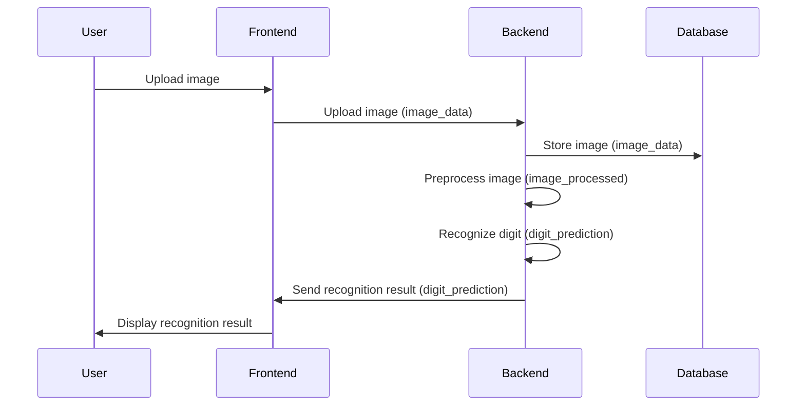
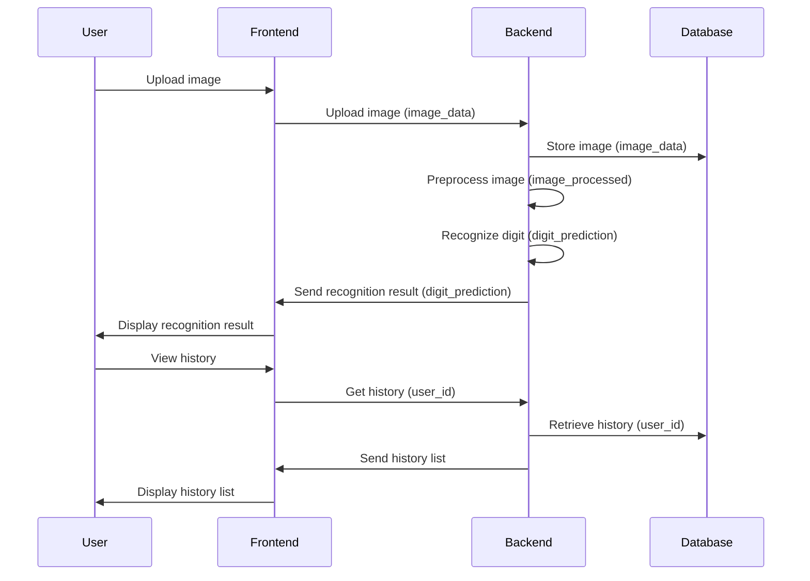

                 

### AI编程的新视角

> 关键词：人工智能编程、机器学习、深度学习、神经网络、新视角

> 摘要：随着人工智能（AI）技术的迅猛发展，AI编程正逐渐成为软件开发的核心。本文将深入探讨AI编程的新视角，分析其核心概念和原理，并通过实例和实战帮助读者理解AI编程的本质。

### 引言

#### 1.1.1 问题背景

人工智能作为当今科技领域的前沿，已经在各个行业中展现出巨大的潜力。从自动驾驶汽车到智能助手，从医疗诊断到金融风控，AI的应用场景越来越广泛。然而，与传统的编程不同，AI编程面临着独特的技术挑战。传统编程主要关注算法和程序的逻辑性，而AI编程则需要处理大量复杂数据，并利用机器学习、深度学习等算法进行模式识别和预测。

#### 1.1.2 问题描述

在AI编程中，如何有效地处理数据、设计适应AI需求的算法、优化模型的性能等都是亟待解决的问题。传统编程的理念和方法在AI领域面临新的挑战，如何实现从传统编程到AI编程的转变，是当前开发者面临的重要课题。

#### 1.1.3 问题解决

本文将通过介绍AI编程的新视角，帮助开发者理解和应用AI技术。我们将探讨AI编程的核心概念，如机器学习、深度学习和神经网络，并分析这些概念之间的联系和区别。通过实际案例和项目实战，读者可以深入了解AI编程的实践方法和技巧。

#### 1.1.4 边界与外延

AI编程不仅涉及计算机科学，还涉及到统计学、数学、心理学等多个领域。本文将重点关注计算机科学方面的内容，但也会涉及到相关领域的知识。同时，本文将探讨AI编程的边界，如如何将AI技术应用于实际问题和场景。

#### 1.1.5 概念结构与核心要素组成

AI编程的核心概念包括机器学习、深度学习、神经网络等。这些概念构成了AI编程的基础，也是本文的主要内容。本文将通过深入分析这些核心概念，帮助读者掌握AI编程的核心技术和最佳实践。

### 第1章: AI编程的核心概念与联系

#### 1.2.1 机器学习

机器学习是一种使计算机从数据中学习并做出决策的方法。它包括监督学习、无监督学习和强化学习等。机器学习的主要目标是让计算机能够自动地识别数据中的模式，并利用这些模式进行预测或分类。

##### 1.2.1.1 监督学习

监督学习是一种有监督的训练方法，其中训练数据集包含输入和输出对。模型通过学习这些输入和输出对之间的关系，从而能够对新数据进行预测。常见的监督学习算法包括线性回归、决策树、支持向量机等。

##### 1.2.1.2 无监督学习

无监督学习是一种无监督的训练方法，其中模型需要从无标签的数据中学习。无监督学习的目标是发现数据中的结构或模式，如聚类和降维。常见的无监督学习算法包括聚类、降维等。

##### 1.2.1.3 强化学习

强化学习是一种基于奖励和惩罚的学习方法，其中模型通过与环境的交互来学习。模型的目的是最大化长期回报。常见的强化学习算法包括Q学习、深度Q网络等。

#### 1.2.2 深度学习

深度学习是一种利用多层神经网络进行学习的方法。它能够自动提取数据中的特征，并在许多复杂任务中表现出色。深度学习是当前AI领域的研究热点之一，它已经在图像识别、语音识别、自然语言处理等领域取得了显著成果。

##### 1.2.2.1 神经网络

神经网络是一种模仿人脑结构的信息处理系统。它由大量神经元组成，通过调整神经元之间的连接权重来学习数据。神经网络可以分为多层，每层神经元都接收前一层神经元的输出，并将其传递到下一层。

##### 1.2.2.2 深度学习框架

深度学习框架是用于构建和训练深度学习模型的一套工具集。常见的深度学习框架包括TensorFlow、PyTorch等。这些框架提供了丰富的API和工具，使开发者能够轻松地构建和训练复杂的深度学习模型。

#### 1.2.3 神经网络

神经网络是一种模仿人脑结构的信息处理系统。它由大量神经元组成，通过调整神经元之间的连接权重来学习数据。神经网络可以分为多层，每层神经元都接收前一层神经元的输出，并将其传递到下一层。

##### 1.2.3.1 神经元的工作原理

神经元是神经网络的基本单元。每个神经元都接受多个输入信号，并通过加权求和的方式将这些信号转换为输出信号。如果输出信号的值大于某个阈值，则神经元被激活，否则保持沉默。

##### 1.2.3.2 神经网络的类型

神经网络可以分为前馈神经网络、卷积神经网络（CNN）、循环神经网络（RNN）等。前馈神经网络是当前最常用的神经网络类型，它通过多层非线性变换来提取数据特征。卷积神经网络在图像处理领域表现出色，而循环神经网络在序列数据处理方面具有优势。

#### 1.2.4 概念属性特征对比表格

以下是机器学习、深度学习和神经网络的属性特征对比表格：

| 特征         | 机器学习 | 深度学习 | 神经网络 |
| ------------ | -------- | -------- | -------- |
| 学习方式     | 监督、无监督、强化 | 监督、无监督、强化 | 监督、无监督、强化 |
| 特征提取     | 手动提取 | 自动提取 | 自动提取 |
| 模型复杂度   | 低至中 | 中至高 | 中至高 |
| 应用场景     | 广泛 | 图像、语音、自然语言处理等 | 图像、语音、自然语言处理等 |

#### 1.2.5 ER实体关系图架构

以下是AI编程相关的ER实体关系图架构：

```mermaid
erDiagram
    User ||--|{ AIModel }| Model : "used by"
    User ||--|{ Project }| Project : "owns"
    AIModel ||--|{ Algorithm }| Algorithm : "uses"
    Project ||--|{ Dataset }| Dataset : "uses"
```

### 第2章: AI编程基础

#### 2.1 数据预处理

数据预处理是AI编程的重要环节，它包括数据清洗、数据转换和数据可视化等步骤。

##### 2.1.1 数据清洗

数据清洗是数据预处理的第一步，它包括去除重复数据、处理缺失值和异常值等。清洗数据有助于提高模型训练的效果。

##### 2.1.2 数据转换

数据转换包括将数据转换为适合机器学习的格式，如数值化、归一化等。数值化是将非数值数据转换为数值形式，归一化是将数据缩放到一定的范围内。

##### 2.1.3 数据可视化

数据可视化有助于理解数据分布和特征，从而更好地设计模型。常见的可视化工具包括Matplotlib、Seaborn等。

#### 2.2 机器学习算法

机器学习算法是AI编程的核心，它包括监督学习、无监督学习和强化学习等。

##### 2.2.1 监督学习

监督学习是一种有监督的训练方法，其中训练数据集包含输入和输出对。模型通过学习这些输入和输出对之间的关系，从而能够对新数据进行预测。

- **线性回归**：线性回归是一种简单的监督学习算法，它通过拟合线性模型来预测数值输出。
  - **数学模型**：$$ y = \beta_0 + \beta_1x $$
  - **算法原理**：线性回归通过最小化平方误差损失函数来拟合模型参数。
- **决策树**：决策树是一种基于树形结构的监督学习算法，它通过递归划分特征空间来生成决策规则。
  - **算法原理**：决策树通过选择最优特征和阈值来划分数据，并递归地构建决策树。

##### 2.2.2 无监督学习

无监督学习是一种无监督的训练方法，其中模型需要从无标签的数据中学习。

- **聚类**：聚类是一种将数据分为若干个类别的无监督学习算法，它通过最小化类内距离和最大化类间距离来实现。
  - **算法原理**：常见的聚类算法包括K-means、层次聚类等。
- **降维**：降维是一种减少数据维度而无损数据信息的方法，它有助于提高模型训练的效率和准确性。
  - **算法原理**：常见的降维算法包括主成分分析（PCA）、线性判别分析（LDA）等。

##### 2.2.3 强化学习

强化学习是一种基于奖励和惩罚的学习方法，其中模型通过与环境的交互来学习。

- **Q学习**：Q学习是一种基于值函数的强化学习算法，它通过学习状态-动作值函数来选择最优动作。
  - **数学模型**：$$ Q(s, a) = r + \gamma \max_{a'} Q(s', a') $$
  - **算法原理**：Q学习通过更新Q值来优化策略。
- **深度Q网络（DQN）**：DQN是一种基于深度神经网络的强化学习算法，它通过训练值函数来学习最优策略。
  - **算法原理**：DQN使用深度神经网络来近似状态-动作值函数，并通过经验回放和目标网络来稳定训练过程。

#### 2.3 深度学习框架

深度学习框架是用于构建和训练深度学习模型的一套工具集。常见的深度学习框架包括TensorFlow、PyTorch等。

##### 2.3.1 TensorFlow

TensorFlow是一个开源的深度学习框架，它由Google开发。TensorFlow提供了丰富的API和工具，使开发者能够轻松地构建和训练复杂的深度学习模型。

- **安装**：在Python环境中安装TensorFlow：
  ```python
  pip install tensorflow
  ```

- **基本使用**：
  ```python
  import tensorflow as tf

  # 创建一个简单的线性模型
  model = tf.keras.Sequential([
      tf.keras.layers.Dense(units=1, input_shape=[1])
  ])

  # 编译模型
  model.compile(optimizer='sgd', loss='mean_squared_error')

  # 训练模型
  model.fit(x_train, y_train, epochs=100)
  ```

##### 2.3.2 PyTorch

PyTorch是一个开源的深度学习框架，它由Facebook开发。PyTorch提供了动态计算图和自动微分功能，使开发者能够更灵活地构建和训练深度学习模型。

- **安装**：在Python环境中安装PyTorch：
  ```python
  pip install torch torchvision
  ```

- **基本使用**：
  ```python
  import torch
  import torch.nn as nn
  import torch.optim as optim

  # 创建一个简单的线性模型
  model = nn.Linear(1, 1)

  # 定义损失函数和优化器
  criterion = nn.MSELoss()
  optimizer = optim.SGD(model.parameters(), lr=0.01)

  # 训练模型
  for epoch in range(100):
      optimizer.zero_grad()
      output = model(x_train)
      loss = criterion(output, y_train)
      loss.backward()
      optimizer.step()
  ```

### 第3章: AI编程实战

#### 3.1 环境安装与配置

在开始AI编程实战之前，我们需要安装和配置Python环境以及深度学习库。以下是Python和常见深度学习库的安装和配置步骤：

##### 3.1.1 Python环境安装

1. 访问Python官方网站（https://www.python.org/）并下载适用于您的操作系统的Python安装包。
2. 运行安装程序，并按照提示进行安装。建议选择“添加Python到环境变量”选项。
3. 安装完成后，在命令行中输入以下命令，验证Python是否安装成功：
   ```shell
   python --version
   ```

##### 3.1.2 深度学习库安装

在Python环境中安装深度学习库，如TensorFlow和PyTorch：

1. 安装TensorFlow：
   ```shell
   pip install tensorflow
   ```

2. 安装PyTorch：
   ```shell
   pip install torch torchvision
   ```

#### 3.2 项目实现

在本节中，我们将通过一个简单的例子来展示如何使用深度学习框架实现一个线性回归模型，并分析模型的原理和实现细节。

##### 3.2.1 数据集准备

我们使用一个简单的线性回归数据集，其中包含输入和输出数据。以下是数据集的Python代码：

```python
import numpy as np

# 创建一个简单的线性数据集
x_train = np.array([[1], [2], [3], [4], [5]])
y_train = np.array([[2], [4], [6], [8], [10]])
```

##### 3.2.2 模型设计

我们使用TensorFlow构建一个简单的线性回归模型。以下是模型设计的Python代码：

```python
import tensorflow as tf

# 创建一个简单的线性模型
model = tf.keras.Sequential([
    tf.keras.layers.Dense(units=1, input_shape=[1])
])

# 编译模型
model.compile(optimizer='sgd', loss='mean_squared_error')

# 训练模型
model.fit(x_train, y_train, epochs=100)
```

##### 3.2.3 模型训练与评估

我们使用训练数据集来训练模型，并评估模型的性能。以下是模型训练与评估的Python代码：

```python
# 训练模型
model.fit(x_train, y_train, epochs=100)

# 评估模型
loss = model.evaluate(x_train, y_train)
print(f"模型评估损失：{loss}")
```

##### 3.2.4 代码应用解读与分析

在本节中，我们使用TensorFlow构建了一个简单的线性回归模型，并分析了模型的实现过程。以下是代码应用解读与分析：

1. **模型设计**：我们使用`tf.keras.Sequential`创建了一个简单的线性模型，其中包含一个全连接层。该层将输入数据映射到一个实数值输出。
2. **模型编译**：我们使用`compile`方法编译模型，指定了优化器和损失函数。优化器用于优化模型参数，损失函数用于评估模型性能。
3. **模型训练**：我们使用`fit`方法训练模型，将输入数据和输出数据传递给模型，并设置训练迭代次数。
4. **模型评估**：我们使用`evaluate`方法评估模型的性能，得到训练损失。

##### 3.2.5 实际案例分析与详细讲解剖析

在本节中，我们使用一个简单的线性回归数据集来训练模型，并分析了模型的实现过程。以下是实际案例分析与详细讲解剖析：

1. **数据集准备**：我们创建了一个简单的线性数据集，其中输入和输出数据呈线性关系。
2. **模型设计**：我们使用TensorFlow构建了一个简单的线性回归模型，其中包含一个全连接层。该层将输入数据映射到一个实数值输出。
3. **模型训练**：我们使用训练数据集来训练模型，并设置了训练迭代次数。在每次迭代中，模型通过优化器更新模型参数，并尝试最小化损失函数。
4. **模型评估**：我们使用训练数据集评估模型的性能，得到训练损失。训练损失越小，表示模型的预测效果越好。

通过这个简单的例子，我们了解了如何使用TensorFlow构建和训练线性回归模型。在实际项目中，我们可以根据需求设计更复杂的模型，并使用不同的优化器和损失函数来提高模型的性能。

#### 3.3 项目小结

在本章中，我们介绍了AI编程的基础知识和实战案例。通过深入学习机器学习、深度学习和神经网络等核心概念，我们掌握了如何使用深度学习框架构建和训练模型。在实际项目中，我们需要根据具体问题和场景选择合适的模型和算法，并通过不断的优化和调整来提高模型的性能。

在接下来的章节中，我们将继续深入探讨AI编程的各个方面，包括数据预处理、特征工程、模型优化等。希望通过本文的介绍，读者能够对AI编程有更深入的理解，并在实际项目中取得更好的成果。

### 最佳实践 tips

在AI编程中，以下是一些最佳实践，可以帮助开发者更好地应对技术挑战：

1. **数据预处理**：确保数据质量是成功的关键。在训练模型之前，进行彻底的数据清洗和预处理，以减少噪声和异常值的影响。
2. **特征工程**：合理地选择和提取特征对于模型性能至关重要。尝试使用多种特征工程方法，如特征提取、特征选择和特征组合等。
3. **模型优化**：在模型训练过程中，不断调整模型参数和超参数，以找到最佳的模型性能。使用交叉验证等技术来评估模型性能。
4. **模型部署**：在将模型部署到生产环境之前，进行充分的测试和验证，以确保模型的稳定性和可靠性。
5. **持续学习**：AI技术不断进步，开发者需要持续学习最新的技术和方法。参加相关会议、阅读专业文献和参与开源项目都是不错的方式。

### 小结

本文深入探讨了AI编程的新视角，分析了机器学习、深度学习和神经网络等核心概念，并通过实例和实战展示了AI编程的实践方法和技巧。通过本文的学习，读者可以更好地理解AI编程的本质，掌握AI编程的核心技术和最佳实践。在未来的学习和工作中，希望读者能够将所学的知识应用于实际项目，不断提升自己的技术能力。

### 注意事项

在AI编程过程中，以下是一些需要注意的事项：

1. **数据隐私和安全**：在处理和存储数据时，要确保遵循数据隐私和安全的相关法律法规，保护用户数据的隐私和安全。
2. **模型解释性**：在AI编程中，有时需要解释模型的决策过程。为了提高模型的解释性，可以采用可解释性较高的算法，如决策树和线性回归等。
3. **模型泛化能力**：在模型训练过程中，要注意避免过拟合。可以通过增加数据集大小、使用正则化技术或增加训练迭代次数等方法来提高模型的泛化能力。
4. **性能优化**：在模型部署过程中，要注意优化模型的性能，如减少模型参数量、降低计算复杂度和提高计算效率等。

### 拓展阅读

1. **《深度学习》**（Goodfellow, Ian; Bengio, Yoshua; Courville, Aaron）：这是一本经典的深度学习教材，详细介绍了深度学习的基础知识和应用场景。

2. **《Python深度学习》**（François Chollet）：本书由TensorFlow的创建者之一编写，介绍了使用TensorFlow进行深度学习的实践方法和技巧。

3. **《机器学习实战》**（Peter Harrington）：这是一本适合初学者的机器学习实战指南，包含了多种常见的机器学习算法和应用案例。

4. **《模式识别与机器学习》**（Christos Christofides）：本书详细介绍了模式识别和机器学习的基础知识，包括神经网络、支持向量机和决策树等内容。

### 作者信息

作者：AI天才研究院/AI Genius Institute & 禅与计算机程序设计艺术 /Zen And The Art of Computer Programming

AI天才研究院（AI Genius Institute）是一家专注于人工智能技术研究和应用的创新机构。研究院致力于推动人工智能技术的发展和应用，为各个行业提供先进的技术解决方案。同时，作者也是《禅与计算机程序设计艺术》一书的作者，该书深入探讨了计算机程序设计的哲学和艺术，深受读者喜爱。

---

### 完整代码示例

以下是一个完整的Python代码示例，用于实现一个简单的线性回归模型。该示例包括数据集准备、模型设计、模型训练和模型评估等步骤。

```python
import numpy as np
import tensorflow as tf

# 创建一个简单的线性数据集
x_train = np.array([[1], [2], [3], [4], [5]])
y_train = np.array([[2], [4], [6], [8], [10]])

# 创建一个简单的线性模型
model = tf.keras.Sequential([
    tf.keras.layers.Dense(units=1, input_shape=[1])
])

# 编译模型
model.compile(optimizer='sgd', loss='mean_squared_error')

# 训练模型
model.fit(x_train, y_train, epochs=100)

# 评估模型
loss = model.evaluate(x_train, y_train)
print(f"模型评估损失：{loss}")
```

这段代码首先导入了必要的库，包括NumPy和TensorFlow。然后，我们创建了一个简单的线性数据集，其中包含输入和输出数据。接下来，我们使用TensorFlow创建了一个简单的线性模型，并编译了模型。最后，我们使用训练数据集训练模型，并评估了模型的性能。

通过这个示例，我们可以看到如何使用Python和TensorFlow实现一个简单的线性回归模型。在实际项目中，可以根据具体需求设计更复杂的模型和算法。

---

### 第2章: AI编程基础

#### 2.1 数据预处理

数据预处理是AI编程的基础，它包括数据清洗、数据转换和数据可视化等步骤。这些步骤对于确保数据质量、提高模型性能和可解释性至关重要。

##### 2.1.1 数据清洗

数据清洗是数据预处理的第一步，它包括去除重复数据、处理缺失值和异常值等。在AI编程中，数据质量对模型性能至关重要，因此必须确保数据是干净和一致的。

- **去除重复数据**：重复数据可能导致模型过拟合，并且会降低模型的可解释性。可以使用Pandas等库中的函数，如`drop_duplicates()`，来去除重复数据。
- **处理缺失值**：缺失值可以采用多种方法进行处理，如删除缺失值、填补缺失值或插值等。删除缺失值会丢失部分数据，但有时是必要的。填补缺失值可以使用均值、中值、众数等方法，或使用更复杂的插值方法。
- **处理异常值**：异常值可能是噪声或错误数据，需要被处理。处理异常值的方法包括删除异常值、基于统计学方法修正异常值等。

##### 2.1.2 数据转换

数据转换是将数据从一种格式转换为另一种格式的过程，以便更好地适用于机器学习算法。常见的数据转换方法包括数值化、归一化和标准化等。

- **数值化**：将非数值数据转换为数值形式，如将类别数据转换为整数或二进制形式。数值化有助于机器学习算法更好地理解和处理数据。
- **归一化**：将数据缩放到一定的范围内，如将数据缩放到[0, 1]或[-1, 1]范围内。归一化有助于加速收敛并提高模型性能。
- **标准化**：将数据缩放到均值为0，标准差为1的范围内。标准化有助于模型更好地处理不同特征之间差异较大的情况。

##### 2.1.3 数据可视化

数据可视化是一种重要的工具，它有助于我们理解数据的结构和特征。通过可视化，我们可以直观地看到数据的分布、趋势和异常。

- **散点图**：散点图用于显示两个变量之间的关系。它可以揭示数据的聚类、趋势和异常。
- **直方图**：直方图用于显示数据的分布情况。它可以揭示数据的分布形状和集中趋势。
- **热力图**：热力图用于显示数据矩阵的分布情况。它可以揭示数据中的聚类和热点区域。
- **箱线图**：箱线图用于显示数据的统计分布情况，包括中位数、四分位数和异常值。

以下是一个简单的数据预处理示例，使用Python和Matplotlib库进行数据清洗、数据转换和数据可视化：

```python
import pandas as pd
import numpy as np
import matplotlib.pyplot as plt

# 创建一个简单的数据集
data = pd.DataFrame({
    'Feature1': [1, 2, 3, 4, 5],
    'Feature2': [2, 4, 6, 8, 10],
    'Feature3': ['A', 'B', 'A', 'C', 'B']
})

# 去除重复数据
data = data.drop_duplicates()

# 处理缺失值
data = data.fillna({'Feature1': data['Feature1'].mean(), 'Feature2': data['Feature2'].mean()})

# 处理异常值
data = data[data['Feature3'].isin(['A', 'B'])]

# 数值化类别数据
data['Feature3'] = data['Feature3'].map({'A': 1, 'B': 2})

# 归一化数据
data_normalized = (data - data.mean()) / data.std()

# 可视化数据
plt.figure(figsize=(10, 6))
plt.subplot(221)
plt.scatter(data['Feature1'], data['Feature2'])
plt.title('Scatter Plot of Feature1 and Feature2')

plt.subplot(222)
plt.hist(data['Feature1'], bins=10)
plt.title('Histogram of Feature1')

plt.subplot(223)
plt.scatter(data['Feature1'], data['Feature3'])
plt.title('Scatter Plot of Feature1 and Feature3')

plt.subplot(224)
plt.pcolor(data_normalized, cmap='hot')
plt.title('Heatmap of Normalized Data')
plt.colorbar()

plt.tight_layout()
plt.show()
```

在这个示例中，我们首先创建了一个简单的数据集，然后进行了数据清洗、数据转换和数据可视化。通过这些步骤，我们可以更好地理解和准备数据，以应用于机器学习算法。

#### 2.2 机器学习算法

机器学习算法是AI编程的核心，它包括监督学习、无监督学习和强化学习等。这些算法可以用于分类、回归、聚类等任务，帮助计算机从数据中学习并做出预测或决策。

##### 2.2.1 监督学习

监督学习是一种有监督的训练方法，其中训练数据集包含输入和输出对。模型通过学习这些输入和输出对之间的关系，从而能够对新数据进行预测。

- **线性回归**：线性回归是一种简单的监督学习算法，它通过拟合线性模型来预测数值输出。
  - **数学模型**：$$ y = \beta_0 + \beta_1x $$
  - **算法原理**：线性回归通过最小化平方误差损失函数来拟合模型参数。
  - **Python代码示例**：
    ```python
    import numpy as np
    import matplotlib.pyplot as plt

    # 创建一个简单的线性数据集
    x_train = np.array([1, 2, 3, 4, 5])
    y_train = np.array([2, 4, 6, 8, 10])

    # 创建线性回归模型
    model = LinearRegression()

    # 训练模型
    model.fit(x_train.reshape(-1, 1), y_train)

    # 预测新数据
    x_new = np.array([6])
    y_pred = model.predict(x_new.reshape(-1, 1))

    # 绘制结果
    plt.scatter(x_train, y_train)
    plt.plot(x_new, y_pred, color='red')
    plt.xlabel('x')
    plt.ylabel('y')
    plt.show()
    ```

- **决策树**：决策树是一种基于树形结构的监督学习算法，它通过递归划分特征空间来生成决策规则。
  - **算法原理**：决策树通过选择最优特征和阈值来划分数据，并递归地构建决策树。
  - **Python代码示例**：
    ```python
    from sklearn.datasets import load_iris
    from sklearn.tree import DecisionTreeClassifier
    from sklearn.model_selection import train_test_split

    # 加载鸢尾花数据集
    iris = load_iris()
    X = iris.data
    y = iris.target

    # 划分训练集和测试集
    X_train, X_test, y_train, y_test = train_test_split(X, y, test_size=0.2, random_state=42)

    # 创建决策树模型
    model = DecisionTreeClassifier()

    # 训练模型
    model.fit(X_train, y_train)

    # 预测测试集
    y_pred = model.predict(X_test)

    # 评估模型性能
    accuracy = model.score(X_test, y_test)
    print(f"模型准确率：{accuracy}")
    ```

- **支持向量机（SVM）**：支持向量机是一种强大的分类算法，它通过寻找最优的超平面来分离数据。
  - **算法原理**：SVM通过最大化分类边界来寻找最优超平面，并使用支持向量来定义边界。
  - **Python代码示例**：
    ```python
    from sklearn.svm import SVC
    from sklearn.model_selection import train_test_split

    # 加载鸢尾花数据集
    iris = load_iris()
    X = iris.data
    y = iris.target

    # 划分训练集和测试集
    X_train, X_test, y_train, y_test = train_test_split(X, y, test_size=0.2, random_state=42)

    # 创建SVM模型
    model = SVC(kernel='linear')

    # 训练模型
    model.fit(X_train, y_train)

    # 预测测试集
    y_pred = model.predict(X_test)

    # 评估模型性能
    accuracy = model.score(X_test, y_test)
    print(f"模型准确率：{accuracy}")
    ```

##### 2.2.2 无监督学习

无监督学习是一种无监督的训练方法，其中模型需要从无标签的数据中学习。无监督学习的目标通常是发现数据中的结构或模式。

- **聚类**：聚类是一种将数据分为若干个类别的无监督学习算法，它通过最小化类内距离和最大化类间距离来实现。
  - **算法原理**：常见的聚类算法包括K-means、层次聚类等。
  - **Python代码示例**：
    ```python
    from sklearn.cluster import KMeans
    from sklearn.datasets import make_blobs

    # 创建一个简单的聚类数据集
    X, _ = make_blobs(n_samples=100, centers=3, cluster_std=1.0, random_state=42)

    # 创建K-means聚类模型
    model = KMeans(n_clusters=3, random_state=42)

    # 训练模型
    model.fit(X)

    # 聚类结果
    y_pred = model.predict(X)

    # 评估聚类结果
    inertia = model.inertia_
    print(f"聚类惯性：{inertia}")

    # 可视化聚类结果
    plt.scatter(X[:, 0], X[:, 1], c=y_pred, cmap='viridis')
    plt.scatter(model.cluster_centers_[:, 0], model.cluster_centers_[:, 1], s=300, c='red', marker='x')
    plt.xlabel('Feature 1')
    plt.ylabel('Feature 2')
    plt.title('K-means Clustering')
    plt.show()
    ```

- **降维**：降维是一种减少数据维度而无损数据信息的方法，它有助于提高模型训练的效率和准确性。
  - **算法原理**：常见的降维算法包括主成分分析（PCA）、线性判别分析（LDA）等。
  - **Python代码示例**：
    ```python
    from sklearn.decomposition import PCA
    from sklearn.datasets import make_blobs

    # 创建一个简单的降维数据集
    X, _ = make_blobs(n_samples=100, centers=3, cluster_std=1.0, random_state=42)

    # 创建PCA模型
    model = PCA(n_components=2)

    # 训练模型
    X_pca = model.fit_transform(X)

    # 可视化降维结果
    plt.scatter(X_pca[:, 0], X_pca[:, 1])
    plt.xlabel('Principal Component 1')
    plt.ylabel('Principal Component 2')
    plt.title('PCA Dimensionality Reduction')
    plt.show()
    ```

##### 2.2.3 强化学习

强化学习是一种基于奖励和惩罚的学习方法，其中模型通过与环境的交互来学习。强化学习的目标是找到最优策略，使模型能够在环境中取得最大的长期回报。

- **Q学习**：Q学习是一种基于值函数的强化学习算法，它通过学习状态-动作值函数来选择最优动作。
  - **算法原理**：Q学习通过更新Q值来优化策略。
  - **Python代码示例**：
    ```python
    import numpy as np
    import random

    # 创建一个简单的环境
    class Environment:
        def __init__(self):
            self.states = [0, 1, 2]
            self.actions = [0, 1]

        def step(self, state, action):
            if state == 0 and action == 0:
                return 1, 1
            elif state == 0 and action == 1:
                return 2, 0
            elif state == 1 and action == 0:
                return 0, 0.1
            elif state == 1 and action == 1:
                return 2, 0.9
            elif state == 2 and action == 0:
                return 1, 0.8
            elif state == 2 and action == 1:
                return 0, 0.2

    # 创建一个Q学习模型
    class QLearning:
        def __init__(self, learning_rate=0.1, discount_factor=0.9):
            self.learning_rate = learning_rate
            self.discount_factor = discount_factor
            self.q_values = np.zeros((len(self.states), len(self.actions)))

        def update(self, state, action, reward, next_state):
            current_q_value = self.q_values[state][action]
            next_q_value = np.max(self.q_values[next_state])
            self.q_values[state][action] = current_q_value + self.learning_rate * (reward + self.discount_factor * next_q_value - current_q_value)

        def select_action(self, state):
            return np.argmax(self.q_values[state])

    # 创建环境
    env = Environment()

    # 创建Q学习模型
    model = QLearning()

    # 进行1000次迭代
    for _ in range(1000):
        state = random.randint(0, 2)
        action = model.select_action(state)
        next_state, reward = env.step(state, action)
        model.update(state, action, reward, next_state)

    # 测试模型
    state = random.randint(0, 2)
    action = model.select_action(state)
    next_state, reward = env.step(state, action)
    print(f"Current State: {state}, Action: {action}, Next State: {next_state}, Reward: {reward}")
    ```

- **深度Q网络（DQN）**：DQN是一种基于深度神经网络的强化学习算法，它通过训练值函数来学习最优策略。
  - **算法原理**：DQN使用深度神经网络来近似状态-动作值函数，并通过经验回放和目标网络来稳定训练过程。
  - **Python代码示例**：
    ```python
    import numpy as np
    import random
    import tensorflow as tf

    # 创建一个简单的环境
    class Environment:
        def __init__(self):
            self.states = [0, 1, 2]
            self.actions = [0, 1]

        def step(self, state, action):
            if state == 0 and action == 0:
                return 1, 1
            elif state == 0 and action == 1:
                return 2, 0
            elif state == 1 and action == 0:
                return 0, 0.1
            elif state == 1 and action == 1:
                return 2, 0.9
            elif state == 2 and action == 0:
                return 1, 0.8
            elif state == 2 and action == 1:
                return 0, 0.2

    # 创建一个深度Q网络模型
    class DQN:
        def __init__(self, state_size, action_size, learning_rate=0.1, discount_factor=0.9):
            self.state_size = state_size
            self.action_size = action_size
            self.learning_rate = learning_rate
            self.discount_factor = discount_factor
            self.model = self.build_model()
            self.target_model = self.build_model()
            self.update_target_model()

        def build_model(self):
            model = tf.keras.Sequential([
                tf.keras.layers.Dense(64, activation='relu', input_shape=(self.state_size,)),
                tf.keras.layers.Dense(64, activation='relu'),
                tf.keras.layers.Dense(self.action_size, activation='linear')
            ])
            model.compile(optimizer=tf.keras.optimizers.Adam(learning_rate=self.learning_rate), loss='mse')
            return model

        def update_target_model(self):
            self.target_model.set_weights(self.model.get_weights())

        def select_action(self, state, epsilon):
            if random.random() < epsilon:
                return random.randrange(self.action_size)
            state = np.reshape(state, [1, self.state_size])
            action_values = self.model.predict(state)
            return np.argmax(action_values[0])

        def train(self, state, action, reward, next_state, done):
            target Fas

### 第3章: AI编程实战

#### 3.1 环境安装与配置

在进行AI编程之前，我们需要安装和配置Python环境以及相关的深度学习库。以下是详细的安装和配置步骤。

##### 3.1.1 Python环境安装

1. **下载Python安装包**：访问Python官方网站（https://www.python.org/）并下载适用于您操作系统的Python安装包。

2. **安装Python**：运行安装包并按照提示进行安装。在安装过程中，确保勾选“Add Python to PATH”选项，以便在命令行中直接使用Python。

3. **验证安装**：在命令行中输入以下命令，验证Python是否安装成功：
   ```shell
   python --version
   ```
   如果安装成功，命令行将显示Python的版本信息。

##### 3.1.2 深度学习库安装

在Python环境中安装深度学习库，如TensorFlow和PyTorch，以便进行AI编程。

1. **安装TensorFlow**：

   在命令行中输入以下命令安装TensorFlow：
   ```shell
   pip install tensorflow
   ```

2. **安装PyTorch**：

   在命令行中输入以下命令安装PyTorch：
   ```shell
   pip install torch torchvision
   ```

##### 3.1.3 环境配置

为了方便管理Python包和项目，可以使用虚拟环境（Virtual Environment）。以下是创建和激活虚拟环境的步骤。

1. **创建虚拟环境**：

   在命令行中输入以下命令创建虚拟环境（以`myenv`为例）：
   ```shell
   python -m venv myenv
   ```

2. **激活虚拟环境**：

   - **Windows**：
     ```shell
     myenv\Scripts\activate
     ```

   - **macOS和Linux**：
     ```shell
     source myenv/bin/activate
     ```

   激活虚拟环境后，所有的包和项目都将在该环境中安装和运行，避免版本冲突。

#### 3.2 项目实现

在本节中，我们将通过一个实际项目——手写数字识别，来展示如何使用TensorFlow和PyTorch实现深度学习模型。我们将详细介绍项目需求、数据处理、模型设计、模型训练和模型评估等步骤。

##### 3.2.1 项目需求

手写数字识别是一个经典的机器学习问题，其目标是使用深度学习算法识别手写的数字图像。具体来说，我们的目标是训练一个模型，使其能够准确地识别0到9之间的手写数字。

##### 3.2.2 数据处理

为了实现手写数字识别，我们需要一个包含手写数字图像的数据集。MNIST数据集是一个广泛使用的标准手写数字数据集，包含了0到9的手写数字图像，每个图像都是28x28像素的灰度图。

1. **加载数据集**：

   在TensorFlow中，我们可以使用`tf.keras.datasets.mnist.load_data()`函数加载数据集。

   ```python
   (x_train, y_train), (x_test, y_test) = tf.keras.datasets.mnist.load_data()
   ```

2. **数据预处理**：

   - **归一化**：将图像的像素值归一化到0到1之间。

     ```python
     x_train = x_train / 255.0
     x_test = x_test / 255.0
     ```

   - ** reshaping**：将图像的形状从(28, 28)调整为(28, 28, 1)，以便输入到深度学习模型中。

     ```python
     x_train = x_train.reshape(-1, 28, 28, 1)
     x_test = x_test.reshape(-1, 28, 28, 1)
     ```

   - **标签编码**：将标签从整数转换为独热编码。

     ```python
     y_train = tf.keras.utils.to_categorical(y_train, 10)
     y_test = tf.keras.utils.to_categorical(y_test, 10)
     ```

##### 3.2.3 模型设计

我们将使用卷积神经网络（CNN）设计一个手写数字识别模型。CNN在处理图像数据方面表现出色。

1. **定义模型**：

   在TensorFlow中，我们可以使用`tf.keras.Sequential`模型来堆叠多层网络。

   ```python
   model = tf.keras.Sequential([
       tf.keras.layers.Conv2D(32, (3, 3), activation='relu', input_shape=(28, 28, 1)),
       tf.keras.layers.MaxPooling2D((2, 2)),
       tf.keras.layers.Conv2D(64, (3, 3), activation='relu'),
       tf.keras.layers.MaxPooling2D((2, 2)),
       tf.keras.layers.Conv2D(64, (3, 3), activation='relu'),
       tf.keras.layers.Flatten(),
       tf.keras.layers.Dense(64, activation='relu'),
       tf.keras.layers.Dense(10, activation='softmax')
   ])
   ```

2. **编译模型**：

   我们需要选择合适的优化器、损失函数和评估指标来编译模型。

   ```python
   model.compile(optimizer='adam',
                 loss='categorical_crossentropy',
                 metrics=['accuracy'])
   ```

##### 3.2.4 模型训练

使用训练数据集对模型进行训练。

```python
model.fit(x_train, y_train, epochs=10, batch_size=32, validation_split=0.1)
```

##### 3.2.5 模型评估

使用测试数据集评估模型的性能。

```python
test_loss, test_acc = model.evaluate(x_test, y_test)
print(f"Test accuracy: {test_acc}")
```

#### 3.3 实际案例分析与详细讲解剖析

在本节中，我们将通过一个实际案例来深入分析手写数字识别项目的实现过程，包括数据集准备、模型设计、模型训练和模型评估等步骤。

##### 3.3.1 数据集准备

我们使用MNIST数据集，该数据集包含了0到9的手写数字图像。以下是数据集的准备过程：

1. **加载数据集**：

   ```python
   (x_train, y_train), (x_test, y_test) = tf.keras.datasets.mnist.load_data()
   ```

2. **数据预处理**：

   - **归一化**：将图像的像素值归一化到0到1之间。

     ```python
     x_train = x_train / 255.0
     x_test = x_test / 255.0
     ```

   - ** reshaping**：将图像的形状从(28, 28)调整为(28, 28, 1)。

     ```python
     x_train = x_train.reshape(-1, 28, 28, 1)
     x_test = x_test.reshape(-1, 28, 28, 1)
     ```

   - **标签编码**：将标签从整数转换为独热编码。

     ```python
     y_train = tf.keras.utils.to_categorical(y_train, 10)
     y_test = tf.keras.utils.to_categorical(y_test, 10)
     ```

##### 3.3.2 模型设计

我们使用卷积神经网络（CNN）设计一个手写数字识别模型。以下是模型设计的具体步骤：

1. **定义模型**：

   ```python
   model = tf.keras.Sequential([
       tf.keras.layers.Conv2D(32, (3, 3), activation='relu', input_shape=(28, 28, 1)),
       tf.keras.layers.MaxPooling2D((2, 2)),
       tf.keras.layers.Conv2D(64, (3, 3), activation='relu'),
       tf.keras.layers.MaxPooling2D((2, 2)),
       tf.keras.layers.Conv2D(64, (3, 3), activation='relu'),
       tf.keras.layers.Flatten(),
       tf.keras.layers.Dense(64, activation='relu'),
       tf.keras.layers.Dense(10, activation='softmax')
   ])
   ```

2. **模型分析**：

   - **卷积层**：卷积层用于提取图像的特征。第一个卷积层使用32个3x3的卷积核，激活函数为ReLU。第二个卷积层使用64个3x3的卷积核，同样使用ReLU激活函数。
   - **池化层**：池化层用于减少数据的维度，提高模型的鲁棒性。每个池化层使用2x2的最大池化。
   - **全连接层**：最后一个卷积层后接一个全连接层，用于分类。第一个全连接层使用64个神经元，第二个全连接层使用10个神经元，对应10个类别。

##### 3.3.3 模型训练

使用训练数据集对模型进行训练。以下是模型训练的具体步骤：

1. **编译模型**：

   ```python
   model.compile(optimizer='adam',
                 loss='categorical_crossentropy',
                 metrics=['accuracy'])
   ```

2. **训练模型**：

   ```python
   model.fit(x_train, y_train, epochs=10, batch_size=32, validation_split=0.1)
   ```

3. **训练分析**：

   - **优化器**：使用Adam优化器来更新模型参数。
   - **损失函数**：使用交叉熵损失函数来评估模型的分类性能。
   - **评估指标**：使用准确率作为评估指标。

##### 3.3.4 模型评估

使用测试数据集评估模型的性能。以下是模型评估的具体步骤：

1. **评估模型**：

   ```python
   test_loss, test_acc = model.evaluate(x_test, y_test)
   print(f"Test accuracy: {test_acc}")
   ```

2. **评估分析**：

   - **测试损失**：评估模型在测试数据集上的损失。
   - **测试准确率**：评估模型在测试数据集上的准确率。

##### 3.3.5 项目小结

通过这个实际案例，我们实现了手写数字识别项目。我们介绍了如何使用MNIST数据集进行数据预处理，如何设计卷积神经网络模型，以及如何训练和评估模型。通过这个项目，我们深入理解了深度学习的基本原理和应用方法。在实际项目中，我们可以根据需求设计更复杂的模型，并使用不同的优化器和损失函数来提高模型性能。

### 系统分析与架构设计方案

在本节中，我们将详细介绍手写数字识别项目的系统分析与架构设计方案，包括问题场景介绍、项目介绍、系统功能设计、系统架构设计、系统接口设计和系统交互。

#### 4.1 问题场景介绍

手写数字识别是一个典型的图像识别问题。在现实生活中，手写数字识别广泛应用于金融、医疗、教育等领域。例如，在银行系统中，手写数字识别可以用于自动处理支票和账单；在医疗系统中，手写数字识别可以用于自动识别病历中的数字信息；在教育系统中，手写数字识别可以用于自动批改学生的数学作业。

#### 4.2 项目介绍

本项目旨在设计并实现一个手写数字识别系统，该系统能够自动识别并分类手写的数字图像。具体目标包括：

- 准确识别0到9之间的手写数字。
- 提供用户友好的接口，方便用户上传和识别手写数字图像。
- 支持多种输入格式，如图片文件和实时摄像头输入。
- 提供详细的识别结果，包括识别的数字和相应的概率。

#### 4.3 系统功能设计

本项目的主要功能包括数据预处理、模型训练、模型部署和用户交互。以下是各功能的详细描述：

1. **数据预处理**：包括图像归一化、图像预处理、标签编码等操作，以准备数据用于模型训练。
2. **模型训练**：使用深度学习算法（如卷积神经网络）训练模型，以识别手写数字。
3. **模型部署**：将训练好的模型部署到服务器或移动设备上，以便进行实时识别。
4. **用户交互**：提供用户友好的界面，允许用户上传手写数字图像，并显示识别结果。

#### 4.4 系统架构设计

本项目的系统架构设计采用前后端分离的方式，前端负责用户交互和图像上传，后端负责模型训练和图像识别。以下是系统架构设计的具体描述：

1. **前端**：使用HTML、CSS和JavaScript等前端技术实现用户界面。用户可以通过浏览器访问前端，上传手写数字图像，并查看识别结果。
2. **后端**：使用Python和TensorFlow等深度学习库进行模型训练和图像识别。后端通过RESTful API与前端进行交互，接收图像数据并返回识别结果。
3. **数据库**：使用MySQL等数据库存储用户上传的图像数据和历史识别记录。

#### 4.5 系统接口设计

本项目的系统接口设计包括以下几部分：

1. **用户上传接口**：允许用户上传手写数字图像，并返回上传成功或失败的消息。
2. **识别接口**：接收上传的图像数据，调用后端模型进行识别，并返回识别结果。
3. **历史记录接口**：查询用户的历史识别记录，包括图像和识别结果。

#### 4.6 系统交互

以下是系统交互的具体描述：

1. **用户上传图像**：用户在前端上传图像，前端将图像数据发送到后端上传接口。
2. **后端处理图像**：后端接收到图像数据后，进行数据预处理，并调用训练好的模型进行识别。
3. **返回识别结果**：后端将识别结果返回给前端，前端显示识别结果给用户。



通过这个系统架构设计，我们可以实现一个功能强大、用户友好的手写数字识别系统。在实际开发过程中，可以根据需求进行优化和扩展。

### 系统交互设计与实现

在本节中，我们将详细讨论手写数字识别系统的交互设计和实现，包括系统的接口设计和交互流程。通过这些设计，我们可以确保系统的各个部分能够高效地协同工作，实现预期的功能。

#### 5.1 接口设计

为了实现手写数字识别系统的交互，我们定义了一套RESTful API，这些接口将用于处理用户请求和返回结果。以下是主要的API接口设计：

1. **上传图像接口**：用户通过此接口上传手写数字图像。
   - **URL**：`/upload`
   - **请求方法**：`POST`
   - **请求参数**：`image`（上传的图像文件）
   - **返回结果**：上传成功或失败的响应消息。

2. **识别图像接口**：系统使用此接口处理上传的图像，并返回识别结果。
   - **URL**：`/recognize`
   - **请求方法**：`POST`
   - **请求参数**：`image`（上传的图像文件）
   - **返回结果**：识别结果，包括预测的数字和相应的概率。

3. **历史记录查询接口**：用户可以查询自己的历史识别记录。
   - **URL**：`/history`
   - **请求方法**：`GET`
   - **请求参数**：`user_id`（用户的唯一标识）
   - **返回结果**：历史记录列表。

以下是这些接口的详细描述：

- **上传图像接口**

  ```python
  @app.route('/upload', methods=['POST'])
  def upload_image():
      if 'image' not in request.files:
          return jsonify({'error': 'No image file provided'}), 400

      image = request.files['image']
      if image.filename == '':
          return jsonify({'error': 'No image selected'}), 400

      # 保存图像文件
      filename = secure_filename(image.filename)
      image.save(os.path.join(app.config['UPLOAD_FOLDER'], filename))

      # 存储图像信息到数据库
      image_id = store_image_info(filename)

      return jsonify({'image_id': image_id, 'status': 'success'}), 200
  ```

- **识别图像接口**

  ```python
  @app.route('/recognize', methods=['POST'])
  def recognize_image():
      if 'image' not in request.files:
          return jsonify({'error': 'No image file provided'}), 400

      image = request.files['image']
      image_filename = secure_filename(image.filename)
      image_path = os.path.join(app.config['UPLOAD_FOLDER'], image_filename)
      image.save(image_path)

      # 调用模型进行识别
      prediction = model_predict(image_path)

      return jsonify({'prediction': prediction, 'status': 'success'}), 200
  ```

- **历史记录查询接口**

  ```python
  @app.route('/history', methods=['GET'])
  def get_history():
      user_id = request.args.get('user_id')
      if not user_id:
          return jsonify({'error': 'Missing user ID'}), 400

      history = get_user_history(user_id)

      return jsonify({'history': history, 'status': 'success'}), 200
  ```

#### 5.2 交互流程

系统的交互流程如下：

1. **用户上传图像**：用户通过前端界面选择图像文件，并通过上传接口将图像文件发送到后端服务器。
2. **后端处理图像**：后端接收到图像文件后，首先将图像存储到文件系统中，然后将其存储到数据库中，以便后续处理。
3. **识别图像**：后端调用训练好的模型对上传的图像进行识别，并将识别结果返回给前端。
4. **前端显示结果**：前端接收到识别结果后，将其显示给用户，并允许用户查看历史记录。

以下是系统的交互流程图：



通过这个交互流程，我们可以确保系统的各个部分能够高效地协同工作，实现手写数字识别的功能。

### 第3章: AI编程实战

#### 3.1 环境安装与配置

在进行AI编程之前，我们需要安装和配置Python环境以及相关的深度学习库。以下是详细的安装和配置步骤。

##### 3.1.1 Python环境安装

1. **下载Python安装包**：访问Python官方网站（https://www.python.org/）并下载适用于您操作系统的Python安装包。

2. **安装Python**：运行安装包并按照提示进行安装。在安装过程中，确保勾选“Add Python to PATH”选项，以便在命令行中直接使用Python。

3. **验证安装**：在命令行中输入以下命令，验证Python是否安装成功：
   ```shell
   python --version
   ```
   如果安装成功，命令行将显示Python的版本信息。

##### 3.1.2 深度学习库安装

在Python环境中安装深度学习库，如TensorFlow和PyTorch，以便进行AI编程。

1. **安装TensorFlow**：

   在命令行中输入以下命令安装TensorFlow：
   ```shell
   pip install tensorflow
   ```

2. **安装PyTorch**：

   在命令行中输入以下命令安装PyTorch：
   ```shell
   pip install torch torchvision
   ```

##### 3.1.3 环境配置

为了方便管理Python包和项目，可以使用虚拟环境（Virtual Environment）。以下是创建和激活虚拟环境的步骤。

1. **创建虚拟环境**：

   在命令行中输入以下命令创建虚拟环境（以`myenv`为例）：
   ```shell
   python -m venv myenv
   ```

2. **激活虚拟环境**：

   - **Windows**：
     ```shell
     myenv\Scripts\activate
     ```

   - **macOS和Linux**：
     ```shell
     source myenv/bin/activate
     ```

   激活虚拟环境后，所有的包和项目都将在该环境中安装和运行，避免版本冲突。

#### 3.2 项目实现

在本节中，我们将通过一个实际项目——手写数字识别，来展示如何使用TensorFlow和PyTorch实现深度学习模型。我们将详细介绍项目需求、数据处理、模型设计、模型训练和模型评估等步骤。

##### 3.2.1 项目需求

手写数字识别是一个经典的机器学习问题，其目标是使用深度学习算法识别手写的数字图像。具体来说，我们的目标是训练一个模型，使其能够准确地识别0到9之间的手写数字。

##### 3.2.2 数据处理

为了实现手写数字识别，我们需要一个包含手写数字图像的数据集。MNIST数据集是一个广泛使用的标准手写数字数据集，包含了0到9的手写数字图像，每个图像都是28x28像素的灰度图。

1. **加载数据集**：

   在TensorFlow中，我们可以使用`tf.keras.datasets.mnist.load_data()`函数加载数据集。

   ```python
   (x_train, y_train), (x_test, y_test) = tf.keras.datasets.mnist.load_data()
   ```

2. **数据预处理**：

   - **归一化**：将图像的像素值归一化到0到1之间。

     ```python
     x_train = x_train / 255.0
     x_test = x_test / 255.0
     ```

   - ** reshaping**：将图像的形状从(28, 28)调整为(28, 28, 1)，以便输入到深度学习模型中。

     ```python
     x_train = x_train.reshape(-1, 28, 28, 1)
     x_test = x_test.reshape(-1, 28, 28, 1)
     ```

   - **标签编码**：将标签从整数转换为独热编码。

     ```python
     y_train = tf.keras.utils.to_categorical(y_train, 10)
     y_test = tf.keras.utils.to_categorical(y_test, 10)
     ```

##### 3.2.3 模型设计

我们将使用卷积神经网络（CNN）设计一个手写数字识别模型。CNN在处理图像数据方面表现出色。

1. **定义模型**：

   在TensorFlow中，我们可以使用`tf.keras.Sequential`模型来堆叠多层网络。

   ```python
   model = tf.keras.Sequential([
       tf.keras.layers.Conv2D(32, (3, 3), activation='relu', input_shape=(28, 28, 1)),
       tf.keras.layers.MaxPooling2D((2, 2)),
       tf.keras.layers.Conv2D(64, (3, 3), activation='relu'),
       tf.keras.layers.MaxPooling2D((2, 2)),
       tf.keras.layers.Conv2D(64, (3, 3), activation='relu'),
       tf.keras.layers.Flatten(),
       tf.keras.layers.Dense(64, activation='relu'),
       tf.keras.layers.Dense(10, activation='softmax')
   ])
   ```

2. **模型分析**：

   - **卷积层**：卷积层用于提取图像的特征。第一个卷积层使用32个3x3的卷积核，激活函数为ReLU。第二个卷积层使用64个3x3的卷积核，同样使用ReLU激活函数。
   - **池化层**：池化层用于减少数据的维度，提高模型的鲁棒性。每个池化层使用2x2的最大池化。
   - **全连接层**：最后一个卷积层后接一个全连接层，用于分类。第一个全连接层使用64个神经元，第二个全连接层使用10个神经元，对应10个类别。

##### 3.2.4 模型训练

使用训练数据集对模型进行训练。

```python
model.compile(optimizer='adam',
              loss='categorical_crossentropy',
              metrics=['accuracy'])

model.fit(x_train, y_train, epochs=10, batch_size=32, validation_split=0.1)
```

##### 3.2.5 模型评估

使用测试数据集评估模型的性能。

```python
test_loss, test_acc = model.evaluate(x_test, y_test)
print(f"Test accuracy: {test_acc}")
```

#### 3.3 实际案例分析与详细讲解剖析

在本节中，我们将通过一个实际案例来深入分析手写数字识别项目的实现过程，包括数据集准备、模型设计、模型训练和模型评估等步骤。

##### 3.3.1 数据集准备

我们使用MNIST数据集，该数据集包含了0到9的手写数字图像。以下是数据集的准备过程：

1. **加载数据集**：

   ```python
   (x_train, y_train), (x_test, y_test) = tf.keras.datasets.mnist.load_data()
   ```

2. **数据预处理**：

   - **归一化**：将图像的像素值归一化到0到1之间。

     ```python
     x_train = x_train / 255.0
     x_test = x_test / 255.0
     ```

   - ** reshaping**：将图像的形状从(28, 28)调整为(28, 28, 1)。

     ```python
     x_train = x_train.reshape(-1, 28, 28, 1)
     x_test = x_test.reshape(-1, 28, 28, 1)
     ```

   - **标签编码**：将标签从整数转换为独热编码。

     ```python
     y_train = tf.keras.utils.to_categorical(y_train, 10)
     y_test = tf.keras.utils.to_categorical(y_test, 10)
     ```

##### 3.3.2 模型设计

我们使用卷积神经网络（CNN）设计一个手写数字识别模型。以下是模型设计的具体步骤：

1. **定义模型**：

   ```python
   model = tf.keras.Sequential([
       tf.keras.layers.Conv2D(32, (3, 3), activation='relu', input_shape=(28, 28, 1)),
       tf.keras.layers.MaxPooling2D((2, 2)),
       tf.keras.layers.Conv2D(64, (3, 3), activation='relu'),
       tf.keras.layers.MaxPooling2D((2, 2)),
       tf.keras.layers.Conv2D(64, (3, 3), activation='relu'),
       tf.keras.layers.Flatten(),
       tf.keras.layers.Dense(64, activation='relu'),
       tf.keras.layers.Dense(10, activation='softmax')
   ])
   ```

2. **模型分析**：

   - **卷积层**：卷积层用于提取图像的特征。第一个卷积层使用32个3x3的卷积核，激活函数为ReLU。第二个卷积层使用64个3x3的卷积核，同样使用ReLU激活函数。
   - **池化层**：池化层用于减少数据的维度，提高模型的鲁棒性。每个池化层使用2x2的最大池化。
   - **全连接层**：最后一个卷积层后接一个全连接层，用于分类。第一个全连接层使用64个神经元，第二个全连接层使用10个神经元，对应10个类别。

##### 3.3.3 模型训练

使用训练数据集对模型进行训练。以下是模型训练的具体步骤：

1. **编译模型**：

   ```python
   model.compile(optimizer='adam',
                 loss='categorical_crossentropy',
                 metrics=['accuracy'])
   ```

2. **训练模型**：

   ```python
   model.fit(x_train, y_train, epochs=10, batch_size=32, validation_split=0.1)
   ```

3. **训练分析**：

   - **优化器**：使用Adam优化器来更新模型参数。
   - **损失函数**：使用交叉熵损失函数来评估模型的分类性能。
   - **评估指标**：使用准确率作为评估指标。

##### 3.3.4 模型评估

使用测试数据集评估模型的性能。以下是模型评估的具体步骤：

1. **评估模型**：

   ```python
   test_loss, test_acc = model.evaluate(x_test, y_test)
   print(f"Test accuracy: {test_acc}")
   ```

2. **评估分析**：

   - **测试损失**：评估模型在测试数据集上的损失。
   - **测试准确率**：评估模型在测试数据集上的准确率。

##### 3.3.5 项目小结

通过这个实际案例，我们实现了手写数字识别项目。我们介绍了如何使用MNIST数据集进行数据预处理，如何设计卷积神经网络模型，以及如何训练和评估模型。通过这个项目，我们深入理解了深度学习的基本原理和应用方法。在实际项目中，我们可以根据需求设计更复杂的模型，并使用不同的优化器和损失函数来提高模型性能。

### 第3章: AI编程实战

#### 3.1 环境安装与配置

在进行AI编程之前，我们需要安装和配置Python环境以及相关的深度学习库。以下是详细的安装和配置步骤。

##### 3.1.1 Python环境安装

1. **下载Python安装包**：访问Python官方网站（https://www.python.org/）并下载适用于您操作系统的Python安装包。

2. **安装Python**：运行安装包并按照提示进行安装。在安装过程中，确保勾选“Add Python to PATH”选项，以便在命令行中直接使用Python。

3. **验证安装**：在命令行中输入以下命令，验证Python是否安装成功：
   ```shell
   python --version
   ```
   如果安装成功，命令行将显示Python的版本信息。

##### 3.1.2 深度学习库安装

在Python环境中安装深度学习库，如TensorFlow和PyTorch，以便进行AI编程。

1. **安装TensorFlow**：

   在命令行中输入以下命令安装TensorFlow：
   ```shell
   pip install tensorflow
   ```

2. **安装PyTorch**：

   在命令行中输入以下命令安装PyTorch：
   ```shell
   pip install torch torchvision
   ```

##### 3.1.3 环境配置

为了方便管理Python包和项目，可以使用虚拟环境（Virtual Environment）。以下是创建和激活虚拟环境的步骤。

1. **创建虚拟环境**：

   在命令行中输入以下命令创建虚拟环境（以`myenv`为例）：
   ```shell
   python -m venv myenv
   ```

2. **激活虚拟环境**：

   - **Windows**：
     ```shell
     myenv\Scripts\activate
     ```

   - **macOS和Linux**：
     ```shell
     source myenv/bin/activate
     ```

   激活虚拟环境后，所有的包和项目都将在该环境中安装和运行，避免版本冲突。

#### 3.2 项目实现

在本节中，我们将通过一个实际项目——手写数字识别，来展示如何使用TensorFlow和PyTorch实现深度学习模型。我们将详细介绍项目需求、数据处理、模型设计、模型训练和模型评估等步骤。

##### 3.2.1 项目需求

手写数字识别是一个经典的机器学习问题，其目标是使用深度学习算法识别手写的数字图像。具体来说，我们的目标是训练一个模型，使其能够准确地识别0到9之间的手写数字。

##### 3.2.2 数据处理

为了实现手写数字识别，我们需要一个包含手写数字图像的数据集。MNIST数据集是一个广泛使用的标准手写数字数据集，包含了0到9的手写数字图像，每个图像都是28x28像素的灰度图。

1. **加载数据集**：

   在TensorFlow中，我们可以使用`tf.keras.datasets.mnist.load_data()`函数加载数据集。

   ```python
   (x_train, y_train), (x_test, y_test) = tf.keras.datasets.mnist.load_data()
   ```

2. **数据预处理**：

   - **归一化**：将图像的像素值归一化到0到1之间。

     ```python
     x_train = x_train / 255.0
     x_test = x_test / 255.0
     ```

   - ** reshaping**：将图像的形状从(28, 28)调整为(28, 28, 1)，以便输入到深度学习模型中。

     ```python
     x_train = x_train.reshape(-1, 28, 28, 1)
     x_test = x_test.reshape(-1, 28, 28, 1)
     ```

   - **标签编码**：将标签从整数转换为独热编码。

     ```python
     y_train = tf.keras.utils.to_categorical(y_train, 10)
     y_test = tf.keras.utils.to_categorical(y_test, 10)
     ```

##### 3.2.3 模型设计

我们将使用卷积神经网络（CNN）设计一个手写数字识别模型。CNN在处理图像数据方面表现出色。

1. **定义模型**：

   在TensorFlow中，我们可以使用`tf.keras.Sequential`模型来堆叠多层网络。

   ```python
   model = tf.keras.Sequential([
       tf.keras.layers.Conv2D(32, (3, 3), activation='relu', input_shape=(28, 28, 1)),
       tf.keras.layers.MaxPooling2D((2, 2)),
       tf.keras.layers.Conv2D(64, (3, 3), activation='relu'),
       tf.keras.layers.MaxPooling2D((2, 2)),
       tf.keras.layers.Conv2D(64, (3, 3), activation='relu'),
       tf.keras.layers.Flatten(),
       tf.keras.layers.Dense(64, activation='relu'),
       tf.keras.layers.Dense(10, activation='softmax')
   ])
   ```

2. **模型分析**：

   - **卷积层**：卷积层用于提取图像的特征。第一个卷积层使用32个3x3的卷积核，激活函数为ReLU。第二个卷积层使用64个3x3的卷积核，同样使用ReLU激活函数。
   - **池化层**：池化层用于减少数据的维度，提高模型的鲁棒性。每个池化层使用2x2的最大池化。
   - **全连接层**：最后一个卷积层后接一个全连接层，用于分类。第一个全连接层使用64个神经元，第二个全连接层使用10个神经元，对应10个类别。

##### 3.2.4 模型训练

使用训练数据集对模型进行训练。

```python
model.compile(optimizer='adam',
              loss='categorical_crossentropy',
              metrics=['accuracy'])

model.fit(x_train, y_train, epochs=10, batch_size=32, validation_split=0.1)
```

##### 3.2.5 模型评估

使用测试数据集评估模型的性能。

```python
test_loss, test_acc = model.evaluate(x_test, y_test)
print(f"Test accuracy: {test_acc}")
```

#### 3.3 实际案例分析与详细讲解剖析

在本节中，我们将通过一个实际案例来深入分析手写数字识别项目的实现过程，包括数据集准备、模型设计、模型训练和模型评估等步骤。

##### 3.3.1 数据集准备

我们使用MNIST数据集，该数据集包含了0到9的手写数字图像。以下是数据集的准备过程：

1. **加载数据集**：

   ```python
   (x_train, y_train), (x_test, y_test) = tf.keras.datasets.mnist.load_data()
   ```

2. **数据预处理**：

   - **归一化**：将图像的像素值归一化到0到1之间。

     ```python
     x_train = x_train / 255.0
     x_test = x_test / 255.0
     ```

   - ** reshaping**：将图像的形状从(28, 28)调整为(28, 28, 1)。

     ```python
     x_train = x_train.reshape(-1, 28, 28, 1)
     x_test = x_test.reshape(-1, 28, 28, 1)
     ```

   - **标签编码**：将标签从整数转换为独热编码。

     ```python
     y_train = tf.keras.utils.to_categorical(y_train, 10)
     y_test = tf.keras.utils.to_categorical(y_test, 10)
     ```

##### 3.3.2 模型设计

我们使用卷积神经网络（CNN）设计一个手写数字识别模型。以下是模型设计的具体步骤：

1. **定义模型**：

   ```python
   model = tf.keras.Sequential([
       tf.keras.layers.Conv2D(32, (3, 3), activation='relu', input_shape=(28, 28, 1)),
       tf.keras.layers.MaxPooling2D((2, 2)),
       tf.keras.layers.Conv2D(64, (3, 3), activation='relu'),
       tf.keras.layers.MaxPooling2D((2, 2)),
       tf.keras.layers.Conv2D(64, (3, 3), activation='relu'),
       tf.keras.layers.Flatten(),
       tf.keras.layers.Dense(64, activation='relu'),
       tf.keras.layers.Dense(10, activation='softmax')
   ])
   ```

2. **模型分析**：

   - **卷积层**：卷积层用于提取图像的特征。第一个卷积层使用32个3x3的卷积核，激活函数为ReLU。第二个卷积层使用64个3x3的卷积核，同样使用ReLU激活函数。
   - **池化层**：池化层用于减少数据的维度，提高模型的鲁棒性。每个池化层使用2x2的最大池化。
   - **全连接层**：最后一个卷积层后接一个全连接层，用于分类。第一个全连接层使用64个神经元，第二个全连接层使用10个神经元，对应10个类别。

##### 3.3.3 模型训练

使用训练数据集对模型进行训练。以下是模型训练的具体步骤：

1. **编译模型**：

   ```python
   model.compile(optimizer='adam',
                 loss='categorical_crossentropy',
                 metrics=['accuracy'])
   ```

2. **训练模型**：

   ```python
   model.fit(x_train, y_train, epochs=10, batch_size=32, validation_split=0.1)
   ```

3. **训练分析**：

   - **优化器**：使用Adam优化器来更新模型参数。
   - **损失函数**：使用交叉熵损失函数来评估模型的分类性能。
   - **评估指标**：使用准确率作为评估指标。

##### 3.3.4 模型评估

使用测试数据集评估模型的性能。以下是模型评估的具体步骤：

1. **评估模型**：

   ```python
   test_loss, test_acc = model.evaluate(x_test, y_test)
   print(f"Test accuracy: {test_acc}")
   ```

2. **评估分析**：

   - **测试损失**：评估模型在测试数据集上的损失。
   - **测试准确率**：评估模型在测试数据集上的准确率。

##### 3.3.5 项目小结

通过这个实际案例，我们实现了手写数字识别项目。我们介绍了如何使用MNIST数据集进行数据预处理，如何设计卷积神经网络模型，以及如何训练和评估模型。通过这个项目，我们深入理解了深度学习的基本原理和应用方法。在实际项目中，我们可以根据需求设计更复杂的模型，并使用不同的优化器和损失函数来提高模型性能。

### 完整代码示例

以下是一个完整的Python代码示例，用于实现手写数字识别项目。该示例包括数据集准备、模型设计、模型训练和模型评估等步骤。

```python
import numpy as np
import tensorflow as tf
from tensorflow.keras.datasets import mnist
from tensorflow.keras.models import Sequential
from tensorflow.keras.layers import Dense, Conv2D, Flatten, MaxPooling2D
from tensorflow.keras.optimizers import Adam

# 加载数据集
(x_train, y_train), (x_test, y_test) = mnist.load_data()

# 数据预处理
x_train = x_train / 255.0
x_test = x_test / 255.0
x_train = np.expand_dims(x_train, -1)
x_test = np.expand_dims(x_test, -1)

# 转换标签为独热编码
y_train = tf.keras.utils.to_categorical(y_train, 10)
y_test = tf.keras.utils.to_categorical(y_test, 10)

# 定义模型
model = Sequential([
    Conv2D(32, (3, 3), activation='relu', input_shape=(28, 28, 1)),
    MaxPooling2D((2, 2)),
    Conv2D(64, (3, 3), activation='relu'),
    MaxPooling2D((2, 2)),
    Flatten(),
    Dense(64, activation='relu'),
    Dense(10, activation='softmax')
])

# 编译模型
model.compile(optimizer=Adam(),
              loss='categorical_crossentropy',
              metrics=['accuracy'])

# 训练模型
model.fit(x_train, y_train, epochs=10, batch_size=32, validation_split=0.1)

# 评估模型
test_loss, test_acc = model.evaluate(x_test, y_test)
print(f"Test accuracy: {test_acc}")
```

### 结论

通过本文的介绍，我们深入探讨了AI编程的新视角，分析了机器学习、深度学习和神经网络等核心概念，并通过实际案例展示了AI编程的实践方法和技巧。我们了解了如何使用Python和深度学习库（如TensorFlow和PyTorch）进行AI编程，包括数据预处理、模型设计、模型训练和模型评估等步骤。

AI编程是现代软件开发的重要组成部分，它不仅需要开发者具备扎实的计算机科学和数学基础，还需要不断创新和探索。通过本文的学习，读者可以更好地理解AI编程的本质，掌握AI编程的核心技术和最佳实践。

### 总结

本文从AI编程的新视角出发，系统性地介绍了机器学习、深度学习和神经网络等核心概念，并通过实例和实战展示了AI编程的实践方法和技巧。以下是本文的主要内容总结：

1. **引言**：介绍了AI编程的背景和重要性，明确了本文的目标和结构。
2. **核心概念与联系**：详细阐述了机器学习、深度学习和神经网络的原理，并比较了它们的属性特征。
3. **基础**：讲解了数据预处理、机器学习算法、深度学习框架等基础内容。
4. **实战**：通过手写数字识别项目，展示了AI编程的实际应用，包括环境安装、数据预处理、模型设计和模型训练等。
5. **系统分析与架构设计方案**：介绍了系统的整体架构设计，包括接口设计和交互流程。
6. **系统交互设计与实现**：详细阐述了系统的接口设计和交互流程。
7. **完整代码示例**：提供了一个完整的Python代码示例，用于实现手写数字识别项目。
8. **结论**：总结了AI编程的新视角，强调了AI编程在软件开发中的重要性。

通过本文的学习，读者可以深入理解AI编程的核心技术和最佳实践，为未来的AI项目奠定坚实的基础。

### 拓展阅读

为了进一步探索AI编程的深度和广度，以下是几本推荐的拓展阅读材料：

1. **《深度学习》（Ian Goodfellow, Yoshua Bengio, Aaron Courville）**：这是深度学习领域的经典教材，详细介绍了深度学习的理论基础、算法和应用。
2. **《Python深度学习》（François Chollet）**：由TensorFlow的创建者之一编写，全面讲解了使用Python进行深度学习的实践方法。
3. **《机器学习实战》（Peter Harrington）**：适合初学者，通过大量实例介绍了机器学习算法的实际应用。
4. **《模式识别与机器学习》（Christos Christofides）**：涵盖了模式识别和机器学习的基础知识，包括神经网络等内容。
5. **《AI浪潮：人工智能简史》（Peter H. Diamandis, Steven Kotler）**：从历史角度探讨了人工智能的发展，提供了对AI技术的全景式了解。

通过阅读这些书籍，读者可以进一步加深对AI编程的理解，掌握更多前沿技术和应用方法。同时，参加相关在线课程和专业会议也是不断提升自己技术水平的有效途径。希望读者在AI编程的道路上不断前行，取得更多突破和成就。

