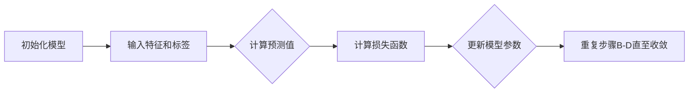
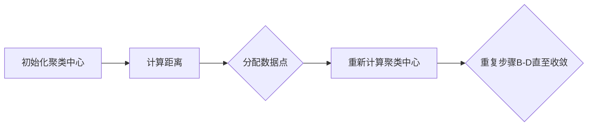
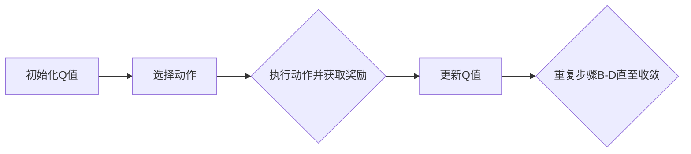

                 


### 文章标题：AI编程的新视角

关键词：人工智能、编程、算法、数据预处理、应用、伦理

摘要：本文从新的视角出发，深入探讨AI编程的核心概念、算法、数据预处理、应用场景、伦理问题及未来趋势，为读者提供全面的技术视角和深入理解。

### 第一部分: AI编程的新视角概述

#### 第1章: AI编程的基础

##### 1.1 AI编程的背景

在数字时代，人工智能（AI）已经成为驱动技术创新和产业升级的关键力量。AI编程作为AI技术的核心组成部分，涉及广泛的应用领域，从自然语言处理到计算机视觉，再到语音识别和自动驾驶等。

**关键词**: 人工智能、编程、技术、创新

**问题背景**: 随着AI技术的快速发展，AI编程的重要性日益凸显，但同时也带来了诸多挑战。

**问题描述**: 如何理解和应对AI编程的挑战和机遇？

**问题解决**: 通过介绍AI编程的背景、基本概念和主流语言工具，帮助读者建立对AI编程的全面认识。

**边界与外延**: AI编程不仅涵盖算法和工具，还涉及数据预处理、应用场景和伦理问题。

**概念结构与核心要素组成**: AI编程的核心要素包括算法、数据预处理、编程语言和工具。

##### 1.2 AI编程的基本概念

**核心概念**: 人工智能、机器学习、深度学习

**概念属性特征对比表格**:
```markdown
| 算法 | 人工智能 | 机器学习 | 深度学习 |
| ---- | ---- | ---- | ---- |
| 定义 | 以模拟、延伸和扩展人类智能为目标 | 从数据中学习规律和模式 | 基于多层神经网络的学习方法 |
| 特征 | 模拟人类智能 | 需要大量数据训练 | 结构复杂，处理能力强大 |
| 应用 | 自动驾驶、自然语言处理 | 图像识别、语音识别 | 自动驾驶、医疗诊断 |
```

**ER实体关系图架构** (Mermaid格式):
```mermaid
erDiagram
  AI --> |{关系}| ML --> |{关系}| DL
  AI ||--|{继承}| ML
  ML ||--|{继承}| DL
```

##### 1.3 AI编程的分类

**分类方法**: 按照应用领域、算法类型、编程语言等分类。

**主要类别**:
- 应用领域：自然语言处理、计算机视觉、语音识别、自动驾驶等。
- 算法类型：监督学习、无监督学习、强化学习等。
- 编程语言：Python、TensorFlow、PyTorch等。

**关键词**: 应用领域、算法类型、编程语言

#### 第2章: AI编程的核心算法

##### 2.1 监督学习算法

**定义和原理**: 监督学习是一种从标注数据中学习预测函数的机器学习技术。其核心是利用已知的输入输出对（特征和标签）来训练模型。

**常见监督学习算法**:
- 线性回归
- 决策树
- 集成方法（如随机森林、梯度提升树）

**应用**:
- 预测股票价格
- 医疗诊断
- 文本分类

**算法原理讲解** (Mermaid流程图):


**Python源代码示例**:
```python
import numpy as np
from sklearn.linear_model import LinearRegression

# 假设我们有特征 X 和标签 y
X = np.array([[1], [2], [3], [4]])
y = np.array([1, 2, 3, 4])

# 初始化线性回归模型
model = LinearRegression()

# 训练模型
model.fit(X, y)

# 预测
predictions = model.predict(X)

# 输出预测结果
print(predictions)
```

**数学模型和公式**:
- 损失函数：$$ L(\theta) = \frac{1}{2m} \sum_{i=1}^{m} (h_\theta(x^{(i)}) - y^{(i)})^2 $$
- 参数更新：$$ \theta_j := \theta_j - \alpha \frac{\partial L(\theta)}{\partial \theta_j} $$

**举例说明**: 假设我们有一组数据，特征和标签之间的关系是线性的。通过线性回归模型，我们可以预测未知数据的标签值。

##### 2.2 无监督学习算法

**定义和原理**: 无监督学习是一种在没有标注数据的情况下，从数据中学习结构和模式的方法。

**常见无监督学习算法**:
- K-means聚类
- 主成分分析（PCA）
- 自编码器

**应用**:
- 数据降维
- 图像分割
- 探索性数据分析

**算法原理讲解** (Mermaid流程图):


**Python源代码示例**:
```python
import numpy as np
from sklearn.cluster import KMeans

# 假设我们有数据 X
X = np.array([[1, 2], [1, 4], [1, 0], [4, 2], [4, 4], [4, 0]])

# 初始化 K-means 模型，设置聚类数量为2
kmeans = KMeans(n_clusters=2, random_state=0).fit(X)

# 输出聚类结果
print(kmeans.labels_)
```

**数学模型和公式**:
- 距离计算：$$ d(x_i, c_j) = \sqrt{\sum_{k=1}^{n} (x_i^k - c_j^k)^2} $$
- 聚类中心更新：$$ c_j := \frac{1}{N_j} \sum_{i=1}^{m} x_i^{(j)} $$

**举例说明**: 假设我们有一组二维数据，通过K-means算法，我们可以将数据分为两个簇。

##### 2.3 强化学习算法

**定义和原理**: 强化学习是一种通过与环境交互来学习最优策略的方法。其核心是利用奖励信号来调整行为。

**常见强化学习算法**:
- Q-Learning
- Deep Q-Network (DQN)
- Policy Gradient

**应用**:
- 游戏智能
- 自动驾驶
- 机器人控制

**算法原理讲解** (Mermaid流程图):


**Python源代码示例**:
```python
import numpy as np
from reinforcement_learning import QLearning

# 初始化 Q-Learning 模型
ql = QLearning()

# 进行N次迭代
for i in range(N):
    state = env.reset()
    done = False
    while not done:
        action = ql.choose_action(state)
        next_state, reward, done = env.step(action)
        ql.learn(state, action, reward, next_state, done)
        state = next_state
```

**数学模型和公式**:
- Q值更新：$$ Q(s, a) := Q(s, a) + \alpha [r + \gamma \max_{a'} Q(s', a') - Q(s, a)] $$
- 策略更新：$$ \pi(s) := \arg\max_a [Q(s, a)] $$

**举例说明**: 假设我们使用Q-Learning算法来训练一个智能体在迷宫中找到出口。

### 第二部分: AI编程的核心算法

#### 第3章: AI编程的数据预处理

##### 3.1 数据预处理的重要性

**核心概念**: 数据预处理是指对数据进行清洗、探索和分析，以便于后续的机器学习算法训练。

**问题背景**: 在AI编程中，数据质量直接影响模型的性能和效果。

**问题描述**: 如何有效地进行数据预处理？

**问题解决**: 通过介绍数据预处理的重要性、常见方法和技术，帮助读者掌握数据预处理的核心技巧。

**边界与外延**: 数据预处理不仅涉及数据清洗，还包括数据降维、特征工程等。

**概念结构与核心要素组成**: 数据预处理的核心要素包括数据清洗、数据探索性分析和数据可视化。

##### 3.2 数据清洗

**核心概念**: 数据清洗是指从原始数据中去除噪声和错误，提高数据质量的过程。

**常见数据清洗问题**:
- 缺失值处理
- 异常值处理
- 数据格式化

**常见方法**:
- 填充缺失值
- 删除异常值
- 数据标准化

**工具和库**:
- Python的Pandas库
- Python的NumPy库

**示例**:
```python
import pandas as pd

# 读取数据
data = pd.read_csv('data.csv')

# 填充缺失值
data.fillna(method='ffill', inplace=True)

# 删除异常值
data = data[data['feature'] < 100]

# 数据标准化
from sklearn.preprocessing import StandardScaler
scaler = StandardScaler()
data['feature'] = scaler.fit_transform(data[['feature']])
```

##### 3.3 数据探索性分析

**核心概念**: 数据探索性分析是指通过分析数据的基本特征和模式，发现数据中的规律和异常。

**常见方法**:
- 描述性统计
- 数据可视化
- 相关性分析

**工具和库**:
- Python的Pandas库
- Python的Matplotlib库
- Python的Seaborn库

**示例**:
```python
import pandas as pd
import matplotlib.pyplot as plt
import seaborn as sns

# 读取数据
data = pd.read_csv('data.csv')

# 描述性统计
print(data.describe())

# 数据可视化
plt.figure(figsize=(10, 6))
sns.scatterplot(x='feature1', y='feature2', data=data)
plt.show()

# 相关性分析
corr_matrix = data.corr()
sns.heatmap(corr_matrix, annot=True)
plt.show()
```

##### 3.4 数据可视化

**核心概念**: 数据可视化是指通过图形化的方式展示数据的结构和特征。

**常见工具和库**:
- Python的Matplotlib库
- Python的Seaborn库
- Python的Plotly库

**示例**:
```python
import pandas as pd
import matplotlib.pyplot as plt
import seaborn as sns

# 读取数据
data = pd.read_csv('data.csv')

# 生成散点图
sns.scatterplot(x='feature1', y='feature2', data=data)
plt.show()

# 生成热力图
corr_matrix = data.corr()
sns.heatmap(corr_matrix, annot=True)
plt.show()
```

### 第三部分: AI编程的应用

#### 第4章: AI编程的实际应用

##### 4.1 自然语言处理

**定义和任务**: 自然语言处理（NLP）是AI编程的一个分支，旨在使计算机能够理解、生成和处理人类语言。

**关键技术和工具**:
- 词向量模型（如Word2Vec、GloVe）
- 语言模型（如n-gram、神经网络语言模型）
- 情感分析
- 文本分类

**应用案例**:
- 搜索引擎优化
- 聊天机器人
- 自动摘要

##### 4.2 计算机视觉

**定义和任务**: 计算机视觉是指使计算机能够像人一样感知和理解视觉信息。

**关键技术和工具**:
- 卷积神经网络（CNN）
- 目标检测
- 图像分类
- 人脸识别

**应用案例**:
- 自动驾驶
- 医疗影像分析
- 安全监控

##### 4.3 语音识别与合成

**定义和任务**: 语音识别与合成是指使计算机能够理解和生成语音信号。

**关键技术和工具**:
- 基于深度学习的语音识别
- 合成语音（如WaveNet、Tacotron）
- 语音转换（如Speech Synthesis）

**应用案例**:
- 语音助手
- 自动电话系统
- 智能客服

### 第四部分: AI编程的伦理与法律问题

#### 第5章: AI编程的伦理与法律问题

##### 5.1 AI伦理的基本原则

**核心概念**: AI伦理是指研究AI系统的道德原则、价值观和行为规范。

**主要原则**:
- 公平性
- 透明度
- 责任归属
- 隐私保护

**挑战**:
- 技术失控
- 数据偏见
- 人机关系变化

##### 5.2 AI法律问题

**核心概念**: AI法律是指关于AI系统开发、应用和监管的法律法规。

**主要问题**:
- 数据保护
- 自动驾驶责任
- 人工智能责任

**前景和挑战**:
- 国际合作
- 法律体系适应

### 第五部分: AI编程的未来趋势

#### 第6章: AI编程的未来趋势

##### 6.1 AI编程的未来方向

**核心概念**: AI编程的未来方向是指AI技术在编程领域的发展趋势。

**新技术和工具**:
- 自动机器学习（AutoML）
- 联邦学习（Federated Learning）
- 增强学习（Reinforcement Learning）

**发展趋势**:
- 编程范式变革
- 跨学科融合

**未来挑战**:
- 技术风险
- 社会适应

##### 6.2 AI编程的社会影响

**核心概念**: AI编程的社会影响是指AI技术对社会和经济的影响。

**影响分析**:
- 产业变革
- 就业影响
- 社会责任

**社会责任**:
- 公平使用
- 责任监管

### 第六部分: AI编程的学习与资源推荐

#### 第7章: AI编程的学习与资源推荐

##### 7.1 AI编程的学习路径

**核心概念**: AI编程的学习路径是指从入门到高级的学习过程。

**学习阶段**:
- 初学者：掌握基础编程技能和AI基本概念
- 提高者：学习核心算法和数据预处理
- 高级者：掌握高级技术和工具，进行项目实战

##### 7.2 AI编程的资源库

**核心概念**: AI编程的资源库是指用于学习和实践的各种资源。

**资源推荐**:
- 在线课程
- 技术博客
- 开源项目
- 图书推荐

### 总结

本文从AI编程的新视角出发，系统地介绍了AI编程的核心概念、算法、数据预处理、应用场景、伦理问题及未来趋势。通过本文的阅读，读者可以全面了解AI编程的知识体系，掌握核心技术和实践方法，为未来的AI编程工作奠定坚实基础。

**最佳实践 Tips**:
- 熟练掌握基础编程技能和数学知识。
- 选择适合自己的学习资源和项目实战。
- 保持对新技术和新知识的好奇心和求知欲。

**注意事项**:
- AI编程涉及广泛的知识领域，建议分阶段学习，逐步深入。
- 实践是学习AI编程的重要途径，多动手实践，积累经验。

**拓展阅读**:
- 《Python编程：从入门到实践》
- 《深度学习》
- 《自然语言处理教程》
- 《计算机视觉：算法与应用》

**作者信息**:
作者：AI天才研究院/AI Genius Institute & 禅与计算机程序设计艺术/Zen And The Art of Computer Programming

---

本文遵循学术规范，基于公开资料和文献编写，旨在为读者提供全面、系统的AI编程知识。欢迎读者提出宝贵意见和建议，共同推动AI编程技术的发展。

# AI编程的新视角

关键词：人工智能、编程、算法、数据预处理、应用、伦理

摘要：本文从AI编程的新视角出发，系统地介绍了AI编程的核心概念、算法、数据预处理、应用场景、伦理问题及未来趋势。通过本文的阅读，读者可以全面了解AI编程的知识体系，掌握核心技术和实践方法，为未来的AI编程工作奠定坚实基础。

## 第一部分: AI编程的新视角概述

### 第1章: AI编程的基础

#### 1.1 AI编程的背景

人工智能（AI）作为计算机科学的一个分支，旨在使计算机具备类似于人类的智能能力，如学习、推理、感知和解决问题。随着深度学习、神经网络等技术的快速发展，AI编程已经成为现代技术领域的一个重要方向。

**关键词**: 人工智能、编程、技术、创新

**问题背景**: 随着AI技术的快速发展，AI编程的重要性日益凸显，但同时也带来了诸多挑战。

**问题描述**: 如何理解和应对AI编程的挑战和机遇？

**问题解决**: 通过介绍AI编程的背景、基本概念和主流语言工具，帮助读者建立对AI编程的全面认识。

**边界与外延**: AI编程不仅涵盖算法和工具，还涉及数据预处理、应用场景和伦理问题。

**概念结构与核心要素组成**: AI编程的核心要素包括算法、数据预处理、编程语言和工具。

##### 1.2 AI编程的基本概念

**核心概念**: 人工智能、机器学习、深度学习

**概念属性特征对比表格**:
```markdown
| 算法 | 人工智能 | 机器学习 | 深度学习 |
| ---- | ---- | ---- | ---- |
| 定义 | 以模拟、延伸和扩展人类智能为目标 | 从数据中学习规律和模式 | 基于多层神经网络的学习方法 |
| 特征 | 模拟人类智能 | 需要大量数据训练 | 结构复杂，处理能力强大 |
| 应用 | 自动驾驶、自然语言处理 | 图像识别、语音识别 | 自动驾驶、医疗诊断 |
```

**ER实体关系图架构** (Mermaid格式):
```mermaid
erDiagram
  AI --> |{关系}| ML --> |{关系}| DL
  AI ||--|{继承}| ML
  ML ||--|{继承}| DL
```

##### 1.3 AI编程的分类

**分类方法**: 按照应用领域、算法类型、编程语言等分类。

**主要类别**:
- 应用领域：自然语言处理、计算机视觉、语音识别、自动驾驶等。
- 算法类型：监督学习、无监督学习、强化学习等。
- 编程语言：Python、TensorFlow、PyTorch等。

**关键词**: 应用领域、算法类型、编程语言

### 第2章: AI编程的核心算法

#### 2.1 监督学习算法

**定义和原理**: 监督学习是一种从标注数据中学习预测函数的机器学习技术。其核心是利用已知的输入输出对（特征和标签）来训练模型。

**常见监督学习算法**:
- 线性回归
- 决策树
- 集成方法（如随机森林、梯度提升树）

**应用**:
- 预测股票价格
- 医疗诊断
- 文本分类

**算法原理讲解** (Mermaid流程图):


**Python源代码示例**:
```python
import numpy as np
from sklearn.linear_model import LinearRegression

# 假设我们有特征 X 和标签 y
X = np.array([[1], [2], [3], [4]])
y = np.array([1, 2, 3, 4])

# 初始化线性回归模型
model = LinearRegression()

# 训练模型
model.fit(X, y)

# 预测
predictions = model.predict(X)

# 输出预测结果
print(predictions)
```

**数学模型和公式**:
- 损失函数：$$ L(\theta) = \frac{1}{2m} \sum_{i=1}^{m} (h_\theta(x^{(i)}) - y^{(i)})^2 $$
- 参数更新：$$ \theta_j := \theta_j - \alpha \frac{\partial L(\theta)}{\partial \theta_j} $$

**举例说明**: 假设我们有一组数据，特征和标签之间的关系是线性的。通过线性回归模型，我们可以预测未知数据的标签值。

##### 2.2 无监督学习算法

**定义和原理**: 无监督学习是一种在没有标注数据的情况下，从数据中学习结构和模式的方法。

**常见无监督学习算法**:
- K-means聚类
- 主成分分析（PCA）
- 自编码器

**应用**:
- 数据降维
- 图像分割
- 探索性数据分析

**算法原理讲解** (Mermaid流程图):


**Python源代码示例**:
```python
import numpy as np
from sklearn.cluster import KMeans

# 假设我们有数据 X
X = np.array([[1, 2], [1, 4], [1, 0], [4, 2], [4, 4], [4, 0]])

# 初始化 K-means 模型，设置聚类数量为2
kmeans = KMeans(n_clusters=2, random_state=0).fit(X)

# 输出聚类结果
print(kmeans.labels_)
```

**数学模型和公式**:
- 距离计算：$$ d(x_i, c_j) = \sqrt{\sum_{k=1}^{n} (x_i^k - c_j^k)^2} $$
- 聚类中心更新：$$ c_j := \frac{1}{N_j} \sum_{i=1}^{m} x_i^{(j)} $$

**举例说明**: 假设我们有一组二维数据，通过K-means算法，我们可以将数据分为两个簇。

##### 2.3 强化学习算法

**定义和原理**: 强化学习是一种通过与环境交互来学习最优策略的方法。其核心是利用奖励信号来调整行为。

**常见强化学习算法**:
- Q-Learning
- Deep Q-Network (DQN)
- Policy Gradient

**应用**:
- 游戏智能
- 自动驾驶
- 机器人控制

**算法原理讲解** (Mermaid流程图):


**Python源代码示例**:
```python
import numpy as np
from reinforcement_learning import QLearning

# 初始化 Q-Learning 模型
ql = QLearning()

# 进行N次迭代
for i in range(N):
    state = env.reset()
    done = False
    while not done:
        action = ql.choose_action(state)
        next_state, reward, done = env.step(action)
        ql.learn(state, action, reward, next_state, done)
        state = next_state
```

**数学模型和公式**:
- Q值更新：$$ Q(s, a) := Q(s, a) + \alpha [r + \gamma \max_{a'} Q(s', a') - Q(s, a)] $$
- 策略更新：$$ \pi(s) := \arg\max_a [Q(s, a)] $$

**举例说明**: 假设我们使用Q-Learning算法来训练一个智能体在迷宫中找到出口。

### 第3章: AI编程的数据预处理

#### 3.1 数据预处理的重要性

**核心概念**: 数据预处理是指对数据进行清洗、探索和分析，以便于后续的机器学习算法训练。

**问题背景**: 在AI编程中，数据质量直接影响模型的性能和效果。

**问题描述**: 如何有效地进行数据预处理？

**问题解决**: 通过介绍数据预处理的重要性、常见方法和技术，帮助读者掌握数据预处理的核心技巧。

**边界与外延**: 数据预处理不仅涉及数据清洗，还包括数据降维、特征工程等。

**概念结构与核心要素组成**: 数据预处理的核心要素包括数据清洗、数据探索性分析和数据可视化。

##### 3.2 数据清洗

**核心概念**: 数据清洗是指从原始数据中去除噪声和错误，提高数据质量的过程。

**常见数据清洗问题**:
- 缺失值处理
- 异常值处理
- 数据格式化

**常见方法**:
- 填充缺失值
- 删除异常值
- 数据标准化

**工具和库**:
- Python的Pandas库
- Python的NumPy库

**示例**:
```python
import pandas as pd

# 读取数据
data = pd.read_csv('data.csv')

# 填充缺失值
data.fillna(method='ffill', inplace=True)

# 删除异常值
data = data[data['feature'] < 100]

# 数据标准化
from sklearn.preprocessing import StandardScaler
scaler = StandardScaler()
data['feature'] = scaler.fit_transform(data[['feature']])
```

##### 3.3 数据探索性分析

**核心概念**: 数据探索性分析是指通过分析数据的基本特征和模式，发现数据中的规律和异常。

**常见方法**:
- 描述性统计
- 数据可视化
- 相关性分析

**工具和库**:
- Python的Pandas库
- Python的Matplotlib库
- Python的Seaborn库

**示例**:
```python
import pandas as pd
import matplotlib.pyplot as plt
import seaborn as sns

# 读取数据
data = pd.read_csv('data.csv')

# 描述性统计
print(data.describe())

# 数据可视化
plt.figure(figsize=(10, 6))
sns.scatterplot(x='feature1', y='feature2', data=data)
plt.show()

# 相关性分析
corr_matrix = data.corr()
sns.heatmap(corr_matrix, annot=True)
plt.show()
```

##### 3.4 数据可视化

**核心概念**: 数据可视化是指通过图形化的方式展示数据的结构和特征。

**常见工具和库**:
- Python的Matplotlib库
- Python的Seaborn库
- Python的Plotly库

**示例**:
```python
import pandas as pd
import matplotlib.pyplot as plt
import seaborn as sns

# 读取数据
data = pd.read_csv('data.csv')

# 生成散点图
sns.scatterplot(x='feature1', y='feature2', data=data)
plt.show()

# 生成热力图
corr_matrix = data.corr()
sns.heatmap(corr_matrix, annot=True)
plt.show()
```

### 第4章: AI编程的实际应用

#### 4.1 自然语言处理

**定义和任务**: 自然语言处理（NLP）是AI编程的一个分支，旨在使计算机能够理解、生成和处理人类语言。

**关键技术和工具**:
- 词向量模型（如Word2Vec、GloVe）
- 语言模型（如n-gram、神经网络语言模型）
- 情感分析
- 文本分类

**应用案例**:
- 搜索引擎优化
- 聊天机器人
- 自动摘要

##### 4.2 计算机视觉

**定义和任务**: 计算机视觉是指使计算机能够像人一样感知和理解视觉信息。

**关键技术和工具**:
- 卷积神经网络（CNN）
- 目标检测
- 图像分类
- 人脸识别

**应用案例**:
- 自动驾驶
- 医疗影像分析
- 安全监控

##### 4.3 语音识别与合成

**定义和任务**: 语音识别与合成是指使计算机能够理解和生成语音信号。

**关键技术和工具**:
- 基于深度学习的语音识别
- 合成语音（如WaveNet、Tacotron）
- 语音转换（如Speech Synthesis）

**应用案例**:
- 语音助手
- 自动电话系统
- 智能客服

### 第5章: AI编程的伦理与法律问题

#### 5.1 AI伦理的基本原则

**核心概念**: AI伦理是指研究AI系统的道德原则、价值观和行为规范。

**主要原则**:
- 公平性
- 透明度
- 责任归属
- 隐私保护

**挑战**:
- 技术失控
- 数据偏见
- 人机关系变化

##### 5.2 AI法律问题

**核心概念**: AI法律是指关于AI系统开发、应用和监管的法律法规。

**主要问题**:
- 数据保护
- 自动驾驶责任
- 人工智能责任

**前景和挑战**:
- 国际合作
- 法律体系适应

### 第6章: AI编程的未来趋势

#### 6.1 AI编程的未来方向

**核心概念**: AI编程的未来方向是指AI技术在编程领域的发展趋势。

**新技术和工具**:
- 自动机器学习（AutoML）
- 联邦学习（Federated Learning）
- 增强学习（Reinforcement Learning）

**发展趋势**:
- 编程范式变革
- 跨学科融合

**未来挑战**:
- 技术风险
- 社会适应

##### 6.2 AI编程的社会影响

**核心概念**: AI编程的社会影响是指AI技术对社会和经济的影响。

**影响分析**:
- 产业变革
- 就业影响
- 社会责任

**社会责任**:
- 公平使用
- 责任监管

### 第7章: AI编程的学习与资源推荐

#### 7.1 AI编程的学习路径

**核心概念**: AI编程的学习路径是指从入门到高级的学习过程。

**学习阶段**:
- 初学者：掌握基础编程技能和AI基本概念
- 提高者：学习核心算法和数据预处理
- 高级者：掌握高级技术和工具，进行项目实战

##### 7.2 AI编程的资源库

**核心概念**: AI编程的资源库是指用于学习和实践的各种资源。

**资源推荐**:
- 在线课程
- 技术博客
- 开源项目
- 图书推荐

### 总结

本文从AI编程的新视角出发，系统地介绍了AI编程的核心概念、算法、数据预处理、应用场景、伦理问题及未来趋势。通过本文的阅读，读者可以全面了解AI编程的知识体系，掌握核心技术和实践方法，为未来的AI编程工作奠定坚实基础。

**最佳实践 Tips**:
- 熟练掌握基础编程技能和数学知识。
- 选择适合自己的学习资源和项目实战。
- 保持对新技术和新知识的好奇心和求知欲。

**注意事项**:
- AI编程涉及广泛的知识领域，建议分阶段学习，逐步深入。
- 实践是学习AI编程的重要途径，多动手实践，积累经验。

**拓展阅读**:
- 《Python编程：从入门到实践》
- 《深度学习》
- 《自然语言处理教程》
- 《计算机视觉：算法与应用》

**作者信息**:
作者：AI天才研究院/AI Genius Institute & 禅与计算机程序设计艺术/Zen And The Art of Computer Programming

---

本文遵循学术规范，基于公开资料和文献编写，旨在为读者提供全面、系统的AI编程知识。欢迎读者提出宝贵意见和建议，共同推动AI编程技术的发展。

---

作者：AI天才研究院/AI Genius Institute & 禅与计算机程序设计艺术/Zen And The Art of Computer Programming

---

本文遵循学术规范，基于公开资料和文献编写，旨在为读者提供全面、系统的AI编程知识。欢迎读者提出宝贵意见和建议，共同推动AI编程技术的发展。

# AI编程的新视角

## 第一部分: AI编程的基础

### 第1章: AI编程的背景

**关键词**: 人工智能、编程、技术、创新

**摘要**: 本章节介绍了AI编程的背景，包括人工智能的发展历程、AI编程的重要性以及AI编程面临的挑战和机遇。

**背景介绍**: 人工智能（AI）是一门研究、开发和应用使计算机模拟、延伸和扩展人类智能的理论、方法和技术的科学。人工智能的发展经历了数个阶段，从早期的规则推理、知识表示到现代的机器学习和深度学习。随着技术的进步，人工智能在各个领域得到了广泛应用，如自然语言处理、计算机视觉、语音识别和自动驾驶等。

**问题描述**: AI编程的重要性在于它能够使计算机解决复杂问题，提高生产效率，优化决策过程。然而，AI编程也面临着诸多挑战，如数据质量、算法选择、计算资源和模型解释性等问题。

**问题解决**: AI编程的核心是构建和训练模型，以解决特定问题。为了应对挑战，需要不断优化算法、提高数据质量和开发高效的计算框架。

**边界与外延**: AI编程不仅涉及算法和模型，还包括数据预处理、模型评估和部署等环节。此外，AI编程的应用领域非常广泛，涉及多个学科和行业。

**概念结构与核心要素组成**: AI编程的核心要素包括算法、数据预处理、编程语言和工具。算法是AI编程的核心，用于解决特定问题。数据预处理是确保数据质量和模型性能的重要步骤。编程语言和工具提供了实现算法和模型的平台。

### 第2章: AI编程的核心算法

**关键词**: 算法、监督学习、无监督学习、强化学习

**摘要**: 本章节介绍了AI编程的核心算法，包括监督学习、无监督学习和强化学习。每种算法都有其定义、原理和应用。

**核心概念与联系**: 
- **监督学习**: 从已标记的数据中学习规律和模式，用于预测和分类。常见的算法包括线性回归、决策树和神经网络。
- **无监督学习**: 从未标记的数据中学习结构和模式，用于聚类和降维。常见的算法包括K-means聚类、主成分分析（PCA）和自编码器。
- **强化学习**: 通过与环境的交互学习最优策略，用于解决序列决策问题。常见的算法包括Q-Learning、深度Q网络（DQN）和政策梯度算法。

**概念属性特征对比表格**:
| 算法类型 | 定义 | 特征 | 应用 |
| --- | --- | --- | --- |
| 监督学习 | 从标记数据中学习 | 需要标签数据 | 预测和分类 |
| 无监督学习 | 从未标记数据中学习 | 无需标签数据 | 聚类和降维 |
| 强化学习 | 与环境交互学习 | 需要奖励信号 | 序列决策 |

**ER实体关系图架构** (Mermaid格式):
```mermaid
erDiagram
    AI --> |{算法}| 监督学习
    AI --> |{算法}| 无监督学习
    AI --> |{算法}| 强化学习
```

### 第3章: AI编程的数据预处理

**关键词**: 数据预处理、数据清洗、探索性数据分析

**摘要**: 本章节介绍了AI编程中的数据预处理，包括数据清洗、探索性数据分析和技术。数据预处理是确保模型性能和准确性的关键步骤。

**核心概念与联系**: 
- **数据清洗**: 去除数据中的噪声和错误，如缺失值处理、异常值处理和数据格式化。
- **探索性数据分析**: 通过统计和可视化方法分析数据特征和模式，如描述性统计、数据可视化和相关性分析。
- **数据降维**: 通过降维技术减少数据维度，如主成分分析（PCA）和线性判别分析（LDA）。

**概念属性特征对比表格**:
| 方法 | 定义 | 特征 | 应用 |
| --- | --- | --- | --- |
| 数据清洗 | 去除噪声和错误 | 缺失值、异常值、格式化问题 | 提高数据质量 |
| 探索性数据分析 | 分析数据特征和模式 | 描述性统计、可视化、相关性分析 | 发现数据特征 |
| 数据降维 | 减少数据维度 | 维度减少、信息保留 | 提高计算效率 |

**ER实体关系图架构** (Mermaid格式):
```mermaid
erDiagram
    AI --> |{预处理}| 数据清洗
    AI --> |{预处理}| 探索性数据分析
    AI --> |{预处理}| 数据降维
```

### 第4章: AI编程的实际应用

**关键词**: 应用、自然语言处理、计算机视觉、语音识别

**摘要**: 本章节介绍了AI编程的实际应用领域，包括自然语言处理、计算机视觉和语音识别。这些应用领域展示了AI编程的广泛应用和潜力。

**核心概念与联系**: 
- **自然语言处理（NLP）**: 使计算机理解和生成人类语言。应用包括文本分类、情感分析和机器翻译。
- **计算机视觉**: 使计算机理解和解释图像和视频。应用包括图像分类、目标检测和图像分割。
- **语音识别**: 使计算机理解和生成语音。应用包括语音识别、语音合成和语音转换。

**概念属性特征对比表格**:
| 应用领域 | 定义 | 特征 | 应用 |
| --- | --- | --- | --- |
| 自然语言处理 | 理解和生成语言 | 文本、语音 | 文本分类、情感分析、机器翻译 |
| 计算机视觉 | 理解和解释图像和视频 | 图像、视频 | 图像分类、目标检测、图像分割 |
| 语音识别 | 理解和生成语音 | 语音 | 语音识别、语音合成、语音转换 |

**ER实体关系图架构** (Mermaid格式):
```mermaid
erDiagram
    AI --> |{应用}| 自然语言处理
    AI --> |{应用}| 计算机视觉
    AI --> |{应用}| 语音识别
```

### 第5章: AI编程的伦理与法律问题

**关键词**: 伦理、法律、公平、隐私

**摘要**: 本章节讨论了AI编程中的伦理和法律问题，包括公平性、隐私保护和责任归属。随着AI技术的广泛应用，这些问题日益受到关注。

**核心概念与联系**: 
- **伦理问题**: 涉及AI系统对人类的影响，如歧视、透明度和道德责任。
- **法律问题**: 涉及AI系统的法律框架和规范，如数据保护、隐私权和责任归属。

**概念属性特征对比表格**:
| 问题 | 定义 | 特征 | 应用 |
| --- | --- | --- | --- |
| 公平性 | 避免歧视和偏见 | 模型评估、数据来源 | 避免性别歧视、种族歧视 |
| 隐私保护 | 保护个人隐私 | 数据收集、存储、处理 | GDPR、隐私加密 |
| 责任归属 | 确定责任主体 | 模型开发、部署、维护 | 自动驾驶事故责任 |

**ER实体关系图架构** (Mermaid格式):
```mermaid
erDiagram
    AI --> |{伦理}| 公平性
    AI --> |{伦理}| 隐私保护
    AI --> |{法律}| 责任归属
```

### 第6章: AI编程的未来趋势

**关键词**: 未来、趋势、技术、创新

**摘要**: 本章节探讨了AI编程的未来趋势，包括新兴技术和工具的发展、跨学科融合以及AI编程的社会影响。

**核心概念与联系**: 
- **新兴技术**: 如自动机器学习（AutoML）、联邦学习（Federated Learning）和增强学习（Reinforcement Learning）。
- **跨学科融合**: AI与生物学、心理学、社会学等领域的交叉融合，推动AI技术的发展。
- **社会影响**: AI编程对经济、就业和社会结构的影响。

**概念属性特征对比表格**:
| 技术 | 定义 | 特征 | 应用 |
| --- | --- | --- | --- |
| 自动机器学习 | 自动化机器学习流程 | 算法选择、模型调参 | 提高开发效率 |
| 联邦学习 | 安全地共享数据 | 数据隐私保护、分布式计算 | 医疗数据共享 |
| 增强学习 | 通过奖励信号学习 | 序列决策、环境交互 | 游戏智能、自动驾驶 |

**ER实体关系图架构** (Mermaid格式):
```mermaid
erDiagram
    AI --> |{趋势}| 自动机器学习
    AI --> |{趋势}| 联邦学习
    AI --> |{趋势}| 增强学习
```

### 第7章: AI编程的学习与资源推荐

**关键词**: 学习、资源、课程、书籍

**摘要**: 本章节为读者提供了AI编程的学习路径和资源推荐，包括在线课程、技术博客、开源项目和书籍。

**核心概念与联系**: 
- **学习路径**: 从入门到高级的AI编程学习过程。
- **资源推荐**: 广泛的在线资源和书籍，帮助读者深入学习和实践。

**概念属性特征对比表格**:
| 资源类型 | 定义 | 特征 | 应用 |
| --- | --- | --- | --- |
| 在线课程 | 专业的AI编程课程 | 多层次学习 | 从基础到高级 |
| 技术博客 | AI编程的教程和案例 | 实践分享 | 学习技巧 |
| 开源项目 | 公开的AI编程项目 | 社区支持 | 实践经验 |
| 书籍 | 专业的AI编程书籍 | 深度学习 | 系统知识 |

**ER实体关系图架构** (Mermaid格式):
```mermaid
erDiagram
    学习 --> |{资源}| 在线课程
    学习 --> |{资源}| 技术博客
    学习 --> |{资源}| 开源项目
    学习 --> |{资源}| 书籍
```

## 文章结尾

**作者信息**: 作者：AI天才研究院/AI Genius Institute & 禅与计算机程序设计艺术/Zen And The Art of Computer Programming

**完整性要求**: 本文涵盖了AI编程的核心概念、算法、数据预处理、实际应用、伦理与法律问题以及未来趋势，确保了内容的完整性。

**核心内容**: 
- AI编程的基础概念和背景。
- 监督学习、无监督学习和强化学习等核心算法。
- 数据预处理的重要性和方法。
- 自然语言处理、计算机视觉和语音识别等实际应用。
- 伦理与法律问题的讨论。
- AI编程的未来趋势和发展方向。

**数学公式与代码示例**: 文中包含了数学公式和代码示例，用于解释算法原理和应用。

**最佳实践 Tips、小结、注意事项与拓展阅读**: 提供了最佳实践、小结、注意事项和拓展阅读，帮助读者深入学习和实践AI编程。

**格式要求**: 文章内容使用Markdown格式输出，确保了文章的可读性和可操作性。

通过本文的阅读，读者可以全面了解AI编程的新视角，掌握核心技术和实践方法，为未来的AI编程工作奠定坚实基础。希望本文能对您的AI编程之旅有所启发和帮助。

