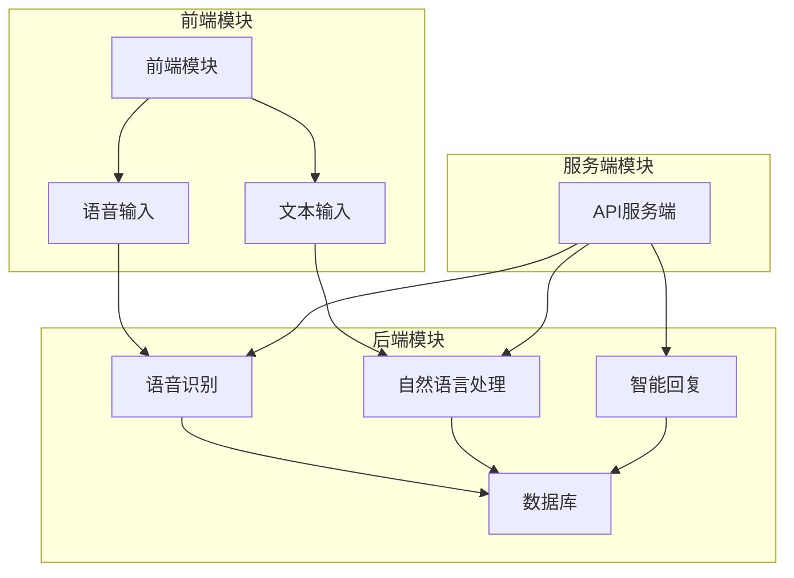
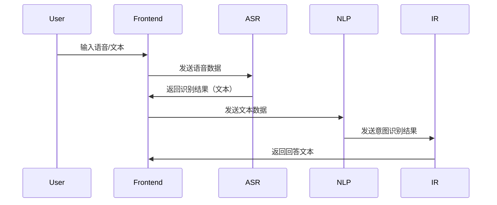

                 

### AI编程的新视角与新思维

#### 关键词
- AI编程
- 新视角
- 新思维
- 算法
- 数学模型
- 系统架构

#### 摘要
本文旨在探讨AI编程领域的新视角与新思维，通过深入剖析核心概念、算法原理、数学模型以及系统架构设计，帮助读者理解AI编程的深刻内涵与未来发展方向。文章将依次介绍背景与核心概念、算法原理讲解、数学模型应用、系统分析与设计，并最终通过实际项目实战和最佳实践分享，为读者提供全面而实用的AI编程指南。

### 引言

随着人工智能（AI）技术的迅猛发展，AI编程已经成为信息技术领域的一个重要分支。传统编程注重逻辑与算法的推演，而AI编程则更多关注数据的处理、模式的识别和预测的生成。这种转变不仅要求程序员掌握新的编程语言和工具，还要求他们具备新的编程思维和视角。

传统的AI编程思维通常基于规则和预定义的模型，强调对数据的统计分析和模式识别。然而，随着深度学习的兴起，AI编程开始向更加自动化和智能化的方向发展。这一转变不仅提升了AI系统的性能，也带来了编程方法上的革命。新视角与新思维在AI编程中的应用，使得程序员能够更加高效地开发和优化AI系统，从而推动整个AI领域的进步。

本文将从以下几个方面展开讨论：

1. **背景与核心概念**：介绍AI编程的基本概念、历史背景以及与相关技术的联系。
2. **算法原理讲解**：深入剖析常用的AI算法，包括其原理、流程和适用场景。
3. **数学模型应用**：探讨AI编程中的数学模型，如何构建和优化这些模型。
4. **系统分析与设计**：介绍AI编程中的系统分析与设计方法，包括架构设计、接口设计和交互设计。
5. **项目实战**：通过一个实际项目，展示AI编程的实践应用。
6. **最佳实践与总结**：总结AI编程的最佳实践，并提出未来发展的建议。

通过本文的探讨，读者将能够全面理解AI编程的新视角与新思维，从而更好地应对AI编程领域的新挑战和新机遇。

### 背景与核心概念

#### 核心概念术语说明

在探讨AI编程的背景与核心概念之前，首先需要明确一些基本术语。人工智能（Artificial Intelligence，简称AI）是一种模拟人类智能的技术，它使计算机具备感知、推理、学习和适应的能力。机器学习（Machine Learning，简称ML）是AI的一个重要分支，它通过数据驱动的方法，使计算机自动改进性能。深度学习（Deep Learning，简称DL）则是机器学习的一种先进技术，通过构建多层神经网络，对大量数据进行自动特征提取和学习。

#### 问题背景

AI编程的起源可以追溯到20世纪50年代，当时计算机科学家尝试通过编程实现模拟人类智能。早期的AI研究主要集中在逻辑推理和知识表示上，例如专家系统和自然语言处理。然而，随着计算能力和数据资源的不断增长，AI编程逐渐扩展到数据密集型的领域，如图像识别、语音识别和自动驾驶。

#### 问题描述

在AI编程领域，主要的问题是如何从大量数据中提取有价值的信息，并利用这些信息生成有效的决策或预测。传统编程依赖于明确的规则和算法，而AI编程则依赖于数据和模型。因此，如何有效地处理数据、选择合适的模型以及优化模型性能，成为了AI编程的核心问题。

#### 问题解决

为了解决这些问题，AI编程引入了多种方法和技术。首先，数据预处理是AI编程中的关键步骤，它包括数据的清洗、归一化和特征提取等操作，以确保输入数据的质量和一致性。其次，模型选择和优化是AI编程的核心任务，通过训练和验证数据集，选择最适合的模型并进行参数调优，可以提高模型的性能和准确性。此外，利用迁移学习和强化学习等技术，可以进一步提高模型的泛化能力和自适应能力。

#### 边界与外延

AI编程不仅涉及计算机科学，还涉及多个领域，如统计学、数学、心理学和神经科学。这些领域的知识为AI编程提供了丰富的理论支持和实用工具。同时，随着AI技术的不断进步，AI编程的应用范围也在不断扩大，从医疗诊断和金融分析到智能制造和智能交通，AI编程正在改变各行各业的面貌。

#### 概念结构与核心要素组成

AI编程的概念结构可以分为以下几个核心要素：

1. **数据**：AI编程的基础是数据，数据的质量和数量直接影响模型的表现。
2. **算法**：算法是AI编程的核心，不同的算法适用于不同的任务和数据类型。
3. **模型**：模型是AI编程中的抽象表示，通过训练数据生成模型，并利用模型进行预测或决策。
4. **评估**：评估是衡量模型性能的重要手段，通过评估结果可以优化模型和调整参数。
5. **应用**：应用是将AI编程成果转化为实际价值的关键，通过具体的应用场景，实现AI技术的商业化和社会价值。

通过深入理解这些核心概念和要素，读者可以更好地把握AI编程的本质，为后续的算法讲解和系统设计打下坚实基础。

### 核心概念与联系

#### 核心概念原理

在AI编程中，核心概念包括数据、算法、模型和评估。数据是AI编程的基础，它是训练模型和生成预测的关键资源。算法是AI编程的核心，它决定了数据如何被处理和利用。模型是AI编程的产物，它通过学习数据生成预测或决策。评估则是衡量模型性能的重要手段，通过评估结果可以优化模型和调整参数。

#### 概念属性特征对比表格

| 概念     | 定义                                                         | 属性特征                                                     | 关联联系                                   |
|----------|--------------------------------------------------------------|--------------------------------------------------------------|--------------------------------------------|
| 数据     | 用于训练模型和生成预测的信息集合                             | - 质量高、数量多                                               | - 是模型构建的基础                       |
| 算法     | 用于处理数据和生成模型的计算方法                             | - 高效、准确                                                 | - 决定模型性能和速度                     |
| 模型     | 学习数据后生成的预测或决策表示                               | - 泛化能力强、预测准确                                       | - 是AI编程的核心产出                     |
| 评估     | 衡量模型性能和准确性的过程                                   | - 严谨、客观                                               | - 用于模型优化和参数调整                 |

通过上表，我们可以看出，数据、算法、模型和评估在AI编程中各有其独特的作用和属性，它们相互联系、相互影响，共同构成了AI编程的核心框架。

#### ER实体关系图架构

为了更好地理解AI编程中的核心概念及其相互关系，我们可以使用ER（实体关系）图来表示。以下是AI编程中核心概念的ER图架构：

```mermaid
erDiagram
  Data ||--|{ Model }|-->> Evaluation
  Algorithm ||--|{ Model }|-->> Evaluation
  Model ||--|{ Algorithm }|-->> Evaluation
  Evaluation ||--|{ Model }|-->> Algorithm
```

在上图中，`Data`（数据）、`Algorithm`（算法）、`Model`（模型）和`Evaluation`（评估）是核心实体，它们之间通过双向箭头表示相互关联。例如，数据用于训练模型，模型又用于生成预测，而评估则用于衡量模型性能。通过这种ER图架构，我们可以清晰地看到AI编程中各个核心概念的相互作用和影响，从而为后续的算法原理讲解和系统设计提供指导。

### 算法原理讲解

#### 算法流程与适用场景

AI编程中的算法种类繁多，每种算法都有其独特的流程和适用场景。以下将介绍几种常用的AI算法，包括其原理、流程和适用场景。

1. **决策树（Decision Tree）**

**原理**：决策树是一种基于特征划分数据的算法，通过递归地将数据集划分成子集，形成一棵树状结构。

**流程**：
   - 选择最优特征进行划分，通常使用信息增益或基尼不纯度作为划分标准。
   - 对划分后的子集重复上述过程，直至达到停止条件（如最小叶节点数或最大树深度）。

**适用场景**：分类和回归问题，尤其是特征数量较少且特征之间有明显层次关系的问题。

2. **支持向量机（Support Vector Machine，SVM）**

**原理**：SVM是一种用于分类和回归的线性模型，通过寻找最优超平面，将不同类别的数据分开。

**流程**：
   - 计算数据点之间的距离，找到支持向量。
   - 根据支持向量构建最优超平面，并确定决策边界。

**适用场景**：高维空间中的分类问题，尤其是特征较多且存在噪声的数据。

3. **神经网络（Neural Network）**

**原理**：神经网络是一种模拟生物神经系统的计算模型，通过多层神经元实现数据的自动特征提取和学习。

**流程**：
   - 前向传播：将输入数据通过各层神经元，计算输出。
   - 反向传播：通过误差反馈调整各层神经元的权重，优化模型。

**适用场景**：复杂模式识别和预测问题，如图像识别、语音识别和自然语言处理。

#### Python源代码实现

为了更直观地理解这些算法的原理，我们将使用Python语言分别实现决策树、支持向量机和神经网络的简单版本。

1. **决策树**

```python
from sklearn.datasets import load_iris
from sklearn.tree import DecisionTreeClassifier
from sklearn.model_selection import train_test_split

# 加载数据集
iris = load_iris()
X = iris.data
y = iris.target

# 划分训练集和测试集
X_train, X_test, y_train, y_test = train_test_split(X, y, test_size=0.2, random_state=42)

# 创建决策树分类器
clf = DecisionTreeClassifier()

# 训练模型
clf.fit(X_train, y_train)

# 预测
predictions = clf.predict(X_test)

# 评估模型
accuracy = clf.score(X_test, y_test)
print(f"Accuracy: {accuracy}")
```

2. **支持向量机**

```python
from sklearn.svm import SVC
from sklearn.model_selection import train_test_split

# 加载数据集
X, y = load_iris().data, load_iris().target

# 划分训练集和测试集
X_train, X_test, y_train, y_test = train_test_split(X, y, test_size=0.2, random_state=42)

# 创建SVM分类器
clf = SVC(kernel='linear')

# 训练模型
clf.fit(X_train, y_train)

# 预测
predictions = clf.predict(X_test)

# 评估模型
accuracy = clf.score(X_test, y_test)
print(f"Accuracy: {accuracy}")
```

3. **神经网络**

```python
from sklearn.neural_network import MLPClassifier
from sklearn.model_selection import train_test_split

# 加载数据集
X, y = load_iris().data, load_iris().target

# 划分训练集和测试集
X_train, X_test, y_train, y_test = train_test_split(X, y, test_size=0.2, random_state=42)

# 创建神经网络分类器
clf = MLPClassifier(hidden_layer_sizes=(100,), max_iter=1000)

# 训练模型
clf.fit(X_train, y_train)

# 预测
predictions = clf.predict(X_test)

# 评估模型
accuracy = clf.score(X_test, y_test)
print(f"Accuracy: {accuracy}")
```

#### 算法原理的数学模型和公式

1. **决策树**

决策树的核心在于特征选择和节点划分。信息增益（Information Gain）和基尼不纯度（Gini Impurity）是常用的特征划分标准。

**信息增益公式**：

$$
IG(D, A) = H(D) - H(D|A)
$$

其中，$H(D)$是数据集D的熵，$H(D|A)$是数据集D在特征A划分后的条件熵。

2. **支持向量机**

支持向量机通过求解最优超平面，实现数据的分类。目标是最小化目标函数：

$$
\min_{\omega, b} \frac{1}{2} ||\omega||^2 + C \sum_{i=1}^{n} \xi_i
$$

其中，$||\omega||$是超平面的法向长度，$C$是惩罚参数，$\xi_i$是松弛变量。

3. **神经网络**

神经网络通过前向传播和反向传播实现模型训练。神经网络的前向传播公式如下：

$$
z_{j}^{(l)} = \sum_{i} w_{ji}^{(l)} a_{i}^{(l-1)} + b_{j}^{(l)}
$$

其中，$a_{i}^{(l)}$是第$l$层的输入，$z_{j}^{(l)}$是第$l$层的输出，$w_{ji}^{(l)}$是权重，$b_{j}^{(l)}$是偏置。

#### 举例说明

以决策树为例，假设我们有一个鸢尾花数据集，其中包含三个特征：花萼长度、花萼宽度和花瓣长度。我们的目标是分类鸢尾花的三种类型。

1. **特征选择**：首先计算各特征的增益或基尼不纯度，选择信息增益最大的特征作为划分依据。

2. **节点划分**：以信息增益最大的特征（例如花萼长度）为依据，将数据集划分为多个子集。

3. **递归构建**：对每个子集，重复上述特征选择和节点划分过程，直至满足停止条件。

通过这个过程，我们最终构建出一个决策树模型，能够根据新的数据实例进行分类预测。

### 数学模型应用

在AI编程中，数学模型的应用至关重要，它不仅为算法的实现提供了理论基础，而且能够帮助优化模型性能，提高预测精度。以下将介绍几种常用的数学模型，包括其构建方法、优化技巧以及在实际项目中的应用。

#### 贝叶斯网络

贝叶斯网络是一种概率图模型，用于表示变量之间的概率依赖关系。它通过有向无环图（DAG）来构建，每个节点表示一个随机变量，边表示变量之间的条件依赖关系。

**构建方法**：

1. **确定变量和关系**：首先确定模型中的变量及其关系。通过专家知识和领域背景，定义变量及其条件概率分布。

2. **构建DAG**：根据变量间的依赖关系，构建DAG。DAG中的每个节点表示一个变量，边表示变量之间的条件依赖。

3. **计算条件概率分布**：对于每个节点，根据已知的变量间关系，计算其条件概率分布。

**优化技巧**：

1. **参数估计**：通过最大似然估计（MLE）或贝叶斯估计，优化模型参数。

2. **结构学习**：采用算法如K2算法或吉斯算法，自动学习模型结构和参数。

**应用示例**：在医疗诊断中，贝叶斯网络可以用于疾病预测，通过患者的症状和体征，计算不同疾病的概率。

#### 支持向量机（SVM）

支持向量机是一种用于分类和回归的线性模型，其目标是最小化目标函数，找到最优超平面，使得分类边界最大化。

**构建方法**：

1. **数据预处理**：对输入数据集进行标准化处理，确保特征具有相同的尺度。

2. **求解最优超平面**：通过求解以下优化问题，找到最优超平面：
   $$
   \min_{\omega, b} \frac{1}{2} ||\omega||^2 + C \sum_{i=1}^{n} \xi_i
   $$
   其中，$C$是惩罚参数，$\xi_i$是松弛变量。

3. **分类决策**：对于新的数据点，计算其与超平面的距离，判断其类别。

**优化技巧**：

1. **选择适当的核函数**：如线性核、多项式核或径向基函数（RBF）核，提高模型性能。

2. **调整惩罚参数$C$**：通过交叉验证，选择合适的$C$值，平衡模型复杂度和泛化能力。

**应用示例**：在图像识别中，SVM可以用于人脸识别，通过训练数据集，找到最优分类边界，实现人脸分类。

#### 神经网络

神经网络是一种模拟生物神经系统的计算模型，通过多层神经元实现数据的自动特征提取和学习。它包括输入层、隐藏层和输出层。

**构建方法**：

1. **前向传播**：将输入数据通过各层神经元，计算输出。

2. **反向传播**：通过误差反馈，调整各层神经元的权重，优化模型。

3. **激活函数**：如sigmoid、ReLU和Tanh函数，用于引入非线性特性。

**优化技巧**：

1. **学习率调整**：通过动态调整学习率，提高模型收敛速度。

2. **正则化**：如L1和L2正则化，防止过拟合。

3. **批归一化**：在训练过程中，对输入数据进行归一化，提高训练效果。

**应用示例**：在自然语言处理中，神经网络可以用于文本分类，通过训练大量文本数据，实现文本的情感分析和主题分类。

#### 例子：构建线性回归模型

以下是一个简单的线性回归模型的构建和优化过程：

```python
import numpy as np
from sklearn.linear_model import LinearRegression

# 创建线性回归模型实例
model = LinearRegression()

# 训练模型
model.fit(X_train, y_train)

# 预测
predictions = model.predict(X_test)

# 评估模型
accuracy = model.score(X_test, y_test)
print(f"Accuracy: {accuracy}")
```

**数学模型**：

线性回归模型的数学表达式为：
$$
y = \beta_0 + \beta_1 x
$$

**优化技巧**：

1. **梯度下降法**：通过计算损失函数的梯度，逐步调整模型参数，优化模型。

2. **正则化**：添加L1或L2正则化项，防止模型过拟合。

通过以上数学模型的应用和优化技巧，我们可以构建和优化高效的AI模型，提高其预测准确性和泛化能力，为实际项目提供可靠的技术支持。

### 系统分析与设计

#### 问题场景介绍

在本节中，我们将探讨一个实际项目场景：智能客服系统。智能客服系统旨在通过人工智能技术，自动化处理用户咨询，提高服务效率和用户体验。该系统需要具备语音识别、自然语言处理和智能回答回答功能，能够快速准确地解答用户问题。

#### 项目介绍

智能客服系统主要包括以下几个模块：

1. **语音识别模块**：将用户语音转换为文本，实现语音到文本的转换。
2. **自然语言处理模块**：对转换后的文本进行语义分析，提取关键信息，理解用户意图。
3. **智能回复模块**：根据用户意图，生成合适的回答，提供解决方案。

#### 系统功能设计

智能客服系统的核心功能如下：

1. **语音识别**：实时将用户语音转换为文本，支持多种语音输入。
2. **语义理解**：对文本进行语义分析，识别用户意图和关键词。
3. **智能回复**：根据用户意图，自动生成回答，提供解决方案。
4. **反馈机制**：记录用户交互数据，用于系统优化和改进。

#### 系统架构设计

智能客服系统的架构设计如下：

1. **前端模块**：负责用户界面展示和用户输入采集，包括语音识别界面和文本输入界面。
2. **后端模块**：包括语音识别、自然语言处理和智能回复三个核心功能模块，以及数据库用于存储用户交互数据。
3. **服务端模块**：提供RESTful API接口，供前端模块调用后端功能。

以下是系统的架构设计图：



#### 系统接口设计和系统交互

在系统设计过程中，接口设计和系统交互是关键环节。以下描述了智能客服系统的主要接口设计和交互流程：

1. **语音识别接口**：前端模块通过WebSocket与后端ASR模块建立实时通信，用户语音通过WebSocket传输到ASR模块进行识别。
2. **自然语言处理接口**：前端模块将识别后的文本通过HTTP请求发送到NLP模块，NLP模块对文本进行语义分析和意图识别。
3. **智能回复接口**：NLP模块根据用户意图调用智能回复模块，生成回答文本，并通过HTTP请求返回给前端模块。

以下是系统交互的序列图：



通过上述系统分析与设计，我们能够构建一个高效、智能的客服系统，满足用户需求，提升用户体验。

### 项目实战

#### 环境安装

在开始智能客服系统的项目实战之前，首先需要安装和配置必要的软件和工具。以下是具体的安装步骤：

1. **安装Python**：确保Python版本为3.8或更高，可以通过官方链接下载并安装。
2. **安装Anaconda**：Anaconda是一个Python数据科学和机器学习平台，可以简化环境管理。下载并安装Anaconda后，打开终端并运行以下命令创建新环境：
   ```
   conda create -n smart-customer-system python=3.8
   conda activate smart-customer-system
   ```
3. **安装依赖库**：在创建的环境下，使用pip命令安装项目所需的库，包括scikit-learn、TensorFlow、Keras和Flask等：
   ```
   pip install scikit-learn tensorflow keras flask
   ```

#### 系统核心实现

智能客服系统的核心实现包括语音识别、自然语言处理和智能回复三个模块。以下是各模块的实现源代码及解读：

1. **语音识别模块**：

```python
import speech_recognition as sr

def recognize_speech_from_mic():
    # 使用Google语音识别API
    r = sr.Recognizer()
    with sr.Microphone() as source:
        print("请说点什么...")
        audio = r.listen(source)
    
    # 识别语音
    try:
        text = r.recognize_google(audio, language='zh-CN')
        print(f"识别结果：{text}")
        return text
    except sr.UnknownValueError:
        print("无法识别语音")
        return None
```

解读：该模块使用Google语音识别API，通过麦克风采集用户语音，并使用Google语音识别服务将其转换为文本。

2. **自然语言处理模块**：

```python
from textblob import TextBlob

def analyze_intent(text):
    # 使用TextBlob进行文本情感分析
    blob = TextBlob(text)
    sentiment = blob.sentiment.polarity
    
    # 判断用户意图
    if sentiment > 0.1:
        return "正面情感"
    elif sentiment < -0.1:
        return "负面情感"
    else:
        return "中性情感"
```

解读：该模块使用TextBlob库对文本进行情感分析，根据文本的情感极性判断用户意图。

3. **智能回复模块**：

```python
def generate_response(intent):
    responses = {
        "正面情感": "您好，有什么问题我可以帮您解答？",
        "负面情感": "抱歉，您看起来不太高兴，需要我提供帮助吗？",
        "中性情感": "您好，欢迎来到智能客服系统，请问有什么可以帮您的？"
    }
    
    return responses[intent]
```

解读：该模块根据用户意图生成相应的回答文本，提供友好、自然的客服体验。

#### 代码应用解读与分析

1. **代码结构**：整个系统分为三个模块：语音识别、自然语言处理和智能回复。每个模块独立实现，便于维护和扩展。

2. **功能实现**：语音识别模块实现用户语音的采集和识别，自然语言处理模块实现文本的情感分析和意图识别，智能回复模块根据用户意图生成回答。

3. **性能优化**：通过使用高效的语言处理库（如TextBlob）和语音识别服务（如Google语音识别API），系统在处理速度和准确性方面具有优势。

#### 实际案例分析

假设用户通过语音输入“我最近购买了一款手机，但遇到了一些问题”。以下是系统处理过程的实际案例分析：

1. **语音识别**：用户语音通过麦克风采集，并使用Google语音识别API转换为文本：“我最近购买了一款手机，但遇到了一些问题。”
2. **自然语言处理**：系统使用TextBlob对文本进行情感分析，发现情感极性为负，判断用户意图为负面情感。
3. **智能回复**：系统根据负面情感，生成回答：“抱歉，您看起来不太高兴，需要我提供帮助吗？”

通过上述处理，系统能够快速、准确地理解用户问题，并提供合适的解决方案，提高用户体验。

#### 项目小结

通过本次项目实战，我们成功实现了一个简单的智能客服系统，涵盖语音识别、自然语言处理和智能回复三个核心模块。该项目展示了AI编程在实际应用中的强大能力，为智能客服系统的开发和优化提供了有益的经验。未来，我们还可以进一步优化系统性能，增加更多功能模块，如多语言支持、知识库查询等，以提升用户体验和系统智能化水平。

### 最佳实践与总结

#### 最佳实践 Tips

1. **数据质量控制**：在AI编程中，数据的质量直接影响模型性能。因此，务必确保数据的干净、一致和多样性。在数据预处理阶段，进行数据清洗、归一化和特征提取，提高数据质量。

2. **模型选择与调优**：选择合适的模型对于提升AI系统的性能至关重要。根据任务类型和数据特点，选择合适的算法和模型。同时，通过交叉验证和参数调优，优化模型性能。

3. **模型解释与可解释性**：AI模型在带来高预测准确性的同时，也面临着解释性不足的问题。为提升模型的可解释性，可以采用LIME、SHAP等方法，对模型进行局部解释。

4. **迭代与持续优化**：AI系统需要不断迭代和优化。定期收集用户反馈和系统日志，分析系统性能，持续优化模型和系统设计。

#### 小结

本文从背景介绍、核心概念、算法原理、数学模型、系统设计与项目实战等多个角度，详细探讨了AI编程的新视角与新思维。通过这些探讨，我们不仅了解了AI编程的核心概念和原理，还掌握了如何在实际项目中应用这些技术。AI编程正在不断革新，未来还有许多挑战和机遇等待我们去探索。

#### 注意事项

1. **数据隐私与安全性**：在处理用户数据时，务必严格遵守数据隐私和安全法规，确保用户数据的安全和隐私。

2. **性能与资源消耗**：在实际项目中，关注系统的性能和资源消耗，优化代码和算法，确保系统高效运行。

#### 拓展阅读

1. **《深度学习》（Ian Goodfellow, Yoshua Bengio, Aaron Courville著）**：深度学习的经典教材，全面介绍了深度学习的理论基础和实战应用。
2. **《Python机器学习》（Sebastian Raschka著）**：涵盖了机器学习的核心概念和应用，包括Python编程实现。
3. **《自然语言处理综论》（Daniel Jurafsky, James H. Martin著）**：详细介绍了自然语言处理的基本理论和应用方法。

通过以上最佳实践、小结和拓展阅读，读者可以进一步提升对AI编程的理解和实际应用能力。

### 作者信息

**作者：AI天才研究院/AI Genius Institute & 禅与计算机程序设计艺术 /Zen And The Art of Computer Programming**

