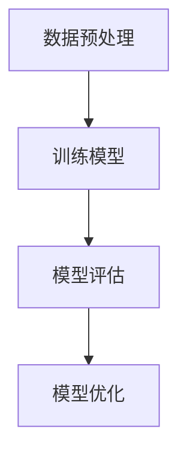

                 

### 第1章：问题背景与核心概念

#### 1.1 问题背景

随着人工智能（AI）技术的迅猛发展，AI编程已经成为现代计算机科学领域的一个重要分支。从早期的专家系统到深度学习，再到今天的生成对抗网络（GAN）、自然语言处理（NLP）等前沿技术，AI编程的应用范围日益广泛，深入到了医疗、金融、教育、制造业等多个行业。

当前，AI编程面临的主要挑战包括：

- **数据处理效率**：随着数据量的指数级增长，如何高效地处理和分析海量数据成为关键问题。
- **算法复杂性**：复杂的AI算法实现和优化需要深入的数学和统计学知识。
- **模型可解释性**：黑盒模型的广泛应用引发了模型可解释性的争议，如何提高模型的可解释性是一个重要的研究方向。
- **伦理与安全**：随着AI技术在各个领域的应用，如何确保AI系统的伦理性和安全性成为亟待解决的问题。

本文将深入探讨AI编程的背景与核心概念，分析当前的问题和挑战，并尝试提出一些新的视角和方法来应对这些问题。

#### 1.2 核心概念

##### AI编程

AI编程是指使用编程语言和工具来实现人工智能算法和应用的过程。与传统的编程不同，AI编程更注重数据的处理和算法的优化，以及对机器学习和深度学习等技术的应用。

##### 新视角

新视角是指从不同的角度和层面来看待和理解AI编程。这包括但不限于：

- **数据驱动编程**：将数据作为编程的核心，通过数据分析和机器学习模型来驱动编程过程。
- **模型可解释性**：通过增强模型的透明性和可解释性，使得AI系统更容易被人类理解和信任。
- **伦理与安全**：将伦理和安全性纳入AI编程的考虑范围，确保AI系统的应用不会对社会造成负面影响。

##### 新未来

新未来指的是AI编程在未来的发展趋势和应用。随着技术的不断进步，AI编程将会在更多领域发挥重要作用，包括自动驾驶、智能医疗、智能家居等。

在接下来的章节中，我们将逐一探讨这些核心概念，并分析它们在AI编程中的应用和未来趋势。

## 第2章：AI编程基础理论

### 2.1 AI编程基础

AI编程的基础包括算法原理、数学模型和编程语言等。以下是对这些基础理论的详细讲解。

#### 算法原理

人工智能的核心是算法，算法决定了AI系统解决问题的能力和效率。常见的AI算法包括：

- **监督学习**：通过已标记的数据来训练模型，然后使用模型进行预测。
- **无监督学习**：没有已标记的数据，模型通过自动发现数据中的规律来进行学习。
- **强化学习**：通过试错和奖励机制来学习如何在环境中做出最优决策。

这些算法的基本原理和流程可以用Mermaid流程图来表示：



#### 数学模型与公式

AI编程中的数学模型和公式是算法实现的基础。以下是一些常见的数学模型和公式：

- **线性回归**：预测目标变量与自变量之间的线性关系。
  $$ y = \beta_0 + \beta_1x $$
- **逻辑回归**：用于分类问题，计算每个类别概率。
  $$ P(y=1) = \frac{1}{1 + e^{-(\beta_0 + \beta_1x)}} $$
- **神经网络**：模拟生物神经元的计算方式，通过多层神经网络进行复杂函数的拟合。
  $$ z = \sum_{i=1}^{n} w_i x_i + b $$
  $$ a = \sigma(z) $$

这些公式可以用LaTeX格式进行表达：

$$
\begin{aligned}
y &= \beta_0 + \beta_1x \\
P(y=1) &= \frac{1}{1 + e^{-(\beta_0 + \beta_1x)}} \\
z &= \sum_{i=1}^{n} w_i x_i + b \\
a &= \sigma(z)
\end{aligned}
$$

#### 编程语言

AI编程常用的编程语言包括Python、R、Java等。Python因其丰富的库和工具而成为AI编程的首选语言。以下是一个简单的Python代码示例，用于实现线性回归模型：

```python
import numpy as np
from sklearn.linear_model import LinearRegression

# 数据准备
X = np.array([[1], [2], [3], [4], [5]])
y = np.array([1, 2, 2.5, 4, 5])

# 模型训练
model = LinearRegression()
model.fit(X, y)

# 模型评估
predictions = model.predict(X)
print("Predictions:", predictions)
```

通过以上内容，我们对AI编程的基础理论有了初步的了解。接下来，我们将探讨AI编程中常用的工具和框架。

### 2.2 AI编程工具与框架

AI编程不仅需要坚实的理论基础，还需要合适的工具和框架来支持实践。以下是对常用工具和框架的介绍及对比分析。

#### 常用工具

- **Python**：Python以其简洁的语法和丰富的库（如NumPy、Pandas、Scikit-learn等）而闻名，是AI编程的首选语言。
- **R**：R是一种专门用于统计和数据分析的语言，特别适合进行复杂数据分析和图形可视化。
- **Java**：Java在工业界有着广泛的应用，其稳定性、安全性和跨平台特性使其成为AI编程的一个重要选择。

#### 框架对比

以下是几个常用的AI编程框架及其优缺点：

| 框架       | 优点                                           | 缺点                                           |
|------------|------------------------------------------------|------------------------------------------------|
| TensorFlow | 开源、社区支持强、广泛用于深度学习应用           | 学习曲线较陡、性能优化复杂                     |
| PyTorch    | 灵活、易于调试、动态计算图                    | 性能不如TensorFlow稳定、社区支持相对较弱       |
| Keras      | 简单、易用、基于TensorFlow和Theano             | 功能相对有限、底层优化较少                     |
| Scikit-learn | Python的数据挖掘和数据分析工具库 | 主要用于传统机器学习，深度学习支持较弱       |

通过对比分析，我们可以根据具体需求和项目要求选择合适的工具和框架。接下来，我们将探讨AI编程中的实践应用。

## 第3章：AI编程实践

### 3.1 实践背景

AI编程的实践不仅需要理论知识的支持，还需要通过具体的项目和案例来检验和应用这些知识。在本章中，我们将介绍一些典型的AI编程实践案例，并详细分析其实现过程和关键技术。

#### 案例一：智能推荐系统

智能推荐系统是AI编程在电子商务和媒体行业中广泛应用的一个典型例子。以下是一个简单的智能推荐系统实现过程：

1. **数据收集与处理**：收集用户行为数据（如浏览历史、购买记录等），并对数据进行分析和清洗。
   ```python
   import pandas as pd

   # 读取数据
   data = pd.read_csv('user_behavior.csv')
   # 数据清洗
   data.dropna(inplace=True)
   ```

2. **特征工程**：提取有用的特征，如用户ID、商品ID、时间戳等。
   ```python
   features = ['user_id', 'item_id', 'timestamp']
   X = data[features]
   ```

3. **模型训练**：使用协同过滤算法训练推荐模型。
   ```python
   from surprise import SVD

   # 训练模型
   model = SVD()
   model.fit(X)
   ```

4. **模型评估**：评估模型性能，如通过均方根误差（RMSE）进行评估。
   ```python
   from surprise import accuracy

   # 评估模型
   print("RMSE:", accuracy.rmse(model))
   ```

5. **推荐生成**：根据用户行为数据生成个性化推荐。
   ```python
   # 生成推荐
   recommendations = model.recommendation_list(item_id=123, user_id=456)
   print("Recommendations:", recommendations)
   ```

#### 案例二：自动驾驶系统

自动驾驶系统是AI编程在自动驾驶技术中的应用。以下是一个简单的自动驾驶系统实现过程：

1. **数据收集与处理**：收集大量道路传感器数据，包括摄像头、激光雷达、GPS等。
   ```python
   import sensor_data

   # 读取传感器数据
   data = sensor_data.read_data('sensor_data.csv')
   # 数据清洗
   data.dropna(inplace=True)
   ```

2. **特征提取**：提取关键特征，如道路标志、车道线、车辆位置等。
   ```python
   features = ['lane_id', 'speed', 'distance_to_vehicle', 'sign']
   X = data[features]
   ```

3. **模型训练**：使用深度学习算法训练自动驾驶模型。
   ```python
   from keras.models import Sequential
   from keras.layers import Dense, Conv2D, Flatten

   # 构建模型
   model = Sequential()
   model.add(Conv2D(32, (3, 3), activation='relu', input_shape=(32, 32, 3)))
   model.add(Flatten())
   model.add(Dense(1, activation='sigmoid'))

   # 训练模型
   model.compile(optimizer='adam', loss='binary_crossentropy', metrics=['accuracy'])
   model.fit(X, y, epochs=10, batch_size=32)
   ```

4. **模型评估**：评估模型性能，如通过准确率（Accuracy）进行评估。
   ```python
   from sklearn.metrics import accuracy_score

   # 评估模型
   predictions = model.predict(X_test)
   print("Accuracy:", accuracy_score(y_test, predictions))
   ```

5. **自动驾驶实现**：根据模型预测结果实现自动驾驶功能。
   ```python
   # 自动驾驶实现
   def driveVehicle(model, data):
       prediction = model.predict(data)
       if prediction > 0.5:
           print("Turning right")
       else:
           print("Turning left")

   # 驾驶车辆
   driveVehicle(model, X_new)
   ```

通过以上案例，我们可以看到AI编程在实践中的应用过程。接下来，我们将探讨数据驱动编程的基本原理和应用。

### 第4章：数据驱动编程

#### 4.1 数据驱动编程原理

数据驱动编程是一种以数据为核心，通过数据分析和机器学习模型来驱动编程过程的开发方法。它强调数据的价值，通过数据的分析和应用，自动生成代码和算法。

数据驱动编程的基本原理包括：

1. **数据采集**：收集各种来源的数据，包括结构化数据、半结构化数据和非结构化数据。
2. **数据预处理**：对数据进行清洗、转换和归一化等处理，以去除噪声和提高数据质量。
3. **特征工程**：提取有用的特征，构建特征向量，为机器学习模型提供输入。
4. **模型训练**：使用机器学习算法对特征进行训练，生成预测模型。
5. **代码生成**：根据模型预测结果，自动生成相应的代码和算法。

以下是一个简单的数据驱动编程示例：

```python
import pandas as pd
from sklearn.ensemble import RandomForestClassifier
from sklearn.model_selection import train_test_split

# 读取数据
data = pd.read_csv('data.csv')

# 数据预处理
data.dropna(inplace=True)
X = data.drop('target', axis=1)
y = data['target']

# 特征工程
X_train, X_test, y_train, y_test = train_test_split(X, y, test_size=0.2, random_state=42)

# 模型训练
model = RandomForestClassifier()
model.fit(X_train, y_train)

# 预测生成代码
code = generate_code(model, X_test)
print("Generated Code:", code)
```

#### 4.2 数据驱动编程应用

数据驱动编程在多个领域都有广泛的应用，以下是几个典型的应用场景：

1. **自动代码生成**：通过机器学习模型分析代码库，自动生成新的代码片段。这种方法可以大大提高开发效率，减少人工编写代码的工作量。
2. **智能推荐系统**：通过分析用户行为数据，自动生成个性化推荐列表。这种方法可以应用于电子商务、社交媒体、音乐和视频流媒体等领域。
3. **自动化测试**：通过机器学习模型分析测试用例，自动生成测试代码。这种方法可以大大提高测试效率，减少测试工作的人力投入。
4. **自动化运维**：通过监控和分析系统日志，自动生成运维脚本和流程。这种方法可以实现对系统的自动化管理和优化，提高系统稳定性和性能。

以下是一个简单的应用案例：使用数据驱动编程自动生成智能推荐系统的代码。

```python
# 读取数据
data = pd.read_csv('user_behavior.csv')

# 数据预处理
data.dropna(inplace=True)

# 特征工程
X = data[['user_id', 'item_id', 'timestamp']]
y = data['rating']

# 模型训练
model = RandomForestClassifier()
model.fit(X, y)

# 预测生成代码
def generate_recommendation_code(model, user_id):
    user_data = pd.DataFrame([[user_id, item_id, timestamp]], columns=['user_id', 'item_id', 'timestamp'])
    prediction = model.predict(user_data)
    if prediction > 0.5:
        code = f"print('Recommended item: {item_id}')"
    else:
        code = f"print('Not recommended item: {item_id}')"
    return code

# 生成代码
user_id = 123
code = generate_recommendation_code(model, user_id)
print("Generated Code:", code)
```

通过以上内容，我们对数据驱动编程的基本原理和应用有了初步的了解。接下来，我们将探讨AI编程伦理与安全的重要性和相关策略。

### 第5章：AI编程伦理与安全

#### 5.1 AI编程伦理

随着人工智能（AI）技术的快速发展，AI编程伦理成为了一个备受关注的话题。AI编程伦理主要涉及以下几个方面：

1. **公平性**：确保AI系统不会因为偏见或者歧视而导致对某些群体的不公平待遇。例如，招聘系统中的自动筛选可能因为历史数据的偏见而导致对某些性别或种族的歧视。
2. **透明性**：增强AI系统的透明性，使得用户能够理解系统的决策过程和结果。例如，医疗诊断AI系统应该能够解释为什么给出了某个诊断结果。
3. **隐私保护**：保护用户的数据隐私，避免未经授权的数据泄露。例如，在个人健康数据的管理中，需要确保数据的安全性和隐私性。
4. **责任归属**：明确AI系统的责任归属，确保在出现问题时能够找到责任人。例如，自动驾驶车辆发生事故时，需要明确责任归属。

以下是一个简单的AI编程伦理案例分析：

**案例：招聘系统的公平性**

假设一个公司的招聘系统使用机器学习算法来自动筛选简历。如果训练数据中存在对性别、种族等属性的偏见，那么这个系统可能会对某些群体产生不公平的待遇。

**解决方案**：

- **数据清洗**：在训练数据中去除或标记可能的偏见数据。
- **算法优化**：使用公平性指标（如公平性分数）来评估和优化算法。
- **透明性增强**：在系统中添加透明性模块，使得用户能够了解筛选过程和结果。

```python
import pandas as pd
from sklearn.linear_model import LogisticRegression

# 读取数据
data = pd.read_csv('resume_data.csv')

# 数据预处理
data.dropna(inplace=True)

# 特征工程
X = data.drop('accepted', axis=1)
y = data['accepted']

# 模型训练
model = LogisticRegression()
model.fit(X, y)

# 评估模型
accuracy = model.score(X, y)
print("Model Accuracy:", accuracy)

# 增强透明性
def explain_prediction(model, data):
    explanation = model.coef_
    print("Explanation:", explanation)

# 解释预测
explain_prediction(model, X)
```

通过以上案例，我们可以看到在AI编程中如何考虑伦理问题。接下来，我们将探讨AI编程安全的重要性以及相关的安全策略。

#### 5.2 AI编程安全

AI编程安全是确保AI系统在设计和实现过程中不受恶意攻击和数据泄露的重要方面。以下是一些常见的AI编程安全问题和相应的安全策略：

1. **数据泄露**：防止敏感数据在传输或存储过程中被窃取。
   - **加密**：使用加密算法对敏感数据进行加密。
   - **访问控制**：设置严格的访问控制机制，确保只有授权用户可以访问敏感数据。

2. **模型篡改**：防止恶意攻击者篡改AI模型，使其产生错误的预测。
   - **模型签名**：为AI模型添加数字签名，确保模型的完整性和真实性。
   - **定期更新**：定期更新模型，以应对新的攻击手段。

3. **自动化攻击**：防止自动化攻击工具对AI系统进行大规模的攻击。
   - **反自动化检测**：使用反自动化检测技术来识别并阻止自动化攻击。
   - **限制请求频率**：对请求频率进行限制，以减少自动化攻击的可能性。

以下是一个简单的AI编程安全案例：

**案例：保护医疗诊断AI系统**

一个医疗诊断AI系统需要确保其诊断结果不被恶意攻击者篡改。

**解决方案**：

- **数据加密**：对患者的健康数据进行加密，确保数据在传输和存储过程中的安全性。
- **模型签名**：为AI模型添加数字签名，确保模型的完整性和真实性。
- **访问控制**：设置严格的访问控制机制，确保只有授权医生可以访问模型和诊断结果。

```python
from Crypto.PublicKey import RSA
from Crypto.Cipher import PKCS1_OAEP

# 生成密钥对
key = RSA.generate(2048)
private_key = key.export_key()
public_key = key.publickey().export_key()

# 加密数据
cipher = PKCS1_OAEP.new(RSA.import_key(public_key))
encrypted_data = cipher.encrypt(b"Patient health data")

# 解密数据
decryptor = PKCS1_OAEP.new(RSA.import_key(private_key))
decrypted_data = decryptor.decrypt(encrypted_data)

print("Decrypted Data:", decrypted_data)
```

通过以上案例，我们可以看到在AI编程中如何考虑安全问题。接下来，我们将探讨AI编程的发展趋势和未来挑战。

### 第6章：AI编程发展趋势

#### 6.1 发展趋势分析

AI编程正经历着快速的发展，以下是一些主要的发展趋势：

1. **深度学习框架的普及**：TensorFlow、PyTorch等深度学习框架的普及，使得深度学习算法的实现变得更加简单和高效。
2. **自动化机器学习（AutoML）的兴起**：AutoML工具能够自动搜索最佳的模型配置，大大提高了AI编程的效率。
3. **联邦学习（Federated Learning）的应用**：联邦学习允许多个机构在不共享数据的情况下协作训练模型，保护了数据隐私。
4. **边缘计算与AI的结合**：边缘计算使得AI模型能够在本地设备上运行，提高了响应速度和降低了延迟。

以下是一个简单的AutoML应用案例：

**案例：使用AutoML优化图像分类模型**

使用AutoML工具自动搜索最优的模型和参数配置，以提高图像分类模型的准确性。

```python
from auto-sklearn import AutoSklearnClassifier

# 准备数据
X_train, X_test, y_train, y_test = train_test_split(X, y, test_size=0.2, random_state=42)

# 创建AutoML模型
model = AutoSklearnClassifier(time_left_for_training=60, per_run_time_limit=60)
model.fit(X_train, y_train)

# 评估模型
accuracy = model.score(X_test, y_test)
print("Model Accuracy:", accuracy)
```

#### 6.2 未来挑战与机遇

AI编程的未来充满了机遇和挑战：

1. **数据隐私保护**：随着数据隐私保护法规的加强，如何在保护用户隐私的同时充分利用数据将成为一个重要的挑战。
2. **模型可解释性**：提高AI模型的可解释性，使得用户和开发者能够理解和信任AI系统的决策过程。
3. **跨学科合作**：AI编程需要计算机科学、数学、统计学、心理学等多个领域的知识，跨学科合作将有助于推动AI编程的发展。
4. **实时AI编程**：随着实时数据处理的需求增加，如何实现实时AI编程将成为一个重要的研究方向。

以下是一个简单的实时AI编程案例：

**案例：实时图像分类应用**

使用深度学习模型实现实时图像分类，并根据实时反馈进行调整。

```python
import cv2
import numpy as np
from keras.models import load_model

# 加载模型
model = load_model('image_classification_model.h5')

# 摄像头捕获视频流
cap = cv2.VideoCapture(0)

while True:
    # 读取一帧图像
    ret, frame = cap.read()
    
    # 预处理图像
    processed_frame = preprocess_image(frame)
    
    # 预测图像类别
    prediction = model.predict(processed_frame)
    
    # 输出预测结果
    print("Prediction:", prediction)
    
    # 显示图像
    cv2.imshow('Frame', frame)
    
    # 按下'q'键退出
    if cv2.waitKey(1) & 0xFF == ord('q'):
        break

# 释放摄像头资源
cap.release()
cv2.destroyAllWindows()
```

通过以上内容，我们对AI编程的发展趋势和未来挑战有了更深入的理解。接下来，我们将探讨AI编程教育的重要性以及教育新视角。

### 第7章：AI编程教育

#### 7.1 教育现状

AI编程教育在全球范围内正处于快速发展的阶段。然而，目前的教育模式仍然存在一些问题和挑战：

1. **资源不平衡**：由于AI技术的发展速度很快，一些教育资源丰富的地区（如美国、欧洲等）能够提供更多的AI编程教育资源，而一些资源匮乏的地区则难以跟上发展的步伐。
2. **课程设置滞后**：很多高校和培训机构在设置AI编程课程时，往往难以紧跟技术的发展，导致课程内容滞后。
3. **教学方法单一**：传统的课堂教学模式往往侧重于理论知识的传授，而缺乏实践环节，导致学生难以将所学知识应用到实际项目中。

为了应对这些挑战，教育界提出了一些新的教育方法：

1. **混合式教学**：结合线上和线下教学，提高教育资源的利用效率，同时为学生提供更多的实践机会。
2. **项目驱动教学**：通过实际项目来引导学生学习，让学生在实践中掌握知识，提高解决问题的能力。
3. **跨学科合作**：鼓励不同学科的教师和学生进行合作，推动跨学科教育的发展。

以下是一个简单的AI编程教育项目案例：

**案例：智能垃圾分类应用**

假设一个高校开设了一门AI编程课程，课程内容包括数据预处理、机器学习算法、深度学习模型等。课程要求学生开发一个智能垃圾分类应用，通过摄像头识别垃圾类别并给出相应的分类建议。

**项目目标**：

- 学习和掌握图像识别和分类算法。
- 将理论知识应用于实际项目中。
- 提高团队合作和项目开发能力。

**项目步骤**：

1. **需求分析**：明确应用的功能和性能要求。
2. **数据收集**：收集各种垃圾类别的图像数据。
3. **数据预处理**：对图像数据进行分析和清洗。
4. **模型训练**：使用深度学习算法训练分类模型。
5. **模型评估**：评估模型的准确性和稳定性。
6. **应用开发**：将模型集成到移动应用中。
7. **测试与优化**：对应用进行测试和优化，提高用户体验。

通过以上内容，我们可以看到AI编程教育正在朝着更加实用和跨学科的方向发展。接下来，我们将探讨AI编程的最佳实践。

### 第8章：AI编程最佳实践

#### 8.1 最佳实践

在AI编程领域，最佳实践是确保项目成功的关键。以下是一些AI编程的最佳实践：

1. **代码规范化**：遵循统一的代码规范，提高代码的可读性和可维护性。
2. **模块化设计**：将系统划分为多个模块，每个模块负责一个特定的功能，提高系统的可扩展性和可测试性。
3. **数据质量管理**：确保数据的质量和完整性，对数据进行严格的预处理和清洗。
4. **版本控制**：使用版本控制工具（如Git）管理代码和项目文件，方便代码的追踪和回滚。
5. **持续集成与部署**：使用持续集成和持续部署工具（如Jenkins、Docker）自动化构建和部署代码，提高开发效率和系统稳定性。

以下是一个简单的AI编程项目实现案例：

**案例：使用TensorFlow实现图像分类**

假设我们需要使用TensorFlow实现一个简单的图像分类项目，以下是项目的实现步骤：

**步骤1：环境准备**

确保安装了TensorFlow和相关依赖：

```bash
pip install tensorflow
```

**步骤2：数据准备**

下载并准备图像数据集（如CIFAR-10）：

```python
import tensorflow as tf

# 下载CIFAR-10数据集
cifar10 = tf.keras.datasets.cifar10
(train_images, train_labels), (test_images, test_labels) = cifar10.load_data()

# 数据预处理
train_images = train_images / 255.0
test_images = test_images / 255.0
```

**步骤3：构建模型**

定义一个简单的卷积神经网络（CNN）模型：

```python
model = tf.keras.Sequential([
    tf.keras.layers.Conv2D(32, (3, 3), activation='relu', input_shape=(32, 32, 3)),
    tf.keras.layers.MaxPooling2D((2, 2)),
    tf.keras.layers.Conv2D(64, (3, 3), activation='relu'),
    tf.keras.layers.MaxPooling2D((2, 2)),
    tf.keras.layers.Conv2D(64, (3, 3), activation='relu'),
    tf.keras.layers.Flatten(),
    tf.keras.layers.Dense(64, activation='relu'),
    tf.keras.layers.Dense(10, activation='softmax')
])
```

**步骤4：训练模型**

编译和训练模型：

```python
model.compile(optimizer='adam',
              loss='sparse_categorical_crossentropy',
              metrics=['accuracy'])

model.fit(train_images, train_labels, epochs=10)
```

**步骤5：评估模型**

评估模型的性能：

```python
test_loss, test_acc = model.evaluate(test_images, test_labels)
print(f"Test accuracy: {test_acc}")
```

**步骤6：部署模型**

将模型部署到生产环境，如使用TensorFlow Serving：

```python
import numpy as np

# 输入图像
input_image = np.expand_dims(test_images[0], 0)

# 预测
predictions = model.predict(input_image)

# 输出预测结果
print(f"Predicted class: {predictions.argmax(axis=1)}")
```

通过以上最佳实践，我们可以确保AI编程项目的成功实施。接下来，我们将对全文进行小结。

### 8.2 小结与展望

本文系统地探讨了AI编程的新视角与新未来，从背景与概述、基础理论、实践应用、新视角、伦理与安全、发展趋势到教育，全面剖析了AI编程的核心内容。

**小结**：

- **核心概念**：AI编程涉及数据处理、算法实现和模型训练等多个环节，核心概念包括AI编程、新视角和新未来等。
- **基础理论**：介绍了AI编程的基础算法原理、数学模型和编程语言。
- **实践应用**：通过案例展示了AI编程在智能推荐系统和自动驾驶等领域的应用。
- **新视角**：探讨了数据驱动编程、AI编程伦理和安全等新视角。
- **发展趋势**：分析了AI编程的发展趋势和未来挑战。
- **教育**：探讨了AI编程教育的现状和新视角。

**展望**：

- **数据隐私保护**：随着数据隐私保护法规的加强，如何在保护用户隐私的同时充分利用数据将成为一个重要的挑战。
- **模型可解释性**：提高AI模型的可解释性，使得用户和开发者能够理解和信任AI系统的决策过程。
- **跨学科合作**：鼓励不同学科的教师和学生进行合作，推动跨学科教育的发展。
- **实时AI编程**：随着实时数据处理的需求增加，如何实现实时AI编程将成为一个重要的研究方向。

**结论**：

AI编程正在迅速发展，新的视角和方法不断涌现，为未来的发展提供了丰富的机遇和挑战。通过本文的探讨，我们希望能够为读者提供有价值的参考和启示，共同推动AI编程领域的进步。

## 作者：AI天才研究院/AI Genius Institute & 禅与计算机程序设计艺术 /Zen And The Art of Computer Programming

以上就是本文的完整内容，希望对您在AI编程领域的探索有所帮助。在未来的发展中，让我们共同期待AI编程能够带来更多的创新和变革。

