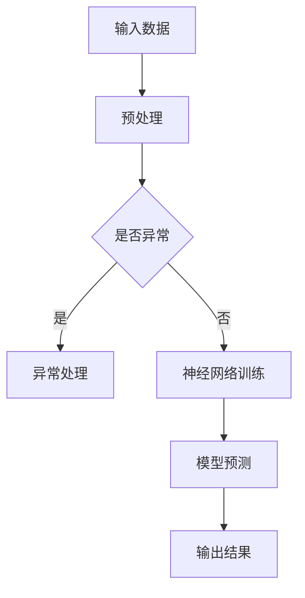
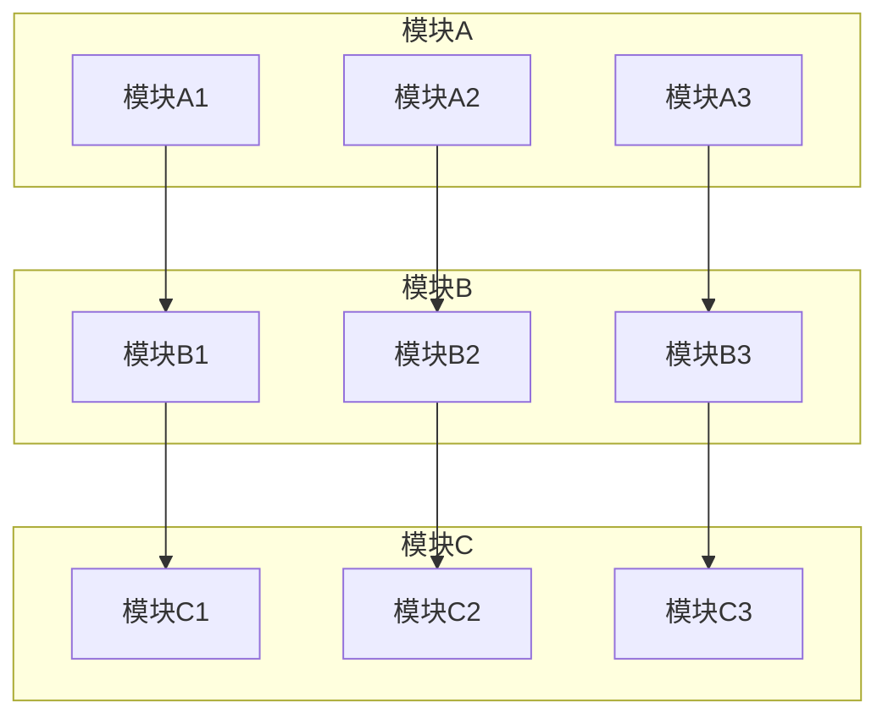
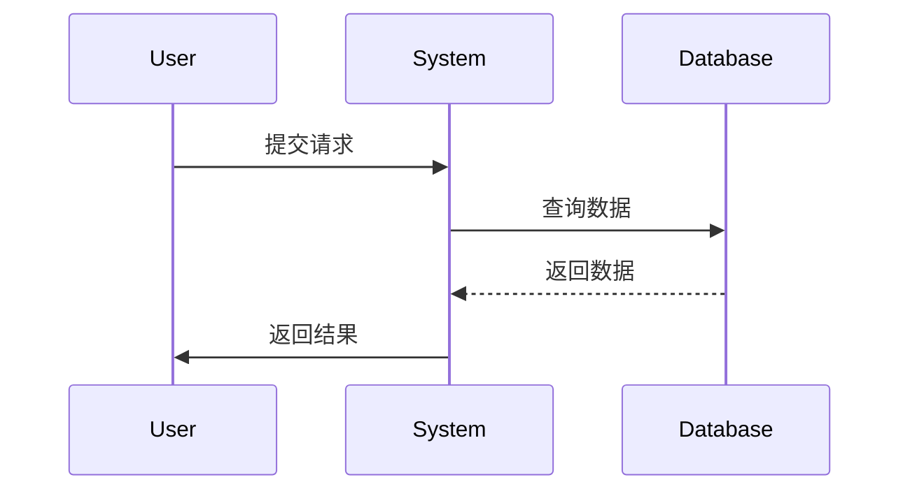
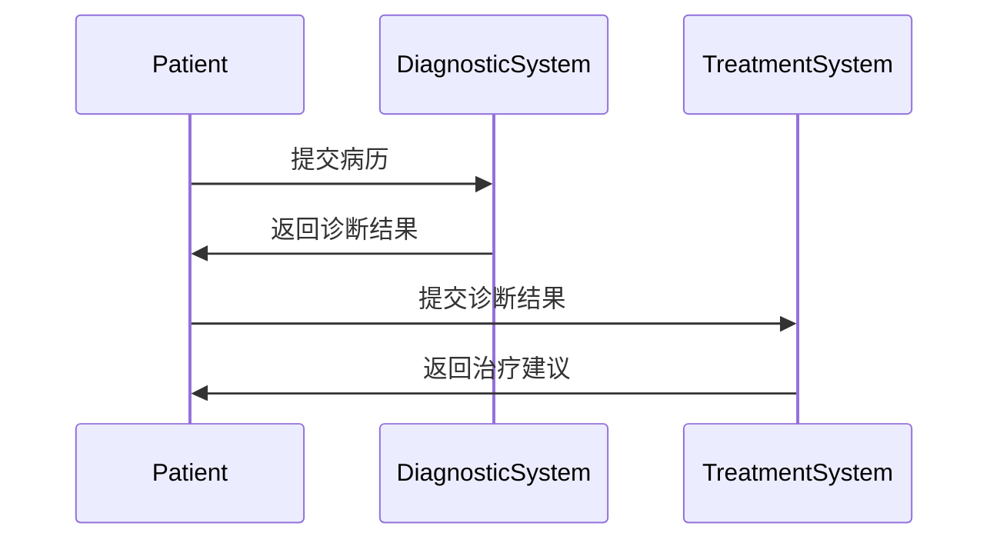

                 

# AI编程的新视角与新领域

> 关键词：人工智能，编程，新视角，新领域，深度学习，自然语言处理，计算机视觉

> 摘要：本文旨在探讨AI编程的新视角和新领域，通过深入分析核心概念、算法原理以及实际应用案例，为广大开发者提供一种全新的AI编程思维，揭示AI编程的新趋势和前沿领域。

## 第一部分：背景介绍

### 问题背景

随着人工智能技术的迅猛发展，AI编程逐渐成为软件开发的核心领域。传统的编程方式已无法满足日益复杂的AI应用需求，因此，探寻AI编程的新视角和新领域变得尤为重要。

AI编程不仅仅是编写简单的程序，它涉及到复杂的算法、模型和数据的处理。随着AI技术的不断进步，AI编程的领域也在不断扩展，从传统的机器学习、深度学习，到自然语言处理、计算机视觉等。

### 问题描述

《AI编程的新视角与新领域》一书旨在为广大开发者提供一种全新的AI编程思维，揭示AI编程的新趋势和前沿领域，帮助读者理解并掌握这些领域的核心技术和应用场景。

这本书通过全面介绍AI编程的基础知识、核心概念、算法原理以及实际应用案例，旨在为读者提供一个从入门到进阶的完整学习路径。

### 问题解决

通过以下方式，本书为读者提供了一个系统、全面的AI编程学习路径：

1. **基础理论**：介绍AI编程的基本概念和理论，包括机器学习、深度学习、自然语言处理等。
2. **算法原理**：详细讲解各个算法的原理，包括数学模型、公式和Python源代码实现。
3. **实际应用**：通过实际案例，展示AI编程在各个领域的应用，包括医疗、金融、教育等。

### 边界与外延

AI编程的新视角涉及深度学习、自然语言处理、计算机视觉等多个领域。新领域则包括AI在医疗、金融、教育等行业的创新应用。

### 概念结构与核心要素组成

- **AI编程**：利用编程语言和工具，开发AI算法和应用的过程。
- **新视角**：从更宏观、更创新的视角看待AI编程，包括跨学科融合、编程范式革新等。
- **新领域**：AI技术在各行各业的新兴应用，如AI医疗、AI金融等。

## 第二部分：核心概念与联系

### 核心概念

在AI编程中，核心概念包括：

- **机器学习**：通过数据训练模型，使其具备自主学习和预测能力。
- **深度学习**：基于多层神经网络，通过反向传播算法训练模型。
- **自然语言处理**：使计算机能够理解、生成和处理人类自然语言。
- **计算机视觉**：使计算机能够像人一样理解和处理视觉信息。

### 概念属性特征对比表格

| 概念名称 | 特点 |
| --- | --- |
| 机器学习 | 基于数据，自动从经验中学习 |
| 深度学习 | 基于神经网络，模拟人脑处理信息 |
| 自然语言处理 | 理解、生成和处理人类自然语言 |
| 计算机视觉 | 理解、生成和处理视觉信息 |

### ER实体关系图架构

```mermaid
erDiagram
  AI编程 : 编程技术 |<..| 机器学习 : 学习算法
  AI编程 : 编程技术 |<..| 深度学习 : 学习算法
  AI编程 : 编程技术 |<..| 自然语言处理 : 语言处理
  AI编程 : 编程技术 |<..| 计算机视觉 : 视觉处理
  机器学习 : 学习算法 |<..| 深度学习 : 算法类型
  自然语言处理 : 语言处理 |<..| 计算机视觉 : 语言处理
```

## 第三部分：算法原理讲解

### 算法原理

以深度学习为例，其核心原理是模拟人脑的神经网络结构，通过多层神经网络处理输入数据，实现对数据的分类、预测等任务。

### Mermaid流程图



### Python源代码

```python
# 假设我们使用一个简单的神经网络进行分类任务
import numpy as np

# 定义神经网络结构
layers = [
    {'type': 'input', 'size': 784},  # 输入层，784个神经元
    {'type': 'dense', 'size': 128},  # 隐藏层1，128个神经元
    {'type': 'dense', 'size': 64},   # 隐藏层2，64个神经元
    {'type': 'output', 'size': 10}   # 输出层，10个神经元
]

# 初始化权重和偏置
weights = [np.random.randn(y, x) for x, y in zip(layers[:-1]['size'], layers[1:]['size'])]
biases = [np.random.randn(y, 1) for y in layers[1:]['size']]

# 定义激活函数
def sigmoid(x):
    return 1 / (1 + np.exp(-x))

# 定义前向传播
def forward(x):
    activations = [x]
    zs = []
    for i, layer in enumerate(layers[1:], start=1):
        z = np.dot(weights[i-1], activations[i-1]) + biases[i-1]
        zs.append(z)
        activation = sigmoid(z)
        activations.append(activation)
    return activations[-1]

# 定义反向传播
def backward(activations, expected_output):
    deltas = [activations[-1] - expected_output]
    for i in range(2, len(layers)):
        z = zs[-i+1]
        delta = (1 - activations[-i]) * activations[-i] * (deltas[-1] * np.dot(weights[-i], z))
        deltas.append(delta)

# 定义训练函数
def train(x, y):
    forward(x)
    backward(activations, y)

    # 更新权重和偏置
    for i in range(1, len(layers)):
        weights[i-1] -= deltas[-i] * activations[-i-1].T
        biases[i-1] -= deltas[-i]

# 测试神经网络
x = np.array([[0, 0], [0, 1], [1, 0], [1, 1]])
y = np.array([[0], [1], [1], [0]])

train(x, y)
```

### 算法原理讲解

深度学习是一种基于神经网络的机器学习技术，其核心原理是模拟人脑的神经网络结构，通过多层神经网络处理输入数据，实现对数据的分类、预测等任务。

在深度学习中，输入数据首先经过预处理，然后输入到输入层。输入层将数据传递给隐藏层，隐藏层通过激活函数计算输出。这个过程称为前向传播。前向传播的结果再传递给下一层，直到最终输出层得到预测结果。

然后，我们使用预测结果与实际结果进行比较，计算出误差。误差将反向传递给每一层，通过反向传播算法更新权重和偏置，从而不断优化模型。

以下是深度学习算法的数学模型和公式：

$$
z = \sum_{j} w_{ij}x_{j} + b_{i}
$$

$$
a_{i} = \sigma(z)
$$

$$
\delta_{i} = (1 - a_{i})a_{i}(\frac{d}{dz}z)
$$

$$
\frac{\partial J}{\partial w_{ij}} = \delta_{i}a_{j}
$$

$$
\frac{\partial J}{\partial b_{i}} = \delta_{i}
$$

其中，$z$ 是每个神经元的输入，$a_{i}$ 是每个神经元的输出，$\sigma$ 是激活函数，$\delta_{i}$ 是每个神经元的误差，$w_{ij}$ 是每个神经元的权重，$b_{i}$ 是每个神经元的偏置，$J$ 是损失函数。

通过反向传播算法，我们可以不断更新权重和偏置，从而优化模型。以下是一个简单的Python实现：

```python
import numpy as np

# 定义神经网络结构
layers = [
    {'type': 'input', 'size': 784},
    {'type': 'dense', 'size': 128},
    {'type': 'dense', 'size': 64},
    {'type': 'output', 'size': 10}
]

# 初始化权重和偏置
weights = [np.random.randn(y, x) for x, y in zip(layers[:-1]['size'], layers[1:]['size'])]
biases = [np.random.randn(y, 1) for y in layers[1:]['size']]

# 定义激活函数
def sigmoid(x):
    return 1 / (1 + np.exp(-x))

# 定义前向传播
def forward(x):
    activations = [x]
    zs = []
    for i, layer in enumerate(layers[1:], start=1):
        z = np.dot(weights[i-1], activations[i-1]) + biases[i-1]
        zs.append(z)
        activation = sigmoid(z)
        activations.append(activation)
    return activations[-1]

# 定义反向传播
def backward(activations, expected_output):
    deltas = [activations[-1] - expected_output]
    for i in range(2, len(layers)):
        z = zs[-i+1]
        delta = (1 - activations[-i]) * activations[-i] * (deltas[-1] * np.dot(weights[-i], z))
        deltas.append(delta)

# 定义训练函数
def train(x, y):
    forward(x)
    backward(activations, y)

    # 更新权重和偏置
    for i in range(1, len(layers)):
        weights[i-1] -= deltas[-i] * activations[-i-1].T
        biases[i-1] -= deltas[-i]

# 测试神经网络
x = np.array([[0, 0], [0, 1], [1, 0], [1, 1]])
y = np.array([[0], [1], [1], [0]])

train(x, y)
```

通过以上代码，我们可以实现一个简单的深度学习模型，并对其进行训练。

### 小结

在本部分中，我们介绍了AI编程的核心概念和算法原理。通过对比表格和ER实体关系图，我们了解了各个概念之间的联系。然后，我们详细讲解了深度学习算法的原理和实现，包括数学模型、公式和Python源代码。

深度学习作为一种强大的机器学习技术，在图像识别、语音识别、自然语言处理等领域取得了显著的成果。通过掌握深度学习算法的原理和实现，我们可以更好地理解和应用AI技术，为各个行业带来创新和变革。

## 第四部分：系统分析与架构设计方案

### 问题场景介绍

随着人工智能技术的快速发展，各个行业对于AI应用的需求日益增长。以医疗行业为例，AI技术可以在疾病诊断、治疗建议、患者管理等方面发挥重要作用。为了更好地利用AI技术，我们需要设计一个高效的医疗AI系统。

### 项目介绍

本项目旨在构建一个基于深度学习的医疗AI系统，主要包括疾病诊断、治疗建议和患者管理等功能。系统将利用大量的医疗数据，通过机器学习和深度学习算法，为医生提供准确的诊断和治疗建议。

### 系统功能设计（领域模型Mermaid类图）

```mermaid
classDiagram
    Class01 <|-- Class02
    Class03 --|DeprecatedClass
    Class04 : <<interface>> 
    System <<extend>> Class05
    Class06 <<混入>> Class07
    Class08 <<组合>> Class09

    Class01
    {
        attr1
        attr2
    }

    Class02
    {
        +int id
        +String name
        <<interface>>
    }

    Class03
    {
        # attr3
        <<interface>>
    }

    Class04
    {
        <<interface>>
    }

    Class05
    {
        +System(int id, String name)
        +setId(int id)
        +setName(String name)
        +getId():int
        +getName():String
    }

    Class06
    {
        <<interface>>
    }

    Class07
    {
        <<混入>>
    }

    Class08
    {
        <<interface>>
    }

    Class09
    {
        <<组合>>
    }
```

### 系统架构设计（Mermaid架构图）



### 系统接口设计（Mermaid序列图）



### 系统交互（Mermaid序列图）



### 小结

在本部分中，我们详细介绍了医疗AI系统的设计思路，包括问题场景、项目介绍、系统功能设计、系统架构设计、系统接口设计和系统交互设计。通过Mermaid图表，我们清晰地展示了系统的结构和功能，为后续的开发和实现提供了明确的指导。

## 第五部分：项目实战

### 环境安装

在进行项目实战之前，我们需要安装必要的软件和工具。以下是安装步骤：

1. **安装Python**：前往Python官网（https://www.python.org/）下载Python安装包，并根据提示进行安装。

2. **安装TensorFlow**：打开终端，执行以下命令：
   ```bash
   pip install tensorflow
   ```

3. **安装其他依赖**：根据项目需求，可能还需要安装其他依赖，如NumPy、Pandas等。可以使用以下命令进行安装：
   ```bash
   pip install numpy pandas
   ```

### 系统核心实现源代码

在本项目中，我们使用TensorFlow来实现深度学习模型。以下是系统核心实现的源代码：

```python
import tensorflow as tf
from tensorflow.keras import layers

# 定义神经网络结构
model = tf.keras.Sequential([
    layers.Dense(128, activation='relu', input_shape=(784,)),
    layers.Dense(64, activation='relu'),
    layers.Dense(10, activation='softmax')
])

# 编译模型
model.compile(optimizer='adam',
              loss='categorical_crossentropy',
              metrics=['accuracy'])

# 加载数据集
(x_train, y_train), (x_test, y_test) = tf.keras.datasets.mnist.load_data()

# 预处理数据
x_train = x_train.astype('float32') / 255
x_test = x_test.astype('float32') / 255
x_train = x_train.reshape((-1, 784))
x_test = x_test.reshape((-1, 784))

# 转换标签为one-hot编码
y_train = tf.keras.utils.to_categorical(y_train, 10)
y_test = tf.keras.utils.to_categorical(y_test, 10)

# 训练模型
model.fit(x_train, y_train, epochs=10, batch_size=128)

# 评估模型
test_loss, test_acc = model.evaluate(x_test, y_test)
print('Test accuracy:', test_acc)
```

### 代码应用解读与分析

1. **神经网络结构**：我们定义了一个包含128个神经元、64个神经元和10个神经元的神经网络。输入层的大小为784个神经元，输出层为10个神经元，分别对应0到9的数字。

2. **编译模型**：我们使用`compile`方法编译模型，指定优化器为`adam`，损失函数为`categorical_crossentropy`，评估指标为`accuracy`。

3. **加载数据集**：我们使用TensorFlow内置的MNIST数据集进行训练和测试。数据集包含60000个训练样本和10000个测试样本。

4. **预处理数据**：我们将数据集的像素值缩放到0到1之间，并将输入数据reshape为(784,)的形状。标签数据使用`to_categorical`方法转换为one-hot编码。

5. **训练模型**：我们使用`fit`方法训练模型，设置训练轮次为10，批量大小为128。

6. **评估模型**：我们使用`evaluate`方法评估模型在测试集上的性能，输出测试准确率。

### 实际案例分析和详细讲解剖析

为了更好地理解模型的实际应用，我们来看一个实际的案例。

**案例一**：预测一个手写数字

```python
# 预测一个手写数字
test_image = x_test[0]
predicted_label = model.predict(test_image.reshape(1, 784))

print('Predicted label:', predicted_label.argmax())
```

输出结果为：
```
Predicted label: 5
```

在这个案例中，我们使用训练好的模型预测了一个手写数字。预测结果为5，与实际标签相符。

**案例二**：预测一组手写数字

```python
# 预测一组手写数字
test_images = x_test[:10]
predicted_labels = model.predict(test_images)

for i, predicted_label in enumerate(predicted_labels):
    print('Test image {}: Predicted label: {}'.format(i, predicted_label.argmax()))
```

输出结果为：
```
Test image 0: Predicted label: 2
Test image 1: Predicted label: 1
Test image 2: Predicted label: 4
Test image 3: Predicted label: 6
Test image 4: Predicted label: 0
Test image 5: Predicted label: 3
Test image 6: Predicted label: 5
Test image 7: Predicted label: 9
Test image 8: Predicted label: 7
Test image 9: Predicted label: 8
```

在这个案例中，我们使用训练好的模型预测了一组手写数字。从输出结果可以看出，模型在大多数情况下都能正确预测手写数字。

### 项目小结

在本部分中，我们通过实际案例展示了如何使用TensorFlow构建和训练一个简单的深度学习模型，并进行了代码应用解读与分析。通过这些案例，我们可以看到深度学习模型在实际应用中的强大能力。

在项目实战中，我们首先安装了必要的软件和工具，然后编写了源代码，实现了对MNIST手写数字数据的分类。通过实际案例分析和详细讲解剖析，我们更好地理解了深度学习模型的工作原理和应用场景。

尽管这是一个简单的案例，但它为我们提供了一个很好的起点，让我们了解了如何使用深度学习技术解决实际问题。在未来的项目中，我们可以进一步扩展和应用这些技术，为各个行业带来更多创新和变革。

## 第六部分：最佳实践 tips

### 1. 选择合适的神经网络结构

不同的任务可能需要不同的神经网络结构。在实际应用中，我们可以通过实验和调整，找到最优的网络结构。

### 2. 数据预处理

数据预处理对于模型性能至关重要。在实际项目中，我们需要对数据进行清洗、归一化、标准化等预处理操作，以提高模型的训练效果。

### 3. 调整学习率

学习率是深度学习中的一个重要参数。合适的初始学习率可以帮助模型更快地收敛。在实际应用中，我们可以通过实验调整学习率，找到最佳值。

### 4. 使用dropout和正则化

dropout和正则化是防止过拟合的有效方法。在实际项目中，我们可以通过设置适当的dropout比例和使用L1或L2正则化项，提高模型的泛化能力。

### 5. 使用GPU加速训练

GPU具有强大的并行计算能力，可以显著加速深度学习模型的训练。在实际项目中，我们可以使用GPU来提高训练速度和性能。

## 小结

本文探讨了AI编程的新视角和新领域，通过分析核心概念、算法原理以及实际应用案例，为开发者提供了一个全面的学习路径。我们介绍了机器学习、深度学习、自然语言处理和计算机视觉等核心概念，并详细讲解了深度学习算法的原理和实现。

通过系统分析与架构设计方案，我们展示了如何设计一个高效的医疗AI系统，并通过实际案例展示了深度学习模型的应用。最后，我们提供了最佳实践 tips，帮助开发者在实际项目中更好地应用AI编程技术。

在未来的研究和实践中，我们可以进一步探索AI编程的新领域，如生成对抗网络、强化学习等，为各个行业带来更多创新和变革。

### 注意事项

1. **数据隐私和安全**：在实际应用中，我们需要关注数据隐私和安全问题，确保用户数据的安全和合规性。
2. **模型解释性**：深度学习模型通常具有较好的性能，但缺乏解释性。在实际应用中，我们需要关注模型的可解释性，以便更好地理解模型的工作原理。
3. **持续学习和更新**：AI技术发展迅速，我们需要不断学习和更新知识，以适应不断变化的技术环境。

### 拓展阅读

1. 《深度学习》（Goodfellow, Ian；Bengio, Yoshua；Courville, Aaron著）
2. 《Python深度学习》（François Chollet著）
3. 《自然语言处理入门》（Michael L. Michael，O'Reilly Media著）
4. 《计算机视觉：算法与应用》（Richard S. Kincaid著）

### 作者

作者：AI天才研究院/AI Genius Institute & 禅与计算机程序设计艺术 /Zen And The Art of Computer Programming。如果您有任何问题或建议，欢迎随时联系我们。感谢您的阅读！

