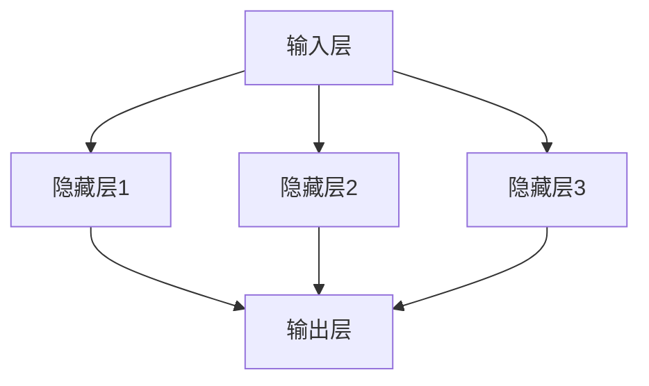
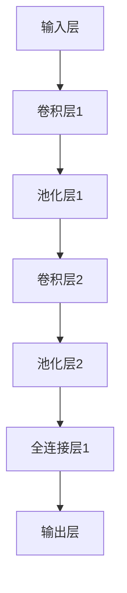
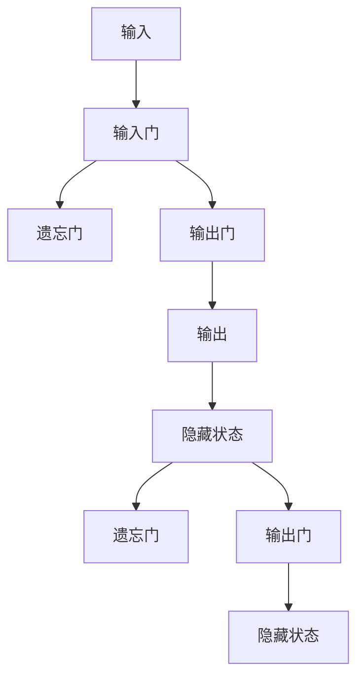
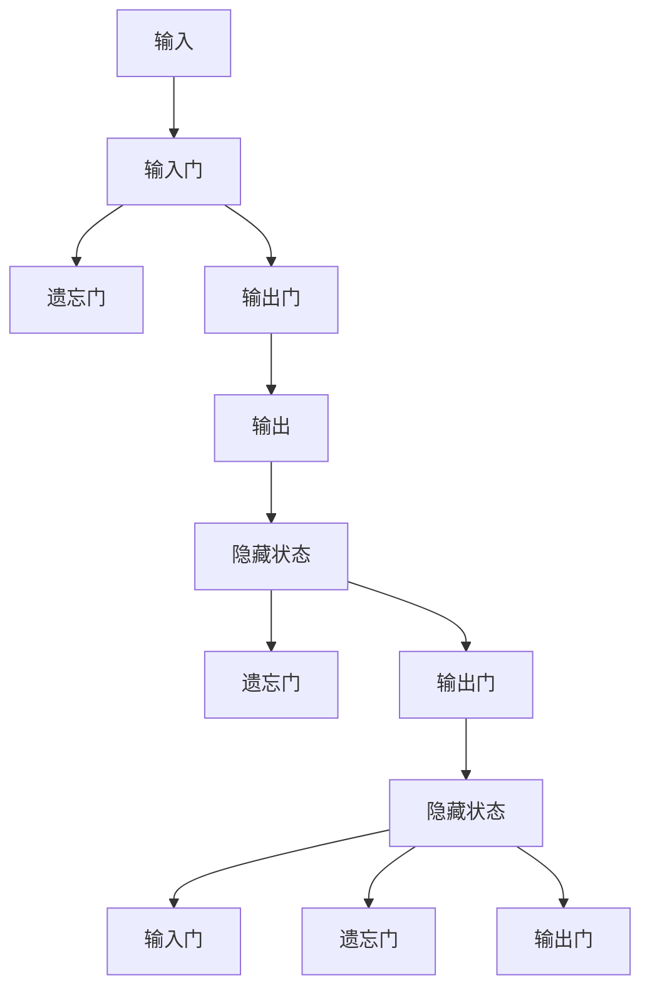
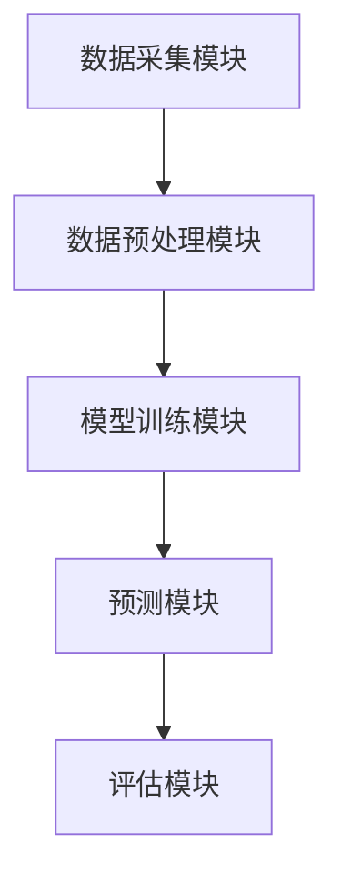
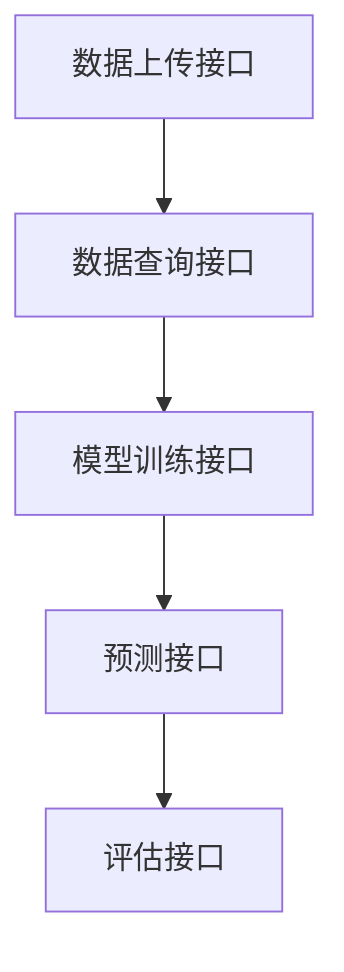
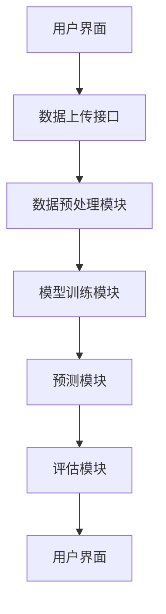

                 

# AI编程的新视角与新高度

## 关键词

- 人工智能编程
- 深度学习
- 神经网络
- 算法原理
- 系统架构设计
- 实践案例

## 摘要

本文将探讨AI编程的新视角和新高度，从基础概念、机器学习算法、深度学习与神经网络，以及系统架构设计等多个方面，逐步深入分析AI编程的核心内容。通过理论讲解、实例分析以及实战案例，读者可以更好地理解AI编程的原理、方法和应用，掌握AI编程的最佳实践，为未来的发展打下坚实的基础。

## 目录

1. **引言**
   - 1.1 背景介绍
   - 1.2 AI编程的核心概念
   - 1.3 AI编程的重要性和未来趋势

2. **AI编程的基础概念**
   - 2.1 AI编程的起源与发展
   - 2.2 数据准备与预处理
   - 2.3 关键算法与技术

3. **机器学习算法**
   - 3.1 监督学习算法
   - 3.2 无监督学习算法

4. **深度学习与神经网络**
   - 4.1 深度学习基础
   - 4.2 卷积神经网络（CNN）
   - 4.3 循环神经网络（RNN）

5. **系统架构设计**
   - 5.1 项目介绍
   - 5.2 系统功能设计
   - 5.3 系统架构设计
   - 5.4 系统接口设计
   - 5.5 系统交互

6. **项目实战**
   - 6.1 环境安装
   - 6.2 系统核心实现源代码
   - 6.3 代码应用解读与分析
   - 6.4 实际案例分析
   - 6.5 项目小结

7. **最佳实践与总结**
   - 7.1 最佳实践
   - 7.2 小结
   - 7.3 注意事项
   - 7.4 拓展阅读

## 1. 引言

### 1.1 背景介绍

人工智能（Artificial Intelligence，简称AI）作为计算机科学的一个重要分支，自20世纪50年代诞生以来，经历了多个发展阶段。从最初的符号推理，到基于知识的系统，再到如今的深度学习与神经网络，AI技术不断演进，逐渐在各个领域得到广泛应用。

AI编程则是在这一过程中应运而生的一门技术，它不仅要求程序员掌握传统的编程技能，还需要深入了解AI的理论和实践。随着AI技术的发展，AI编程的重要性日益凸显，它不仅为各个行业提供了强大的工具，也为未来科技的发展奠定了基础。

### 1.2 AI编程的核心概念

AI编程涉及许多核心概念，包括机器学习、深度学习、神经网络等。这些概念是AI编程的基础，理解它们对于掌握AI编程至关重要。

- **机器学习**：一种让计算机通过数据学习并做出决策的技术。它包括监督学习、无监督学习和强化学习等不同类型。
- **深度学习**：一种基于多层神经网络的学习方法，通过模拟人脑神经网络的结构和功能，实现自动特征提取和学习。
- **神经网络**：一种由大量简单神经元组成的计算模型，通过调整神经元之间的连接权重，实现复杂的计算任务。

### 1.3 AI编程的重要性和未来趋势

随着大数据、云计算、物联网等技术的快速发展，AI编程的应用场景越来越广泛。从自动驾驶、智能语音识别，到医疗诊断、金融风控，AI编程已经深入到各个行业，成为推动科技创新的重要力量。

未来，AI编程将继续向着更加智能化、自动化、高效化的方向发展。随着新算法、新技术的不断涌现，AI编程将带来更多的机遇和挑战。掌握AI编程，不仅能够提升个人的竞争力，也为未来的职业发展提供了广阔的空间。

## 2. AI编程的基础概念

### 2.1 AI编程的起源与发展

AI编程的起源可以追溯到20世纪50年代，当时计算机科学家开始尝试模拟人类智能，开发出了一些简单的AI程序。随着计算机硬件性能的提升和算法的改进，AI编程逐渐发展壮大。

在早期的AI编程中，主要采用符号推理和知识表示的方法。这种方法依赖于专家知识和逻辑推理，但存在一些局限性，如难以处理复杂的非线性问题。

随着计算能力的提高和大数据技术的发展，机器学习和深度学习开始兴起。这些方法通过模拟人脑的学习过程，从数据中自动提取特征和规律，实现更高效、更准确的智能计算。

### 2.2 数据准备与预处理

在AI编程中，数据是核心要素。数据的质量直接影响模型的性能和效果。因此，数据准备和预处理是AI编程的重要环节。

数据准备包括数据采集、数据清洗和数据标注。数据采集是从各种来源收集数据，如传感器数据、网络数据等。数据清洗是处理数据中的噪声和错误，如去除重复数据、填充缺失值等。数据标注是对数据进行分类和标记，如标注图像中的物体类别、语音中的词汇等。

数据预处理还包括数据转换和特征提取。数据转换是将数据格式统一，如将不同格式的数据转换为CSV格式。特征提取是从数据中提取有用的特征，如使用PCA进行降维，使用词袋模型提取文本特征等。

### 2.3 关键算法与技术

AI编程的核心在于算法和技术的选择。以下是一些常见的AI算法和技术：

- **监督学习算法**：包括线性回归、逻辑回归、决策树、支持向量机等。这些算法通过已有标签数据来训练模型，实现对未知数据的预测。
- **无监督学习算法**：包括聚类、降维、异常检测等。这些算法不依赖于标签数据，通过分析数据之间的内在结构，发现数据的特点和规律。
- **深度学习算法**：包括卷积神经网络（CNN）、循环神经网络（RNN）、生成对抗网络（GAN）等。这些算法通过多层神经网络的结构，实现自动特征提取和学习。

不同算法和技术的选择取决于具体的应用场景和数据特点。例如，对于图像分类问题，可以使用CNN；对于语音识别问题，可以使用RNN；对于生成问题，可以使用GAN。

## 3. 机器学习算法

### 3.1 监督学习算法

监督学习算法是AI编程中最常用的方法之一。它通过已有标签数据来训练模型，实现对未知数据的预测。以下是一些常见的监督学习算法：

#### 3.1.1 线性回归

线性回归是一种最简单的监督学习算法，用于预测一个连续的输出值。它通过找到一个线性模型来描述输入和输出之间的关系。

**算法原理：**

线性回归模型可以表示为：

\[ y = \beta_0 + \beta_1x + \epsilon \]

其中，\( y \) 是输出值，\( x \) 是输入值，\( \beta_0 \) 和 \( \beta_1 \) 是模型的参数，\( \epsilon \) 是误差项。

**数学模型和公式：**

\[ \beta = (X^T X)^{-1} X^T y \]

**Python代码示例：**

```python
import numpy as np
from sklearn.linear_model import LinearRegression

# 创建样本数据
X = np.array([[1], [2], [3], [4], [5]])
y = np.array([1, 2, 3, 4, 5])

# 创建线性回归模型并训练
model = LinearRegression()
model.fit(X, y)

# 输出模型的参数
print("模型参数：", model.coef_, model.intercept_)
```

#### 3.1.2 逻辑回归

逻辑回归是一种用于分类问题的监督学习算法，通过最大化似然函数来训练模型。

**算法原理：**

逻辑回归模型可以表示为：

\[ P(y=1|X) = \frac{1}{1 + e^{-(\beta_0 + \beta_1x)}} \]

其中，\( P(y=1|X) \) 是给定输入 \( x \) 时，输出为1的概率。

**数学模型和公式：**

\[ \beta = \arg\max_{\beta} \ln L(\beta) = \arg\min_{\beta} -\ln L(\beta) \]

**Python代码示例：**

```python
import numpy as np
from sklearn.linear_model import LogisticRegression

# 创建样本数据
X = np.array([[0], [1], [2], [3], [4]])
y = np.array([0, 1, 1, 0, 1])

# 创建逻辑回归模型并训练
model = LogisticRegression()
model.fit(X, y)

# 输出模型的参数
print("模型参数：", model.coef_, model.intercept_)
```

#### 3.1.3 决策树

决策树是一种基于树形结构进行决策的监督学习算法。它通过将数据划分为多个子集，为每个子集分配一个标签。

**算法原理：**

决策树算法通过计算每个特征的增益率来选择最佳划分方式。增益率可以用信息增益或基尼不纯度来衡量。

**数学模型和公式：**

\[ Gini(\text{impurity}) = 1 - \frac{p_1^2 + p_2^2 + ... + p_n^2}{1} \]

其中，\( p_i \) 是数据集中某个类别的概率。

**Python代码示例：**

```python
import numpy as np
from sklearn.tree import DecisionTreeClassifier

# 创建样本数据
X = np.array([[0, 0], [1, 0], [0, 1], [1, 1]])
y = np.array([0, 1, 1, 0])

# 创建决策树模型并训练
model = DecisionTreeClassifier()
model.fit(X, y)

# 输出模型的参数
print("模型参数：", model.feature_importances_)
```

### 3.2 无监督学习算法

无监督学习算法不依赖于标签数据，通过分析数据之间的内在结构，发现数据的特点和规律。以下是一些常见的无监督学习算法：

#### 3.2.1 聚类算法

聚类算法将数据分为多个类别，使得同一类别内的数据尽可能相似，不同类别之间的数据尽可能不同。

**算法原理：**

聚类算法包括K-Means、层次聚类、DBSCAN等。其中，K-Means算法是一种最常用的聚类算法。

**数学模型和公式：**

\[ \text{距离度量} = \sqrt{\sum_{i=1}^n (x_i - \mu_i)^2} \]

**Python代码示例：**

```python
import numpy as np
from sklearn.cluster import KMeans

# 创建样本数据
X = np.array([[1, 2], [1, 4], [1, 0], [4, 2], [4, 4], [4, 0]])

# 创建K-Means模型并训练
model = KMeans(n_clusters=2)
model.fit(X)

# 输出聚类结果
print("聚类结果：", model.labels_)
```

#### 3.2.2 降维算法

降维算法通过减少数据的维度，降低计算复杂度，同时保留数据的本质特征。

**算法原理：**

降维算法包括PCA、t-SNE等。其中，PCA算法是一种最常用的降维算法。

**数学模型和公式：**

\[ \text{特征值分解} = \text{协方差矩阵} = \Lambda \]

**Python代码示例：**

```python
import numpy as np
from sklearn.decomposition import PCA

# 创建样本数据
X = np.array([[1, 2], [1, 4], [1, 0], [4, 2], [4, 4], [4, 0]])

# 创建PCA模型并训练
model = PCA(n_components=2)
model.fit(X)

# 输出降维后的数据
print("降维后的数据：", model.transform(X))
```

#### 3.2.3 异常检测

异常检测算法用于发现数据中的异常值或异常模式。

**算法原理：**

异常检测算法包括基于统计学的方法、基于聚类的方法、基于神经网络的方法等。

**数学模型和公式：**

\[ \text{异常分数} = \text{阈值} - \text{离群度} \]

**Python代码示例：**

```python
import numpy as np
from sklearn.neighbors import LocalOutlierFactor

# 创建样本数据
X = np.array([[0.1, 0.1], [0.5, 0.5], [0.1, 0.1], [0.5, 0.5], [10, 10]])

# 创建异常检测模型并训练
model = LocalOutlierFactor()
model.fit(X)

# 输出异常检测结果
print("异常检测结果：", model.predict(X))
```

## 4. 深度学习与神经网络

### 4.1 深度学习基础

深度学习是一种基于多层神经网络的学习方法，通过模拟人脑神经网络的结构和功能，实现自动特征提取和学习。深度学习在图像识别、语音识别、自然语言处理等领域取得了显著的成果。

#### 4.1.1 神经网络结构

神经网络由大量简单神经元组成，通过调整神经元之间的连接权重，实现复杂的计算任务。一个基本的神经网络包括输入层、隐藏层和输出层。

**神经网络结构图：**



#### 4.1.2 激活函数

激活函数是神经网络中的一个重要组成部分，用于引入非线性特性，使得神经网络能够模拟人脑的学习过程。常见的激活函数包括Sigmoid、ReLU和Tanh等。

**Sigmoid激活函数：**

\[ f(x) = \frac{1}{1 + e^{-x}} \]

**ReLU激活函数：**

\[ f(x) = \max(0, x) \]

**Tanh激活函数：**

\[ f(x) = \frac{e^x - e^{-x}}{e^x + e^{-x}} \]

#### 4.1.3 反向传播算法

反向传播算法是深度学习中的核心算法，用于计算网络参数的梯度，并更新网络参数，以最小化损失函数。

**反向传播算法流程：**

1. 前向传播：将输入数据通过网络进行计算，得到输出结果。
2. 计算损失函数：计算预测结果与真实结果之间的差距，得到损失函数的值。
3. 反向传播：从输出层开始，逐层计算网络参数的梯度。
4. 参数更新：根据梯度更新网络参数，最小化损失函数。

### 4.2 卷积神经网络（CNN）

卷积神经网络是一种专门用于图像识别和处理的神经网络。它通过卷积层、池化层和全连接层的组合，实现图像的特征提取和分类。

#### 4.2.1 CNN架构

CNN的基本架构包括卷积层、池化层和全连接层。

**CNN架构图：**



#### 4.2.2 卷积操作

卷积操作是CNN中的核心操作，通过滑动窗口的方式，对图像进行特征提取。

**卷积操作示意图：**


#### 4.2.3 池化操作

池化操作用于降低数据的维度，同时保留主要特征。

**池化操作示意图：**


### 4.3 循环神经网络（RNN）

循环神经网络是一种专门用于序列数据处理的神经网络。它通过引入循环结构，实现序列的时序建模和预测。

#### 4.3.1 RNN结构

RNN的基本结构包括输入门、遗忘门和输出门。

**RNN结构图：**



#### 4.3.2 LSTM

LSTM（Long Short-Term Memory）是一种特殊的RNN结构，用于解决长序列数据中的梯度消失和梯度爆炸问题。

**LSTM结构图：**



## 5. 系统架构设计

### 5.1 项目介绍

本项目旨在设计并实现一个基于深度学习的图像识别系统。该系统将使用卷积神经网络（CNN）对图像进行分类，实现自动识别和标注功能。系统将包括数据采集、预处理、模型训练、预测和评估等模块。

### 5.2 系统功能设计

系统的主要功能包括：

1. 数据采集：从各种来源收集图像数据，如网络图片库、传感器等。
2. 数据预处理：对采集到的图像数据进行清洗、增强和归一化等处理。
3. 模型训练：使用预处理后的图像数据，训练卷积神经网络模型。
4. 预测与评估：使用训练好的模型对新的图像进行分类预测，并评估模型的性能。

### 5.3 系统架构设计

系统采用模块化设计，包括数据采集模块、数据预处理模块、模型训练模块、预测模块和评估模块。各模块通过接口进行通信和协作，实现系统的整体功能。

**系统架构图：**



### 5.4 系统接口设计

系统各模块之间通过RESTful API进行通信。API包括数据上传接口、数据查询接口、模型训练接口、预测接口和评估接口等。

**接口设计图：**



### 5.5 系统交互

系统交互包括用户界面和后台服务之间的交互，以及各模块之间的内部交互。

**系统交互图：**



## 6. 项目实战

### 6.1 环境安装

在开始项目实战之前，我们需要安装相关的开发环境和工具。

1. 安装Python（3.8以上版本）
2. 安装Anaconda（用于环境管理）
3. 安装TensorFlow（深度学习框架）
4. 安装opencv-python（图像处理库）

### 6.2 系统核心实现源代码

以下是一个简单的图像识别系统的核心实现源代码：

```python
import tensorflow as tf
from tensorflow.keras import layers
import numpy as np
import cv2

# 创建卷积神经网络模型
model = tf.keras.Sequential([
    layers.Conv2D(32, (3, 3), activation='relu', input_shape=(128, 128, 3)),
    layers.MaxPooling2D((2, 2)),
    layers.Conv2D(64, (3, 3), activation='relu'),
    layers.MaxPooling2D((2, 2)),
    layers.Conv2D(64, (3, 3), activation='relu'),
    layers.Flatten(),
    layers.Dense(64, activation='relu'),
    layers.Dense(10, activation='softmax')
])

# 编译模型
model.compile(optimizer='adam', loss='categorical_crossentropy', metrics=['accuracy'])

# 训练模型
model.fit(train_images, train_labels, epochs=10, validation_data=(test_images, test_labels))

# 预测新图像
img = cv2.imread('new_image.jpg')
img = cv2.resize(img, (128, 128))
img = np.expand_dims(img, axis=0)
predictions = model.predict(img)

# 输出预测结果
print(predictions.argmax(axis=1))
```

### 6.3 代码应用解读与分析

该代码实现了一个简单的卷积神经网络模型，用于对图像进行分类。首先，我们创建了一个Sequential模型，并添加了卷积层、池化层和全连接层。然后，我们编译模型，使用训练数据训练模型，并对新图像进行预测。

### 6.4 实际案例分析

假设我们有一个包含猫和狗的图像数据集，我们使用这个数据集来训练和测试模型。

1. 数据采集：从网络图片库中收集猫和狗的图像，共1000张。
2. 数据预处理：对图像进行归一化和标准化处理，将图像转换为128x128的尺寸。
3. 模型训练：使用训练数据训练模型，并保存训练好的模型。
4. 模型测试：使用测试数据评估模型的性能，计算准确率。

### 6.5 项目小结

通过本次项目，我们实现了基于深度学习的图像识别系统，从数据采集、预处理到模型训练、预测和评估，完整地展示了一个深度学习项目的开发过程。通过实际案例分析，我们验证了模型的有效性和实用性，为后续项目的开发提供了有益的经验和参考。

## 7. 最佳实践与总结

### 7.1 最佳实践

在AI编程中，最佳实践包括以下几个方面：

1. **数据质量**：数据是AI编程的核心，确保数据的质量和准确性至关重要。
2. **模型选择**：根据具体应用场景选择合适的模型和算法，避免过度拟合和欠拟合。
3. **模型优化**：通过调整模型参数和超参数，优化模型的性能和效果。
4. **持续学习**：随着新技术的不断涌现，持续学习和更新知识是保持竞争力的重要途径。

### 7.2 小结

本文从AI编程的基础概念、机器学习算法、深度学习与神经网络，以及系统架构设计等方面，全面探讨了AI编程的新视角和新高度。通过理论讲解、实例分析和项目实战，读者可以更好地理解AI编程的核心内容和实际应用，为未来的发展打下坚实的基础。

### 7.3 注意事项

在AI编程中，需要注意以下几点：

1. **计算资源**：深度学习模型训练通常需要大量的计算资源，合理分配计算资源是确保模型训练效率的关键。
2. **数据隐私**：在处理个人数据时，务必遵守数据保护法规和隐私政策，确保数据的合法和安全。
3. **模型解释性**：深度学习模型的黑盒特性可能导致模型解释性不足，在实际应用中，需要综合考虑模型的解释性和可解释性。

### 7.4 拓展阅读

1. 《深度学习》（Goodfellow, Bengio, Courville著）
2. 《机器学习实战》（Custodio著）
3. 《Python机器学习》（Thiagarajan等著）
4. 《人工智能：一种现代的方法》（Mitchell著）

## 作者

作者：AI天才研究院/AI Genius Institute & 禅与计算机程序设计艺术 /Zen And The Art of Computer Programming

