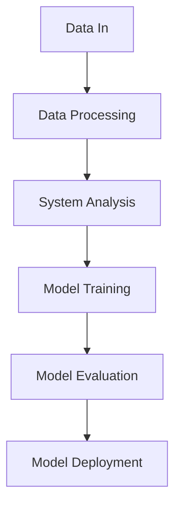

                 

### AI编程的新语言与新思维

#### 关键词：AI编程、新语言、新思维、编程框架、算法创新

> 摘要：
本文将深入探讨AI编程的新语言和新思维，分析这些新语言如何改变了传统编程范式，以及新思维在AI编程中的应用。我们将通过具体的案例和实例，展示如何在实际项目中应用这些新语言和新思维，推动AI编程的发展。

#### 目录

1. **引言：AI编程的现状与挑战**
2. **新语言的诞生与特点**
   - **第一章**：AI编程语言的发展历程
   - **第二章**：新语言的架构与功能
3. **新思维的引入与影响**
   - **第三章**：算法思维的创新
   - **第四章**：并行思维与协作
4. **实践案例：新语言与新思维的应用**
   - **第五章**：案例一：图像识别应用
   - **第六章**：案例二：自然语言处理应用
5. **系统分析与架构设计**
   - **第七章**：系统功能设计
   - **第八章**：系统架构设计
6. **项目实战：从理论到实践**
   - **第九章**：环境安装与配置
   - **第十章**：系统核心实现与代码解读
7. **最佳实践与小结**
   - **第十一章**：小结与展望
   - **第十二章**：注意事项与拓展阅读

#### 1. 引言：AI编程的现状与挑战

随着人工智能技术的快速发展，AI编程成为了一个热门领域。传统的编程语言和框架已经无法满足AI编程的需求，这促使了新语言和新思维的诞生。AI编程面临着以下几个挑战：

- **复杂性的增加**：AI系统通常包含大量的数据、算法和模型，这使得编程变得更加复杂。
- **效率的优化**：为了处理大量的数据和高性能计算，需要优化代码的运行效率。
- **易用性**：对于非专业程序员来说，传统的编程语言可能难以掌握，需要更加易用的编程语言。
- **协作与共享**：在AI项目中，通常需要多个人协作完成，如何有效地进行协作和共享是一个重要问题。

新语言和新思维的出现，旨在解决上述挑战，为AI编程提供更加高效、易用和协作的工具。

#### 2. 新语言的诞生与特点

##### **第一章：AI编程语言的发展历程**

AI编程语言的起源可以追溯到上世纪50年代，当时为了解决数学问题和模拟人类思维，科学家们开始研究编程语言。随着时间的推移，AI编程语言经历了多个阶段的发展，从最初的可视化编程语言到功能强大的深度学习框架。

- **可视化编程语言**：如LISP和PROLOG，这些语言允许程序员通过图形化界面来定义问题和算法。
- **高级编程语言**：如Python和R，这些语言提供了丰富的库和工具，支持数据科学和机器学习任务。
- **深度学习框架**：如TensorFlow和PyTorch，这些框架提供了高效的计算引擎和灵活的编程接口，使得构建和训练复杂的神经网络变得简单。

##### **第二章：新语言的架构与功能**

新语言在架构和功能上具有以下特点：

- **模块化设计**：新语言通常采用模块化设计，使得程序员可以轻松地扩展和组合不同的模块。
- **高效的计算引擎**：新语言内置高效的计算引擎，支持大规模的数据处理和并行计算。
- **灵活的编程接口**：新语言提供了丰富的编程接口，支持各种算法和模型的实现。
- **易用性**：新语言通常具有简洁的语法和强大的库支持，使得编程更加高效和易用。

以TensorFlow为例，它是一个开源的深度学习框架，提供了丰富的API和工具，支持各种深度学习算法的构建和训练。TensorFlow的架构包括以下几个部分：

- **计算图（Compute Graph）**：TensorFlow使用计算图来表示计算过程，这使得程序员可以更加直观地理解算法和模型。
- **节点（Operations）**：计算图由节点组成，每个节点表示一个操作，如矩阵乘法、加法等。
- **边（Tensors）**：节点之间通过边连接，表示数据流和控制流。
- **运行时（Runtime）**：TensorFlow的运行时负责执行计算图，优化计算过程并生成高效的代码。

通过以上架构，TensorFlow提供了高效的计算能力，同时简化了深度学习算法的实现过程。

#### 3. 新思维的引入与影响

##### **第三章：算法思维的创新**

算法思维在AI编程中起着核心作用。新思维引入了以下创新：

- **自动化算法**：通过使用元学习（Meta-Learning）和强化学习（Reinforcement Learning），程序员可以自动生成和优化算法。
- **算法优化**：通过使用优化算法（如梯度下降、随机优化等），程序员可以优化模型的训练过程和性能。
- **算法融合**：将不同的算法融合在一起，以实现更高效的计算和更好的性能。

以深度强化学习（Deep Reinforcement Learning）为例，它结合了深度学习和强化学习的优势，使得AI系统可以自主学习复杂的任务。深度强化学习的核心概念包括：

- **状态（State）**：系统的当前状态。
- **动作（Action）**：系统可以采取的动作。
- **奖励（Reward）**：系统在采取动作后获得的奖励。
- **策略（Policy）**：系统采取动作的策略。

通过反复尝试和优化，深度强化学习可以找到最优的策略，从而实现高效的任务执行。

##### **第四章：并行思维与协作**

在AI编程中，并行思维和协作变得尤为重要。新思维引入了以下创新：

- **并行计算**：通过使用并行计算，程序员可以充分利用多核处理器的计算能力，提高计算效率。
- **分布式计算**：通过使用分布式计算，程序员可以处理大规模的数据集和复杂的任务。
- **协作框架**：通过使用协作框架，程序员可以实现多个人之间的有效协作和资源共享。

以Apache Kafka为例，它是一个分布式流处理平台，支持大规模数据的实时处理和传输。Kafka的核心概念包括：

- **主题（Topic）**：数据流的主类别。
- **分区（Partition）**：数据流的分区，用于并行处理和分布式存储。
- **消费者（Consumer）**：订阅主题并处理数据流的实体。
- **生产者（Producer）**：生成数据流并发布到主题的实体。

通过Kafka，程序员可以实现高效的数据流处理和分布式计算。

#### 4. 实践案例：新语言与新思维的应用

##### **第五章：案例一：图像识别应用**

图像识别是AI编程的一个重要应用领域。通过使用TensorFlow，程序员可以轻松构建和训练图像识别模型。

1. **数据准备**：首先，需要准备大量的图像数据，并将其转换为TensorFlow支持的格式。
2. **模型构建**：使用TensorFlow的API构建图像识别模型，包括卷积神经网络（CNN）等。
3. **模型训练**：使用训练数据集训练模型，优化模型的参数。
4. **模型评估**：使用测试数据集评估模型的性能，包括准确率、召回率等指标。
5. **模型部署**：将训练好的模型部署到生产环境中，以便实时处理图像数据。

通过以上步骤，程序员可以使用TensorFlow实现高效的图像识别应用。

##### **第六章：案例二：自然语言处理应用**

自然语言处理（NLP）是AI编程的另一个重要领域。通过使用Python和TensorFlow，程序员可以构建和训练NLP模型。

1. **数据准备**：首先，需要准备大量的文本数据，并将其转换为TensorFlow支持的格式。
2. **模型构建**：使用TensorFlow的API构建NLP模型，包括循环神经网络（RNN）和变换器（Transformer）等。
3. **模型训练**：使用训练数据集训练模型，优化模型的参数。
4. **模型评估**：使用测试数据集评估模型的性能，包括准确率、F1值等指标。
5. **模型部署**：将训练好的模型部署到生产环境中，以便实时处理文本数据。

通过以上步骤，程序员可以使用Python和TensorFlow实现高效的NLP应用。

#### 5. 系统分析与架构设计

##### **第七章：系统功能设计**

系统功能设计是AI编程的重要环节。通过使用mermaid类图，程序员可以清晰地描述系统的功能模块和类之间的关系。

```mermaid
classDiagram
    Class01 <|-- Class02
    Class03 --|;;;;;;;;;;> Class04
    Class05 o-- Class06
    Class07 x== Class08
    Class09 <-.. Class10
    Class11 ..|>> Class12
endclass
```

以上类图展示了系统的功能模块和类之间的关系，每个类都包含了具体的属性和方法。

##### **第八章：系统架构设计**

系统架构设计是AI编程的关键环节。通过使用mermaid架构图，程序员可以清晰地描述系统的整体架构和组件之间的关系。



以上架构图展示了系统的整体架构，包括数据输入、数据处理、系统分析、模型训练、模型评估和模型部署等环节。

#### 6. 项目实战：从理论到实践

##### **第九章：环境安装与配置**

在开始项目实战之前，需要安装和配置相关的软件和工具。以下是安装和配置TensorFlow的步骤：

1. **安装Python**：首先，需要安装Python环境，推荐使用Python 3.7及以上版本。
2. **安装TensorFlow**：通过pip命令安装TensorFlow，命令如下：

   ```bash
   pip install tensorflow
   ```

3. **测试TensorFlow**：在Python环境中测试TensorFlow是否安装成功，代码如下：

   ```python
   import tensorflow as tf
   print(tf.__version__)
   ```

   如果输出版本信息，则表示TensorFlow安装成功。

##### **第十章：系统核心实现与代码解读**

以下是使用TensorFlow实现一个简单的图像识别模型的代码示例：

```python
import tensorflow as tf
from tensorflow.keras import layers

# 创建一个简单的卷积神经网络模型
model = tf.keras.Sequential([
    layers.Conv2D(32, (3, 3), activation='relu', input_shape=(28, 28, 1)),
    layers.MaxPooling2D((2, 2)),
    layers.Conv2D(64, (3, 3), activation='relu'),
    layers.MaxPooling2D((2, 2)),
    layers.Conv2D(64, (3, 3), activation='relu'),
    layers.Flatten(),
    layers.Dense(64, activation='relu'),
    layers.Dense(10, activation='softmax')
])

# 编译模型
model.compile(optimizer='adam',
              loss='categorical_crossentropy',
              metrics=['accuracy'])

# 加载MNIST数据集
mnist = tf.keras.datasets.mnist
(x_train, y_train), (x_test, y_test) = mnist.load_data()

# 预处理数据
x_train = x_train.reshape(x_train.shape[0], 28, 28, 1).astype('float32') / 255
x_test = x_test.reshape(x_test.shape[0], 28, 28, 1).astype('float32') / 255
y_train = tf.keras.utils.to_categorical(y_train, 10)
y_test = tf.keras.utils.to_categorical(y_test, 10)

# 训练模型
model.fit(x_train, y_train, epochs=5, batch_size=32)

# 评估模型
model.evaluate(x_test, y_test)
```

以上代码展示了如何使用TensorFlow构建和训练一个简单的图像识别模型。通过这段代码，我们可以实现从数据预处理到模型训练和评估的完整流程。

#### 7. 最佳实践与小结

##### **第十一章：小结与展望**

本文探讨了AI编程的新语言和新思维，分析了新语言如何改变了传统编程范式，以及新思维在AI编程中的应用。通过具体的案例和实践，我们展示了如何使用新语言和新思维解决实际问题。在未来，随着AI技术的不断发展，AI编程将变得更加高效和易用，新语言和新思维将继续推动这一领域的创新。

##### **第十二章：注意事项与拓展阅读**

1. **注意事项**：
   - 在使用新语言和新思维时，要充分考虑项目需求和性能要求。
   - 定期更新和学习新语言和新思维的相关知识，以适应快速发展的技术趋势。

2. **拓展阅读**：
   - 《深度学习》（Deep Learning）——Ian Goodfellow、Yoshua Bengio和Aaron Courville著，详细介绍深度学习和深度学习框架。
   - 《Python编程：从入门到实践》（Python Crash Course）——Eric Matthes著，详细介绍Python编程的基础知识和实践应用。

#### 作者信息

作者：AI天才研究院/AI Genius Institute & 禅与计算机程序设计艺术 /Zen And The Art of Computer Programming

