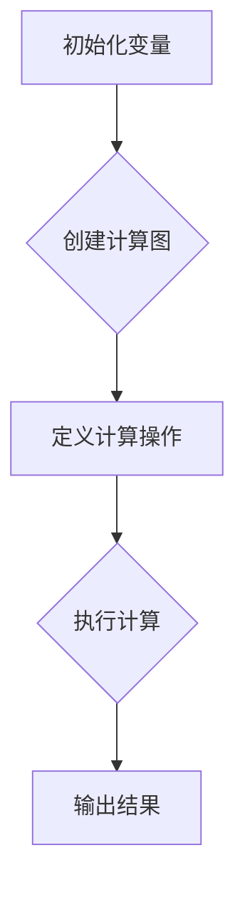

                 

# AI编程的新语言与新思维

关键词：AI编程，新语言，新思维，深度学习，编程范式

摘要：本文深入探讨了AI编程的新语言和新思维，分析了这些新语言和新思维的出现背景、核心概念及其在AI编程中的应用。通过具体的算法原理讲解和项目实战，展示了新语言和新思维在解决实际问题中的强大能力。

## 引言

在人工智能（AI）迅速发展的时代，编程语言和编程思维也在不断演变。传统编程语言如Python、Java等在AI编程中仍然发挥着重要作用，但为了更好地应对AI领域的复杂性，新的编程语言和编程思维应运而生。本文将详细介绍这些新语言和新思维，分析它们的核心概念及其在AI编程中的应用。

## 新语言的出现背景

随着AI技术的发展，传统编程语言在处理复杂AI任务时面临诸多挑战。首先，AI编程需要处理大量的数据，而传统编程语言的数据处理能力有限。其次，AI编程涉及到大量的数学和统计模型，传统编程语言在表达和计算这些模型时存在一定的局限性。此外，AI编程需要高效地处理并行和分布式计算，传统编程语言在这方面表现不佳。

为了解决这些问题，新的编程语言应运而生，如TensorFlow、PyTorch等。这些编程语言专门针对AI领域进行了优化，提供了丰富的库和工具，使得AI编程更加高效和便捷。

## 新语言的核心概念

### TensorFlow

TensorFlow是一个由Google开发的开源深度学习框架。它的核心概念包括张量（Tensor）、计算图（Graph）和会话（Session）。张量是TensorFlow中表示数据的基本单元，类似于多维数组。计算图是一个包含计算操作的图，每个操作都有输入和输出张量。会话则是执行计算图的运行环境。

### PyTorch

PyTorch是一个由Facebook开发的深度学习框架。与TensorFlow相比，PyTorch更加灵活和直观。其核心概念包括自动微分（Autograd）、动态计算图（Dynamic Graph）和TorchScript。自动微分是一种计算函数梯度的方法，适用于深度学习中的反向传播。动态计算图使得编程过程更加灵活，可以动态地创建和修改计算图。TorchScript是一种编译后的中间表示，可以提高代码的执行效率。

## 新思维的应用

### 深度学习思维

深度学习是AI编程的一个重要方向，其核心思维包括：

- **层次化表示**：将数据表示为多层神经网络，通过逐层提取特征，实现从简单到复杂的特征表示。
- **反向传播**：通过反向传播算法，自动计算神经网络中每个参数的梯度，用于模型训练。
- **优化算法**：使用如随机梯度下降（SGD）等优化算法，不断调整模型参数，以最小化损失函数。

### 分布式思维

分布式计算是AI编程中的一个重要方面，其核心思维包括：

- **数据并行**：将数据划分为多个部分，由不同的计算节点同时处理，提高数据处理速度。
- **模型并行**：将模型划分为多个部分，由不同的计算节点同时处理，提高模型训练速度。
- **通信优化**：通过优化数据传输和网络拓扑结构，减少通信开销，提高计算效率。

## 算法原理讲解

### TensorFlow算法原理

#### 计算图

在TensorFlow中，计算图是一个包含计算操作的图。每个操作（Operation）都有输入和输出张量（Tensor），并通过边（Edge）连接。计算图可以表示为如下Mermaid流程图：



#### 自动微分

自动微分是一种计算函数梯度的方法。在TensorFlow中，自动微分通过定义反向传播函数来实现。以下是一个使用Python代码实现自动微分的示例：

```python
import tensorflow as tf

# 定义计算图
x = tf.placeholder(tf.float32)
y = tf.square(x)

# 定义损失函数
loss = tf.reduce_mean(y)

# 定义反向传播
grad = tf.gradients(loss, x)

# 训练模型
with tf.Session() as sess:
    sess.run(grad, feed_dict={x: 2})
```

#### 会话

会话是执行计算图的运行环境。在TensorFlow中，会话用于运行计算图中的操作，并获取输出结果。以下是一个使用Python代码创建会话的示例：

```python
import tensorflow as tf

# 定义计算图
x = tf.placeholder(tf.float32)
y = tf.square(x)

# 定义损失函数
loss = tf.reduce_mean(y)

# 定义反向传播
grad = tf.gradients(loss, x)

# 创建会话
with tf.Session() as sess:
    # 运行反向传播
    sess.run(grad, feed_dict={x: 2})
```

### PyTorch算法原理

#### 自动微分

在PyTorch中，自动微分通过自动微分包Autograd来实现。以下是一个使用Python代码实现自动微分的示例：

```python
import torch

# 定义计算图
x = torch.tensor(2.0, requires_grad=True)
y = torch.square(x)

# 计算损失函数
loss = torch.mean(y)

# 计算梯度
loss.backward()

# 输出梯度
print(x.grad)
```

#### 动态计算图

在PyTorch中，动态计算图使得编程过程更加灵活。以下是一个使用Python代码创建动态计算图的示例：

```python
import torch

# 定义动态计算图
x = torch.tensor(2.0, requires_grad=True)
y = torch.square(x)

# 定义损失函数
loss = torch.mean(y)

# 训练模型
optimizer = torch.optim.SGD([x], lr=0.01)
optimizer.zero_grad()
loss.backward()
optimizer.step()
```

#### TorchScript

在PyTorch中，TorchScript是一种编译后的中间表示，可以提高代码的执行效率。以下是一个使用Python代码创建TorchScript的示例：

```python
import torch

# 定义计算图
x = torch.tensor(2.0, requires_grad=True)
y = torch.square(x)

# 定义损失函数
loss = torch.mean(y)

# 创建TorchScript
script = torch.jit.script(loss)

# 运行TorchScript
script(x)
```

## 数学模型和公式讲解

### TensorFlow数学模型

在TensorFlow中，深度学习模型的数学模型主要包括以下部分：

#### 前向传播

前向传播是指将输入数据通过神经网络传递到输出层的计算过程。其数学模型可以表示为：

$$
y = \sigma(W \cdot x + b)
$$

其中，$y$ 是输出层的结果，$\sigma$ 是激活函数，$W$ 是权重矩阵，$x$ 是输入数据，$b$ 是偏置项。

#### 反向传播

反向传播是指通过计算输出层到输入层的梯度，用于更新模型参数的过程。其数学模型可以表示为：

$$
\frac{\partial L}{\partial W} = \frac{\partial L}{\partial y} \cdot \frac{\partial y}{\partial W}
$$

$$
\frac{\partial L}{\partial b} = \frac{\partial L}{\partial y} \cdot \frac{\partial y}{\partial b}
$$

其中，$L$ 是损失函数，$y$ 是输出层的结果，$W$ 是权重矩阵，$b$ 是偏置项。

### PyTorch数学模型

在PyTorch中，深度学习模型的数学模型与TensorFlow类似，但实现方式有所不同。以下是PyTorch中的数学模型：

#### 前向传播

前向传播是指将输入数据通过神经网络传递到输出层的计算过程。其数学模型可以表示为：

$$
y = \sigma(W \cdot x + b)
$$

其中，$y$ 是输出层的结果，$\sigma$ 是激活函数，$W$ 是权重矩阵，$x$ 是输入数据，$b$ 是偏置项。

#### 反向传播

反向传播是指通过计算输出层到输入层的梯度，用于更新模型参数的过程。其数学模型可以表示为：

$$
\frac{\partial L}{\partial W} = \frac{\partial L}{\partial y} \cdot \frac{\partial y}{\partial W}
$$

$$
\frac{\partial L}{\partial b} = \frac{\partial L}{\partial y} \cdot \frac{\partial y}{\partial b}
$$

## 系统分析与架构设计

### 问题场景介绍

假设我们需要开发一个基于深度学习的图像分类系统，用于对输入的图像进行分类。

### 项目介绍

该项目将使用TensorFlow作为深度学习框架，实现一个简单的图像分类模型。系统将包含以下功能：

- 数据预处理：对输入图像进行预处理，包括缩放、裁剪、归一化等。
- 模型训练：使用预处理的图像数据训练深度学习模型。
- 模型评估：使用测试数据对训练好的模型进行评估。
- 模型应用：使用训练好的模型对新的图像进行分类。

### 系统功能设计

系统功能设计主要包括以下部分：

- 数据预处理模块：包括图像缩放、裁剪、归一化等功能。
- 模型训练模块：包括构建深度学习模型、训练模型、保存模型等功能。
- 模型评估模块：包括加载模型、评估模型性能等功能。
- 模型应用模块：包括加载模型、对新的图像进行分类等功能。

### 系统架构设计

系统架构设计主要包括以下部分：

- 数据预处理模块：使用TensorFlow的数据管道（Data Pipeline）进行数据预处理。
- 模型训练模块：使用TensorFlow的Keras API构建和训练深度学习模型。
- 模型评估模块：使用TensorFlow的评估API评估模型性能。
- 模型应用模块：使用TensorFlow的预测API对新的图像进行分类。

### 系统接口设计

系统接口设计主要包括以下部分：

- 数据接口：用于接收和处理图像数据。
- 模型接口：用于加载和训练深度学习模型。
- 预测接口：用于对新的图像进行分类。

### 系统交互

系统交互主要包括以下部分：

- 数据预处理模块与数据接口的交互：接收图像数据，进行预处理。
- 模型训练模块与模型接口的交互：加载训练数据，训练深度学习模型。
- 模型评估模块与模型接口的交互：加载测试数据，评估模型性能。
- 模型应用模块与预测接口的交互：加载模型，对新的图像进行分类。

## 项目实战

### 环境安装

在开始项目实战之前，需要安装以下软件：

- Python 3.7或更高版本
- TensorFlow 2.x
- OpenCV 4.x

安装步骤如下：

```bash
pip install python==3.7
pip install tensorflow==2.x
pip install opencv-python==4.x
```

### 系统核心实现

以下是一个使用TensorFlow实现的简单图像分类模型的代码示例：

```python
import tensorflow as tf
import numpy as np
import cv2

# 定义模型
model = tf.keras.Sequential([
    tf.keras.layers.Conv2D(32, (3, 3), activation='relu', input_shape=(28, 28, 1)),
    tf.keras.layers.MaxPooling2D((2, 2)),
    tf.keras.layers.Flatten(),
    tf.keras.layers.Dense(128, activation='relu'),
    tf.keras.layers.Dense(10, activation='softmax')
])

# 编译模型
model.compile(optimizer='adam',
              loss='sparse_categorical_crossentropy',
              metrics=['accuracy'])

# 加载数据
(x_train, y_train), (x_test, y_test) = tf.keras.datasets.mnist.load_data()

# 预处理数据
x_train = x_train / 255.0
x_test = x_test / 255.0

# 训练模型
model.fit(x_train, y_train, epochs=5)

# 评估模型
test_loss, test_acc = model.evaluate(x_test, y_test, verbose=2)
print('Test accuracy:', test_acc)

# 应用模型
img = cv2.imread('test_image.jpg', cv2.IMREAD_GRAYSCALE)
img = cv2.resize(img, (28, 28))
img = img / 255.0
img = np.expand_dims(img, axis=-1)
img = np.expand_dims(img, axis=0)

predictions = model.predict(img)
predicted_class = np.argmax(predictions, axis=1)
print('Predicted class:', predicted_class)
```

### 代码应用解读与分析

上述代码实现了一个基于卷积神经网络（CNN）的图像分类模型。首先，定义了一个顺序模型（Sequential），并添加了卷积层（Conv2D）、池化层（MaxPooling2D）、全连接层（Dense）等层。然后，编译模型并加载MNIST数据集进行训练。在训练完成后，使用测试数据集评估模型性能。最后，使用OpenCV读取一个图像文件，进行预处理后，使用训练好的模型进行分类预测。

### 实际案例分析和详细讲解剖析

假设我们有一个新的图像文件`test_image.jpg`，使用上述模型对其进行分类预测。首先，使用OpenCV读取图像，并将其转换为灰度图像。然后，将图像缩放到28x28的大小，并归一化到[0, 1]区间。接下来，将图像数据扩展为4D张量，并将其作为模型的输入进行预测。最终，使用`argmax`函数获取预测结果的最高概率类别。

### 项目小结

通过上述项目实战，我们使用TensorFlow实现了简单的图像分类模型，并对其进行了详细的分析和解剖。这个项目展示了新语言和新思维在解决实际问题中的强大能力。在后续的项目中，我们可以进一步扩展这个模型，添加更多的功能，如多标签分类、实时图像分类等。

## 最佳实践 tips、小结、注意事项、拓展阅读

### 最佳实践 tips

1. 在使用TensorFlow和PyTorch进行深度学习编程时，了解和熟练使用各自的API和库是非常重要的。
2. 在编写深度学习模型时，遵循良好的编程实践，如代码注释、模块化设计和版本控制。
3. 在处理大量数据时，合理利用GPU和分布式计算，以提高模型训练和推理的效率。

### 小结

本文深入探讨了AI编程的新语言和新思维，分析了这些新语言和新思维的核心概念及其在AI编程中的应用。通过具体的算法原理讲解和项目实战，展示了新语言和新思维在解决实际问题中的强大能力。

### 注意事项

1. 在使用深度学习框架时，确保正确安装和配置环境，以避免潜在的错误和问题。
2. 在训练深度学习模型时，合理设置超参数，如学习率、批次大小等，以获得更好的模型性能。

### 拓展阅读

- [TensorFlow官方文档](https://www.tensorflow.org/)
- [PyTorch官方文档](https://pytorch.org/)
- [《深度学习》（Goodfellow, Bengio, Courville著）](https://www.deeplearningbook.org/)
- [《Python深度学习》（François Chollet著）](https://www.pythondlbook.com/)

## 作者信息

作者：AI天才研究院/AI Genius Institute & 禅与计算机程序设计艺术 /Zen And The Art of Computer Programming

