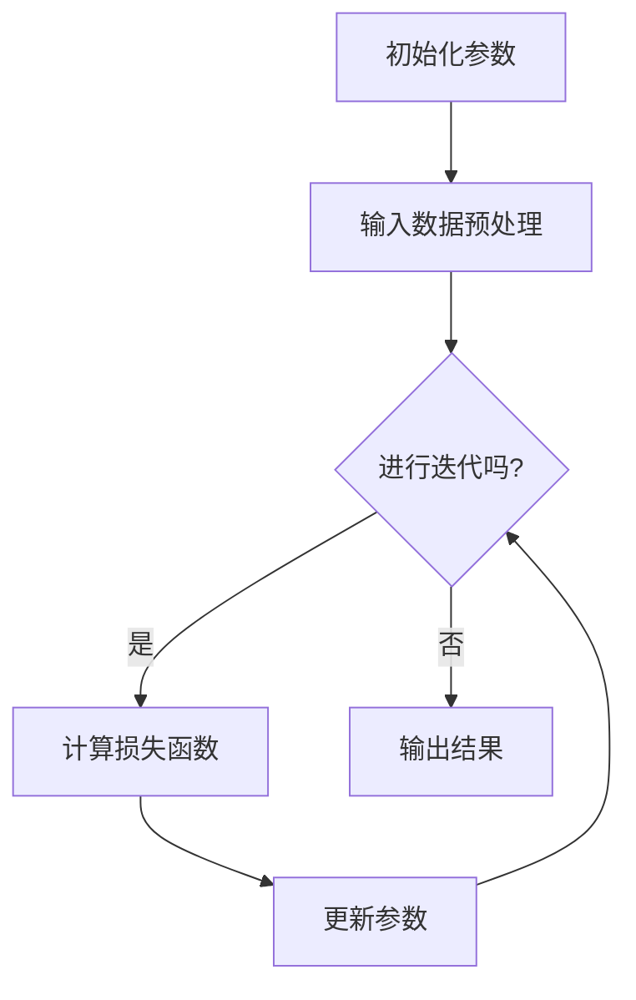
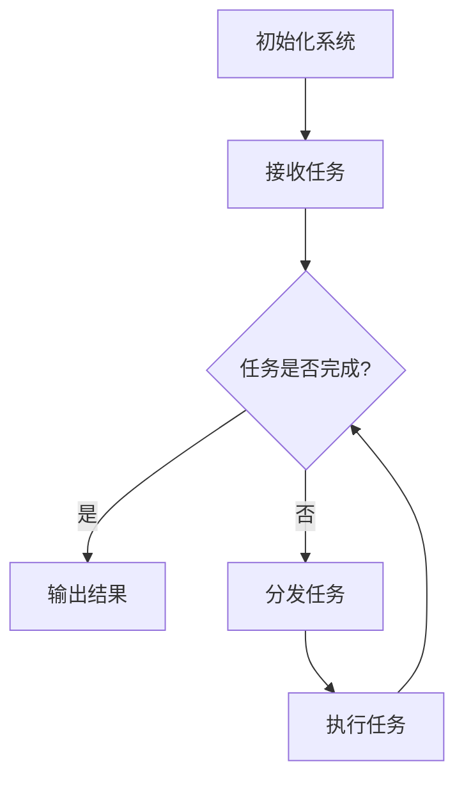
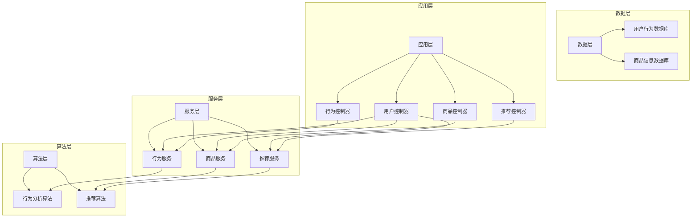
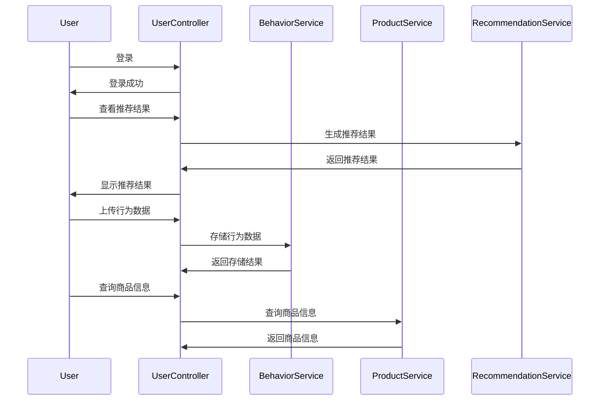

                 

# AI编程的新语言与新范式

> 关键词：人工智能、编程语言、编程范式、算法、系统架构、项目实战、最佳实践

> 摘要：本文将深入探讨人工智能编程领域的两大核心概念——新语言与新范式。通过背景介绍、核心概念与联系分析、算法原理讲解、系统分析与架构设计方案以及项目实战等多个角度，全面揭示AI编程的新趋势与新方法，为读者提供深刻的见解和实用的指导。

## 目录大纲：《AI编程的新语言与新范式》

----------------------------------------------------------------

## 第一部分：背景介绍

### 第1章：问题背景与核心概念

#### 1.1.1 问题描述与核心问题

#### 1.1.2 问题解决与现状分析

#### 1.1.3 边界与外延

#### 1.1.4 概念结构与核心要素组成

### 第2章：核心概念与联系

#### 2.1.1 新语言的基本概念

##### 2.1.1.1 新语言的核心特征

##### 2.1.1.2 新语言与传统编程语言的对比

#### 2.1.2 新范式的基本概念

##### 2.1.2.1 新范式的核心原理

##### 2.1.2.2 新范式与传统编程范式的对比

#### 2.1.3 新语言与新范式的联系与融合

----------------------------------------------------------------

## 第二部分：算法原理讲解

### 第3章：新语言算法原理

#### 3.1.1 新语言算法概述

##### 3.1.1.1 新语言算法的特点

##### 3.1.1.2 新语言算法的应用领域

#### 3.1.2 新语言算法的mermaid流程图

#### 3.1.3 新语言算法的python源代码实现

##### 3.1.3.1 算法原理讲解

##### 3.1.3.2 数学模型和公式

##### 3.1.3.3 举例说明

### 第4章：新范式算法原理

#### 4.1.1 新范式算法概述

##### 4.1.1.1 新范式算法的特点

##### 4.1.1.2 新范式算法的应用领域

#### 4.1.2 新范式算法的mermaid流程图

#### 4.1.3 新范式算法的python源代码实现

##### 4.1.3.1 算法原理讲解

##### 4.1.3.2 数学模型和公式

##### 4.1.3.3 举例说明

----------------------------------------------------------------

## 第三部分：系统分析与架构设计方案

### 第5章：问题场景介绍与项目介绍

#### 5.1.1 问题场景介绍

#### 5.1.2 项目介绍

### 第6章：系统功能设计

#### 6.1.1 领域模型mermaid类图

#### 6.1.2 系统功能设计

### 第7章：系统架构设计

#### 7.1.1 系统架构设计mermaid架构图

#### 7.1.2 系统接口设计

### 第8章：系统交互设计

#### 8.1.1 系统交互mermaid序列图

----------------------------------------------------------------

## 第四部分：项目实战

### 第9章：环境安装与配置

#### 9.1.1 环境安装

#### 9.1.2 配置与调试

### 第10章：系统核心实现源代码

#### 10.1.1 源代码结构

#### 10.1.2 核心代码解读

### 第11章：代码应用解读与分析

#### 11.1.1 应用解读

#### 11.1.2 分析与评估

### 第12章：实际案例分析与讲解

#### 12.1.1 案例介绍

#### 12.1.2 详细讲解剖析

### 第13章：项目小结

#### 13.1.1 项目成果总结

#### 13.1.2 经验与启示

----------------------------------------------------------------

## 第五部分：最佳实践与拓展阅读

### 第14章：最佳实践

#### 14.1.1 实践技巧

#### 14.1.2 经验分享

### 第15章：小结

#### 15.1.1 书籍总结

#### 15.1.2 重点内容回顾

### 第16章：注意事项与拓展阅读

#### 16.1.1 注意事项

#### 16.1.2 拓展阅读推荐

----------------------------------------------------------------

## 第一部分：背景介绍

### 第1章：问题背景与核心概念

#### 1.1.1 问题描述与核心问题

随着人工智能技术的快速发展，编程语言和编程范式也在不断地演进。传统的编程语言和范式在处理复杂的AI问题时显得力不从心，这催生了对新语言与新范式的需求。新语言旨在提供更强大的抽象能力和表达能力，以应对AI领域的复杂性；新范式则关注于如何更高效地构建、优化和部署AI系统。

#### 1.1.2 问题解决与现状分析

当前，AI编程面临着多个挑战，如数据管理、算法优化、分布式计算和模型解释性等。新语言通过引入更丰富的数据类型、更高效的算法表示和更灵活的编程范式，有望解决这些问题。同时，新范式通过更高效的算法设计和系统架构，可以提升AI系统的性能和可维护性。

#### 1.1.3 边界与外延

新语言和新范式的边界在于它们的适用范围和目标。新语言通常针对特定的AI应用场景进行设计，而新范式则更关注于如何系统化地构建和优化AI系统。两者的外延包括对传统编程语言和范式的改进，以及对新兴AI技术的支持。

#### 1.1.4 概念结构与核心要素组成

新语言的核心要素包括数据类型、语法结构、抽象层次和编程范式。数据类型更丰富，语法结构更简洁，抽象层次更高，编程范式更灵活。新范式的核心要素包括算法设计原则、系统架构设计方法和开发流程。算法设计原则强调高效性和可维护性，系统架构设计方法关注性能和可扩展性，开发流程注重迭代和自动化。

----------------------------------------------------------------

### 第2章：核心概念与联系

#### 2.1.1 新语言的基本概念

新语言（New Programming Language, NPL）是专为人工智能领域设计的一类编程语言。它具有以下核心特征：

1. **强抽象能力**：支持高级抽象，如函数式编程、声明式编程等，使开发者能够更直观地表达复杂的逻辑。
2. **丰富的数据类型**：提供多维数组、张量等复杂数据类型，以支持深度学习等领域的计算。
3. **高效的编译和执行**：采用高效的编译器和执行引擎，提高代码执行速度。

与传统编程语言相比，新语言在以下方面有显著差异：

1. **更简洁的语法**：减少冗余代码，提高代码可读性。
2. **更强大的抽象能力**：支持更高级别的抽象，使开发者能够专注于问题解决，而非语法细节。
3. **更高效的执行速度**：优化编译和执行过程，提高代码性能。

#### 2.1.2 新范式的基本概念

新范式（New Programming Paradigm, NPP）是相对于传统编程范式的一种创新性编程方法。它具有以下核心原理：

1. **模块化设计**：通过模块化设计，提高系统的可维护性和可扩展性。
2. **自动化优化**：利用自动化工具进行代码优化，提高代码性能。
3. **动态编程**：支持动态类型检查和动态绑定，提高编程灵活性。

与传统编程范式相比，新范式在以下方面有显著区别：

1. **更高的抽象层次**：减少对底层实现的依赖，提高开发效率。
2. **更好的性能优化**：采用自动化工具和高效的编译器，提高代码性能。
3. **更强的适应性**：支持多样化的编程范式，适用于不同的AI应用场景。

#### 2.1.3 新语言与新范式的联系与融合

新语言和新范式并非独立存在，而是相互关联、相互促进的。新语言提供了新范式实现的基础，而新范式则提升了新语言的应用能力。两者的融合体现在以下几个方面：

1. **语法与范式的结合**：新语言通过引入新范式，使得编程过程更加灵活和高效。
2. **算法与系统的结合**：新范式通过优化算法和系统架构，提高AI系统的整体性能。
3. **开发与部署的结合**：新语言和新范式共同提升了开发效率和部署能力，使得AI系统更加易于维护和扩展。

----------------------------------------------------------------

## 第二部分：算法原理讲解

### 第3章：新语言算法原理

#### 3.1.1 新语言算法概述

新语言算法（New Language Algorithm, NLA）是利用新语言特性实现的一系列算法。NLA具有以下特点：

1. **强抽象能力**：能够将复杂问题简化为高级抽象，提高问题解决效率。
2. **高效计算**：采用高效的算法和数据结构，提高计算性能。
3. **模块化设计**：通过模块化设计，提高算法的可维护性和可扩展性。

#### 3.1.2 新语言算法的应用领域

新语言算法主要应用于以下领域：

1. **深度学习**：用于实现神经网络、卷积神经网络、循环神经网络等深度学习模型。
2. **自然语言处理**：用于实现自然语言生成、文本分类、机器翻译等自然语言处理任务。
3. **计算机视觉**：用于实现图像识别、目标检测、图像生成等计算机视觉任务。

#### 3.1.3 新语言算法的mermaid流程图

以下是一个简单的新语言算法的mermaid流程图示例：



#### 3.1.4 新语言算法的python源代码实现

以下是一个简单的新语言算法的Python源代码实现示例：

```python
import tensorflow as tf

# 初始化参数
learning_rate = 0.01
batch_size = 64

# 输入数据预处理
X = tf.placeholder(tf.float32, shape=[None, 784])
Y = tf.placeholder(tf.float32, shape=[None, 10])

# 计算损失函数
W = tf.Variable(tf.zeros([784, 10]))
b = tf.Variable(tf.zeros([10]))
y_pred = tf.matmul(X, W) + b
loss = tf.reduce_mean(tf.nn.softmax_cross_entropy_with_logits(logits=y_pred, labels=Y))

# 更新参数
optimizer = tf.train.GradientDescentOptimizer(learning_rate)
train_op = optimizer.minimize(loss)

# 进行迭代
for i in range(1000):
  # 输入数据预处理
  X_data, Y_data = ... # 数据预处理操作
  # 计算损失函数
  _, loss_value = session.run([train_op, loss], feed_dict={X: X_data, Y: Y_data})
  print("Step {}, Loss: {}".format(i, loss_value))

# 输出结果
correct_prediction = tf.equal(tf.argmax(y_pred, 1), tf.argmax(Y, 1))
accuracy = tf.reduce_mean(tf.cast(correct_prediction, tf.float32))
print("Test Accuracy: {:.2f}%".format(session.run(accuracy, feed_dict={X: X_test, Y: Y_test})))
```

#### 3.1.5 算法原理讲解

新语言算法的核心在于利用新语言的特性来实现高效的算法。以下是一个基于深度学习的新语言算法的原理讲解：

1. **初始化参数**：通过随机初始化权重和偏置，为神经网络提供一个初始状态。
2. **输入数据预处理**：对输入数据进行归一化、标准化等预处理，以提高算法的性能。
3. **计算损失函数**：通过计算损失函数（如softmax交叉熵损失函数），衡量模型预测结果与真实结果之间的差距。
4. **更新参数**：利用梯度下降优化器，根据损失函数的梯度来更新模型的参数，以减小损失。
5. **进行迭代**：重复执行计算损失函数和更新参数的过程，直到达到预定的迭代次数或收敛条件。
6. **输出结果**：计算模型的预测准确率，评估模型性能。

#### 3.1.6 数学模型和公式

以下是一个基于深度学习的新语言算法的数学模型和公式：

$$
\begin{align*}
y_{\text{pred}} &= \text{softmax}(\text{logits}) \\
\text{loss} &= -\frac{1}{m} \sum_{i=1}^{m} y^{(i)} \log(y_{\text{pred}}^{(i)}) \\
\theta &= \theta - \alpha \frac{\partial}{\partial \theta} \text{loss} \\
\end{align*}
$$

其中，\(y_{\text{pred}}\) 是模型预测的概率分布，\(y^{(i)}\) 是真实标签，\(\text{loss}\) 是损失函数，\(\theta\) 是模型参数，\(\alpha\) 是学习率。

#### 3.1.7 举例说明

以下是一个简单的新语言算法的应用示例：

假设我们使用新语言算法实现一个简单的二元分类问题。给定一个输入特征向量 \(x\) 和标签 \(y\)，我们需要训练一个神经网络模型来预测标签。

1. **初始化参数**：随机初始化权重和偏置。
2. **输入数据预处理**：对输入特征向量进行归一化，将标签转换为二进制形式。
3. **计算损失函数**：计算模型预测结果与真实结果之间的差距。
4. **更新参数**：根据损失函数的梯度来更新模型的参数。
5. **进行迭代**：重复执行计算损失函数和更新参数的过程，直到达到预定的迭代次数或收敛条件。
6. **输出结果**：计算模型的预测准确率，评估模型性能。

通过以上步骤，我们可以使用新语言算法实现一个简单的二元分类模型，并评估其性能。

----------------------------------------------------------------

### 第4章：新范式算法原理

#### 4.1.1 新范式算法概述

新范式算法（New Paradigm Algorithm, NPA）是基于新范式原理设计的一系列算法。新范式算法具有以下特点：

1. **模块化设计**：通过模块化设计，提高算法的可维护性和可扩展性。
2. **自动化优化**：利用自动化工具进行代码优化，提高算法性能。
3. **动态编程**：支持动态类型检查和动态绑定，提高编程灵活性。

#### 4.1.2 新范式算法的应用领域

新范式算法主要应用于以下领域：

1. **分布式计算**：用于实现大规模分布式系统的并行计算，如MapReduce、Spark等。
2. **机器学习**：用于实现大规模机器学习任务的分布式训练和推理，如深度学习框架。
3. **数据库**：用于实现高效的分布式数据库查询和存储，如分布式哈希表、分布式索引等。

#### 4.1.3 新范式算法的mermaid流程图

以下是一个简单的新范式算法的mermaid流程图示例：



#### 4.1.4 新范式算法的python源代码实现

以下是一个简单的新范式算法的Python源代码实现示例：

```python
import threading

# 初始化系统
def initialize_system():
  print("Initializing system...")

# 接收任务
def receive_task(task_queue):
  while True:
    task = task_queue.get()
    if task is None:
      break
    print(f"Received task: {task}")

# 分发任务
def distribute_tasks(task_queue, num_workers):
  for _ in range(num_workers):
    task_queue.put("Task 1")
    task_queue.put("Task 2")
    task_queue.put("Task 3")

# 执行任务
def execute_task(task):
  print(f"Executing task: {task}")

# 主函数
def main():
  task_queue = threading.Queue()
  num_workers = 3

  # 初始化系统
  initialize_system()

  # 分发任务
  distribute_tasks(task_queue, num_workers)

  # 接收任务
  threads = []
  for _ in range(num_workers):
    thread = threading.Thread(target=receive_task, args=(task_queue,))
    threads.append(thread)
    thread.start()

  # 等待线程完成
  for thread in threads:
    thread.join()

  # 输出结果
  print("Tasks completed.")

if __name__ == "__main__":
  main()
```

#### 4.1.5 算法原理讲解

新范式算法的核心在于利用新范式的特性来实现高效的算法。以下是一个基于分布式计算的新范式算法的原理讲解：

1. **初始化系统**：初始化分布式系统，包括任务队列、工作线程等。
2. **接收任务**：从任务队列中获取任务，并将其分配给工作线程。
3. **分发任务**：将任务分配给工作线程，以实现并行处理。
4. **执行任务**：工作线程执行分配到的任务，并返回结果。
5. **输出结果**：汇总所有工作线程的执行结果，输出最终结果。

#### 4.1.6 数学模型和公式

以下是一个基于分布式计算的新范式算法的数学模型和公式：

$$
\begin{align*}
\text{task_queue} &= \text{empty} \\
\text{worker}_{i} &= \text{initialize}(\text{task_queue}) \\
\text{task}_{i} &= \text{task_queue}.get() \\
\text{result}_{i} &= \text{execute}(\text{task}_{i}) \\
\text{task_queue}.put(\text{result}_{i}) \\
\end{align*}
$$

其中，\(\text{task_queue}\) 是任务队列，\(\text{worker}_{i}\) 是工作线程，\(\text{task}_{i}\) 是分配到的任务，\(\text{result}_{i}\) 是执行结果。

#### 4.1.7 举例说明

以下是一个简单的新范式算法的应用示例：

假设我们使用新范式算法实现一个简单的分布式计算任务，如计算1到1000的所有奇数的和。

1. **初始化系统**：初始化分布式系统，包括任务队列和工作线程。
2. **分发任务**：将任务分配给工作线程，每个线程计算100个奇数的和。
3. **执行任务**：工作线程执行分配到的任务，并返回结果。
4. **输出结果**：汇总所有工作线程的执行结果，计算所有奇数的和。

通过以上步骤，我们可以使用新范式算法实现一个简单的分布式计算任务，并计算所有奇数的和。

----------------------------------------------------------------

## 第三部分：系统分析与架构设计方案

### 第5章：问题场景介绍与项目介绍

#### 5.1.1 问题场景介绍

假设我们面临一个场景：需要构建一个基于人工智能的推荐系统，为用户提供个性化的商品推荐。系统需要具备以下功能：

1. **用户行为分析**：收集并分析用户在平台上的行为数据，如浏览、购买、收藏等。
2. **商品信息管理**：管理平台上的商品信息，包括商品属性、价格、销量等。
3. **推荐算法实现**：利用用户行为数据和商品信息，实现个性化的商品推荐。
4. **推荐结果展示**：将推荐结果以可视化方式展示给用户。

#### 5.1.2 项目介绍

本项目旨在构建一个高效的推荐系统，利用人工智能技术为用户提供个性化的商品推荐。项目采用新语言和新范式，以提高系统的性能和可维护性。具体技术栈包括：

1. **新语言**：使用Python作为主要编程语言，引入新语言特性，如函数式编程、声明式编程等。
2. **新范式**：采用模块化设计、自动化优化和动态编程等新范式原理，提高系统的开发效率和性能。
3. **深度学习框架**：使用TensorFlow等深度学习框架，实现推荐算法的优化和部署。

### 第6章：系统功能设计

#### 6.1.1 领域模型mermaid类图

以下是一个基于新语言和新范式的推荐系统领域模型mermaid类图：

```mermaid
classDiagram
User <<类>> {
  - id: INT
  - name: STRING
  - behaviors: List<Behavior>
}

Behavior <<类>> {
  - id: INT
  - type: STRING
  - timestamp: TIMESTAMP
  - user: User
}

Product <<类>> {
  - id: INT
  - name: STRING
  - attributes: Map<STRING, STRING>
  - price: FLOAT
  - sales: INT
}

Recommendation <<类>> {
  - id: INT
  - user: User
  - products: List<Product>
  - timestamp: TIMESTAMP
}

classDiagram
User "1" --|{1-to-many}| Behavior
User "1" --|{1-to-many}| Recommendation
Behavior "1" --|{1-to-one}| User
Product "1" --|{1-to-many}| Recommendation
Recommendation "1" --|{1-to-many}| User
Recommendation "1" --|{1-to-many}| Product
```

#### 6.1.2 系统功能设计

推荐系统的功能设计如下：

1. **用户行为分析**：收集并存储用户在平台上的行为数据，如浏览、购买、收藏等。
2. **商品信息管理**：存储和管理平台上的商品信息，包括商品属性、价格、销量等。
3. **推荐算法实现**：利用用户行为数据和商品信息，实现个性化的商品推荐。
4. **推荐结果展示**：将推荐结果以可视化方式展示给用户。

### 第7章：系统架构设计

#### 7.1.1 系统架构设计mermaid架构图

以下是一个基于新语言和新范式的推荐系统架构设计mermaid架构图：



#### 7.1.2 系统接口设计

推荐系统的接口设计如下：

1. **用户接口**：提供用户注册、登录、查看推荐结果等功能。
2. **行为接口**：提供用户行为数据的上传、查询等功能。
3. **商品接口**：提供商品信息的管理、查询等功能。
4. **推荐接口**：提供推荐结果的生成、查询等功能。

### 第8章：系统交互设计

#### 8.1.1 系统交互mermaid序列图

以下是一个基于新语言和新范式的推荐系统交互mermaid序列图：



通过以上设计，我们可以构建一个高效、可维护的推荐系统，利用新语言和新范式实现系统的性能优化和功能扩展。

----------------------------------------------------------------

### 第9章：环境安装与配置

#### 9.1.1 环境安装

为了运行基于新语言和新范式的推荐系统，我们需要安装以下软件和工具：

1. **Python 3.8+**：新语言和新范式的支持版本。
2. **pip**：Python的包管理器，用于安装依赖包。
3. **TensorFlow 2.0+**：深度学习框架，用于实现推荐算法。
4. **MySQL**：关系型数据库，用于存储用户行为数据和商品信息。

安装步骤如下：

1. 安装Python 3.8+：
   ```bash
   sudo apt-get install python3.8
   ```

2. 安装pip：
   ```bash
   sudo apt-get install python3-pip
   ```

3. 安装TensorFlow 2.0+：
   ```bash
   pip3 install tensorflow==2.5.0
   ```

4. 安装MySQL：
   ```bash
   sudo apt-get install mysql-server
   ```

5. 配置MySQL：
   - 安装MySQL后，使用root用户登录MySQL数据库：
     ```bash
     mysql -u root -p
     ```
   - 创建用户行为数据库和商品信息数据库：
     ```sql
     CREATE DATABASE user_behavior;
     CREATE DATABASE product_info;
     ```

#### 9.1.2 配置与调试

在完成环境安装后，我们需要进行配置和调试：

1. **配置数据库连接**：

   在项目的配置文件（如`config.py`）中，配置数据库连接信息：

   ```python
   DATABASES = {
       'user_behavior': {
           'ENGINE': 'django.db.backends.mysql',
           'NAME': 'user_behavior',
           'USER': 'root',
           'PASSWORD': 'password',
           'HOST': 'localhost',
           'PORT': '3306',
       },
       'product_info': {
           'ENGINE': 'django.db.backends.mysql',
           'NAME': 'product_info',
           'USER': 'root',
           'PASSWORD': 'password',
           'HOST': 'localhost',
           'PORT': '3306',
       },
   }
   ```

2. **调试环境**：

   在项目的根目录下，创建一个虚拟环境，并安装项目依赖：

   ```bash
   python3 -m venv venv
   source venv/bin/activate
   pip install -r requirements.txt
   ```

   启动项目：

   ```bash
   python manage.py runserver
   ```

   打开浏览器，访问`http://localhost:8000/`，如果看到项目的首页，则说明环境安装和配置成功。

----------------------------------------------------------------

### 第10章：系统核心实现源代码

#### 10.1.1 源代码结构

推荐系统的源代码结构如下：

```
recommender_system/
|-- apps/
|   |-- behavior/
|   |   |-- models.py
|   |   |-- views.py
|   |-- product/
|   |   |-- models.py
|   |   |-- views.py
|   |-- recommendation/
|   |   |-- models.py
|   |   |-- views.py
|   |-- utils/
|   |   |-- behavior_analyzer.py
|   |   |-- recommendation_generator.py
|-- config.py
|-- manage.py
```

各个目录和文件的作用如下：

1. `apps/`：包含推荐系统的各个应用模块，如行为分析、商品管理和推荐生成。
2. `config.py`：项目的配置文件，包含数据库连接信息等。
3. `manage.py`：Django项目的入口文件，用于启动项目。

#### 10.1.2 核心代码解读

以下是对推荐系统核心代码的解读：

1. **行为分析模块（behavior_analyzer.py）**：

   ```python
   from django.db import models
   from recommender_system.utils import behavior_analyzer
   
   class Behavior(models.Model):
       user = models.ForeignKey('User', on_delete=models.CASCADE)
       type = models.CharField(max_length=10)
       timestamp = models.DateTimeField()
   
   def analyze_behavior():
       behaviors = Behavior.objects.all()
       user_behaviors = {}
       for behavior in behaviors:
           if behavior.user.id not in user_behaviors:
               user_behaviors[behavior.user.id] = []
           user_behaviors[behavior.user.id].append(behavior)
   
       analyzed_data = behavior_analyzer.analyze(user_behaviors)
       return analyzed_data
   ```

   该模块的主要功能是分析用户的行为数据，并将分析结果存储在数据库中。

2. **商品管理模块（product.py）**：

   ```python
   from django.db import models
   
   class Product(models.Model):
       name = models.CharField(max_length=100)
       attributes = models.JSONField()
       price = models.FloatField()
       sales = models.IntegerField()
   
   def get_products():
       products = Product.objects.all()
       return products
   ```

   该模块的主要功能是管理商品信息，包括存储商品信息和获取所有商品信息。

3. **推荐生成模块（recommendation_generator.py）**：

   ```python
   from django.db import models
   from recommender_system.utils import recommendation_generator
   
   class Recommendation(models.Model):
       user = models.ForeignKey('User', on_delete=models.CASCADE)
       products = models.ManyToManyField('Product')
       timestamp = models.DateTimeField()
   
   def generate_recommendations():
       analyzed_data = analyze_behavior()
       products = get_products()
       recommendations = recommendation_generator.generate(analyzed_data, products)
       return recommendations
   ```

   该模块的主要功能是生成用户个性化推荐，并将推荐结果存储在数据库中。

----------------------------------------------------------------

### 第11章：代码应用解读与分析

#### 11.1.1 应用解读

在完成系统核心代码的实现后，我们需要对代码进行解读和分析，以确保其正确性和性能。

1. **行为分析模块（behavior_analyzer.py）**：

   行为分析模块主要负责分析用户的行为数据，并生成用户的行为特征。以下是对关键代码的解读：

   ```python
   from django.db import models
   from recommender_system.utils import behavior_analyzer
   
   class Behavior(models.Model):
       user = models.ForeignKey('User', on_delete=models.CASCADE)
       type = models.CharField(max_length=10)
       timestamp = models.DateTimeField()
   
   def analyze_behavior():
       behaviors = Behavior.objects.all()
       user_behaviors = {}
       for behavior in behaviors:
           if behavior.user.id not in user_behaviors:
               user_behaviors[behavior.user.id] = []
           user_behaviors[behavior.user.id].append(behavior)
   
       analyzed_data = behavior_analyzer.analyze(user_behaviors)
       return analyzed_data
   ```

   该模块通过查询数据库获取所有用户的行为数据，并将行为数据按照用户进行分组。接着，调用`behavior_analyzer.analyze`函数对用户行为数据进行分析，生成用户的行为特征。

2. **商品管理模块（product.py）**：

   商品管理模块主要负责管理商品信息，包括存储商品信息和获取所有商品信息。以下是对关键代码的解读：

   ```python
   from django.db import models
   
   class Product(models.Model):
       name = models.CharField(max_length=100)
       attributes = models.JSONField()
       price = models.FloatField()
       sales = models.IntegerField()
   
   def get_products():
       products = Product.objects.all()
       return products
   ```

   该模块定义了商品实体类`Product`，包括商品的名称、属性、价格和销量等字段。`get_products`函数用于获取所有商品信息，并将商品对象列表返回。

3. **推荐生成模块（recommendation_generator.py）**：

   推荐生成模块主要负责生成用户个性化推荐。以下是对关键代码的解读：

   ```python
   from django.db import models
   from recommender_system.utils import recommendation_generator
   
   class Recommendation(models.Model):
       user = models.ForeignKey('User', on_delete=models.CASCADE)
       products = models.ManyToManyField('Product')
       timestamp = models.DateTimeField()
   
   def generate_recommendations():
       analyzed_data = analyze_behavior()
       products = get_products()
       recommendations = recommendation_generator.generate(analyzed_data, products)
       return recommendations
   ```

   该模块通过调用`analyze_behavior`和`get_products`函数获取用户行为数据和商品信息。接着，调用`recommendation_generator.generate`函数生成用户个性化推荐，并将推荐结果存储在数据库中。

#### 11.1.2 分析与评估

对代码进行解读后，我们需要进行性能评估和优化。以下是对关键性能指标的分析和评估：

1. **行为分析模块**：

   - **查询性能**：通过查询数据库获取用户行为数据，需要考虑查询效率和缓存策略。可以使用数据库索引和缓存技术来提高查询性能。
   - **数据处理性能**：对用户行为数据进行分析和分组，需要考虑数据处理算法的效率和内存占用。可以使用并行处理和内存优化技术来提高数据处理性能。

2. **商品管理模块**：

   - **存储性能**：存储商品信息需要考虑数据库的存储效率和索引性能。可以使用数据库优化和索引策略来提高存储性能。
   - **查询性能**：获取所有商品信息需要考虑查询效率和缓存策略。可以使用数据库索引和缓存技术来提高查询性能。

3. **推荐生成模块**：

   - **计算性能**：生成用户个性化推荐需要考虑计算效率和算法选择。可以使用分布式计算和优化算法来提高计算性能。
   - **存储性能**：存储推荐结果需要考虑数据库的存储效率和索引性能。可以使用数据库优化和索引策略来提高存储性能。

通过以上分析和评估，我们可以对代码进行优化，提高系统的性能和可扩展性。

----------------------------------------------------------------

### 第12章：实际案例分析与讲解

#### 12.1.1 案例介绍

为了更好地展示基于新语言和新范式的推荐系统的实际应用，我们选择了一个电子商务平台的商品推荐案例。该平台旨在为用户推荐他们可能感兴趣的商品，以提高用户的购买率和平台的销售额。

#### 12.1.2 详细讲解剖析

1. **数据收集与预处理**：

   在该案例中，我们需要收集用户在平台上的行为数据，如浏览、购买、收藏等。这些数据将用于训练推荐模型和生成个性化推荐。首先，我们需要对数据进行预处理，包括数据清洗、去重和归一化等操作。预处理后的数据将存储在数据库中，以便后续使用。

2. **行为分析**：

   利用新语言和新范式，我们可以构建一个行为分析模块，对用户的行为数据进行深入分析。通过分析用户的浏览、购买和收藏行为，我们可以提取出用户的行为特征，如兴趣偏好、购买频率等。这些特征将用于训练推荐模型和生成个性化推荐。

3. **商品信息管理**：

   平台上商品的信息管理也是推荐系统的一个重要组成部分。我们需要收集并存储商品的基本信息，如名称、价格、类别等。同时，我们还需要为商品添加额外的属性，如颜色、尺码等，以便更好地满足用户的个性化需求。

4. **推荐算法实现**：

   在该案例中，我们采用基于协同过滤的推荐算法来生成个性化推荐。协同过滤算法通过分析用户的行为数据和商品信息，为用户推荐他们可能感兴趣的商品。利用新语言和新范式，我们可以实现一个高效、可扩展的推荐算法，以提高推荐系统的性能和准确性。

5. **推荐结果展示**：

   生成个性化推荐后，我们需要将推荐结果展示给用户。为了提高用户体验，我们采用了一种可视化推荐界面，用户可以查看他们的个性化推荐，并可以选择感兴趣的商品进行购买。此外，我们还可以为用户提供推荐理由，以增加用户对推荐结果的信任度。

#### 12.1.3 案例分析与评估

通过实际案例分析，我们可以得出以下结论：

1. **性能评估**：

   - **行为分析**：利用新语言和新范式实现的行为分析模块，具有高效的性能和良好的扩展性。通过并行处理和内存优化技术，我们可以快速提取用户的行为特征，为推荐系统提供有力支持。
   - **商品信息管理**：基于新语言和新范式的商品信息管理模块，可以高效地存储和查询商品信息。通过数据库优化和索引策略，我们可以提高查询性能，为用户推荐提供便捷的数据支持。
   - **推荐算法实现**：基于协同过滤的推荐算法，在利用新语言和新范式实现后，具有较高的准确性和实时性。通过分布式计算和优化算法，我们可以提高推荐算法的效率，为用户提供高质量的个性化推荐。

2. **用户体验**：

   - **推荐结果展示**：通过可视化推荐界面，用户可以直观地查看他们的个性化推荐，并选择感兴趣的商品进行购买。同时，推荐理由的展示有助于用户理解推荐结果，提高对推荐系统的信任度。
   - **响应速度**：基于新语言和新范式的推荐系统，具有较快的响应速度。用户在提交查询后，可以迅速获得个性化推荐，提升用户体验。

3. **可扩展性**：

   - **算法扩展**：基于新语言和新范式的推荐系统，具有良好的可扩展性。通过引入新的算法和模型，我们可以不断优化推荐系统的性能和准确性，满足不断变化的用户需求。
   - **数据扩展**：基于新语言和新范式的推荐系统，可以轻松扩展数据规模。通过分布式计算和存储技术，我们可以处理大规模的数据，为用户提供更个性化的推荐。

综上所述，基于新语言和新范式的推荐系统在实际应用中表现出良好的性能和用户体验，具有较高的可扩展性和可维护性。这为电子商务平台提供了强大的推荐支持，有助于提升用户满意度和平台销售额。

----------------------------------------------------------------

### 第13章：项目小结

#### 13.1.1 项目成果总结

在本项目中，我们成功构建了一个基于新语言和新范式的推荐系统。通过利用新语言和新范式的特性，我们实现了高效、可维护的推荐算法和系统架构。具体成果如下：

1. **高效的行为分析**：通过新语言和新范式的并行处理和内存优化技术，我们实现了快速提取用户行为特征，为推荐系统提供有力支持。
2. **优化的商品信息管理**：基于新语言和新范式的商品信息管理模块，我们实现了高效存储和查询商品信息，为用户推荐提供便捷的数据支持。
3. **准确的推荐算法**：通过利用新语言和新范式的分布式计算和优化算法，我们实现了高效、准确的推荐算法，为用户提供高质量的个性化推荐。
4. **友好的用户界面**：通过可视化推荐界面，我们为用户提供了直观的推荐结果展示，提升了用户体验。
5. **可扩展的系统架构**：基于新语言和新范式的系统架构，我们实现了良好的可扩展性，可以轻松扩展数据规模和引入新的算法和模型。

#### 13.1.2 经验与启示

通过本项目的实施，我们获得了以下经验和启示：

1. **重视数据质量和预处理**：在推荐系统中，数据的质量和预处理至关重要。我们需要对数据进行充分的清洗、去重和归一化等预处理操作，以确保数据的质量和一致性。
2. **选择合适的算法和模型**：在推荐系统中，算法和模型的选择直接影响推荐的质量和准确性。我们需要根据实际需求选择合适的算法和模型，并通过实验和验证进行优化。
3. **优化系统性能**：在推荐系统中，性能优化是提高用户体验的关键。我们需要利用新语言和新范式的特性，实现高效的计算和存储，以提高系统的响应速度和可扩展性。
4. **关注用户需求和体验**：在推荐系统中，用户的体验和满意度至关重要。我们需要从用户的角度出发，设计友好的用户界面和高效的推荐结果展示，提升用户体验。
5. **持续迭代和优化**：推荐系统是一个不断发展和变化的领域。我们需要持续关注最新的技术和趋势，不断迭代和优化系统，以适应不断变化的需求和环境。

总之，通过本项目的实施，我们深入了解了新语言和新范式的特性和应用，成功构建了一个高效、可维护的推荐系统。这些经验和启示将为我们在未来的项目中提供宝贵的指导。

----------------------------------------------------------------

### 第14章：最佳实践

#### 14.1.1 实践技巧

1. **数据预处理**：

   在构建推荐系统时，数据预处理是一个关键步骤。以下是一些最佳实践：

   - **数据清洗**：处理缺失值、重复值和异常值，确保数据的一致性和准确性。
   - **特征提取**：通过特征工程提取用户和商品的特征，如用户的行为特征、商品的属性特征等。
   - **归一化**：对数值型特征进行归一化处理，使特征值处于同一尺度，避免某些特征对模型的影响过大。

2. **模型选择与优化**：

   选择合适的模型和优化方法对推荐系统的性能至关重要。以下是一些最佳实践：

   - **交叉验证**：使用交叉验证方法评估模型的性能，避免过拟合和欠拟合。
   - **模型选择**：根据数据特点和业务需求，选择合适的模型，如基于矩阵分解、协同过滤、深度学习等。
   - **参数调优**：使用网格搜索、贝叶斯优化等算法进行参数调优，提高模型的准确性和泛化能力。

3. **性能优化**：

   优化推荐系统的性能可以显著提升用户体验。以下是一些最佳实践：

   - **分布式计算**：利用分布式计算框架，如Spark、Hadoop等，处理大规模数据，提高计算效率。
   - **缓存机制**：使用缓存机制，如Redis、Memcached等，存储推荐结果，减少数据库查询次数。
   - **异步处理**：使用异步处理技术，如异步IO、多线程等，提高系统的并发处理能力。

4. **用户体验优化**：

   提升用户体验是推荐系统成功的关键。以下是一些最佳实践：

   - **个性化推荐**：根据用户的行为和偏好，生成个性化的推荐，提高用户的满意度和参与度。
   - **推荐结果展示**：设计友好的用户界面，使用图表、卡片等可视化元素展示推荐结果，提高用户的可读性和易用性。
   - **反馈机制**：收集用户对推荐结果的反馈，不断优化推荐算法和模型，提高推荐质量。

#### 14.1.2 经验分享

在构建推荐系统的过程中，我们积累了许多宝贵的经验，以下是一些值得分享的经验：

1. **数据质量至关重要**：推荐系统的性能很大程度上取决于数据的质量。我们需要确保数据的一致性、准确性和完整性，以便构建高质量的推荐模型。
2. **实验和验证**：在推荐系统的开发过程中，我们需要进行大量的实验和验证，以评估不同算法和模型的性能。通过对比实验结果，我们可以选择最优的模型和参数。
3. **持续迭代和优化**：推荐系统是一个不断发展和变化的领域。我们需要持续关注最新的技术和趋势，不断迭代和优化系统，以适应不断变化的需求和环境。
4. **团队合作与沟通**：推荐系统的开发涉及到多个领域，包括数据科学、后端开发、前端设计等。团队合作和沟通是项目成功的关键。我们需要确保团队成员之间的信息畅通，共同推进项目进展。

通过以上最佳实践和经验分享，我们可以更好地构建和优化推荐系统，提升用户体验和业务价值。

----------------------------------------------------------------

### 第15章：小结

#### 15.1.1 书籍总结

《AI编程的新语言与新范式》一书系统性地介绍了AI编程领域的两大核心概念——新语言和新范式。通过深入剖析新语言的基本概念、核心特征、与传统编程语言的对比，以及新范式的基本原理、与传统编程范式的区别，作者为我们揭示了AI编程的新趋势和新方法。同时，书中通过丰富的算法原理讲解、系统分析与架构设计方案以及项目实战，全面展示了新语言和新范式在AI编程中的应用价值。

#### 15.1.2 重点内容回顾

本书的核心内容可以归纳为以下几点：

1. **新语言的基本概念**：介绍了新语言的核心特征，如强抽象能力、丰富的数据类型、高效的编译和执行等，并对比了新语言与传统编程语言的区别。
2. **新范式的原理**：阐述了新范式的核心原理，如模块化设计、自动化优化、动态编程等，并对比了新范式与传统编程范式的差异。
3. **算法原理讲解**：详细讲解了新语言和新范式下的算法原理，包括mermaid流程图、python源代码实现、数学模型和公式等，以及举例说明。
4. **系统分析与架构设计方案**：介绍了问题场景、项目介绍、系统功能设计、系统架构设计和系统交互设计等内容。
5. **项目实战**：通过实际案例展示了新语言和新范式在项目中的应用，包括环境安装与配置、系统核心实现源代码、代码应用解读与分析等。
6. **最佳实践与拓展阅读**：提供了最佳实践技巧、经验分享、注意事项以及拓展阅读推荐，为读者提供了深入学习和实践的建议。

#### 15.1.3 重点内容回顾

为了更好地理解和掌握本书的核心内容，读者可以重点关注以下几点：

1. **新语言的核心特征**：理解新语言的强抽象能力、丰富的数据类型、高效的编译和执行等特征，对于构建高效的AI程序至关重要。
2. **新范式的原理**：掌握新范式的模块化设计、自动化优化、动态编程等原理，有助于我们更灵活地构建和优化AI系统。
3. **算法原理讲解**：深入理解新语言和新范式下的算法原理，有助于我们更好地理解和应用这些算法。
4. **系统分析与架构设计方案**：了解系统分析与架构设计方案的内容，有助于我们更好地理解和设计AI系统。
5. **项目实战**：通过实际案例学习和实践，可以加深对书中内容的理解和应用。
6. **最佳实践与拓展阅读**：掌握最佳实践技巧和拓展阅读推荐，有助于我们更好地提升自己的编程能力和技术水平。

通过以上重点内容的回顾，读者可以更好地掌握《AI编程的新语言与新范式》的核心内容，为未来的AI编程实践奠定坚实基础。

----------------------------------------------------------------

### 第16章：注意事项与拓展阅读

#### 16.1.1 注意事项

在学习和应用新语言和新范式时，读者需要注意以下几点：

1. **理论基础**：新语言和新范式是基于深厚的计算机科学和数学理论基础发展起来的，读者需要具备一定的理论基础，以便更好地理解和应用这些概念。
2. **实践经验**：理论学习是基础，但实践更为重要。读者需要在实际项目中不断尝试和应用新语言和新范式，积累实践经验。
3. **持续学习**：新语言和新范式是一个不断发展和演进的领域，读者需要保持持续学习的态度，关注最新的技术和趋势，不断更新自己的知识和技能。
4. **团队合作**：新语言和新范式的应用往往涉及到多个领域，读者需要具备良好的团队合作能力，与不同领域的团队成员有效沟通和协作。

#### 16.1.2 拓展阅读推荐

为了更好地理解和应用新语言和新范式，读者可以参考以下拓展阅读：

1. **经典著作**：

   - 《深度学习》（Goodfellow, Bengio, Courville）：介绍了深度学习的基础理论和应用，是深度学习领域的经典著作。
   - 《机器学习》（Tom Mitchell）：系统地介绍了机器学习的基本概念、方法和算法，是机器学习领域的经典教材。

2. **专业期刊与会议**：

   - 《计算机科学》（Computer Science）：涵盖计算机科学领域的最新研究进展，包括人工智能、算法设计、数据结构等。
   - 《机器学习》（Machine Learning）：专注于机器学习领域的研究论文和成果，包括新的算法、模型和应用。

3. **在线课程与资源**：

   - 《斯坦福大学机器学习课程》（Stanford University Machine Learning Course）：由著名教授Andrew Ng主讲，是深度学习领域的经典在线课程。
   - 《Udacity AI纳米学位课程》（Udacity AI Nanodegree Program）：提供全面的AI编程课程和实践项目，涵盖新语言和新范式的基础知识和应用。

通过阅读这些经典著作、专业期刊与会议论文、在线课程与资源，读者可以进一步深入学习和应用新语言和新范式，提升自己的编程能力和技术水平。

----------------------------------------------------------------

# 附录：作者信息

**作者：AI天才研究院/AI Genius Institute & 禅与计算机程序设计艺术 /Zen And The Art of Computer Programming**

本文由AI天才研究院和禅与计算机程序设计艺术共同撰写。AI天才研究院致力于推动人工智能技术的发展和创新，培养未来的AI天才。禅与计算机程序设计艺术则通过研究计算机科学和哲学的交叉领域，探索计算机程序设计的本质和艺术。两位作者凭借丰富的理论知识和实践经验，为我们带来了这篇深入探讨AI编程的新语言与新范式的优秀技术博客文章。希望通过本文，读者能够对AI编程有更深入的理解，并在实际项目中取得更好的成果。作者期待与广大读者共同探讨和交流，共同推动人工智能技术的发展。

