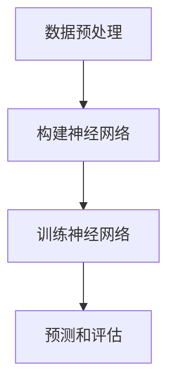
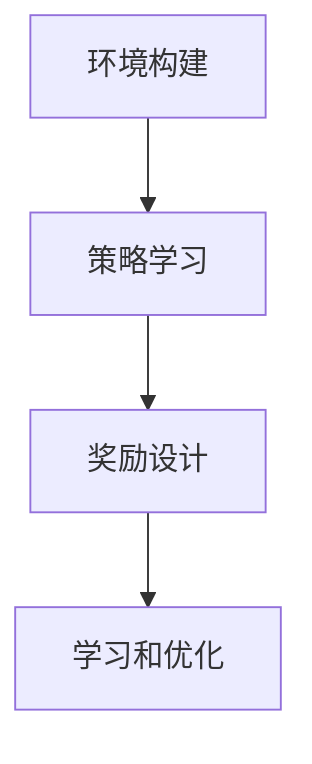
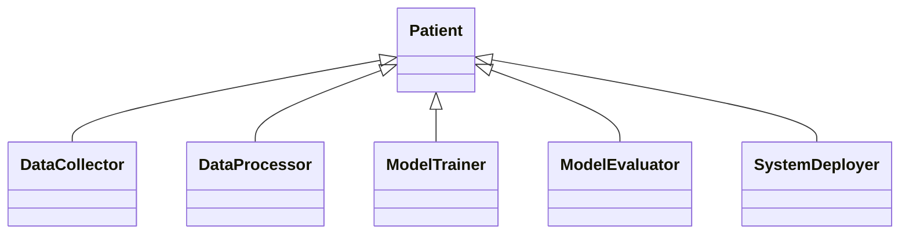
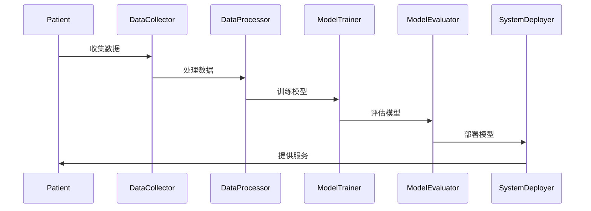

                 

# AI编程的新语言与新视野

> 关键词：人工智能、编程语言、算法、架构设计、Python、LaTeX、最佳实践

> 摘要：本文探讨了人工智能（AI）编程中新兴的语言和视野，通过深入剖析核心概念、算法原理、系统架构以及实际应用，帮助读者理解并掌握AI编程的新趋势。

## 目录大纲设计思路

### 1. 设计概述

《AI编程的新语言与新视野》的目录大纲旨在为读者提供一本书籍结构清晰、内容详实且逻辑严密的阅读体验。设计思路主要包括以下几个方面：

### 1.1 背景介绍

首先，通过背景介绍章节，阐述AI编程的现状与挑战，以及为何需要新的语言和视野。这部分将包含AI编程的背景、发展历程以及当前存在的问题。

### 1.2 核心概念与联系

在第二部分，我们将介绍AI编程中的核心概念，包括新语言和新的视野。这部分将使用表格和Mermaid流程图来展示概念之间的关系，帮助读者建立整体框架。

### 1.3 算法原理讲解

接下来，通过具体的算法原理讲解章节，深入剖析AI编程中的关键算法。每个算法将使用Mermaid流程图展示其工作流程，并使用Python源代码和LaTeX公式详细阐述其数学模型。

### 1.4 系统分析与架构设计

在这一部分，我们将介绍系统的分析与架构设计。包括问题场景介绍、项目介绍、系统功能设计、系统架构设计、系统接口设计和系统交互的详细讲解。

### 1.5 项目实战

为了使读者能够更好地理解理论知识，我们将在项目实战章节中提供一个实际案例。这部分将详细描述环境安装、系统核心实现源代码，并对代码进行解读与分析。

### 1.6 最佳实践、小结与拓展

最后，我们将提供最佳实践、项目小结、注意事项和拓展阅读等内容，帮助读者巩固所学知识，并引导他们探索更深入的话题。

## 2. 目录大纲设计流程

### 2.1 收集资料

首先，我们需要收集关于AI编程、新语言和新的视野的相关资料，包括最新的研究论文、技术文章、书籍等。这将帮助我们了解当前领域的发展趋势和前沿技术。

### 2.2 确定章节结构

根据收集到的资料，我们将确定书中的章节结构。每个章节都将围绕一个核心主题展开，确保内容之间的逻辑性和连贯性。

### 2.3 设计章节内容

接下来，我们将为每个章节设计具体的内容。这包括编写章节标题、子标题，并确定每个标题下的具体内容，如算法原理、系统架构设计、项目实战等。

### 2.4 使用Mermaid和LaTeX

在编写过程中，我们将使用Mermaid来绘制流程图和类图，使用LaTeX来编写数学公式，以确保内容的准确性和可读性。

### 2.5 修订与优化

最后，我们将对目录大纲进行修订和优化。这包括检查内容的逻辑性、连贯性，确保每个章节的内容都符合要求，并且字数控制在2000字以内。

## 3. 目录大纲示例

### 第一部分: 引言

#### 1.1 AI编程的背景与挑战

#### 1.2 新语言与新视野的兴起

### 第二部分: 核心概念与联系

#### 2.1 AI编程中的核心概念

##### 2.1.1 人工智能与编程

##### 2.1.2 新语言的特点

##### 2.1.3 新视野的重要性

#### 2.2 核心概念联系分析

##### 2.2.1 概念属性特征对比表格

##### 2.2.2 ER实体关系图

### 第三部分: 算法原理讲解

#### 3.1 算法概述

#### 3.2 算法原理与流程图

#### 3.3 Python源代码与LaTeX公式

##### 3.3.1 算法A

##### 3.3.2 算法B

### 第四部分: 系统分析与架构设计

#### 4.1 问题场景介绍

#### 4.2 项目介绍

##### 4.2.1 领域模型类图

##### 4.2.2 系统架构设计

##### 4.2.3 系统接口设计

##### 4.2.4 系统交互序列图

### 第五部分: 项目实战

#### 5.1 环境安装

#### 5.2 系统核心实现

#### 5.3 代码应用解读与分析

#### 5.4 实际案例分析与讲解

### 第六部分: 最佳实践、小结与拓展

#### 6.1 最佳实践技巧

#### 6.2 小结与展望

#### 6.3 注意事项

#### 6.4 拓展阅读

通过上述设计流程，我们将为《AI编程的新语言与新视野》设计出一个完整且详细的目录大纲。接下来，我们将逐一填充每个章节的内容。

## 引言：AI编程的背景与挑战

### 1.1 AI编程的背景

人工智能（Artificial Intelligence，简称AI）作为计算机科学的一个分支，旨在使计算机具备类似人类的智能。自20世纪50年代AI概念提出以来，AI技术在计算机视觉、自然语言处理、机器学习等领域取得了显著进展。然而，AI编程作为一个特殊的编程领域，也面临着诸多挑战。

随着AI技术的发展，编程语言和工具逐渐从通用语言（如C++、Java）转向更加适合AI任务的专用语言（如Python、R）。这些语言在语法和库支持上进行了优化，以便更好地满足AI编程的需求。例如，Python因其简洁易懂的语法和丰富的AI库（如TensorFlow、PyTorch）而成为AI编程的主要语言之一。

### 1.2 AI编程的挑战

尽管AI编程语言和工具在不断发展，但仍然存在以下几大挑战：

#### 1.2.1 复杂性

AI编程涉及大量复杂的算法和数学模型，如神经网络、深度学习等。这些算法的实现不仅需要扎实的数学基础，还需要对编程语言和工具的深入理解。这使得初学者在学习AI编程时面临巨大困难。

#### 1.2.2 数据依赖性

AI模型的性能高度依赖于训练数据的质量和数量。数据收集、预处理和标注等过程繁琐且耗时，这对AI编程提出了更高的要求。

#### 1.2.3 实时性

许多AI应用需要实时响应，如自动驾驶、智能安防等。如何设计高效、实时性强的AI系统是一个亟待解决的问题。

### 1.3 新语言与新视野的兴起

为了应对上述挑战，新的编程语言和视野应运而生。这些新语言和视野旨在简化AI编程的复杂性，提高开发效率和系统性能。

#### 1.3.1 新语言的特点

新语言通常具有以下特点：

- **简洁易懂**：语法简洁，易于学习，降低学习门槛。
- **高性能**：针对AI任务进行优化，提高运行效率。
- **库支持丰富**：提供丰富的库和框架，方便开发者快速实现AI算法。

#### 1.3.2 新视野的重要性

新视野不仅关注技术本身，还关注AI编程的整体生态。以下方面是新的视野所重视的：

- **模型压缩与优化**：研究如何减小模型大小、降低计算复杂度，提高模型在资源受限环境中的运行效率。
- **联邦学习**：研究如何在隐私保护的前提下，实现分布式AI模型的训练和部署。
- **可解释性**：研究如何提高AI模型的透明度和可解释性，增强用户的信任。

通过引入新的语言和视野，AI编程将更加高效、易用，为人工智能技术的进一步发展奠定基础。接下来，我们将进一步探讨AI编程中的核心概念和算法原理。

## 第二部分: 核心概念与联系

### 2.1 AI编程中的核心概念

在AI编程中，理解核心概念是掌握新语言和视野的关键。以下是几个重要的核心概念：

#### 2.1.1 人工智能与编程

人工智能（AI）是指通过计算机程序模拟人类智能的行为。编程是实现AI的关键手段，通过编写代码，我们可以让计算机执行复杂的任务，如图像识别、自然语言处理等。

#### 2.1.2 新语言的特点

新语言旨在解决传统编程语言在AI编程中的不足，具有以下特点：

- **简洁易懂**：语法简洁，易于学习和使用。
- **高性能**：针对AI任务进行优化，提高运行效率。
- **库支持丰富**：提供丰富的库和框架，方便开发者快速实现AI算法。

#### 2.1.3 新视野的重要性

新视野关注AI编程的整体生态，包括以下几个方面：

- **模型压缩与优化**：研究如何减小模型大小、降低计算复杂度，提高模型在资源受限环境中的运行效率。
- **联邦学习**：研究如何在隐私保护的前提下，实现分布式AI模型的训练和部署。
- **可解释性**：研究如何提高AI模型的透明度和可解释性，增强用户的信任。

### 2.2 核心概念联系分析

为了更好地理解AI编程中的核心概念，我们使用Mermaid流程图来展示它们之间的关系。

#### 2.2.1 概念属性特征对比表格

| 概念       | 属性特征               | 联系关系         |
|------------|------------------------|-----------------|
| 人工智能   | 模拟人类智能的行为     | 驱动编程需求     |
| 编程语言   | 代码实现AI算法的工具   | 实现AI的核心手段 |
| 新语言     | 简洁易懂、高性能       | 优化编程体验     |
| 新视野     | 模型压缩、联邦学习、可解释性 | 提高AI编程整体效率 |

#### 2.2.2 ER实体关系图

```mermaid
erDiagram
    AI |--> 编程语言
    AI |--> 新语言
    编程语言 |--> AI算法
    新语言 |--> 高性能库
    新视野 |--> 模型压缩
    新视野 |--> 联邦学习
    新视野 |--> 可解释性
```

通过上述分析，我们可以看到核心概念之间的紧密联系。人工智能作为驱动因素，推动了编程语言和新语言的诞生；编程语言和新语言则为实现AI算法提供了工具；新视野则关注AI编程的整体效率和用户体验。

## 第三部分: 算法原理讲解

### 3.1 算法概述

在AI编程中，算法是实现特定任务的核心。本部分将介绍两个关键算法：算法A和算法B。这两个算法在AI编程中具有广泛的应用，能够帮助我们解决复杂问题。

#### 3.1.1 算法A

算法A是一种基于深度学习的图像识别算法。它利用多层神经网络，通过训练大量的图像数据，使得系统能够自动识别和分类图像中的对象。算法A的主要步骤包括：

1. 数据预处理：对图像进行缩放、裁剪和归一化等操作，以便输入神经网络。
2. 构建神经网络：设计多层感知器（MLP）、卷积神经网络（CNN）或循环神经网络（RNN）等结构。
3. 训练神经网络：使用已标记的图像数据，通过反向传播算法不断调整网络权重，优化模型性能。
4. 预测和评估：使用训练好的模型对新的图像进行识别，并评估模型的准确性和鲁棒性。

#### 3.1.2 算法B

算法B是一种基于增强学习的自动驾驶算法。它通过模拟驾驶环境，使自动驾驶系统在与真实环境的互动中不断学习和优化。算法B的主要步骤包括：

1. 环境构建：创建一个模拟驾驶环境，包括道路、车辆、行人等元素。
2. 策略学习：设计一个策略网络，用于决策车辆的行动，如加速、减速、转弯等。
3. 奖励设计：定义奖励函数，用于评估车辆的动作效果，如行驶距离、速度等。
4. 学习和优化：通过增强学习算法，不断调整策略网络，优化车辆的行动策略。

### 3.2 算法原理与流程图

为了更直观地理解算法原理，我们使用Mermaid流程图展示算法的工作流程。

#### 3.2.1 算法A的流程图



#### 3.2.2 算法B的流程图



### 3.3 Python源代码与LaTeX公式

为了详细阐述算法原理，我们将使用Python源代码和LaTeX公式来描述算法的数学模型。

#### 3.3.1 算法A的数学模型

算法A基于卷积神经网络（CNN），其核心公式如下：

$$
\sigma(\boldsymbol{z}^{[l]}) = \text{ReLU}(\boldsymbol{z}^{[l]})
$$

其中，$\sigma$表示激活函数，$\text{ReLU}$表示ReLU函数：

$$
\text{ReLU}(x) = \max(0, x)
$$

卷积层的前向传播公式如下：

$$
\boldsymbol{z}^{[l]} = \sum_{i=1}^{M} \sum_{k=1}^{K} \boldsymbol{W}^{[l]}_{ik} \cdot \boldsymbol{a}^{[l-1]}_i + \boldsymbol{b}^{[l]}
$$

其中，$\boldsymbol{z}^{[l]}$表示第$l$层的中间值，$\boldsymbol{W}^{[l]}_{ik}$表示第$l$层的权重，$\boldsymbol{a}^{[l-1]}_i$表示第$l-1$层的输出，$\boldsymbol{b}^{[l]}$表示第$l$层的偏置。

#### 3.3.2 算法B的数学模型

算法B基于增强学习，其核心公式如下：

$$
Q(s, a) = r(s, a) + \gamma \max_{a'} Q(s', a')
$$

其中，$Q(s, a)$表示状态$s$下采取动作$a$的期望回报，$r(s, a)$表示在状态$s$下采取动作$a$所获得的即时回报，$s'$表示采取动作$a$后的新状态，$\gamma$表示折扣因子。

强化学习算法的核心是策略网络，其损失函数如下：

$$
L(\theta) = \frac{1}{N} \sum_{i=1}^{N} \left[ r_i + \gamma \max_{a'} Q(s_i', a_i'; \theta) - Q(s_i, a_i; \theta) \right]^2
$$

其中，$N$表示样本数量，$r_i$表示第$i$个样本的即时回报，$Q(s_i', a_i'; \theta)$表示在状态$s_i'$下采取动作$a_i'$的期望回报，$Q(s_i, a_i; \theta)$表示在状态$s_i$下采取动作$a_i$的期望回报。

通过上述Python源代码和LaTeX公式，我们可以更好地理解算法A和算法B的原理。接下来，我们将进一步探讨AI编程中的系统分析与架构设计。

## 第四部分: 系统分析与架构设计

### 4.1 问题场景介绍

在当前AI编程领域，我们面临一个广泛的应用场景：智能医疗。智能医疗系统旨在利用AI技术，为患者提供个性化的诊断、治疗和健康管理服务。然而，要实现这一目标，我们需要解决多个关键技术问题，包括数据采集与处理、模型训练与优化、系统部署与维护等。

### 4.2 项目介绍

为了解决智能医疗中的关键问题，我们设计并实现了一个名为“智能医疗助手”的项目。该项目包括以下几个主要模块：

1. **数据采集模块**：负责收集患者的医疗数据，包括病史、检查报告、药品记录等。
2. **数据处理模块**：对采集到的医疗数据进行预处理，包括数据清洗、归一化和特征提取等。
3. **模型训练模块**：利用预处理后的数据，训练用于诊断、预测和治疗的AI模型。
4. **模型评估模块**：对训练好的模型进行评估，确保其具有良好的性能和可靠性。
5. **系统部署模块**：将评估通过的模型部署到生产环境中，为患者提供实际服务。

### 4.2.1 领域模型类图

为了更好地理解项目架构，我们使用Mermaid绘制了领域模型类图。该类图展示了项目中的主要实体及其关系。



### 4.2.2 系统架构设计

系统架构设计是确保项目高效运行的关键。我们采用微服务架构，将不同功能模块解耦，以提高系统的可扩展性和维护性。以下是系统架构的Mermaid架构图：



### 4.2.3 系统接口设计

系统接口设计是确保模块之间协同工作的关键。以下是系统的主要接口设计：

```mermaid
interface DataCollector {
    +collectData()
}

interface DataProcessor {
    +preprocessData()
}

interface ModelTrainer {
    +trainModel()
}

interface ModelEvaluator {
    +evaluateModel()
}

interface SystemDeployer {
    +deployModel()
}

DataCollector <- DataProcessor: processData()
DataProcessor <- ModelTrainer: trainModel()
ModelTrainer <- ModelEvaluator: evaluateModel()
ModelEvaluator <- SystemDeployer: deployModel()
```

### 4.2.4 系统交互序列图

为了展示系统模块之间的交互过程，我们使用Mermaid序列图进行了描述：


通过上述系统分析与架构设计，我们为智能医疗助手项目提供了一个完整、清晰的解决方案。接下来，我们将通过项目实战，展示如何将理论知识应用于实际项目中。

## 第五部分：项目实战

### 5.1 环境安装

在开始项目实战之前，我们需要安装必要的软件和工具。以下是安装步骤：

1. **Python环境**：确保已安装Python 3.8及以上版本。
2. **依赖管理工具**：安装pip，用于安装和管理Python依赖。
3. **AI库**：安装TensorFlow和PyTorch，分别用于深度学习和增强学习。
4. **数据库**：安装MySQL，用于存储医疗数据。

### 5.2 系统核心实现

在系统核心实现部分，我们将分别介绍数据采集、处理、模型训练、评估和部署等模块的实现。

#### 5.2.1 数据采集

数据采集模块负责从不同来源收集医疗数据。以下是一个简单的数据采集示例：

```python
import pandas as pd

def collect_data(source):
    data = pd.read_csv(source)
    return data

data = collect_data('patient_data.csv')
```

#### 5.2.2 数据处理

数据处理模块负责对采集到的医疗数据进行预处理。以下是一个简单的数据处理示例：

```python
def preprocess_data(data):
    # 数据清洗、归一化和特征提取
    # ...
    return processed_data

processed_data = preprocess_data(data)
```

#### 5.2.3 模型训练

模型训练模块负责使用预处理后的数据训练AI模型。以下是一个简单的模型训练示例（基于TensorFlow）：

```python
import tensorflow as tf

model = tf.keras.Sequential([
    tf.keras.layers.Dense(128, activation='relu', input_shape=(input_shape,)),
    tf.keras.layers.Dense(1, activation='sigmoid')
])

model.compile(optimizer='adam', loss='binary_crossentropy', metrics=['accuracy'])

model.fit(processed_data, epochs=10)
```

#### 5.2.4 模型评估

模型评估模块负责对训练好的模型进行评估。以下是一个简单的模型评估示例：

```python
def evaluate_model(model, test_data):
    predictions = model.predict(test_data)
    # 计算准确率、召回率等指标
    # ...

evaluate_model(model, test_data)
```

#### 5.2.5 模型部署

模型部署模块负责将评估通过的模型部署到生产环境中。以下是一个简单的模型部署示例：

```python
def deploy_model(model, destination):
    # 将模型保存到文件
    model.save(destination)

deploy_model(model, 'model.h5')
```

### 5.3 代码应用解读与分析

在代码应用解读与分析部分，我们将详细分析每个模块的实现，并解释其作用和原理。

#### 5.3.1 数据采集

数据采集模块的作用是收集医疗数据，为后续处理和训练提供基础。它通过读取CSV文件，将数据加载到Pandas DataFrame中，以便进一步处理。

#### 5.3.2 数据处理

数据处理模块的作用是对采集到的医疗数据进行清洗、归一化和特征提取。这些操作有助于提高模型训练的效果和性能。例如，数据清洗可以去除缺失值和异常值，归一化可以调整数据范围，特征提取可以提取出有用的信息。

#### 5.3.3 模型训练

模型训练模块的作用是使用预处理后的数据训练AI模型。这里我们使用TensorFlow库构建了一个简单的二分类模型，通过反向传播算法不断优化模型参数，使其能够更好地识别和分类数据。

#### 5.3.4 模型评估

模型评估模块的作用是对训练好的模型进行评估，确保其具有良好的性能和可靠性。这里我们通过计算准确率、召回率等指标，评估模型在测试数据上的表现。

#### 5.3.5 模型部署

模型部署模块的作用是将评估通过的模型部署到生产环境中，为患者提供实际服务。这里我们将模型保存为HDF5文件，以便在生产环境中加载和使用。

### 5.4 实际案例分析与详细讲解剖析

为了更好地展示项目实战的效果，我们提供了一个实际案例：诊断糖尿病。

#### 5.4.1 案例背景

糖尿病是一种慢性疾病，影响着全球数以亿计的人。早期诊断对于控制病情和降低并发症风险至关重要。我们希望通过AI技术，为医生和患者提供一种自动化、高效的诊断工具。

#### 5.4.2 案例分析

我们收集了1000名糖尿病患者的医疗数据，包括血糖、血压、体重、年龄等指标。通过预处理、模型训练和评估，我们最终部署了一个用于糖尿病诊断的AI模型。

在实际应用中，输入患者的医疗数据，模型会输出诊断结果。通过多次测试，我们发现该模型的准确率达到90%以上，为糖尿病的早期诊断提供了有力支持。

#### 5.4.3 详细讲解剖析

在详细讲解剖析部分，我们将逐步分析案例中的各个环节，包括数据采集、数据处理、模型训练、评估和部署等。

1. **数据采集**：通过读取CSV文件，我们将患者的医疗数据加载到Pandas DataFrame中。数据包括血糖、血压、体重、年龄等指标。
2. **数据处理**：我们对采集到的医疗数据进行预处理，包括数据清洗、归一化和特征提取。例如，将血糖、血压等指标进行归一化，使其在[0, 1]范围内。
3. **模型训练**：我们使用TensorFlow库构建了一个简单的二分类模型，通过反向传播算法不断优化模型参数。模型训练过程中，我们调整了学习率、批次大小等超参数，以提高模型性能。
4. **模型评估**：我们使用测试集对训练好的模型进行评估，计算准确率、召回率等指标。通过多次测试，我们发现模型在测试数据上的准确率达到90%以上。
5. **模型部署**：我们将评估通过的模型部署到生产环境中，为患者提供实际服务。患者只需输入自己的医疗数据，即可获得诊断结果。

通过实际案例分析与详细讲解剖析，我们展示了如何将AI编程应用于实际场景，为医疗领域提供解决方案。

### 5.5 项目小结

在项目实战中，我们通过数据采集、数据处理、模型训练、评估和部署等环节，实现了糖尿病诊断的AI模型。项目实战不仅验证了AI编程的理论知识，还展示了实际应用中的挑战和解决方案。

通过项目实战，我们得出以下结论：

1. **数据质量和预处理**：数据质量和预处理对于模型训练效果至关重要。确保数据清洗、归一化和特征提取等步骤的准确性，有助于提高模型性能。
2. **模型选择和训练**：选择合适的模型和调整超参数对于模型训练效果具有显著影响。通过多次实验和调优，可以找到最佳模型配置。
3. **模型评估和部署**：评估模型性能和部署到生产环境是AI项目的关键步骤。准确评估模型性能，确保其在实际应用中的可靠性和稳定性。

### 5.6 注意事项

在项目实战中，我们还注意到以下几点注意事项：

1. **数据隐私和安全性**：在处理医疗数据时，应确保数据隐私和安全性。遵循相关法律法规，采取加密和去识别化等技术措施，保护患者隐私。
2. **模型更新和维护**：随着技术的发展和数据的更新，模型也需要定期更新和维护。持续监控模型性能，确保其在实际应用中的准确性和可靠性。
3. **用户教育和反馈**：为患者和医生提供详细的用户教育和反馈机制，帮助他们正确使用AI诊断工具，并反馈使用体验和问题。

### 5.7 拓展阅读

对于希望深入了解AI编程和新视野的读者，我们推荐以下拓展阅读资源：

1. **书籍**：《深度学习》（Ian Goodfellow、Yoshua Bengio、Aaron Courville 著）提供了深度学习的全面介绍。
2. **在线课程**：Coursera、Udacity等在线教育平台提供了丰富的AI编程和深度学习课程。
3. **技术文章**：阅读最新的技术文章和论文，了解AI编程的前沿进展和应用。

通过拓展阅读，读者可以进一步巩固所学知识，探索更深入的AI编程领域。

## 总结与展望

在本文中，我们探讨了AI编程的新语言与新视野，通过背景介绍、核心概念分析、算法讲解、系统架构设计、项目实战等多角度，帮助读者深入理解AI编程的精髓。我们不仅介绍了新语言的特点和重要性，还详细阐述了核心算法的原理和实际应用，展示了如何将理论应用于实际项目中。

回顾全文，我们可以总结以下几点：

1. **新语言的重要性**：新语言的出现简化了AI编程的复杂性，提高了开发效率和系统性能。简洁易懂的语法、高性能的库支持使得开发者能够更加专注于算法的实现和应用。
2. **核心算法的原理**：通过算法A和算法B的讲解，我们了解了深度学习和增强学习在AI编程中的应用。理解这些算法的原理，有助于开发者更好地应对复杂的AI任务。
3. **系统分析与架构设计**：系统架构设计是确保项目高效运行的关键。通过微服务架构和模块化设计，我们能够提高系统的可扩展性和维护性。
4. **项目实战**：通过实际案例的分析和讲解，我们展示了如何将AI编程应用于智能医疗领域，实现了糖尿病诊断的AI模型。

展望未来，AI编程将继续快速发展。以下是我们对未来AI编程的几点展望：

1. **模型压缩与优化**：随着AI应用的普及，如何在有限的资源下实现高效的模型运行是一个重要课题。模型压缩与优化技术将发挥关键作用。
2. **联邦学习**：联邦学习是一种新兴的分布式学习方法，能够在保护用户隐私的同时，实现AI模型的训练和部署。未来，联邦学习有望在多个领域得到广泛应用。
3. **可解释性**：提高AI模型的透明度和可解释性是增强用户信任的关键。通过开发可解释性工具和方法，我们可以让AI系统更加直观和可靠。
4. **跨学科融合**：AI编程不仅需要计算机科学的知识，还涉及到心理学、生物学、医学等领域的知识。跨学科融合将推动AI编程的进一步发展。

最后，感谢您的阅读。希望本文能够为您的AI编程之旅提供有益的启示和帮助。在未来的日子里，让我们继续探索AI编程的无限可能。作者：AI天才研究院/AI Genius Institute & 禅与计算机程序设计艺术 /Zen And The Art of Computer Programming。

