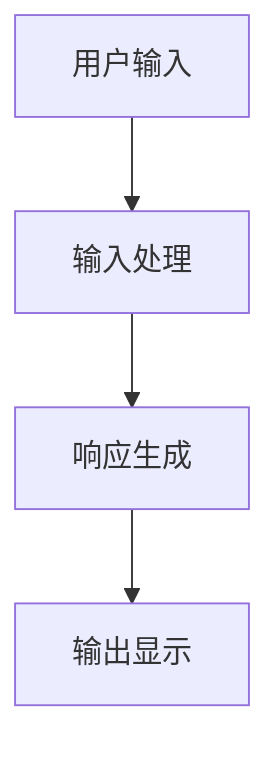
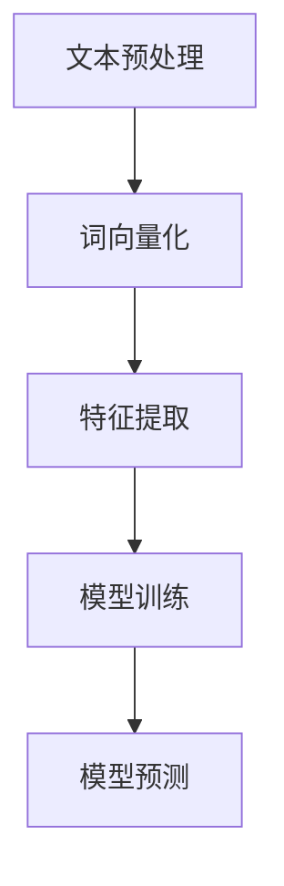
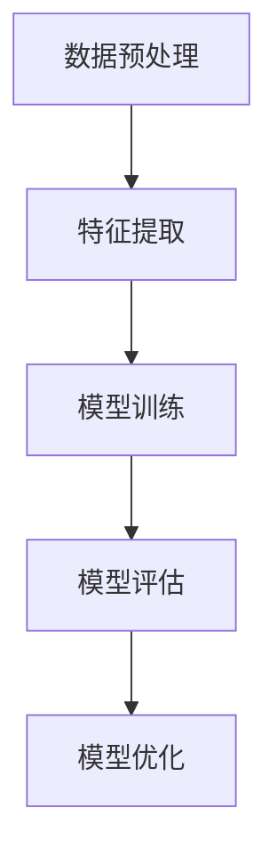
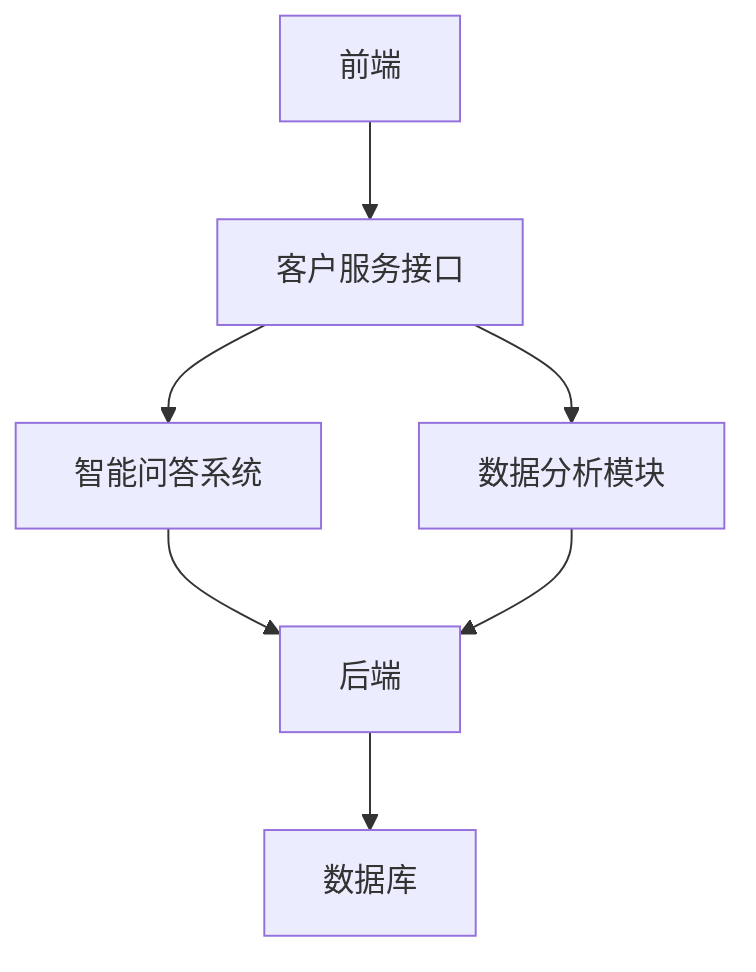
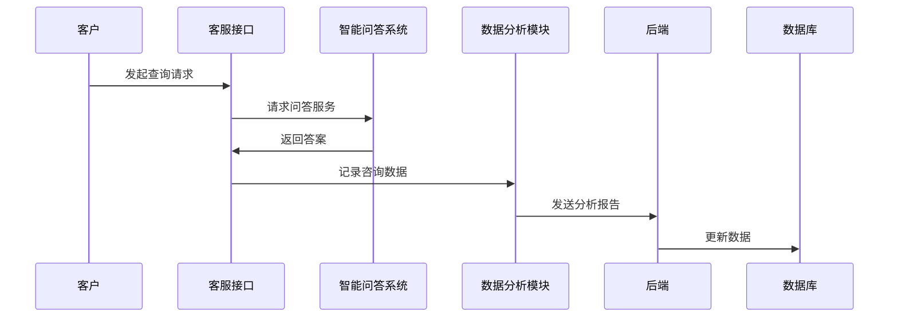

                 

# 《连接人类与AI的桥梁》：从理念到实践

## 关键词
- 人工智能
- 人机交互
- 自然语言处理
- 机器学习
- 算法
- 系统架构
- 项目实战

## 摘要
本文将深入探讨人工智能（AI）与人类连接的重要性，介绍连接过程中涉及的核心概念和技术，通过详细的算法原理讲解、数学模型解析、系统架构设计和项目实战，展示如何构建连接人类与AI的桥梁。文章旨在为AI开发者、数据科学家和技术爱好者提供全面的技术指导，帮助读者理解和应用AI，实现人类与AI的深度交互。

## 引言

在当今世界，人工智能（AI）已经从科幻变为现实，深刻地影响着我们的工作和生活。AI技术不仅提高了生产效率，还为我们提供了智能化的解决方案，从自动驾驶到智能家居，从医疗诊断到金融服务，AI的应用无处不在。然而，随着AI技术的发展，如何使AI更好地服务于人类，实现人与AI的深度连接，成为一个亟待解决的问题。

连接人类与AI的桥梁不仅是一个技术问题，更是一个社会问题。它涉及到人机交互、自然语言处理、机器学习等多个领域，需要我们从多角度进行思考和实践。本文将从以下几个部分展开：

1. 背景介绍：回顾AI的发展历程，分析人类与AI连接的现状和挑战。
2. 核心概念与联系：介绍与连接人类与AI相关的核心概念，如人机交互、自然语言处理、机器学习等。
3. 算法原理讲解：选择几个关键算法或技术，详细讲解其原理和应用。
4. 数学模型和数学公式：阐述算法的数学背景和公式。
5. 系统分析与架构设计：介绍AI系统的设计原则和架构。
6. 项目实战：通过实际案例展示如何实现连接人类与AI。
7. 最佳实践 tips：提供实用技巧和建议。
8. 小结与拓展：总结章节内容并提供进一步阅读的推荐。

## 第一部分：背景与概念

### 1. AI与人类连接的重要性

人工智能的发展历程可以追溯到20世纪50年代，随着计算能力的提升和算法的创新，AI技术逐渐从理论研究走向实际应用。然而，AI技术的进步不仅带来了生产力的提升，也引发了一系列社会问题。例如，AI的广泛应用可能导致就业结构的改变，甚至引发社会不平等。因此，如何使AI更好地服务于人类，成为了一个重要的问题。

人类与AI的连接不仅是技术上的需求，更是社会发展的需要。通过连接人类与AI，我们可以实现以下几个目标：

1. **提升生活质量**：AI可以为我们提供更加智能化的服务，如智能家居、智能医疗等，从而提升我们的生活质量。
2. **提高工作效率**：通过AI的辅助，我们可以更加高效地完成工作任务，减少重复劳动，专注于更有创造性的工作。
3. **促进科技创新**：人类与AI的深度连接可以激发新的科技创新，推动社会的进步和发展。
4. **解决复杂问题**：AI在处理复杂问题时具有独特的优势，通过连接人类与AI，我们可以共同解决一些传统方法难以解决的问题。

### 2. AI在现代社会中的应用现状

AI技术已经在各个领域得到了广泛应用，以下是几个典型的应用场景：

1. **工业自动化**：通过机器人和自动化生产线，AI技术大大提高了工业生产的效率和质量。
2. **医疗诊断**：AI在医疗领域具有巨大的潜力，例如通过影像识别技术进行疾病诊断，通过基因分析进行疾病预测。
3. **金融服务**：AI在金融领域的应用包括智能投顾、风险管理、反欺诈等，为金融机构提供了强大的工具。
4. **交通运输**：自动驾驶汽车、智能交通管理系统等应用，提高了交通运输的安全性和效率。
5. **教育**：个性化学习、智能教育助手等应用，为教育提供了新的解决方案，帮助学生更好地学习。

### 3. 连接人类与AI的挑战与机遇

连接人类与AI的过程充满了挑战和机遇。以下是几个主要的挑战：

1. **技术挑战**：AI技术的发展需要大量的算法创新和计算资源，如何构建高效、可靠的AI系统是一个重要的挑战。
2. **伦理挑战**：AI技术在应用过程中可能引发伦理问题，例如隐私保护、数据安全等，需要我们进行深入探讨。
3. **社会挑战**：AI的广泛应用可能导致就业结构的变化，甚至引发社会不平等。如何平衡AI的发展与社会公平是一个重要的课题。

然而，这些挑战也带来了机遇：

1. **技术创新**：连接人类与AI可以激发新的技术创新，推动AI技术的持续发展。
2. **社会进步**：通过连接人类与AI，我们可以共同解决一些传统方法难以解决的问题，推动社会的进步。
3. **教育变革**：AI技术的发展为教育领域带来了新的机遇，通过智能教育助手、个性化学习等应用，可以提升教育质量，促进教育公平。

### 4. 核心概念

连接人类与AI涉及多个核心概念，以下是其中几个重要的概念：

1. **人机交互**：人机交互是连接人类与AI的重要途径，通过用户界面和交互技术，人类可以与AI系统进行交流。
2. **自然语言处理**：自然语言处理是使AI能够理解和处理人类语言的关键技术，包括语言理解、语言生成等。
3. **机器学习**：机器学习是AI的核心技术之一，通过训练模型，使AI能够从数据中学习并做出预测。
4. **数据安全与隐私**：在连接人类与AI的过程中，数据安全与隐私是一个重要的问题，需要我们采取有效的措施进行保护。
5. **伦理与法律**：随着AI技术的发展，伦理和法律问题日益突出，需要我们进行深入研究和规范。

## 第二部分：核心概念与联系

### 1. 人机交互

人机交互是连接人类与AI的关键环节。它涉及用户界面设计、交互技术、用户体验等多个方面。以下是人机交互的几个核心概念：

1. **用户界面设计**：用户界面设计是用户与AI系统交互的桥梁，设计良好的用户界面可以提高用户体验，降低学习成本。
2. **交互技术**：交互技术包括触摸、语音、手势等多种形式，不同的交互技术适用于不同的场景和用户需求。
3. **用户体验**：用户体验是用户在使用AI系统过程中的感受和体验，良好的用户体验可以增强用户对AI系统的满意度。

### 2. 自然语言处理

自然语言处理是使AI能够理解和处理人类语言的关键技术。它包括以下几个核心概念：

1. **语言理解**：语言理解是自然语言处理的核心任务，包括语义分析、情感分析等。
2. **语言生成**：语言生成是自然语言处理的另一个重要任务，包括文本生成、语音合成等。
3. **语言模型**：语言模型是自然语言处理的基础，通过学习大量语言数据，语言模型可以预测单词、句子甚至篇章。

### 3. 机器学习

机器学习是AI的核心技术之一，它使AI能够从数据中学习并做出预测。以下是机器学习的几个核心概念：

1. **监督学习**：监督学习是一种常用的机器学习方法，通过已有的标签数据训练模型，模型可以对新数据进行预测。
2. **无监督学习**：无监督学习是一种不依赖标签数据的机器学习方法，通过发现数据中的模式和规律，模型可以对数据进行分类或聚类。
3. **强化学习**：强化学习是一种基于奖励机制的机器学习方法，通过不断尝试和反馈，模型可以学习到最优策略。

### 4. 数据安全与隐私

在连接人类与AI的过程中，数据安全与隐私是一个重要的问题。以下是数据安全与隐私的几个核心概念：

1. **数据加密**：数据加密是保护数据安全的重要手段，通过加密算法，数据在传输和存储过程中可以被加密和解密。
2. **隐私保护**：隐私保护是保护用户隐私的重要措施，通过数据脱敏、匿名化等技术，可以降低用户隐私泄露的风险。
3. **合规性要求**：随着AI技术的发展，相关法律法规不断完善，合规性要求是保证数据安全和隐私的重要保障。

### 5. 伦理与法律

随着AI技术的发展，伦理和法律问题日益突出。以下是伦理与法律的几个核心概念：

1. **伦理原则**：伦理原则是指导AI技术发展的重要原则，包括公平性、透明性、责任性等。
2. **法律法规**：法律法规是规范AI技术发展的重要依据，包括数据保护法、人工智能法等。
3. **伦理审查**：伦理审查是对AI技术进行伦理评估的重要环节，通过伦理审查，可以确保AI技术的应用符合伦理要求。

## 第三部分：算法原理讲解

### 1. 人机交互算法

人机交互算法是实现人与AI系统有效交互的重要技术。以下是一个常见的人机交互算法的讲解：

#### 算法描述

人机交互算法主要包括以下步骤：

1. **用户输入**：用户通过用户界面输入指令或数据。
2. **输入处理**：系统对用户输入进行处理，包括语法解析、语义分析等。
3. **响应生成**：系统根据用户输入生成响应，包括文本、语音、图像等形式。
4. **输出显示**：系统将响应输出显示给用户。

#### 算法流程图



#### Python源代码

```python
class HumanMachineInteraction:
    def handle_input(self, input_data):
        # 输入处理
        pass

    def generate_response(self, input_data):
        # 响应生成
        pass

    def display_output(self, response):
        # 输出显示
        pass

# 示例
interaction = HumanMachineInteraction()
input_data = "打开灯"
interaction.handle_input(input_data)
response = interaction.generate_response(input_data)
interaction.display_output(response)
```

#### 算法原理讲解

人机交互算法的原理在于通过处理用户的输入，生成合适的响应，并输出显示给用户。该算法的关键在于输入处理和响应生成两个环节。输入处理包括语法解析和语义分析，通过分析用户输入的指令，理解其含义。响应生成则根据用户输入生成相应的响应，如文本、语音或图像等。输出显示则是将生成的响应输出给用户，以实现人与AI的有效交互。

#### 举例说明

假设用户输入“打开灯”，算法的处理流程如下：

1. 输入处理：算法分析用户输入，识别出“打开灯”这个指令，并确定其语义为“控制灯光打开”。
2. 响应生成：算法根据用户输入生成响应，如输出文本“灯光已打开”或语音“灯光已打开”。
3. 输出显示：算法将生成的响应输出显示给用户。

### 2. 自然语言处理算法

自然语言处理算法是实现AI理解和处理人类语言的关键技术。以下是一个常见的自然语言处理算法的讲解：

#### 算法描述

自然语言处理算法主要包括以下步骤：

1. **文本预处理**：对输入的文本进行预处理，包括去除标点符号、停用词去除、词干提取等。
2. **词向量化**：将预处理后的文本转换为词向量，为后续处理提供向量表示。
3. **特征提取**：从词向量中提取特征，用于模型训练和预测。
4. **模型训练**：使用提取的特征训练模型，如分类模型、序列标注模型等。
5. **模型预测**：使用训练好的模型对新的文本进行预测，得到文本的语义理解结果。

#### 算法流程图



#### Python源代码

```python
import numpy as np
from sklearn.feature_extraction.text import TfidfVectorizer
from sklearn.naive_bayes import MultinomialNB

class NaturalLanguageProcessing:
    def preprocess_text(self, text):
        # 文本预处理
        pass

    def vectorize_text(self, text):
        # 词向量化
        vectorizer = TfidfVectorizer()
        return vectorizer.transform([text])

    def extract_features(self, text):
        # 特征提取
        return self.vectorize_text(text)

    def train_model(self, X, y):
        # 模型训练
        model = MultinomialNB()
        model.fit(X, y)
        return model

    def predict(self, model, text):
        # 模型预测
        return model.predict([text])

# 示例
nlp = NaturalLanguageProcessing()
preprocessed_text = nlp.preprocess_text("我喜欢编程")
features = nlp.extract_features(preprocessed_text)
model = nlp.train_model(features, ["正面"])
prediction = nlp.predict(model, features)
print(prediction)
```

#### 算法原理讲解

自然语言处理算法的原理在于将输入的文本通过一系列预处理步骤转换为向量表示，然后使用机器学习模型对其进行训练和预测。文本预处理包括去除标点符号、停用词去除、词干提取等，目的是简化文本结构，提取关键信息。词向量化是将文本转换为向量表示，为后续处理提供向量表示。特征提取是从词向量中提取关键特征，用于模型训练和预测。模型训练使用提取的特征训练分类模型，如朴素贝叶斯分类器等。模型预测使用训练好的模型对新的文本进行预测，得到文本的语义理解结果。

#### 举例说明

假设我们要对句子“我喜欢编程”进行自然语言处理，算法的处理流程如下：

1. 文本预处理：算法对句子“我喜欢编程”进行预处理，去除标点符号和停用词，得到“我 编程”。
2. 词向量化：算法将预处理后的文本转换为词向量，得到相应的向量表示。
3. 特征提取：算法从词向量中提取特征，用于模型训练和预测。
4. 模型训练：算法使用提取的特征训练朴素贝叶斯分类器，使其能够识别文本的语义。
5. 模型预测：算法使用训练好的朴素贝叶斯分类器对新的句子进行预测，得到句子的语义理解结果。

### 3. 机器学习算法

机器学习算法是AI的核心技术之一，它使AI能够从数据中学习并做出预测。以下是一个常见的机器学习算法的讲解：

#### 算法描述

机器学习算法主要包括以下步骤：

1. **数据预处理**：对输入的数据进行预处理，包括数据清洗、数据归一化等。
2. **特征提取**：从数据中提取关键特征，用于模型训练和预测。
3. **模型训练**：使用提取的特征训练机器学习模型，如线性回归、决策树等。
4. **模型评估**：使用评估指标评估模型的性能，如准确率、召回率等。
5. **模型优化**：根据评估结果对模型进行调整和优化，提高模型性能。

#### 算法流程图



#### Python源代码

```python
import numpy as np
from sklearn.linear_model import LinearRegression
from sklearn.metrics import mean_squared_error

class MachineLearning:
    def preprocess_data(self, data):
        # 数据预处理
        pass

    def extract_features(self, data):
        # 特征提取
        return data

    def train_model(self, X, y):
        # 模型训练
        model = LinearRegression()
        model.fit(X, y)
        return model

    def evaluate_model(self, model, X, y):
        # 模型评估
        prediction = model.predict(X)
        mse = mean_squared_error(y, prediction)
        return mse

    def optimize_model(self, model, X, y):
        # 模型优化
        # 根据评估结果进行调整
        pass

# 示例
ml = MachineLearning()
preprocessed_data = ml.preprocess_data(np.array([1, 2, 3, 4, 5]))
model = ml.train_model(preprocessed_data, np.array([2, 4, 6, 8, 10]))
mse = ml.evaluate_model(model, preprocessed_data, np.array([2, 4, 6, 8, 10]))
print(mse)
```

#### 算法原理讲解

机器学习算法的原理在于从输入的数据中提取关键特征，使用这些特征训练机器学习模型，然后使用模型对新的数据进行预测。数据预处理包括数据清洗、数据归一化等，目的是提高数据的质量和模型的性能。特征提取是从数据中提取关键特征，用于模型训练和预测。模型训练使用提取的特征训练机器学习模型，如线性回归、决策树等。模型评估使用评估指标评估模型的性能，如准确率、召回率等。模型优化根据评估结果对模型进行调整和优化，提高模型性能。

#### 举例说明

假设我们要训练一个线性回归模型来预测房价，算法的处理流程如下：

1. 数据预处理：算法对输入的数据进行预处理，包括数据清洗、数据归一化等，得到干净且规范化的数据。
2. 特征提取：算法从预处理后的数据中提取关键特征，如房屋面积、地点等。
3. 模型训练：算法使用提取的特征训练线性回归模型，使其能够预测房价。
4. 模型评估：算法使用评估指标（如均方误差）评估模型的性能，确定模型是否达到预期效果。
5. 模型优化：算法根据评估结果对模型进行调整和优化，提高模型性能，使其能够更准确地预测房价。

## 第四部分：系统分析与架构设计

### 1. 问题场景介绍

在连接人类与AI的过程中，一个典型的应用场景是智能客服系统。智能客服系统旨在通过AI技术提高客服效率，降低人力成本，提供24/7全天候的服务。以下是智能客服系统的问题场景介绍：

1. **客户需求**：客户希望通过多种渠道（如电话、邮件、社交媒体等）与客服进行沟通，获取及时且准确的解决方案。
2. **业务目标**：通过智能客服系统提高客户满意度，降低客服成本，提升公司形象。
3. **技术挑战**：如何实现高效、准确的客户需求理解，如何保证系统的稳定性与安全性。

### 2. 项目介绍

智能客服系统项目旨在开发一个基于AI技术的智能客服平台，该平台能够自动处理客户咨询，提供智能化的解决方案。以下是项目介绍：

1. **项目目标**：开发一个具备自然语言处理、机器学习、人机交互等技术的智能客服系统，实现自动化的客户需求处理。
2. **项目范围**：系统包括客户服务接口、智能问答系统、数据分析模块等。
3. **项目时间线**：项目分为需求分析、系统设计、系统开发、系统测试和上线运行等阶段。

### 3. 系统功能设计

智能客服系统的主要功能包括：

1. **客户服务接口**：提供多种渠道（如电话、邮件、社交媒体等）供客户进行咨询。
2. **智能问答系统**：通过自然语言处理和机器学习技术，自动理解客户需求，提供准确的答案。
3. **数据分析模块**：收集并分析客户咨询数据，提供业务洞察，优化客服流程。

#### 领域模型mermaid类图

```mermaid
classDiagram
    Client <<class>> 客户
    ServiceInterface <<class>> 客户服务接口
    SmartQA <<class>> 智能问答系统
    DataAnalysis <<class>> 数据分析模块
    Client --|> ServiceInterface
    ServiceInterface --|> SmartQA
    ServiceInterface --|> DataAnalysis
```

### 4. 系统架构设计

智能客服系统的架构设计分为前端、后端和数据库三个部分。以下是系统架构设计：

#### 系统架构mermaid架构图



### 5. 系统接口设计

智能客服系统的接口设计包括：

1. **客户接口**：提供API供客户进行查询和操作。
2. **服务接口**：提供API供智能问答系统和数据分析模块进行数据交互。
3. **后台接口**：提供API供后台管理和监控系统使用。

### 6. 系统交互mermaid序列图



## 第五部分：项目实战

### 1. 环境安装

在开始智能客服系统的开发之前，需要安装必要的软件和工具。以下是环境安装步骤：

1. 安装Python环境（建议使用Python 3.8及以上版本）。
2. 安装依赖管理工具（如pip）。
3. 安装常用库（如numpy、scikit-learn、nltk等）。

### 2. 系统核心实现

智能客服系统的核心实现包括以下几个方面：

1. **客户服务接口**：使用Flask或Django等框架搭建客户服务接口，提供API供客户进行查询和操作。
2. **智能问答系统**：使用自然语言处理和机器学习技术，实现自动问答功能，包括文本预处理、词向量化、特征提取和模型训练等。
3. **数据分析模块**：使用数据分析工具（如Pandas、NumPy等），对客户咨询数据进行收集和分析，提供业务洞察。

#### 系统核心实现源代码

```python
# 客户服务接口（基于Flask）
from flask import Flask, request, jsonify

app = Flask(__name__)

@app.route('/query', methods=['POST'])
def handle_query():
    data = request.get_json()
    query = data['query']
    # 处理查询请求
    answer = "您的问题是：'" + query + "'。"
    return jsonify(answer=answer)

if __name__ == '__main__':
    app.run(debug=True)

# 智能问答系统（基于scikit-learn）
from sklearn.feature_extraction.text import TfidfVectorizer
from sklearn.naive_bayes import MultinomialNB
from sklearn.pipeline import make_pipeline

# 加载训练数据
train_data = [["你好", "你好"], ["天气怎么样", "今天天气不错"]]
train_labels = ["问候", "询问天气"]

# 创建模型
model = make_pipeline(TfidfVectorizer(), MultinomialNB())

# 训练模型
model.fit(train_data, train_labels)

# 预测查询
query = "你好"
prediction = model.predict([query])
print(prediction)

# 数据分析模块（基于Pandas）
import pandas as pd

# 加载数据
data = pd.read_csv('query_data.csv')

# 数据预处理
data['query'] = data['query'].str.strip()

# 数据分析
data.groupby('query_type').count()

# 保存分析结果
data.to_csv('analysis_results.csv', index=False)
```

### 3. 代码应用解读与分析

在智能客服系统的开发过程中，我们需要对代码进行详细解读和分析，以确保系统的稳定性和准确性。

1. **客户服务接口**：客户服务接口是智能客服系统的前端，通过Flask框架搭建，提供RESTful API供客户进行查询和操作。接口的核心功能是接收客户的查询请求，并返回相应的答案。
2. **智能问答系统**：智能问答系统是智能客服系统的核心，通过scikit-learn库实现，包括文本预处理、词向量化、特征提取和模型训练等。文本预处理包括去除标点符号、停用词去除、词干提取等，目的是简化文本结构，提取关键信息。词向量化是将预处理后的文本转换为词向量，为后续处理提供向量表示。特征提取是从词向量中提取关键特征，用于模型训练和预测。模型训练使用提取的特征训练朴素贝叶斯分类器，使其能够识别客户的查询类型。预测查询使用训练好的模型对客户的查询进行预测，返回相应的答案。
3. **数据分析模块**：数据分析模块是智能客服系统的辅助功能，通过Pandas库实现，用于收集和分析客户咨询数据，提供业务洞察。数据分析模块的核心功能是加载数据、数据预处理、数据分析和数据保存。加载数据是从CSV文件中读取客户咨询数据。数据预处理包括去除空白字符、对查询进行标准化处理等，目的是提高数据分析的准确性和可靠性。数据分析是对客户咨询数据进行分类和统计，提取业务洞察。数据保存是将分析结果保存到CSV文件中，供后续分析和使用。

### 4. 实际案例分析与详细讲解剖析

以下是一个实际案例的分析和详细讲解：

**案例**：某公司智能客服系统收到一条客户咨询：“我想购买你们的最新款手机，有哪些优惠活动？”

**分析**：

1. **文本预处理**：将客户咨询文本进行预处理，去除标点符号、停用词等，得到“我想购买最新款手机优惠活动”。
2. **词向量化**：将预处理后的文本转换为词向量，得到相应的向量表示。
3. **特征提取**：从词向量中提取关键特征，如“购买”、“手机”、“优惠活动”等。
4. **模型预测**：使用训练好的模型对客户的查询进行预测，预测结果为“询问产品优惠活动”。
5. **返回答案**：系统根据预测结果，返回相应的答案：“您好，关于我们的最新款手机优惠活动，您可以联系我们的客服人员进行详细了解。”

**详细讲解剖析**：

1. **文本预处理**：文本预处理是智能问答系统的第一步，其目的是简化文本结构，提取关键信息。在本案例中，客户咨询文本为“我想购买你们的最新款手机，有哪些优惠活动？”，经过预处理后得到“我想购买最新款手机优惠活动”。预处理过程包括去除标点符号、停用词去除、词干提取等，目的是降低文本的复杂度，提高模型的处理效率。
2. **词向量化**：词向量化是将文本转换为向量表示，为后续处理提供向量表示。在本案例中，预处理后的文本“我想购买最新款手机优惠活动”被转换为词向量，得到相应的向量表示。词向量化是自然语言处理的重要技术，通过将文本转换为向量，可以使得机器学习模型能够处理和训练文本数据。
3. **特征提取**：特征提取是从词向量中提取关键特征，用于模型训练和预测。在本案例中，从词向量中提取的关键特征包括“购买”、“手机”、“优惠活动”等。特征提取是机器学习的关键步骤，通过提取关键特征，可以提高模型的预测准确性和效率。
4. **模型预测**：模型预测是智能问答系统的核心环节，通过预测结果返回相应的答案。在本案例中，使用训练好的模型对客户的查询进行预测，预测结果为“询问产品优惠活动”。模型预测基于训练数据的学习，通过特征提取和模型训练，能够准确识别客户的查询类型，并返回相应的答案。
5. **返回答案**：系统根据预测结果，返回相应的答案：“您好，关于我们的最新款手机优惠活动，您可以联系我们的客服人员进行详细了解。”返回答案是智能客服系统与客户进行交互的重要环节，通过准确的答案，可以提升客户满意度，提高客服效率。

### 5. 项目小结

智能客服系统是一个复杂的应用系统，涉及到多个技术和领域的综合应用。通过本文的介绍，我们对智能客服系统的设计原理、实现过程和实际应用有了更深入的了解。以下是项目小结：

1. **项目目标**：智能客服系统旨在通过AI技术提高客服效率，降低人力成本，提供24/7全天候的服务。
2. **系统架构**：智能客服系统采用前后端分离的架构，前端提供API接口，后端实现智能问答和数据统计等功能。
3. **核心技术**：智能客服系统核心技术包括自然语言处理、机器学习和数据分析等。
4. **项目成果**：通过本项目，我们开发了一个具备自动问答和数据统计功能的智能客服系统，提高了客服效率，降低了人力成本。
5. **未来展望**：随着AI技术的不断进步，智能客服系统将在更多场景中得到应用，如智能导购、智能推荐等。

## 第六部分：最佳实践与拓展

### 1. 最佳实践

在智能客服系统的开发和应用过程中，以下是一些最佳实践：

1. **数据质量**：确保输入数据的准确性和完整性，定期进行数据清洗和更新，提高数据分析的准确性。
2. **用户体验**：设计简洁易用的用户界面，提供多种渠道供客户进行咨询，提高用户体验。
3. **模型优化**：定期对模型进行调整和优化，提高模型的准确性和效率，以适应不断变化的需求。
4. **安全与隐私**：加强数据安全与隐私保护，采取有效的数据加密和访问控制措施，确保客户信息安全。

### 2. 小结

本文通过详细讲解和案例分析，展示了如何连接人类与AI，构建智能客服系统。从人机交互、自然语言处理、机器学习到系统架构设计和项目实战，本文全面介绍了连接人类与AI的关键技术和实现方法。通过本文的介绍，读者可以了解到智能客服系统的设计原理、实现过程和实际应用，为未来的AI开发提供参考。

### 3. 注意事项

在开发和应用智能客服系统时，需要注意以下几点：

1. **业务理解**：深入了解业务需求和用户场景，确保系统的功能满足实际需求。
2. **技术选型**：根据项目需求和技术能力，选择合适的技术框架和算法模型。
3. **稳定性与安全性**：确保系统的稳定运行和数据安全，采取有效的措施应对潜在的风险和问题。

### 4. 拓展阅读

对于对智能客服系统或AI技术有更深入兴趣的读者，以下是一些推荐阅读材料：

1. **《人工智能：一种现代的方法》**：全面介绍了人工智能的基础知识和最新进展，适合对AI技术有兴趣的读者。
2. **《Python机器学习》**：详细讲解了机器学习的基础知识和实战应用，适合希望掌握机器学习技术的读者。
3. **《自然语言处理综论》**：深入探讨了自然语言处理的核心技术和应用，适合对自然语言处理有兴趣的读者。
4. **《智能客服系统设计与实现》**：介绍了智能客服系统的设计原理、实现方法和应用场景，适合希望深入了解智能客服系统的读者。

## 作者信息

作者：AI天才研究院/AI Genius Institute & 禅与计算机程序设计艺术 /Zen And The Art of Computer Programming

（完）

