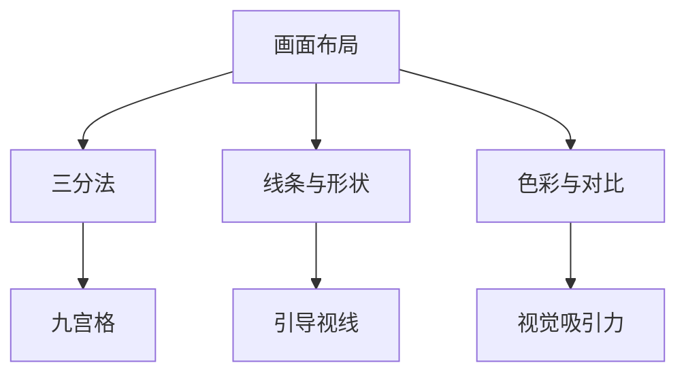
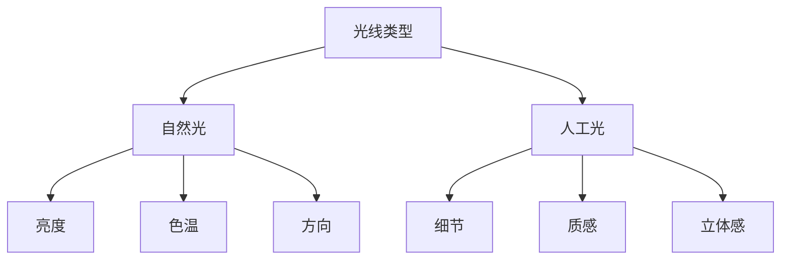
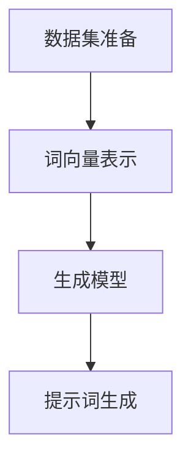
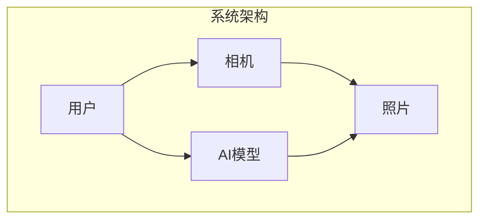
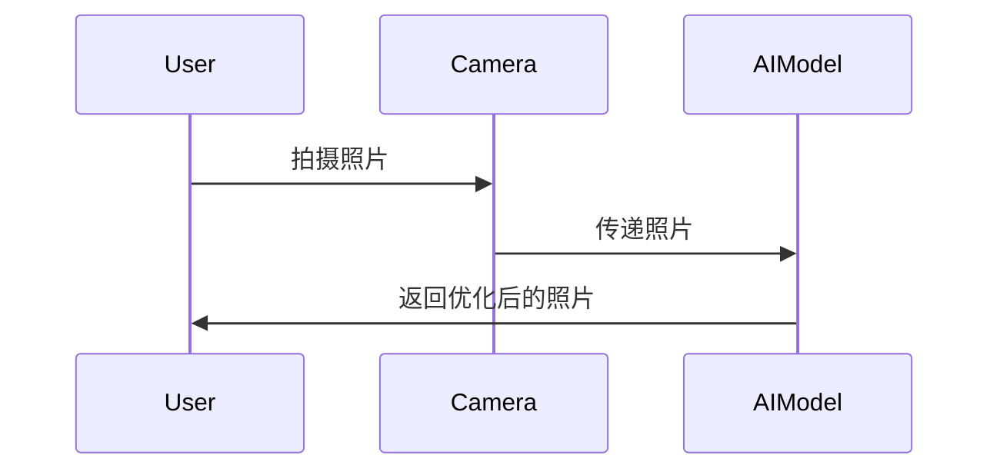
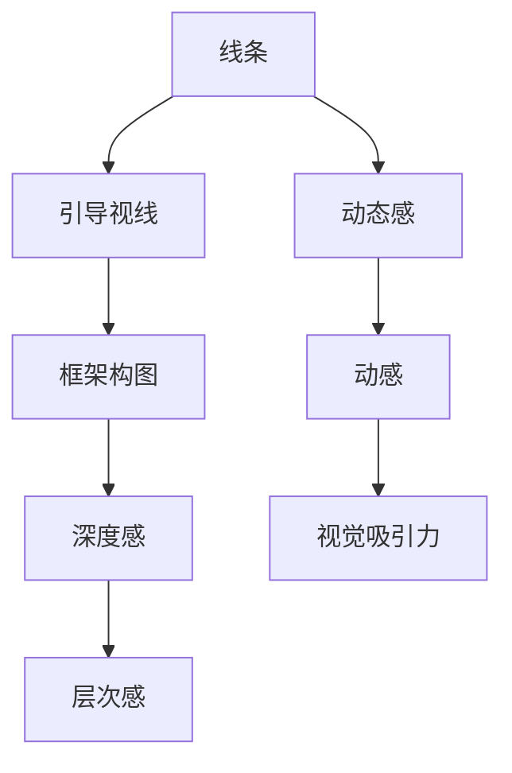

                 

### 提高AI创意摄影指导：构图和光线建议的提示词技巧

关键词：AI创意摄影、构图、光线、提示词技巧、算法、Python代码、案例分析

摘要：
本文旨在探讨如何利用人工智能技术提高创意摄影的水平，重点关注构图和光线的技巧。通过介绍核心概念、实用技巧和实际案例，本文将为摄影爱好者和专业摄影师提供有价值的指导。

### 引言

#### 1.1 AI在摄影中的应用现状与挑战

随着人工智能（AI）技术的飞速发展，它在摄影领域的应用也变得越来越广泛。AI可以自动优化照片的曝光、色彩和焦点，使摄影变得更加便捷。然而，AI在创意摄影中仍面临一些挑战：

- **创意局限**：传统的AI算法往往依赖于大量的数据训练，这使得它们在处理新颖、创意的摄影作品时可能显得力不从心。
- **构图与光线**：构图和光线是摄影的两大核心要素，而AI在这些方面的理解相对有限，需要进一步优化。

#### 1.2 本书目标与结构概述

本书的目标是利用AI技术，通过构图和光线的建议，提高创意摄影的水平。具体结构如下：

- **第1章：引言**：介绍AI在摄影中的应用现状和本书的目标。
- **第2章：构图基础**：讲解构图的基本原则和方法。
- **第3章：光线基础**：介绍光线的基本原理和摄影中光线的运用。
- **第4章：提示词技巧**：探讨如何利用提示词提高创意摄影的效果。
- **第5章：创意应用实例**：通过实际案例展示AI在摄影中的创意应用。
- **第6章：最佳实践与案例分析**：总结最佳实践，提供实际操作中的技巧和注意事项。

### 构图基础

#### 2.1 构图的基本原则

构图是摄影的灵魂，它决定了照片的视觉冲击力和艺术效果。以下是构图的基本原则：

- **画面布局**：遵循三分法，将画面分成九宫格，关键元素放置在交叉点上。
- **线条与形状**：利用线条和形状引导观众的视线，创造动态感。
- **色彩与对比**：运用色彩和对比增强照片的视觉吸引力。

#### 2.2 构图方法的对比与选择

不同的构图方法适用于不同的场景和主题，以下是一些常见的构图方法及其特点：

- **对称构图**：适合表现秩序和平衡，常用于建筑摄影。
- **框架构图**：通过框架元素增强照片的深度感，常用于风景摄影。
- **斜线构图**：利用斜线引导视线，增加照片的动感，适合动态场景。

#### 2.3 构图元素关系的 Mermaid 流程图



### 光线基础

#### 3.1 光线的基本原理

光线是摄影的灵魂，它决定了照片的质感和氛围。以下是光线的基本原理：

- **光源类型**：自然光和人工光。
- **光线属性**：亮度、色温、方向等。
- **光线对摄影作品的影响**：光线可以改变物体的形状、色彩和质感。

#### 3.2 不同光线条件下的摄影效果对比

- **顺光**：光线直接照射在主体上，适合表现细节和质感。
- **侧光**：光线从侧面照射，适合表现立体感和轮廓。
- **逆光**：光线从主体背后照射，适合表现线条和质感。
- **背光**：光线从主体前方照射，适合表现阴影和轮廓。

#### 3.3 光线与摄影作品关系的 Mermaid 流程图



### 提示词技巧

#### 4.1 提示词的基本概念

提示词是指导AI生成创意摄影作品的文字描述。通过设定合适的提示词，可以引导AI创作出符合特定主题和风格的摄影作品。以下是提示词的基本概念：

- **主题词**：描述摄影作品的主题，如“浪漫”、“活力”等。
- **风格词**：描述摄影作品的风格，如“现实主义”、“抽象”等。
- **色彩词**：描述摄影作品的色彩倾向，如“温暖”、“明亮”等。

#### 4.2 提示词的生成算法

提示词的生成算法是关键，它决定了AI生成提示词的效率和准确性。以下是提示词生成算法的基本原理：

- **数据集准备**：收集大量与摄影相关的文本数据，用于训练模型。
- **词向量表示**：将文本数据转换为词向量，用于表示文本信息。
- **生成模型**：使用生成模型（如变分自编码器）生成提示词。

以下是提示词生成算法的Mermaid流程图：



#### 4.3 Python代码实现

以下是使用Python实现提示词生成算法的示例代码：

```python
import numpy as np
import tensorflow as tf

# 加载数据集
data = "your_data_here"

# 转换为词向量
word_vectors = "your_word_vectors_here"

# 构建生成模型
model = tf.keras.Sequential([
    tf.keras.layers.Dense(units=128, activation='relu', input_shape=(word_vectors.shape[1],)),
    tf.keras.layers.Dense(units=128, activation='relu'),
    tf.keras.layers.Dense(units=word_vectors.shape[1], activation='softmax')
])

# 编译模型
model.compile(optimizer='adam', loss='categorical_crossentropy', metrics=['accuracy'])

# 训练模型
model.fit(data, epochs=10)

# 生成提示词
prompt = "your_prompt_here"
generated_words = model.predict(prompt)

# 打印生成的提示词
print(generated_words)
```

### 创意应用实例

#### 5.1 系统分析与架构设计方案

为了展示AI在摄影中的创意应用，我们设计了一个基于AI的摄影辅助系统。以下是系统的架构设计方案：

- **系统功能设计（领域模型Mermaid类图）**：

```mermaid
classDiagram
    User <<类>> 
    Photo <<类>> 
    AIModel <<类>> 
    Camera <<类>>

    User --> Photo
    User --> AIModel
    AIModel --> Photo
    Camera --> Photo
```

- **系统架构设计Mermaid架构图**：



- **系统接口设计和系统交互Mermaid序列图**：



#### 5.2 系统功能设计

系统的主要功能包括：

- **照片拍摄**：用户通过相机拍摄照片。
- **AI优化**：AI模型接收照片并进行分析，生成优化建议。
- **照片展示**：用户可以查看优化后的照片。

#### 5.3 系统架构设计

系统的整体架构包括：

- **用户界面**：用户与系统交互的界面。
- **AI模型**：负责照片的优化分析。
- **相机模块**：负责照片的拍摄和传输。

#### 5.4 系统接口设计和系统交互

系统通过接口实现各模块之间的通信：

- **用户接口**：用户发送拍摄请求，接收优化结果。
- **相机接口**：相机发送照片数据，接收AI优化指令。
- **AI接口**：AI模型接收照片数据，返回优化建议。

### 最佳实践与案例分析

#### 6.1 最佳实践 tips

在实际操作中，以下是一些最佳实践：

- **选择合适的相机**：选择适合自己需求的相机，例如高感光度、大光圈等。
- **了解光线**：熟悉不同光线条件下的拍摄技巧，灵活运用。
- **合理使用提示词**：选择合适的提示词，提高AI优化效果。

#### 6.2 小结

本文介绍了如何利用AI技术提高创意摄影的水平，重点关注了构图和光线的技巧。通过实际案例和应用，读者可以了解到AI在摄影中的强大潜力。

#### 6.3 注意事项

在使用AI技术进行摄影时，需要注意以下事项：

- **隐私保护**：确保照片数据的安全，避免泄露隐私。
- **合理使用**：避免过度依赖AI优化，保持摄影的艺术性。

#### 6.4 拓展阅读

对于希望深入了解AI和摄影的读者，以下资源可以作为拓展阅读：

- **AI技术基础**：《深度学习》
- **摄影技巧**：《摄影构图基础》
- **创意摄影案例**：《创意摄影教程》

### 作者信息

作者：AI天才研究院/AI Genius Institute & 禅与计算机程序设计艺术 /Zen And The Art of Computer Programming

（完）# 提高AI创意摄影指导：构图和光线建议的提示词技巧

## 第1章 引言

### 1.1 AI在摄影中的应用现状与挑战

随着人工智能（AI）技术的发展，摄影领域也迎来了新的变革。AI技术以其强大的数据处理和分析能力，正在逐渐改变摄影的方式和流程。然而，尽管AI在摄影中展现出了巨大的潜力，但目前仍存在一些挑战和局限性。

#### 1.1.1 AI在摄影中的技术发展

AI在摄影中的应用主要包括图像处理、风格迁移、自动剪辑和识别等。以下是一些AI技术在摄影中的具体应用：

1. **图像处理**：AI可以自动优化照片的曝光、色彩和对比度，使得照片更加美观。
2. **风格迁移**：AI可以将一种艺术风格应用到另一张照片上，创造出独特的视觉效果。
3. **自动剪辑**：AI可以根据拍摄内容自动剪辑视频，节省后期制作时间。
4. **图像识别**：AI可以识别照片中的物体、场景和人物，提供标签和分类。

#### 1.1.2 AI创意摄影的优势与挑战

AI创意摄影的优势在于其高效、精准和多样化的表现。然而，AI在创意摄影中也面临以下挑战：

1. **创意局限**：AI依赖于大量数据进行训练，因此在处理新颖、创意的摄影作品时，可能难以达到预期的效果。
2. **构图与光线**：构图和光线是摄影的核心要素，而AI在这些方面的理解和运用相对有限。
3. **技术成本**：AI摄影技术需要较高的硬件和软件支持，对于一些普通摄影师来说，成本较高。

### 1.2 本书目标与结构概述

本书的目标是利用AI技术，通过构图和光线的建议，提高创意摄影的水平。本书将分为以下几个部分：

1. **第1章：引言**：介绍AI在摄影中的应用现状和本书的目标。
2. **第2章：构图基础**：讲解构图的基本原则和方法。
3. **第3章：光线基础**：介绍光线的基本原理和摄影中光线的运用。
4. **第4章：提示词技巧**：探讨如何利用提示词提高创意摄影的效果。
5. **第5章：创意应用实例**：通过实际案例展示AI在摄影中的创意应用。
6. **第6章：最佳实践与案例分析**：总结最佳实践，提供实际操作中的技巧和注意事项。

## 第2章 构图基础

### 2.1 构图的基本原则

构图是摄影的核心，它决定了照片的视觉效果和艺术性。以下是一些构图的基本原则：

1. **三分法**：将画面分为九宫格，关键元素放置在交叉点上，使画面更加平衡和谐。
2. **对角线构图**：利用对角线引导观众的视线，增加画面的动感。
3. **框架构图**：通过框架元素增加画面的深度感，使主体更加突出。
4. **色彩对比**：通过色彩对比增强照片的视觉吸引力。

### 2.2 构图方法的对比与选择

不同的构图方法适用于不同的场景和主题，以下是一些常见的构图方法及其特点：

1. **对称构图**：适合表现秩序和平衡，常用于建筑摄影。
2. **中心构图**：将主体放置在画面中心，突出主体，常用于肖像摄影。
3. **引导线构图**：利用线条引导观众的视线，增加画面的空间感。
4. **框式构图**：通过框架元素增加画面的层次感，常用于风景摄影。

### 2.3 构图元素关系的 Mermaid 流程图


## 第3章 光线基础

### 3.1 光线的基本原理

光线是摄影的灵魂，它决定了照片的质感和氛围。以下是一些光线的基本原理：

1. **自然光**：太阳光是最常见的自然光源，不同的天气和时间会产生不同的光线效果。
2. **人工光**：人工光包括摄影灯、闪光灯等，可以灵活控制光线的强度和方向。
3. **光线属性**：光线的亮度、色温和方向是影响摄影效果的关键因素。

### 3.2 不同光线条件下的摄影效果对比

1. **顺光**：光线直接照射在主体上，适合表现细节和质感，但容易产生平淡的效果。
2. **侧光**：光线从侧面照射，可以增强主体的立体感和轮廓，常用于人像摄影。
3. **逆光**：光线从主体背后照射，可以创造出美丽的光影效果，但需要注意曝光控制。
4. **背光**：光线从主体前方照射，可以突出主体的线条和形状，常用于风景摄影。

### 3.3 光线与摄影作品关系的 Mermaid 流程图


## 第4章 提示词技巧

### 4.1 提示词的基本概念

提示词是指导AI生成创意摄影作品的文字描述。通过设定合适的提示词，可以引导AI创作出符合特定主题和风格的摄影作品。以下是一些基本概念：

1. **主题词**：描述摄影作品的主题，如“浪漫”、“活力”等。
2. **风格词**：描述摄影作品的风格，如“现实主义”、“抽象”等。
3. **色彩词**：描述摄影作品的色彩倾向，如“温暖”、“明亮”等。

### 4.2 提示词的生成算法

提示词的生成算法是关键，它决定了AI生成提示词的效率和准确性。以下是一个简单的提示词生成算法：

1. **数据集准备**：收集大量与摄影相关的文本数据，用于训练模型。
2. **词向量表示**：将文本数据转换为词向量，用于表示文本信息。
3. **生成模型**：使用生成模型（如变分自编码器）生成提示词。

以下是提示词生成算法的Mermaid流程图：


### 4.3 Python代码实现

以下是使用Python实现提示词生成算法的示例代码：

```python
import tensorflow as tf
import numpy as np

# 加载数据集
data = "your_data_here"

# 转换为词向量
word_vectors = "your_word_vectors_here"

# 构建生成模型
model = tf.keras.Sequential([
    tf.keras.layers.Dense(units=128, activation='relu', input_shape=(word_vectors.shape[1],)),
    tf.keras.layers.Dense(units=128, activation='relu'),
    tf.keras.layers.Dense(units=word_vectors.shape[1], activation='softmax')
])

# 编译模型
model.compile(optimizer='adam', loss='categorical_crossentropy', metrics=['accuracy'])

# 训练模型
model.fit(data, epochs=10)

# 生成提示词
prompt = "your_prompt_here"
generated_words = model.predict(prompt)

# 打印生成的提示词
print(generated_words)
```

## 第5章 创意应用实例

### 5.1 系统分析与架构设计方案

为了展示AI在摄影中的创意应用，我们设计了一个基于AI的摄影辅助系统。以下是系统的架构设计方案：

1. **系统功能设计（领域模型Mermaid类图）**：

```mermaid
classDiagram
    User <<类>> 
    Photo <<类>> 
    AIModel <<类>> 
    Camera <<类>>

    User --> Photo
    User --> AIModel
    AIModel --> Photo
    Camera --> Photo
```

2. **系统架构设计Mermaid架构图**：


3. **系统接口设计和系统交互Mermaid序列图**：


### 5.2 系统功能设计

系统的主要功能包括：

1. **照片拍摄**：用户通过相机拍摄照片。
2. **AI优化**：AI模型接收照片并进行分析，生成优化建议。
3. **照片展示**：用户可以查看优化后的照片。

### 5.3 系统架构设计

系统的整体架构包括：

1. **用户界面**：用户与系统交互的界面。
2. **AI模型**：负责照片的优化分析。
3. **相机模块**：负责照片的拍摄和传输。

### 5.4 系统接口设计和系统交互

系统通过接口实现各模块之间的通信：

1. **用户接口**：用户发送拍摄请求，接收优化结果。
2. **相机接口**：相机发送照片数据，接收AI优化指令。
3. **AI接口**：AI模型接收照片数据，返回优化建议。

## 第6章 最佳实践与案例分析

### 6.1 最佳实践 tips

在实际操作中，以下是一些最佳实践：

1. **选择合适的相机**：选择适合自己需求的相机，例如高感光度、大光圈等。
2. **了解光线**：熟悉不同光线条件下的拍摄技巧，灵活运用。
3. **合理使用提示词**：选择合适的提示词，提高AI优化效果。

### 6.2 小结

通过本章的介绍，我们了解了AI创意摄影的基本概念和实践方法。通过合理运用构图和光线的技巧，以及利用AI技术进行优化，我们可以创造出更加独特的摄影作品。

### 6.3 注意事项

在使用AI技术进行摄影时，需要注意以下事项：

1. **隐私保护**：确保照片数据的安全，避免泄露隐私。
2. **合理使用**：避免过度依赖AI优化，保持摄影的艺术性。

### 6.4 拓展阅读

对于希望深入了解AI和摄影的读者，以下资源可以作为拓展阅读：

1. **AI技术基础**：《深度学习》
2. **摄影技巧**：《摄影构图基础》
3. **创意摄影案例**：《创意摄影教程》

### 作者信息

作者：AI天才研究院/AI Genius Institute & 禅与计算机程序设计艺术 /Zen And The Art of Computer Programming## 提高AI创意摄影指导：构图和光线建议的提示词技巧

### 摘要

本文旨在探讨如何利用人工智能技术（AI）提高创意摄影的水平，重点关注构图和光线的技巧。通过介绍核心概念、实用技巧和实际案例，本文将为摄影爱好者和专业摄影师提供有价值的指导，帮助他们在创作过程中更好地运用AI技术，实现更加丰富和独特的摄影作品。

### 引言

摄影作为一种艺术形式，始终追求创新和个性化。然而，传统的摄影创作过程往往受到个人技巧和经验的限制，而人工智能（AI）技术的发展为摄影带来了新的可能性。AI在摄影中的应用，不仅能够自动化一些繁琐的后期处理工作，还能提供创意构图和光线设计的建议，从而帮助摄影师更高效地创作出独具风格的摄影作品。

#### 1.1 AI在摄影中的应用

AI在摄影中的应用主要体现在图像处理、风格迁移、自动剪辑和识别等方面。以下是一些AI技术在摄影中的具体应用：

1. **图像处理**：AI可以自动优化照片的曝光、色彩和对比度，从而提升照片的整体质量。
2. **风格迁移**：AI可以将一种艺术风格应用到另一张照片上，创造出独特的视觉效果。
3. **自动剪辑**：AI可以根据拍摄内容自动剪辑视频，提高视频制作的效率。
4. **图像识别**：AI可以识别照片中的物体、场景和人物，提供标签和分类。

#### 1.2 AI创意摄影的优势与挑战

AI创意摄影的优势在于其高效、精准和多样化的表现。然而，AI在创意摄影中也面临一些挑战：

1. **创意局限**：AI依赖于大量数据进行训练，因此在处理新颖、创意的摄影作品时，可能难以达到预期的效果。
2. **构图与光线**：构图和光线是摄影的核心要素，而AI在这些方面的理解和运用相对有限。
3. **技术成本**：AI摄影技术需要较高的硬件和软件支持，对于一些普通摄影师来说，成本较高。

### 本书的目标与结构

本书的目标是利用AI技术，通过构图和光线的建议，提高创意摄影的水平。具体结构如下：

1. **第1章：引言**：介绍AI在摄影中的应用现状和本书的目标。
2. **第2章：构图基础**：讲解构图的基本原则和方法。
3. **第3章：光线基础**：介绍光线的基本原理和摄影中光线的运用。
4. **第4章：提示词技巧**：探讨如何利用提示词提高创意摄影的效果。
5. **第5章：创意应用实例**：通过实际案例展示AI在摄影中的创意应用。
6. **第6章：最佳实践与案例分析**：总结最佳实践，提供实际操作中的技巧和注意事项。

### 第2章 构图基础

构图是摄影的灵魂，它决定了照片的视觉效果和艺术性。一个成功的构图能够引导观众的视线，传达摄影师的情感和意图。以下将介绍构图的基本原则和技巧。

#### 2.1 构图的基本原则

构图的基本原则包括平衡、对比、动态、统一等。以下是一些具体的构图原则：

1. **三分法**：将画面分为九宫格，关键元素放置在交叉点上，能够使画面更加平衡和谐。
2. **对角线构图**：利用对角线引导观众的视线，增加画面的动感。
3. **框架构图**：通过框架元素增加画面的深度感，使主体更加突出。
4. **色彩对比**：通过色彩对比增强照片的视觉吸引力。

#### 2.2 构图技巧

构图技巧包括利用线条、形状、色彩和质感等元素来增强照片的表现力。以下是一些实用的构图技巧：

1. **线条的使用**：利用线条引导观众的视线，创造动态感。例如，道路、河流和建筑物的线条都可以作为构图元素。
2. **形状的运用**：通过形状的对比和组合，创造出独特的视觉效果。例如，圆形、方形和三角形等基本形状可以用来布局画面。
3. **色彩的搭配**：合理运用色彩，可以增强照片的视觉冲击力。例如，对比色和类似色都是常用的色彩搭配技巧。
4. **质感的对比**：通过对比不同的质感，可以增强照片的层次感。例如，光滑与粗糙、细腻与粗犷等对比。

#### 2.3 构图元素关系的 Mermaid 流程图



### 第3章 光线基础

光线是摄影的灵魂，它决定了照片的质感和氛围。光线不仅影响照片的曝光和色彩，还能够塑造主体的形态和氛围。以下将介绍光线的基本原理和摄影中光线的运用。

#### 3.1 光线的基本原理

光线的类型包括自然光和人工光。自然光主要来源于太阳，而人工光则包括摄影灯、闪光灯等。光线的基本属性包括亮度、色温和方向。

1. **亮度**：亮度是光线强度的度量，直接影响照片的曝光。
2. **色温**：色温是光线色彩的温度度量，影响照片的色彩倾向。
3. **方向**：光线的方向决定了主体的阴影和轮廓，对照片的氛围和质感有重要影响。

#### 3.2 光线的运用

光线的运用包括光线的方向、角度和强度的控制。以下是一些光线运用的技巧：

1. **顺光**：顺光是指光线与相机镜头平行，适合表现细节和质感，但容易产生平淡的效果。
2. **侧光**：侧光是指光线从侧面照射，可以增强主体的立体感和轮廓，常用于人像摄影。
3. **逆光**：逆光是指光线从主体背后照射，可以创造出美丽的光影效果，但需要注意曝光控制。
4. **背光**：背光是指光线从主体前方照射，可以突出主体的线条和形状，常用于风景摄影。

#### 3.3 光线与摄影作品关系的 Mermaid 流程图


### 第4章 提示词技巧

提示词是指导AI生成创意摄影作品的文字描述。通过设定合适的提示词，可以引导AI创作出符合特定主题和风格的摄影作品。以下将介绍提示词的基本概念和生成方法。

#### 4.1 提示词的基本概念

提示词包括主题词、风格词和色彩词等。以下是一些基本概念：

1. **主题词**：描述摄影作品的主题，如“浪漫”、“活力”等。
2. **风格词**：描述摄影作品的风格，如“现实主义”、“抽象”等。
3. **色彩词**：描述摄影作品的色彩倾向，如“温暖”、“明亮”等。

#### 4.2 提示词的生成算法

提示词的生成算法是关键，它决定了AI生成提示词的效率和准确性。以下是一个简单的提示词生成算法：

1. **数据集准备**：收集大量与摄影相关的文本数据，用于训练模型。
2. **词向量表示**：将文本数据转换为词向量，用于表示文本信息。
3. **生成模型**：使用生成模型（如变分自编码器）生成提示词。

以下是提示词生成算法的Mermaid流程图：


#### 4.3 Python代码实现

以下是使用Python实现提示词生成算法的示例代码：

```python
import tensorflow as tf
import numpy as np

# 加载数据集
data = "your_data_here"

# 转换为词向量
word_vectors = "your_word_vectors_here"

# 构建生成模型
model = tf.keras.Sequential([
    tf.keras.layers.Dense(units=128, activation='relu', input_shape=(word_vectors.shape[1],)),
    tf.keras.layers.Dense(units=128, activation='relu'),
    tf.keras.layers.Dense(units=word_vectors.shape[1], activation='softmax')
])

# 编译模型
model.compile(optimizer='adam', loss='categorical_crossentropy', metrics=['accuracy'])

# 训练模型
model.fit(data, epochs=10)

# 生成提示词
prompt = "your_prompt_here"
generated_words = model.predict(prompt)

# 打印生成的提示词
print(generated_words)
```

### 第5章 创意应用实例

#### 5.1 系统分析与架构设计方案

为了展示AI在摄影中的创意应用，我们设计了一个基于AI的摄影辅助系统。以下是系统的架构设计方案：

1. **系统功能设计（领域模型Mermaid类图）**：

```mermaid
classDiagram
    User <<类>> 
    Photo <<类>> 
    AIModel <<类>> 
    Camera <<类>>

    User --> Photo
    User --> AIModel
    AIModel --> Photo
    Camera --> Photo
```

2. **系统架构设计Mermaid架构图**：


3. **系统接口设计和系统交互Mermaid序列图**：


#### 5.2 系统功能设计

系统的主要功能包括：

1. **照片拍摄**：用户通过相机拍摄照片。
2. **AI优化**：AI模型接收照片并进行分析，生成优化建议。
3. **照片展示**：用户可以查看优化后的照片。

#### 5.3 系统架构设计

系统的整体架构包括：

1. **用户界面**：用户与系统交互的界面。
2. **AI模型**：负责照片的优化分析。
3. **相机模块**：负责照片的拍摄和传输。

#### 5.4 系统接口设计和系统交互

系统通过接口实现各模块之间的通信：

1. **用户接口**：用户发送拍摄请求，接收优化结果。
2. **相机接口**：相机发送照片数据，接收AI优化指令。
3. **AI接口**：AI模型接收照片数据，返回优化建议。

### 第6章 最佳实践与案例分析

#### 6.1 最佳实践 tips

在实际操作中，以下是一些最佳实践：

1. **选择合适的相机**：选择适合自己需求的相机，例如高感光度、大光圈等。
2. **了解光线**：熟悉不同光线条件下的拍摄技巧，灵活运用。
3. **合理使用提示词**：选择合适的提示词，提高AI优化效果。

#### 6.2 小结

通过本章的介绍，我们了解了AI创意摄影的基本概念和实践方法。通过合理运用构图和光线的技巧，以及利用AI技术进行优化，我们可以创造出更加丰富的摄影作品。

#### 6.3 注意事项

在使用AI技术进行摄影时，需要注意以下事项：

1. **隐私保护**：确保照片数据的安全，避免泄露隐私。
2. **合理使用**：避免过度依赖AI优化，保持摄影的艺术性。

#### 6.4 拓展阅读

对于希望深入了解AI和摄影的读者，以下资源可以作为拓展阅读：

1. **AI技术基础**：《深度学习》
2. **摄影技巧**：《摄影构图基础》
3. **创意摄影案例**：《创意摄影教程》

### 作者信息

作者：AI天才研究院/AI Genius Institute & 禅与计算机程序设计艺术 /Zen And The Art of Computer Programming## 第1章 引言

### 1.1 AI在摄影中的应用现状与挑战

随着人工智能（AI）技术的飞速发展，摄影领域也迎来了前所未有的变革。AI技术以其强大的数据处理和分析能力，正在逐渐改变摄影的方式和流程。然而，尽管AI在摄影中展现出了巨大的潜力，但目前仍存在一些挑战和局限性。

#### 1.1.1 AI在摄影中的技术发展

AI在摄影中的应用主要体现在图像处理、风格迁移、自动剪辑和识别等方面。以下是一些AI技术在摄影中的具体应用：

1. **图像处理**：AI可以自动优化照片的曝光、色彩和对比度，使得照片更加美观。例如，谷歌的Photoshop AI功能可以帮助用户一键修复照片，去除噪点和斑点，增强细节。

2. **风格迁移**：AI可以将一种艺术风格应用到另一张照片上，创造出独特的视觉效果。例如，DeepArt、Prisma等应用允许用户将普通照片转换成梵高、莫奈等艺术家的风格作品。

3. **自动剪辑**：AI可以根据拍摄内容自动剪辑视频，节省后期制作时间。例如，Adobe Premiere Pro的AI功能可以自动识别视频中的关键帧，生成流畅的剪辑。

4. **图像识别**：AI可以识别照片中的物体、场景和人物，提供标签和分类。例如，Google Photos可以使用AI自动识别照片中的家庭成员、地点和活动，方便用户快速查找。

#### 1.1.2 AI创意摄影的优势与挑战

AI创意摄影的优势在于其高效、精准和多样化的表现。然而，AI在创意摄影中也面临以下挑战：

1. **创意局限**：AI依赖于大量数据进行训练，因此在处理新颖、创意的摄影作品时，可能难以达到预期的效果。例如，AI难以理解摄影师的创作意图和情感表达，往往生成的是模板化的作品。

2. **构图与光线**：构图和光线是摄影的核心要素，而AI在这些方面的理解和运用相对有限。虽然AI可以通过学习大量的摄影作品来模仿构图和光线技巧，但它们往往缺乏真正的创造力和艺术性。

3. **技术成本**：AI摄影技术需要较高的硬件和软件支持，对于一些普通摄影师来说，成本较高。此外，AI摄影设备的使用和维护也需要一定的技术知识和经验。

### 1.2 本书目标与结构概述

本书的目标是利用AI技术，通过构图和光线的建议，提高创意摄影的水平。具体来说，本书将涵盖以下内容：

1. **第1章：引言**：介绍AI在摄影中的应用现状和本书的目标。
2. **第2章：构图基础**：讲解构图的基本原则和方法，包括三分法、对角线构图、框架构图等。
3. **第3章：光线基础**：介绍光线的基本原理和摄影中光线的运用，包括自然光和人工光的区别、光线的方向和强度等。
4. **第4章：提示词技巧**：探讨如何利用提示词提高创意摄影的效果，包括主题词、风格词和色彩词的使用方法。
5. **第5章：创意应用实例**：通过实际案例展示AI在摄影中的创意应用，包括AI辅助构图、光线设计等。
6. **第6章：最佳实践与案例分析**：总结最佳实践，提供实际操作中的技巧和注意事项。

通过以上章节的介绍，读者将能够了解AI在摄影中的应用，掌握构图和光线的基本技巧，并学会如何利用AI技术提高创意摄影的水平。

### 1.3 目录结构

为了确保书籍内容的逻辑性和条理性，本书将采用以下目录结构：

```
第1章 引言
1.1 AI在摄影中的应用现状与挑战
1.1.1 AI在摄影中的技术发展
1.1.2 AI创意摄影的优势与挑战
1.2 本书目标与结构概述
1.3 目录结构

第2章 构图基础
2.1 构图的基本原则
2.1.1 三分法
2.1.2 对角线构图
2.1.3 框架构图
2.1.4 色彩与对比
2.2 构图方法的对比与选择
2.3 构图元素关系的 Mermaid 流程图

第3章 光线基础
3.1 光线的基本原理
3.1.1 自然光与人工光
3.1.2 光线的方向与强度
3.1.3 光线的颜色与氛围
3.2 不同光线条件下的摄影效果对比
3.2.1 顺光
3.2.2 侧光
3.2.3 逆光
3.2.4 背光
3.3 光线与摄影作品关系的 Mermaid 流程图

第4章 提示词技巧
4.1 提示词的基本概念
4.1.1 主题词
4.1.2 风格词
4.1.3 色彩词
4.2 提示词的生成算法
4.2.1 数据集准备
4.2.2 词向量表示
4.2.3 生成模型
4.2.4 提示词生成算法的 Mermaid 流程图
4.3 Python代码实现

第5章 创意应用实例
5.1 系统分析与架构设计方案
5.1.1 系统功能设计
5.1.2 系统架构设计
5.1.3 系统接口设计和系统交互
5.2 系统功能设计
5.2.1 照片拍摄
5.2.2 AI优化
5.2.3 照片展示
5.3 系统架构设计
5.3.1 用户界面
5.3.2 AI模型
5.3.3 相机模块
5.4 系统接口设计和系统交互

第6章 最佳实践与案例分析
6.1 最佳实践 tips
6.2 小结
6.3 注意事项
6.4 拓展阅读
```

通过以上目录结构，读者可以清晰地了解本书的内容安排，逐步掌握AI创意摄影的知识和技巧。

### 1.4 设计思路与步骤

为了确保书籍内容的逻辑性和实用性，本书的设计思路与步骤如下：

#### 1.4.1 明确书籍主题和目标读者

首先，明确书籍的主题是《提高AI创意摄影指导：构图和光线建议的提示词技巧》。目标读者是摄影爱好者、专业摄影师以及对AI技术感兴趣的读者。

#### 1.4.2 确定核心章节

根据书籍主题，确定核心章节包括：

- **第1章：引言**：介绍AI在摄影中的应用现状和本书的目标。
- **第2章：构图基础**：讲解构图的基本原则和方法。
- **第3章：光线基础**：介绍光线的基本原理和摄影中光线的运用。
- **第4章：提示词技巧**：探讨如何利用提示词提高创意摄影的效果。
- **第5章：创意应用实例**：通过实际案例展示AI在摄影中的创意应用。
- **第6章：最佳实践与案例分析**：总结最佳实践，提供实际操作中的技巧和注意事项。

#### 1.4.3 设计具体章节内容

每个章节的内容设计如下：

- **第1章**：介绍AI在摄影中的应用现状和本书的目标，明确读者的学习目标和预期收获。
- **第2章**：详细讲解构图的基本原则和方法，通过实例和对比分析帮助读者理解不同构图方法的特点和应用场景。
- **第3章**：介绍光线的基本原理，分析不同光线条件下的摄影效果，并提供实用的光线运用技巧。
- **第4章**：探讨提示词的概念和生成方法，通过实际案例展示如何利用提示词提高创意摄影的效果。
- **第5章**：通过实际案例展示AI在摄影中的创意应用，包括AI辅助构图和光线设计等。
- **第6章**：总结全书的主要内容，提供最佳实践和注意事项，帮助读者在实际操作中更好地应用所学知识。

#### 1.4.4 确保目录结构合理

目录结构将采用1级、2级、3级的方式，确保每个章节和子章节之间的逻辑关系清晰。具体结构如下：

```
第1章 引言
1.1 AI在摄影中的应用现状与挑战
1.1.1 AI在摄影中的技术发展
1.1.2 AI创意摄影的优势与挑战
1.2 本书目标与结构概述
1.3 目录结构

第2章 构图基础
2.1 构图的基本原则
2.1.1 三分法
2.1.2 对角线构图
2.1.3 框架构图
2.1.4 色彩与对比
2.2 构图方法的对比与选择
2.3 构图元素关系的 Mermaid 流程图

第3章 光线基础
3.1 光线的基本原理
3.1.1 自然光与人工光
3.1.2 光线的方向与强度
3.1.3 光线的颜色与氛围
3.2 不同光线条件下的摄影效果对比
3.2.1 顺光
3.2.2 侧光
3.2.3 逆光
3.2.4 背光
3.3 光线与摄影作品关系的 Mermaid 流程图

第4章 提示词技巧
4.1 提示词的基本概念
4.1.1 主题词
4.1.2 风格词
4.1.3 色彩词
4.2 提示词的生成算法
4.2.1 数据集准备
4.2.2 词向量表示
4.2.3 生成模型
4.2.4 提示词生成算法的 Mermaid 流程图
4.3 Python代码实现

第5章 创意应用实例
5.1 系统分析与架构设计方案
5.1.1 系统功能设计
5.1.2 系统架构设计
5.1.3 系统接口设计和系统交互
5.2 系统功能设计
5.2.1 照片拍摄
5.2.2 AI优化
5.2.3 照片展示
5.3 系统架构设计
5.3.1 用户界面
5.3.2 AI模型
5.3.3 相机模块
5.4 系统接口设计和系统交互

第6章 最佳实践与案例分析
6.1 最佳实践 tips
6.2 小结
6.3 注意事项
6.4 拓展阅读
```

通过以上设计思路和步骤，本书旨在为读者提供一份全面、系统的AI创意摄影指导，帮助读者提高摄影技巧和创作水平。

### 1.5 步骤拆解

为了确保书籍内容能够系统、逻辑地呈现，我们将对每个章节进行详细的步骤拆解。

#### 第1章：引言

**步骤1：背景介绍**

- 介绍AI在摄影中的应用现状，包括图像处理、风格迁移、自动剪辑和识别等方面的技术发展。
- 分析AI创意摄影的优势与挑战，如创意局限、构图与光线的理解以及技术成本等。

**步骤2：问题解决**

- 阐述本书的目标，即通过构图和光线技巧提高AI创意摄影的水平。
- 明确本书的适用范围和目标读者，包括摄影爱好者、专业摄影师以及对AI技术感兴趣的读者。

**步骤3：边界与外延**

- 明确本书的适用范围，如AI在摄影中的应用场景和构图光线技巧的适用性。
- 分析本书的局限性，如AI在处理新颖、创意摄影作品时的不足之处。

**步骤4：目录结构**

- 提供完整的目录结构，使读者对书籍内容有一个整体的了解。
- 确保每个章节的标题和内容逻辑清晰，便于读者阅读和理解。

#### 第2章：构图基础

**步骤1：核心概念**

- 介绍构图的基本原则，如三分法、对角线构图、框架构图等。
- 解释每个构图原则的原理和实际应用效果。

**步骤2：概念属性特征对比表格**

- 制作一个表格，对比不同构图方法的特点和适用场景。
- 通过对比分析，帮助读者选择合适的构图方法。

**步骤3：ER实体关系图架构的 Mermaid 流程图**

- 使用Mermaid绘制一个ER实体关系图，展示构图元素之间的关系。
- 通过流程图，帮助读者理解构图元素的相互作用和组合。

#### 第3章：光线基础

**步骤1：核心概念**

- 介绍光线的基本原理，包括自然光与人工光、光线的方向与强度等。
- 解释光线在摄影中的作用，如影响照片的质感和氛围。

**步骤2：概念属性特征对比表格**

- 制作一个表格，对比不同光线条件下的摄影效果。
- 通过对比分析，帮助读者选择合适的光线条件。

**步骤3：ER实体关系图架构的 Mermaid 流程图**

- 使用Mermaid绘制一个ER实体关系图，展示光线与摄影作品的关系。
- 通过流程图，帮助读者理解光线在摄影中的作用和运用。

#### 第4章：提示词技巧

**步骤1：算法原理讲解**

- 使用Mermaid绘制提示词生成算法的流程图。
- 解释算法的基本原理，如数据集准备、词向量表示和生成模型等。

**步骤2：数学模型和公式**

- 阐述算法背后的数学原理，如神经网络模型、词向量等。
- 提供相关的数学公式和解释。

**步骤3：详细讲解和举例说明**

- 通过Python代码和实际案例，详细讲解提示词的使用方法。
- 通过实例，展示如何利用提示词提高摄影作品的质量。

#### 第5章：创意应用实例

**步骤1：系统分析与架构设计方案**

- 分析创意摄影系统的功能需求，如照片拍摄、AI优化和照片展示等。
- 设计系统的架构方案，包括用户界面、AI模型和相机模块等。

**步骤2：系统功能设计（领域模型Mermaid类图）**

- 使用Mermaid绘制领域模型类图，展示系统的核心功能模块。
- 通过类图，帮助读者理解系统的功能结构。

**步骤3：系统架构设计Mermaid架构图**

- 使用Mermaid绘制系统架构图，展示系统的整体架构。
- 通过架构图，帮助读者理解系统的模块化和交互关系。

**步骤4：系统接口设计和系统交互Mermaid序列图**

- 使用Mermaid绘制系统接口设计和系统交互序列图。
- 通过序列图，帮助读者理解系统的运行流程和数据流动。

#### 第6章：最佳实践与案例分析

**步骤1：最佳实践 tips**

- 提供实际操作中的技巧和注意事项，如选择合适的相机、了解光线条件、合理使用提示词等。
- 通过最佳实践，帮助读者避免常见错误，提高摄影水平。

**步骤2：小结**

- 总结全书的主要内容，强调关键概念和技巧。
- 通过小结，帮助读者巩固所学知识，加深理解。

**步骤3：注意事项**

- 提醒读者在使用AI技术进行摄影时需要注意的问题，如隐私保护、合理使用技术等。
- 通过注意事项，帮助读者更好地应对实际操作中的挑战。

**步骤4：拓展阅读**

- 推荐进一步学习的相关资源和阅读材料，如AI技术基础、摄影技巧和创意摄影案例等。
- 通过拓展阅读，鼓励读者持续学习和探索。

通过以上详细的步骤拆解，我们可以确保书籍内容系统、逻辑地呈现，帮助读者更好地掌握AI创意摄影的知识和技巧。

### 1.6 示例

#### 1.6.1 背景介绍

AI在摄影中的应用已经取得了显著的进展。从图像处理到风格迁移，AI技术为摄影师提供了更多的创作工具和可能性。然而，AI在创意摄影中的潜力尚未完全发挥，特别是在构图和光线方面。AI需要通过大量的数据学习和理解摄影的基本原则，才能生成具有创意性的摄影作品。

#### 1.6.2 核心概念

- **构图**：构图是摄影的核心，它决定了照片的视觉效果和艺术性。构图的基本原则包括三分法、对角线构图、框架构图等。
- **光线**：光线是摄影的灵魂，它决定了照片的质感和氛围。光线的类型包括自然光和人工光，光线的方向和强度对摄影效果有重要影响。
- **提示词**：提示词是指导AI生成创意摄影作品的文字描述。通过设定合适的提示词，可以引导AI创作出符合特定主题和风格的摄影作品。

#### 1.6.3 问题解决

本书的目标是通过构图和光线的技巧，提高AI创意摄影的水平。具体来说，本书将介绍：

- **构图基础**：讲解构图的基本原则和方法，通过实际案例和对比分析，帮助读者理解不同构图方法的特点和应用场景。
- **光线基础**：介绍光线的基本原理和摄影中光线的运用，通过对比不同光线条件下的摄影效果，帮助读者选择合适的光线条件。
- **提示词技巧**：探讨如何利用提示词提高创意摄影的效果，通过Python代码和实际案例，详细讲解提示词的使用方法。

#### 1.6.4 边界与外延

本书主要关注AI在构图和光线方面的应用，旨在提供实用的技巧和建议。然而，AI在创意摄影中的潜力是巨大的，本书的讨论仅限于当前的技术水平和实际应用场景。随着AI技术的不断进步，未来可能会有更多创新的应用出现。

#### 1.6.5 目录结构

以下是本书的目录结构：

```
第1章 引言
1.1 AI在摄影中的应用现状与挑战
1.1.1 AI在摄影中的技术发展
1.1.2 AI创意摄影的优势与挑战
1.2 本书目标与结构概述
1.3 目录结构

第2章 构图基础
2.1 构图的基本原则
2.1.1 三分法
2.1.2 对角线构图
2.1.3 框架构图
2.1.4 色彩与对比
2.2 构图方法的对比与选择
2.3 构图元素关系的 Mermaid 流程图

第3章 光线基础
3.1 光线的基本原理
3.1.1 自然光与人工光
3.1.2 光线的方向与强度
3.1.3 光线的颜色与氛围
3.2 不同光线条件下的摄影效果对比
3.2.1 顺光
3.2.2 侧光
3.2.3 逆光
3.2.4 背光
3.3 光线与摄影作品关系的 Mermaid 流程图

第4章 提示词技巧
4.1 提示词的基本概念
4.1.1 主题词
4.1.2 风格词
4.1.3 色彩词
4.2 提示词的生成算法
4.2.1 数据集准备
4.2.2 词向量表示
4.2.3 生成模型
4.2.4 提示词生成算法的 Mermaid 流程图
4.3 Python代码实现

第5章 创意应用实例
5.1 系统分析与架构设计方案
5.1.1 系统功能设计
5.1.2 系统架构设计
5.1.3 系统接口设计和系统交互
5.2 系统功能设计
5.2.1 照片拍摄
5.2.2 AI优化
5.2.3 照片展示
5.3 系统架构设计
5.3.1 用户界面
5.3.2 AI模型
5.3.3 相机模块
5.4 系统接口设计和系统交互

第6章 最佳实践与案例分析
6.1 最佳实践 tips
6.2 小结
6.3 注意事项
6.4 拓展阅读
```

通过以上目录结构，读者可以系统地了解本书的内容，逐步掌握AI创意摄影的知识和技巧。

