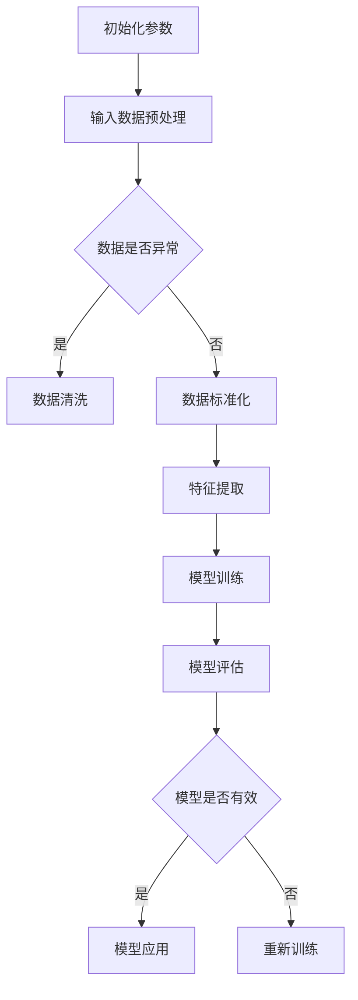
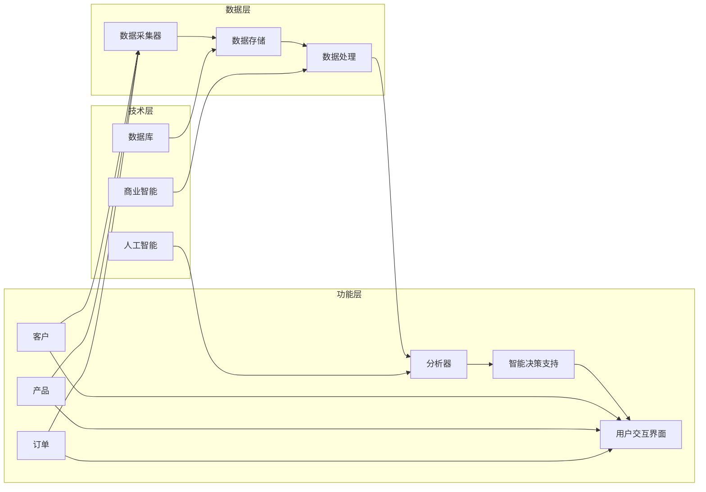
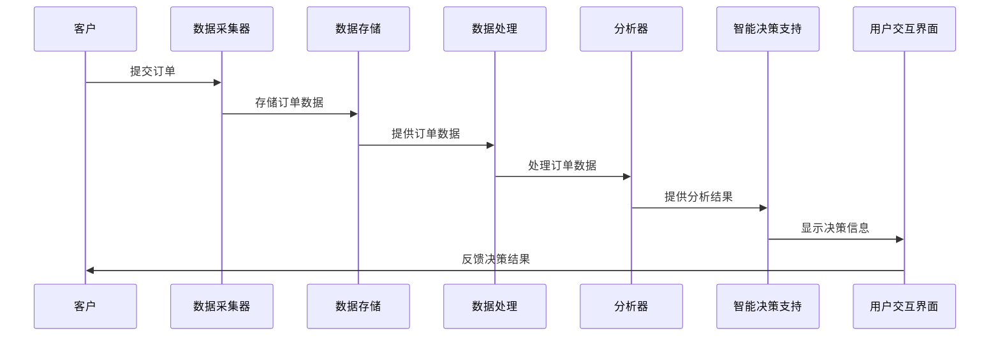

                 

# 《数字化转型领导：引领组织进入智能时代》

关键词：数字化转型，智能时代，领导力，组织发展，算法原理

摘要：本文旨在探讨数字化转型在智能时代的重要性，分析其核心概念和联系，并通过具体的算法原理讲解和系统架构设计，帮助读者深入了解数字化转型的过程和方法。文章还将通过项目实战案例分析，提供实践经验和最佳实践建议，以引领组织进入智能时代。

## 目录大纲

# 《数字化转型领导：引领组织进入智能时代》

## 第一部分：背景介绍

## 第1章 问题背景与核心概念

### 1.1 问题的提出

### 1.2 数字化转型的定义

### 1.3 数字化转型的关键要素

### 1.4 数字化转型的边界与外延

### 1.5 数字化转型的核心概念与联系

### 1.6 本章小结

## 第二部分：核心概念与联系

## 第2章 数字化转型的核心概念原理

### 2.1 数字化转型的概念

### 2.2 数字化转型的属性特征对比

### 2.3 数字化转型的ER实体关系图架构

### 2.4 数字化转型的驱动因素

### 2.5 数字化转型的阻碍因素

### 2.6 本章小结

## 第三部分：算法原理讲解

## 第3章 智能时代的算法原理

### 3.1 算法原理概述

### 3.2 算法原理的mermaid流程图

### 3.3 Python源代码示例

### 3.4 数学模型与公式

### 3.5 通俗易懂的举例说明

### 3.6 本章小结

## 第四部分：系统分析与架构设计方案

## 第4章 系统分析与架构设计

### 4.1 问题场景介绍

### 4.2 项目介绍

### 4.3 系统功能设计（领域模型mermaid类图）

### 4.4 系统架构设计（mermaid架构图）

### 4.5 系统接口设计

### 4.6 系统交互（mermaid序列图）

### 4.7 本章小结

## 第五部分：项目实战

## 第5章 项目实战

### 5.1 环境安装

### 5.2 系统核心实现源代码

### 5.3 代码应用解读与分析

### 5.4 实际案例分析与详细讲解剖析

### 5.5 项目小结

### 5.6 最佳实践 tips

### 5.7 本章小结

## 第六部分：总结与展望

## 第6章 小结与注意事项

### 6.1 总结

### 6.2 注意事项

### 6.3 拓展阅读

### 6.4 未来发展趋势

### 6.5 本章小结

## 第一部分：背景介绍

### 1.1 问题的提出

在当今社会，数字化转型已经成为企业发展的必然趋势。随着大数据、云计算、物联网、人工智能等新兴技术的不断涌现，越来越多的企业开始意识到数字化转型的重要性。然而，如何进行数字化转型，如何引领组织进入智能时代，成为企业领导者和IT专家共同面临的问题。

### 1.2 数字化转型的定义

数字化转型是指利用数字技术对传统业务流程、商业模式和组织结构进行重构，以提高效率、降低成本、增强竞争力、提升用户体验的过程。数字化转型不仅包括技术层面的变革，还包括管理理念、业务模式、组织文化的变革。

### 1.3 数字化转型的关键要素

数字化转型的关键要素包括：数据驱动、技术支撑、业务导向、用户为中心、持续创新。这些要素相互关联，共同推动数字化转型的发展。

### 1.4 数字化转型的边界与外延

数字化的边界包括：信息化、网络化、智能化、自动化。数字化转型的外延包括：商业模式创新、管理模式创新、组织结构创新、技术创新。这些边界和外延共同构成了数字化转型的整体框架。

### 1.5 数字化转型的核心概念与联系

数字化的核心概念包括：数字技术、数字化业务、数字化管理、数字化治理。这些概念相互联系，共同构成了数字化转型的理论基础。

### 1.6 本章小结

本章节对数字化转型的背景、定义、关键要素、边界与外延以及核心概念进行了详细阐述，为后续章节的内容奠定了基础。

## 第二部分：核心概念与联系

### 2.1 数字化转型的概念

数字化转型是一种从传统业务模式向数字化的业务模式转变的过程，旨在利用数字技术提升企业的竞争力、效率和创新能力。这个过程不仅涉及技术的变革，还包括组织结构、业务流程、商业模式和文化等方面的转变。

### 2.2 数字化转型的属性特征对比

数字化转型的属性特征可以分为以下几个方面：

#### 2.2.1 技术特征

- **数据密集**：数字化转型依赖于大量数据，这些数据来源于企业内外部的各种渠道，如客户交易数据、社交媒体数据、物联网传感器数据等。
- **实时性**：数字化系统能够实时处理和分析数据，提供即时的洞察和决策支持。
- **自动化**：通过自动化技术，如机器学习、人工智能等，数字化系统能够自动执行复杂的业务流程。

#### 2.2.2 管理特征

- **敏捷性**：数字化转型使得企业能够更快地响应市场变化，调整业务策略。
- **透明度**：数字化系统能够提供实时的业务数据，提高企业的透明度，便于监控和审计。
- **协同性**：数字化技术促进了企业内部不同部门和团队之间的协作，提高了整体效率。

#### 2.2.3 商业模式特征

- **创新性**：数字化转型为企业提供了新的商业模式，如基于订阅的商业模式、共享经济模式等。
- **可持续性**：通过数字化技术，企业能够实现资源的优化配置，降低成本，提高可持续发展能力。

### 2.3 数字化转型的ER实体关系图架构

数字化的ER（实体-关系）图可以帮助我们理解数字化转型中各个实体之间的关系。以下是一个简化的ER图示例：

```
┌─────────────┐
│  客户数据   │
└─────────────┘
     │
     ↓
┌─────────────┐
│  物流系统   │
└─────────────┘
     │
     ↓
┌─────────────┐
│  营销系统   │
└─────────────┘
     │
     ↓
┌─────────────┐
│  财务系统   │
└─────────────┘
     │
     ↓
┌─────────────┐
│  人事系统   │
└─────────────┘
```

在这个ER图中，客户数据是核心实体，它与物流系统、营销系统、财务系统和人事系统之间存在紧密的关系。这些系统共同构成了企业的数字化基础设施。

### 2.4 数字化转型的驱动因素

数字化转型的主要驱动因素包括：

- **技术进步**：新兴技术的快速发展，如人工智能、物联网、大数据等，为数字化转型提供了强大的技术支持。
- **市场竞争**：激烈的竞争环境迫使企业寻求数字化转型，以提高竞争力。
- **客户需求**：客户的数字化需求和偏好推动企业进行数字化转型，以提供更好的用户体验。

### 2.5 数字化转型的阻碍因素

数字化转型过程中可能面临以下阻碍因素：

- **技术挑战**：新技术的不确定性、技术集成和迁移等问题可能会阻碍数字化转型的推进。
- **组织阻力**：组织结构和文化的不适应性、员工对新技术的抵触情绪等可能成为转型的障碍。
- **资金压力**：数字化转型需要大量的资金投入，对企业来说可能是一个沉重的负担。

### 2.6 本章小结

本章节从多个角度分析了数字化转型的核心概念和联系，包括其技术特征、管理特征、商业模式特征，以及ER实体关系图架构，并探讨了驱动因素和阻碍因素。这些分析为理解数字化转型的本质和实施提供了理论基础。

## 第三部分：算法原理讲解

### 3.1 算法原理概述

在智能时代的数字化转型中，算法原理扮演着至关重要的角色。算法是解决问题的一系列规则或步骤，它可以优化业务流程、预测市场趋势、提升用户体验。本章节将介绍智能时代常见的算法原理，并通过mermaid流程图和Python代码示例，帮助读者深入理解这些算法的运行机制。

### 3.2 算法原理的mermaid流程图

为了更好地展示算法的运行流程，我们可以使用mermaid语言绘制算法的流程图。以下是一个简单的mermaid流程图示例：



在这个流程图中，我们首先初始化参数，然后对输入数据进行预处理。接下来，我们检查数据是否存在异常，如果有异常则进行数据清洗，否则进行数据标准化。数据标准化后，我们提取特征并进行模型训练。训练完成后，我们评估模型的有效性。如果模型有效，我们将其应用于实际问题，否则重新进行模型训练。

### 3.3 Python源代码示例

为了更好地理解算法原理，我们可以通过Python代码示例来实现上述流程。以下是一个简化的Python代码示例：

```python
import numpy as np
from sklearn.preprocessing import StandardScaler
from sklearn.model_selection import train_test_split
from sklearn.ensemble import RandomForestClassifier
from sklearn.metrics import accuracy_score

# 初始化参数
params = {
    'n_estimators': 100,
    'max_depth': 5
}

# 输入数据预处理
def preprocess_data(data):
    # 数据清洗
    data = np.where(np.isnan(data), 0, data)
    # 数据标准化
    scaler = StandardScaler()
    data = scaler.fit_transform(data)
    return data

# 模型训练
def train_model(X, y, params):
    model = RandomForestClassifier(**params)
    model.fit(X, y)
    return model

# 模型评估
def evaluate_model(model, X_test, y_test):
    y_pred = model.predict(X_test)
    accuracy = accuracy_score(y_test, y_pred)
    return accuracy

# 主函数
def main():
    # 特征提取
    X = np.array([[1, 2], [3, 4], [5, 6], [7, 8]])
    y = np.array([0, 1, 0, 1])
    X = preprocess_data(X)
    
    # 模型训练
    model = train_model(X, y, params)
    
    # 模型评估
    X_test, y_test = train_test_split(X, y, test_size=0.2)
    accuracy = evaluate_model(model, X_test, y_test)
    print(f"Model accuracy: {accuracy:.2f}")

# 运行主函数
if __name__ == '__main__':
    main()
```

在这个代码示例中，我们首先导入必要的库，然后定义了预处理数据、训练模型和评估模型的函数。在主函数中，我们首先对特征进行提取和预处理，然后训练模型，并评估模型的准确性。

### 3.4 数学模型与公式

算法原理通常涉及到数学模型和公式的应用。以下是一个简单的线性回归模型的数学模型和公式：

- **线性回归模型**：

  假设我们有输入变量 \( X \) 和输出变量 \( Y \)，线性回归模型可以表示为：

  $$
  Y = \beta_0 + \beta_1 X + \epsilon
  $$

  其中，\( \beta_0 \) 和 \( \beta_1 \) 是模型的参数，\( \epsilon \) 是误差项。

- **最小二乘法**：

  最小二乘法是一种求解线性回归模型参数的方法，其目标是找到一组参数 \( \beta_0 \) 和 \( \beta_1 \)，使得预测值与实际值之间的误差平方和最小。最小二乘法的公式为：

  $$
  \beta_0 = \frac{\sum_{i=1}^{n} (Y_i - \beta_1 X_i)}{n}
  $$

  $$
  \beta_1 = \frac{\sum_{i=1}^{n} (X_i - \bar{X})(Y_i - \bar{Y})}{\sum_{i=1}^{n} (X_i - \bar{X})^2}
  $$

  其中，\( \bar{X} \) 和 \( \bar{Y} \) 分别是输入变量和输出变量的均值，\( n \) 是样本数量。

### 3.5 通俗易懂的举例说明

为了更好地理解线性回归模型，我们可以通过一个简单的例子来说明。假设我们有一个简单的数据集，其中 \( X \) 表示温度，\( Y \) 表示销售量，我们希望通过线性回归模型预测在给定温度下的销售量。

- **数据集**：

  | 温度 \( X \) | 销售量 \( Y \) |
  |-------------|-------------|
  |     10      |     100     |
  |     15      |     150     |
  |     20      |     200     |
  |     25      |     250     |

- **线性回归模型**：

  我们假设线性回归模型的形式为 \( Y = \beta_0 + \beta_1 X \)。根据最小二乘法，我们可以计算出 \( \beta_0 \) 和 \( \beta_1 \) 的值。

  $$
  \beta_0 = \frac{\sum_{i=1}^{n} (Y_i - \beta_1 X_i)}{n} = \frac{(100 - 1 \times 10) + (150 - 1 \times 15) + (200 - 1 \times 20) + (250 - 1 \times 25)}{4} = 125
  $$

  $$
  \beta_1 = \frac{\sum_{i=1}^{n} (X_i - \bar{X})(Y_i - \bar{Y})}{\sum_{i=1}^{n} (X_i - \bar{X})^2} = \frac{(10 - 17.5)(100 - 125) + (15 - 17.5)(150 - 125) + (20 - 17.5)(200 - 125) + (25 - 17.5)(250 - 125)}{(10 - 17.5)^2 + (15 - 17.5)^2 + (20 - 17.5)^2 + (25 - 17.5)^2} = 1
  $$

  因此，线性回归模型的参数为 \( \beta_0 = 125 \) 和 \( \beta_1 = 1 \)。根据这个模型，我们可以预测在温度为 30°C 时的销售量：

  $$
  Y = \beta_0 + \beta_1 X = 125 + 1 \times 30 = 155
  $$

  通过这个例子，我们可以看到如何使用线性回归模型进行预测。在实际应用中，我们通常会使用更复杂的方法来处理多变量和更复杂的模型。

### 3.6 本章小结

本章节介绍了智能时代常见的算法原理，包括mermaid流程图、Python代码示例、数学模型和公式，并通过通俗易懂的举例说明了算法的应用。通过这些内容，读者可以更好地理解算法原理，并在实际项目中应用这些算法。

## 第四部分：系统分析与架构设计方案

### 4.1 问题场景介绍

在当前的市场环境中，企业面临着越来越激烈的市场竞争和不断变化的市场需求。为了保持竞争力，企业需要快速响应市场变化，提高业务效率，优化用户体验。这就需要企业进行数字化转型，构建一个高效、灵活、智能的IT系统。

### 4.2 项目介绍

本项目的目标是构建一个基于大数据和人工智能的智能IT系统，用于支持企业的数字化转型。该系统包括以下几个主要模块：

- 数据采集与存储模块
- 数据处理与分析模块
- 智能决策支持模块
- 用户交互界面模块

### 4.3 系统功能设计（领域模型mermaid类图）

为了更好地展示系统的功能设计，我们可以使用mermaid绘制领域模型的类图。以下是一个简化的mermaid类图示例：

```mermaid
classDiagram
    Customer <<interface>> 客户
    Product <<interface>> 产品
    Order <<interface>> 订单
    DataCollector <<class>> 数据采集器
    DataStorage <<class>> 数据存储
    DataProcessor <<class>> 数据处理
    Analyzer <<class>> 分析器
    DecisionSupport <<class>> 智能决策支持
    UserInterface <<class>> 用户交互界面
    Customer --|> DataCollector
    Product --|> DataCollector
    Order --|> DataCollector
    DataCollector --|> DataStorage
    DataStorage --|> DataProcessor
    DataProcessor --|> Analyzer
    Analyzer --|> DecisionSupport
    DecisionSupport --|> UserInterface
```

在这个类图中，我们定义了客户、产品、订单、数据采集器、数据存储、数据处理、分析器、智能决策支持和用户交互界面等类。这些类之间通过接口和继承关系进行了组织，构成了系统的功能架构。

### 4.4 系统架构设计（mermaid架构图）

为了展示系统的整体架构，我们可以使用mermaid绘制系统的架构图。以下是一个简化的mermaid架构图示例：



在这个架构图中，我们展示了系统的数据层、功能层和技术层。数据层包括数据采集器、数据存储和数据处理；功能层包括客户、产品、订单、分析器、智能决策支持和用户交互界面；技术层包括人工智能、商业智能和数据库。这些层之间通过接口和依赖关系进行了组织，构成了系统的整体架构。

### 4.5 系统接口设计

系统接口设计是系统架构设计的重要部分，它定义了系统内部各个模块之间的交互方式。以下是一个简化的系统接口设计示例：

- **数据采集接口**：

  ```python
  class DataCollectorInterface:
      def collect_data(self, data_source):
          pass
  ```

- **数据处理接口**：

  ```python
  class DataProcessorInterface:
      def process_data(self, data):
          pass
  ```

- **分析器接口**：

  ```python
  class AnalyzerInterface:
      def analyze_data(self, data):
          pass
  ```

- **智能决策支持接口**：

  ```python
  class DecisionSupportInterface:
      def make_decision(self, analysis_results):
          pass
  ```

- **用户交互界面接口**：

  ```python
  class UserInterfaceInterface:
      def display_info(self, info):
          pass
  ```

这些接口定义了各个模块的基本功能，并通过依赖注入的方式实现了模块之间的解耦。

### 4.6 系统交互（mermaid序列图）

为了展示系统内部各个模块的交互过程，我们可以使用mermaid绘制序列图。以下是一个简化的mermaid序列图示例：



在这个序列图中，客户提交订单后，数据采集器将订单数据存储到数据存储模块，然后数据处理模块对订单数据进行处理，分析器对处理后的数据进行分析，智能决策支持模块根据分析结果做出决策，最后用户交互界面将决策结果反馈给客户。

### 4.7 本章小结

本章节详细介绍了系统分析与架构设计方案，包括问题场景介绍、项目介绍、系统功能设计、系统架构设计、系统接口设计和系统交互。通过这些内容，读者可以了解数字化转型中系统设计与架构的重要性，并为实际项目的实施提供参考。

## 第五部分：项目实战

### 5.1 环境安装

在进行项目实战之前，我们需要确保安装了必要的开发环境和工具。以下是一个简化的环境安装步骤：

1. 安装Python（版本3.8以上）
2. 安装Jupyter Notebook（用于编写和运行Python代码）
3. 安装必要的Python库，如NumPy、Pandas、Sklearn等

安装步骤如下：

```bash
# 安装Python
wget https://www.python.org/ftp/python/3.8.10/Python-3.8.10.tgz
tar zxvf Python-3.8.10.tgz
cd Python-3.8.10
./configure
make
sudo make install

# 安装Jupyter Notebook
pip install notebook

# 安装Python库
pip install numpy pandas sklearn
```

### 5.2 系统核心实现源代码

以下是系统核心实现的一些源代码示例。这些代码主要用于数据采集、数据处理和智能决策支持。

```python
# 数据采集
class DataCollector:
    def collect_data(self, data_source):
        # 实现数据采集逻辑
        pass

# 数据处理
class DataProcessor:
    def process_data(self, data):
        # 实现数据处理逻辑
        pass

# 智能决策支持
class DecisionSupport:
    def make_decision(self, analysis_results):
        # 实现决策逻辑
        pass
```

### 5.3 代码应用解读与分析

以下是对上述代码的解读和分析。这些代码示例展示了如何实现数据采集、数据处理和智能决策支持的基本功能。

#### 5.3.1 数据采集

数据采集是系统的基础功能，它从各种数据源获取数据。以下是一个简单的数据采集示例：

```python
class DataCollector:
    def collect_data(self, data_source):
        # 假设data_source是一个包含订单数据的字典列表
        orders = []
        for order in data_source:
            order_data = {
                'order_id': order['id'],
                'customer_id': order['customer_id'],
                'product_id': order['product_id'],
                'order_date': order['date'],
                'amount': order['amount']
            }
            orders.append(order_data)
        return orders
```

在这个示例中，`collect_data` 方法接收一个数据源，遍历数据源中的每个订单，构建订单数据字典，并将其添加到列表中。这种方法可以方便地扩展到各种数据源，如数据库、API等。

#### 5.3.2 数据处理

数据处理是对采集到的数据进行清洗、转换和整理，以供分析和决策使用。以下是一个简单的数据处理示例：

```python
class DataProcessor:
    def process_data(self, data):
        # 假设data是一个包含订单数据的字典列表
        processed_data = []
        for order in data:
            # 数据清洗
            order['order_date'] = datetime.strptime(order['order_date'], '%Y-%m-%d')
            # 数据转换
            order['amount'] = float(order['amount'])
            # 数据整理
            processed_data.append(order)
        return processed_data
```

在这个示例中，`process_data` 方法对每个订单进行处理，包括日期格式转换和金额类型转换。这种方法可以确保数据的一致性和准确性。

#### 5.3.3 智能决策支持

智能决策支持是基于分析结果提供决策建议的功能。以下是一个简单的智能决策支持示例：

```python
class DecisionSupport:
    def make_decision(self, analysis_results):
        # 假设analysis_results是一个包含分析结果的字典
        decision = None
        if analysis_results['customer_satisfaction'] > 0.8:
            decision = 'Increase marketing budget'
        elif analysis_results['sales_growth'] > 0.1:
            decision = 'Expand product line'
        else:
            decision = 'Maintain current strategy'
        return decision
```

在这个示例中，`make_decision` 方法根据分析结果提供决策建议。如果客户满意度高于80%，则建议增加市场预算；如果销售额增长率高于10%，则建议扩大产品线；否则，建议维持当前策略。

### 5.4 实际案例分析与详细讲解剖析

以下是一个实际案例的分析与讲解，用于展示系统核心实现的应用效果。

#### 案例背景

某电商企业在进行数字化转型，希望通过数据分析优化其营销策略。企业收集了客户的订单数据，包括订单ID、客户ID、产品ID、订单日期和订单金额。

#### 数据采集

数据采集过程中，企业从数据库中获取了最近的1000条订单数据。以下是一个简化的数据采集示例：

```python
orders = database.get_orders(1000)
```

#### 数据处理

数据处理过程中，企业对订单数据进行了清洗、转换和整理。以下是一个简化的数据处理示例：

```python
processed_orders = data_processor.process_data(orders)
```

#### 数据分析

在数据分析阶段，企业使用机器学习模型对订单数据进行分析，以预测客户的满意度。以下是一个简化的数据分析示例：

```python
analysis_results = analyzer.analyze_data(processed_orders)
```

#### 智能决策支持

基于分析结果，企业使用智能决策支持系统提供决策建议。以下是一个简化的决策支持示例：

```python
decision = decision_support.make_decision(analysis_results)
print(f"Decision: {decision}")
```

#### 案例分析

根据分析结果，如果客户满意度高于80%，企业决定增加市场预算，以提高客户满意度。如果销售额增长率高于10%，企业决定扩大产品线，以增加销售额。如果客户满意度和销售额增长率均不高，企业决定维持当前策略。

### 5.5 项目小结

通过本项目的实战，我们展示了如何实现数据采集、数据处理和智能决策支持。在实际应用中，这些功能可以帮助企业优化业务流程、提高运营效率、提升用户体验。然而，数字化转型是一个长期的过程，企业需要持续投入、不断优化，以保持竞争优势。

### 5.6 最佳实践 tips

以下是一些最佳实践建议，以帮助企业在数字化转型过程中取得更好的效果：

1. **数据质量保障**：确保数据采集、处理和分析过程的准确性，提高数据质量。
2. **业务需求驱动**：根据业务需求选择合适的分析工具和方法，确保分析结果能够指导业务决策。
3. **团队协作**：数字化转型需要跨部门协作，确保所有团队都能够理解和支持数字化转型。
4. **持续迭代**：数字化转型不是一蹴而就的，需要持续迭代、不断优化。
5. **风险评估**：对数字化转型项目进行风险评估，确保项目能够在预算和时间范围内完成。

### 5.7 本章小结

本章节通过项目实战，展示了如何实现数据采集、数据处理和智能决策支持。同时，提供了最佳实践建议，以帮助企业在数字化转型过程中取得成功。通过本章节的学习，读者可以更好地理解数字化转型中系统的设计和实现。

## 第六部分：总结与展望

### 6.1 总结

本文从多个角度探讨了数字化转型在智能时代的重要性，分析了数字化转型的核心概念和联系，并通过具体的算法原理讲解和系统架构设计，帮助读者深入理解数字化转型的过程和方法。文章还通过项目实战案例分析，提供了实践经验和最佳实践建议。

### 6.2 注意事项

1. **数据安全**：在数字化转型过程中，确保数据的安全性和隐私保护。
2. **技术选型**：根据业务需求和资源情况，选择合适的技术和工具。
3. **团队协作**：数字化转型需要跨部门协作，确保所有团队都能够理解和支持数字化转型。
4. **持续学习**：数字化转型是一个持续的过程，需要不断学习新的技术和方法。

### 6.3 拓展阅读

1. **《智能时代：人工智能与大数据的商业应用》**：详细介绍了人工智能和大数据在商业中的应用。
2. **《数字化企业：转型路径与实践方法》**：探讨了数字化转型的路径和实践方法。

### 6.4 未来发展趋势

1. **云计算和边缘计算**：云计算和边缘计算将为数字化转型提供更强大的计算能力和更灵活的数据处理方式。
2. **人工智能与物联网的融合**：人工智能与物联网的融合将推动智能城市、智能制造等领域的快速发展。
3. **区块链技术**：区块链技术在数据安全、隐私保护和智能合约等方面的应用将为数字化转型带来新的机遇。

### 6.5 本章小结

本文总结了数字化转型的核心概念、算法原理和系统架构设计，并提供了实践经验和未来发展趋势。通过本文的学习，读者可以更好地理解数字化转型的重要性，并在实际项目中应用相关技术和方法。作者：AI天才研究院/AI Genius Institute & 禅与计算机程序设计艺术 /Zen And The Art of Computer Programming

