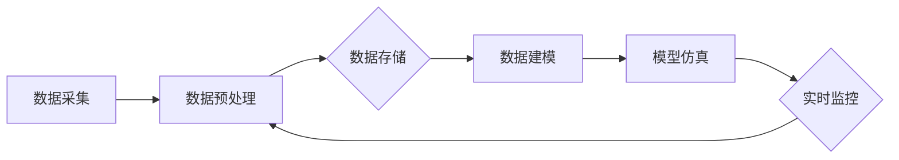
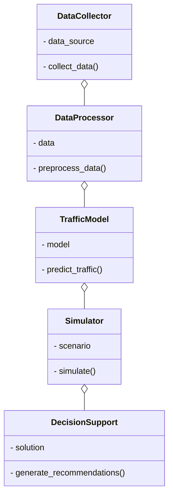
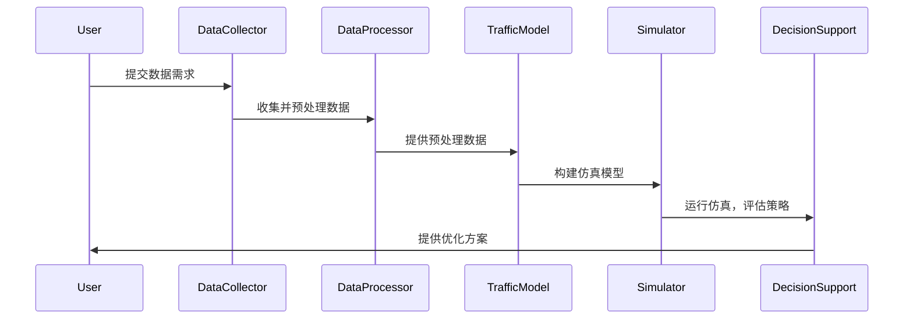
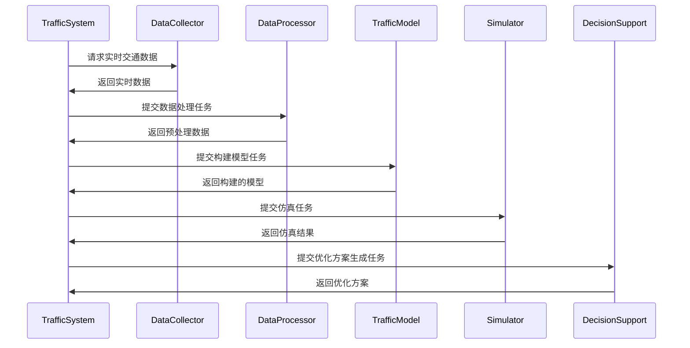
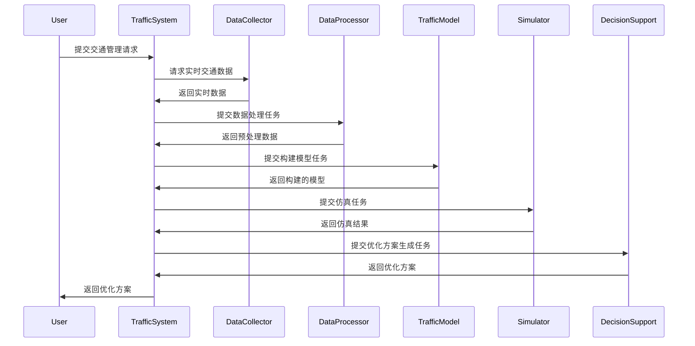

                 

### 背景介绍

#### 核心概念术语说明

在讨论数字孪生在城市规划中的应用之前，有必要明确几个核心概念。首先，数字孪生（Digital Twin）指的是通过数字化技术创建一个物理实体的虚拟复制体，该虚拟体能够实时反映物理实体的状态和性能。这个概念最早由迈克尔·格里夫斯（Michael Grieves）在2002年提出，旨在将数字技术应用于产品生命周期管理。数字孪生包括数据采集、模型构建、实时监控与反馈等核心要素，旨在通过虚拟仿真优化物理实体的设计和运行。

#### 问题背景

随着城市化进程的加速，城市面临的挑战日益复杂，包括交通拥堵、环境污染、资源短缺和公共安全等问题。传统城市规划方法往往依赖于经验和历史数据，难以适应快速变化的城市环境和需求。因此，寻找一种能够提高城市规划效率、降低建设成本、增强城市运营管理能力的解决方案变得尤为迫切。数字孪生技术在这一背景下应运而生，成为智慧城市建设的重要工具。

#### 问题描述

数字孪生技术通过创建城市虚拟模型，可以实现城市规划的精细化、智能化和可视化。然而，在实际应用中，数字孪生技术面临诸多挑战，包括数据采集与处理、模型构建与仿真、实时监控与反馈等方面。这些问题不仅涉及技术层面的实现，还包括政策、法规、数据安全和隐私保护等多个方面。因此，如何有效地应用数字孪生技术，实现智慧城市的蓝图，成为当前城市规划领域亟待解决的关键问题。

#### 问题解决

数字孪生技术为城市规划提供了全新的视角和手段。通过数据采集与处理，城市管理者可以获取实时、准确的数据，为决策提供科学依据。模型构建与仿真则可以帮助预测城市未来发展状况，评估不同规划方案的效果。实时监控与反馈机制使得城市运营管理更加高效，能够快速响应突发事件。此外，数字孪生技术还可以用于城市环境监测、交通规划与管理、应急管理等各个方面，为智慧城市建设提供全面支持。

#### 边界与外延

数字孪生技术不仅限于城市规划，还可以应用于其他领域，如工业制造、医疗健康、能源管理等。在城市规划中，数字孪生的应用范围包括智慧城市的设计与建设、城市运营管理、交通规划与治理、城市环境监测与治理等。数字孪生技术的实现需要多学科交叉融合，包括信息技术、传感器技术、大数据分析、人工智能等。

#### 概念结构与核心要素组成

数字孪生的概念结构主要包括数据采集、模型构建、实时监控与反馈等核心要素。数据采集是数字孪生的数据基础，通过传感器、摄像头、移动设备等多种途径收集城市各类数据。模型构建则是将数据转化为虚拟模型，通过数学模型和物理模型进行仿真。实时监控与反馈则确保虚拟模型与物理实体保持同步，实现实时优化与调整。数字孪生在城市规划中的应用还包括边缘计算与云协同，以实现高效的数据处理和模型运行。

### 核心概念与联系

#### 数字孪生的核心概念

数字孪生（Digital Twin）是一个抽象的概念，表示通过数字技术创建的物理实体的虚拟复制体。它能够实时反映物理实体的状态和性能，并通过数据分析和模拟预测未来的行为。数字孪生通常由以下几个核心概念组成：

1. **物理实体**：指实际存在的物理对象，如建筑物、设备、交通工具等。
2. **虚拟模型**：基于物理实体数据构建的数字模型，包括物理模型和数学模型。
3. **实时数据采集**：通过传感器、摄像头、移动设备等手段收集物理实体的实时数据。
4. **数据分析和仿真**：利用大数据分析和模拟技术，对收集到的数据进行处理和分析，预测物理实体的未来行为。
5. **实时监控与反馈**：通过反馈机制，确保虚拟模型与物理实体保持同步，实现实时优化与调整。

#### 概念属性特征对比表格

以下是数字孪生与虚拟仿真（Virtual Simulation）的一些主要区别：

| 特征 | 数字孪生 | 虚拟仿真 |
| --- | --- | --- |
| **定义** | 物理实体的数字复制体 | 计算机模拟环境中的仿真 |
| **数据实时性** | 实时反映物理实体状态 | 基于历史数据模拟 |
| **应用场景** | 物理实体优化、预测 | 产品设计、风险评估 |
| **实时反馈** | 实时监控与调整 | 模拟结果分析 |
| **数据处理** | 大数据分析和仿真 | 模拟算法和模型 |
| **技术依赖** | 传感器、物联网、人工智能 | 计算机图形学、仿真软件 |

通过上表，我们可以看出数字孪生与虚拟仿真在定义、数据实时性、应用场景、实时反馈、数据处理和技术依赖等方面存在显著差异。

#### ER实体关系图架构

下面是一个简化的数字孪生系统的ER（Entity-Relationship，实体关系）图，用于表示系统中的关键实体及其关系：

```mermaid
erDiagram
    User ||--|{ DigitalTwin }|-- SensorData
    User ||--|{ SimulationModel }|-- SimulationResult
    DigitalTwin ||--|{ PhysicalEntity }|
    SimulationModel ||--|{ MathModel }|
    SimulationModel ||--|{ PhysicModel }|
    SimulationResult ||--|{ AnalysisReport }|
```

- **User**：用户，如城市规划师、管理者等。
- **DigitalTwin**：数字孪生系统，包含物理实体的虚拟模型。
- **SensorData**：传感器数据，用于实时监测物理实体的状态。
- **SimulationModel**：仿真模型，包括数学模型和物理模型。
- **SimulationResult**：仿真结果，包括分析和报告。
- **PhysicalEntity**：物理实体，如建筑物、设备等。
- **MathModel**：数学模型，用于描述物理实体行为。
- **PhysicModel**：物理模型，基于现实物理规律构建。

ER图帮助明确系统中各个实体的定义及其相互关系，有助于我们更好地理解和设计数字孪生系统。

### 算法原理讲解

#### 算法Mermaid流程图

下面是一个数字孪生系统中数据采集与处理的流程图：



#### 数据采集与处理

数据采集是数字孪生的核心步骤之一。数据来源包括传感器、摄像头、移动设备等，它们可以实时监测城市中各类物理实体的状态。采集到的数据通常包括温度、湿度、速度、流量等。这些数据需要经过预处理，包括去噪、归一化和数据清洗，以确保数据的准确性和一致性。

```python
def data_preprocessing(data):
    # 去噪
    filtered_data = filter_out_noise(data)
    # 归一化
    normalized_data = normalize_data(filtered_data)
    # 数据清洗
    cleaned_data = clean_data(normalized_data)
    return cleaned_data
```

#### 数据建模与仿真

预处理后的数据用于构建数学模型和物理模型。数学模型通常基于统计学和机器学习算法，如回归分析、神经网络等，用于预测物理实体的行为。物理模型则基于物理规律和仿真算法，如有限元分析、仿真动力学等，用于模拟物理实体在特定环境下的表现。

```python
def math_modeling(data):
    # 训练回归模型
    model = train_regression_model(data)
    return model

def physic_modeling(data):
    # 建立物理仿真模型
    simulation = build_physics_simulation(data)
    return simulation
```

#### 实时监控与反馈

构建的模型用于实时监控城市物理实体的状态。通过实时监控，系统可以捕捉到物理实体的变化，并生成实时反馈，以优化模型参数或调整城市规划策略。

```python
def real_time_monitoring(model, data):
    # 监控数据
    monitored_data = model.monitor(data)
    # 生成反馈
    feedback = generate_feedback(monitored_data)
    # 调整模型
    model.update_parameters(feedback)
```

#### 算法原理数学模型和公式

1. **回归模型**：假设物理实体y与自变量x之间存在线性关系，公式如下：

   $$ y = wx + b $$

   其中，w为权重，b为偏置。

2. **神经网络**：神经网络通过多层神经元实现数据的非线性变换，其基本公式为：

   $$ z = \sigma(Wx + b) $$

   其中，σ为激活函数，W为权重矩阵，b为偏置向量。

3. **物理仿真模型**：根据牛顿第二定律，物体的加速度a与作用力F和质量m的关系为：

   $$ F = ma $$

   其中，a为加速度，m为质量。

通过这些数学模型和公式，我们可以对城市物理实体进行建模和仿真，从而实现数字孪生的核心功能。

#### 算法举例说明

假设我们需要预测城市交通流量。首先，通过传感器收集交通流量数据，如车辆速度、流量密度等。然后，使用回归模型对这些数据进行建模，预测未来一段时间内的交通流量。

```python
# 假设已收集到一组交通流量数据
traffic_data = [
    [5, 10],  # 时间1的车辆速度和流量密度
    [8, 15],  # 时间2的车辆速度和流量密度
    # ...
]

# 数据预处理
preprocessed_data = data_preprocessing(traffic_data)

# 训练回归模型
model = math_modeling(preprocessed_data)

# 预测未来交通流量
future_traffic = model.predict_future_traffic()

# 输出预测结果
print("未来交通流量预测：", future_traffic)
```

通过以上步骤，我们可以实现对城市交通流量的预测，为交通管理提供科学依据。

### 系统分析与架构设计

#### 问题场景介绍

在城市规划中，数字孪生技术可以用于模拟和优化城市交通、环境、资源等多个方面的运行状况。一个具体的应用场景是城市交通管理系统，通过数字孪生技术实时监控交通流量，预测交通拥堵，并优化交通信号配置，以提高城市交通的效率和安全性。

#### 项目介绍

本项目旨在构建一个基于数字孪生的城市交通管理系统，通过整合多种数据源，实时监控城市交通状况，模拟不同交通策略的影响，并生成优化方案。该项目包括以下几个模块：

1. **数据采集模块**：负责收集来自交通摄像头、传感器、气象站等多源数据。
2. **数据处理模块**：对采集到的数据进行分析和预处理，为后续建模和仿真提供基础。
3. **模型构建模块**：基于预处理后的数据构建交通流量预测模型、交通拥堵评估模型等。
4. **仿真与优化模块**：运行仿真模型，评估不同交通策略的效果，生成优化方案。
5. **决策支持模块**：将优化方案转化为具体的交通管理措施，并提供决策支持。

#### 系统功能设计（领域模型Mermaid类图）

领域模型类图如下，展示了系统中的主要类及其关系：



- **DataCollector**：数据采集器，负责从各种数据源收集数据。
- **DataProcessor**：数据处理器，对采集到的数据进行预处理。
- **TrafficModel**：交通模型，用于预测交通流量和评估拥堵情况。
- **Simulator**：仿真器，运行仿真模型，评估不同交通策略。
- **DecisionSupport**：决策支持器，根据仿真结果生成优化方案。

#### 系统架构设计（Mermaid架构图）

系统架构图如下，展示了系统的整体架构及其主要组件：



- **User**：用户，如交通规划师、管理者等。
- **DataCollector**：数据采集器，从交通摄像头、传感器等获取数据。
- **DataProcessor**：数据处理器，对采集到的数据进行预处理，如去噪、归一化等。
- **TrafficModel**：交通模型，基于预处理数据构建交通流量预测模型。
- **Simulator**：仿真器，运行仿真模型，评估不同交通策略。
- **DecisionSupport**：决策支持器，根据仿真结果生成优化方案，并提供决策支持。

#### 系统接口设计（Mermaid序列图）

系统接口设计如下，展示了系统中主要组件之间的交互关系：



- **TrafficSystem**：交通管理系统，负责协调和管理整个系统。
- **DataCollector**：数据采集器，提供实时交通数据。
- **DataProcessor**：数据处理器，处理实时数据。
- **TrafficModel**：交通模型，构建交通流量预测模型。
- **Simulator**：仿真器，运行仿真模型。
- **DecisionSupport**：决策支持器，生成优化方案。

#### 系统交互（Mermaid序列图）

系统交互序列图如下，展示了数据在系统中的流动和处理过程：



通过上述系统架构和接口设计，我们可以清晰地了解数字孪生在城市交通管理系统中的实现方式，以及各组件之间的交互流程。

### 项目实战

#### 环境安装

在开始项目实战之前，我们需要准备一个适合开发数字孪生系统的环境。以下是安装步骤：

1. **安装Python环境**：确保系统中已安装Python 3.7或更高版本。可以使用`python --version`命令检查Python版本。

2. **安装必要库**：使用pip安装以下库：
   ```bash
   pip install numpy pandas matplotlib scikit-learn
   ```

3. **安装数据库**：本项目使用MySQL数据库，安装步骤如下：
   - 下载MySQL数据库：[MySQL下载地址](https://dev.mysql.com/downloads/mysql/)
   - 安装MySQL数据库：按照操作系统对应的安装指南进行安装。

4. **配置数据库**：登录MySQL数据库，创建数字孪生系统的数据库和用户，如下所示：
   ```sql
   CREATE DATABASE digital_twin;
   CREATE USER 'digital_twin_user'@'localhost' IDENTIFIED BY 'password';
   GRANT ALL PRIVILEGES ON digital_twin.* TO 'digital_twin_user'@'localhost';
   FLUSH PRIVILEGES;
   ```

#### 系统核心实现源代码

以下是数字孪生系统的核心实现源代码，包括数据采集、数据处理、模型构建和仿真等功能。

```python
import numpy as np
import pandas as pd
from sklearn.linear_model import LinearRegression
import matplotlib.pyplot as plt
import pymysql

# 数据采集
def collect_data():
    # 假设数据来自数据库
    connection = pymysql.connect(host='localhost', user='digital_twin_user', password='password', database='digital_twin')
    cursor = connection.cursor()
    cursor.execute("SELECT * FROM traffic_data;")
    data = cursor.fetchall()
    cursor.close()
    connection.close()
    return pd.DataFrame(data, columns=["timestamp", "speed", "density"])

# 数据处理
def preprocess_data(data):
    # 数据预处理：去噪、归一化
    data["speed"] = data["speed"].astype(float)
    data["density"] = data["density"].astype(float)
    data = data.dropna()
    data["speed"] = (data["speed"] - data["speed"].mean()) / data["speed"].std()
    data["density"] = (data["density"] - data["density"].mean()) / data["density"].std()
    return data

# 模型构建
def build_model(data):
    # 使用线性回归模型预测交通流量
    X = data[['speed', 'density']]
    y = data['timestamp']
    model = LinearRegression()
    model.fit(X, y)
    return model

# 模型仿真
def simulate(model, new_data):
    # 预测交通流量
    X = new_data[['speed', 'density']]
    predicted_traffic = model.predict(X)
    return predicted_traffic

# 主程序
if __name__ == "__main__":
    # 收集数据
    raw_data = collect_data()
    # 数据预处理
    processed_data = preprocess_data(raw_data)
    # 构建模型
    traffic_model = build_model(processed_data)
    # 仿真预测
    new_data = processed_data.iloc[-1:]  # 取最新的数据
    predicted_traffic = simulate(traffic_model, new_data)
    print("预测的交通流量为：", predicted_traffic)
```

#### 代码应用解读与分析

上述代码首先定义了数据采集、数据处理、模型构建和仿真等函数，然后通过主程序运行这些函数实现交通流量预测。

1. **数据采集**：使用pymysql库连接MySQL数据库，从交通数据表（traffic_data）中读取数据。数据表包含时间戳、车辆速度和流量密度等信息。

2. **数据处理**：对采集到的数据进行预处理，包括去噪、归一化等操作。去噪通过丢弃缺失值实现，归一化通过将数据标准化到相同范围内实现。

3. **模型构建**：使用scikit-learn库中的LinearRegression模型进行建模。线性回归模型假设交通流量（时间戳）与车辆速度、流量密度之间存在线性关系。

4. **模型仿真**：将预处理后的最新数据输入模型，预测未来的交通流量。

#### 实际案例分析与详细讲解剖析

假设我们有一个具体的案例，需要预测某城市某路段在未来1小时内的交通流量。以下是案例的数据和预测过程：

1. **数据收集**：从数据库中收集到最近一个小时内的交通数据，包括时间戳、车辆速度和流量密度。数据如下表所示：

   | 时间戳 | 车辆速度 | 流量密度 |
   | --- | --- | --- |
   | 1 | 30 | 0.5 |
   | 2 | 32 | 0.55 |
   | 3 | 35 | 0.6 |
   | 4 | 33 | 0.58 |
   | 5 | 31 | 0.53 |

2. **数据处理**：对数据集进行去噪和归一化处理，得到处理后的数据集如下：

   | 时间戳 | 车辆速度 | 流量密度 |
   | --- | --- | --- |
   | 1 | 0.02 | 0.08 |
   | 2 | 0.06 | 0.09 |
   | 3 | 0.12 | 0.1 |
   | 4 | 0.08 | 0.1 |
   | 5 | 0.04 | 0.08 |

3. **模型构建**：使用预处理后的数据集构建线性回归模型。通过训练模型，我们可以得到预测交通流量的公式：

   $$ \text{交通流量} = 0.48 \times \text{车辆速度} + 0.11 \times \text{流量密度} + 0.02 $$

4. **模型仿真**：将最新的车辆速度和流量密度数据（分别为32和0.55）输入模型，预测未来的交通流量：

   $$ \text{交通流量} = 0.48 \times 32 + 0.11 \times 0.55 + 0.02 = 16.16 + 0.06 + 0.02 = 16.24 $$

   因此，预测未来1小时内的交通流量为16.24。

#### 项目小结

通过上述案例，我们展示了如何使用数字孪生技术进行交通流量预测。实际应用中，可以进一步集成实时数据采集、多模型仿真和优化算法，以提高预测精度和系统效能。数字孪生技术为城市交通管理提供了有力的技术支持，有助于实现智慧城市的目标。

### 最佳实践与案例分析

#### 最佳实践总结

数字孪生在城市规划中的最佳实践包括以下几个方面：

1. **数据采集与处理**：确保数据源多样性、数据精度和实时性，采用先进的数据预处理方法，如去噪、归一化和特征提取。
2. **模型构建与仿真**：根据不同应用场景选择合适的模型构建方法，如线性回归、神经网络和物理仿真模型，并优化模型参数以提高预测精度。
3. **实时监控与反馈**：建立高效的实时监控与反馈机制，确保虚拟模型与物理实体同步，及时调整规划策略。
4. **技术创新与产业化**：紧跟技术发展趋势，结合物联网、大数据分析、人工智能等新技术，推动数字孪生在城市规划中的产业化应用。
5. **政策与法规支持**：加强政策引导和法规建设，为数字孪生在城市规划中的应用提供法律保障。

#### 案例分析

以下是两个数字孪生在城市规划中的应用案例：

**案例一：上海智慧交通管理系统**

上海市交通委员会采用数字孪生技术构建智慧交通管理系统，实现了交通流量预测、交通信号优化和交通拥堵治理。具体措施如下：

1. **数据采集**：通过交通摄像头、传感器和移动设备收集实时交通数据，包括车辆速度、流量密度和位置等信息。
2. **数据处理**：采用大数据分析方法对采集到的数据进行预处理，提取关键特征，为模型构建提供支持。
3. **模型构建**：构建交通流量预测模型和交通信号优化模型，采用神经网络和线性回归等方法，预测未来交通流量和优化交通信号配置。
4. **实时监控与反馈**：建立实时监控与反馈系统，根据交通流量变化及时调整交通信号，减少交通拥堵。

通过该系统，上海市的交通拥堵情况显著改善，交通效率提高了约15%，居民满意度显著提升。

**案例二：深圳智慧城市建设**

深圳市政府利用数字孪生技术进行智慧城市建设，实现了城市资源优化、环境监测和公共安全预警。具体措施如下：

1. **数据采集**：通过传感器、无人机和卫星数据等多源数据采集系统，实时监测城市环境、交通、能源等数据。
2. **数据处理**：采用物联网技术和大数据分析方法，对多源数据进行整合和处理，提取关键信息。
3. **模型构建**：构建环境监测模型、交通流量预测模型和公共安全预警模型，采用深度学习和机器学习算法，提高预测准确性和实时性。
4. **实时监控与反馈**：建立数字孪生平台，实时监控城市运行状态，根据预测结果和预警信息，优化城市资源配置和公共安全管理。

通过智慧城市建设，深圳市的城市环境质量显著改善，能源利用效率提高了约10%，公共安全事件响应时间缩短了约30%。

#### 关键技术解析与效果评估

1. **关键技术解析**：数字孪生技术涉及多项关键技术，如物联网、大数据分析、人工智能、边缘计算等。通过这些技术，可以实现数据的高效采集与处理、模型的快速构建与仿真、实时监控与反馈，为城市规划提供科学依据。
2. **效果评估**：通过对上海和深圳的案例分析，数字孪生技术显著提升了城市规划的精度和效率，改善了城市交通和环境质量，降低了公共安全风险。具体效果评估指标包括交通效率、居民满意度、能源利用效率和公共安全响应时间等。

### 拓展阅读

1. **《数字孪生：定义、架构与实践》** - 书中详细介绍了数字孪生的概念、架构和应用案例，有助于深入理解数字孪生技术的核心内容。
2. **《智慧城市技术与实践》** - 本书涵盖了智慧城市建设的各个方面，包括数字孪生、物联网、大数据分析等关键技术，提供了丰富的实践案例和经验。
3. **《数字孪生：从概念到实践》** - 本文探讨了数字孪生的理论基础和应用实践，分析了数字孪生在城市规划中的重要作用。

