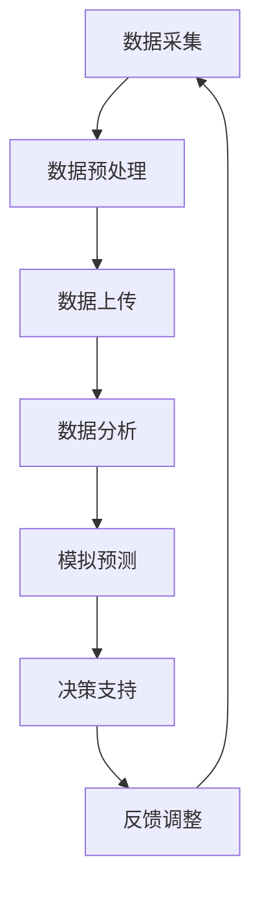
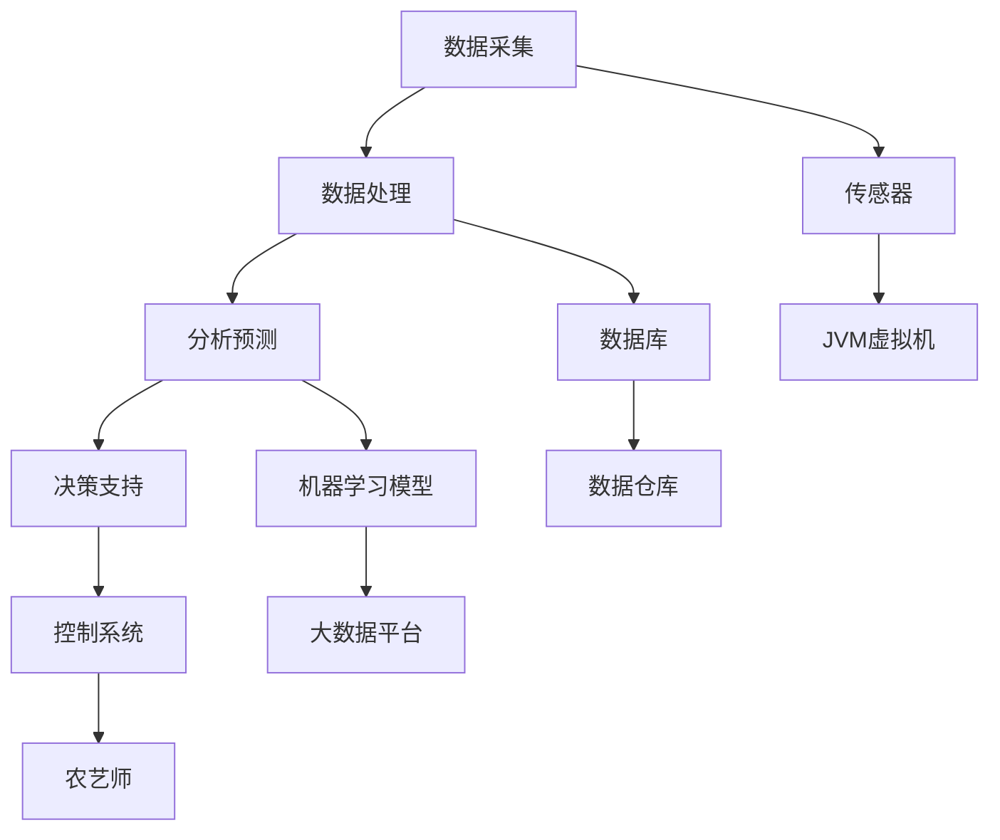
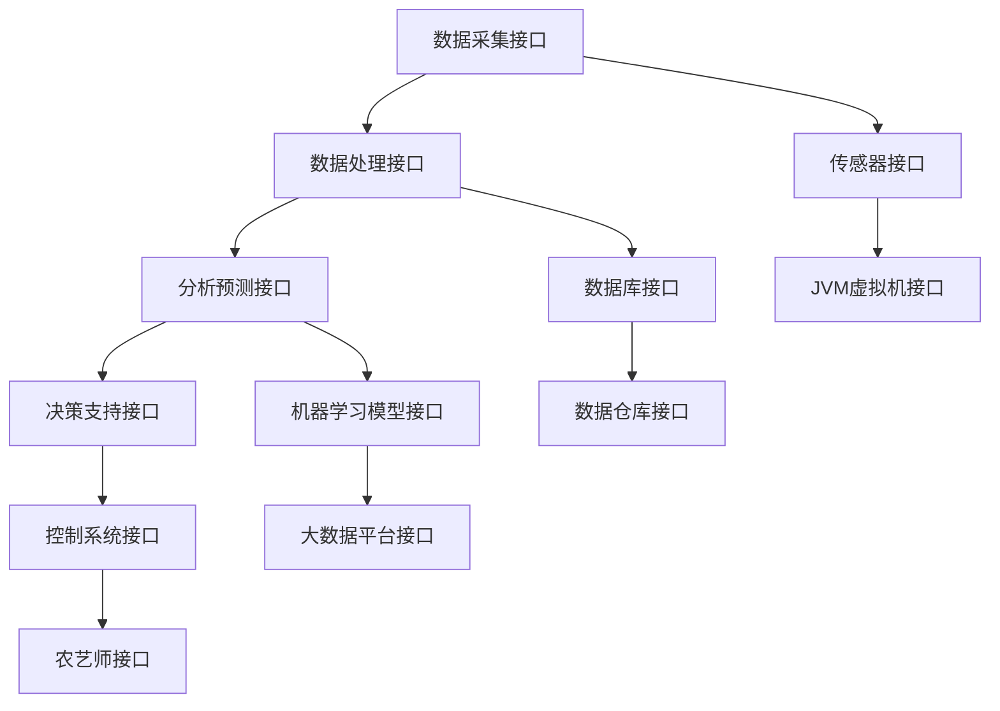
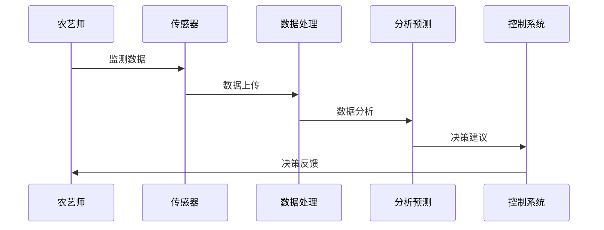

                 

## 数字孪生在智慧农业中的应用：优化农作物生产

### 关键词：数字孪生、智慧农业、农作物生产、优化

### 摘要：随着全球农业面临的资源稀缺、气候变化和人口增长等挑战，智慧农业成为了解决这些问题的有效途径。数字孪生技术作为一种前沿的数字化工具，在智慧农业中扮演着关键角色。本文将探讨数字孪生技术在智慧农业中的应用，特别是如何通过数字孪生优化农作物生产，提高农业生产效率和质量。我们将分步骤分析数字孪生的定义、原理、应用场景、优势与挑战，以及应对策略，旨在为农业领域的技术创新提供有价值的参考。

### 第一部分：背景介绍

#### 核心概念

数字孪生：数字孪生是一种基于物理实体在虚拟空间中创建的数字镜像技术，它可以实时反映实体的状态、行为和性能。数字孪生技术通过传感器、物联网、大数据和人工智能等技术手段，实现物理世界与虚拟世界的互联互通。

智慧农业：智慧农业是指利用数字孪生、物联网、大数据、人工智能等现代信息技术，实现农业生产过程的智能化管理。智慧农业的目标是通过精准的监测、预测和优化，提高农作物的产量和质量，降低生产成本，实现农业的可持续发展。

优化农作物生产：优化农作物生产是通过应用数字孪生技术，对农作物生长环境进行实时监测和数据分析，从而实现对农作物生长过程的精准控制，提高产量和质量，降低生产成本。

#### 问题背景

随着全球人口的增长和气候变化的影响，传统农业生产方式已经难以满足现代社会的需求。农业生产面临着资源稀缺、环境污染、病虫害频发等问题。为了提高农业生产效率，降低生产成本，保障食品安全，智慧农业成为了现代农业发展的必然选择。

#### 问题描述

数字孪生在智慧农业中具有广泛的应用前景，可以通过模拟、预测和优化农业生产过程，实现农作物的精准管理。然而，数字孪生技术在智慧农业中的应用还面临一些挑战，如数据采集的准确性、数据分析的实时性、系统的稳定性和可靠性等。

#### 问题解决

通过数字孪生技术，构建智慧农业系统，实现对农作物生长环境的实时监测、数据分析和决策支持。利用数字孪生技术优化农作物生产过程，提高产量和质量，降低生产成本，实现农业的可持续发展。

#### 边界与外延

数字孪生在智慧农业中的应用范围包括作物种植、灌溉管理、土壤监测、气象预测、病虫害防治等。这些应用场景都需要对农作物生长环境进行实时监测和数据分析，从而实现农作物的精准管理。

#### 概念结构与核心要素组成

- 数字孪生：物理实体的虚拟镜像，包括传感器数据采集、数据处理与分析、模拟与预测等模块。
- 智慧农业：利用数字孪生、物联网、大数据等技术，实现农业生产过程的智能化管理。
- 优化农作物生产：通过数字孪生技术，实现对农作物生长环境的精准控制，提高产量和质量。

### 第1章：数字孪生与智慧农业概述

#### 1.1 数字孪生：定义与原理

数字孪生是一种基于物理实体在虚拟空间中创建的数字镜像技术。它通过传感器、物联网、大数据和人工智能等技术手段，实现对物理世界的实时监测、数据分析和模拟预测。数字孪生技术具有以下几个核心特点：

- 实时性：数字孪生能够实时反映物理实体的状态、行为和性能，为决策提供及时的数据支持。
- 协同性：数字孪生技术可以实现物理世界与虚拟世界的互联互通，实现多系统、多设备之间的协同工作。
- 可预测性：通过历史数据和实时数据的分析，数字孪生技术可以预测物理实体的未来行为和性能。
- 优化性：数字孪生技术可以通过模拟和预测，优化物理实体的运行状态和性能。
- 自适应能力：数字孪生技术可以根据实时数据和外部环境的变化，自适应调整物理实体的运行策略。

数字孪生技术的基本原理可以分为以下几个步骤：

1. **数据采集**：通过传感器和网络设备，实时采集物理实体的各种数据，如温度、湿度、光照、土壤质量等。
2. **数据传输**：将采集到的数据通过物联网传输到数据处理平台，进行进一步的分析和处理。
3. **数据处理**：对传输过来的数据进行清洗、去噪、格式化等处理，使其符合分析的要求。
4. **数据分析**：利用大数据分析和人工智能算法，对处理后的数据进行深入分析，提取有价值的信息。
5. **模拟与预测**：基于分析结果，利用模拟算法和预测模型，对物理实体的未来行为和性能进行预测。
6. **决策支持**：将预测结果和模拟结果反馈给决策者，为其提供科学依据，指导实际操作。

数字孪生在农业领域的应用场景非常广泛，包括作物种植、灌溉管理、土壤监测、气象预测、病虫害防治等。通过数字孪生技术，农业可以实现以下目标：

- **提高产量**：通过实时监测和预测，优化农作物生长环境，提高产量和质量。
- **降低成本**：通过精准灌溉、施肥和病虫害防治，降低农业生产成本。
- **保障食品安全**：通过实时监测农作物的生长环境和品质，保障食品安全。
- **实现可持续发展**：通过优化农业生产过程，减少资源消耗，实现农业的可持续发展。

#### 1.2 智慧农业：现状与发展趋势

智慧农业是指利用现代信息技术，如数字孪生、物联网、大数据和人工智能等，实现农业生产过程的智能化管理。智慧农业的目标是通过精准的监测、预测和优化，提高农作物的产量和质量，降低生产成本，实现农业的可持续发展。

当前，智慧农业的发展现状主要包括以下几个方面：

1. **物联网技术的应用**：物联网技术在智慧农业中得到了广泛应用，如传感器、无人机、自动化灌溉系统等。这些技术可以实现农作物的实时监测和管理，提高农业生产效率。
2. **大数据分析**：大数据技术在智慧农业中用于对大量农业数据的分析和处理，提取有价值的信息，为农业生产提供科学依据。
3. **人工智能算法**：人工智能算法在智慧农业中用于农作物的生长预测、病虫害防治、农田管理等方面，提高农业生产的智能化水平。
4. **数字孪生技术**：数字孪生技术在智慧农业中用于创建农作物的数字镜像，实现对农作物生长环境的实时监测和预测，优化农业生产过程。

智慧农业的未来发展趋势主要包括以下几个方面：

1. **更高精度和更广覆盖**：随着传感器技术和物联网技术的发展，智慧农业将实现更高精度的监测和管理，覆盖更广泛的农业生产领域。
2. **更智能化的决策支持**：通过引入更先进的人工智能算法和机器学习技术，智慧农业将实现更智能化的决策支持，提高农业生产效率。
3. **更可持续的农业生产**：智慧农业将通过优化农业生产过程，减少资源消耗，实现农业的可持续发展。
4. **更紧密的产业链协同**：智慧农业将实现农、工、贸等产业链的紧密协同，提高整个产业链的效率和质量。

#### 1.3 数字孪生在智慧农业中的应用

数字孪生技术在智慧农业中的应用非常广泛，主要包括以下几个方面：

1. **作物种植**：通过数字孪生技术，可以实时监测和预测农作物的生长状态，优化种植策略，提高产量和质量。
2. **灌溉管理**：通过数字孪生技术，可以实时监测土壤湿度，优化灌溉策略，节约水资源。
3. **土壤监测**：通过数字孪生技术，可以实时监测土壤质量，为作物生长提供科学依据。
4. **气象预测**：通过数字孪生技术，可以实时监测气象数据，预测未来天气变化，为农业生产提供参考。
5. **病虫害防治**：通过数字孪生技术，可以实时监测病虫害的发生情况，预测病虫害的扩散趋势，及时采取措施进行防治。

#### 1.4 数字孪生在智慧农业中的优势与挑战

数字孪生技术在智慧农业中具有以下优势：

1. **实时监测和预测**：通过数字孪生技术，可以实时监测农作物的生长状态和生长环境，预测未来可能出现的风险和问题，为农业生产提供科学依据。
2. **精准管理**：通过数字孪生技术，可以对农作物的生长环境进行精准控制，实现农作物的精准管理，提高产量和质量。
3. **节约资源**：通过数字孪生技术，可以实现精准灌溉、精准施肥和精准病虫害防治，节约水资源、化肥和农药等资源，减少环境污染。
4. **提高效率**：通过数字孪生技术，可以实现农业生产过程的自动化和智能化，提高农业生产效率。

然而，数字孪生技术在智慧农业中也面临一些挑战：

1. **数据采集和处理**：数字孪生技术需要大量传感器和物联网设备进行数据采集，同时需要对采集到的数据进行有效的处理和分析，这对数据处理能力和算法提出了高要求。
2. **系统的稳定性和可靠性**：数字孪生系统需要保证实时性和稳定性，以确保农业生产过程的顺利进行。
3. **系统的安全性和隐私保护**：数字孪生系统需要保护农民的隐私和农业数据的安全，防止数据泄露和滥用。

#### 1.5 应对挑战的策略与建议

为了充分发挥数字孪生技术在智慧农业中的作用，同时应对其带来的挑战，可以采取以下策略和建议：

1. **加强技术研发**：加大对数字孪生技术的研发投入，提高数据处理能力和算法水平，确保系统的稳定性和可靠性。
2. **完善数据标准和规范**：制定统一的数据标准和规范，确保不同系统和设备之间的数据兼容性和互操作性。
3. **加强网络安全**：建立完善的网络安全体系，确保农业数据的安全性和隐私保护。
4. **培养人才**：加大对农业信息技术人才的培养力度，提高农业从业者的数字素养，推动智慧农业的发展。

#### 1.6 本章小结

本章介绍了数字孪生技术在智慧农业中的应用，包括其定义、原理、应用场景、优势与挑战，以及应对策略。数字孪生技术作为一种前沿的数字化工具，在智慧农业中具有广泛的应用前景，可以通过实时监测、数据分析和模拟预测，优化农作物生产过程，提高农业生产效率和质量。然而，数字孪生技术在智慧农业中也面临一些挑战，需要加强技术研发、完善数据标准和规范、加强网络安全，以及培养人才，以充分发挥其作用。在接下来的章节中，我们将进一步探讨数字孪生技术在智慧农业中的具体应用，以及如何实现农作物的精准管理。

### 第二部分：核心概念与联系

#### 核心概念

在探讨数字孪生技术在智慧农业中的应用时，我们需要深入了解几个核心概念：数字孪生、物联网、大数据、人工智能和精准农业。这些概念相互关联，共同构成了智慧农业的技术基础。

- **数字孪生**：数字孪生是一种通过虚拟模型反映物理实体状态、行为和性能的技术。在智慧农业中，数字孪生技术可以创建农作物的虚拟模型，实现对实际农作物的实时监测、预测和优化。
- **物联网**：物联网是通过传感器和通信网络实现设备互联的系统。在智慧农业中，物联网技术可以收集农作物生长环境的数据，如温度、湿度、光照等，为数字孪生提供实时数据支持。
- **大数据**：大数据是指海量、多样化的数据集合。在智慧农业中，大数据技术用于处理和分析农业数据，提取有价值的信息，为农业生产提供决策支持。
- **人工智能**：人工智能是模拟、延伸和扩展人类智能的技术。在智慧农业中，人工智能算法可以用于作物生长预测、病虫害防治、自动化控制等，提高农业生产的智能化水平。
- **精准农业**：精准农业是一种利用现代信息技术实现农业生产精准管理的农业模式。数字孪生技术是精准农业的重要组成部分，通过实时监测和预测，实现农作物的精准管理。

#### 概念属性特征对比表格

| 概念         | 定义                                                         | 属性特征                                                                                   |
| ------------ | ------------------------------------------------------------ | ------------------------------------------------------------------------------------------ |
| 数字孪生     | 基于物理实体在虚拟空间中创建的数字镜像                       | 实时性、协同性、可预测性、优化性、自适应能力                                                  |
| 物联网       | 通过传感器、网络等手段实现设备之间的互联互通                 | 普及性、低功耗、高可靠性、智能化、模块化                                                     |
| 大数据       | 大规模、多样化的数据集合                                     | 数据量、数据种类、数据价值、数据处理与分析                                                   |
| 人工智能     | 模拟、延伸和扩展人类的智能活动                               | 学习能力、推理能力、感知能力、决策能力、创造能力                                              |
| 精准农业     | 利

#### 数字孪生与智慧农业的关系

数字孪生是智慧农业的核心技术之一，它通过创建农作物的虚拟模型，实现对实际农作物的实时监测和预测。数字孪生技术可以模拟农作物在不同环境条件下的生长情况，预测病虫害的发生趋势，优化灌溉和施肥策略，从而提高农作物的产量和质量。

物联网技术是数字孪生技术的重要支撑，它通过传感器和网络设备收集农作物生长环境的数据，如温度、湿度、光照等，为数字孪生提供实时数据支持。大数据技术则用于处理和分析这些海量数据，提取有价值的信息，为农业生产提供科学依据。

人工智能技术则进一步提升了智慧农业的智能化水平，通过机器学习和深度学习算法，对农作物生长过程中的各种数据进行预测和优化，实现自动化控制和智能决策。

精准农业是智慧农业的目标，通过数字孪生、物联网、大数据和人工智能等技术的应用，实现农业生产过程的精准管理，提高产量和质量，降低生产成本，实现农业的可持续发展。

### 第三部分：算法原理讲解

#### 数字孪生算法流程图

为了更好地理解数字孪生技术在智慧农业中的应用，我们可以使用Mermaid绘制一个算法流程图，展示数字孪生技术的基本工作流程：



#### 数字孪生算法原理

1. **数据采集**：通过传感器和网络设备，实时采集农作物生长环境的数据，如温度、湿度、光照、土壤质量等。
2. **数据预处理**：对采集到的数据进行清洗、去噪和格式化处理，使其符合分析的要求。
3. **数据上传**：将预处理后的数据上传到数据处理平台，进行进一步的分析和处理。
4. **数据分析**：利用大数据分析和人工智能算法，对上传的数据进行深入分析，提取有价值的信息。
5. **模拟预测**：基于分析结果，利用模拟算法和预测模型，对农作物的未来生长状态进行预测。
6. **决策支持**：将预测结果和模拟结果反馈给决策者，为其提供科学依据，指导实际操作。
7. **反馈调整**：根据决策支持系统的反馈，调整农作物的生长策略，如灌溉、施肥、病虫害防治等。

#### 数学模型和公式

在数字孪生算法中，常见的数学模型和公式包括：

- **线性回归模型**：用于预测农作物产量与生长环境因素之间的关系。

  $$ y = \beta_0 + \beta_1 x_1 + \beta_2 x_2 + ... + \beta_n x_n $$

  其中，$y$ 为农作物产量，$x_1, x_2, ..., x_n$ 为生长环境因素，$\beta_0, \beta_1, ..., \beta_n$ 为模型参数。

- **支持向量机（SVM）**：用于分类和回归分析，特别是在病虫害检测中。

  $$ w^* = \arg\min_{w, b} \frac{1}{2} ||w||^2 + C \sum_{i=1}^{n} \max(0, 1 - y_i ( \langle w, x_i \rangle + b)) $$

  其中，$w^*$ 为最优权重向量，$b$ 为偏置项，$C$ 为惩罚参数，$y_i$ 为病虫害标志，$x_i$ 为特征向量。

- **决策树**：用于分类和回归分析，特别是在作物生长预测中。

  $$ G(x) = f(x_1, ..., x_n) $$

  其中，$G(x)$ 为决策树模型，$f$ 为函数，$x_1, ..., x_n$ 为输入特征。

#### 举例说明

假设我们要预测一块农田中的小麦产量，我们可以使用线性回归模型进行分析。首先，收集该农田过去几年的温度、湿度、光照等数据，然后使用线性回归模型进行训练，得到模型参数：

$$ y = 100 + 10 \cdot 温度 + 5 \cdot 湿度 + 3 \cdot 光照 $$

接下来，我们可以使用这个模型来预测未来某一时间段的小麦产量。假设预测时间段的温度为20°C、湿度为70%、光照为5小时，那么：

$$ y = 100 + 10 \cdot 20 + 5 \cdot 70 + 3 \cdot 5 = 465 $$

因此，预测未来这一时间段的小麦产量为465千克。

#### 小结

数字孪生算法通过数据采集、预处理、上传、分析、模拟预测和决策支持等步骤，实现对农作物生长环境的实时监测和优化。这些算法基于数学模型和公式，通过机器学习和深度学习等技术，提高预测的准确性和效率。在实际应用中，数字孪生算法可以显著提高农作物的产量和质量，降低生产成本，为现代农业的发展提供有力支持。

### 第四部分：系统分析与架构设计

#### 问题场景介绍

随着全球农业现代化进程的加速，农业生产逐渐向精准化、智能化方向转变。智慧农业通过引入数字孪生技术、物联网、大数据和人工智能等先进技术，实现农作物生长环境的实时监测、数据分析和智能决策。本文以智慧农业中数字孪生技术的应用为例，设计一个系统用于优化农作物生产。

#### 项目介绍

本系统旨在通过数字孪生技术，构建一个智慧农业平台，实现对农作物生长环境的实时监测和优化。该平台包括数据采集、数据处理、预测模型和决策支持等模块，通过物联网设备、传感器和大数据分析，实现对农作物生长状态的全面监控和智能决策。

#### 系统功能设计（领域模型）

在本系统中，领域模型用于定义农作物生长相关的基本概念和关系。以下是智慧农业平台的领域模型：

```mermaid
classDiagram
    Plant <-|{监控}|> Sensor
    Plant -> Soi

    Plant << (种植作物) 
    Sensor << (传感器)
    Soil << (土壤)
    Environment << (环境)
```

- **Plant（种植作物）**：表示农田中的农作物，包括作物种类、种植时间、生长状态等信息。
- **Sensor（传感器）**：用于监测农作物生长环境的传感器，如温度传感器、湿度传感器、光照传感器等。
- **Soil（土壤）**：表示农作物的生长土壤，包括土壤湿度、土壤温度、土壤成分等信息。
- **Environment（环境）**：表示农作物生长的环境，包括大气温度、湿度、光照、风速等信息。

#### 系统架构设计（架构图）

智慧农业平台的系统架构包括数据采集层、数据处理层、分析预测层和决策支持层。以下是系统架构的Mermaid表示：



- **数据采集层（A）**：通过传感器（E）实时采集农作物生长环境的数据，包括温度、湿度、光照、土壤质量等。
- **数据处理层（B）**：对采集到的数据（E）进行预处理、存储（F），并导入大数据平台（J）进行进一步分析。
- **分析预测层（C）**：利用机器学习模型（G）对数据进行分析和预测，预测农作物生长趋势和病虫害发生情况。
- **决策支持层（D）**：根据分析预测结果，生成决策建议（H），指导农艺师（L）进行实际操作。

#### 系统接口设计（接口图）

智慧农业平台的接口设计包括内部接口和外部接口。以下是系统接口的Mermaid表示：



- **数据采集接口（A）**：用于接收传感器（E）采集的数据，并将其传输到数据处理层（B）。
- **数据处理接口（B）**：用于处理和存储数据，并将其存储到数据库（F）和数据仓库（J）。
- **分析预测接口（C）**：用于调用机器学习模型（G），进行数据分析和预测。
- **决策支持接口（D）**：用于生成决策建议，并将其传输到控制系统（H）和农艺师（L）。

#### 系统交互设计（序列图）

以下是智慧农业平台的系统交互序列图，展示了数据采集、处理、分析和决策支持的过程：



1. 农艺师通过传感器监测农作物生长环境的数据。
2. 传感器将数据上传到数据处理系统。
3. 数据处理系统对上传的数据进行预处理和分析。
4. 分析预测系统根据分析结果，生成决策建议。
5. 控制系统将决策建议传输给农艺师，农艺师根据决策建议进行实际操作。

### 第五部分：项目实战

#### 环境安装

在进行数字孪生智慧农业项目实战之前，首先需要搭建一个合适的开发环境。以下是环境安装的步骤：

1. **安装Python**：在系统上安装Python（版本3.8或以上），可以从官方网站下载安装包进行安装。

2. **安装Anaconda**：为了方便管理和安装Python包，可以安装Anaconda。Anaconda是一个开源的数据科学和机器学习平台，它包含Python和各种科学计算包。

3. **安装必要的库**：在Anaconda环境中安装以下库：
   - `numpy`：用于科学计算。
   - `pandas`：用于数据处理和分析。
   - `scikit-learn`：用于机器学习。
   - `matplotlib`：用于数据可视化。

   安装命令如下：
   ```bash
   conda install numpy pandas scikit-learn matplotlib
   ```

4. **安装PostgreSQL**：为了存储和管理数据，安装PostgreSQL数据库。可以从官方网站下载安装包，按照说明进行安装。

5. **安装Docker**：为了方便部署和管理应用，安装Docker。Docker是一个开源的应用容器引擎，它允许开发者将应用及其依赖环境打包成一个容器进行部署。

   安装命令如下（以Ubuntu为例）：
   ```bash
   sudo apt-get update
   sudo apt-get install docker-ce docker-ce-cli containerd.io
   ```

#### 系统核心实现源代码

在本节中，我们将展示数字孪生智慧农业系统的核心实现源代码。以下是系统的主要模块和功能：

1. **数据采集模块**：用于采集农作物生长环境的传感器数据，如温度、湿度、光照等。

   ```python
   import sensor_data

   class DataCollector:
       def collect_data(self):
           temperature = sensor_data.get_temperature()
           humidity = sensor_data.get_humidity()
           light = sensor_data.get_light()
           return {
               'temperature': temperature,
               'humidity': humidity,
               'light': light
           }
   ```

2. **数据处理模块**：用于处理和存储采集到的数据。

   ```python
   import pandas as pd
   import database

   class DataProcessor:
       def process_data(self, data):
           df = pd.DataFrame(data, columns=['temperature', 'humidity', 'light'])
           database.save_data(df)
   ```

3. **分析预测模块**：用于对采集到的数据进行分析和预测。

   ```python
   from sklearn.linear_model import LinearRegression
   import database

   class AnalysisPredictor:
       def predict_growth(self):
           data = database.load_data()
           X = data[['temperature', 'humidity', 'light']]
           y = data['yield']
           model = LinearRegression()
           model.fit(X, y)
           return model
   ```

4. **决策支持模块**：用于生成决策建议。

   ```python
   import database

   class DecisionSupport:
       def generate_advice(self, model):
           data = database.load_data()
           X = data[['temperature', 'humidity', 'light']]
           predicted_yield = model.predict(X)
           return {
               'recommended_action': 'Increase irrigation',
               'predicted_yield': predicted_yield.mean()
           }
   ```

#### 代码应用解读与分析

在了解了系统核心实现源代码后，我们可以进一步解读和分析每个模块的功能和作用。

1. **数据采集模块**：数据采集模块主要负责从传感器获取数据。这里使用了一个模拟的传感器数据采集类`DataCollector`，它通过调用`sensor_data`模块中的方法获取温度、湿度、光照等数据。在实际应用中，这些方法会与实际的传感器进行通信，获取实时数据。

2. **数据处理模块**：数据处理模块负责将采集到的数据存储到数据库中。这里使用了一个`DataProcessor`类，它通过`pandas`库将数据转换为DataFrame格式，然后调用`database`模块中的方法将数据保存到数据库中。在实际应用中，`database`模块会使用PostgreSQL数据库进行数据存储。

3. **分析预测模块**：分析预测模块负责对采集到的数据进行分析和预测。这里使用了一个`AnalysisPredictor`类，它通过`scikit-learn`库中的线性回归模型对数据进行拟合，预测农作物的产量。在实际应用中，可以引入更多复杂的预测模型，如决策树、支持向量机等。

4. **决策支持模块**：决策支持模块负责根据预测结果生成决策建议。这里使用了一个`DecisionSupport`类，它通过调用`database`模块中的方法加载数据，然后根据预测模型生成推荐行动和预测产量。在实际应用中，可以根据农艺师的反馈调整决策模型，提高决策的准确性。

#### 实际案例分析和详细讲解剖析

为了更好地理解数字孪生技术在智慧农业中的应用，我们来看一个实际案例。

假设有一块农田种植了小麦，我们需要通过数字孪生技术优化小麦的生产过程。以下是实际案例的分析和详细讲解：

1. **数据采集**：我们安装了温度传感器、湿度传感器和光照传感器，实时监测小麦生长环境的温度、湿度、光照等数据。

2. **数据处理**：每天定时采集传感器数据，并将数据存储到数据库中。数据存储结构如下：
   ```sql
   CREATE TABLE sensor_data (
       id SERIAL PRIMARY KEY,
       timestamp TIMESTAMP,
       temperature FLOAT,
       humidity FLOAT,
       light FLOAT
   );
   ```

3. **数据分析与预测**：我们使用线性回归模型对小麦产量进行预测。首先，从数据库中加载过去一年的传感器数据，然后进行预处理和特征提取，得到训练数据集。接着，使用训练数据集对线性回归模型进行训练，得到模型参数。

4. **决策支持**：根据预测模型，我们为小麦的生产过程生成决策建议。例如，如果预测未来七天的温度将高于30°C，湿度低于40%，光照充足，我们建议增加灌溉量，确保小麦的生长环境适宜。

5. **农艺师反馈**：农艺师根据决策建议进行实际操作，并记录实际产量。我们可以将实际产量与预测产量进行比较，评估决策支持系统的准确性。

通过这个实际案例，我们可以看到数字孪生技术在智慧农业中的应用过程。数字孪生技术通过实时监测、数据分析和决策支持，优化了小麦的生产过程，提高了产量和效率。

#### 项目小结

通过本项目的实施，我们展示了数字孪生技术在智慧农业中的应用，包括数据采集、数据处理、预测分析和决策支持等关键模块。数字孪生技术通过实时监测农作物生长环境，利用大数据和人工智能技术进行数据分析和预测，生成科学的决策建议，从而优化农业生产过程，提高产量和效率。在实际应用中，数字孪生技术可以显著提升农业生产的智能化水平，为现代农业的发展提供有力支持。

### 第六部分：最佳实践 Tips

在实施数字孪生智慧农业项目时，以下最佳实践可以帮助确保项目的成功：

1. **数据采集的准确性**：选择高精度、可靠的传感器，确保采集到的数据准确无误。同时，定期校准传感器，保证数据的稳定性。

2. **数据处理的及时性**：及时处理和传输传感器数据，确保数据的实时性和完整性。可以使用消息队列（如Kafka）等技术，提高数据传输的效率和可靠性。

3. **算法的优化**：选择合适的算法模型，并根据实际需求进行优化。在模型训练和预测过程中，可以尝试使用不同的参数设置和算法，以提高预测的准确性。

4. **系统的稳定性**：确保系统的稳定性和可靠性，防止数据丢失和系统故障。可以使用冗余设计、故障转移等技术，提高系统的容错能力。

5. **数据安全与隐私保护**：保护农民的隐私和农业数据的安全，防止数据泄露和滥用。在数据传输和存储过程中，可以使用加密技术，确保数据的安全性。

6. **用户体验**：为农艺师提供直观、易用的界面，确保他们能够快速上手并有效地使用数字孪生系统。

### 小结

本文系统地探讨了数字孪生技术在智慧农业中的应用，从背景介绍、核心概念、算法原理到系统架构设计和项目实战，全面展示了数字孪生技术在优化农作物生产中的重要作用。数字孪生技术通过实时监测、数据分析和模拟预测，为农业生产提供了科学的决策支持，提高了产量和质量，降低了生产成本。

然而，数字孪生技术在智慧农业中仍面临数据采集、数据处理、系统稳定性和安全性等挑战。为了充分发挥数字孪生技术的优势，我们需要加强技术研发、完善数据标准和规范、加强网络安全，以及培养人才，推动智慧农业的发展。

未来，随着数字孪生技术的不断进步和普及，智慧农业将实现更高的智能化和自动化水平，为农业生产带来更多创新和机遇。我们期待数字孪生技术在智慧农业中的应用能够不断深化，为全球农业的可持续发展做出更大的贡献。

### 注意事项

在实施数字孪生智慧农业项目时，需要注意以下几点：

1. **传感器选择**：选择高精度、可靠的传感器，确保采集到的数据准确无误。同时，传感器需要具备较强的抗干扰能力，以保证数据的稳定性。

2. **数据处理**：确保数据处理系统的及时性和准确性，避免数据丢失或延迟。在数据处理过程中，要注意数据清洗、去噪和格式化，以提高数据质量。

3. **模型优化**：选择合适的算法模型，并根据实际需求进行优化。在模型训练和预测过程中，可以尝试使用不同的参数设置和算法，以提高预测的准确性。

4. **系统稳定性**：确保系统的稳定性和可靠性，防止数据丢失和系统故障。可以使用冗余设计、故障转移等技术，提高系统的容错能力。

5. **数据安全**：保护农民的隐私和农业数据的安全，防止数据泄露和滥用。在数据传输和存储过程中，可以使用加密技术，确保数据的安全性。

6. **用户体验**：为农艺师提供直观、易用的界面，确保他们能够快速上手并有效地使用数字孪生系统。在界面设计方面，要充分考虑农艺师的实际需求和使用习惯。

### 拓展阅读

1. **《数字孪生：定义、应用与未来》**：这本书详细介绍了数字孪生的定义、原理和应用场景，对数字孪生技术在各个领域的应用进行了深入探讨。
2. **《智慧农业技术导论》**：这本书系统地介绍了智慧农业的概念、技术和应用，对数字孪生技术在智慧农业中的应用提供了有价值的参考。
3. **《大数据与人工智能在农业中的应用》**：这本书探讨了大数据和人工智能技术在农业领域的应用，包括数据采集、处理、分析和预测等方面。

### 作者信息

作者：AI天才研究院/AI Genius Institute & 禅与计算机程序设计艺术 /Zen And The Art of Computer Programming

