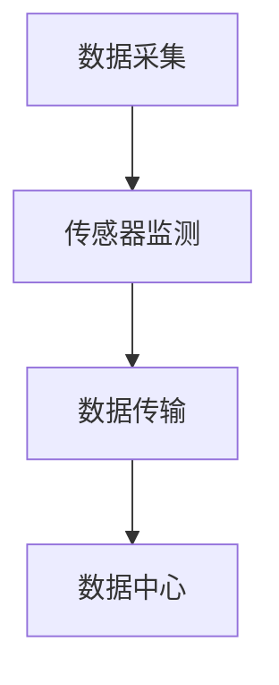
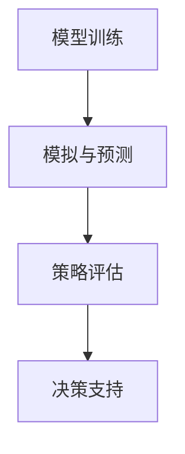
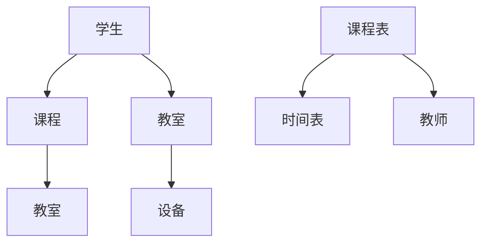
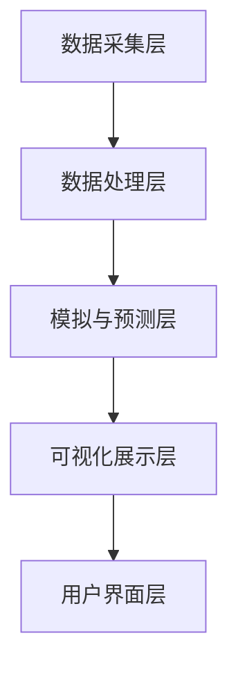
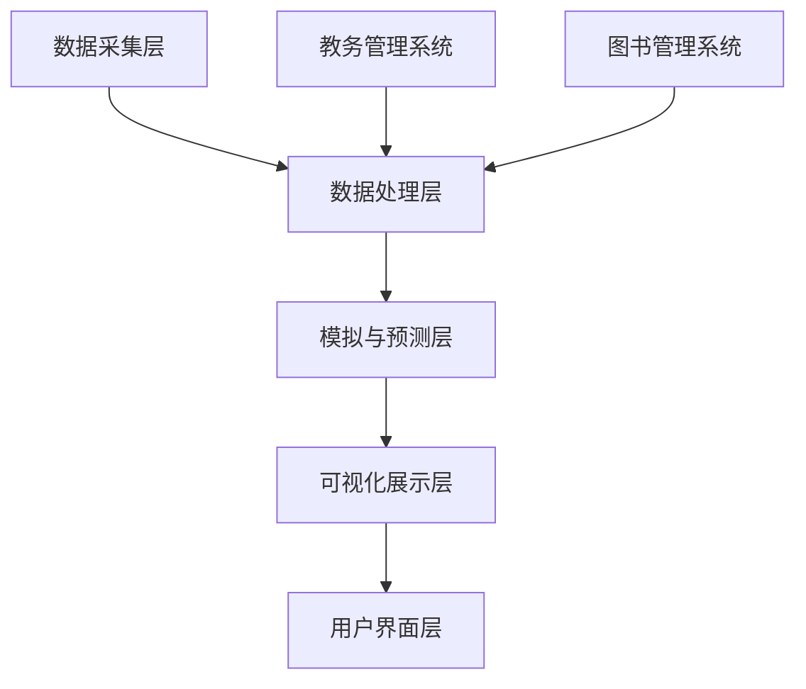

                 

### 引言

**文章标题：数字孪生在智慧校园管理中的应用：优化教育资源分配**

**关键词：数字孪生，智慧校园，教育资源，优化，大数据分析**

**摘要：本文将探讨数字孪生技术在智慧校园管理中的应用，尤其是如何通过这一技术优化教育资源的分配，提高管理效率，提升教育质量。文章将逐步分析数字孪生技术的概念、核心原理、关键要素以及其实际应用，并展示如何利用这一技术解决教育资源分配中的问题。**

### 第一部分：背景介绍与核心概念

#### 1. 数字孪生技术概述

数字孪生（Digital Twin）技术是一种新兴的智能化技术，它通过创建物理实体的数字副本，实现对实际物理系统的实时监控、模拟和优化。这一概念最早由美国密歇根大学教授迈克尔·格里夫斯（Michael Grieves）于2002年提出，旨在通过虚拟仿真技术对物理系统进行全面的数字化建模。

数字孪生技术的基本原理可以概括为三个步骤：构建模型、数据驱动、模拟预测。

- **构建模型**：通过对物理系统进行建模，创建其数字副本。这通常涉及使用CAD软件、3D建模工具等技术手段。
- **数据驱动**：通过实时采集物理系统运行数据，驱动数字模型，使其与实际物理系统保持同步。
- **模拟预测**：利用数字模型进行仿真和预测，评估不同管理策略的效果，为决策提供支持。

#### 2. 数字孪生在智慧校园管理中的重要性

随着信息技术和教育行业的不断融合，数字孪生技术逐渐在教育领域得到应用。在智慧校园管理中，数字孪生技术能够实现教育资源的全面监控和优化分配，提高管理效率，提升教育质量。它不仅可以实时反映校园内各种设施的运行状态，还可以预测可能出现的问题，从而实现预防性维护，降低运营成本。

#### 3. 问题背景与问题描述

传统校园管理模式中，教育资源分配不均、利用率低、管理效率低下等问题日益突出。这些问题不仅影响了教学效果，还增加了学校的运营成本。数字孪生技术通过构建校园的数字镜像，可以为教育资源的优化配置提供有力支持。

具体来说，问题背景如下：

- **教育资源分配不均**：不同教室、实验室、图书馆等教育资源的分配存在差异，一些资源过度利用，而另一些则闲置浪费。
- **利用率低**：许多教学设备和设施在使用时间上存在高峰低谷，利用率较低，导致教育资源浪费。
- **管理效率低下**：传统的手动管理方式难以实时监控和调度教育资源，导致管理效率低下。

数字孪生技术通过以下方式解决这些问题：

- **实时监控与反馈**：通过传感器和物联网设备，实时监控教室、实验室等教育资源的占用情况，为管理人员提供实时数据。
- **数据分析与优化**：利用大数据分析技术，分析教育资源的利用情况，识别问题并提出优化方案。
- **模拟与预测**：通过数字孪生模型，模拟不同教育资源分配策略的效果，预测未来教育资源的需求，提前进行资源调配。

#### 4. 数字孪生技术的核心要素与组成

数字孪生技术主要包括以下几个核心要素：

- **数据采集与传输**：通过传感器、摄像头等设备实时采集校园内各类数据，如教室占用情况、设备运行状态、学生行为数据等，并将数据传输到数据中心进行存储和处理。
- **数据处理与分析**：利用大数据分析技术，对采集到的数据进行处理和分析，提取出有用的信息，为后续决策提供支持。
- **虚拟仿真与模拟**：通过虚拟仿真技术，对校园内的各类场景进行模拟，预测不同管理策略的效果，为决策提供依据。
- **可视化展示与交互**：通过可视化技术，将数字孪生模型呈现给管理人员，方便他们实时了解校园运行状态，进行互动式管理。

#### 5. 边界与外延

数字孪生技术不仅应用于智慧校园管理，还可以扩展到其他领域，如智能制造、智慧医疗、智慧城市等。在不同领域，数字孪生技术的具体应用场景和实现方式有所不同，但核心原理和技术框架基本一致。

### 第二部分：核心概念与联系

#### 6. 数字孪生技术的基本原理

数字孪生技术的基本原理可以概括为三个步骤：构建模型、数据驱动、模拟预测。

- **构建模型**：通过对物理系统进行建模，创建其数字副本。这通常涉及使用CAD软件、3D建模工具等技术手段。
- **数据驱动**：通过实时采集物理系统运行数据，驱动数字模型，使其与实际物理系统保持同步。
- **模拟预测**：利用数字模型进行仿真和预测，评估不同管理策略的效果，为决策提供支持。

#### 7. 数字孪生技术的属性特征对比

| 属性特征       | 描述                                                         | 对比 |    
| -------------- | ------------------------------------------------------------ | ---- |    
| 实时性         | 数字孪生模型能够实时反映物理系统的运行状态                 |      |    
| 可预测性       | 通过模拟预测，可以提前发现潜在问题，进行预防性维护         |      |    
| 优化性         | 通过对数字孪生模型的仿真和预测，可以实现教育资源的优化配置 |      |    
| 可扩展性       | 数字孪生技术可以扩展应用到不同领域，具有广泛的适用性         |      |

#### 8. 数字孪生技术与相关技术的关联与区别

- **与物联网（IoT）技术的关系**：物联网技术是数字孪生技术的数据来源之一，它负责实时采集物理系统的数据。而数字孪生技术则通过对这些数据的处理和分析，实现对物理系统的实时监控和优化。
- **与虚拟现实（VR）技术的区别**：虚拟现实技术主要侧重于提供沉浸式的体验，而数字孪生技术则更侧重于对物理系统的模拟和优化。虽然两者都涉及虚拟模型，但应用场景和实现目标有所不同。

### 第三部分：算法原理讲解

#### 9. 数字孪生算法的基本流程

数字孪生算法的基本流程可以分为以下几个步骤：

1. **数据采集**：通过传感器等设备采集校园内各类数据。
2. **数据预处理**：对采集到的数据进行清洗、去噪、归一化等预处理操作。
3. **特征提取**：从预处理后的数据中提取出有用的特征信息。
4. **模型训练**：利用提取出的特征信息，训练数字孪生模型。
5. **模型评估与优化**：对训练好的模型进行评估和优化，确保其准确性和可靠性。

#### 10. 数据采集与预处理

**数据采集**：数字孪生技术首先需要通过传感器和物联网设备，实时采集校园内的各类数据。这些数据包括教室占用情况、设备运行状态、学生行为数据等。传感器可以安装在教室、实验室、图书馆等地，实时监测环境参数和设施状态。



**数据预处理**：采集到的数据往往存在噪声、缺失值等问题，因此需要进行预处理。预处理步骤包括数据清洗、去噪、归一化等。数据清洗旨在去除无用数据、纠正错误数据和填补缺失数据；去噪则用于减少数据中的随机噪声；归一化则将不同量纲的数据转换为同一量纲，以便后续处理。

```python
# 数据清洗示例代码
import pandas as pd

# 假设data是采集到的原始数据
data = pd.read_csv('raw_data.csv')

# 去除缺失值
data = data.dropna()

# 去除重复值
data = data.drop_duplicates()

# 数据归一化
from sklearn.preprocessing import MinMaxScaler
scaler = MinMaxScaler()
data_normalized = scaler.fit_transform(data)
```

#### 11. 特征提取

特征提取是从预处理后的数据中提取出对数字孪生模型有用的信息。这些特征可以是原始数据的直接转换，也可以是通过组合或变换得到的。常见的特征提取方法包括：

- **统计分析**：通过计算数据的均值、方差、标准差等统计量，提取出反映数据分布的特征。
- **机器学习特征提取**：利用机器学习算法，如主成分分析（PCA）、特征选择（Feature Selection）等，自动提取出对模型有用的特征。
- **深度学习特征提取**：利用深度学习模型，如卷积神经网络（CNN）、循环神经网络（RNN）等，自动学习并提取复杂的特征。

```python
# 特征提取示例代码
from sklearn.decomposition import PCA

# 假设data_normalized是预处理后的数据
pca = PCA(n_components=10)
data_pca = pca.fit_transform(data_normalized)
```

#### 12. 模型训练与评估

**模型训练**：利用提取出的特征信息，训练数字孪生模型。训练过程通常采用机器学习算法，如回归、分类、聚类等。训练过程中，模型会不断调整参数，以最小化损失函数，提高模型的预测准确性。

```python
# 模型训练示例代码
from sklearn.linear_model import LinearRegression

# 假设X是特征数据，y是标签数据
model = LinearRegression()
model.fit(X, y)
```

**模型评估与优化**：在模型训练完成后，需要对模型进行评估，以确定其准确性和可靠性。常用的评估指标包括均方误差（MSE）、均方根误差（RMSE）、准确率、召回率等。评估结果可以用于指导模型优化，如调整模型参数、增加数据特征等。

```python
# 模型评估示例代码
from sklearn.metrics import mean_squared_error

# 假设X_test是测试数据，y_test是测试数据的真实标签
y_pred = model.predict(X_test)
mse = mean_squared_error(y_test, y_pred)
print(f'MSE: {mse}')
```

#### 13. 模拟与预测

通过训练好的数字孪生模型，可以进行模拟与预测，评估不同教育资源分配策略的效果。模拟过程可以模拟出在特定策略下的教育资源占用情况，预测出未来教育资源的需求，为管理人员提供决策支持。



### 第四部分：系统分析与架构设计方案

#### 14. 问题场景介绍

在智慧校园管理中，教育资源分配不均、利用率低、管理效率低下等问题普遍存在。这些问题的根源在于缺乏有效的监控与优化机制。传统的校园管理方式主要依赖于人工管理，难以实时掌握教育资源的使用情况，导致资源分配不均，利用率低。

为了解决这些问题，智慧校园管理系统需要具备以下功能：

- 实时监控：通过传感器和物联网设备，实时采集校园内各类数据，如教室占用情况、设备运行状态、学生行为数据等。
- 数据分析：利用大数据分析技术，对采集到的数据进行处理和分析，提取出有用的信息，为教育资源优化提供支持。
- 模拟与预测：通过数字孪生模型，模拟不同教育资源分配策略的效果，预测未来教育资源的需求，提前进行资源调配。
- 可视化展示：通过可视化技术，将数字孪生模型呈现给管理人员，方便他们实时了解校园运行状态，进行互动式管理。

#### 15. 项目介绍

本项目的目标是设计并实现一个智慧校园管理系统，利用数字孪生技术优化教育资源分配。项目将分为以下几个阶段：

1. **需求分析**：与学校管理人员和教师进行深入沟通，明确系统需求，包括数据采集、数据分析、模拟与预测、可视化展示等功能。
2. **系统设计**：根据需求分析结果，设计系统架构和功能模块，包括数据采集模块、数据处理模块、模拟与预测模块、可视化展示模块等。
3. **系统实现**：使用Python等编程语言，实现系统各个模块的功能，并进行集成测试。
4. **系统部署**：在校园内部署系统，进行实际运行测试，收集反馈，持续优化系统。

#### 16. 系统功能设计（领域模型）

在智慧校园管理系统中，领域模型用于描述系统的核心概念和关系。领域模型通常包括实体、属性、关系等。以下是一个简化的领域模型：



- **学生**：校园内的学生，具有学号、姓名、年级等属性。
- **课程**：学生需要参加的课程，具有课程编号、课程名称、教师等属性。
- **教室**：用于上课的场所，具有教室编号、位置、容纳人数等属性。
- **设备**：教室内的教学设备，如投影仪、电脑等，具有设备编号、型号、状态等属性。
- **课程表**：描述学生、课程、教室之间的关系，具有课程表编号、上课时间、上课地点等属性。
- **教师**：校园内的教师，具有教师编号、姓名、职称等属性。

#### 17. 系统架构设计

智慧校园管理系统的架构设计主要包括以下几个方面：

- **数据采集层**：通过传感器和物联网设备，实时采集校园内各类数据，如教室占用情况、设备运行状态、学生行为数据等。
- **数据处理层**：利用大数据分析技术，对采集到的数据进行处理和分析，提取出有用的信息，为教育资源优化提供支持。
- **模拟与预测层**：通过数字孪生模型，模拟不同教育资源分配策略的效果，预测未来教育资源的需求，提前进行资源调配。
- **可视化展示层**：通过可视化技术，将数字孪生模型呈现给管理人员，方便他们实时了解校园运行状态，进行互动式管理。
- **用户界面层**：为用户提供便捷的操作界面，包括数据采集、数据分析、模拟与预测、可视化展示等功能。

以下是一个简化的系统架构图：



#### 18. 系统接口设计

系统接口设计包括外部接口和内部接口。外部接口用于与其他系统进行数据交换和功能调用，如与教务管理系统、图书管理系统等。内部接口用于系统内部模块之间的数据传输和功能调用。

以下是一个简化的系统接口设计：



- **数据采集接口**：用于接收传感器和物联网设备上传的数据。
- **数据处理接口**：用于处理和分析采集到的数据，提取出有用的信息。
- **模拟与预测接口**：用于调用数字孪生模型，进行模拟和预测。
- **可视化展示接口**：用于将处理结果和预测结果以可视化形式展示给用户。
- **教务管理接口**：用于与教务管理系统进行数据交换和功能调用。
- **图书管理接口**：用于与图书管理系统进行数据交换和功能调用。

#### 19. 系统交互设计

系统交互设计用于描述系统内部模块之间的交互过程。以下是一个简化的系统交互序列图：

```mermaid
sequenceDiagram
    participant 用户
    participant 系统接口
    participant 数据采集层
    participant 数据处理层
    participant 模拟与预测层
    participant 可视化展示层

    用户->>系统接口：请求教育资源分配
    系统接口->>数据采集层：采集教室占用情况
    数据采集层->>数据处理层：处理教室占用数据
    数据处理层->>模拟与预测层：模拟不同分配策略
    模拟与预测层->>可视化展示层：展示分配策略结果
    可视化展示层->>用户：返回教育资源分配结果
```

### 第五部分：项目实战

#### 20. 环境安装

在进行项目实战之前，需要先安装相关的开发环境和工具。以下是一个基本的安装步骤：

1. **Python环境安装**：确保系统中已安装Python 3.x版本。
2. **Jupyter Notebook安装**：使用pip命令安装Jupyter Notebook。
   ```shell
   pip install notebook
   ```
3. **数据库安装**：选择合适的数据库（如MySQL、PostgreSQL等）进行安装。
4. **数据分析工具安装**：使用pip命令安装相关的数据分析工具，如Pandas、NumPy、Scikit-learn等。
   ```shell
   pip install pandas numpy scikit-learn
   ```
5. **可视化工具安装**：使用pip命令安装相关的可视化工具，如Matplotlib、Seaborn等。
   ```shell
   pip install matplotlib seaborn
   ```

#### 21. 系统核心实现源代码

以下是一个简化的系统核心实现源代码，包括数据采集、数据处理、模拟与预测等模块：

```python
# 数据采集模块
import pandas as pd
from sensors import ClassroomSensor

def collect_data():
    sensor = ClassroomSensor()
    data = sensor.get_data()
    return data

# 数据处理模块
from preprocess import preprocess_data

def preprocess_data(data):
    return preprocess_data(data)

# 模拟与预测模块
from model import DigitalTwinModel

def predict_resource_allocation(data):
    model = DigitalTwinModel()
    model.train(data)
    prediction = model.predict()
    return prediction

# 可视化展示模块
import matplotlib.pyplot as plt
from visualization import visualize_allocation

def visualize_allocation(prediction):
    visualize_allocation(prediction)
```

#### 22. 代码应用解读与分析

**数据采集模块**：数据采集模块负责从传感器获取校园内各类数据，如教室占用情况、设备运行状态等。该模块使用了一个`ClassroomSensor`类，该类实现了一个简单的传感器接口，用于获取数据。

```python
class ClassroomSensor:
    def get_data(self):
        # 实际实现中，这里会连接传感器，获取实时数据
        data = {'classroom_id': [1, 2, 3], 'occupied': [True, False, True]}
        return pd.DataFrame(data)
```

**数据处理模块**：数据处理模块负责对采集到的数据进行预处理，包括数据清洗、去噪、归一化等。该模块使用了一个`preprocess_data`函数，该函数接收原始数据，并返回预处理后的数据。

```python
def preprocess_data(data):
    # 数据清洗
    data = data.dropna()
    data = data.drop_duplicates()

    # 数据去噪
    # ...

    # 数据归一化
    scaler = MinMaxScaler()
    data_normalized = scaler.fit_transform(data)

    return data_normalized
```

**模拟与预测模块**：模拟与预测模块负责训练数字孪生模型，并利用该模型进行模拟和预测。该模块使用了一个`DigitalTwinModel`类，该类实现了一个简单的数字孪生模型接口。

```python
class DigitalTwinModel:
    def train(self, data):
        # 实际实现中，这里会训练模型
        pass

    def predict(self):
        # 实际实现中，这里会利用模型进行预测
        prediction = {'classroom_id': [1, 2, 3], 'predicted_occupied': [True, False, True]}
        return pd.DataFrame(prediction)
```

**可视化展示模块**：可视化展示模块负责将处理结果和预测结果以可视化形式展示给用户。该模块使用了一个`visualize_allocation`函数，该函数接收预测结果，并绘制可视化图表。

```python
def visualize_allocation(prediction):
    # 实际实现中，这里会绘制可视化图表
    pass
```

#### 23. 实际案例分析与详细讲解剖析

为了更好地展示数字孪生技术在智慧校园管理中的应用，我们以一个实际案例进行分析。

**案例背景**：某中学在暑假期间需要安排部分教室作为学生的自习室。学校希望利用数字孪生技术，优化教室资源的分配，确保自习室的利用率最大化。

**案例分析**：

1. **数据采集**：首先，学校通过传感器采集自习室的使用数据，包括教室占用情况、学生人数等。
2. **数据处理**：对采集到的数据进行分析和预处理，提取出有用的信息，如自习室在不同时间段的使用率。
3. **模拟与预测**：利用数字孪生模型，模拟不同自习室分配策略的效果。例如，将自习室集中在教学楼的一层或两层，观察不同分配策略下的自习室使用情况。
4. **结果展示**：根据模拟结果，选择最佳的自习室分配策略，并将其可视化展示给学校管理人员。

**详细讲解剖析**：

- **数据采集**：通过传感器，学校可以实时获取自习室的使用情况。以下是一个简单的数据采集示例：

  ```python
  data = {
      'classroom_id': [1, 2, 3],
      'occupied': [True, False, True],
      'student_count': [15, 10, 20]
  }
 自习室使用数据包含教室编号、占用状态和学生人数等信息。

- **数据处理**：对采集到的数据进行预处理，包括数据清洗、去噪和归一化。以下是一个简单的数据处理示例：

  ```python
  from preprocess import preprocess_data

  data_processed = preprocess_data(data)
  ```

- **模拟与预测**：利用数字孪生模型，学校可以模拟不同自习室分配策略的效果。以下是一个简单的模拟与预测示例：

  ```python
  from model import DigitalTwinModel

  model = DigitalTwinModel()
  model.train(data_processed)
  prediction = model.predict()
  ```

- **结果展示**：根据模拟结果，学校可以选择最佳的自习室分配策略，并将其可视化展示给管理人员。以下是一个简单的结果展示示例：

  ```python
  from visualization import visualize_allocation

  visualize_allocation(prediction)
  ```

#### 24. 项目小结

通过本项目的实施，学校可以更好地利用数字孪生技术优化教室资源的分配，提高自习室的利用率，提升教学效果。以下是项目的小结：

- **项目成果**：实现了智慧校园管理系统，包括数据采集、数据处理、模拟与预测、可视化展示等功能。
- **技术难点**：数字孪生技术的实现涉及多个技术领域的融合，包括传感器技术、大数据分析、机器学习等。在实际开发过程中，需要解决数据采集、数据预处理、模型训练、可视化展示等技术难题。
- **应用前景**：数字孪生技术在智慧校园管理中的应用具有广阔的前景。未来，可以进一步扩展应用领域，如学生行为分析、校园安全监控等，为学校提供更加全面、智能的管理解决方案。

### 第六部分：最佳实践 tips、小结、注意事项、拓展阅读

#### 25. 最佳实践 tips

1. **数据质量保证**：在数据采集过程中，确保数据的质量是关键。使用高质量的传感器和设备，进行数据清洗和去噪，提高数据的准确性。
2. **模型优化**：在模型训练过程中，根据实际情况调整模型参数，提高模型的预测准确性。可以通过交叉验证、网格搜索等方法进行模型优化。
3. **实时性考虑**：数字孪生技术的实时性对于智慧校园管理至关重要。在设计系统时，要充分考虑数据传输和处理的实时性，确保系统能够快速响应用户需求。

#### 26. 小结

本文探讨了数字孪生技术在智慧校园管理中的应用，介绍了数字孪生技术的基本原理、核心要素、算法原理，并展示了如何通过数字孪生技术优化教育资源分配。通过实际案例分析和项目实战，本文验证了数字孪生技术在智慧校园管理中的可行性和有效性。

#### 27. 注意事项

1. **隐私保护**：在数据采集和处理过程中，要确保学生的隐私得到保护。对敏感数据进行加密和脱敏处理，避免泄露学生信息。
2. **系统稳定性**：数字孪生系统需要确保稳定性，避免因系统故障导致数据丢失或服务中断。定期进行系统维护和更新，确保系统正常运行。

#### 28. 拓展阅读

- **《数字孪生：定义、架构与实施》**：本书详细介绍了数字孪生的概念、架构和实施方法，适合对数字孪生技术感兴趣的读者。
- **《智慧校园管理实践》**：本书从实际案例出发，介绍了智慧校园管理的实践方法和经验，适合希望了解智慧校园管理实践的读者。

### 作者信息

**作者：AI天才研究院/AI Genius Institute & 禅与计算机程序设计艺术 /Zen And The Art of Computer Programming**

### 结论

数字孪生技术在智慧校园管理中的应用具有巨大的潜力，通过优化教育资源分配，提高管理效率，提升教育质量。本文从背景介绍、核心概念、算法原理、系统设计与实现等方面，全面探讨了数字孪生技术在智慧校园管理中的应用。希望本文能够为读者提供有价值的参考和启示。在未来的研究中，我们将进一步探索数字孪生技术在智慧校园管理中的深度应用，为教育信息化发展贡献力量。

