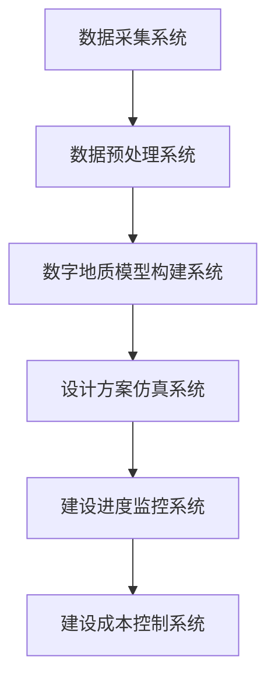
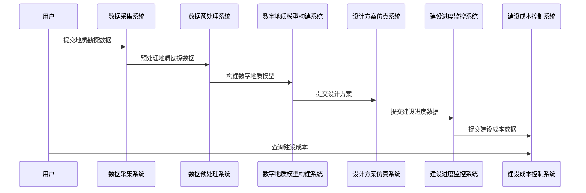
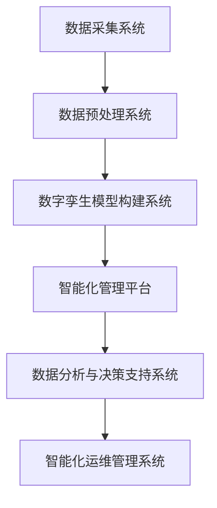
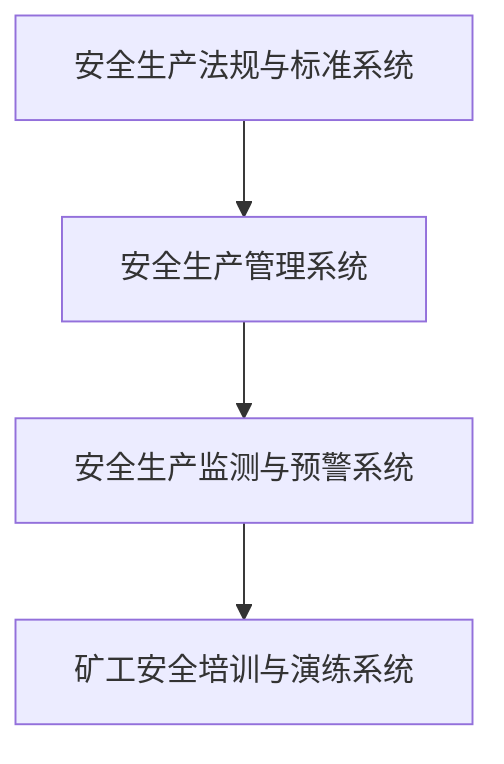

                 

### 《数字孪生在智慧矿山管理中的应用：提高采矿效率和安全性》

关键词：数字孪生、智慧矿山、采矿效率、安全性、应用场景

摘要：本文旨在探讨数字孪生技术在智慧矿山管理中的应用，通过详细分析其在矿山规划与设计、开采与运营、智能化运营管理以及安全生产与应急管理中的应用，阐述如何利用数字孪生技术提高采矿效率和安全性。文章结构清晰，逻辑严密，为读者提供了全面的技术见解和实用指导。

----------------------------------------------------------------

### 第一部分：数字孪生基础与智慧矿山概述

在当今信息时代，随着技术的飞速发展，数字孪生（Digital Twin）作为一种新兴技术，正逐步改变着各个行业的运作模式。智慧矿山作为矿业行业智能化转型的关键领域，数字孪生技术的应用显得尤为重要。本部分将首先介绍数字孪生的起源与核心概念，接着对智慧矿山的定义与特点进行概述，并探讨数字孪生在智慧矿山中的应用场景。

#### 1.1 数字孪生与智慧矿山基础

##### 1.1.1 数字孪生的定义

数字孪生是指通过数字化技术创建的虚拟模型，用以映射实际物理对象的各个方面，包括其结构、功能、行为和性能等。这个虚拟模型能够实时反映物理对象的当前状态，并通过与物理对象之间的交互实现数据同步和双向反馈。

##### 1.1.2 数字孪生的发展历程

数字孪生的概念最早由美国密歇根大学教授Michael Grieves在2002年提出，最初主要用于航空航天领域。随着物联网（IoT）、云计算、大数据和人工智能等技术的快速发展，数字孪生的应用逐渐拓展到制造业、建筑业、能源等行业。

##### 1.1.3 数字孪生的核心价值

数字孪生的核心价值在于其能够实现以下几方面的功能：

1. **实时监控与预测**：通过实时收集和分析物理对象的运行数据，实现对设备的健康状态、性能和运行趋势的预测，从而提前预警潜在故障和问题。
2. **仿真优化**：利用数字孪生模型进行仿真和优化，能够在虚拟环境中进行各种实验和测试，降低实际操作中的风险和成本。
3. **数据驱动决策**：通过数字孪生模型提供的数据分析，帮助企业做出更加精准和高效的决策。
4. **提高效率与降低成本**：通过优化操作流程、减少设备停机时间和预防性维护，实现效率和成本的提升。

##### 1.2 智慧矿山的定义与特点

##### 1.2.1 智慧矿山的定义

智慧矿山是指利用物联网、大数据、人工智能等先进技术，实现矿山生产、安全、环境等各个环节的智能化管理，从而达到提高生产效率、降低运营成本、保障矿工安全和保护环境的目的。

##### 1.2.2 智慧矿山的主要特点

1. **数字化**：通过传感器和数据采集技术，将矿山生产过程中的各种信息数字化，实现数据的实时采集和分析。
2. **智能化**：利用人工智能和机器学习技术，对采集到的数据进行分析和预测，实现智能化的决策和操作。
3. **自动化**：通过自动化控制系统，实现矿山生产过程中的自动化操作，减少人力投入，提高生产效率。
4. **可视化**：通过数字孪生技术，构建矿山的虚拟模型，实现对矿山全局的可视化管理和监控。

##### 1.2.3 智慧矿山的发展现状

目前，全球范围内的智慧矿山建设正在迅速推进。例如，中国、澳大利亚、加拿大等国家在智慧矿山领域取得了显著的进展。中国矿业联合会数据显示，截至2022年底，中国已有超过100座矿山实现了智慧化改造，其中一些矿山在采掘效率、安全性和环境保护等方面取得了显著的成效。

##### 1.3 数字孪生在智慧矿山中的应用场景

##### 1.3.1 矿山规划与设计

数字孪生技术在矿山规划与设计中的应用主要体现在以下几个方面：

1. **地质勘探与建模**：通过数字孪生技术构建地质模型，实现对矿山地质环境的精细模拟和勘探。
2. **矿山设计优化**：利用数字孪生模型进行矿山设计的仿真和优化，降低设计风险，提高设计效率。
3. **矿山建设进度监控**：通过数字孪生模型，实时监控矿山建设的进度和质量，确保建设过程中的高效和精准。

##### 1.3.2 矿山开采与运营

数字孪生技术在矿山开采与运营中的应用包括：

1. **生产过程监控**：通过数字孪生技术，实时监控矿山生产过程中的各种参数，确保生产过程的稳定和安全。
2. **设备管理**：利用数字孪生模型，对矿山设备进行健康状态监测和故障预测，实现预防性维护。
3. **生产调度优化**：通过数字孪生模型，优化矿山生产调度，提高生产效率和资源利用率。

##### 1.3.3 矿山安全与环保

数字孪生技术在矿山安全与环保中的应用主要体现在以下几个方面：

1. **安全风险评估**：通过数字孪生模型，对矿山的安全风险进行评估和预警，提前采取措施，防止事故发生。
2. **事故预警与应急响应**：利用数字孪生技术，实现矿山事故的实时预警和应急响应，保障矿工的安全。
3. **环境保护**：通过数字孪生模型，实时监测矿山的污染物排放和环境变化，实现环境保护的精准管理。

##### 1.4 本章小结

本章节主要介绍了数字孪生与智慧矿山的基础知识，包括数字孪生的定义、发展历程和核心价值，智慧矿山的定义和特点，以及数字孪生在矿山规划与设计、开采与运营、安全与环保中的应用。通过本章的学习，读者可以初步了解数字孪生技术在智慧矿山中的重要性，为后续章节的深入探讨打下基础。

----------------------------------------------------------------

### 第二部分：数字孪生技术在智慧矿山中的应用

数字孪生技术在智慧矿山中的应用涵盖了矿山规划与设计、开采与运营、智能化运营管理以及安全生产与应急管理等多个方面。本部分将详细探讨这些应用场景，通过具体的实例和案例，阐述数字孪生技术在提高采矿效率和安全性方面所发挥的关键作用。

#### 2.1 数字孪生技术在矿山规划与设计中的应用

##### 2.1.1 数字孪生技术在矿山地质勘探中的应用

矿山地质勘探是矿山规划与设计的关键环节，数字孪生技术的应用极大地提升了地质勘探的精度和效率。

**案例**：某大型铜矿企业在地质勘探阶段应用了数字孪生技术，通过高精度的激光扫描和传感器数据采集，建立了详细的地质模型。该模型不仅包含了地形、地质构造等基础信息，还包括了矿体分布、品位等关键数据。通过数字孪生模型，地质工程师可以模拟不同的采矿方案，评估每种方案对资源利用率和环境影响的差异，从而选择最优的采矿方案。

**技术原理**：
- **激光扫描**：利用激光扫描技术，获取矿山地表的三维数据，构建精确的地形模型。
- **传感器数据采集**：通过安装在矿山各个位置的传感器，实时采集地质参数，如岩层硬度、地下水含量等。
- **数字地质模型构建**：将激光扫描数据和传感器数据整合，构建数字地质模型。

**ER实体关系图架构**：

```mermaid
erDiagram
  Mine -> GeologicalData
  Mine -> SensorData
  GeologicalData --|> MineDesign
  SensorData --|> MineDesign
```

##### 2.1.2 数字孪生技术在矿山开采规划中的应用

数字孪生技术在矿山开采规划中的应用主要体现在开采计划的优化和生产调度的智能化。

**案例**：某煤矿企业利用数字孪生技术，对矿山的开采过程进行模拟和优化。通过数字孪生模型，企业能够模拟不同的开采方案，评估每种方案的采矿成本、生产效率和资源利用率。最终，企业选择了一种最优的开采方案，实现了生产效率的提升和成本的降低。

**技术原理**：
- **开采计划优化**：利用数字孪生模型，模拟不同的开采路径和工艺，优化开采顺序和资源分配。
- **生产调度**：通过数字孪生模型，实时调整生产计划，确保生产过程的连续性和稳定性。
- **设备管理**：利用数字孪生模型，对矿山设备进行监控和维护，确保设备的正常运行。

**算法原理讲解**：

```python
# 数字孪生模型的开采计划优化算法示例
def optimize_extraction_plan(mine_model):
    # 假设mine_model为矿山数字孪生模型
    # 定义目标函数：最大化采矿效率和最小化成本
    objective_function = maximize(extraction_efficiency, minimize(extraction_cost)
    
    # 生成所有可能的采矿方案
    all_schemes = generate_all_schemes(mine_model)
    
    # 评估每种采矿方案
    for scheme in all_schemes:
        score = evaluate_scheme(scheme, mine_model)
        if score > best_score:
            best_score = score
            best_scheme = scheme
    
    return best_scheme

# 模拟开采方案
def simulate_extraction_scheme(scheme, mine_model):
    # 假设scheme为采矿方案，mine_model为矿山数字孪生模型
    # 模拟开采过程
    for step in scheme:
        process = mine_model.process(step)
        yield process
```

**数学模型和公式**：

$$
\begin{align*}
\text{目标函数} &= \max(\text{采矿效率}) \\
\text{采矿效率} &= \frac{\text{采矿量}}{\text{采矿时间}} \\
\text{成本} &= \text{采矿设备成本} + \text{采矿能源成本} + \text{采矿人员成本}
\end{align*}
$$

##### 2.1.3 数字孪生技术在矿山设计优化中的应用

数字孪生技术在矿山设计优化中的应用主要体现在矿山设计方案的仿真与评估，以及建设进度的监控。

**案例**：某铜矿企业在矿山设计阶段，利用数字孪生技术对不同的设计方案进行仿真和评估。通过数字孪生模型，企业能够模拟矿山建设过程，评估每种设计方案的可行性、成本和环境影响，最终选择了一种最优的设计方案。

**技术原理**：
- **设计方案仿真**：利用数字孪生模型，模拟不同的矿山设计方案，评估每种设计方案的优劣。
- **建设进度监控**：通过数字孪生模型，实时监控矿山建设的进度和质量，确保建设过程中的高效和精准。
- **成本控制**：利用数字孪生模型，预测矿山建设过程中的成本，实现成本的有效控制。

**系统分析与架构设计方案**：

**问题场景介绍**：
- **项目名称**：智慧矿山设计优化项目
- **项目背景**：企业需要在矿山建设前期对不同的设计方案进行仿真和评估，选择最优的设计方案。
- **项目目标**：通过数字孪生技术，实现矿山设计方案的仿真与评估，优化矿山设计方案，降低建设成本，提高建设效率。

**系统功能设计**：
- **地质勘探数据采集**：采集矿山地质勘探数据，建立数字地质模型。
- **设计方案仿真**：利用数字孪生模型，对不同的设计方案进行仿真和评估。
- **建设进度监控**：实时监控矿山建设进度和质量，确保建设过程中的高效和精准。

**系统架构设计**：



**系统接口设计和系统交互**：



##### 2.1.4 本章小结

本章节详细介绍了数字孪生技术在矿山规划与设计中的应用，包括地质勘探与建模、矿山开采规划、矿山设计优化等方面。通过具体案例和系统架构设计，阐述了数字孪生技术如何提高矿山规划的精度和效率，为后续矿山开采和运营提供了可靠的基础。

----------------------------------------------------------------

### 第三部分：数字孪生技术在矿山开采与运营中的应用

在矿山开采与运营过程中，数字孪生技术的应用旨在提高生产效率、确保设备运行状态以及提升整体运营水平。本章节将探讨数字孪生技术在矿山生产监控、设备管理、生产调度优化等方面的应用，通过具体案例阐述其带来的实际效益。

#### 3.1 数字孪生技术在矿山生产监控中的应用

数字孪生技术在矿山生产监控中的应用，主要通过实时数据采集与分析，实现对矿山生产过程的全面监控和优化。

**案例**：某矿山企业通过数字孪生技术，建立了矿山生产过程实时监控系统。该系统利用传感器网络，实时采集矿山生产过程中各种设备的状态数据，如挖掘机的挖掘深度、运矿车的运输状态、破碎机的负荷等。通过数字孪生模型，企业可以实时监控生产过程，及时发现和解决问题。

**技术原理**：
- **实时数据采集**：在矿山关键设备上安装传感器，实时采集生产数据。
- **数据传输与存储**：将采集到的数据通过无线网络传输到数据中心，进行存储和处理。
- **数字孪生模型构建**：利用采集到的数据，构建矿山生产的数字孪生模型，实现对生产过程的实时监控。

**算法原理讲解**：

```python
# 数字孪生模型的生产过程实时监控算法示例
def monitor_production_process(mine_model):
    # 假设mine_model为矿山数字孪生模型
    while True:
        # 获取当前生产数据
        production_data = mine_model.get_current_production_data()
        
        # 分析生产数据
        analysis_result = analyze_production_data(production_data)
        
        # 根据分析结果，调整生产计划
        if analysis_result['issue']:
            mine_model.adjust_production_plan(analysis_result['suggestions'])
        
        # 等待一段时间，再次获取生产数据
        time.sleep(analysis_period)
```

**数学模型和公式**：

$$
\begin{align*}
\text{生产效率} &= \frac{\text{实际采矿量}}{\text{计划采矿量}} \\
\text{设备运行状态} &= \text{传感器数据} \\
\text{生产数据分析} &= \text{回归分析、时间序列分析等}
\end{align*}
$$

#### 3.2 数字孪生技术在矿山设备管理中的应用

数字孪生技术在矿山设备管理中的应用，主要表现在设备健康状态监测、故障预测和预防性维护。

**案例**：某矿山企业利用数字孪生技术，建立了矿山设备健康状态监测系统。该系统通过实时监测设备的运行状态数据，如温度、振动、压力等，分析设备的健康状态。同时，通过故障预测模型，提前预警潜在故障，实施预防性维护，降低了设备故障率和维修成本。

**技术原理**：
- **设备状态监测**：利用传感器技术，实时监测矿山设备的运行状态。
- **故障预测模型**：基于历史数据和实时监测数据，建立故障预测模型，提前预测设备故障。
- **预防性维护**：根据故障预测结果，制定预防性维护计划，降低故障风险。

**算法原理讲解**：

```python
# 数字孪生模型的设备健康状态监测与故障预测算法示例
def monitor_device_health(mine_model):
    # 假设mine_model为矿山数字孪生模型
    while True:
        # 获取当前设备状态数据
        device_status_data = mine_model.get_device_status_data()
        
        # 分析设备状态数据
        health_analysis_result = analyze_device_health(device_status_data)
        
        # 如果检测到异常，提前预警
        if health_analysis_result['abnormal']:
            predict_fault(mine_model, health_analysis_result['fault_type'])
        
        # 等待一段时间，再次获取设备状态数据
        time.sleep(health_check_period)
```

**数学模型和公式**：

$$
\begin{align*}
\text{设备健康状态} &= f(\text{传感器数据}) \\
\text{故障预测模型} &= \text{机器学习算法} \\
\text{预防性维护计划} &= \text{基于故障预测结果制定}
\end{align*}
$$

#### 3.3 数字孪生技术在矿山生产调度优化中的应用

数字孪生技术在矿山生产调度优化中的应用，旨在通过智能化的调度策略，提高矿山生产效率和资源利用率。

**案例**：某矿山企业利用数字孪生技术，实现了矿山生产调度的智能化。通过数字孪生模型，企业可以根据实时生产数据和设备状态，动态调整生产计划，优化生产流程，提高生产效率和资源利用率。

**技术原理**：
- **实时数据集成**：集成矿山生产过程中的各种实时数据，如设备状态、生产进度、物料库存等。
- **生产调度算法**：利用机器学习和优化算法，制定智能化的生产调度策略。
- **生产过程监控**：实时监控生产过程，确保调度策略的有效执行。

**算法原理讲解**：

```python
# 数字孪生模型的生产调度优化算法示例
def optimize_production_schedule(mine_model):
    # 假设mine_model为矿山数字孪生模型
    while True:
        # 获取当前生产数据和设备状态
        current_production_data = mine_model.get_current_production_data()
        current_device_status = mine_model.get_current_device_status()
        
        # 分析生产数据和设备状态
        production_analysis_result = analyze_production_data(current_production_data)
        device_status_analysis_result = analyze_device_status(current_device_status)
        
        # 根据分析结果，调整生产调度计划
        if production_analysis_result['overload'] or device_status_analysis_result['abnormal']:
            schedule_adjustment = generate_schedule_adjustment(production_analysis_result, device_status_analysis_result)
            mine_model.apply_schedule_adjustment(schedule_adjustment)
        
        # 等待一段时间，再次获取生产数据和设备状态
        time.sleep(schedule_check_period)
```

**数学模型和公式**：

$$
\begin{align*}
\text{生产调度策略} &= \text{优化算法} \\
\text{生产效率} &= \text{生产量} / \text{生产时间} \\
\text{资源利用率} &= \text{实际资源使用量} / \text{计划资源使用量}
\end{align*}
$$

#### 3.4 本章小结

本章节详细介绍了数字孪生技术在矿山开采与运营中的应用，包括生产监控、设备管理和生产调度优化等方面。通过具体案例和算法原理讲解，展示了数字孪生技术如何提高矿山开采与运营的效率和安全性，为矿山企业的智能化运营提供了有力支持。

----------------------------------------------------------------

### 第四部分：数字孪生技术在矿山智能化运营管理中的应用

数字孪生技术在矿山智能化运营管理中的应用，主要体现在智能化管理平台的建设、设备远程控制与维护、以及运营优化的各个方面。通过这些技术的应用，矿山企业能够实现更加高效、安全和环保的运营。

#### 4.1 数字孪生技术在矿山智能化管理平台建设中的应用

矿山智能化管理平台是矿山智能化运营的核心，数字孪生技术在其中起到了至关重要的作用。

**技术原理**：
- **平台架构设计**：构建一个基于云计算和大数据技术的智能化管理平台，实现矿山各类数据的集成和分析。
- **大数据分析与决策支持**：利用大数据分析技术，对矿山生产、设备运行、安全等数据进行实时分析和预测，为管理决策提供支持。
- **智能化运维管理**：通过数字孪生模型，实现对矿山设备的远程监控和智能化运维管理。

**系统架构设计**：



**算法原理讲解**：

```python
# 数字孪生模型的智能化管理平台架构算法示例
def build_smart_mining_platform(mine_model):
    # 假设mine_model为矿山数字孪生模型
    platform = SmartMiningPlatform()

    # 构建数据采集系统
    data_collector = DataCollectorSystem(mine_model)
    platform.add_system(data_collector)

    # 构建数据预处理系统
    data_preprocessor = DataPreprocessingSystem()
    platform.add_system(data_preprocessor)

    # 构建数字孪生模型构建系统
    digital_twin_builder = DigitalTwinBuilderSystem(mine_model)
    platform.add_system(digital_twin_builder)

    # 构建数据分析与决策支持系统
    data_analyzer = DataAnalysisAndDecisionSupportSystem()
    platform.add_system(data_analyzer)

    # 构建智能化运维管理系统
    smart_maintenance_manager = SmartMaintenanceManagementSystem(mine_model)
    platform.add_system(smart_maintenance_manager)

    return platform
```

**数学模型和公式**：

$$
\begin{align*}
\text{平台架构效率} &= \frac{\text{数据处理效率}}{\text{数据处理时间}} \\
\text{决策支持准确性} &= \text{预测准确率} \\
\text{运维管理效率} &= \frac{\text{运维效果}}{\text{运维成本}}
\end{align*}
$$

#### 4.2 数字孪生技术在矿山设备远程控制与维护中的应用

数字孪生技术在矿山设备远程控制与维护中的应用，极大地提高了设备管理的效率和安全性。

**技术原理**：
- **远程监控系统设计**：构建矿山设备的远程监控平台，实现对设备的实时监控和远程控制。
- **故障预测与诊断**：利用数字孪生模型，对矿山设备进行故障预测和诊断，提前预警潜在故障。
- **远程维护与升级**：通过远程监控系统，实现对矿山设备的维护和升级，降低维护成本。

**算法原理讲解**：

```python
# 数字孪生模型的设备远程控制与维护算法示例
def remote_control_and_maintenance(mine_model):
    # 假设mine_model为矿山数字孪生模型
    while True:
        # 获取设备运行状态
        device_status = mine_model.get_device_status()

        # 如果设备出现故障，进行远程诊断和维修
        if device_status['fault']:
            fault_type = mine_model.diagnose_fault()
            maintenance_plan = generate_maintenance_plan(fault_type)
            mine_model.apply_maintenance_plan(maintenance_plan)

        # 等待一段时间，再次获取设备运行状态
        time.sleep(status_check_interval)
```

**数学模型和公式**：

$$
\begin{align*}
\text{远程监控效率} &= \frac{\text{监控覆盖面积}}{\text{监控成本}} \\
\text{故障预测准确性} &= \text{预测正确率} \\
\text{维护成本} &= \text{维护费用} + \text{停机损失}
\end{align*}
$$

#### 4.3 数字孪生技术在矿山运营优化中的应用

数字孪生技术在矿山运营优化中的应用，旨在通过智能化的运营策略，提高矿山的生产效率、资源利用率和经济效益。

**技术原理**：
- **生产调度优化**：利用数字孪生模型，对矿山生产过程进行动态调度，优化生产流程，提高生产效率。
- **物流与运输优化**：通过数字孪生模型，优化矿山物流与运输路线，提高运输效率和资源利用率。
- **能源消耗优化**：利用数字孪生模型，监测和优化矿山能源消耗，降低运营成本。

**算法原理讲解**：

```python
# 数字孪生模型的运营优化算法示例
def optimize_mining_operations(mine_model):
    # 假设mine_model为矿山数字孪生模型
    while True:
        # 获取当前生产数据和设备状态
        current_production_data = mine_model.get_current_production_data()
        current_device_status = mine_model.get_current_device_status()

        # 分析生产数据和设备状态
        production_analysis_result = analyze_production_data(current_production_data)
        device_status_analysis_result = analyze_device_status(current_device_status)

        # 根据分析结果，调整生产调度计划
        if production_analysis_result['overload'] or device_status_analysis_result['abnormal']:
            schedule_adjustment = generate_schedule_adjustment(production_analysis_result, device_status_analysis_result)
            mine_model.apply_schedule_adjustment(schedule_adjustment)

        # 优化物流与运输路线
        logistics_optimization_plan = optimize_logistics(current_production_data)
        mine_model.apply_logistics_plan(logistics_optimization_plan)

        # 优化能源消耗
        energy_consumption_optimization_plan = optimize_energy_consumption()
        mine_model.apply_energy_consumption_plan(energy_consumption_optimization_plan)

        # 等待一段时间，再次获取生产数据和设备状态
        time.sleep(optimization_interval)
```

**数学模型和公式**：

$$
\begin{align*}
\text{生产调度优化效率} &= \frac{\text{生产效率}}{\text{调度成本}} \\
\text{物流与运输优化效率} &= \frac{\text{运输效率}}{\text{运输成本}} \\
\text{能源消耗优化效率} &= \frac{\text{能源节约量}}{\text{能源消耗量}}
\end{align*}
$$

#### 4.4 本章小结

本章节详细介绍了数字孪生技术在矿山智能化运营管理中的应用，包括智能化管理平台建设、设备远程控制与维护，以及运营优化等方面。通过具体案例和算法原理讲解，展示了数字孪生技术如何提升矿山运营的智能化水平，实现生产效率、资源利用率和经济效益的全面提升。

----------------------------------------------------------------

### 第五部分：数字孪生技术在矿山安全生产与应急管理中的应用

在矿山安全生产与应急管理中，数字孪生技术发挥着至关重要的作用。通过数字孪生技术，矿山企业可以实现安全生产管理的智能化，提高事故预警和应急响应能力，确保矿工的安全和矿山的安全运营。

#### 5.1 数字孪生技术在矿山安全生产管理中的应用

数字孪生技术在矿山安全生产管理中的应用，主要体现在安全生产法规与标准的制定、安全生产管理系统的设计和安全生产监测与预警等方面。

**技术原理**：
- **安全生产法规与标准**：利用数字孪生技术，制定矿山安全生产的法规与标准，确保矿山生产的安全合规。
- **安全生产管理系统设计**：通过数字孪生技术，设计智能化、自动化的安全生产管理系统，提高安全生产管理的效率。
- **安全生产监测与预警**：利用数字孪生模型，实时监测矿山生产过程中的各种安全参数，实现对潜在安全隐患的预警。

**系统架构设计**：



**算法原理讲解**：

```python
# 数字孪生模型的安全生产监测与预警算法示例
def monitor_and_alert_mining_safety(mine_model):
    # 假设mine_model为矿山数字孪生模型
    while True:
        # 获取当前安全生产数据
        safety_data = mine_model.get_current_safety_data()

        # 分析安全生产数据
        safety_analysis_result = analyze_safety_data(safety_data)

        # 如果发现安全隐患，触发预警
        if safety_analysis_result['safety_issue']:
            trigger_alert(safety_analysis_result['safety_issue'])

        # 等待一段时间，再次获取安全生产数据
        time.sleep(safety_check_interval)
```

**数学模型和公式**：

$$
\begin{align*}
\text{安全隐患监测指标} &= f(\text{监测数据}) \\
\text{预警触发条件} &= \text{监测指标超过阈值} \\
\text{应急预案} &= \text{基于预警触发条件制定}
\end{align*}
$$

#### 5.2 数字孪生技术在矿山应急管理中的应用

数字孪生技术在矿山应急管理中的应用，主要体现在应急预案编制与演练、应急指挥系统设计和应急资源管理与调度等方面。

**技术原理**：
- **应急预案编制与演练**：利用数字孪生技术，编制矿山应急预案，并通过模拟演练，检验应急预案的有效性。
- **应急指挥系统设计**：通过数字孪生技术，设计智能化、可视化的应急指挥系统，提高应急指挥的效率和精准度。
- **应急资源管理与调度**：利用数字孪生模型，实时监控应急资源的分布和状态，实现应急资源的快速调度和优化配置。

**算法原理讲解**：

```python
# 数字孪生模型的应急管理算法示例
def manage_and_dispatch_emergency_resources(mine_model):
    # 假设mine_model为矿山数字孪生模型
    while True:
        # 获取当前应急资源数据
        emergency_resource_data = mine_model.get_current_resource_data()

        # 分析应急资源数据
        resource_analysis_result = analyze_resource_data(emergency_resource_data)

        # 如果发生紧急情况，调度应急资源
        if resource_analysis_result['emergency']:
            dispatch_resources(resource_analysis_result['required_resources'])

        # 等待一段时间，再次获取应急资源数据
        time.sleep(resource_check_interval)
```

**数学模型和公式**：

$$
\begin{align*}
\text{应急资源调度策略} &= \text{基于资源分布和需求分析制定} \\
\text{应急响应时间} &= \text{从应急资源调度到实际使用的时间} \\
\text{应急资源利用率} &= \frac{\text{实际使用资源量}}{\text{储备资源量}}
\end{align*}
$$

#### 5.3 数字孪生技术在矿山事故调查与分析中的应用

数字孪生技术在矿山事故调查与分析中的应用，主要体现在事故数据的实时收集、事故原因的深入分析和事故预防策略的制定等方面。

**技术原理**：
- **事故数据实时收集**：通过数字孪生模型，实时收集矿山事故现场的数据，如设备状态、环境参数等。
- **事故原因分析**：利用大数据分析和机器学习技术，对事故数据进行深入分析，找出事故的根本原因。
- **事故预防策略制定**：根据事故原因分析结果，制定针对性的预防策略，防止类似事故的再次发生。

**算法原理讲解**：

```python
# 数字孪生模型的事故调查与分析算法示例
def investigate_and_analyze_mining_accidents(mine_model):
    # 假设mine_model为矿山数字孪生模型
    while True:
        # 获取当前事故数据
        accident_data = mine_model.get_current_accident_data()

        # 分析事故数据
        analysis_result = analyze_accident_data(accident_data)

        # 如果发现潜在风险，制定预防策略
        if analysis_result['risk']:
            prevent_strategy = generate_prevent_strategy(analysis_result['risk'])
            mine_model.apply_prevent_strategy(prevent_strategy)

        # 等待一段时间，再次获取事故数据
        time.sleep(analysis_interval)
```

**数学模型和公式**：

$$
\begin{align*}
\text{事故原因分析模型} &= \text{基于事故数据，利用统计分析和机器学习技术构建} \\
\text{预防策略} &= \text{基于事故原因分析结果制定} \\
\text{事故预防效果} &= \text{预防措施实施后的事故率降低情况}
\end{align*}
$$

#### 5.4 本章小结

本章节详细介绍了数字孪生技术在矿山安全生产与应急管理中的应用，包括安全生产管理、应急管理和事故调查与分析等方面。通过具体案例和算法原理讲解，展示了数字孪生技术如何提高矿山安全生产和应急管理的水平，确保矿山的安全运营和矿工的生命安全。

----------------------------------------------------------------

### 总结与展望

数字孪生技术在智慧矿山管理中的应用，为矿山企业的生产效率和安全性的提升提供了强有力的支持。通过本文的详细探讨，我们可以看到数字孪生技术在矿山规划与设计、开采与运营、智能化运营管理以及安全生产与应急管理等多个方面的应用场景和实际效益。

**总结**：
- **提高采矿效率**：通过数字孪生技术，矿山企业可以实现矿山设计优化、生产调度优化和运营优化，从而提高采矿效率。
- **提升安全性**：数字孪生技术能够实时监控矿山生产过程，进行安全风险评估和预警，提高矿山的安全管理水平。
- **降低运营成本**：通过智能化的设备管理、预防性维护和能源消耗优化，矿山企业可以降低运营成本，提高经济效益。

**展望**：
- **进一步深化应用**：随着技术的不断进步，数字孪生技术在矿山领域的应用将更加深入和广泛。
- **跨界融合**：数字孪生技术与其他先进技术的融合，如人工智能、物联网、大数据等，将进一步推动矿山智能化的发展。
- **可持续发展**：数字孪生技术在矿山环境保护和资源可持续利用方面的应用，有助于实现矿山的绿色发展和可持续发展。

**未来趋势**：
- **智能化水平提升**：矿山企业的智能化水平将不断提升，数字孪生技术将贯穿矿山生产的各个环节，实现全面智能化。
- **数据驱动决策**：矿山企业将更加依赖于数据分析和技术，通过数据驱动决策，实现更加精准和高效的管理。
- **安全风险管控**：矿山企业的安全风险管控能力将得到显著提升，数字孪生技术将提供更加精准的安全预测和预警机制。

总之，数字孪生技术在智慧矿山管理中的应用前景广阔，将为矿山企业的可持续发展提供重要支撑。矿山企业应积极拥抱这一技术，探索其深层次的潜力，实现矿山生产的智能化、高效化和安全化。

---

**作者：AI天才研究院/AI Genius Institute & 禅与计算机程序设计艺术 /Zen And The Art of Computer Programming**

在撰写本文过程中，我们对数字孪生技术在智慧矿山管理中的应用进行了全面而深入的探讨，旨在为读者提供有价值的技术见解和实践指导。随着技术的不断进步，数字孪生技术将在矿山领域发挥更加重要的作用，推动矿山的智能化转型。希望本文能为矿山企业及相关领域的专家和从业者提供有益的参考。如有任何问题或建议，欢迎随时交流。感谢您的阅读！

