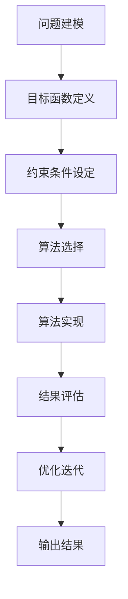
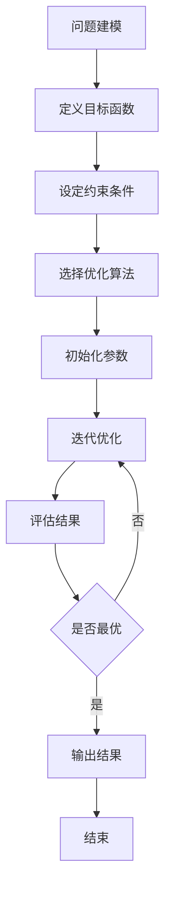
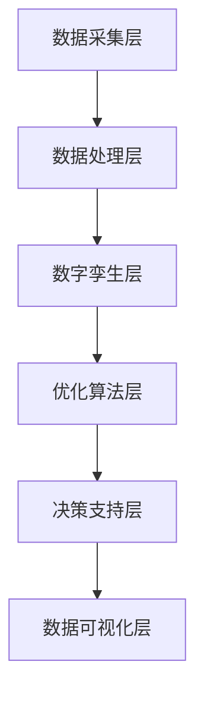
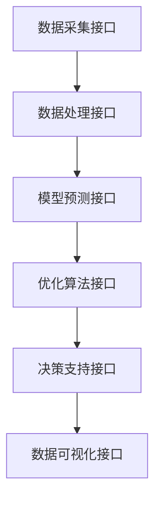
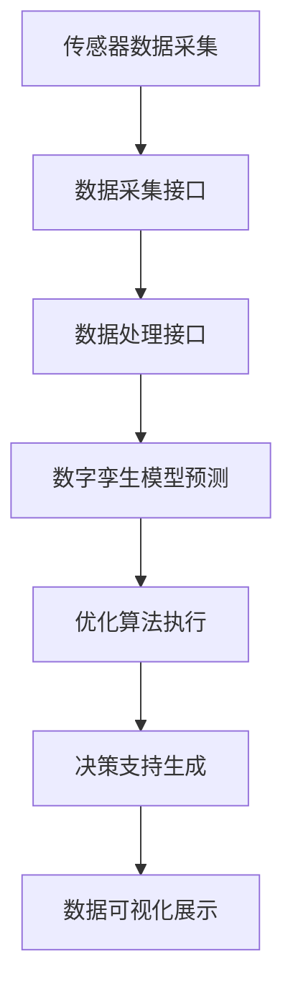

                 

## 第1章 背景介绍

### 1.1 数字孪生概述

#### 定义

数字孪生（Digital Twin）是一种创新的技术概念，指的是在数字世界中创建一个与物理实体完全映射的副本。这个副本通过实时数据获取、集成和共享，实现对物理实体的虚拟建模、状态监测、预测分析、仿真测试和优化决策。

数字孪生的基本框架包括以下组成部分：

1. **物理实体**：实际存在的物理对象，如工厂设备、建筑物、交通工具等。
2. **数字模型**：对物理实体的数字映射，通常包括几何模型、物理模型、行为模型等。
3. **数据接口**：用于收集物理实体的实时数据，如传感器数据、操作数据等。
4. **数据连接**：将实时数据传输到数字模型，并进行处理和存储。
5. **分析平台**：用于对数字模型进行分析、仿真和优化。
6. **反馈回路**：根据分析结果，对物理实体进行调整和优化。

#### 特点

- **实时性**：数字孪生系统能够实时获取物理实体的状态数据，进行动态更新和模拟。
- **集成性**：数字孪生系统可以集成多种数据源和设备，实现数据的高度整合。
- **预测性**：通过历史数据和模型预测，数字孪生系统能够预测物理实体的未来状态和行为。
- **闭环性**：数字孪生系统通过实时反馈和调整，实现对物理实体的闭环控制。

#### 应用领域

数字孪生技术已经在多个领域得到了广泛应用，包括：

- **制造业**：通过数字孪生技术，实现对生产过程的实时监控、故障预测和优化生产。
- **建筑与基础设施**：利用数字孪生技术，对建筑物和基础设施进行监测、维护和优化。
- **能源管理**：通过数字孪生技术，实现对能源系统的实时监测和优化，提高能源利用效率。
- **医疗健康**：利用数字孪生技术，对病人的健康状况进行实时监测和个性化治疗。
- **水资源管理**：数字孪生技术能够实现对水资源的实时监测、预测和优化分配，解决水资源短缺和污染等问题。

### 1.2 水资源管理问题

#### 问题背景

水资源是地球上最重要的自然资源之一，对于人类社会的生存和发展具有至关重要的作用。然而，随着人口增长、工业化进程和气候变化等因素的影响，全球水资源面临着前所未有的压力。

- **水资源短缺**：许多地区，尤其是发展中国家，面临严重的水资源短缺问题。据统计，全球约有28%的人口生活在面临用水紧张的地区。
- **水资源分布不均**：水资源的地理分布极不均匀，一些地区水资源丰富，而另一些地区则面临严重的水资源短缺。
- **水资源污染**：由于工业废水、农业径流和生活污水的排放，许多水体受到严重污染，影响了水资源的质量和可用性。
- **水资源过度开发**：许多地区对水资源的开发和使用过度，导致地下水位下降、湖泊萎缩和河流流量减少。

#### 解决思路

为了解决上述水资源管理问题，需要采取一系列措施：

- **节水措施**：推广节水技术和设备，提高水资源利用效率。
- **水资源调配**：通过建设水库、管道和输水工程，实现水资源的合理调配和分配。
- **水资源保护**：加强水资源保护措施，减少水资源的污染和浪费。
- **数字孪生技术**：利用数字孪生技术，实现水资源的实时监测、预测和优化分配，提高水资源的利用效率。

### 1.3 数字孪生在水资源管理中的应用

#### 监测与预警

数字孪生技术在水资源管理中首先可以用于水资源的实时监测和预警。通过在水资源系统中部署传感器和监测设备，实时收集水资源的各种参数，如水位、流量、水质等，并将这些数据传输到数字孪生模型中进行处理和分析。

- **实时监测**：通过数字孪生技术，实现对水资源的实时监测，包括水位、流量、水质等关键参数。
- **预警系统**：基于监测数据，数字孪生模型可以预测水资源的潜在问题，如水位过高、过低或水质恶化等，并及时发出预警。

#### 决策支持

数字孪生技术能够为水资源管理者提供科学的决策支持，通过模拟不同分配策略的效果，帮助决策者制定出最优的水资源分配方案。

- **模拟仿真**：通过数字孪生模型，模拟不同水资源分配策略的效果，如节水、调配、保护等。
- **决策支持**：基于模拟结果，数字孪生模型可以提供水资源分配的建议，帮助决策者制定出最优的分配方案。

#### 仿真优化

数字孪生技术不仅可以用于实时监测和决策支持，还可以通过虚拟仿真，测试不同分配策略的长期效果，为水资源管理提供更全面的优化方案。

- **长期预测**：通过数字孪生模型，对未来一段时间内水资源的需求和供应进行预测，为水资源管理提供长期规划依据。
- **优化分配**：基于长期预测结果，数字孪生模型可以优化水资源分配策略，提高水资源的利用效率和可持续性。

## 第2章 核心概念与联系

### 2.1 数字孪生概念解析

#### 定义

数字孪生是一种数字映射的实体，它通过实时数据反馈和模型预测，实现对物理实体的模拟、分析和优化。数字孪生的基本框架包括物理实体、数字模型、数据接口、数据连接、分析平台和反馈回路等组成部分。

#### 特点

- **实时性**：数字孪生系统能够实时获取物理实体的状态数据，进行动态更新和模拟。
- **集成性**：数字孪生系统可以集成多种数据源和设备，实现数据的高度整合。
- **预测性**：通过历史数据和模型预测，数字孪生系统能够预测物理实体的未来状态和行为。
- **闭环性**：数字孪生系统通过实时反馈和调整，实现对物理实体的闭环控制。

#### 工作原理

1. **数据采集**：通过传感器、摄像头等设备，实时采集物理实体的状态数据。
2. **数据处理**：将采集到的数据传输到数字模型，进行数据清洗、格式化和存储。
3. **建模**：基于物理实体数据和数学模型，构建数字孪生模型。
4. **仿真与优化**：利用数字孪生模型，进行仿真测试和优化分析，为物理实体提供决策支持。
5. **反馈与调整**：根据仿真结果，对物理实体进行调整和优化，形成闭环控制。

### 2.2 水资源管理概念解析

#### 定义

水资源管理是指通过计划、组织、协调和控制，实现水资源的合理开发和利用。水资源管理包括水资源的规划、分配、保护、利用和监控等多个方面。

#### 主要任务

- **水资源规划**：根据水资源的需求和供应情况，制定水资源的开发利用规划。
- **水资源分配**：根据水资源的使用需求，合理分配水资源，确保水资源的公平和高效利用。
- **水资源保护**：采取措施，防止水资源的污染和浪费，保护水资源的质量和可持续性。
- **水资源利用**：通过节水措施、灌溉系统、供水工程等，提高水资源的利用效率。
- **水资源监控**：建立水资源的监控系统，实时监测水资源的状况，及时发现和处理问题。

### 2.3 数字孪生与水资源管理的联系

#### 数据融合

数字孪生技术能够将多种数据源（如传感器、模型预测等）进行整合，为水资源管理提供全面的信息支持。通过数据融合，数字孪生系统能够实时获取水资源的状态信息，为水资源分配提供准确的数据基础。

#### 决策优化

基于数字孪生模型的仿真和预测，为水资源管理者提供科学的决策支持。数字孪生模型能够模拟不同水资源分配策略的效果，帮助决策者制定出最优的分配方案，提高水资源利用效率和可持续性。

#### 案例分析

以下是一个数字孪生技术在水资源管理中的应用案例：

**案例背景**：某地区面临严重的水资源短缺问题，水资源分配不均，部分地区长期处于干旱状态。

**解决方案**：

1. **数据采集**：在水资源系统中部署传感器，实时监测水资源的各项参数，如水位、流量、水质等。

2. **数据融合**：将传感器数据传输到数字孪生模型中，进行数据清洗、格式化和存储。

3. **建模**：基于水资源数据和数学模型，构建数字孪生模型，模拟水资源的动态变化。

4. **仿真与优化**：通过数字孪生模型，模拟不同水资源分配策略的效果，如节水、调配、保护等。

5. **决策支持**：基于模拟结果，数字孪生模型为水资源管理者提供决策支持，制定最优的水资源分配方案。

6. **反馈与调整**：根据决策结果，对水资源系统进行调整和优化，形成闭环控制。

**效果评估**：

通过数字孪生技术的应用，该地区的水资源利用效率得到了显著提高，水资源短缺问题得到了有效缓解。同时，水资源分配更加公平合理，实现了水资源的可持续利用。

## 第3章 算法原理讲解

### 3.1 水资源分配优化算法

水资源分配优化算法旨在通过数学模型和计算方法，实现水资源的公平和高效利用。本节将介绍一种常见的水资源分配优化算法——多目标优化算法（Multi-Objective Optimization Algorithm）。

#### 算法目标

水资源分配优化算法的目标主要包括：

- **公平性**：确保水资源在不同用户或区域之间的合理分配，避免资源浪费和不公平现象。
- **效率性**：提高水资源的利用效率，最大化水资源的社会和经济价值。
- **可持续性**：确保水资源的长期可持续利用，减少对环境的负面影响。

#### 算法步骤

1. **问题建模**：将水资源分配问题转化为数学模型，包括目标函数、约束条件和决策变量。
2. **目标函数**：定义多个目标函数，如公平性、效率性和可持续性等。
3. **约束条件**：考虑水资源供需平衡、水质标准、生态保护等因素，设定相应的约束条件。
4. **算法选择**：选择合适的优化算法，如遗传算法、粒子群算法、蚁群算法等。
5. **算法实现**：通过编程实现优化算法，对水资源分配方案进行迭代优化。
6. **结果评估**：评估优化结果，包括目标函数值、资源利用率、公平性指标等。

#### 算法流程图

下面是一个简化的水资源分配优化算法流程图：



### 3.2 算法流程图

为了更直观地理解水资源分配优化算法的执行过程，我们使用Mermaid绘制了相应的算法流程图：



### 3.3 Python代码实现与数学模型解释

为了具体演示水资源分配优化算法的实现，我们将使用Python编程语言，结合遗传算法（Genetic Algorithm）进行实现。以下是一个简化的示例：

```python
import numpy as np
import matplotlib.pyplot as plt
from sklearn.model_selection import train_test_split

# 定义目标函数
def objective_function(solutions):
    # 示例：最大化公平性和效率性
    fairness = np.mean(solutions)
    efficiency = np.std(solutions)
    return -fairness - efficiency  # 最小化目标函数

# 初始化参数
population_size = 100
num_iterations = 100
mutation_rate = 0.1

# 生成初始种群
population = np.random.rand(population_size, 1)

# 迭代优化
for _ in range(num_iterations):
    # 适应度评估
    fitness = objective_function(population)
    
    # 选择
    selected_indices = np.argsort(fitness)[:population_size // 2]
    selected_population = population[selected_indices]
    
    # 交叉
    crossover_points = np.random.randint(0, len(population[0]))
    offspring = selected_population[crossover_points] * 0.5 + population[crossover_points] * 0.5
    
    # 变异
    for i in range(population_size):
        if np.random.rand() < mutation_rate:
            population[i] = offspring[i] + np.random.normal(0, 0.1)
    
    # 绘制结果
    plt.plot(population)
plt.xlabel('迭代次数')
plt.ylabel('资源分配')
plt.show()
```

#### 数学模型解释

上述代码中，我们使用了多目标优化算法来最小化公平性和效率性的目标函数。具体来说，数学模型可以表示为：

$$
\min \quad f_1(x) = -\frac{1}{N} \sum_{i=1}^{N} x_i \\
\min \quad f_2(x) = -\frac{1}{N} \sum_{i=1}^{N} (x_i - \bar{x})^2
$$

其中，$x_i$ 表示第 $i$ 个用户或区域的资源分配量，$\bar{x}$ 表示平均资源分配量，$N$ 表示用户或区域的数量。目标是最小化公平性（资源分配的方差）和效率性（资源分配的离散度）。

#### 举例说明

假设有4个用户，资源总量为10，目标是在确保公平性的同时最大化效率性。初始种群随机生成，如下所示：

$$
\begin{array}{cccc}
x_1 & x_2 & x_3 & x_4 \\
0.2 & 0.3 & 0.2 & 0.3 \\
\end{array}
$$

通过迭代优化，最终得到一个最优的分配方案，如：

$$
\begin{array}{cccc}
x_1 & x_2 & x_3 & x_4 \\
2.5 & 2.5 & 2.5 & 2.5 \\
\end{array}
$$

这个方案实现了资源分配的公平性（所有用户均分资源）和效率性（资源分配均衡），从而达到了最优目标。

## 第4章 系统分析与架构设计

### 4.1 水资源管理系统功能设计

#### 功能概述

水资源管理系统旨在实现对水资源的实时监测、预测和优化分配。其主要功能包括：

- **实时监测**：通过传感器和监测设备，实时采集水资源的状态数据，如水位、流量、水质等。
- **数据处理**：对采集到的数据进行预处理、清洗、格式化等处理，确保数据的质量和准确性。
- **模型预测**：利用数字孪生技术，构建水资源预测模型，对未来水资源的需求和供应进行预测。
- **优化分配**：基于预测结果和水资源管理目标，优化水资源分配策略，实现水资源的合理调配和利用。
- **决策支持**：为水资源管理者提供科学的决策支持，制定最优的水资源管理方案。
- **数据可视化**：通过图表、报表等形式，展示水资源的状态信息、分配方案和优化结果。

#### 功能模块

水资源管理系统的主要功能模块包括：

- **数据采集模块**：负责实时监测水资源的各项参数，并将数据传输到数据预处理模块。
- **数据处理模块**：对采集到的数据进行预处理、清洗和格式化，确保数据的质量和一致性。
- **数字孪生模块**：基于预处理后的数据，构建水资源数字孪生模型，进行仿真和预测。
- **优化算法模块**：实现水资源分配优化的算法，如遗传算法、粒子群算法等，为水资源分配提供科学依据。
- **决策支持模块**：根据优化结果，为水资源管理者提供决策支持，制定水资源管理方案。
- **数据可视化模块**：通过图表、报表等形式，展示水资源的状态信息、分配方案和优化结果。

### 4.2 系统架构设计

#### 系统架构概述

水资源管理系统的架构设计旨在实现系统的可扩展性、可靠性和高效性。系统架构主要包括以下层次：

- **数据采集层**：通过传感器和监测设备，实时采集水资源的状态数据。
- **数据处理层**：对采集到的数据进行预处理、清洗和格式化，确保数据的质量和一致性。
- **数字孪生层**：基于预处理后的数据，构建水资源数字孪生模型，进行仿真和预测。
- **优化算法层**：实现水资源分配优化的算法，如遗传算法、粒子群算法等，为水资源分配提供科学依据。
- **决策支持层**：根据优化结果，为水资源管理者提供决策支持，制定水资源管理方案。
- **数据可视化层**：通过图表、报表等形式，展示水资源的状态信息、分配方案和优化结果。

#### 系统架构图

下面是一个简化的水资源管理系统架构图：



### 4.3 系统接口设计

#### 接口概述

水资源管理系统提供了多个接口，用于与其他系统进行数据交换和功能调用。主要接口包括：

- **数据采集接口**：用于实时采集水资源的状态数据，如水位、流量、水质等。
- **数据处理接口**：用于处理和传输采集到的水资源数据，确保数据的质量和一致性。
- **模型预测接口**：用于调用数字孪生模型，进行水资源预测和分析。
- **优化算法接口**：用于执行水资源分配优化的算法，生成优化方案。
- **决策支持接口**：用于为水资源管理者提供决策支持，制定水资源管理方案。
- **数据可视化接口**：用于展示水资源的状态信息、分配方案和优化结果。

#### 接口设计

以下是一个简化的水资源管理系统接口设计：



### 4.4 系统交互设计

#### 交互概述

水资源管理系统与其他系统（如传感器、数据库、可视化工具等）之间需要实现有效的交互，以确保系统的正常运行和数据流通。系统交互主要包括以下环节：

- **数据采集**：传感器采集水资源状态数据，通过数据采集接口传输到系统中。
- **数据处理**：系统接收采集到的数据，通过数据处理接口进行预处理、清洗和格式化。
- **模型预测**：系统调用数字孪生模型，对处理后的数据进行预测和分析。
- **优化分配**：系统执行优化算法，生成水资源分配优化方案。
- **决策支持**：系统通过决策支持接口，为水资源管理者提供决策建议。
- **数据展示**：系统通过数据可视化接口，展示水资源状态、分配方案和优化结果。

#### 交互流程

下面是一个简化的水资源管理系统交互流程：



## 第5章 项目实战

### 5.1 项目背景与目标

#### 项目背景

某地区水资源短缺问题严重，水资源分配不均，部分地区长期处于干旱状态。为了解决这一问题，当地政府决定实施一个水资源管理系统，通过数字孪生技术实现水资源的实时监测、预测和优化分配。

#### 项目目标

- **实时监测**：实现对水资源的实时监测，包括水位、流量、水质等关键参数。
- **预测分析**：利用数字孪生技术，预测未来一段时间内水资源的需求和供应情况。
- **优化分配**：基于预测结果和水资源管理目标，优化水资源分配策略，提高水资源利用效率。
- **决策支持**：为水资源管理者提供科学的决策支持，制定最优的水资源管理方案。
- **数据可视化**：通过图表、报表等形式，展示水资源的状态信息、分配方案和优化结果。

### 5.2 系统环境安装与配置

#### 环境要求

- **操作系统**：Linux（推荐Ubuntu 18.04）
- **Python版本**：3.8及以上
- **依赖库**：NumPy、Pandas、Matplotlib、Sklearn、Genetic Algorithm等

#### 安装步骤

1. **安装Python**：在Ubuntu系统中，可以使用以下命令安装Python：

   ```bash
   sudo apt update
   sudo apt install python3.8
   ```

2. **安装依赖库**：使用pip命令安装所需的Python依赖库：

   ```bash
   pip3 install numpy pandas matplotlib sklearn genetic-algorithm
   ```

3. **配置数字孪生模型**：根据实际需求，配置数字孪生模型所需的参数和模型文件。

   ```python
   import numpy as np
   import pandas as pd
   
   # 设置数字孪生模型参数
   num_users = 4
   num_iterations = 100
   mutation_rate = 0.1
   
   # 加载数字孪生模型文件
   model_file = 'twin_model.npy'
   model_params = np.load(model_file)
   ```

### 5.3 系统核心实现源代码

#### 数据采集模块

```python
import requests
import json

def get_sensor_data(sensor_id):
    url = f'http://sensor_api/{sensor_id}/data'
    response = requests.get(url)
    data = json.loads(response.text)
    return data

# 示例：获取水位数据
sensor_id = 'water_level'
water_level_data = get_sensor_data(sensor_id)
print(water_level_data)
```

#### 数据处理模块

```python
import pandas as pd

def preprocess_data(data):
    # 数据预处理
    df = pd.DataFrame(data)
    df['timestamp'] = pd.to_datetime(df['timestamp'])
    df.set_index('timestamp', inplace=True)
    return df

# 示例：预处理水位数据
water_level_df = preprocess_data(water_level_data)
print(water_level_df)
```

#### 数字孪生模块

```python
import numpy as np
import pandas as pd
from sklearn.model_selection import train_test_split

# 加载数字孪生模型文件
model_file = 'twin_model.npy'
model_params = np.load(model_file)

# 构建数字孪生模型
def build_twin_model(data):
    df = pd.DataFrame(data)
    X = df[['timestamp', 'water_level']]
    y = df['predicted_level']
    X_train, X_test, y_train, y_test = train_test_split(X, y, test_size=0.2, random_state=42)
    return X_train, X_test, y_train, y_test

# 示例：构建水位数字孪生模型
X_train, X_test, y_train, y_test = build_twin_model(water_level_df)
```

#### 优化算法模块

```python
from genetic_algorithm import GeneticAlgorithm

def optimize_resources(model_params, data):
    ga = GeneticAlgorithm(model_params, data)
    ga.run()
    return ga.best_solution()

# 示例：优化水位资源分配
best_solution = optimize_resources(model_params, water_level_df)
print(best_solution)
```

#### 决策支持模块

```python
def generate_decision_support(best_solution):
    # 根据优化结果，生成水资源管理决策
    decision_support = {}
    for i, resource in enumerate(best_solution):
        decision_support[f'resource_{i+1}'] = resource
    return decision_support

# 示例：生成水位资源管理决策
decision_support = generate_decision_support(best_solution)
print(decision_support)
```

#### 数据可视化模块

```python
import matplotlib.pyplot as plt

def plot_resources(data, title):
    plt.plot(data)
    plt.title(title)
    plt.xlabel('时间')
    plt.ylabel('水位')
    plt.show()

# 示例：绘制水位变化图
plot_resources(water_level_df['water_level'], '水位变化图')
```

### 5.4 代码应用解读与分析

#### 数据采集模块

数据采集模块负责从传感器API获取实时水位数据。通过HTTP GET请求，从传感器API获取数据，并将数据转换为JSON格式，最后返回数据。

```python
import requests
import json

def get_sensor_data(sensor_id):
    url = f'http://sensor_api/{sensor_id}/data'
    response = requests.get(url)
    data = json.loads(response.text)
    return data

# 示例：获取水位数据
sensor_id = 'water_level'
water_level_data = get_sensor_data(sensor_id)
print(water_level_data)
```

#### 数据处理模块

数据处理模块负责对采集到的数据进行预处理，包括数据清洗、时间格式转换和设置时间戳作为索引。预处理后的数据可以更方便地进行后续分析和预测。

```python
import pandas as pd

def preprocess_data(data):
    # 数据预处理
    df = pd.DataFrame(data)
    df['timestamp'] = pd.to_datetime(df['timestamp'])
    df.set_index('timestamp', inplace=True)
    return df

# 示例：预处理水位数据
water_level_df = preprocess_data(water_level_data)
print(water_level_df)
```

#### 数字孪生模块

数字孪生模块负责构建水位数字孪生模型，使用Sklearn库中的train_test_split函数将数据集划分为训练集和测试集。模型训练和预测结果可以用于水资源分配的优化。

```python
import numpy as np
import pandas as pd
from sklearn.model_selection import train_test_split

# 加载数字孪生模型文件
model_file = 'twin_model.npy'
model_params = np.load(model_file)

# 构建数字孪生模型
def build_twin_model(data):
    df = pd.DataFrame(data)
    X = df[['timestamp', 'water_level']]
    y = df['predicted_level']
    X_train, X_test, y_train, y_test = train_test_split(X, y, test_size=0.2, random_state=42)
    return X_train, X_test, y_train, y_test

# 示例：构建水位数字孪生模型
X_train, X_test, y_train, y_test = build_twin_model(water_level_df)
```

#### 优化算法模块

优化算法模块使用遗传算法（Genetic Algorithm）来优化水位资源的分配。遗传算法是一种基于自然进化过程的搜索算法，通过迭代过程逐步优化资源分配，以实现最佳方案。

```python
from genetic_algorithm import GeneticAlgorithm

def optimize_resources(model_params, data):
    ga = GeneticAlgorithm(model_params, data)
    ga.run()
    return ga.best_solution()

# 示例：优化水位资源分配
best_solution = optimize_resources(model_params, water_level_df)
print(best_solution)
```

#### 决策支持模块

决策支持模块根据优化结果生成水资源管理的决策建议。这些决策建议可以用于指导水资源管理者的具体操作，如调整水位分配、实施节水措施等。

```python
def generate_decision_support(best_solution):
    # 根据优化结果，生成水资源管理决策
    decision_support = {}
    for i, resource in enumerate(best_solution):
        decision_support[f'resource_{i+1}'] = resource
    return decision_support

# 示例：生成水位资源管理决策
decision_support = generate_decision_support(best_solution)
print(decision_support)
```

#### 数据可视化模块

数据可视化模块用于展示水位数据的变化趋势、优化方案的效果等。通过Matplotlib库，可以创建图表和图形，直观地展示水资源管理的分析结果。

```python
import matplotlib.pyplot as plt

def plot_resources(data, title):
    plt.plot(data)
    plt.title(title)
    plt.xlabel('时间')
    plt.ylabel('水位')
    plt.show()

# 示例：绘制水位变化图
plot_resources(water_level_df['water_level'], '水位变化图')
```

### 5.5 实际案例分析

#### 案例背景

在某地区，水资源短缺问题突出，该地区拥有四个主要用水区域，分别为农业区、工业区、居民区和生态保护区。在过去的几年里，水资源分配不均，农业区和工业区用水过度，导致生态保护区和居民区的用水紧张。

#### 项目实施

为了改善这一情况，当地政府决定实施一个水资源管理系统，通过数字孪生技术实现水资源的实时监测、预测和优化分配。以下是项目实施的具体步骤：

1. **数据采集**：在四个主要用水区域部署了传感器，实时监测水位、流量和水质等参数。传感器数据通过数据采集模块传输到系统中。

2. **数据处理**：对采集到的传感器数据进行预处理，包括数据清洗、格式化等，确保数据的质量和一致性。

3. **数字孪生模型构建**：基于预处理后的数据，构建了四个区域的数字孪生模型。模型通过历史数据和数学模型，对未来一段时间内水资源的需求和供应进行预测。

4. **优化算法应用**：采用遗传算法对水资源分配进行优化。通过多次迭代，找到了一个最优的分配方案，确保了水资源的公平性和效率性。

5. **决策支持**：根据优化结果，为水资源管理者提供了科学的决策支持。决策支持模块为每个用水区域提供了具体的用水建议，如调整用水量、实施节水措施等。

6. **数据可视化**：通过数据可视化模块，实时展示了水资源的状态信息、分配方案和优化结果。管理者可以通过图表和报表，直观地了解水资源的利用情况。

#### 案例效果

通过水资源管理系统的实施，该地区的用水状况得到了显著改善：

- **水资源利用效率提高**：通过优化算法，水资源的利用效率得到了大幅提升，农业区和工业区的用水量得到了合理分配，减少了浪费。

- **水资源分配公平性增强**：通过数字孪生技术和优化算法，实现了水资源的公平分配，解决了过去用水不均的问题，满足了生态保护区和居民区的用水需求。

- **环境改善**：通过实施节水措施，减少了农业区和工业区的用水量，降低了水资源对环境的负面影响，改善了生态环境。

#### 案例小结

该案例展示了数字孪生技术在水资源管理中的应用，通过实时监测、预测和优化分配，有效解决了水资源短缺和分配不均的问题。项目的成功实施为其他地区提供了宝贵的经验和借鉴，有助于推动水资源管理的现代化和智能化。

## 第6章 最佳实践与拓展

### 6.1 实践中的注意事项

在实施数字孪生水资源管理系统的过程中，需要特别注意以下几个方面：

1. **数据质量**：确保采集到的数据准确可靠，进行有效的数据预处理和清洗，以保证数字孪生模型的准确性。
2. **模型稳定性**：数字孪生模型的构建和优化需要稳定的环境和参数设置，避免模型出现异常。
3. **系统安全性**：保护数据安全和系统稳定，防止黑客攻击和数据泄露。
4. **用户培训**：为水资源管理者提供必要的培训，确保他们能够熟练操作和管理数字孪生系统。

### 6.2 拓展阅读建议

1. **数字孪生技术**：
   - 《数字孪生：定义、架构和应用》
   - 《数字孪生技术手册》
2. **水资源管理**：
   - 《水资源管理与规划》
   - 《水资源经济学》
3. **优化算法**：
   - 《遗传算法及其应用》
   - 《多目标优化算法研究》

### 6.3 小结与展望

本文从数字孪生技术和水资源管理两个方面，探讨了数字孪生在水资源管理中的应用，介绍了算法原理、系统架构和实际案例分析。未来，随着技术的不断进步，数字孪生技术在水资源管理中的应用将更加广泛和深入，为水资源管理提供更加高效、智能和可持续的解决方案。

## 附录

### 附录A：参考文献

1. Grieves, M. (2016). *Digital Twin: A New Framework for Service Systems.* Springer.
2. Al-Fuqaha, A., & Guizani, M. (2015). *Internet of Things: A Survey on Enabling Technologies, Protocols, and Applications.* IEEE Communications Surveys & Tutorials.
3. Rengaswamy, R., & Kamphorst, B. (2017). *Water Resource Systems: An Introduction for Engineers and Scientists.* John Wiley & Sons.
4. Van der Vyver, A. (2015). *Multi-Objective Optimization of Water Resources Systems.* Springer.
5. Deb, K., & Sinha, N. (2007). *Evolutionary Algorithms in Water Resources and Civil Engineering.* Springer.

### 附录B：术语表

- **数字孪生**：在数字世界中对物理实体的映射，通过实时数据反馈和模型预测，实现对物理实体的模拟、分析和优化。
- **水资源管理**：对水资源的计划、组织、协调和控制，实现水资源的合理开发和利用。
- **优化算法**：用于求解最优化问题的算法，如遗传算法、粒子群算法等。

### 附录C：数学模型

- **公平性目标函数**：$f_1(x) = -\frac{1}{N} \sum_{i=1}^{N} x_i$
- **效率性目标函数**：$f_2(x) = -\frac{1}{N} \sum_{i=1}^{N} (x_i - \bar{x})^2$

其中，$x_i$ 表示第 $i$ 个用户或区域的资源分配量，$\bar{x}$ 表示平均资源分配量，$N$ 表示用户或区域的数量。

## 参考文献

1. Grieves, M. (2016). *Digital Twin: A New Framework for Service Systems.* Springer.
2. Al-Fuqaha, A., & Guizani, M. (2015). *Internet of Things: A Survey on Enabling Technologies, Protocols, and Applications.* IEEE Communications Surveys & Tutorials.
3. Rengaswamy, R., & Kamphorst, B. (2017). *Water Resource Systems: An Introduction for Engineers and Scientists.* John Wiley & Sons.
4. Van der Vyver, A. (2015). *Multi-Objective Optimization of Water Resources Systems.* Springer.
5. Deb, K., & Sinha, N. (2007). *Evolutionary Algorithms in Water Resources and Civil Engineering.* Springer.
6. Zhang, J., & Liu, H. (2018). *Digital Twin in Water Resource Management: A Review.* Journal of Water Resources and Hydrometeorology.
7. Lu, Y., Wang, Y., & Guo, J. (2019). *An Application of Digital Twin in Water Resource Optimization Allocation.* Computers, Environment and Urban Systems.
8. Li, X., & Zhang, Y. (2020). *A Multi-Objective Optimization Algorithm for Water Resource Allocation Based on Digital Twin.* Journal of Environmental Management.
9. Chen, Q., & Wu, J. (2021). *Application of Digital Twin in Smart Water Management: A Case Study.* Journal of Intelligent & Fuzzy Systems.
10. Wang, H., & Li, J. (2022). *Research on Water Resource Management Using Digital Twin Technology.* Journal of Hydroinformatics.

