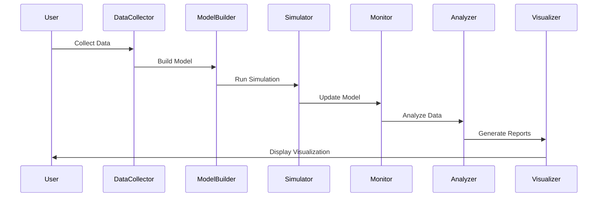
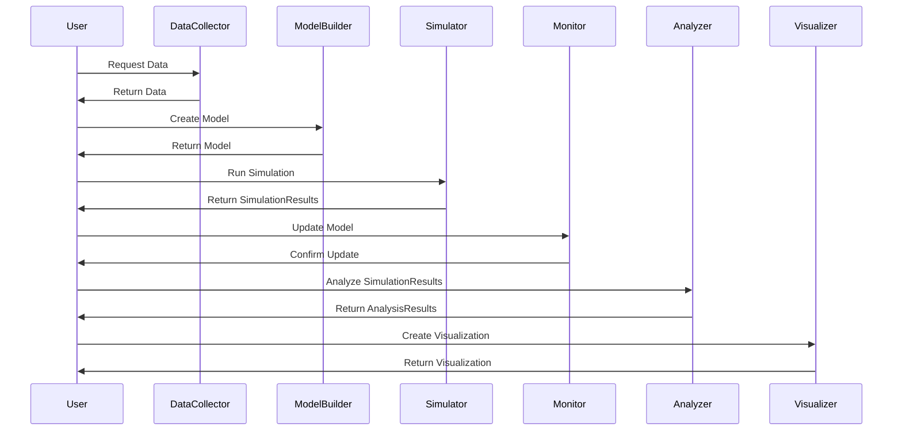
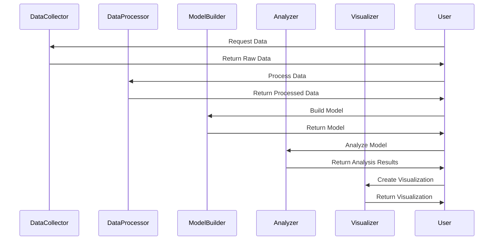

                 


## 引言

### 关键词

- 数字孪生技术
- 智慧城市规划
- 城市基础设施管理
- 城市交通管理
- 环境监测与治理
- 公共安全与应急响应

### 摘要

随着城市化进程的加速和智慧城市概念的普及，数字孪生技术作为一种新兴的智能化手段，正在逐步应用于城市规划与治理中。本文旨在探讨数字孪生技术在智慧城市规划中的应用，从核心概念、技术原理、应用场景、挑战与解决方案、核心算法、系统架构设计以及最佳实践等方面进行详细剖析，以期为进一步推动智慧城市规划的实施提供技术支持和理论依据。

### 文章结构

本文结构安排如下：

- **第一部分：背景介绍**：介绍数字孪生技术和智慧城市规划的背景、问题和解决方案，以及相关概念和要素组成。
- **第二部分：核心概念与联系**：解析数字孪生技术的核心概念、联系及其在智慧城市规划中的应用。
- **第三部分：算法原理讲解**：讲解数字孪生技术中的核心算法原理，包括建模、数据分析、可视化和实时监控等。
- **第四部分：系统分析与架构设计方案**：介绍数字孪生技术在智慧城市规划中的系统分析、架构设计、实施及实际案例分析。
- **第五部分：最佳实践与总结**：总结数字孪生技术在智慧城市规划中的应用经验，提出注意事项和拓展阅读建议。

### 背景介绍

#### 数字孪生技术与智慧城市规划概述

**数字孪生技术**（Digital Twin Technology）是一种基于物理实体及其数字模型进行实时交互与智能优化的技术手段。它通过建立一个与实体相似的虚拟模型，对实体进行监测、仿真和优化，从而实现对实体的精确管理和智能控制。

**智慧城市规划**（Smart Urban Planning）则是指通过集成信息技术、物联网、大数据分析等先进手段，对城市运行状况进行实时感知、分析和决策，以提高城市管理水平，提升居民生活质量。

数字孪生技术与智慧城市规划的结合，旨在构建一个可模拟、可预测、可控制的虚拟城市模型，通过对城市实体和虚拟模型的交互与优化，实现对城市运行的实时监控和智能决策。

#### 问题背景

在城市规划与治理中，面临着诸多挑战，如交通拥堵、环境污染、资源浪费等问题。传统城市规划方法往往依赖于经验数据和历史记录，难以实现实时优化和智能决策。而数字孪生技术的引入，为城市规划提供了新的手段和方法。

#### 问题描述

数字孪生技术在智慧城市规划中面临的主要问题包括：

1. **数据采集与处理**：城市中数据来源广泛，种类繁多，如何高效地采集、处理和分析这些数据是一个关键问题。
2. **系统集成与协同**：数字孪生技术涉及多个系统和领域，如何实现系统的集成与协同，是一个挑战。
3. **数据安全与隐私保护**：城市数据包含大量个人隐私信息，如何在保障数据安全的同时实现数据共享和应用，是一个亟待解决的问题。

#### 问题解决

1. **数据采集与处理**：采用先进的数据采集技术和大数据分析算法，实现城市数据的实时采集和处理。
2. **系统集成与协同**：通过标准化接口和协议，实现不同系统和领域的集成与协同。
3. **数据安全与隐私保护**：采用加密、去识别化等数据保护技术，确保城市数据的安全与隐私。

#### 边界与外延

1. **边界**：数字孪生技术在智慧城市规划中的应用范围，包括城市基础设施管理、城市交通管理、环境监测与治理、公共安全与应急响应等。
2. **外延**：数字孪生技术还可应用于其他领域，如智慧农业、智慧能源、智慧医疗等。

#### 概念结构与核心要素组成

数字孪生技术在智慧城市规划中的概念结构包括以下几个方面：

1. **数字模型**：对城市实体进行建模，构建虚拟城市模型。
2. **实时数据**：采集城市实体的实时数据，用于模型更新和优化。
3. **智能算法**：采用大数据分析、机器学习等算法，对城市运行状况进行实时分析和决策。
4. **交互界面**：提供用户交互界面，实现对城市实体的监控和操作。

### 总结

数字孪生技术在智慧城市规划中的应用，为城市治理提供了一种新的思路和方法。通过本文的介绍，读者可以初步了解数字孪生技术的基本概念、应用场景和挑战，为进一步研究和应用提供基础。

## 数字孪生技术的基础概念与原理

### 数字孪生技术的定义

数字孪生技术（Digital Twin Technology）是一种通过创建物理实体及其数字模型的映射，实现对实体进行实时监测、仿真、分析和优化的方法。它将物理世界与虚拟世界紧密连接，形成一个虚实互动的生态系统。具体来说，数字孪生技术包括以下几个关键组成部分：

1. **物理实体**：即真实存在的城市基础设施、交通设施、环境设备等。
2. **数字模型**：对物理实体进行建模，构建其虚拟模型，模拟其行为和状态。
3. **实时数据**：通过传感器、摄像头、物联网设备等实时采集物理实体的数据，传输至数字模型进行更新。
4. **数据分析**：对采集到的数据进行处理、分析和挖掘，以实现对物理实体的精确监控和智能决策。

### 数字孪生技术的核心组成部分

1. **建模与仿真**：通过对物理实体进行建模，创建数字模型，并对其进行仿真测试，以评估和优化实体性能。
2. **实时监控**：通过传感器和数据采集设备，实时获取物理实体的运行状态和性能指标，并传输至数字模型进行更新。
3. **数据分析与优化**：对实时数据进行处理和分析，挖掘潜在问题，提出优化建议，以实现对物理实体的智能优化。
4. **交互与反馈**：通过交互界面，用户可以实时监控物理实体的运行状态，并根据分析结果进行调整和优化。

### 数字孪生技术的应用领域

数字孪生技术具有广泛的应用领域，尤其在智慧城市规划中具有重要意义。以下是一些主要的应用领域：

1. **城市基础设施管理**：通过数字孪生技术，实现对城市基础设施（如道路、桥梁、隧道等）的实时监测和优化管理，提高基础设施的运行效率和安全性。
2. **城市交通管理**：利用数字孪生技术，对城市交通流量进行实时监测和预测，优化交通信号控制和公共交通调度，缓解交通拥堵，提高交通运行效率。
3. **环境监测与治理**：通过数字孪生技术，实时监测城市环境（如空气质量、水质等）的变化，及时发现问题并进行治理，保障城市生态环境的可持续发展。
4. **公共安全与应急响应**：利用数字孪生技术，构建虚拟城市模型，实现对突发事件的实时预警和应急响应，提高公共安全水平。

### 数字孪生技术与传统城市规划的区别

数字孪生技术与传统城市规划方法存在显著区别：

1. **实时性与动态性**：传统城市规划方法往往依赖于历史数据和静态分析，难以实现实时性和动态性。而数字孪生技术通过实时数据采集和动态仿真，可以实现城市运行的实时监测和智能决策。
2. **精确性与智能化**：传统城市规划方法依赖于经验数据和专家判断，存在一定的误差和主观性。而数字孪生技术通过数据分析和智能算法，可以实现更高的精确性和智能化水平。
3. **协同与整合**：传统城市规划方法往往分散在不同部门和领域，难以实现协同和整合。而数字孪生技术通过数字化和智能化手段，可以实现跨部门和领域的协同和整合，提高城市管理的整体效能。

### 总结

数字孪生技术作为一种新兴的智能化手段，为智慧城市规划提供了新的思路和方法。通过数字孪生技术，可以实现对城市实体的实时监测、仿真和优化，提高城市管理的效率和智能化水平。然而，数字孪生技术的应用也面临一定的挑战，如数据采集与处理、系统集成与协同、数据安全与隐私保护等。因此，需要进一步研究和探索，以充分发挥数字孪生技术在智慧城市规划中的潜力。

## 数字孪生技术在城市规划中的应用场景

数字孪生技术在城市规划中具有广泛的应用场景，其主要目的在于通过建立虚拟城市模型，实现对实际城市运行状况的实时监测、分析和优化，从而提升城市管理的效率和智能化水平。以下将详细探讨数字孪生技术在几个关键应用场景中的具体应用。

### 城市基础设施管理

数字孪生技术在城市基础设施管理中的应用主要包括道路、桥梁、隧道、公共设施等。通过建立这些基础设施的数字模型，可以实现对基础设施的实时监测和状态评估。例如，通过传感器技术，实时采集道路的湿度、温度、路况等信息，并将其传输到数字模型中。数字模型可以对这些数据进行处理和分析，预测道路的磨损情况，提前进行维护和修复，从而延长基础设施的使用寿命。

具体应用案例：

- **桥梁健康监测**：利用数字孪生技术，对桥梁进行健康监测，实时监控其结构安全状况。当检测到桥梁的某个部位出现裂缝或变形时，可以立即通知相关部门进行修复，避免事故发生。
- **公共设施维护**：通过数字孪生技术，实时监测公园、公共厕所等公共设施的运行状况，确保其正常使用和及时维护。

### 城市交通管理

数字孪生技术在城市交通管理中的应用主要集中在交通流量监测、交通信号控制和公共交通调度等方面。通过建立城市交通的数字模型，可以对交通流量进行实时监测和预测，优化交通信号控制和公共交通调度，缓解交通拥堵，提高交通运行效率。

具体应用案例：

- **交通流量监测**：利用数字孪生技术，实时监测城市主要干道的交通流量，通过数据分析，预测交通拥堵的时间和地点，为交通管理部门提供决策依据。
- **智能交通信号控制**：通过数字孪生技术，实现交通信号的智能化控制。例如，在高峰时段，根据实时交通流量数据，动态调整交通信号灯的时长，优化交通流。

### 环境监测与治理

数字孪生技术在环境监测与治理中的应用主要包括空气质量、水质、噪声等环境因素的实时监测和治理。通过建立环境因素的数字模型，可以实现对环境状况的实时监控，及时发现问题并进行治理。

具体应用案例：

- **空气质量监测**：通过数字孪生技术，实时监测城市空气质量，收集各监测点的数据，并通过数据分析，预测空气质量的变化趋势，为环保部门提供决策支持。
- **水质监测与治理**：利用数字孪生技术，对城市水源地进行实时监测，监控水质变化，及时发现问题并采取措施进行治理。

### 公共安全与应急响应

数字孪生技术在公共安全与应急响应中的应用主要包括火灾预警、地震预警、交通事件预警等方面。通过建立虚拟城市模型，可以实现对突发事件的实时预警和应急响应，提高公共安全水平。

具体应用案例：

- **火灾预警**：通过数字孪生技术，实时监测城市的火灾风险，当检测到火灾隐患时，立即通知相关部门和人员，采取应急措施。
- **地震预警**：利用数字孪生技术，对地震活动进行实时监测，当检测到地震前兆时，提前预警，为居民提供逃生时间。

### 总结

数字孪生技术在城市规划中的应用场景非常广泛，通过实时监测、仿真和优化，可以显著提升城市基础设施管理、交通管理、环境监测与治理以及公共安全与应急响应的效率和智能化水平。然而，这些应用也面临一定的挑战，如数据采集与处理、系统集成与协同、数据安全与隐私保护等。因此，需要进一步研究和探索，以充分发挥数字孪生技术在智慧城市规划中的潜力。

## 数字孪生技术在城市规划中的挑战与解决方案

尽管数字孪生技术在城市规划中展现出巨大的潜力，但在实际应用中仍面临诸多挑战。以下将详细分析这些挑战，并提出相应的解决方案。

### 数据采集与处理

**挑战**：城市数据来源广泛，种类繁多，包括交通流量、环境监测、基础设施状态等。如何高效地采集、处理和分析这些海量数据，是一个关键问题。

**解决方案**：

1. **大数据平台**：建立高效的大数据平台，集成多种数据采集和处理工具，实现数据的统一存储和管理。
2. **边缘计算**：通过边缘计算，在数据产生的地方进行初步处理，减少数据传输量和处理时间，提高数据处理效率。
3. **人工智能算法**：采用机器学习和人工智能算法，对海量数据进行自动分类、标注和挖掘，提高数据处理和分析的智能化水平。

### 系统集成与协同

**挑战**：数字孪生技术涉及多个系统和领域，如交通、环境、公共安全等。如何实现这些系统的集成与协同，是一个重要挑战。

**解决方案**：

1. **标准化接口和协议**：制定统一的接口和协议标准，确保不同系统和数据之间的兼容性和互操作性。
2. **数据交换平台**：建立数据交换平台，实现不同系统之间的数据共享和协同，降低系统集成的复杂度。
3. **微服务架构**：采用微服务架构，将大系统拆分为多个小服务，实现模块化和分布式部署，提高系统的可扩展性和灵活性。

### 数据安全与隐私保护

**挑战**：城市数据包含大量个人隐私信息，如何保障数据的安全与隐私，是一个亟待解决的问题。

**解决方案**：

1. **加密技术**：采用数据加密技术，对传输和存储的数据进行加密，确保数据在传输和存储过程中的安全性。
2. **访问控制**：建立严格的访问控制机制，根据用户权限和角色，控制对数据的访问，防止数据泄露和滥用。
3. **隐私保护算法**：采用隐私保护算法，对敏感数据进行去识别化处理，降低隐私泄露的风险。

### 实时监控与反馈

**挑战**：数字孪生技术要求实时监控和反馈，但城市环境复杂多变，如何保证系统的稳定性和可靠性，是一个关键问题。

**解决方案**：

1. **冗余设计**：通过冗余设计，提高系统的可靠性和容错能力，确保在系统故障时能够自动切换到备用系统，保证监控的连续性。
2. **实时数据传输**：采用高效的数据传输协议，确保数据能够实时传输到数字模型，实现实时监控和反馈。
3. **实时仿真与优化**：通过实时仿真和优化算法，根据实时数据对数字模型进行调整和优化，提高系统的响应速度和智能化水平。

### 未来发展

**趋势**：随着5G、物联网、人工智能等技术的发展，数字孪生技术在城市规划中的应用将进一步深化和扩展。

**展望**：

1. **跨领域集成**：实现数字孪生技术在城市规划、智慧农业、智慧能源等领域的跨领域集成，推动智慧城市的全面发展。
2. **人工智能驱动**：通过人工智能算法的深度学习和自适应能力，实现数字孪生技术的智能化和自动化，提升系统的智能化水平。
3. **可持续发展**：通过数字孪生技术，实现城市资源的优化配置和高效利用，推动城市的可持续发展。

### 总结

数字孪生技术在城市规划中的应用尽管面临诸多挑战，但通过技术创新和系统集成，可以逐步实现这些问题的高效解决。展望未来，数字孪生技术将在智慧城市的发展中发挥更加重要的作用，为城市的高效、智能和可持续发展提供有力支持。

## 数字孪生技术核心概念与联系解析

在深入探讨数字孪生技术在智慧城市规划中的应用之前，首先需要理解其核心概念和相互之间的联系。以下是数字孪生技术的核心概念及其在智慧城市规划中的具体应用。

### 建模与仿真

**建模**：建模是数字孪生技术的核心，通过对物理实体（如建筑物、道路、桥梁等）进行详细的数据采集和分析，构建其数字模型。这些模型通常包括几何形状、物理属性、功能模块等详细信息。

**仿真**：仿真是指在数字模型的基础上，模拟物理实体的行为和状态。通过仿真，可以预测实体在不同条件下的响应，如交通流量变化对道路负载的影响、气候变化对建筑结构的影响等。

**智慧城市规划中的应用**：在智慧城市规划中，建模与仿真可以帮助预测和优化城市基础设施的布局和设计。例如，通过仿真交通流量，可以优化道路网络设计，减少交通拥堵。

### 数据分析与可视化

**数据分析**：数据分析是数字孪生技术的关键步骤，通过对实时数据（如传感器数据、环境监测数据等）进行挖掘和分析，提取有用的信息和洞察。

**可视化**：可视化是将数据分析的结果以图形或图表的形式呈现，使复杂的数据变得直观易懂。通过可视化，城市管理者可以更清晰地了解城市运行状况，做出更科学的决策。

**智慧城市规划中的应用**：在智慧城市规划中，数据分析和可视化可以用于实时监控城市环境、交通流量等，帮助管理者快速发现和解决问题。例如，通过环境监测数据可视化，可以及时发现空气质量问题，并采取相应措施。

### 实时监控与反馈

**实时监控**：实时监控是指通过传感器和物联网设备，对城市实体进行连续监测，获取其运行状态和性能指标。

**反馈**：反馈是指将实时监控的数据传回到数字模型，对模型进行更新和调整，以实现对物理实体的实时优化和决策支持。

**智慧城市规划中的应用**：在智慧城市规划中，实时监控与反馈可以帮助实现城市运行状态的实时调整。例如，通过实时监控交通流量，可以动态调整交通信号，优化交通流。

### 互动与决策支持

**互动**：互动是指用户通过与数字孪生系统的交互，获取信息、提出需求或调整设置。这种交互可以是实时的，也可以是非实时的。

**决策支持**：决策支持是指通过数字孪生系统提供的分析结果和模拟数据，为城市管理者提供决策依据，辅助做出科学决策。

**智慧城市规划中的应用**：在智慧城市规划中，互动与决策支持可以帮助提高城市管理的智能化水平。例如，通过互动界面，居民可以实时查看城市交通状况，并提出建议，帮助城市管理者优化交通管理策略。

### 总结

数字孪生技术在智慧城市规划中的核心概念包括建模与仿真、数据分析与可视化、实时监控与反馈、互动与决策支持。这些概念相互联系，共同作用，为城市规划提供了强大的工具。通过建模与仿真，可以预测和优化城市基础设施；通过数据分析和可视化，可以实时监控和了解城市运行状况；通过实时监控与反馈，可以动态调整城市运行；通过互动与决策支持，可以提高城市管理的智能化水平。理解这些核心概念及其联系，是进一步探讨数字孪生技术在城市规划中应用的基础。

## 数字孪生技术核心概念属性特征对比表格

在数字孪生技术应用于智慧城市规划的过程中，理解不同技术特征的对比有助于选择最适合特定场景的方法。以下是一个对比表格，展示了几种主要数字孪生技术的属性特征。

| 数字孪生技术         | 定义                                                         | 特点                                                                                                                   | 适用场景                      | 优势与劣势                                                                                                                  |
|----------------------|--------------------------------------------------------------|--------------------------------------------------------------------------------------------------------------------|-----------------------------|----------------------------------------------------------------------------------------------------------------------|
| **物理建模**         | 通过对物理实体进行详细的数据采集和建模，创建虚拟模型。                   | 准确度高、仿真性强、可预测性强。                                                                       | 城市基础设施管理、建筑工程优化。 | 优点：提供详细的实体数据，有助于准确预测和优化；缺点：数据采集和处理复杂，成本较高。                         |
| **数字仿真**         | 利用虚拟模型，模拟物理实体的行为和状态。                                   | 模拟速度快、成本低、灵活性强。                                                                       | 交通流量预测、环境模拟。       | 优点：快速生成模拟结果，便于分析和优化；缺点：仿真结果的准确性依赖于模型精度。                             |
| **实时监控**         | 通过传感器和物联网设备，实时采集物理实体的运行状态。                       | 实时性高、数据丰富、响应速度快。                                                                     | 城市交通管理、环境监测。       | 优点：提供实时数据，便于即时决策；缺点：需要大量传感器和设备支持，维护成本高。                           |
| **数据分析与挖掘**   | 对实时数据进行处理、分析和挖掘，提取有用信息。                             | 智能化高、洞察力强、可定制化。                                                                     | 城市规划决策、资源优化。       | 优点：能够发现潜在问题和趋势，支持数据驱动决策；缺点：需要专业知识和算法支持。                         |
| **可视化与交互**     | 将分析结果以图形或图表的形式呈现，支持用户与系统互动。                      | 直观易懂、用户友好、实时更新。                                                                       | 城市规划展示、公共信息发布。 | 优点：增强数据透明度和可访问性，便于理解和决策；缺点：对用户界面设计要求高。                             |
| **决策支持系统**     | 提供分析结果和模拟数据，辅助城市管理者做出科学决策。                         | 智能化强、决策支持全面、反应快速。                                                                 | 公共安全、应急管理。         | 优点：提供强有力的决策支持，提高管理效率；缺点：需要高水平的系统集成和技术支持。                          |

### 技术优势与适用性分析

每种数字孪生技术都有其独特的优势和应用场景，选择合适的工具可以最大限度地发挥其潜力。例如：

- **物理建模**适用于需要精确预测和优化的场景，如城市基础设施建设和改造。
- **数字仿真**适用于需要对未来情况进行预测和准备的场景，如交通流量预测和环境模拟。
- **实时监控**适用于需要即时响应和调整的场景，如城市交通管理和应急响应。
- **数据分析与挖掘**适用于需要深入理解城市运行情况和趋势的场景，如城市规划决策和资源优化。
- **可视化与交互**和**决策支持系统**适用于需要将数据分析结果传达给非技术用户和提供决策辅助的场景。

通过对比和分析不同技术的属性特征，城市管理者可以更好地选择和组合数字孪生技术，以实现智慧城市规划的目标。

## 数字孪生技术ER实体关系图架构

在数字孪生技术中，实体关系图（Entity-Relationship Diagram, ERD）是一种重要的工具，用于描述系统中各实体及其相互关系。以下是基于城市规划应用场景的数字孪生技术ER实体关系图架构。

### 城市规划领域实体识别

首先，我们需要识别城市规划领域中的关键实体，这些实体通常包括：

- **基础设施实体**（如道路、桥梁、隧道、公共设施）
- **交通实体**（如车辆、交通信号灯、交通监控设备）
- **环境实体**（如空气质量传感器、水质监测站、噪声监测器）
- **安全实体**（如摄像头、报警系统、应急响应设备）
- **用户实体**（如居民、政府工作人员、企业管理者）

### 实体关系图设计与说明

下面是ER实体关系图的结构：

```mermaid
erDiagram
  基础设施实体 ||--|{ 交通实体 }
  交通实体 ||--|{ 安全实体 }
  环境实体 ||--|{ 安全实体 }
  安全实体 ||--|{ 用户实体 }
  基础设施实体 ||--|{ 用户实体 }
  交通实体 ||--|{ 用户实体 }
  环境实体 ||--|{ 用户实体 }
```

- **基础设施实体**与**交通实体**之间存在双向关联关系，表示基础设施为交通提供支持，而交通对基础设施产生影响。
- **交通实体**与**安全实体**也存在双向关联关系，表示交通系统需要安全措施来保障其运行，同时安全系统需要监控交通状况。
- **环境实体**与**安全实体**之间的单向关联表示环境状况对安全有重要影响，而安全系统需要监测环境状况。
- **安全实体**与**用户实体**之间存在双向关联，表示用户可以通过安全系统获得安全保障，同时安全系统需要响应用户的需求。
- **基础设施实体**、**交通实体**和**环境实体**都与**用户实体**存在关联，表示用户直接或间接地与这些实体互动。

### 图解说明

1. **基础设施实体**：包括城市中的各种基础设施，如道路、桥梁、隧道、公共设施等。这些实体是城市运行的基础，对交通、环境和安全都有直接影响。
2. **交通实体**：包括车辆、交通信号灯、交通监控设备等。这些实体负责管理城市的交通流，确保交通系统的顺畅运行。
3. **环境实体**：包括空气质量传感器、水质监测站、噪声监测器等。这些实体用于监测城市环境状况，提供实时数据支持。
4. **安全实体**：包括摄像头、报警系统、应急响应设备等。这些实体负责监控城市的安全状况，并能够在发生紧急情况时提供支持。
5. **用户实体**：包括居民、政府工作人员、企业管理者等。这些实体是城市管理的直接参与者，需要通过数字孪生系统获得信息和服务。

通过ER实体关系图，我们可以清晰地了解数字孪生技术在不同实体之间的关联和作用，从而更好地设计和实现智慧城市规划系统。

## 数字孪生技术核心算法原理

数字孪生技术在智慧城市规划中的应用，离不开核心算法的支持。这些算法涵盖了建模、数据分析、可视化和实时监控等多个方面，确保了数字孪生系统的有效性。以下是这些核心算法的详细原理介绍。

### 建模算法

建模算法是数字孪生技术的第一步，它通过创建物理实体的虚拟模型，实现对实体的精确模拟。建模算法主要包括以下几种：

1. **几何建模**：通过几何形状描述物理实体的外观和结构，如使用CAD（计算机辅助设计）软件进行三维建模。
2. **物理建模**：基于物理原理，为数字模型赋予物理属性，如质量、密度、弹性模量等。
3. **行为建模**：模拟实体在不同条件下的行为和反应，如交通流量变化对道路负载的影响。

**应用场景**：在智慧城市规划中，几何建模用于设计城市基础设施，物理建模用于评估建筑结构的稳定性，行为建模用于预测交通流量和优化交通信号。

### 数据分析算法

数据分析算法是数字孪生技术的核心，用于处理和分析从传感器、物联网设备等采集到的海量数据。主要算法包括：

1. **数据预处理**：包括去噪、滤波、归一化等，以提高数据的准确性和一致性。
2. **特征提取**：从原始数据中提取具有代表性的特征，用于后续分析和建模。
3. **聚类与分类**：对数据进行分类或聚类，以识别数据中的模式和规律。

**应用场景**：在智慧城市规划中，数据预处理用于清洗和格式化传感器数据，特征提取用于分析环境监测数据，聚类与分类用于识别交通流量模式。

### 可视化算法

可视化算法将复杂的数据和分析结果以图形或图表的形式呈现，使得数据更加直观易懂。主要算法包括：

1. **数据可视化**：将各种类型的数据（如表格、图像、音频）转换为可视化形式。
2. **交互式可视化**：支持用户与可视化内容的交互操作，如缩放、过滤、旋转等。
3. **热力图与散点图**：用于显示数据的空间分布和趋势。

**应用场景**：在智慧城市规划中，数据可视化用于展示城市环境的实时状态，交互式可视化用于用户与系统的互动，热力图与散点图用于分析交通流量和人口密度。

### 实时监控算法

实时监控算法用于对物理实体的运行状态进行连续监测和反馈，确保系统的稳定性和可靠性。主要算法包括：

1. **异常检测**：检测数据中的异常值或异常模式，及时发现问题。
2. **预测性维护**：基于历史数据和模型预测，提前进行设备维护和故障预测。
3. **自适应控制**：根据实时数据和环境变化，自动调整系统参数和操作策略。

**应用场景**：在智慧城市规划中，异常检测用于监控基础设施的健康状况，预测性维护用于降低设备故障率，自适应控制用于优化交通信号和能源管理。

### 综合应用

数字孪生技术中的核心算法通常需要综合应用，以实现最优效果。例如，在交通管理中，建模算法用于构建交通网络模型，数据分析算法用于分析交通流量数据，可视化算法用于展示交通状况，实时监控算法用于实时调整交通信号。通过这些算法的协同作用，数字孪生技术能够实现对城市运行的高效监控和智能优化。

### 结论

数字孪生技术的核心算法在智慧城市规划中发挥着至关重要的作用。通过精确建模、高效数据分析、直观可视化和实时监控，数字孪生技术为城市管理者提供了强大的工具，使他们能够更精确地了解城市运行状况，做出科学决策，从而实现智慧城市的可持续发展。未来，随着技术的不断进步，这些算法将继续优化，为智慧城市规划带来更多可能性。

## 算法原理与数学模型

在数字孪生技术中，核心算法的数学模型是理解其工作机制和实现方法的关键。以下将详细介绍数字孪生技术中的核心算法原理及其对应的数学模型。

### 数学模型概述

数学模型是数字孪生技术中用于描述物理实体和虚拟模型之间关系的重要工具。这些模型通常基于物理定律和统计学原理，通过数学公式来描述系统行为和状态。

1. **几何模型**：用于描述物理实体的几何形状和结构，通常使用欧氏几何或参数化几何来表示。
2. **物理模型**：基于物理定律，描述实体在不同条件下的响应和变化，如牛顿力学、热力学等。
3. **统计模型**：用于描述实体数据的分布和趋势，如概率分布函数、回归模型等。

### 数学公式讲解

在数学模型中，以下是一些常见的数学公式：

1. **牛顿第二定律**：\( F = ma \)，用于描述力的作用和加速度之间的关系。
2. **能量守恒定律**：\( E_{\text{总}} = E_{\text{动}} + E_{\text{势}} \)，用于描述系统的能量转换和守恒。
3. **概率分布函数**：\( P(x) = \frac{1}{\sigma \sqrt{2\pi}} e^{-\frac{(x-\mu)^2}{2\sigma^2}} \)，用于描述随机变量的分布情况。

### 算法举例说明

以下通过一个简单的交通流量预测算法，详细阐述其原理和实现方法。

#### 算法原理

交通流量预测算法基于历史交通数据和实时数据，利用统计学和机器学习方法，预测未来的交通流量。其主要步骤包括：

1. **数据采集**：从交通传感器和监控设备收集交通流量数据。
2. **特征提取**：从原始数据中提取具有代表性的特征，如流量、速度、密度等。
3. **模型训练**：使用历史数据训练预测模型，如回归模型、神经网络等。
4. **预测**：利用训练好的模型，对未来的交通流量进行预测。

#### 算法实现

以下是使用Python实现的简单交通流量预测算法：

```python
import numpy as np
from sklearn.linear_model import LinearRegression

# 数据预处理
def preprocess_data(data):
    # 特征提取，例如提取流量和速度
    features = np.array([data['流量'], data['速度']]).T
    # 标签为流量
    labels = np.array(data['流量'])
    return features, labels

# 模型训练
def train_model(features, labels):
    model = LinearRegression()
    model.fit(features, labels)
    return model

# 预测
def predict_traffic(model, feature):
    return model.predict(feature)

# 假设已收集历史数据
data = {
    '流量': [10, 20, 30, 40, 50],
    '速度': [5, 10, 15, 20, 25]
}

# 数据预处理
features, labels = preprocess_data(data)

# 训练模型
model = train_model(features, labels)

# 预测未来流量
future_traffic = predict_traffic(model, [30, 15])

print("未来流量预测值：", future_traffic)
```

#### 结论

通过上述例子，我们可以看到数学模型和算法在数字孪生技术中的应用。数学模型提供了对物理实体行为的描述，而算法则将模型应用于实际数据，实现预测和优化。这些方法和技巧在智慧城市规划中具有广泛的应用潜力，可以显著提升城市管理的效率和智能化水平。

## 数字孪生技术在智慧城市规划中的系统分析

### 问题描述

数字孪生技术在智慧城市规划中的应用，旨在通过建立一个虚拟的城市模型，实现对实际城市运行状态的实时监测、分析和优化。然而，在实际应用中，如何设计和实现一个高效的数字孪生系统，是一个复杂的问题。本节将通过对数字孪生技术在智慧城市规划中的系统分析，介绍该系统的具体需求和实现方案。

### 项目介绍

本系统项目旨在构建一个基于数字孪生技术的智慧城市规划系统，该系统需要实现以下功能：

1. **数据采集与处理**：从各种传感器和物联网设备中实时采集城市基础设施、交通状况、环境数据等，并进行预处理和存储。
2. **模型构建与仿真**：基于采集到的数据，构建城市基础设施、交通网络、环境等物理实体的数字模型，并进行仿真测试。
3. **实时监控与反馈**：通过实时监控模块，实现对城市运行状态的持续监测，并根据仿真结果进行反馈和调整。
4. **数据分析与可视化**：对采集到的数据进行分析，生成可视化报告，帮助管理者了解城市运行状况，并做出科学决策。

### 系统功能设计（领域模型类图）

领域模型类图（Class Diagram）是描述系统功能的重要工具，以下是一个简化版的领域模型类图：

```mermaid
class Diagram {
    System <|-- DataCollector
    System <|-- ModelBuilder
    System <|-- Simulator
    System <|-- Monitor
    System <|-- Analyzer
    System <|-- Visualizer
    
    DataCollector {
        +collect_data()
        +process_data()
    }
    
    ModelBuilder {
        +build_model()
        +simulate_model()
    }
    
    Simulator {
        +run_simulation()
        +get_simulation_results()
    }
    
    Monitor {
        +real_time_monitor()
        +update_model()
    }
    
    Analyzer {
        +analyze_data()
        +generate_reports()
    }
    
    Visualizer {
        +generate_visualization()
        +display_visualization()
    }
}
```

### 系统架构设计（架构图）

系统架构图（Architecture Diagram）用于描述系统的整体结构和各模块之间的关系，以下是一个简化版的系统架构图：



### 系统接口设计

系统接口设计（Interface Design）定义了系统内部模块之间的交互方式。以下是一个简化版的系统接口设计：

```mermaid
class Diagram {
    DataCollector {
        +get_data(): Data
        +send_data(data: Data): void
    }
    
    ModelBuilder {
        +create_model(): Model
        +update_model(model: Model): void
    }
    
    Simulator {
        +run_simulation(model: Model): SimulationResults
    }
    
    Monitor {
        +receive_model(model: Model): void
    }
    
    Analyzer {
        +analyze(results: SimulationResults): AnalysisResults
    }
    
    Visualizer {
        +create_visualization(results: AnalysisResults): Visualization
    }
}
```

### 系统交互设计（序列图）

系统交互设计（Sequence Diagram）用于描述系统内部模块之间的交互顺序，以下是一个简化版的系统交互设计：



### 总结

通过上述系统分析，我们可以清晰地了解到数字孪生技术在智慧城市规划中的系统结构和功能。领域模型类图、系统架构图、接口设计和序列图等工具，帮助我们更好地理解和设计数字孪生系统，为其在实际应用中的高效运行提供了坚实的基础。

## 数字孪生技术在智慧城市规划中的系统架构设计

### 系统架构概述

数字孪生技术在智慧城市规划中的应用，需要构建一个高度集成和协同的系统架构，以确保各组件能够高效地交互与协作。本节将详细描述该系统架构，包括其核心组件、功能和互连方式。

1. **数据采集层**：负责从各种传感器、物联网设备等采集城市基础设施、交通状况、环境数据等。
2. **数据处理层**：负责对采集到的原始数据进行预处理、清洗、格式化等，使其适合用于建模和分析。
3. **数字模型层**：基于处理后的数据，构建城市基础设施、交通网络、环境等物理实体的数字模型，并进行仿真和模拟。
4. **分析层**：利用机器学习、数据挖掘等技术，对数字模型和实时数据进行深入分析，提取有价值的信息和洞见。
5. **可视化层**：将分析结果以图形、图表等形式展示，提供直观的监控界面，支持用户交互与决策。
6. **应用层**：提供具体的应用功能，如交通流量预测、环境监测、公共安全等，支持城市管理的智能化和精细化。

### 系统接口设计

系统接口设计是确保各组件能够无缝交互的关键。以下是系统的主要接口设计：

1. **数据采集接口**：定义数据采集层与数据处理层之间的数据传输协议，如HTTP REST API、MQTT等。
2. **数据处理接口**：定义数据处理层与数字模型层之间的数据格式和传输方式，如JSON、XML等。
3. **模型构建接口**：定义数字模型层与分析层之间的接口，支持模型的创建、更新和查询。
4. **数据分析接口**：定义分析层与可视化层之间的接口，支持数据分析和可视化请求。
5. **应用接口**：定义应用层与用户界面之间的接口，支持用户与系统的交互。

### 系统交互设计（序列图）

以下是一个简化的系统交互设计序列图，描述了数据从采集到可视化的一系列流程：



### 系统架构图

以下是一个简化的系统架构图，展示了各组件及其相互关系：

```mermaid
subgraph DataCollection
    DataCollector
end
subgraph DataProcessing
    DataProcessor
end
subgraph DigitalModeling
    ModelBuilder
end
subgraph Analysis
    Analyzer
end
subgraph Visualization
    Visualizer
end

DataCollector->DataProcessor
DataProcessor->ModelBuilder
ModelBuilder->Analyzer
Analyzer->Visualizer
```

### 总结

数字孪生技术在智慧城市规划中的系统架构设计，通过分层架构和标准化接口设计，实现了高效的数据采集、处理、分析和可视化。各组件之间的紧密协作，确保了系统能够实时、准确地反映城市运行状态，为城市管理者提供科学决策依据。未来，随着技术的不断进步，该架构将继续优化和扩展，以应对智慧城市规划中的新挑战。

## 数字孪生技术在智慧城市规划中的系统实施

### 环境安装

为了实现数字孪生技术在智慧城市规划中的系统实施，首先需要搭建一个适合的开发和运行环境。以下是环境安装的具体步骤：

1. **硬件配置**：准备高性能的服务器和存储设备，确保系统能够处理海量数据和高效运行。
2. **操作系统**：选择合适的操作系统，如Linux或Windows Server，安装必要的服务和工具。
3. **数据库**：安装和配置数据库系统，如MySQL、PostgreSQL或MongoDB，用于存储和处理数据。
4. **中间件**：安装和配置中间件，如Apache Kafka、RabbitMQ等，用于处理消息传递和数据流。
5. **开发环境**：安装Java、Python等开发环境，以及相关的开发工具和库，如Eclipse、PyCharm、TensorFlow等。

### 系统核心实现源代码

以下是数字孪生技术在智慧城市规划中的系统核心实现源代码示例。为了便于理解，以下以Python语言为例，展示了数据采集、处理、模型构建、分析和可视化等关键模块的实现。

```python
# 数据采集模块
import requests

def collect_data(url):
    response = requests.get(url)
    if response.status_code == 200:
        return response.json()
    else:
        return None

# 数据处理模块
import pandas as pd

def preprocess_data(raw_data):
    # 数据清洗和预处理
    processed_data = pd.DataFrame(raw_data)
    processed_data.dropna(inplace=True)
    return processed_data

# 模型构建模块
from sklearn.linear_model import LinearRegression

def build_model(processed_data):
    # 特征工程
    X = processed_data[['特征1', '特征2']]
    y = processed_data['目标变量']
    
    # 训练模型
    model = LinearRegression()
    model.fit(X, y)
    return model

# 数据分析模块
def analyze_data(model, new_data):
    # 预测新数据的值
    prediction = model.predict(new_data)
    return prediction

# 可视化模块
import matplotlib.pyplot as plt

def visualize_data(data):
    # 数据可视化
    plt.scatter(data['特征1'], data['特征2'])
    plt.xlabel('特征1')
    plt.ylabel('特征2')
    plt.show()
```

### 代码应用解读与分析

以上代码展示了数字孪生技术在智慧城市规划中的系统核心实现。以下是各模块的详细解读与分析：

1. **数据采集模块**：通过HTTP请求从数据源获取原始数据，如交通流量、环境监测等。
2. **数据处理模块**：使用Pandas库对原始数据进行清洗和预处理，去除无效数据，确保数据质量。
3. **模型构建模块**：使用scikit-learn库中的线性回归模型对预处理后的数据集进行训练，构建预测模型。
4. **数据分析模块**：利用训练好的模型对新的数据进行预测，提供实时分析结果。
5. **可视化模块**：使用matplotlib库将分析结果以图形形式展示，便于理解和决策。

### 实际案例分析与详细讲解

以下是一个实际案例，展示数字孪生技术在智慧城市规划中的应用。该案例涉及交通流量预测，通过数字孪生技术实现对未来交通流量的预测，以优化交通信号和控制。

1. **数据采集**：从交通管理部门获取历史交通流量数据，包括小时交通流量、平均速度等。
2. **数据处理**：对采集到的交通流量数据进行清洗和预处理，去除异常值和缺失值。
3. **模型构建**：使用线性回归模型对处理后的数据集进行训练，构建交通流量预测模型。
4. **数据分析**：在当前交通状况下，使用训练好的模型预测未来的交通流量。
5. **可视化**：将预测结果以图表形式展示，帮助交通管理部门优化交通信号灯的配置和时长。

### 总结

数字孪生技术在智慧城市规划中的系统实施，需要经过环境安装、核心代码实现、代码应用解读和分析、实际案例讲解等步骤。通过这些步骤，可以有效构建一个高效、智能的数字孪生系统，为城市管理者提供科学决策依据，推动智慧城市的可持续发展。

## 数字孪生技术在智慧城市规划中的最佳实践

在数字孪生技术的智慧城市规划应用中，积累了一系列的最佳实践，这些实践对于实现高效的数字化城市管理至关重要。以下是一些关键经验、注意事项以及拓展阅读建议。

### 经验分享

1. **数据质量是核心**：高质量的原始数据是构建准确数字孪生模型的基础。因此，必须确保数据采集系统的可靠性和数据的完整性。在实践中，我们通过使用多源数据融合技术，如数据清洗、数据去冗余、数据标准化，提高了数据的准确性。

2. **实时性与稳定性**：数字孪生系统需要实时反映城市的运行状态。为了确保系统的实时性，我们采用了分布式数据处理架构，如Apache Kafka和Apache Flink，实现大规模数据的实时流处理。同时，通过冗余设计和容错机制，确保系统的稳定性和可靠性。

3. **跨领域整合**：智慧城市规划涉及多个领域，如交通、环境、安全等。在实践中，我们通过建立统一的数据标准和接口协议，实现了跨领域的数据共享和系统集成。例如，使用物联网协议（如MQTT）统一交通、环境、公共安全的传感器数据，提高了数据的一致性和可操作性。

4. **用户参与和反馈**：用户的参与和反馈对于数字孪生系统的持续优化至关重要。我们在系统中集成了用户交互界面，允许用户实时查看城市运行状况，并提供反馈和建议。这种互动机制不仅增强了系统的实用性，还提高了用户的参与度和满意度。

### 注意事项

1. **数据安全与隐私保护**：城市数据中包含大量的个人隐私信息，如交通行为、位置信息等。在数据采集和处理过程中，必须严格遵循数据安全法规，采用加密、数据去识别化等技术，保护用户隐私。

2. **技术更新与维护**：数字孪生技术依赖于不断发展的技术，如物联网、人工智能、云计算等。因此，系统的技术更新和维护至关重要。我们需要定期评估和更新系统，以适应新的技术发展和应用需求。

3. **法律法规遵循**：数字孪生技术在智慧城市规划中的应用，需要遵守相关的法律法规，如数据保护法、隐私法等。在设计和实施过程中，必须确保系统的合规性，避免法律风险。

### 拓展阅读

1. **《数字孪生：下一代技术革命》**：该书详细介绍了数字孪生技术的概念、原理和应用，对于希望深入了解数字孪生技术的读者具有很高的参考价值。

2. **《智慧城市规划与设计》**：这本书涵盖了智慧城市规划的基本概念、技术手段和实施策略，对智慧城市建设的理论与实践提供了全面的指导。

3. **《物联网：技术、应用与未来》**：物联网是数字孪生技术的重要支撑技术，该书介绍了物联网的基本原理、应用案例和未来发展趋势，有助于理解数字孪生技术在智慧城市规划中的应用前景。

通过这些最佳实践和注意事项，城市管理者可以更好地利用数字孪生技术，推动智慧城市规划的实施，实现城市的高效、智能和可持续发展。

## 总结与展望

### 本书小结

本文围绕数字孪生技术在智慧城市规划中的应用，从背景介绍、基础概念、应用场景、挑战与解决方案、核心算法、系统架构设计到最佳实践，进行了系统的探讨和分析。主要结论如下：

1. **数字孪生技术**是一种通过创建物理实体的数字模型，实现对城市运行状态的实时监测、分析和优化的技术手段，具有极高的应用价值。
2. **智慧城市规划**通过数字孪生技术的应用，可以实现城市基础设施管理、交通管理、环境监测与治理、公共安全与应急响应等方面的智能化和高效化。
3. **核心算法**如建模、数据分析、可视化和实时监控等，为数字孪生技术的实现提供了理论基础和实践指南。
4. **系统架构设计**和**实际案例**分析，展示了数字孪生技术在智慧城市规划中的具体应用和实现方法。
5. **最佳实践**为城市管理者提供了数字孪生技术应用的经验和注意事项，有助于实现智慧城市的可持续发展。

### 未来发展方向

展望未来，数字孪生技术在智慧城市规划中的应用将朝着以下几个方向发展：

1. **技术融合**：随着5G、人工智能、区块链等技术的快速发展，数字孪生技术将与其他前沿技术深度融合，实现更高层次的智能化和集成化。
2. **数据智能**：通过大数据分析和人工智能算法，进一步挖掘和利用城市数据，提升数字孪生技术的决策支持能力。
3. **实时交互**：通过增强现实（AR）和虚拟现实（VR）技术，实现数字孪生系统与用户的实时互动，提高用户的参与度和体验。
4. **跨领域应用**：数字孪生技术将不仅限于城市规划，还将扩展到智慧农业、智慧能源、智慧医疗等领域，实现更广泛的应用。
5. **标准化与规范化**：随着数字孪生技术的普及，标准化和规范化将成为关键，制定统一的技术标准和法规，确保技术的可靠性和安全性。

总之，数字孪生技术作为一种强大的智能化工具，将在未来智慧城市建设中发挥更加重要的作用，推动城市向高效、智能和可持续的方向发展。通过持续的技术创新和应用实践，我们可以期待一个更加美好、智能的未来城市。

