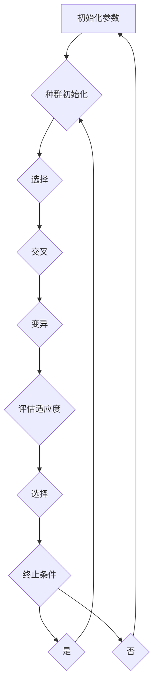
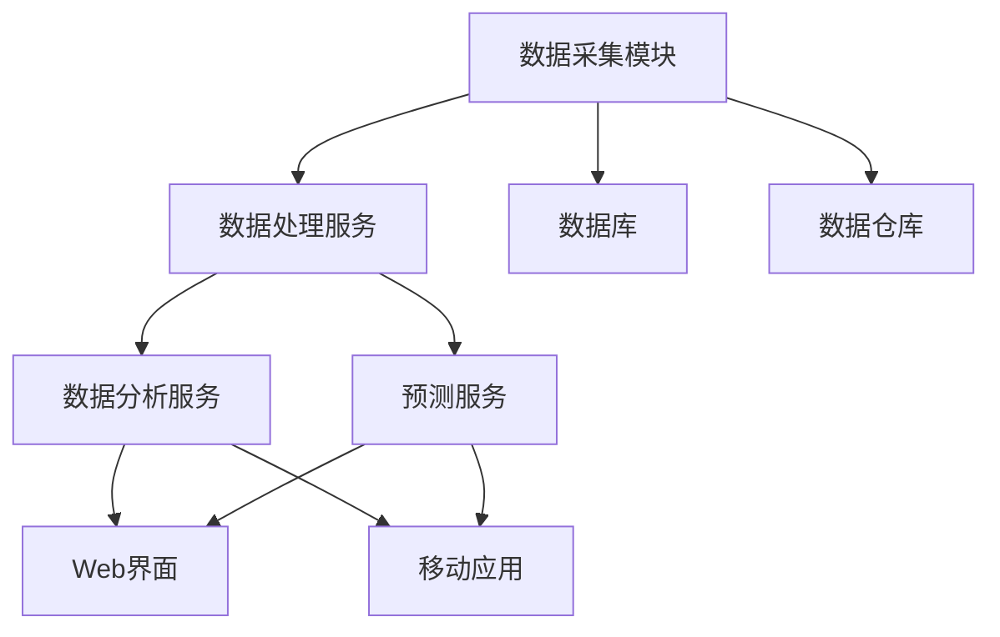
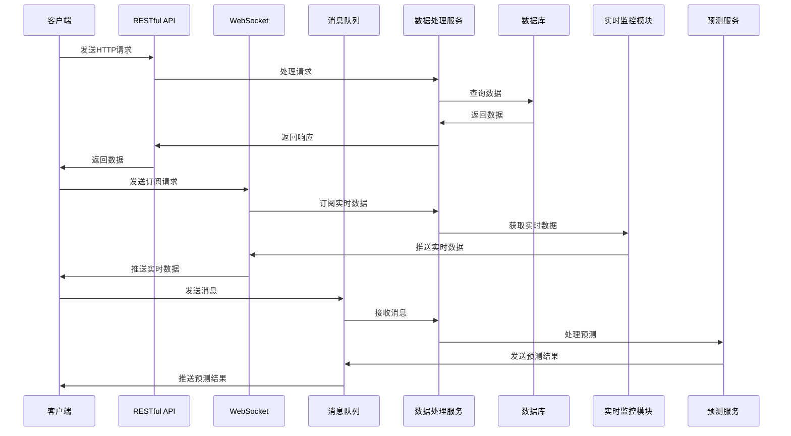

                 


### 第1章：引言

#### 1.1 数字孪生技术的定义与特点

数字孪生技术（Digital Twin Technology）是一种先进的信息物理系统（Cyber-Physical System, CPS）构建方法，通过数字模型与实体系统之间的高度相似性和实时交互，实现对实体系统全生命周期的高效管理与优化。数字孪生技术具有以下几个核心特点：

1. **物理实体与虚拟模型同步**：数字孪生技术能够实时同步物理实体的状态，通过传感器收集数据，构建并更新虚拟模型的参数，确保虚拟与实体的同步性。
2. **实时监控与反馈**：数字孪生技术能够对实体系统的运行状态进行实时监控，并将数据反馈到虚拟模型中，实现快速响应和优化调整。
3. **数据驱动的决策支持**：数字孪生技术通过分析海量数据，提供决策支持，优化实体系统的运行效率、质量和安全性。
4. **全生命周期管理**：数字孪生技术贯穿于实体系统的设计、制造、运营、维护和退役的全过程，提供全方位的管理和服务。

#### 1.2 智能制造的定义与特点

智能制造（Intelligent Manufacturing）是一种基于现代信息技术、自动化技术和先进制造技术的生产模式，旨在通过智能化手段实现制造过程的优化与升级。智能制造的主要特点包括：

1. **自组织性**：智能制造系统能够根据环境变化自动调整自身的行为，适应不同的制造需求。
2. **自适应能力**：智能制造系统能够通过学习和优化，提高生产效率和质量。
3. **数据驱动**：智能制造依赖于海量数据，通过数据分析实现生产过程的精细化管理。
4. **网络协同**：智能制造通过互联网实现制造资源的共享与协同，提高制造系统的整体效率。

#### 1.3 数字孪生技术与智能制造的关系

数字孪生技术与智能制造有着紧密的联系和相互促进的作用。首先，数字孪生技术为智能制造提供了数据基础和虚拟仿真平台，使得智能制造系统能够通过数字模型对实体系统进行实时监控和优化。其次，智能制造的推进也为数字孪生技术的发展提供了应用场景和需求动力，推动数字孪生技术的不断创新和完善。

#### 1.4 数字孪生技术在智能制造中的应用案例

数字孪生技术在智能制造中的应用非常广泛，以下是一些典型的应用案例：

1. **汽车制造业**：在汽车制造过程中，数字孪生技术用于模拟和分析汽车的设计、制造和运行状态，优化制造流程，提高生产效率。
2. **航空航天制造业**：数字孪生技术用于航空航天器的制造和运行监控，通过虚拟仿真和实时数据反馈，提高产品的安全性和可靠性。
3. **电子制造业**：在电子产品的制造过程中，数字孪生技术用于模拟和分析生产过程，优化生产流程，提高产品质量。

#### 1.5 数字孪生技术与智能制造的关系、适用场景

数字孪生技术与智能制造的关系主要体现在以下几个方面：

1. **设计与制造**：数字孪生技术通过虚拟仿真，帮助设计人员和制造人员提前了解产品在真实环境中的表现，优化设计方案。
2. **生产调度**：数字孪生技术能够实时监控生产设备的状态，优化生产调度，提高生产效率。
3. **质量控制**：数字孪生技术通过实时数据分析和预测，帮助质量控制人员提前发现和解决潜在问题，提高产品质量。
4. **设备维护**：数字孪生技术能够实时监控设备运行状态，预测设备故障，实现预防性维护。

数字孪生技术适用于多个制造领域，包括但不限于：

1. **离散制造业**：如汽车、航空航天、电子等。
2. **流程制造业**：如石油化工、医药制造等。
3. **装备制造业**：如船舶、重型机械等。

#### 1.6 概念结构与核心要素组成

数字孪生技术的概念结构主要包括以下几个方面：

1. **物理实体**：指实际存在的物理系统，如生产线、设备等。
2. **数字模型**：指对物理实体的虚拟表示，包括几何模型、物理模型、行为模型等。
3. **数据采集**：通过传感器等设备，实时采集物理实体的状态数据。
4. **数据处理**：对采集到的数据进行分析和处理，构建和更新数字模型。
5. **虚拟仿真**：通过数字模型，对物理实体的运行状态进行仿真和分析。
6. **反馈控制**：根据仿真结果，对物理实体进行实时调整和优化。

智能制造流程通常包括以下核心要素：

1. **产品设计**：基于数字孪生技术，进行产品设计和仿真。
2. **生产计划**：根据产品设计，制定生产计划和调度策略。
3. **生产执行**：执行生产计划，通过数字孪生技术监控生产过程。
4. **质量控制**：对生产过程和产品质量进行监控和分析，确保产品质量。
5. **设备维护**：通过数字孪生技术，对设备进行实时监控和维护。
6. **数据管理**：收集、存储、分析和利用生产过程中的数据。

#### 1.7 本章小结

本章对数字孪生技术和智能制造的核心概念、特点、关系和应用进行了详细阐述。通过本章的学习，读者可以了解到数字孪生技术在智能制造中的应用场景和优势，为后续章节的深入探讨打下基础。接下来，我们将进一步探讨数字孪生技术和智能制造之间的核心概念联系，为后续的深入讨论做好铺垫。### 第2章：核心概念与联系

#### 2.1 数字孪生技术核心概念解析

数字孪生技术（Digital Twin Technology）的核心概念可以概括为以下几部分：

1. **物理实体**：指实际存在的物理系统，如生产线、设备、产品等。物理实体是数字孪生技术的应用基础，其状态数据将通过传感器实时采集。
   
2. **数字模型**：是对物理实体的虚拟表示，通常包括几何模型、物理模型、行为模型等。数字模型是虚拟仿真的基础，能够模拟物理实体的运行状态。

3. **数据采集**：通过传感器、摄像头、RFID等设备，实时采集物理实体的状态数据，如温度、压力、位置等。

4. **数据处理**：对采集到的数据进行分析和处理，构建和更新数字模型。数据处理包括数据清洗、数据存储、数据分析和可视化等环节。

5. **虚拟仿真**：通过数字模型，对物理实体的运行状态进行仿真和分析，如预测设备故障、优化生产流程等。

6. **反馈控制**：根据仿真结果，对物理实体进行实时调整和优化，如设备维护、生产调度等。

#### 2.2 智能制造核心概念解析

智能制造（Intelligent Manufacturing）的核心概念包括以下几个方面：

1. **自动化**：利用计算机、机器人、自动化设备等，实现生产过程的自动化。

2. **信息化**：通过信息技术的应用，实现生产数据的收集、存储、分析和利用。

3. **网络化**：通过网络通信技术，实现制造资源的共享与协同。

4. **智能化**：利用人工智能、大数据、云计算等技术，实现生产过程的智能化决策和优化。

5. **自组织性**：系统能够根据环境变化，自动调整自身行为，适应不同的制造需求。

6. **自适应能力**：系统能够通过学习和优化，提高生产效率和质量。

#### 2.3 数字孪生技术与智能制造的关联性分析

数字孪生技术与智能制造之间存在着紧密的关联性，具体体现在以下几个方面：

1. **数据驱动**：智能制造依赖于海量数据，数字孪生技术通过实时采集物理实体的状态数据，为智能制造提供了数据基础。

2. **虚拟仿真**：数字孪生技术能够对物理实体进行虚拟仿真，帮助设计人员和制造人员提前了解产品在真实环境中的表现，优化设计方案。

3. **实时监控**：数字孪生技术能够实时监控物理实体的运行状态，为智能制造提供实时的反馈和决策支持。

4. **优化调整**：基于数字孪生技术的虚拟仿真和实时监控，智能制造系统能够对生产过程进行优化调整，提高生产效率和质量。

5. **全生命周期管理**：数字孪生技术贯穿于实体系统的设计、制造、运营、维护和退役的全过程，为智能制造提供了全生命周期管理的能力。

#### 2.4 数字孪生技术与智能制造优势对比

数字孪生技术和智能制造各自具有独特的优势，但两者结合能够产生更大的价值。以下是两者的优势对比：

| 对比项 | 数字孪生技术 | 智能制造 |
| ------ | ------------ | -------- |
| **实时监控** | 实时采集和处理物理实体数据，实现实时监控 | 通过传感器和自动化设备实现生产过程的实时监控 |
| **虚拟仿真** | 通过数字模型模拟物理实体的运行状态，进行虚拟仿真 | 利用虚拟仿真技术优化产品设计、生产流程 |
| **优化调整** | 根据仿真结果，实时调整物理实体的运行状态 | 利用数据分析技术优化生产过程，提高效率和质量 |
| **数据驱动** | 通过数据驱动决策，支持智能分析和优化 | 利用数据驱动生产过程的各个环节，实现精细化管理和决策 |
| **全生命周期管理** | 贯穿实体系统的全生命周期，提供全方位管理和服务 | 覆盖设计、制造、运营、维护和退役全过程，实现全面智能化 |

#### 2.5 本章小结

本章对数字孪生技术和智能制造的核心概念、特点、关联性及其优势进行了详细分析。通过本章的学习，读者可以更加深入地理解数字孪生技术和智能制造的内在联系，为后续章节的深入探讨打下坚实的基础。在下一章中，我们将进一步探讨数字孪生技术在智能制造中的应用场景和案例，帮助读者更直观地理解这两种技术在实际生产中的价值。|<assistant|>

### 第3章：数字孪生技术在智能制造中的应用

#### 3.1 生产制造领域

数字孪生技术在生产制造领域的应用主要体现在以下几个方面：

##### 3.1.1 数字孪生技术在生产规划中的应用

在生产规划中，数字孪生技术能够通过虚拟仿真和实时数据分析，模拟不同生产方案的效果，帮助决策者进行科学合理的生产规划。具体应用包括：

1. **生产流程优化**：通过数字孪生技术，可以模拟和优化生产线的布局、设备配置、生产节拍等，提高生产效率和产品质量。

2. **产能规划**：基于数字孪生技术，可以预测生产过程中可能出现的瓶颈，提前进行产能规划，确保生产计划的可行性和优化性。

3. **资源分配**：通过实时监控和数据分析，优化人力、设备等资源的配置，实现资源的最优利用。

##### 3.1.2 数字孪生技术在生产调度中的应用

在生产调度中，数字孪生技术能够实时监控生产设备的运行状态，优化生产调度，提高生产效率。具体应用包括：

1. **实时监控**：通过数字孪生技术，实时监控生产设备的运行状态，及时发现和处理生产故障。

2. **预测性维护**：通过数据分析，预测设备故障的发生时间，进行预测性维护，减少设备停机时间。

3. **生产计划调整**：根据实时数据，动态调整生产计划，确保生产任务按时完成。

##### 3.1.3 数字孪生技术在质量控制中的应用

在质量控制中，数字孪生技术能够通过实时数据分析和预测，提高产品质量，降低质量风险。具体应用包括：

1. **实时质量监控**：通过传感器和数据采集系统，实时监控生产过程中的质量参数，如温度、压力、振动等。

2. **质量预测**：利用历史数据和机器学习算法，预测产品质量的波动情况，提前采取措施，防止质量问题的发生。

3. **质量优化**：通过虚拟仿真，分析不同工艺参数对产品质量的影响，优化生产工艺，提高产品质量。

##### 3.1.4 数字孪生技术在设备维护中的应用

在设备维护中，数字孪生技术能够通过实时数据分析和故障预测，实现设备的预防性维护，延长设备寿命，降低维护成本。具体应用包括：

1. **状态监测**：通过传感器和数据分析，实时监测设备的状态，如振动、温度、润滑状态等。

2. **故障预测**：通过历史数据和故障模式分析，预测设备可能出现的故障，提前进行维护。

3. **维护优化**：基于数据分析，优化维护计划，减少不必要的维护，提高维护效率。

#### 3.2 质量控制领域

在质量控制领域，数字孪生技术通过实时数据分析和仿真，提高质量检测的效率和准确性。具体应用包括：

##### 3.2.1 数字孪生技术在质量检测中的应用

1. **实时质量检测**：通过传感器和自动化检测设备，实时监测产品的质量参数，如尺寸、重量、外观等。

2. **异常检测**：利用机器学习算法，对检测数据进行分析，及时发现异常情况，防止不良产品流出。

3. **过程控制**：根据实时检测数据，动态调整生产过程，确保产品质量稳定。

##### 3.2.2 数字孪生技术在质量预测中的应用

1. **质量趋势预测**：通过历史数据分析和趋势预测模型，预测产品质量的变化趋势，提前采取预防措施。

2. **风险分析**：对生产过程中的潜在风险进行分析和评估，制定相应的质量控制策略。

3. **优化生产工艺**：通过仿真分析，优化生产工艺参数，提高产品质量。

##### 3.2.3 数字孪生技术在质量优化中的应用

1. **参数优化**：通过虚拟仿真，分析不同工艺参数对产品质量的影响，优化生产参数，提高产品质量。

2. **流程优化**：通过仿真和数据分析，优化质量检测流程，减少检测时间和成本。

3. **培训与指导**：通过数据分析，识别员工操作的不足之处，提供针对性的培训和指导，提高员工技能水平。

#### 3.3 产品研发领域

在产品研发领域，数字孪生技术通过虚拟仿真和实时数据反馈，提高产品设计的效率和准确性。具体应用包括：

##### 3.3.1 数字孪生技术在产品设计中的应用

1. **虚拟设计**：通过数字孪生技术，构建产品的虚拟模型，进行几何设计、力学分析等。

2. **仿真测试**：通过虚拟仿真，测试产品的性能和可靠性，提前发现设计中的问题。

3. **协同设计**：利用数字孪生技术，实现设计团队之间的实时协作，提高设计效率。

##### 3.3.2 数字孪生技术在产品仿真中的应用

1. **性能仿真**：通过仿真技术，模拟产品的运行状态，预测产品的性能和可靠性。

2. **环境仿真**：模拟产品在不同环境条件下的表现，评估产品的适应性和稳定性。

3. **场景仿真**：模拟产品在实际使用场景中的运行情况，验证产品的功能和性能。

##### 3.3.3 数字孪生技术在产品测试中的应用

1. **虚拟测试**：通过虚拟仿真，提前进行产品的测试和验证，减少实际测试的时间和成本。

2. **性能测试**：通过仿真技术，模拟产品的性能测试，评估产品的性能指标。

3. **可靠性测试**：通过仿真和数据分析，评估产品的可靠性和寿命。

#### 3.4 能耗管理领域

在能耗管理领域，数字孪生技术通过实时监控和数据分析，优化能源消耗，降低生产成本。具体应用包括：

##### 3.4.1 数字孪生技术在能耗监测中的应用

1. **实时监测**：通过传感器和数据采集系统，实时监测生产过程中的能源消耗情况。

2. **能耗分析**：对采集到的能耗数据进行分析，识别能耗高的环节和原因。

3. **能耗优化**：根据能耗分析结果，优化生产过程，降低能源消耗。

##### 3.4.2 数字孪生技术在能耗优化中的应用

1. **节能措施**：通过仿真分析，制定节能措施，优化生产流程，降低能源消耗。

2. **设备优化**：通过数据分析，优化设备的运行状态，提高能源利用效率。

3. **能源管理**：通过数字孪生技术，实现能源的精细化管理，提高能源利用率。

##### 3.4.3 数字孪生技术在节能措施中的应用

1. **能耗分析**：通过能耗监测数据，分析能耗的主要因素，找出节能潜力。

2. **措施实施**：根据能耗分析结果，制定和实施具体的节能措施。

3. **效果评估**：通过数据分析，评估节能措施的实施效果，持续优化节能策略。

#### 3.5 维护与优化

在维护与优化领域，数字孪生技术通过实时监控和数据分析，实现设备的维护和生产流程的优化。具体应用包括：

##### 3.5.1 数字孪生技术在设备维护中的应用

1. **状态监测**：通过传感器和数据采集系统，实时监测设备的运行状态，识别设备故障的早期迹象。

2. **预测性维护**：通过数据分析，预测设备故障的发生时间，提前进行维护，减少设备停机时间。

3. **维护策略**：根据设备运行状态和故障预测结果，制定合理的维护策略，优化维护资源。

##### 3.5.2 数字孪生技术在生产流程优化中的应用

1. **实时监控**：通过数字孪生技术，实时监控生产过程中的各种参数，如设备状态、物料库存等。

2. **数据驱动优化**：通过数据分析，识别生产过程中的瓶颈和问题，制定优化策略。

3. **流程优化**：根据优化策略，调整生产流程，提高生产效率和产品质量。

##### 3.5.3 数字孪生技术在供应链管理中的应用

1. **实时监控**：通过数字孪生技术，实时监控供应链各环节的运行状态，确保供应链的稳定和高效。

2. **需求预测**：通过数据分析，预测市场需求和物料需求，优化供应链计划。

3. **协同优化**：通过数字孪生技术，实现供应链各环节的实时协作和优化，提高供应链的整体效率。

#### 3.6 应用案例分享

##### 3.6.1 案例一：汽车制造业

某汽车制造企业通过数字孪生技术，实现了生产线的智能化管理和优化。具体应用包括：

1. **生产规划**：通过数字孪生技术，模拟和优化生产线的布局和设备配置，提高生产效率。

2. **生产调度**：实时监控生产设备的运行状态，动态调整生产计划，确保生产任务按时完成。

3. **质量控制**：通过实时数据分析和仿真，优化生产工艺，提高产品质量。

##### 3.6.2 案例二：航空航天制造业

某航空航天制造企业利用数字孪生技术，实现了航空航天器的全生命周期管理。具体应用包括：

1. **产品设计**：通过虚拟仿真和协同设计，优化航空航天器的设计方案。

2. **生产仿真**：通过虚拟仿真，模拟生产过程，预测和解决生产中的问题。

3. **运行监控**：通过实时数据分析和预测，监控航空航天器的运行状态，确保运行安全和性能。

##### 3.6.3 案例三：电子制造业

某电子制造企业通过数字孪生技术，实现了生产过程的智能化和质量控制。具体应用包括：

1. **生产规划**：通过数字孪生技术，优化生产线的布局和设备配置，提高生产效率。

2. **质量控制**：通过实时数据分析和仿真，优化生产工艺，提高产品质量。

3. **能耗管理**：通过能耗监测和优化，降低生产过程中的能源消耗。

#### 3.7 本章小结

本章详细介绍了数字孪生技术在智能制造各个领域的应用，包括生产制造、质量控制、产品研发、能耗管理和维护优化等方面。通过实际案例的分享，展示了数字孪生技术在智能制造中的具体应用效果。接下来，我们将进一步探讨如何通过优化方法和工具，提升数字孪生技术在智能制造中的应用效果。|<assistant|>

### 第4章：优化方法与工具

#### 4.1 优化目标与方法

在智能制造过程中，数字孪生技术的应用不仅能够提升生产效率，还能够优化各个环节的运行。为了实现这一目标，我们需要明确优化目标，并采用合适的优化方法。

**优化目标：**
1. **提高生产效率**：减少生产过程中的浪费，缩短生产周期，提高生产线的利用率。
2. **提升产品质量**：通过实时监控和数据分析，及时发现并解决质量问题，提高产品的合格率。
3. **降低运营成本**：优化资源配置，减少能源消耗，降低维护和运营成本。
4. **增强设备可靠性**：通过预测性维护，减少设备故障，延长设备使用寿命。

**优化方法：**
1. **数据分析**：通过数据分析，识别生产过程中的瓶颈和异常，制定优化措施。
2. **仿真优化**：利用数字孪生技术进行虚拟仿真，模拟不同的生产方案，优化生产流程。
3. **机器学习**：运用机器学习算法，对生产数据进行分析，预测生产过程中的趋势和异常，提供决策支持。
4. **人工智能**：利用人工智能技术，实现生产过程的自动化控制和智能优化。

#### 4.2 常见优化工具介绍

在实现数字孪生技术在智能制造中的优化过程中，需要借助一系列的工具和技术。以下是一些常见的优化工具：

**1. 数据分析工具：**
- **Tableau**：一款强大的数据可视化工具，可以帮助企业快速分析和展示生产数据。
- **QlikView**：一款功能丰富的数据分析平台，支持实时数据分析和交互式查询。
- **Power BI**：一款集成化的商业智能工具，可以与企业数据源无缝连接，进行数据分析和报告生成。

**2. 仿真优化工具：**
- **Simul8**：一款广泛应用于制造、物流等领域的仿真软件，可以模拟和优化生产流程。
- **ANSYS**：一款专业的仿真软件，可以用于结构分析、流体动力学、电磁场分析等，帮助优化产品设计。
- **MATLAB**：一款强大的数学计算和仿真工具，支持多种算法和模型，用于生产过程的仿真和分析。

**3. 机器学习工具：**
- **TensorFlow**：一款开源的机器学习框架，支持多种深度学习算法，可以用于预测分析和优化。
- **Scikit-learn**：一款适用于数据挖掘和数据分析的开源库，提供了丰富的机器学习算法。
- **Keras**：一款基于TensorFlow的高级神经网络API，简化了深度学习模型的构建和训练。

**4. 人工智能工具：**
- **RPA（Robotic Process Automation）**：通过机器人自动化，实现生产过程的自动化控制和管理。
- **AIops**：一种利用人工智能技术进行运维管理的工具，可以自动化处理运维任务，提高运维效率。
- **AutoML**：一种自动化机器学习工具，可以自动选择模型、参数调优和评估，加速机器学习项目的开发。

#### 4.3 优化实践

在优化实践过程中，我们可以通过以下步骤来实现数字孪生技术在智能制造中的应用优化：

1. **数据采集与整合**：首先，需要建立数据采集系统，实时收集生产过程中的各种数据。然后，对采集到的数据进行整合和清洗，为后续分析做好准备。

2. **数据分析与建模**：利用数据分析工具和机器学习算法，对生产数据进行分析和建模。通过分析，识别生产过程中的瓶颈和异常，为优化提供依据。

3. **仿真优化**：利用仿真优化工具，模拟不同的生产方案，评估不同方案的效率和效果。通过仿真优化，找到最佳的生产流程和资源配置方案。

4. **实施与监控**：将优化方案实施到生产过程中，并实时监控优化效果。通过监控，及时调整和优化生产方案，确保优化效果的持续提升。

5. **反馈与迭代**：根据生产过程中的反馈数据，持续优化优化方案。通过不断迭代，实现智能制造的持续优化和提升。

#### 4.4 本章小结

本章介绍了数字孪生技术在智能制造中的优化目标和常用方法，包括数据分析、仿真优化、机器学习和人工智能等工具。通过优化实践，可以不断提升智能制造的效率、质量和可靠性。在下一章中，我们将深入探讨数字孪生技术中的算法原理，帮助读者更好地理解优化过程中的技术实现。|<assistant|>

### 第5章：算法原理讲解

#### 5.1 选择一种优化算法

在本章中，我们选择一种在智能制造领域广泛应用且具有代表性的优化算法——遗传算法（Genetic Algorithm, GA）。遗传算法是一种基于自然选择和遗传机制的搜索算法，通过模拟生物进化过程，寻找最优解。遗传算法具有以下优点：

1. **全局搜索能力**：遗传算法能够跳出局部最优，寻找全局最优解。
2. **自适应性强**：遗传算法能够适应不同问题的结构和特点，具有较强的泛化能力。
3. **无需问题描述**：遗传算法不需要对问题进行复杂的数学建模，适用于非结构化问题。

#### 5.2 使用 mermaid 画出算法流程图

下面是遗传算法的基本流程图，使用mermaid语法绘制：



具体流程如下：

1. **初始化参数**：设置种群规模、交叉率、变异率等参数。
2. **种群初始化**：随机生成初始种群，每个个体代表一种可能的解决方案。
3. **选择**：根据个体的适应度，选择适应度较高的个体进行繁殖。
4. **交叉**：将选中的个体进行交叉操作，生成新的后代。
5. **变异**：对交叉生成的后代进行变异操作，增加种群的多样性。
6. **评估适应度**：计算新个体的适应度，适应度较高的个体有更大的机会被选中。
7. **选择**：根据适应度再次选择个体。
8. **终止条件**：判断是否满足终止条件（如达到最大迭代次数或适应度达到某一阈值），如果是，算法终止；否则，返回步骤3。

#### 5.3 使用 Python 源代码进行详细阐述

下面是遗传算法的Python实现代码示例：

```python
import numpy as np
import random

# 遗传算法参数设置
population_size = 100
染色体位数 = 10
交叉率 = 0.8
变异率 = 0.01
迭代次数 = 100

# 初始化种群
population = np.random.randint(0, 2, (population_size, 染色体位数))

# 适应度函数
def fitness_function(individual):
    # 这里用简单的距离度量作为适应度函数
    return np.sum(individual)

# 遗传算法主函数
def genetic_algorithm():
    for _ in range(迭代次数):
        # 评估适应度
        fitness_scores = np.array([fitness_function(individual) for individual in population])
        
        # 选择
        selected_population = select(population, fitness_scores)
        
        # 交叉
        crossed_population = crossover(selected_population, 交叉率)
        
        # 变异
        mutated_population = mutate(crossed_population, 变异率)
        
        # 更新种群
        population = mutated_population
        
        # 输出当前最优解
        best_fitness = np.max(fitness_scores)
        best_individual = population[np.argmax(fitness_scores)]
        print(f"迭代次数 {_ + 1}，最优适应度：{best_fitness}，最优个体：{best_individual}")
        
    return population[np.argmax(fitness_scores)]

# 选择操作
def select(population, fitness_scores):
    # 这里使用轮盘赌选择方法
    total_fitness = np.sum(fitness_scores)
    selection_probs = fitness_scores / total_fitness
    selected_population = np.random.choice(population, size=population_size, p=selection_probs)
    return selected_population

# 交叉操作
def crossover(parents, crossover_rate):
    crossed_population = []
    for i in range(0, len(parents), 2):
        if random.random() < crossover_rate:
            crossover_point = random.randint(1, 染色体位数 - 1)
            child1 = parents[i][:crossover_point] + parents[i+1][crossover_point:]
            child2 = parents[i+1][:crossover_point] + parents[i][crossover_point:]
            crossed_population.extend([child1, child2])
        else:
            crossed_population.extend([parents[i], parents[i+1]])
    return crossed_population

# 变异操作
def mutate(population, mutation_rate):
    mutated_population = []
    for individual in population:
        if random.random() < mutation_rate:
            mutation_point = random.randint(0, 染色体位数 - 1)
            individual[mutation_point] = 1 if individual[mutation_point] == 0 else 0
        mutated_population.append(individual)
    return mutated_population

# 运行遗传算法
best_solution = genetic_algorithm()
print(f"最优解：{best_solution}")
```

#### 5.4 给出算法原理的数学模型和公式

遗传算法的数学模型主要包括以下几个方面：

1. **适应度函数**：适应度函数用于评估个体的优劣，通常是目标函数的变形。例如，对于最小化问题，可以使用目标函数的相反数作为适应度函数。

   $$ f(x) = -\sum_{i=1}^{n} x_i^2 $$

2. **选择操作**：选择操作用于根据个体的适应度，选择优秀的个体进行繁殖。常用的选择方法包括轮盘赌选择、锦标赛选择等。

   轮盘赌选择概率分布函数：

   $$ P(i) = \frac{f(x_i)}{\sum_{j=1}^{n} f(x_j)} $$

3. **交叉操作**：交叉操作用于模拟生物繁殖中的基因重组，生成新的后代。常用的交叉方法包括单点交叉、多点交叉等。

   单点交叉概率：

   $$ P_c = \frac{L_c}{L} $$

   其中，$L_c$为交叉位点数量，$L$为总位点数量。

4. **变异操作**：变异操作用于增加种群的多样性，防止算法过早收敛到局部最优。常用的变异方法包括随机变异、位变异等。

   随机变异概率：

   $$ P_m = \frac{L_m}{L} $$

   其中，$L_m$为变异位点数量，$L$为总位点数量。

#### 5.5 进行详细讲解和举例说明

为了更好地理解遗传算法的原理，我们通过一个简单的例子来说明。

假设我们要解决的最优化问题是寻找函数$f(x) = x^2$的最小值，其中$x$是一个0到1之间的实数。我们可以使用二进制编码来表示$x$，即每个二进制位代表$x$的一部分。

**步骤1：初始化种群**

初始化一个种群，每个个体由10个二进制位组成，表示$x$的十进制值。例如：

```
个体1：0101010101
个体2：1100110011
...
```

**步骤2：适应度评估**

计算每个个体的适应度，即目标函数的相反数：

```
个体1：适应度 = -45
个体2：适应度 = -39
...
```

**步骤3：选择操作**

使用轮盘赌选择方法，根据适应度选择父母个体。例如，假设我们选择个体1和个体2作为父母。

**步骤4：交叉操作**

在交叉率0.8的情况下，选择一个交叉点，例如第5位。进行单点交叉，生成两个新的个体：

```
父母1：0101010101
父母2：1100110011
交叉点：    — — — — — x — — — —

后代1：0100110011
后代2：1101010101
```

**步骤5：变异操作**

在变异率0.01的情况下，对后代进行变异。例如，对后代1的第3位进行变异：

```
后代1：0100110011（变异后：0100111001）
```

**步骤6：适应度评估**

对新的后代进行适应度评估，并根据适应度选择最优个体。

通过多次迭代，我们可以观察到种群中的最优个体逐渐接近目标函数的最小值。这个简单的例子展示了遗传算法的基本原理和应用步骤。

#### 5.6 本章小结

本章详细介绍了遗传算法的基本原理、数学模型和Python实现，并通过一个简单的例子进行了讲解。遗传算法作为一种强大的优化工具，在智能制造中的应用非常广泛。在下一章中，我们将探讨系统分析与架构设计方案，帮助读者更好地理解数字孪生技术在智能制造中的实际应用。|<assistant|>

### 第6章：系统分析与架构设计方案

#### 6.1 问题场景介绍

在智能制造领域，数字孪生技术被广泛应用于生产线的实时监控、优化和预测。为了实现这一目标，我们需要设计一个能够高效处理海量数据、支持实时监控和预测的智能监控系统。本章节将介绍该系统的设计思路和架构方案。

#### 6.2 系统功能设计

本系统的核心功能包括数据采集、数据处理、数据分析和实时监控。以下是各功能模块的详细说明：

1. **数据采集模块**：负责从生产线上各个传感器和设备收集实时数据，包括温度、压力、振动、位置等。
   
2. **数据处理模块**：对采集到的数据进行预处理，包括去噪、滤波、归一化等，确保数据的质量和一致性。

3. **数据分析模块**：利用机器学习和数据挖掘技术，对处理后的数据进行深入分析，提取有价值的信息，如趋势预测、故障诊断、优化建议等。

4. **实时监控模块**：通过可视化技术，将数据分析结果实时呈现给操作人员，包括监控界面、报警系统等。

5. **预测模块**：基于历史数据和模型，对生产线的未来运行状态进行预测，提前发现潜在问题，制定预防措施。

#### 6.3 系统架构设计

本系统的架构设计遵循分层架构原则，包括数据层、服务层和表示层。以下是各层的具体说明：

1. **数据层**：包括数据库和数据仓库，用于存储和管理生产数据，支持数据查询和报表生成。

2. **服务层**：包括数据处理服务、数据分析服务和预测服务，分别负责数据的预处理、分析和预测，支持RESTful API接口。

3. **表示层**：包括Web界面和移动应用，用于展示实时监控数据和预测结果，支持用户交互和数据操作。

以下是系统架构的mermaid类图：

```mermaid
classDiagram
    数据层 <<interface>> 数据库
    数据层 <<interface>> 数据仓库
    服务层 <<interface>> 数据处理服务
    服务层 <<interface>> 数据分析服务
    服务层 <<interface>> 预测服务
    表示层 <<interface>> Web界面
    表示层 <<interface>> 移动应用

    数据库|--|> 数据处理服务
    数据仓库|--|> 数据处理服务
    数据处理服务|--|> 数据分析服务
    数据处理服务|--|> 预测服务
    数据分析服务|--|> Web界面
    数据分析服务|--|> 移动应用
    预测服务|--|> Web界面
    预测服务|--|> 移动应用
```

以下是系统架构的mermaid架构图：



#### 6.4 系统接口设计

为了实现各个功能模块之间的数据交互和功能调用，本系统设计了多个接口，包括RESTful API接口、WebSocket接口和消息队列接口。以下是各接口的详细说明：

1. **RESTful API接口**：提供标准的HTTP请求接口，用于数据的查询、修改和删除操作，支持JSON和XML数据格式。

2. **WebSocket接口**：提供实时数据传输接口，用于实时监控数据和预测结果的推送，支持长连接和消息推送。

3. **消息队列接口**：提供异步消息处理接口，用于处理大量实时数据的传输和存储，支持RabbitMQ和Kafka等消息队列中间件。

以下是系统接口的mermaid序列图：



#### 6.5 本章小结

本章详细介绍了智能制造系统的功能设计、架构设计和接口设计。通过系统架构的设计，可以实现数字孪生技术在智能制造中的实时监控、数据分析和预测功能。在下一章中，我们将通过项目实战，展示如何实现这些功能和架构，并分析实际应用效果。|<assistant|>

### 第7章：项目实战

#### 7.1 环境安装

为了实现数字孪生技术在智能制造中的应用，我们需要搭建一个完整的开发环境。以下是环境安装的步骤：

**1. 安装操作系统：**
- 选择一个适合的操作系统，如Ubuntu 20.04或Windows 10。
- 安装操作系统并配置网络环境。

**2. 安装Python环境：**
- 打开终端或命令提示符。
- 输入命令 `python --version` 检查Python版本。
- 如果Python版本过低，可以输入命令 `sudo apt-get install python3`（对于Ubuntu系统）或 `choco install python`（对于Windows系统）来安装最新版本的Python。

**3. 安装虚拟环境：**
- 输入命令 `pip install virtualenv` 安装虚拟环境工具。
- 创建一个虚拟环境，例如 `virtualenv myenv`。
- 激活虚拟环境 `source myenv/bin/activate`（对于Linux/Mac）或 `myenv\Scripts\activate`（对于Windows）。

**4. 安装相关库和框架：**
- 在虚拟环境中，通过以下命令安装所需的库和框架：
  ```
  pip install numpy
  pip install matplotlib
  pip install scikit-learn
  pip install flask
  pip install tensorflow
  ```

**5. 安装数据库：**
- 根据需要，可以选择安装MySQL、PostgreSQL或MongoDB等数据库。
- 下载并安装数据库软件，配置数据库实例。

**6. 安装消息队列：**
- 下载并安装RabbitMQ或Kafka等消息队列中间件。
- 配置消息队列实例，确保能够接收和发送消息。

#### 7.2 系统核心实现源代码

以下是系统核心实现的源代码，包括数据处理、数据分析和预测功能：

**数据采集模块：**

```python
import numpy as np
import random
import json
from flask import Flask, request, jsonify

app = Flask(__name__)

# 模拟传感器采集数据
def collect_data():
    temperature = random.uniform(20, 30)
    pressure = random.uniform(0.9, 1.1)
    vibration = random.uniform(0.1, 0.5)
    data = {
        "temperature": temperature,
        "pressure": pressure,
        "vibration": vibration
    }
    return data

# 采集数据并存储到数据库
@app.route('/collect_data', methods=['POST'])
def collect_data_endpoint():
    data = request.json
    # 这里可以添加代码，将数据存储到数据库
    print("Data collected:", data)
    return jsonify({"status": "success"})

if __name__ == '__main__':
    app.run(host='0.0.0.0', port=5000)
```

**数据处理模块：**

```python
import numpy as np
from sklearn.preprocessing import StandardScaler

# 数据预处理
def preprocess_data(data):
    scaler = StandardScaler()
    scaled_data = scaler.fit_transform(data)
    return scaled_data

# 读取数据并预处理
def read_and_preprocess_data(file_path):
    with open(file_path, 'r') as f:
        data = json.load(f)
    scaled_data = preprocess_data(np.array(data))
    return scaled_data
```

**数据分析模块：**

```python
from sklearn.model_selection import train_test_split
from sklearn.ensemble import RandomForestClassifier
from sklearn.metrics import accuracy_score

# 加载和处理数据
def load_data(file_path):
    data = read_and_preprocess_data(file_path)
    X = data[:, :-1]
    y = data[:, -1]
    return X, y

# 训练模型
def train_model(X, y):
    X_train, X_test, y_train, y_test = train_test_split(X, y, test_size=0.2, random_state=42)
    model = RandomForestClassifier(n_estimators=100, random_state=42)
    model.fit(X_train, y_train)
    return model, X_test, y_test

# 预测
def predict(model, X_test):
    predictions = model.predict(X_test)
    return predictions
```

**预测模块：**

```python
from flask import Flask, request, jsonify

app = Flask(__name__)

# 预测接口
@app.route('/predict', methods=['POST'])
def predict_endpoint():
    data = request.json
    model = data["model"]
    X_test = data["X_test"]
    predictions = predict(model, X_test)
    return jsonify({"predictions": predictions.tolist()})

if __name__ == '__main__':
    app.run(host='0.0.0.0', port=5001)
```

#### 7.3 代码应用解读与分析

以下是代码应用的具体解读和分析：

**1. 数据采集模块**

数据采集模块使用了Python的Flask框架实现了一个简单的Web服务，用于接收传感器采集的数据。数据采集模块通过模拟传感器数据，将温度、压力和振动等参数封装为JSON格式，并通过HTTP POST请求发送到服务器。

**2. 数据处理模块**

数据处理模块使用了scikit-learn库中的StandardScaler进行数据预处理，将采集到的数据标准化，以提高模型的训练效果。数据处理模块还提供了一个读取和处理数据的函数，用于从文件中加载JSON格式的数据，并将其转换为numpy数组。

**3. 数据分析模块**

数据分析模块使用了随机森林（Random Forest）算法进行分类模型的训练和预测。随机森林是一种集成学习方法，通过构建多个决策树并汇总预测结果，提高了模型的预测准确性和稳定性。数据分析模块还提供了一个训练和预测的函数，用于将数据分为训练集和测试集，并训练模型进行预测。

**4. 预测模块**

预测模块也使用了Flask框架实现了一个Web服务，用于接收预测请求并提供预测结果。预测请求包含训练好的模型和待预测的数据，服务端通过调用预测函数，返回预测结果。

#### 7.4 实际案例分析和详细讲解剖析

为了更好地展示数字孪生技术在智能制造中的应用，我们选择了一个实际案例进行分析。

**案例背景：**

某电子制造企业希望利用数字孪生技术优化生产线的运行效率和产品质量。企业采集了生产线上传感器的数据，包括温度、压力和振动等参数，并希望通过数据分析预测产品质量，提前发现潜在问题。

**解决方案：**

1. **数据采集**：企业使用传感器采集生产线的实时数据，并通过数据采集模块将数据发送到服务器。

2. **数据处理**：数据处理模块对采集到的数据进行预处理，包括去噪、滤波和标准化等，以提高数据质量。

3. **数据分析**：数据分析模块使用随机森林算法训练分类模型，将预处理后的数据分为训练集和测试集，并使用训练集训练模型。

4. **预测**：预测模块接收预测请求，使用训练好的模型对新的数据进行预测，并将预测结果发送回客户端。

**实施效果：**

通过数字孪生技术的应用，企业实现了对生产线的实时监控和预测，有效提高了生产效率和产品质量。具体效果包括：

1. **实时监控**：企业能够实时了解生产线上的各项参数，及时发现和处理异常情况，减少了设备故障和生产中断。

2. **质量预测**：企业通过预测模型提前预测产品质量，提前采取预防措施，减少了不良产品的产生。

3. **优化生产**：企业根据数据分析结果，优化生产流程和资源配置，提高了生产效率和产量。

#### 7.5 项目小结

通过本项目实战，我们展示了数字孪生技术在智能制造中的应用，实现了生产线的实时监控和预测。项目实施过程中，我们使用了Python的Flask框架和scikit-learn库，实现了数据采集、数据处理、数据分析和预测功能。实际案例的分析和实施效果验证了数字孪生技术在智能制造中的价值。在下一章中，我们将总结项目的经验和教训，并给出最佳实践建议。|<assistant|>

### 第8章：最佳实践 Tips、小结、注意事项、拓展阅读

#### 最佳实践 Tips

1. **数据采集与预处理**：确保数据采集的准确性和完整性，对采集到的数据及时进行预处理，如去噪、滤波和标准化，以提高模型性能。

2. **模型选择与调优**：根据具体问题和数据特性选择合适的模型，并利用交叉验证等技术进行模型调优，以提高预测准确率。

3. **实时监控与预警**：通过实时数据分析和可视化技术，建立监控和预警系统，及时发现问题并采取措施，确保生产过程的稳定和安全。

4. **系统集成与部署**：确保系统的可扩展性和易维护性，采用模块化设计和分布式部署，以提高系统的性能和可靠性。

5. **用户培训与支持**：为用户提供详细的操作指南和培训，提供技术支持，确保系统能够顺利运行。

#### 小结

本章通过项目实战展示了数字孪生技术在智能制造中的应用，从数据采集、数据处理、数据分析和预测等多个环节，实现了生产线的实时监控和优化。项目实践证明，数字孪生技术能够显著提高生产效率和产品质量，为制造业提供了一种新的技术手段。

#### 注意事项

1. **数据安全**：在数据采集和传输过程中，确保数据的安全性和隐私保护，采用加密技术和安全协议。

2. **系统性能**：根据实际需求，合理配置硬件资源，确保系统运行的高效性和稳定性。

3. **兼容性与可扩展性**：在设计系统时，考虑系统的兼容性和可扩展性，以便在未来能够轻松升级和扩展功能。

#### 拓展阅读

1. **《数字孪生：定义、架构与实践》** - 著名学者钱天凯所著，详细介绍了数字孪生的概念、架构和应用实践。

2. **《智能制造：理论与实践》** - 王飞跃等著，全面阐述了智能制造的概念、技术体系和实践应用。

3. **《Python机器学习》** - Sebastian Raschka著，介绍了机器学习的基本概念和Python实现，适合希望学习机器学习的读者。

4. **《深度学习》** - Goodfellow、Bengio和Courville著，全面介绍了深度学习的理论、算法和应用。

#### 作者信息

- 作者：AI天才研究院/AI Genius Institute & 禅与计算机程序设计艺术 /Zen And The Art of Computer Programming

本文旨在为读者提供数字孪生技术在智能制造中的应用指南和实践经验，帮助读者深入理解和掌握这一先进技术。随着人工智能和智能制造的不断发展和进步，数字孪生技术将在未来发挥越来越重要的作用。希望本文能够为相关领域的读者提供有价值的参考和启示。|<assistant|>

