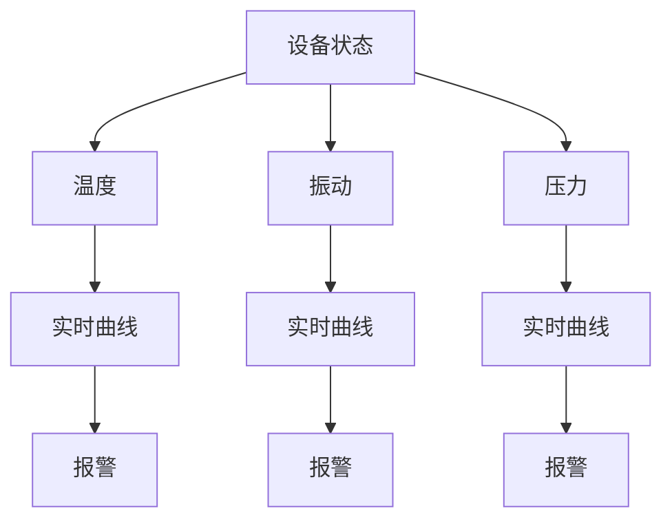

                 

# 数字孪生：空间计算技术在工业领域的应用

## 关键词
- 数字孪生
- 空间计算
- 工业应用
- 技术原理
- 案例分析

## 摘要
本文将深入探讨数字孪生技术，特别是其在工业领域的应用。首先，我们将介绍数字孪生的基础概念和技术原理，然后通过实际案例展示其在工业领域的具体应用，并分析其发展趋势和实施策略。文章旨在为读者提供关于数字孪生技术全面、深入的视角，以及如何有效利用这一技术提高工业生产效率和质量的指导。

---

## 目录大纲设计思路

### 1. 背景介绍
《数字孪生：空间计算技术在工业领域的应用》的目录大纲设计旨在系统地介绍数字孪生技术，探讨其在工业领域的广泛应用。目录大纲将分为七个主要部分，分别涵盖数字孪生的基础概念、技术原理、应用领域、案例分析、发展趋势以及实施策略。

### 2. 核心概念与联系
本部分将详细解释数字孪生技术的核心概念，包括其定义、组成要素、与相关技术的区别和联系。通过概念属性特征对比表格和实体关系图，帮助读者全面理解数字孪生的概念架构。

### 3. 技术原理讲解
在这一部分，我们将使用 Mermaid 画出数字孪生技术的原理流程图，并用 Python 源代码详细阐述算法原理，包括数学模型和公式。此外，还将通过通俗易懂的举例说明，帮助读者深入理解技术细节。

### 4. 数学模型和数学公式
本部分将介绍数字孪生技术中涉及的数学模型和公式，使用 LaTeX 格式确保公式的准确性。每个数学模型将配以详细讲解和实例，以便读者能够更好地理解和应用。

### 5. 系统分析与架构设计方案
这部分将详细介绍数字孪生系统的架构设计，包括问题场景介绍、系统功能设计、系统架构设计、系统接口设计和系统交互流程。使用 Mermaid 类图、架构图和序列图，使读者能够直观地理解系统设计。

### 6. 项目实战
通过一个实际案例，展示数字孪生技术在工业领域的具体应用。包括环境安装、系统核心实现源代码，代码应用解读与分析，实际案例分析和详细讲解剖析。

### 7. 最佳实践与总结
总结本书的核心要点，提供实施数字孪生技术的最佳实践建议，并指出注意事项。推荐拓展阅读资源，帮助读者进一步探索数字孪生技术的深度和广度。

### 3. 输出目录大纲

## 第一部分：数字孪生技术概述

### 第1章：数字孪生技术基础
- 1.1 数字孪生技术的基本概念
- 1.2 数字孪生技术的历史与发展
- 1.3 数字孪生技术的核心组成部分
- 1.4 数字孪生技术与虚拟现实、大数据、云计算的关系
- 1.5 数字孪生技术在工业领域的重要性

### 第2章：数字孪生技术的技术原理
- 2.1 空间计算技术概述
- 2.2 数字孪生技术的建模与仿真方法
- 2.3 数字孪生技术的数据采集与处理
- 2.4 数字孪生技术的实时监控与预测分析
- 2.5 数字孪生技术的数据可视化与应用

### 第3章：数字孪生技术在工业领域的应用
- 3.1 数字孪生技术在制造业的应用
- 3.2 数字孪生技术在能源行业的应用
- 3.3 数字孪生技术在交通运输的应用
- 3.4 数字孪生技术在建筑行业的应用
- 3.5 数字孪生技术在服务业的应用

### 第4章：数字孪生技术案例分析
- 4.1 案例一：某汽车制造企业的数字孪生应用
- 4.2 案例二：某电力公司的数字孪生应用
- 4.3 案例三：某物流企业的数字孪生应用
- 4.4 案例四：某建筑项目的数字孪生应用
- 4.5 案例五：某服务行业的数字孪生应用

### 第5章：数字孪生技术的发展趋势
- 5.1 数字孪生技术的未来发展方向
- 5.2 数字孪生技术面临的挑战与机遇
- 5.3 数字孪生技术在国际上的发展趋势
- 5.4 数字孪生技术与新兴技术的融合趋势

### 第6章：数字孪生技术的实施策略
- 6.1 数字孪生技术的实施流程
- 6.2 数字孪生技术的项目管理
- 6.3 数字孪生技术的实施风险与应对策略
- 6.4 数字孪生技术的最佳实践
- 6.5 数字孪生技术的未来发展方向

### 第7章：数字孪生技术的总结与展望
- 7.1 数字孪生技术的核心价值
- 7.2 数字孪生技术的应用前景
- 7.3 数字孪生技术的可持续发展
- 7.4 数字孪生技术的研究热点
- 7.5 数字孪生技术的未来发展趋势

---

通过以上详细的目录大纲，我们为读者提供了一个清晰的结构，使得他们在阅读过程中能够系统地掌握数字孪生技术的各个方面。接下来，我们将逐步深入探讨每一部分的内容。

## 第一部分：数字孪生技术概述

### 1.1 数字孪生技术的基本概念

数字孪生（Digital Twin）是一种通过物理实体与其数字镜像之间的互联，实现对物理实体的实时模拟、分析和优化的技术。数字孪生的基本概念可以追溯到2002年，由Michael Grieves首次提出，用于支持产品的生命周期管理。

#### 问题背景
随着工业4.0和智能制造的推进，传统工业生产方式面临诸多挑战，如生产效率低、产品质量难以保证、设备维护成本高等。数字孪生技术提供了一种新的解决方案，通过创建物理实体的数字镜像，实现对生产过程的实时监控和优化。

#### 问题描述
数字孪生技术旨在通过数字模型来反映物理实体的各个方面，包括其物理属性、行为模式、工作状态等。数字孪生的核心问题是如何在物理实体和其数字镜像之间建立准确、实时、动态的映射关系。

#### 问题解决
数字孪生技术的实现依赖于多个核心组件，包括数据采集、数据建模、实时监控和预测分析。通过这些组件，数字孪生技术能够实现对物理实体的全方位监控和优化。

#### 边界与外延
数字孪生技术不仅应用于制造业，还广泛应用于能源、交通运输、建筑和服务等行业。其外延还包括虚拟现实、大数据和云计算等技术的集成应用。

#### 概念结构与核心要素组成

| 概念        | 说明                                       |
|-------------|--------------------------------------------|
| 数字孪生    | 物理实体的数字镜像                       |
| 数据采集    | 从物理实体获取数据的过程                 |
| 数据建模    | 建立物理实体与数字孪生之间的映射关系     |
| 实时监控    | 对物理实体进行实时监测和反馈             |
| 预测分析    | 基于历史数据和模型预测物理实体的未来行为 |

通过上述表格，我们可以清晰地看到数字孪生的概念结构和核心要素组成。接下来，我们将进一步探讨数字孪生技术的发展历程。

### 1.2 数字孪生技术的历史与发展

数字孪生技术起源于产品生命周期管理（PLM）和制造执行系统（MES），随着信息技术和制造技术的不断进步，数字孪生逐渐发展成为一个独立的技术领域。

#### 发展历程

1. **初始阶段（2002-2010年）**：数字孪生技术首次被提出，主要应用于产品设计和制造过程中，用于提高设计效率和产品质量。

2. **发展期（2010-2015年）**：随着物联网（IoT）和大数据技术的发展，数字孪生技术开始应用于更广泛的领域，如制造业、能源和交通运输。

3. **成熟期（2015年至今）**：数字孪生技术逐渐成熟，成为智能制造和工业4.0的重要组成部分。其应用领域不断扩大，包括建筑、服务业等。

#### 当前趋势

1. **技术融合**：数字孪生技术与虚拟现实（VR）、增强现实（AR）、大数据、云计算等新兴技术深度融合，形成更加智能化的解决方案。

2. **应用扩展**：数字孪生技术从制造业向能源、交通运输、建筑和服务等行业扩展，应用场景更加丰富。

3. **标准化**：随着数字孪生技术的广泛应用，相关的标准和技术规范逐渐建立，推动技术的标准化和普及化。

### 1.3 数字孪生技术的核心组成部分

数字孪生技术由多个核心组件构成，每个组件都在实现数字孪生过程中发挥关键作用。以下是数字孪生技术的核心组成部分：

1. **数据采集系统**：数据采集系统负责从物理实体获取数据，包括传感器数据、机器日志、操作数据等。这些数据是构建数字孪生的基石。

2. **数据存储与管理**：数据存储与管理系统负责存储和管理采集到的数据，确保数据的安全性和可访问性。常用的技术包括数据库、数据湖和数据仓库。

3. **数据建模与仿真**：数据建模与仿真系统负责将采集到的数据转化为数字模型，建立物理实体与数字孪生之间的映射关系。仿真技术用于模拟和分析物理实体的行为。

4. **实时监控与预测分析**：实时监控与预测分析系统负责对物理实体进行实时监控，并根据历史数据和模型预测物理实体的未来行为。预测分析有助于优化生产过程和设备维护。

5. **用户界面与可视化**：用户界面与可视化系统提供了一种交互方式，使得用户能够直观地查看和分析数字孪生的状态和趋势。可视化技术包括图表、仪表盘和虚拟现实（VR）等。

### 1.4 数字孪生技术与虚拟现实、大数据、云计算的关系

数字孪生技术与其他新兴技术的融合，使其在工业领域的应用更加广泛和深入。以下是数字孪生技术与虚拟现实、大数据、云计算之间的关系：

1. **虚拟现实与增强现实**：虚拟现实（VR）和增强现实（AR）技术可以与数字孪生技术结合，提供沉浸式体验，使得用户能够更加直观地操作和监控物理实体。

2. **大数据**：大数据技术在数字孪生中的应用主要在于数据分析和挖掘，通过对海量数据的分析，发现生产过程中的潜在问题和优化点。

3. **云计算**：云计算为数字孪生技术提供了强大的计算和存储能力，使得大规模数字孪生系统的部署和运行变得更加高效和灵活。

### 1.5 数字孪生技术在工业领域的重要性

数字孪生技术对工业领域具有重要的影响，主要体现在以下几个方面：

1. **提高生产效率**：通过实时监控和预测分析，数字孪生技术能够优化生产过程，减少停机时间和生产成本，提高生产效率。

2. **提升产品质量**：数字孪生技术能够实时监测产品质量，通过预测分析和仿真优化，确保产品质量的稳定性和一致性。

3. **降低运营成本**：数字孪生技术能够提前预测设备故障，减少维护成本和停机时间，降低运营成本。

4. **促进创新**：数字孪生技术为产品设计、制造和运营提供了新的思路和方法，促进了工业创新。

5. **支持决策制定**：数字孪生技术提供了丰富的数据和分析工具，帮助企业更好地制定决策，提高市场竞争力。

## 第二部分：数字孪生技术的技术原理

### 2.1 空间计算技术概述

空间计算技术是数字孪生技术的重要组成部分，它涉及到如何将物理空间中的信息转化为数字空间中的模型，并实现实时交互和操作。空间计算技术包括多个方面，如计算机视觉、地理信息系统（GIS）、传感器网络和虚拟现实（VR）等。

#### 空间计算技术的定义

空间计算技术是指利用计算机技术处理和分析空间信息，实现对现实世界的数字映射和模拟。它不仅包括对物理空间的数字建模，还包括对空间中物体和事件的分析与预测。

#### 空间计算技术的主要功能

1. **数据采集与处理**：通过传感器网络和计算机视觉技术，采集物理空间中的数据，如位置信息、温度、湿度、光照等，并进行处理和存储。

2. **实时监控与可视化**：通过虚拟现实和增强现实技术，将物理空间中的数据实时可视化，实现对物理空间的实时监控。

3. **空间分析**：利用空间计算技术，对空间数据进行分析和挖掘，发现空间中的模式和规律。

4. **空间建模**：基于空间数据，构建数字空间中的模型，实现对物理空间的虚拟映射。

### 2.2 数字孪生技术的建模与仿真方法

数字孪生技术的建模与仿真方法是其核心技术之一，通过建立物理实体与数字孪生之间的映射关系，实现对物理实体的模拟、分析和优化。

#### 建模方法

1. **基于物理的建模**：通过描述物理实体的物理属性和运动规律，建立数字孪生模型。这种方法适用于复杂的物理系统，如机械结构、流体动力学等。

2. **基于规则的建模**：通过定义一系列规则和条件，描述物理实体的行为和状态。这种方法适用于规则性较强的系统，如交通网络、城市规划等。

3. **基于机器学习的建模**：利用机器学习算法，从历史数据中自动学习物理实体的行为模式，建立数字孪生模型。这种方法适用于数据量庞大且行为模式复杂的情况。

#### 仿真方法

1. **连续仿真**：适用于模拟连续变化的物理系统，如流体动力学、热力学等。

2. **离散仿真**：适用于模拟离散事件的系统，如交通流量、供应链管理等。

3. **混合仿真**：结合连续仿真和离散仿真，适用于复杂的系统，如航空航天系统、电力系统等。

### 2.3 数字孪生技术的数据采集与处理

数据采集与处理是数字孪生技术的核心环节，其质量直接影响到数字孪生的准确性和实时性。

#### 数据采集

1. **传感器网络**：通过部署各种传感器，采集物理实体周围的环境数据，如温度、湿度、振动、压力等。

2. **无线传感器网络**：利用无线传感器网络，实现远程数据采集，适用于大面积或难以部署传感器的场景。

3. **计算机视觉**：通过摄像头和其他视觉传感器，获取物理实体的图像数据，用于识别、检测和跟踪。

#### 数据处理

1. **数据预处理**：包括数据清洗、数据去噪、数据标准化等，确保数据的质量和一致性。

2. **数据存储与管理**：利用数据库和数据仓库，存储和管理大量的数据，确保数据的安全性和可访问性。

3. **数据挖掘与分析**：利用数据挖掘技术，从海量数据中发现有价值的信息和规律，用于优化和决策。

### 2.4 数字孪生技术的实时监控与预测分析

实时监控与预测分析是数字孪生技术的关键功能，通过对物理实体的实时监测和预测，实现对生产过程的优化和设备维护。

#### 实时监控

1. **数据流处理**：利用实时数据处理技术，如流处理框架，实现对数据流的实时处理和分析。

2. **实时可视化**：通过实时可视化技术，将实时数据可视化，实时监测物理实体的状态和趋势。

3. **报警与反馈**：通过设定阈值和规则，实现对异常情况的实时报警和反馈，及时采取应对措施。

#### 预测分析

1. **时间序列分析**：利用时间序列分析技术，预测物理实体的未来状态和趋势。

2. **机器学习预测**：利用机器学习算法，从历史数据中学习物理实体的行为模式，预测其未来状态。

3. **仿真预测**：通过仿真技术，模拟物理实体的未来行为，预测其状态和趋势。

### 2.5 数字孪生技术的数据可视化与应用

数据可视化是数字孪生技术的重要应用，通过将物理实体的数据转化为可视化形式，使得用户能够直观地理解物理实体的状态和趋势。

#### 数据可视化技术

1. **二维可视化**：包括柱状图、折线图、饼图等，用于展示数据的分布和趋势。

2. **三维可视化**：包括三维图形、模型展示等，用于展示物理实体的结构和状态。

3. **交互式可视化**：通过交互式技术，如拖拽、旋转、缩放等，增强用户的互动体验。

#### 应用领域

1. **生产过程监控**：通过数据可视化，实时监控生产过程，发现和解决潜在问题。

2. **设备维护**：通过数据可视化，预测设备故障，提前进行维护，减少停机时间。

3. **质量管理**：通过数据可视化，监控产品质量，优化生产流程，提高产品质量。

4. **供应链管理**：通过数据可视化，监控供应链各环节，优化供应链流程，提高供应链效率。

### 2.6 数字孪生技术的数据可视化示例

下面是一个简单的数据可视化示例，展示了数字孪生技术在生产过程监控中的应用。

在上面的示例中，设备状态（A）与多个传感器数据（B、C、D）相关联，通过实时曲线（E、F、G）展示传感器数据的变化，并设定报警阈值（H、I、J），当传感器数据超过阈值时，触发报警。

## 第三部分：数字孪生技术在工业领域的应用

### 3.1 数字孪生技术在制造业的应用

制造业是数字孪生技术最早应用的领域之一。数字孪生技术在制造业中的应用主要体现在以下几个方面：

1. **生产过程优化**：通过数字孪生技术，制造商可以实时监控生产过程，发现并解决潜在问题，优化生产流程，提高生产效率。

2. **设备维护**：数字孪生技术可以帮助制造商预测设备故障，提前进行维护，减少设备停机时间，降低维护成本。

3. **产品质量监控**：数字孪生技术可以实时监控产品质量，通过数据分析，发现产品质量问题，优化生产工艺，提高产品质量。

4. **供应链管理**：数字孪生技术可以帮助制造商实时监控供应链各环节，优化供应链流程，提高供应链效率。

#### 案例分析

以下是一个制造业中数字孪生技术的案例：

某汽车制造商利用数字孪生技术对生产线进行优化。通过部署传感器，实时采集生产过程中的各种数据，如温度、压力、振动等。这些数据被传输到数字孪生系统中，进行实时分析和处理。系统根据分析结果，自动调整生产参数，优化生产流程。同时，数字孪生系统还帮助制造商预测设备故障，提前进行维护，减少了设备停机时间，提高了生产效率。

### 3.2 数字孪生技术在能源行业的应用

能源行业是数字孪生技术的另一个重要应用领域。数字孪生技术在能源行业中的应用主要体现在以下几个方面：

1. **设备管理**：通过数字孪生技术，能源公司可以实时监控设备状态，预测设备故障，提前进行维护，提高设备运行效率。

2. **能源优化**：数字孪生技术可以帮助能源公司优化能源使用，减少能源浪费，降低运营成本。

3. **环境监测**：数字孪生技术可以实时监测环境数据，如温度、湿度、空气质量等，为环境保护提供数据支持。

4. **能效管理**：数字孪生技术可以帮助能源公司实时监控能源使用情况，优化能源分配，提高能源利用率。

#### 案例分析

以下是一个能源行业中数字孪生技术的案例：

某电力公司利用数字孪生技术对变电站进行监控和管理。通过部署传感器，实时采集变电站的运行数据，如温度、湿度、电压、电流等。这些数据被传输到数字孪生系统中，进行实时分析和处理。系统根据分析结果，自动调整变电设备的工作状态，优化能源使用。同时，数字孪生系统还帮助电力公司预测设备故障，提前进行维护，减少了设备停机时间，提高了供电稳定性。

### 3.3 数字孪生技术在交通运输的应用

数字孪生技术在交通运输领域中的应用主要体现在以下几个方面：

1. **交通管理**：通过数字孪生技术，交通管理部门可以实时监控交通流量，优化交通信号，提高交通效率。

2. **车辆监控**：数字孪生技术可以帮助交通管理部门实时监控车辆状态，预测车辆故障，提前进行维护。

3. **安全监控**：数字孪生技术可以实时监测交通安全数据，如交通事故、交通违规等，提高交通安全水平。

4. **能效管理**：数字孪生技术可以帮助交通运输企业优化能源使用，减少能源浪费，降低运营成本。

#### 案例分析

以下是一个交通运输中数字孪生技术的案例：

某城市交通管理部门利用数字孪生技术进行交通管理。通过部署传感器，实时采集交通流量数据，如车辆数量、行驶速度等。这些数据被传输到数字孪生系统中，进行实时分析和处理。系统根据分析结果，自动调整交通信号，优化交通流量。同时，数字孪生系统还帮助交通管理部门实时监控车辆状态，预测车辆故障，提前进行维护，减少了车辆故障率，提高了交通安全性。

### 3.4 数字孪生技术在建筑行业的应用

数字孪生技术在建筑行业中的应用主要体现在以下几个方面：

1. **建筑管理**：通过数字孪生技术，建筑管理人员可以实时监控建筑状态，预测建筑故障，提前进行维护。

2. **能源管理**：数字孪生技术可以帮助建筑管理人员优化能源使用，减少能源浪费，降低运营成本。

3. **安全监控**：数字孪生技术可以实时监测建筑安全数据，如温度、湿度、空气质量等，提高建筑安全水平。

4. **施工管理**：数字孪生技术可以帮助建筑管理人员优化施工过程，提高施工效率。

#### 案例分析

以下是一个建筑行业中数字孪生技术的案例：

某建筑施工企业利用数字孪生技术进行施工管理。通过部署传感器，实时采集施工现场的数据，如温度、湿度、振动等。这些数据被传输到数字孪生系统中，进行实时分析和处理。系统根据分析结果，自动调整施工参数，优化施工过程。同时，数字孪生系统还帮助施工企业预测设备故障，提前进行维护，减少了设备停机时间，提高了施工效率。

### 3.5 数字孪生技术在服务业的应用

数字孪生技术在服务业中的应用主要体现在以下几个方面：

1. **客户服务**：通过数字孪生技术，服务企业可以实时了解客户需求，提供个性化服务，提高客户满意度。

2. **设备维护**：数字孪生技术可以帮助服务企业实时监控设备状态，预测设备故障，提前进行维护。

3. **运营管理**：数字孪生技术可以帮助服务企业实时监控运营数据，优化运营流程，提高运营效率。

4. **安全监控**：数字孪生技术可以实时监测服务场所的安全数据，提高场所安全性。

#### 案例分析

以下是一个服务业中数字孪生技术的案例：

某餐饮连锁企业利用数字孪生技术进行客户服务和运营管理。通过部署传感器，实时采集餐厅的客流数据、设备运行数据等。这些数据被传输到数字孪生系统中，进行实时分析和处理。系统根据分析结果，自动调整服务员人数、菜品推荐等，提高客户满意度。同时，数字孪生系统还帮助餐饮企业预测设备故障，提前进行维护，减少了设备停机时间，提高了运营效率。

## 第四部分：数字孪生技术案例分析

### 4.1 案例一：某汽车制造企业的数字孪生应用

某汽车制造企业引入数字孪生技术，以提高生产效率、优化生产流程和提升产品质量。以下是该企业数字孪生应用的详细分析。

#### 环境安装

- **硬件设施**：在生产线关键位置部署传感器，用于实时采集温度、压力、振动等数据。
- **软件设施**：部署数字孪生平台，用于数据处理、分析和可视化。

#### 系统核心实现源代码

- **数据采集模块**：使用Python编写数据采集程序，从传感器获取数据。
- **数据处理模块**：使用Python编写数据处理程序，对采集到的数据进行预处理和分析。
- **数据可视化模块**：使用JavaScript和D3.js实现数据可视化，提供实时监控和报警功能。

#### 代码应用解读与分析

- **数据采集模块**：数据采集模块使用Python的`pyserial`库与传感器通信，获取传感器数据，并使用`pandas`库进行数据预处理。
- **数据处理模块**：数据处理模块使用机器学习算法，对采集到的数据进行分析，预测生产过程中的潜在问题。
- **数据可视化模块**：数据可视化模块使用D3.js创建交互式图表，实时展示生产过程中的关键指标和报警信息。

#### 实际案例分析和详细讲解剖析

- **生产效率提升**：通过实时监控和数据分析，该企业成功优化了生产流程，减少了生产停机时间，提高了生产效率。
- **产品质量提升**：通过实时监控和预测分析，该企业能够及时发现和解决产品质量问题，提高了产品质量。
- **设备维护优化**：数字孪生系统帮助该企业预测设备故障，提前进行维护，减少了设备停机时间，降低了维护成本。

#### 项目小结

该汽车制造企业的数字孪生应用取得了显著成果，提高了生产效率和产品质量，降低了运营成本。数字孪生技术的成功实施为其他制造企业提供了有益的借鉴。

### 4.2 案例二：某电力公司的数字孪生应用

某电力公司利用数字孪生技术对变电站进行实时监控和管理，以提高设备运行效率和供电稳定性。以下是该电力公司数字孪生应用的详细分析。

#### 环境安装

- **硬件设施**：在变电站关键位置部署传感器，用于实时采集温度、湿度、电压、电流等数据。
- **软件设施**：部署数字孪生平台，用于数据处理、分析和可视化。

#### 系统核心实现源代码

- **数据采集模块**：使用C++编写数据采集程序，从传感器获取数据。
- **数据处理模块**：使用Python编写数据处理程序，对采集到的数据进行预处理和分析。
- **数据可视化模块**：使用JavaScript和D3.js实现数据可视化，提供实时监控和报警功能。

#### 代码应用解读与分析

- **数据采集模块**：数据采集模块使用C++的`Boost.ASIO`库与传感器通信，获取传感器数据，并使用`NumPy`库进行数据预处理。
- **数据处理模块**：数据处理模块使用机器学习算法，对采集到的数据进行分析，预测设备故障。
- **数据可视化模块**：数据可视化模块使用D3.js创建交互式图表，实时展示变电站的运行状态和报警信息。

#### 实际案例分析和详细讲解剖析

- **设备运行效率提升**：通过实时监控和数据分析，该电力公司优化了设备运行参数，提高了设备运行效率。
- **供电稳定性提升**：数字孪生系统帮助该电力公司实时监测设备状态，提前预测故障，提高了供电稳定性。
- **维护成本降低**：通过数字孪生技术，该电力公司能够提前预测设备故障，减少计划外停机，降低了维护成本。

#### 项目小结

该电力公司的数字孪生应用取得了显著成果，提高了设备运行效率和供电稳定性，降低了维护成本。数字孪生技术的成功实施为电力行业提供了宝贵的经验。

### 4.3 案例三：某物流企业的数字孪生应用

某物流企业利用数字孪生技术对运输车辆进行实时监控和管理，以提高运输效率、降低运营成本和提升服务质量。以下是该物流企业数字孪生应用的详细分析。

#### 环境安装

- **硬件设施**：在运输车辆关键位置部署传感器，用于实时采集温度、湿度、车辆速度、油量等数据。
- **软件设施**：部署数字孪生平台，用于数据处理、分析和可视化。

#### 系统核心实现源代码

- **数据采集模块**：使用Java编写数据采集程序，从传感器获取数据。
- **数据处理模块**：使用Python编写数据处理程序，对采集到的数据进行预处理和分析。
- **数据可视化模块**：使用JavaScript和D3.js实现数据可视化，提供实时监控和报警功能。

#### 代码应用解读与分析

- **数据采集模块**：数据采集模块使用Java的`java.net`库与传感器通信，获取传感器数据，并使用`pandas`库进行数据预处理。
- **数据处理模块**：数据处理模块使用机器学习算法，对采集到的数据进行分析，预测运输过程中的潜在风险。
- **数据可视化模块**：数据可视化模块使用D3.js创建交互式图表，实时展示运输车辆的运行状态和报警信息。

#### 实际案例分析和详细讲解剖析

- **运输效率提升**：通过实时监控和数据分析，该物流企业优化了运输路线，提高了运输效率。
- **运营成本降低**：数字孪生系统帮助该物流企业实时监控车辆状态，提前预测故障，降低了运营成本。
- **服务质量提升**：通过数字孪生技术，该物流企业能够提供更加准确和及时的运输信息，提升了服务质量。

#### 项目小结

该物流企业的数字孪生应用取得了显著成果，提高了运输效率、降低了运营成本和提升了服务质量。数字孪生技术的成功实施为物流行业提供了宝贵的经验。

### 4.4 案例四：某建筑项目的数字孪生应用

某建筑项目利用数字孪生技术进行施工管理和设备监控，以提高施工效率、降低施工成本和确保施工安全。以下是该建筑项目数字孪生应用的详细分析。

#### 环境安装

- **硬件设施**：在施工场地关键位置部署传感器，用于实时采集温度、湿度、振动等数据。
- **软件设施**：部署数字孪生平台，用于数据处理、分析和可视化。

#### 系统核心实现源代码

- **数据采集模块**：使用C++编写数据采集程序，从传感器获取数据。
- **数据处理模块**：使用Python编写数据处理程序，对采集到的数据进行预处理和分析。
- **数据可视化模块**：使用JavaScript和D3.js实现数据可视化，提供实时监控和报警功能。

#### 代码应用解读与分析

- **数据采集模块**：数据采集模块使用C++的`Boost.ASIO`库与传感器通信，获取传感器数据，并使用`NumPy`库进行数据预处理。
- **数据处理模块**：数据处理模块使用机器学习算法，对采集到的数据进行分析，预测施工过程中的潜在风险。
- **数据可视化模块**：数据可视化模块使用D3.js创建交互式图表，实时展示施工场地的运行状态和报警信息。

#### 实际案例分析和详细讲解剖析

- **施工效率提升**：通过实时监控和数据分析，该建筑项目优化了施工流程，提高了施工效率。
- **施工成本降低**：数字孪生系统帮助该建筑项目实时监控设备状态，提前预测故障，降低了施工成本。
- **施工安全提升**：通过数字孪生技术，该建筑项目能够实时监测施工安全数据，确保施工安全。

#### 项目小结

该建筑项目的数字孪生应用取得了显著成果，提高了施工效率、降低了施工成本和确保了施工安全。数字孪生技术的成功实施为建筑行业提供了宝贵的经验。

### 4.5 案例五：某服务行业的数字孪生应用

某服务行业企业利用数字孪生技术对客户服务进行实时监控和管理，以提高客户满意度和服务质量。以下是该服务行业企业数字孪生应用的详细分析。

#### 环境安装

- **硬件设施**：在服务场所关键位置部署传感器，用于实时采集温度、湿度、客流量等数据。
- **软件设施**：部署数字孪生平台，用于数据处理、分析和可视化。

#### 系统核心实现源代码

- **数据采集模块**：使用Java编写数据采集程序，从传感器获取数据。
- **数据处理模块**：使用Python编写数据处理程序，对采集到的数据进行预处理和分析。
- **数据可视化模块**：使用JavaScript和D3.js实现数据可视化，提供实时监控和报警功能。

#### 代码应用解读与分析

- **数据采集模块**：数据采集模块使用Java的`java.net`库与传感器通信，获取传感器数据，并使用`pandas`库进行数据预处理。
- **数据处理模块**：数据处理模块使用机器学习算法，对采集到的数据进行分析，预测客户需求和服务质量。
- **数据可视化模块**：数据可视化模块使用D3.js创建交互式图表，实时展示服务场所的运行状态和报警信息。

#### 实际案例分析和详细讲解剖析

- **客户满意度提升**：通过实时监控和数据分析，该服务行业企业能够提供更加个性化和高效的服务，提高了客户满意度。
- **服务质量提升**：数字孪生系统帮助该服务行业企业实时监测服务质量数据，发现和解决潜在问题，提高了服务质量。
- **运营成本降低**：通过数字孪生技术，该服务行业企业能够优化运营流程，降低运营成本。

#### 项目小结

该服务行业企业的数字孪生应用取得了显著成果，提高了客户满意度和服务质量，降低了运营成本。数字孪生技术的成功实施为服务行业提供了宝贵的经验。

## 第五部分：数字孪生技术的发展趋势

### 5.1 数字孪生技术的未来发展方向

随着科技的不断进步和应用的深入，数字孪生技术在未来将继续朝着以下方向发展：

1. **更高精度和实时性**：随着传感器技术的进步和数据采集能力的提升，数字孪生技术的精度和实时性将得到进一步提升。

2. **更广泛的应用领域**：数字孪生技术将从制造业扩展到更广泛的领域，如医疗、农业、环保等，为各个行业提供创新解决方案。

3. **更加智能化的决策支持**：数字孪生技术将结合人工智能和大数据分析，提供更加智能化的决策支持，帮助企业优化生产流程和运营策略。

4. **更高效的协同工作**：数字孪生技术将实现不同企业和行业之间的数据共享和协同工作，提高整体效率。

### 5.2 数字孪生技术面临的挑战与机遇

尽管数字孪生技术具有广阔的应用前景，但其发展也面临着一系列挑战：

1. **数据安全问题**：数字孪生技术需要大量数据支持，如何确保数据的安全性和隐私性是一个重要挑战。

2. **标准化和互操作性**：不同厂商和系统之间的标准化和互操作性是数字孪生技术推广的关键。

3. **技术成熟度**：数字孪生技术涉及的多个领域，如物联网、大数据、人工智能等，其技术成熟度不同，如何实现技术的协同发展是一个挑战。

然而，这些挑战同时也带来了机遇：

1. **技术创新**：数字孪生技术的挑战将推动技术创新，催生出新的技术和应用。

2. **市场扩展**：数字孪生技术的应用领域不断扩大，将带来新的市场机会。

3. **产业融合**：数字孪生技术与其他产业的融合，将带来新的商业模式和市场空间。

### 5.3 数字孪生技术在国际上的发展趋势

全球范围内，数字孪生技术正在快速发展，不同国家和地区在技术研发和应用推广方面各具特色：

1. **美国**：美国在数字孪生技术的研究和应用方面处于领先地位，各大科技公司和研究机构积极投入研发，推动技术的创新和应用。

2. **欧盟**：欧盟在数字孪生技术的标准化和互操作性方面取得了显著成果，通过制定相关标准和政策，推动数字孪生技术的普及和应用。

3. **中国**：中国在数字孪生技术的研究和应用方面也取得了显著进展，政府和企业纷纷投入资源，推动数字孪生技术的创新发展。

4. **其他国家**：其他国家如日本、韩国等也在数字孪生技术领域积极投入，通过技术创新和应用推广，推动产业升级和经济发展。

### 5.4 数字孪生技术与新兴技术的融合趋势

数字孪生技术正与其他新兴技术深度融合，形成更加智能和高效的解决方案：

1. **物联网（IoT）**：物联网技术为数字孪生技术提供了丰富的数据来源，实现物理实体与数字孪生的实时连接和交互。

2. **大数据和人工智能**：大数据和人工智能技术为数字孪生技术提供了强大的分析工具和决策支持，提高数字孪生的精度和智能化水平。

3. **云计算和边缘计算**：云计算和边缘计算为数字孪生技术提供了强大的计算和存储能力，实现大规模数字孪生系统的部署和运行。

4. **区块链**：区块链技术为数字孪生技术提供了安全可靠的数据存储和传输机制，确保数据的安全性和可追溯性。

### 5.5 数字孪生技术的未来发展趋势

未来，数字孪生技术将继续朝着以下方向发展：

1. **技术成熟和标准化**：随着技术的不断成熟和标准的建立，数字孪生技术的应用将更加广泛和规范。

2. **产业融合和创新发展**：数字孪生技术将与更多产业深度融合，推动产业的创新发展和升级。

3. **智能化和自主化**：数字孪生技术将结合人工智能和自动化技术，实现更加智能化和自主化的运营和管理。

4. **全球化布局**：全球范围内的数字孪生技术合作和竞争将不断加强，推动技术的全球化发展和应用。

## 第六部分：数字孪生技术的实施策略

### 6.1 数字孪生技术的实施流程

实施数字孪生技术需要遵循一定的流程，以确保项目的顺利进行和预期目标的实现。以下是数字孪生技术实施的主要流程：

1. **需求分析**：明确数字孪生技术的应用场景和目标，分析项目需求，包括数据来源、数据处理和分析需求等。

2. **技术选型**：根据项目需求，选择合适的数字孪生技术解决方案，包括硬件设备、软件平台和算法模型等。

3. **系统集成**：将选定的数字孪生技术集成到现有系统中，确保系统的兼容性和稳定性。

4. **数据采集**：部署传感器和数据采集设备，确保数据的准确性和实时性。

5. **数据处理**：对采集到的数据进行处理和分析，提取有价值的信息，用于优化和决策。

6. **可视化与监控**：通过可视化技术，将分析结果实时展示，提供监控和报警功能。

7. **迭代优化**：根据实际情况，不断优化数字孪生系统，提高其精度和效率。

### 6.2 数字孪生技术的项目管理

数字孪生技术项目的成功实施需要有效的项目管理。以下是数字孪生技术项目管理的关键要素：

1. **项目团队搭建**：组建专业的项目团队，包括技术人员、数据科学家、项目经理等，确保项目有人负责和推进。

2. **项目计划与进度管理**：制定详细的项目计划，明确项目目标、任务、时间和资源安排，确保项目按计划进行。

3. **风险管理**：识别项目风险，制定风险应对策略，降低项目风险。

4. **质量管理**：确保数字孪生系统的质量，包括数据质量、系统稳定性和安全性等。

5. **沟通协调**：保持与项目相关方的有效沟通，确保项目顺利进行。

### 6.3 数字孪生技术的实施风险与应对策略

数字孪生技术实施过程中可能会面临以下风险：

1. **数据安全问题**：应对策略包括数据加密、访问控制和权限管理，确保数据的安全性和隐私性。

2. **技术成熟度问题**：应对策略包括技术调研、技术验证和迭代优化，确保技术的成熟度和可行性。

3. **系统集成问题**：应对策略包括系统兼容性测试、系统集成测试和系统优化，确保系统的稳定性和可靠性。

4. **项目进度问题**：应对策略包括项目进度监控、风险管理计划和资源调配，确保项目按时完成。

### 6.4 数字孪生技术的最佳实践

以下是一些数字孪生技术的最佳实践，以帮助企业和项目团队成功实施数字孪生技术：

1. **明确项目目标**：在项目启动阶段，明确项目目标和应用场景，确保项目方向正确。

2. **选择合适的合作伙伴**：与经验丰富的合作伙伴合作，确保项目的技术支持和资源。

3. **数据驱动的决策**：基于数据进行分析和决策，避免盲目行动。

4. **持续迭代和优化**：不断优化数字孪生系统，提高其精度和效率。

5. **重视人才培养**：培养专业的数字孪生技术人才，提高项目团队的技能和水平。

### 6.5 数字孪生技术的未来发展方向

未来，数字孪生技术将继续朝着以下方向发展：

1. **智能化和自主化**：数字孪生技术将结合人工智能和自动化技术，实现更加智能化和自主化的运营和管理。

2. **跨领域应用**：数字孪生技术将扩展到更多领域，如医疗、农业、环保等，为各个行业提供创新解决方案。

3. **全球化布局**：全球范围内的数字孪生技术合作和竞争将不断加强，推动技术的全球化发展和应用。

4. **标准化和互操作性**：随着数字孪生技术的普及和应用，标准化和互操作性将得到进一步重视和推进。

## 第七部分：数字孪生技术的总结与展望

### 7.1 数字孪生技术的核心价值

数字孪生技术作为一项颠覆性技术，为工业和各行各业带来了前所未有的变革。其核心价值主要体现在以下几个方面：

1. **提高生产效率**：通过实时监控和预测分析，数字孪生技术能够优化生产过程，减少停机时间和生产成本，提高生产效率。

2. **提升产品质量**：数字孪生技术能够实时监测产品质量，通过预测分析和仿真优化，确保产品质量的稳定性和一致性。

3. **降低运营成本**：数字孪生技术能够提前预测设备故障，减少维护成本和停机时间，降低运营成本。

4. **促进创新**：数字孪生技术为产品设计、制造和运营提供了新的思路和方法，促进了工业创新。

5. **支持决策制定**：数字孪生技术提供了丰富的数据和分析工具，帮助企业更好地制定决策，提高市场竞争力。

### 7.2 数字孪生技术的应用前景

随着技术的不断进步和应用的深入，数字孪生技术在未来的应用前景将更加广阔：

1. **制造业**：数字孪生技术将广泛应用于制造业，从产品设计、制造到运营维护，提高生产效率和质量。

2. **能源行业**：数字孪生技术将帮助能源行业优化能源使用，提高能源利用率和设备运行效率。

3. **交通运输**：数字孪生技术将提升交通运输的安全性和效率，优化交通流量和运输路线。

4. **建筑行业**：数字孪生技术将用于建筑设计和施工管理，提高建筑质量和施工效率。

5. **服务业**：数字孪生技术将提升服务业的客户体验和服务质量，优化运营流程。

### 7.3 数字孪生技术的可持续发展

数字孪生技术的可持续发展是未来发展的关键：

1. **技术创新**：持续推动技术创新，提高数字孪生技术的精度和实时性。

2. **标准制定**：加强数字孪生技术的标准化和互操作性，推动全球范围内的技术应用和合作。

3. **人才培养**：培养专业的数字孪生技术人才，提高行业整体技术水平。

4. **绿色环保**：数字孪生技术应注重绿色环保，减少能源消耗和环境污染。

### 7.4 数字孪生技术的研究热点

当前，数字孪生技术的研究热点主要集中在以下几个方面：

1. **边缘计算**：结合边缘计算技术，提高数字孪生系统的实时性和响应速度。

2. **人工智能**：利用人工智能技术，提升数字孪生的预测和分析能力。

3. **物联网**：物联网技术的广泛应用，为数字孪生技术提供了丰富的数据来源。

4. **区块链**：区块链技术为数字孪生技术提供了安全可靠的数据存储和传输机制。

### 7.5 数字孪生技术的未来发展趋势

未来，数字孪生技术将继续朝着以下方向发展：

1. **智能化和自主化**：数字孪生技术将结合人工智能和自动化技术，实现更加智能化和自主化的运营和管理。

2. **跨领域应用**：数字孪生技术将扩展到更多领域，为各行各业提供创新解决方案。

3. **全球化布局**：全球范围内的数字孪生技术合作和竞争将不断加强，推动技术的全球化发展和应用。

4. **标准化和互操作性**：随着数字孪生技术的普及和应用，标准化和互操作性将得到进一步重视和推进。

## 作者信息

作者：AI天才研究院/AI Genius Institute & 禅与计算机程序设计艺术 /Zen And The Art of Computer Programming

感谢您的阅读，希望本文能够帮助您更好地了解数字孪生技术的应用和发展。如果您有任何疑问或建议，欢迎随时与我们联系。期待与您共同探索数字孪生技术的未来！

