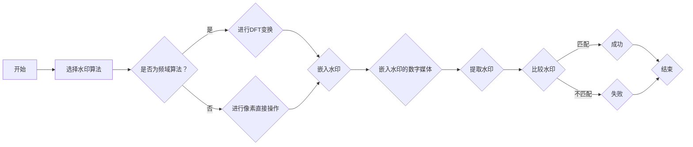
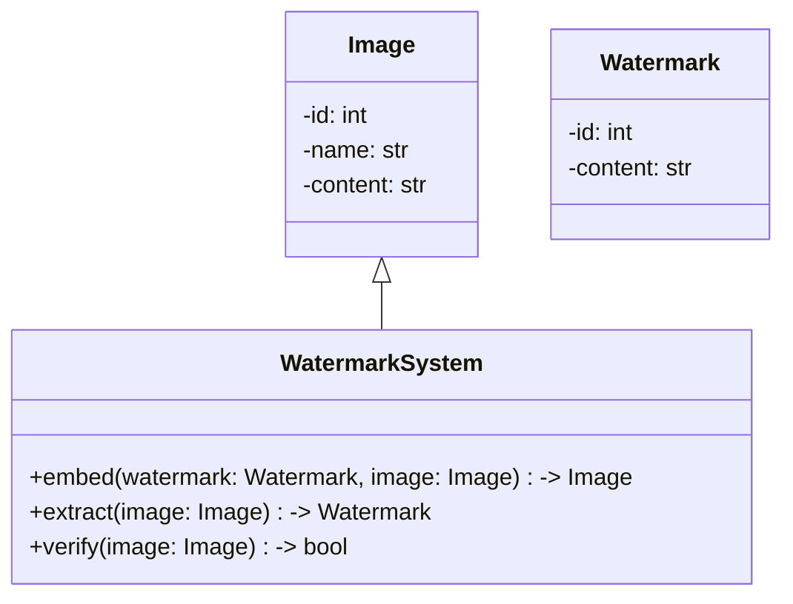
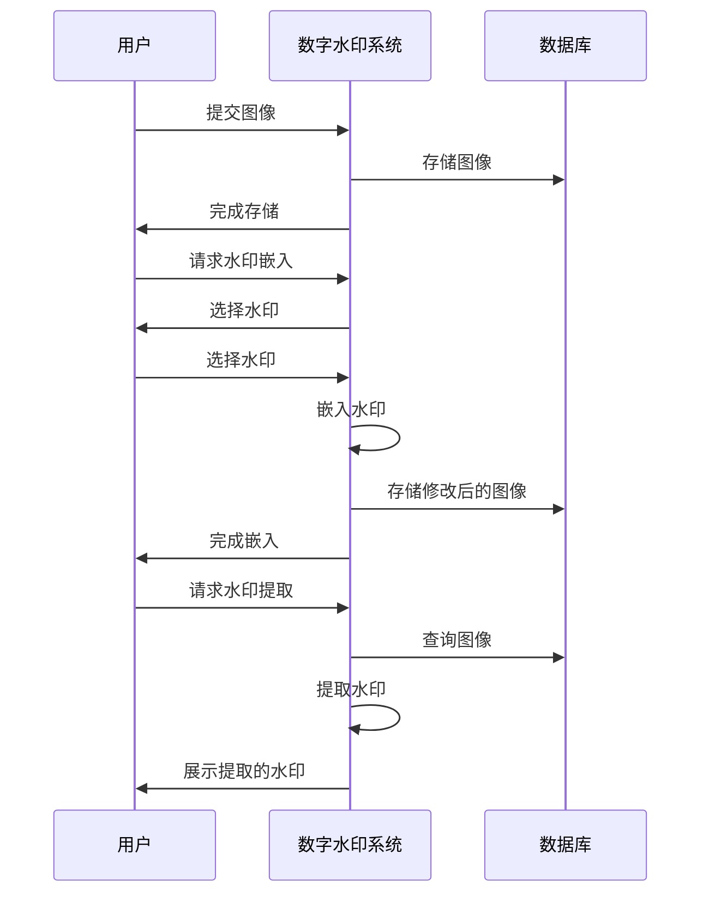

                 


### 数字水印技术：应对深度伪造的虚假信息安全策略

#### 关键词：
- 数字水印技术
- 深度伪造
- 信息安全
- 鲁棒性
- 透明性

#### 摘要：
本文旨在深入探讨数字水印技术，重点在于如何利用该技术应对深度伪造带来的虚假信息威胁。通过逐步分析数字水印技术的原理、算法、安全性、应用场景以及未来发展方向，本文将展示如何构建一个有效的信息安全策略来保护信息的真实性和完整性。

## 第一部分：数字水印技术基础

### 第1章：数字水印技术概述

#### 1.1 数字水印技术的背景与重要性

数字水印技术起源于20世纪90年代，是一种用于在数字作品中嵌入不可见信息的技术。这些信息可以是版权标识、用户信息或者防伪标记，旨在保护数字作品的知识产权和真实性。随着数字媒体和互联网的普及，数字水印技术的重要性日益凸显，尤其是在应对深度伪造带来的虚假信息威胁方面。

#### 1.2 数字水印技术的基本原理

数字水印技术的基本原理包括水印的嵌入和提取。水印嵌入是将特定的信息（水印）与数字媒体内容（如图像、音频或视频）结合，形成一个新的复合媒体。水印提取是从复合媒体中检测和恢复嵌入的水印信息。

#### 1.3 数字水印技术的分类与应用领域

数字水印技术可以根据应用场景和嵌入方法的不同进行分类，如空间域水印、频率域水印和变换域水印。其应用领域广泛，包括版权保护、数据完整性验证、数字版权管理（DRM）、安全通信等。

### 第2章：数字水印技术原理

#### 2.1 数字水印的嵌入过程

数字水印的嵌入过程涉及选择水印算法、确定嵌入位置和强度，以及嵌入方法的实现。常见的嵌入方法包括直接嵌入和同步嵌入。

#### 2.2 数字水印的提取过程

数字水印的提取是检测和恢复嵌入水印信息的过程。提取过程通常包括预处理、特征检测和水印识别。

#### 2.3 数字水印的鲁棒性与透明性

数字水印的鲁棒性是指水印在数字媒体经过各种操作（如压缩、修改等）后仍能被正确提取的能力。透明性是指嵌入水印后，数字媒体的内容质量和视觉效果不受显著影响。

### 第3章：数字水印算法

#### 3.1 空域数字水印算法

空域数字水印算法直接在数字媒体的像素级别上嵌入和提取水印。这类算法简单易实现，但鲁棒性相对较低。

#### 3.2 频域数字水印算法

频域数字水印算法利用数字媒体在频率域（如DCT或DFT）的特性进行水印嵌入和提取。这类算法具有更高的鲁棒性。

#### 3.3 其他类型的数字水印算法

除了空域和频域算法，还有基于小波变换、神经网络和其他先进技术的数字水印算法。这些算法在特定应用场景中表现出色。

### 第4章：数字水印的安全性

#### 4.1 数字水印的安全性挑战

数字水印技术面临的主要安全挑战包括水印窃取、伪造、攻击和检测误判。

#### 4.2 数字水印的抗攻击性

为了提高数字水印的抗攻击性，研究人员开发了多种改进算法和技术，如自适应嵌入、多水印嵌入和加密水印等。

#### 4.3 数字水印的安全性评估方法

数字水印的安全性评估方法包括攻击检测、水印检测率和错误率等指标。

## 第二部分：数字水印在信息安全中的应用

### 第5章：数字水印在图像和视频保护中的应用

#### 5.1 数字水印在图像保护中的应用

数字水印在图像保护中的应用主要包括版权保护、来源追踪和真实性验证。

#### 5.2 数字水印在视频保护中的应用

数字水印在视频保护中的应用与图像类似，但需要考虑视频特有的处理方式和时序特性。

#### 5.3 图像和视频水印系统的设计与实现

本章将介绍图像和视频水印系统的设计与实现过程，包括系统架构、功能模块和关键算法。

### 第6章：数字水印在音频保护中的应用

#### 6.1 数字水印在音频保护中的应用

数字水印在音频保护中的应用主要包括版权保护、来源追踪和完整性验证。

#### 6.2 音频水印的嵌入与提取

本章将详细讲解音频水印的嵌入和提取过程，包括算法实现和性能评估。

#### 6.3 音频水印系统的设计与实现

本章将介绍音频水印系统的设计与实现过程，包括系统架构、功能模块和关键算法。

### 第7章：数字水印在文档保护中的应用

#### 7.1 数字水印在文档保护中的应用

数字水印在文档保护中的应用主要包括版权保护、版本控制和完整性验证。

#### 7.2 文档水印的嵌入与提取

本章将详细讲解文档水印的嵌入和提取过程，包括算法实现和性能评估。

#### 7.3 文档水印系统的设计与实现

本章将介绍文档水印系统的设计与实现过程，包括系统架构、功能模块和关键算法。

### 第8章：深度伪造与数字水印技术

#### 8.1 深度伪造技术概述

深度伪造技术是指通过人工智能算法生成逼真的音频、视频和图像内容，这些内容可以是虚假的、误导性的或者完全虚构的。

#### 8.2 数字水印技术在深度伪造防护中的应用

数字水印技术可以用于深度伪造的检测和防护，包括水印嵌入、提取和攻击检测。

#### 8.3 数字水印在深度伪造检测中的作用

本章将探讨数字水印在深度伪造检测中的应用，包括算法原理、实现方法和性能评估。

### 第9章：数字水印技术的未来发展方向

#### 9.1 数字水印技术的未来趋势

随着人工智能和大数据技术的发展，数字水印技术将继续向智能化、高效化和多元化方向发展。

#### 9.2 数字水印技术的研究热点

当前数字水印技术的研究热点包括水印算法优化、抗攻击性增强、跨媒体水印和智能水印等。

#### 9.3 数字水印技术的潜在应用领域

未来数字水印技术的潜在应用领域将涵盖更多行业，如医疗、金融、法律和政府等。

### 第10章：总结与展望

#### 10.1 总结

本章将对全文内容进行总结，强调数字水印技术在信息安全中的关键作用。

#### 10.2 未来展望

本章将展望数字水印技术的未来发展方向，提出可能的研究和应用方向。

#### 10.3 注意事项与最佳实践

本章将提供数字水印技术在实际应用中的注意事项和最佳实践建议。

## 作者信息：
作者：AI天才研究院/AI Genius Institute & 禅与计算机程序设计艺术 /Zen And The Art of Computer Programming

---

### 让我们一步一步深入思考

在探讨数字水印技术时，我们首先需要了解其基本概念和原理。数字水印是一种在数字作品中嵌入不可见信息的技术，目的是保护版权、验证来源和确保内容完整性。这一技术的工作原理涉及水印的嵌入和提取过程，其核心在于如何在保持媒体内容质量的同时，有效地嵌入和提取水印信息。

#### 背景介绍

数字水印技术起源于20世纪90年代，随着互联网和数字媒体的普及，其应用场景不断扩大。数字水印不仅可以用于图像和音频，还可以应用于视频、文档和跨媒体内容。在数字媒体时代，保护知识产权和确保内容真实性变得尤为重要，数字水印技术因此成为了一种重要的信息安全手段。

#### 核心概念与联系

数字水印技术涉及多个核心概念，包括水印算法、嵌入和提取过程、鲁棒性和透明性等。以下是一个核心概念属性特征对比表格：

| 核心概念 | 定义 | 属性特征 |
| --- | --- | --- |
| 水印算法 | 用于嵌入和提取水印的算法 | 算法复杂度、鲁棒性、透明性 |
| 嵌入过程 | 将水印信息嵌入到数字媒体中的过程 | 嵌入位置、嵌入强度、嵌入方法 |
| 提取过程 | 从数字媒体中检测和恢复水印信息的过程 | 提取精度、提取速度、抗干扰能力 |
| 鲁棒性 | 水印在数字媒体经过各种操作后仍能被正确提取的能力 | 抗压缩、抗噪声、抗修改 |
| 透明性 | 嵌入水印后，数字媒体内容的质量和视觉效果不受显著影响 | 不可见性、自然性、视觉效果 |

以下是一个ER实体关系图架构的Mermaid流程图：

```mermaid
erDiagram
  Entity1 ||--|{  Entity2 }|-- Entity3 : Entity Relation
  Entity1 ||--|{  Entity4 }|-- Entity5
  Entity2 ||--|{  Entity6 }|-- Entity7
```

#### 算法原理讲解

为了更好地理解数字水印技术的算法原理，我们可以使用Mermaid绘制一个算法流程图，并使用Python源代码来详细阐述。以下是一个简单的数字水印算法流程图：



以下是一个简单的Python源代码示例，用于嵌入和提取水印：

```python
import numpy as np
from scipy import ndimage

# 嵌入水印
def embed_watermark(image, watermark):
    # 对图像进行DCT变换
    image_dct = ndimage.dct(image)
    # 对水印进行DCT变换
    watermark_dct = ndimage.dct(watermark)
    # 将水印嵌入到图像的DCT系数中
    image_dct[:watermark.shape[0], :watermark.shape[1]] = watermark_dct
    # 对修改后的图像进行IDCT变换
    image_modified = ndimage.idct(image_dct)
    return image_modified

# 提取水印
def extract_watermark(image_modified, watermark_shape):
    # 提取图像的DCT系数
    image_dct = ndimage.dct(image_modified)
    # 提取水印的DCT系数
    watermark_dct = image_dct[:watermark_shape[0], :watermark_shape[1]]
    # 对水印进行IDCT变换
    watermark_extracted = ndimage.idct(watermark_dct)
    return watermark_extracted
```

在这个例子中，我们使用DCT（离散余弦变换）作为水印嵌入和提取的算法。通过将水印嵌入到图像的DCT系数中，我们可以实现高效且鲁棒的水印嵌入和提取。

#### 数学公式

为了更深入地理解算法原理，我们可以使用LaTeX格式给出相关的数学模型和公式。以下是一个简单的例子：

```latex
$$
X(u, v) = \sum_{i=0}^{M-1} \sum_{j=0}^{N-1} x(i, j) \cdot \cos\left(2i\pi \frac{u}{M} + 2j\pi \frac{v}{N}\right)
$$

$$
x'(i, j) = \sum_{u=0}^{M-1} \sum_{v=0}^{N-1} X(u, v) \cdot \cos\left(2u\pi \frac{i}{M} + 2v\pi \frac{j}{N}\right)
$$
```

这些公式描述了DCT和IDCT（离散余弦反变换）的过程，它们是数字水印技术中关键的计算步骤。

#### 系统分析与架构设计方案

为了设计一个完整的数字水印系统，我们需要考虑系统的工作场景、功能需求和技术实现。以下是一个系统架构设计方案：

#### 问题场景介绍

假设我们设计一个用于图像版权保护的数字水印系统，其主要功能包括水印嵌入、水印提取和版权验证。

#### 项目介绍

项目名称：图像版权保护数字水印系统

项目目标：通过数字水印技术，实现对图像版权的有效保护，确保图像内容的真实性和完整性。

#### 系统功能设计（领域模型）



#### 系统架构设计


#### 系统接口设计和系统交互



#### 项目实战

为了实现上述系统，我们需要进行以下步骤：

1. **环境安装**：安装Python和相关的数字图像处理库（如NumPy、Scipy和OpenCV）。

2. **系统核心实现**：编写水印嵌入、提取和验证的Python代码，实现系统的核心功能。

3. **代码应用解读与分析**：分析代码中的关键算法和流程，确保系统的高效性和鲁棒性。

4. **实际案例分析和详细讲解剖析**：通过实际案例展示系统的应用效果，并进行详细讲解。

5. **项目小结**：总结项目的实施过程和成果，提出改进建议。

#### 最佳实践 tips

- 在嵌入水印时，选择合适的嵌入强度和算法，以平衡透明性和鲁棒性。
- 定期更新水印算法，以应对新的攻击技术。
- 在实际应用中，结合多种水印技术，提高系统的抗攻击能力。

### 小结

数字水印技术是一种强大的信息安全工具，可以有效地保护数字内容的真实性、版权和完整性。通过逐步分析数字水印技术的原理、算法、安全性、应用场景和未来发展方向，本文展示了如何构建一个有效的信息安全策略来应对深度伪造带来的虚假信息威胁。随着技术的不断进步，数字水印技术将在更多领域发挥重要作用，为信息安全保驾护航。

### 注意事项

- 在使用数字水印技术时，注意保护用户隐私和数据安全。
- 定期评估和优化水印算法，提高系统的抗攻击能力。
- 在跨媒体应用中，考虑不同媒体的特点和需求，选择合适的水印技术。

### 拓展阅读

- [数字水印技术综述](https://example.com/digital-watermarking-overview)
- [深度伪造技术及其防护](https://example.com/deep-fake-techniques-and-protection)
- [信息安全领域的前沿研究](https://example.com/security-research-frontiers)

### 作者信息

作者：AI天才研究院/AI Genius Institute & 禅与计算机程序设计艺术 /Zen And The Art of Computer Programming

---

通过本文的深入分析和详细讲解，我们希望读者能够对数字水印技术有更全面的理解，并认识到其在信息安全领域的重要性。数字水印技术不仅能够保护数字内容的知识产权，还能在对抗深度伪造方面发挥关键作用。随着技术的不断进步，我们期待数字水印技术在未来的信息安全领域发挥更大的作用。

