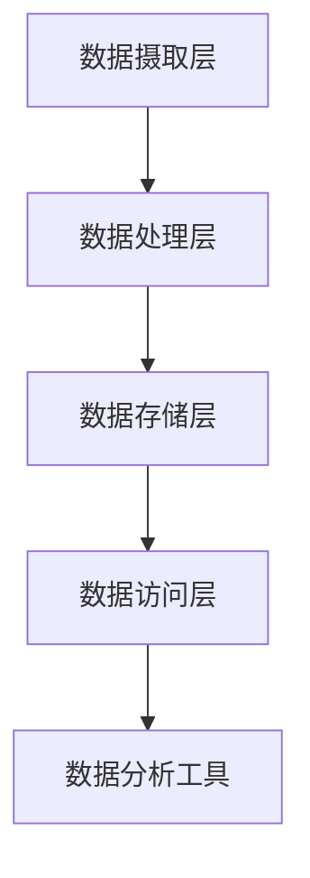
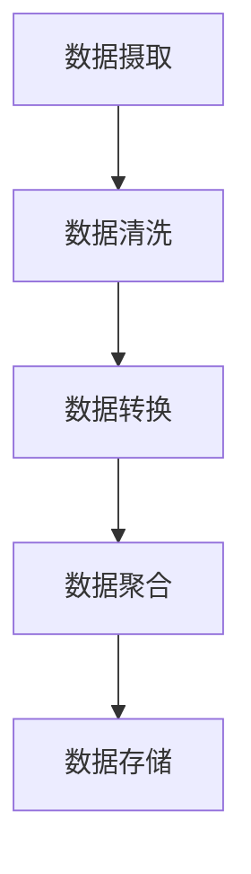
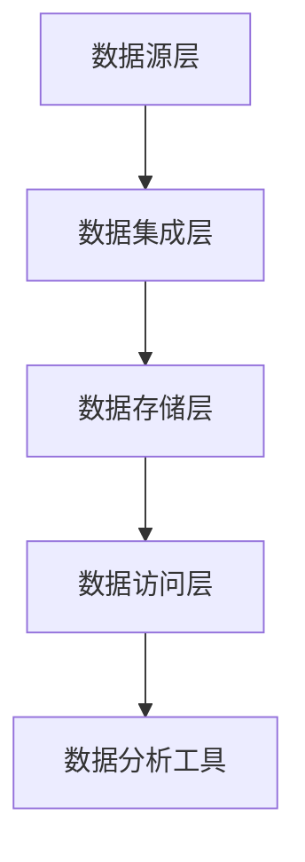
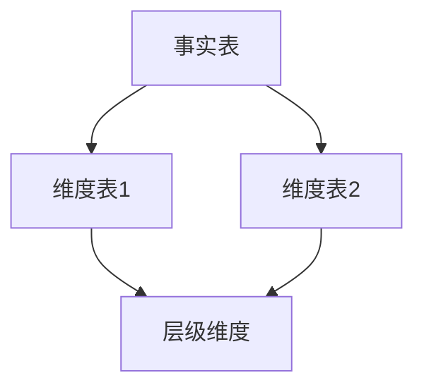
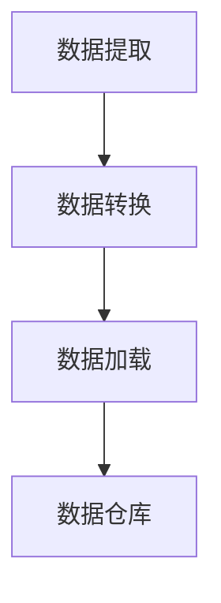
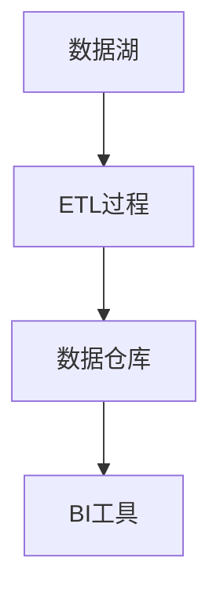

                 


### 数据湖与数据仓库：大数据存储的新范式

#### 关键词
- 数据湖
- 数据仓库
- 大数据存储
- 数据处理
- 新范式

#### 摘要
本文将深入探讨数据湖与数据仓库的基本概念、技术原理及其在当今大数据环境中的应用。通过逐步分析，我们将揭示两者之间的异同，探讨最佳实践，并展望未来发展趋势。

----------------------------------------------------------------

## 引言

### 核心概念术语说明

在进入主题之前，我们需要明确一些核心术语：

- **数据湖**：一种存储大数据的架构，可以存储不同格式的原始数据，无需预先进行结构化处理。
- **数据仓库**：一种用于存储和管理经过清洗、转换和聚合的结构的化数据的系统。

#### 问题背景与问题描述

随着互联网和物联网的快速发展，数据量呈爆炸式增长。传统的数据仓库已无法满足日益增长的数据处理需求。为了解决这个问题，数据湖的概念应运而生。它提供了一种新的存储和处理大数据的方式，允许企业更灵活地管理和分析数据。

#### 问题解决与边界与外延

数据湖与数据仓库在数据处理和存储方面各有优势。数据湖更适用于原始数据的存储和处理，而数据仓库则更适合经过清洗和结构化的数据存储和分析。因此，两者的结合可以为企业提供更全面的数据管理解决方案。

#### 概念结构与核心要素组成

- **数据湖**：核心要素包括数据存储层、数据处理层和数据访问层。
- **数据仓库**：核心要素包括数据模型层、ETL层和数据访问层。

----------------------------------------------------------------

## 第一章：数据湖与数据仓库的定义与演变

### 1.1 问题背景与问题描述

数据湖和数据仓库的出现是为了应对大数据时代的挑战。随着数据量的激增，如何高效地存储、管理和分析数据成为企业面临的重要问题。

### 1.2 数据湖与数据仓库的定义

- **数据湖**：数据湖是一种大数据存储架构，它允许存储大量非结构化、半结构化和结构化数据，无需进行预处理。
- **数据仓库**：数据仓库是一种用于存储和管理结构化数据的系统，通过ETL（提取、转换、加载）过程，将数据从源头导入并进行清洗、转换和聚合。

### 1.3 数据湖与数据仓库的发展历程

- **数据仓库**：起源于20世纪80年代，随着企业对数据管理需求的增加，数据仓库成为企业数据管理的核心。
- **数据湖**：随着大数据技术的兴起，数据湖的概念在2010年后逐渐流行。它为企业提供了一种更灵活、更高效的数据存储和管理方式。

### 1.4 核心概念与联系

- **数据湖**：核心概念包括数据摄取、数据存储、数据处理和数据访问。
- **数据仓库**：核心概念包括数据模型、ETL过程、数据存储和数据访问。

- **联系**：数据湖与数据仓库可以相互补充。数据湖负责存储原始数据，数据仓库则负责对数据进行处理和分析。两者之间的互动为企业提供了完整的数据管理解决方案。

#### 概念属性特征对比表格

| 特征         | 数据湖          | 数据仓库          |
| ------------ | -------------- | -------------- |
| 数据格式     | 非结构化、半结构化、结构化数据 | 结构化数据      |
| 数据预处理   | 无需预处理       | 需要预处理       |
| 数据存储容量 | 较大             | 较小             |
| 数据访问     | 低级访问，通常用于数据分析 | 高级访问，通常用于报表和BI工具 |

#### ER实体关系图架构

```mermaid
erDiagram
  DataLake ||--|{ DataWarehouse }
  DataStorage ||--|{ DataProcessing }
  DataAccess ||--|{ DataStorage }
```

----------------------------------------------------------------

## 第二章：数据湖技术原理

### 2.1 数据湖的技术架构

数据湖的技术架构通常包括以下几个层次：

- **数据摄取层**：负责将数据从各种来源（如日志文件、数据库、应用程序等）摄取到数据湖中。
- **数据处理层**：包括数据的清洗、转换、聚合等操作。
- **数据存储层**：存储经过处理的数据，通常使用分布式文件系统（如Hadoop HDFS）或云存储服务。
- **数据访问层**：提供数据查询和访问接口，支持各种数据分析和处理工具。

#### Mermaid架构图



### 2.2 数据湖的数据格式

数据湖可以存储多种格式的数据，包括：

- **文本文件**：如CSV、JSON、XML等。
- **二进制文件**：如图像、视频等。
- **分布式文件系统**：如Hadoop HDFS、Apache HBase等。

### 2.3 数据摄取

数据摄取是将数据从各种来源导入数据湖的过程。这个过程通常包括：

- **数据导入**：从各种数据源（如数据库、文件系统、Web服务等）导入数据。
- **数据校验**：确保导入的数据符合预期的格式和结构。
- **数据清洗**：对导入的数据进行清洗，去除重复、错误或不完整的数据。

### 2.4 数据处理

数据处理是在数据摄取后对数据进行的一系列操作，包括：

- **数据清洗**：去除重复、错误或不完整的数据。
- **数据转换**：将数据从一种格式转换为另一种格式。
- **数据聚合**：对数据进行汇总和计算，以便于分析。

### 2.5 数据存储

数据存储是将处理后的数据存储到数据湖中。这个过程包括：

- **分布式存储**：使用分布式文件系统（如Hadoop HDFS）或云存储服务（如AWS S3）存储数据。
- **数据分区**：根据数据的特性进行分区，以提高数据查询效率。
- **数据加密**：对数据进行加密，确保数据安全。

#### Mermaid流程图



----------------------------------------------------------------

## 第三章：数据仓库的架构

### 3.1 数据仓库的架构设计

数据仓库的架构设计通常包括以下几个层次：

- **数据源层**：包括各种数据源，如数据库、日志文件、应用程序等。
- **数据集成层**：将来自不同数据源的数据进行集成，并进行数据清洗和转换。
- **数据存储层**：存储经过处理的数据，通常使用关系数据库或数据仓库管理系统。
- **数据访问层**：提供数据查询和访问接口，支持各种数据分析和处理工具。

#### Mermaid架构图



### 3.2 数据模型

数据仓库的数据模型通常是星型模型或雪花模型，它们用于表示数据之间的关系。

- **星型模型**：中心是一个事实表，周围是维度表。
- **雪花模型**：星型模型的变种，通过引入更多的层级来优化查询性能。

#### Mermaid实体关系图



### 3.3 ETL过程

ETL（提取、转换、加载）是数据仓库的核心过程，它包括：

- **数据提取**：从各种数据源提取数据。
- **数据转换**：对提取的数据进行清洗、转换和聚合。
- **数据加载**：将转换后的数据加载到数据仓库中。

#### Mermaid流程图



----------------------------------------------------------------

## 第四章：数据湖与数据仓库的差异与联系

### 4.1 数据湖与数据仓库的差异

数据湖与数据仓库在以下几个方面存在显著差异：

- **数据格式**：数据湖可以存储非结构化、半结构化和结构化数据，而数据仓库主要存储结构化数据。
- **数据预处理**：数据湖通常不进行预处理，而数据仓库需要进行数据清洗、转换和聚合。
- **数据存储容量**：数据湖可以存储大量数据，而数据仓库的数据存储容量相对较小。
- **数据访问**：数据湖提供低级访问，通常用于数据分析和挖掘，而数据仓库提供高级访问，通常用于报表和BI工具。

#### 对比表格

| 特征         | 数据湖          | 数据仓库          |
| ------------ | -------------- | -------------- |
| 数据格式     | 非结构化、半结构化、结构化数据 | 结构化数据      |
| 数据预处理   | 无需预处理       | 需要预处理       |
| 数据存储容量 | 较大             | 较小             |
| 数据访问     | 低级访问，通常用于数据分析 | 高级访问，通常用于报表和BI工具 |

### 4.2 数据湖与数据仓库的联系

尽管数据湖与数据仓库在许多方面存在差异，但它们也可以相互补充：

- **数据流转**：数据湖中的原始数据可以通过ETL过程流入数据仓库，以便进行进一步的处理和分析。
- **数据共享**：数据湖和数据仓库可以共享数据，从而提供更全面的数据视图。
- **数据冗余**：数据湖中的非结构化数据可以在数据仓库中进行结构化处理，减少数据冗余。

#### Mermaid流程图



----------------------------------------------------------------

## 第五章：数据湖与数据仓库的应用场景

### 5.1 跨行业的数据处理需求

数据湖与数据仓库在各个行业都有广泛的应用，以下是一些典型的应用场景：

- **金融行业**：金融行业需要对大量交易数据进行分析，数据湖可以存储原始交易数据，数据仓库则用于生成报表和进行风险管理。
- **零售行业**：零售行业需要分析客户行为数据，数据湖可以存储原始的客户数据，数据仓库则用于生成营销策略和销售预测。
- **医疗行业**：医疗行业需要处理大量的患者数据和医疗记录，数据湖可以存储原始的医疗数据，数据仓库则用于进行疾病预测和患者管理。

### 5.2 应用实例分析

- **案例1：金融行业的数据分析**：某金融公司使用数据湖存储大量的交易数据，通过数据仓库进行数据分析，提高了交易异常检测的准确性。
- **案例2：零售行业的客户行为分析**：某零售公司利用数据湖存储客户交易数据，通过数据仓库进行客户行为分析，优化了库存管理和营销策略。

### 5.3 应用实例分析

- **案例3：医疗行业的数据分析**：某医疗公司使用数据湖存储大量的医疗记录，通过数据仓库进行疾病预测和患者管理，提高了医疗服务质量。

----------------------------------------------------------------

## 第六章：数据湖与数据仓库的最佳实践

### 6.1 成功案例分享

以下是一些成功的数据湖与数据仓库实施案例：

- **案例1：某电信公司**：通过建立数据湖，存储大量客户数据，实现了精准营销和客户体验优化。
- **案例2：某电商公司**：利用数据仓库进行订单数据分析，提高了订单处理效率和客户满意度。
- **案例3：某医疗公司**：通过数据湖与数据仓库的结合，实现了疾病预测和患者管理，提高了医疗服务水平。

### 6.2 最佳实践总结

从以上案例中，我们可以总结出一些最佳实践：

- **数据质量管理**：确保数据的准确性和一致性，是数据湖与数据仓库成功的关键。
- **数据处理优化**：通过合理的数据处理策略，提高数据处理的效率。
- **灵活的数据访问**：提供多种数据访问方式，满足不同业务需求。

### 6.3 小结

数据湖与数据仓库的最佳实践可以帮助企业更有效地管理和利用数据，实现数据驱动的决策。

----------------------------------------------------------------

## 第七章：数据湖与数据仓库的未来发展趋势

### 7.1 新技术的影响

随着新技术的不断发展，数据湖与数据仓库也在不断进化：

- **云计算**：云计算提供了强大的计算和存储资源，使数据湖与数据仓库的实现更加便捷和高效。
- **人工智能**：人工智能技术可以用于数据的分析和预测，进一步提升数据湖与数据仓库的价值。

### 7.2 未来发展方向与挑战

数据湖与数据仓库的未来发展方向包括：

- **自动化数据处理**：通过自动化工具实现数据的摄取、处理和存储，提高数据处理效率。
- **智能化数据分析**：利用人工智能技术进行数据分析和预测，实现更智能的数据驱动决策。

然而，这些发展方向也面临一些挑战：

- **数据隐私与安全**：随着数据量的增加，数据隐私和安全问题变得越来越重要。
- **数据治理**：如何有效地管理和治理数据，确保数据的准确性和一致性，是数据湖与数据仓库面临的重要挑战。

### 7.3 未来展望

未来，数据湖与数据仓库将在云计算、人工智能、大数据等技术的推动下，实现更高的效率和智能化。企业需要不断探索和创新，以充分利用这些技术的优势，实现数据价值的最大化。

----------------------------------------------------------------

## 结论

数据湖与数据仓库是大数据时代的重要技术，它们各自具有独特的优势，但也可以相互补充。通过本文的深入探讨，我们了解了数据湖与数据仓库的基本概念、技术原理和应用场景。希望本文能帮助读者更好地理解数据湖与数据仓库，并在实际应用中发挥其价值。

#### 作者信息

- 作者：AI天才研究院/AI Genius Institute & 禅与计算机程序设计艺术 /Zen And The Art of Computer Programming

----------------------------------------------------------------

### 附录

#### 实践案例代码

以下是一个简单的Python代码示例，用于数据湖与数据仓库的基本操作：

```python
import pandas as pd
from pyhive import hive

# 连接Hive数据仓库
conn = hive.connect(host='localhost', port=10000, username='hive_user')

# 从Hive数据仓库中读取数据
df = pd.read_sql('SELECT * FROM sales_data;', conn)

# 显示数据
print(df.head())

# 向Hive数据仓库中插入数据
df_to_insert = pd.DataFrame({'product_id': [1, 2, 3], 'sales_amount': [100, 200, 300]})
df_to_insert.to_sql('sales_data', conn, if_exists='append', index=False)

# 断开Hive数据仓库连接
conn.close()
```

#### 拓展阅读

- 《大数据技术导论》
- 《数据湖技术与应用》
- 《数据仓库与数据挖掘》
- 《Apache Hadoop实战》
- 《云计算基础与应用》

通过这些资料，读者可以进一步深入了解数据湖与数据仓库的相关知识。希望本文能为读者提供有价值的参考。

