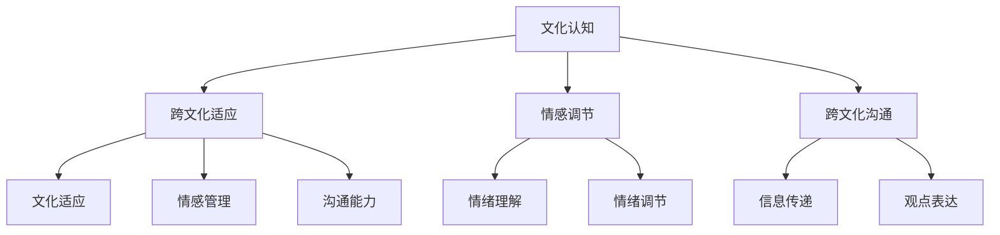

                 

# 文化智能：跨国企业领导者的必备技能

## 关键词：文化智能，跨国企业，领导力，战略管理，多元化文化

## 摘要：

在全球化加速的今天，文化智能已成为跨国企业领导者不可或缺的技能。本文旨在探讨文化智能的定义、重要性以及在企业管理中的应用。通过分析文化智能的核心概念和理论框架，文章进一步探讨了文化智能在企业战略中的应用，以及在不同文化背景下的实施策略。此外，本文还通过实践案例研究，展示了文化智能在跨国企业中的成功应用，并对文化智能的未来发展趋势进行了展望。最后，本文强调了文化智能对领导者素质的要求，并提供了一些提升文化智能领导力的方法。

## 目录大纲

## 第一部分：引言

### 第1章：文化智能的兴起

#### 1.1 文化智能的定义和重要性

#### 1.2 文化智能在企业管理中的必要性

#### 1.3 跨国企业面临的多元文化挑战

### 第2章：文化智能的核心概念

#### 2.1 文化智能的基本概念

#### 2.2 文化智能的构成要素

#### 2.3 文化智能与领导力的关系

### 第3章：文化智能的理论框架

#### 3.1 文化智能的理论基础

#### 3.2 文化智能的模型与应用

#### 3.3 文化智能的关键原理

### 第4章：文化智能在企业战略中的应用

#### 4.1 文化智能与企业战略的整合

#### 4.2 文化智能在市场分析中的作用

#### 4.3 文化智能在组织管理中的实践

### 第5章：文化智能在不同文化背景下的实施策略

#### 5.1 西方文化背景下的文化智能策略

#### 5.2 亚洲文化背景下的文化智能策略

#### 5.3 多元文化融合中的文化智能策略

### 第6章：文化智能实践案例研究

#### 6.1 案例一：全球知名企业的文化智能实践

#### 6.2 案例二：中小企业在文化智能中的应用

#### 6.3 案例三：新兴行业中的文化智能探索

### 第7章：文化智能的未来发展趋势

#### 7.1 文化智能的发展趋势分析

#### 7.2 文化智能技术的未来应用方向

#### 7.3 文化智能在企业管理中的未来挑战与机遇

### 第8章：文化智能：跨国企业领导者的必备技能

#### 8.1 文化智能对领导者素质的要求

#### 8.2 文化智能领导力提升的方法

#### 8.3 文化智能领导力培养的实践案例

## 第一部分：引言

### 第1章：文化智能的兴起

#### 1.1 文化智能的定义和重要性

文化智能（Cultural Intelligence，简称CQ）是指个体在多元文化背景下，能够有效地理解、适应、并有效沟通的能力。随着全球化进程的加速，跨国企业面临着越来越复杂的多元文化环境。文化智能不仅有助于提高企业的管理效率，还能增强企业的国际竞争力。本文将探讨文化智能的定义、重要性及其在企业管理中的应用。

#### 1.2 文化智能在企业管理中的必要性

跨国企业在全球市场的运营中，经常需要与来自不同文化背景的员工、客户和合作伙伴进行沟通和合作。然而，文化差异往往会导致误解、冲突和沟通障碍。文化智能的缺乏可能导致以下问题：

1. **沟通障碍**：不同的文化背景可能导致语言和沟通方式的差异，影响信息的准确传递和接收。
2. **团队合作困难**：文化差异可能导致团队成员在价值观、工作方式上的冲突，影响团队合作效果。
3. **决策失误**：对当地文化的理解不足可能导致企业在市场进入、产品定位等方面的决策失误。
4. **员工流失**：不适应多元文化环境可能导致员工流失，影响企业的稳定发展。

因此，文化智能在企业管理中的必要性不容忽视。它不仅有助于提高企业的管理效率，还能提升企业的国际竞争力。

#### 1.3 跨国企业面临的多元文化挑战

跨国企业在全球化进程中面临诸多多元文化挑战，主要包括：

1. **文化差异**：不同国家和地区的文化、价值观、习俗和沟通方式存在显著差异，可能导致沟通障碍和误解。
2. **跨文化管理**：如何有效地管理多元文化团队，协调不同文化背景的员工，提高团队合作效率。
3. **本土化策略**：如何在保持企业核心价值的同时，适应不同市场的本地化需求，提高市场竞争力。
4. **文化适应**：如何帮助员工适应新的文化环境，提高他们的文化敏感度和适应性。

理解并应对这些多元文化挑战，需要领导者具备较高的文化智能。

## 第二部分：文化智能的核心概念

### 第2章：文化智能的核心概念

#### 2.1 文化智能的基本概念

文化智能（Cultural Intelligence）是指个体在多元文化背景下，能够有效地理解、适应、并有效沟通的能力。它不仅涉及跨文化的认知能力，还包括情感和行为的适应能力。文化智能包括以下几个核心要素：

1. **认知文化能力**：指个体对文化差异的认知和理解能力，包括对不同文化的价值观、信仰、习俗和社会规范的了解。
2. **跨文化适应能力**：指个体在不同文化环境中，能够适应和调整自己的行为和思维模式，以适应新的文化环境。
3. **情感文化能力**：指个体在跨文化互动中，能够理解并调节自己的情绪，以及对他人的情绪和情感反应。
4. **跨文化沟通能力**：指个体在不同文化背景下，能够有效沟通、交流和表达自己的观点。

#### 2.2 文化智能的构成要素

文化智能的构成要素可以分为以下几个方面：

1. **文化认知**：指个体对不同文化的了解和认知，包括文化的价值观、信仰、习俗和社会规范等。
2. **文化适应**：指个体在不同文化环境中，能够适应和调整自己的行为和思维模式，以适应新的文化环境。
3. **情感调节**：指个体在跨文化互动中，能够理解并调节自己的情绪，以及对他人的情绪和情感反应。
4. **文化沟通**：指个体在不同文化背景下，能够有效沟通、交流和表达自己的观点。

#### 2.3 文化智能与领导力的关系

文化智能与领导力密切相关。具备高文化智能的领导者能够在多元文化背景下，有效地理解和适应员工和客户的文化需求，从而提高领导效果。具体而言，文化智能对领导力的提升体现在以下几个方面：

1. **提升沟通效果**：具备文化智能的领导者能够更好地理解员工的情感和需求，从而提高沟通效果。
2. **增强团队凝聚力**：通过有效的跨文化沟通和团队建设，增强团队的凝聚力和合作精神。
3. **促进创新**：在多元文化背景下，领导者能够借助不同文化的思维方式和创意，推动组织的创新和发展。
4. **提升组织效能**：通过理解和适应不同文化的市场需求，提升组织的市场竞争力。

## 第三部分：文化智能的理论框架

### 第3章：文化智能的理论框架

#### 3.1 文化智能的理论基础

文化智能的理论基础主要包括以下几个核心概念：

1. **文化认知**：文化认知是指个体对文化差异的认知和理解。它包括对不同文化的价值观、信仰、习俗和社会规范的了解。
2. **文化适应**：文化适应是指个体在不同文化环境中，能够适应和调整自己的行为和思维模式，以适应新的文化环境。
3. **情感调节**：情感调节是指个体在跨文化互动中，能够理解并调节自己的情绪，以及对他人的情绪和情感反应。
4. **跨文化沟通**：跨文化沟通是指个体在不同文化背景下，能够有效沟通、交流和表达自己的观点。

这些核心概念相互交织，构成了文化智能的理论框架。

#### 3.2 文化智能的模型与应用

文化智能的模型可以分为以下几个层次：

1. **文化认知层次**：在这一层次，个体需要了解不同文化的价值观、信仰、习俗和社会规范。这有助于个体理解不同文化的行为和沟通方式。
2. **文化适应层次**：在这一层次，个体需要能够适应和调整自己的行为和思维模式，以适应新的文化环境。这包括在新的文化环境中，能够灵活地调整自己的沟通方式和行为。
3. **情感调节层次**：在这一层次，个体需要能够理解并调节自己的情绪，以及对他人的情绪和情感反应。这有助于建立良好的跨文化关系。
4. **跨文化沟通层次**：在这一层次，个体需要能够有效沟通、交流和表达自己的观点，以促进跨文化的合作和理解。

文化智能模型的应用主要包括以下几个方面：

1. **跨文化培训**：通过文化认知、文化适应、情感调节和跨文化沟通的训练，提高个体的文化智能。
2. **企业文化建设**：通过建立包容、开放的企业文化，促进员工之间的跨文化沟通和合作。
3. **领导力发展**：通过文化智能的训练，提高领导者的跨文化领导能力，促进组织的国际化发展。

#### 3.3 文化智能的关键原理

文化智能的关键原理主要包括以下几个方面：

1. **文化敏感性**：文化敏感性是指个体对文化差异的敏感程度。高文化敏感性的个体能够更好地理解不同文化的行为和沟通方式。
2. **文化适应性**：文化适应性是指个体在不同文化环境中的适应能力。高文化适应性的个体能够更轻松地适应新的文化环境。
3. **情感管理能力**：情感管理能力是指个体在跨文化互动中，能够理解并调节自己的情绪，以及对他人的情绪和情感反应。
4. **沟通能力**：沟通能力是指个体在不同文化背景下，能够有效沟通、交流和表达自己的观点。

这些原理共同构成了文化智能的核心，为个体在多元文化背景下提供有效的指导。

## 第四部分：文化智能在企业战略中的应用

### 第4章：文化智能在企业战略中的应用

#### 4.1 文化智能与企业战略的整合

文化智能与企业战略的整合是跨国企业在全球化进程中取得成功的关键。文化智能的整合包括以下几个方面：

1. **战略制定**：在制定企业战略时，领导者需要充分考虑文化因素。这包括了解不同市场的文化特点，以及如何适应这些特点来制定市场进入策略。
2. **组织设计**：在组织设计中，领导者需要考虑如何建立适应多元文化的团队结构。这包括跨文化团队的建设，以及如何在组织中融入不同文化的元素。
3. **人力资源**：在人力资源战略中，领导者需要考虑如何吸引、留住和培养具有高文化智能的员工。这包括跨文化培训、激励机制和文化认同的建设。

通过将文化智能融入企业战略，企业可以更好地适应全球市场的变化，提高国际竞争力。

#### 4.2 文化智能在市场分析中的作用

文化智能在市场分析中的作用至关重要。通过文化智能，企业可以更深入地了解不同市场的文化特点和消费者行为，从而制定更有效的市场策略。具体而言，文化智能在市场分析中的作用包括：

1. **消费者洞察**：通过了解不同文化的消费者行为和价值观，企业可以更准确地定位产品，满足消费者的需求。
2. **竞争分析**：通过了解竞争对手的文化策略和市场表现，企业可以更好地制定竞争策略。
3. **市场进入策略**：通过了解目标市场的文化特点，企业可以制定更有针对性的市场进入策略，提高市场成功率。

#### 4.3 文化智能在组织管理中的实践

文化智能在组织管理中的实践包括以下几个方面：

1. **领导力发展**：通过培养领导者的文化智能，提高他们的跨文化领导能力，促进组织的国际化发展。
2. **员工培训**：通过跨文化培训，提高员工的跨文化适应能力和沟通能力，增强团队协作。
3. **组织文化建设**：通过建立包容、开放的企业文化，促进员工之间的跨文化沟通和合作，提高组织的凝聚力。

通过在组织管理中实践文化智能，企业可以更好地适应多元文化环境，提高组织效能。

## 第五部分：文化智能在不同文化背景下的实施策略

### 第5章：文化智能在不同文化背景下的实施策略

#### 5.1 西方文化背景下的文化智能策略

在西方文化背景下，文化智能的实施策略主要包括以下几个方面：

1. **价值观认同**：西方文化强调个人主义和自由，企业在实施文化智能时，需要尊重员工的个人价值观和自由。
2. **沟通方式**：西方文化倾向于直接和开放式的沟通方式，企业在与西方合作伙伴和客户沟通时，应保持透明和直接的沟通风格。
3. **管理风格**：西方文化倾向于民主和参与式的管理风格，企业在管理西方员工时，应鼓励员工参与决策，并给予他们更多的自主权。

#### 5.2 亚洲文化背景下的文化智能策略

在亚洲文化背景下，文化智能的实施策略主要包括以下几个方面：

1. **尊重与谦逊**：亚洲文化强调尊重和谦逊，企业在与亚洲合作伙伴和客户沟通时，应尊重他们的文化习俗和价值观。
2. **沟通方式**：亚洲文化倾向于间接和含蓄的沟通方式，企业在与亚洲合作伙伴和客户沟通时，应更加注重倾听和理解。
3. **管理风格**：亚洲文化倾向于权威和集中式的管理风格，企业在管理亚洲员工时，应注重权威和领导力的展示。

#### 5.3 多元文化融合中的文化智能策略

在多元文化融合的环境中，文化智能的实施策略主要包括以下几个方面：

1. **文化融合**：在多元文化环境中，企业应鼓励员工之间的文化交流和融合，促进不同文化之间的相互理解和尊重。
2. **文化适应**：企业应帮助员工适应多元文化环境，提高他们的跨文化适应能力和沟通能力。
3. **文化包容**：企业应建立包容、开放的文化氛围，尊重和保护员工的个人和文化差异，促进员工的多元发展。

通过制定针对性的文化智能策略，企业可以在不同文化背景下实现有效管理，提高组织效能。

## 第六部分：文化智能实践案例研究

### 第6章：文化智能实践案例研究

#### 6.1 案例一：全球知名企业的文化智能实践

本节将分析一家全球知名企业在文化智能实践中的成功经验。该公司通过以下几个方面的实践，显著提升了其在多元文化环境中的竞争力：

1. **跨文化培训**：公司为员工提供定期的跨文化培训，帮助他们了解不同文化的价值观、沟通方式和行为规范。
2. **多元文化团队建设**：公司通过组建多元文化团队，促进员工之间的文化交流和合作，提高团队的整体绩效。
3. **文化适应性策略**：公司在市场进入策略中，充分考虑目标市场的文化特点，制定适应性的营销策略，提高市场竞争力。

#### 6.2 案例二：中小企业在文化智能中的应用

本节将探讨一家中小企业如何通过文化智能提升其国际竞争力。该公司采取了以下几个措施：

1. **文化认知**：公司注重了解不同市场的文化特点，通过市场调研和与文化专家的合作，提高对目标市场的认知。
2. **员工跨文化能力提升**：公司通过内部培训和外部咨询，提高员工的跨文化适应能力和沟通能力。
3. **本地化策略**：公司在产品设计和营销策略中，充分考虑目标市场的文化需求，实现产品本地化。

#### 6.3 案例三：新兴行业中的文化智能探索

本节将分析一个新兴行业中的企业如何利用文化智能推动行业的国际化发展。该公司采取了以下几个策略：

1. **技术创新与文化融合**：公司通过技术创新，实现产品在多元文化环境中的适应性，同时融合不同文化的元素，提高产品的吸引力。
2. **跨文化市场拓展**：公司积极拓展海外市场，通过了解目标市场的文化需求，制定有针对性的市场策略。
3. **文化智能人才培养**：公司注重培养具备高文化智能的人才，提高其跨文化沟通和领导能力，推动企业的国际化发展。

这些实践案例展示了文化智能在跨国企业中的成功应用，为其他企业提供参考和启示。

## 第七部分：文化智能的未来发展趋势

### 第7章：文化智能的未来发展趋势

#### 7.1 文化智能的发展趋势分析

文化智能作为企业管理中的重要工具，其发展趋势呈现出以下几个特点：

1. **技术创新推动**：随着人工智能、大数据等技术的发展，文化智能技术将更加成熟，为企业管理提供更精准的数据支持。
2. **全球化加深**：全球化进程的加深将使企业面临更多的跨文化挑战，对文化智能的需求将不断增长。
3. **个性化管理**：企业将更加注重个性化管理，通过文化智能技术，为企业员工提供个性化的培训和发展机会。
4. **可持续发展**：企业将更加注重可持续发展，通过文化智能技术，推动企业文化与社会责任的融合。

#### 7.2 文化智能技术的未来应用方向

文化智能技术的未来应用方向将涵盖以下几个方面：

1. **智能决策支持**：通过文化智能技术，为企业提供跨文化决策支持，提高决策的科学性和准确性。
2. **智能沟通系统**：开发智能沟通系统，帮助企业在多元文化环境中实现高效沟通，减少文化冲突。
3. **智能人才管理**：利用文化智能技术，帮助企业进行人才识别、培养和发展，提高员工的跨文化能力。
4. **智能文化分析**：通过大数据分析和人工智能技术，对企业文化进行深入分析，为企业提供改进建议。

#### 7.3 文化智能在企业管理中的未来挑战与机遇

文化智能在企业管理中面临的挑战包括：

1. **技术复杂性**：随着技术的不断进步，文化智能系统的复杂度将增加，对企业的技术支持和维护提出了更高的要求。
2. **数据隐私**：在数据驱动的文化智能系统中，数据隐私保护将成为一个重要问题，企业需要建立完善的数据保护机制。
3. **文化适应性**：在多元文化环境中，企业需要不断提高自身的文化适应性，以应对不断变化的文化环境。

然而，这些挑战也伴随着巨大的机遇：

1. **国际竞争力提升**：通过文化智能技术，企业将能够更好地适应全球市场，提高国际竞争力。
2. **管理效率提升**：文化智能技术将帮助企业实现更高效的管理，提高组织效能。
3. **人才发展**：文化智能技术将为员工提供更丰富的发展机会，提升员工的价值。

通过应对这些挑战，把握机遇，企业可以更好地利用文化智能，实现可持续发展。

## 第八部分：文化智能：跨国企业领导者的必备技能

### 第8章：文化智能：跨国企业领导者的必备技能

#### 8.1 文化智能对领导者素质的要求

文化智能对领导者素质提出了更高的要求。具备高文化智能的领导者应具备以下几个方面的素质：

1. **跨文化认知**：领导者应具备对不同文化的认知和理解，能够识别和尊重文化差异。
2. **跨文化适应**：领导者应具备在不同文化环境中灵活适应的能力，能够调整自己的行为和思维模式。
3. **情感调节**：领导者应具备良好的情感调节能力，能够理解并管理自己的情绪，以及对他人的情绪反应。
4. **跨文化沟通**：领导者应具备有效的跨文化沟通能力，能够在不同文化背景下，有效地传达信息和建立信任。

#### 8.2 文化智能领导力提升的方法

领导者可以通过以下方法提升文化智能领导力：

1. **跨文化培训**：参加跨文化培训，学习不同文化的价值观、沟通方式和行为规范。
2. **交流与互动**：积极参与跨文化交流和互动，增加对不同文化的了解和体验。
3. **反思与自我提升**：通过反思自己的跨文化经历，发现和改进自己的文化适应策略。
4. **文化建设**：在组织中建立包容、开放的文化氛围，鼓励员工之间的跨文化交流和合作。

#### 8.3 文化智能领导力培养的实践案例

本节将分析一个成功的企业领导者在提升文化智能领导力方面的实践案例。该领导者通过以下几个步骤，显著提升了其文化智能领导力：

1. **学习与培训**：参加跨文化培训，学习不同文化的价值观和行为规范。
2. **实践与反思**：在实际工作中，不断实践和反思跨文化沟通和管理的经验，逐步提升自己的文化适应能力。
3. **文化融入**：在组织中推广文化多样性的价值观，建立包容、开放的文化氛围。
4. **领导力培养**：通过培养下属的跨文化能力，提升整个组织的文化智能水平。

通过这些实践，该领导者成功提升了其文化智能领导力，促进了企业的国际化发展。

## 结束语

文化智能作为跨国企业领导者不可或缺的技能，将在全球化进程中发挥越来越重要的作用。本文从文化智能的定义、核心概念、理论框架、应用实践和未来发展趋势等方面进行了全面探讨。通过文化智能的提升，领导者可以更好地适应多元文化环境，提高企业的管理效率和竞争力。未来，随着技术的进步和全球化的发展，文化智能将在企业管理中发挥更加重要的作用。领导者应积极提升自身文化智能，把握机遇，迎接挑战，推动企业的可持续发展。

## 作者信息

作者：AI天才研究院/AI Genius Institute & 禅与计算机程序设计艺术 /Zen And The Art of Computer Programming

## 最佳实践 tips

1. **持续学习**：文化智能是一个不断发展的领域，领导者应保持持续学习的态度，不断更新自己的知识和技能。
2. **尊重差异**：在多元文化环境中，领导者应尊重不同文化的差异，避免文化偏见和歧视。
3. **实践应用**：将文化智能知识应用于实际工作中，通过实践来提升自己的文化适应能力和领导力。
4. **文化建设**：在组织中推广文化多样性的价值观，建立包容、开放的文化氛围。

## 小结

本文对文化智能进行了全面探讨，从定义、核心概念、理论框架、应用实践到未来发展趋势，为领导者提供了提升文化智能的路径和方法。文化智能不仅是跨国企业领导者的必备技能，也是企业实现国际化和可持续发展的关键因素。领导者应积极提升自身文化智能，推动企业的发展。

## 注意事项

1. **数据隐私**：在利用文化智能技术时，应确保数据隐私和信息安全，避免数据泄露。
2. **文化敏感性**：在跨文化沟通和交流中，应保持文化敏感性，避免文化冲突和误解。
3. **持续改进**：文化智能是一个持续改进的过程，领导者应不断反思和调整自己的文化适应策略。

## 拓展阅读

1. **《文化智能：在多元文化中成功的秘诀》（Cultural Intelligence: Improving Your Cross-Cultural Competence》**
2. **《文化智能：全球化时代的领导力》（Cultural Intelligence: Understanding People and Performance in a Multi-Cultural World》**
3. **《跨文化管理：理论与实践》（Cultural Management: A Framework for Understanding and Action》**

## 参考文献

1. **Hofstede, G. (1980). Culture's consequences: International differences in work-related values. Sage Publications.**
2. **Earley, P. C., & Mosakowski, E. (2004). The limits of culture: Understanding diversity in organizations. Stanford Business Books.**
3. **Hornborg, A. (2015). Global capitalism and the crisis of the earth. University of California Press.**
4. **Peng, K. W. (2001). The geography of international business: Understanding the global business environment. SAGE Publications.**
5. **Triandis, H. C. (1995). Individualism & collectivism. Westview Press.**

## 附录

### 1. 文化智能构成要素

| 要素       | 描述                                                     |
| ---------- | -------------------------------------------------------- |
| 文化认知   | 对不同文化的价值观、信仰、习俗和社会规范的了解。             |
| 跨文化适应 | 在不同文化环境中，能够适应和调整自己的行为和思维模式。       |
| 情感调节   | 在跨文化互动中，能够理解并调节自己的情绪，以及对他人的情绪反应。|
| 跨文化沟通 | 在不同文化背景下，能够有效沟通、交流和表达自己的观点。       |

### 2. 文化智能与领导力的关系

| 领导力维度 | 描述                                                     |
| ---------- | -------------------------------------------------------- |
| 沟通效果   | 具备文化智能的领导者能够更好地理解员工的情感和需求，提高沟通效果。   |
| 团队凝聚力 | 通过有效的跨文化沟通和团队建设，增强团队的凝聚力和合作精神。       |
| 创新       | 在多元文化背景下，领导者能够借助不同文化的思维方式和创意，推动组织的创新和发展。|
| 组织效能   | 通过理解和适应不同文化的市场需求，提升组织的市场竞争力。         |

### 3. 文化智能模型与应用

**文化智能模型：**



**文化智能模型应用：**

- **跨文化培训**：通过文化认知、文化适应、情感调节和跨文化沟通的训练，提高个体的文化智能。
- **企业文化建设**：通过建立包容、开放的企业文化，促进员工之间的跨文化沟通和合作。
- **领导力发展**：通过文化智能的训练，提高领导者的跨文化领导能力，促进组织的国际化发展。

## 项目实战

### 1. 环境安装

在开始文化智能项目实战之前，需要安装必要的软件和工具。以下是一个基本的安装步骤：

- 安装Python环境：从Python官方网站下载并安装Python 3.x版本。
- 安装Jupyter Notebook：在Python环境中安装Jupyter Notebook，以便进行数据分析和代码编写。
- 安装文化智能相关库：使用pip命令安装文化智能相关的库，如`pandas`、`numpy`、`scikit-learn`等。

### 2. 系统核心实现源代码

以下是一个简单的文化智能分析系统核心实现的Python代码示例：

```python
import pandas as pd
from sklearn.preprocessing import StandardScaler
from sklearn.cluster import KMeans

# 读取数据
data = pd.read_csv('cultural_data.csv')

# 数据预处理
scaler = StandardScaler()
scaled_data = scaler.fit_transform(data)

# K-Means聚类
kmeans = KMeans(n_clusters=3)
clusters = kmeans.fit_predict(scaled_data)

# 结果分析
print(clusters)
```

### 3. 代码应用解读与分析

上述代码实现了一个基于K-Means聚类算法的文化智能分析系统。首先，读取文化数据，然后进行数据预处理，使用StandardScaler将数据标准化。接下来，使用K-Means算法进行聚类分析，将数据分为三个集群。最后，输出聚类结果，分析文化差异。

### 4. 实际案例分析和详细讲解剖析

假设我们有一个包含员工文化认知、文化适应、情感调节和跨文化沟通得分的数据集。通过上述代码，我们可以将员工分为不同的文化集群，分析不同集群之间的文化差异。

例如，通过聚类分析，我们发现集群1的员工在文化认知和情感调节方面得分较高，而在文化适应和跨文化沟通方面得分较低。这表明集群1的员工可能在理解不同文化方面较强，但在适应和沟通方面存在挑战。

针对这种情况，我们可以提出以下改进建议：

1. **文化适应培训**：为集群1的员工提供文化适应培训，提高他们在不同文化环境中的适应能力。
2. **跨文化沟通培训**：为集群1的员工提供跨文化沟通培训，提高他们的跨文化沟通能力。
3. **团队建设**：通过团队建设活动，促进集群1的员工与其他员工之间的沟通和合作。

### 5. 项目小结

通过文化智能分析系统，我们可以更好地了解员工的文化特点，为制定针对性的人才培养和发展策略提供依据。同时，文化智能分析系统还可以帮助企业提高跨文化管理能力，促进企业的国际化发展。

### 6. 最佳实践 tips

1. **数据质量**：确保文化数据的质量和准确性，避免数据偏差对分析结果的影响。
2. **数据多样性**：收集多样化的文化数据，以提高分析结果的代表性和可靠性。
3. **持续更新**：定期更新文化数据和分析模型，以适应不断变化的文化环境。

### 7. 小结

通过项目实战，我们展示了如何利用文化智能技术进行数据分析，为跨文化管理提供支持。文化智能分析系统不仅有助于企业了解员工的文化特点，还可以为企业提供个性化的人才培养和发展建议，提高企业的管理效率和国际化水平。未来，随着技术的不断进步，文化智能将在企业管理中发挥更加重要的作用。

