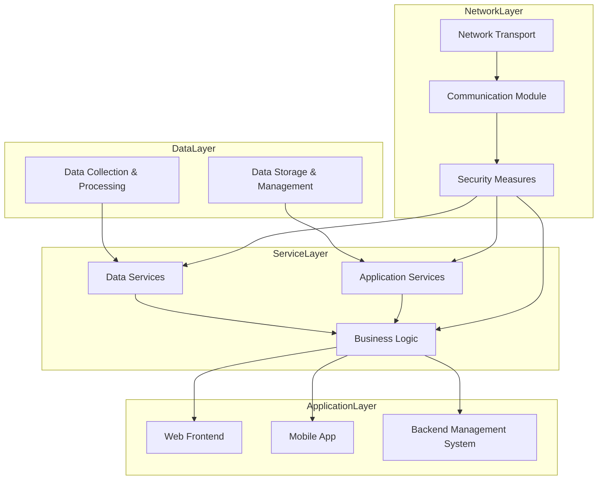
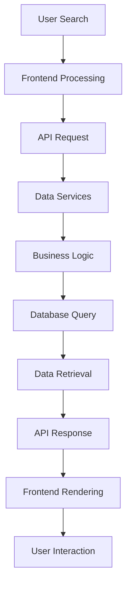

                 


----------------------------------------------------------------
# 文化遗产数字化：利用提示词重现历史

## 关键词：文化遗产、数字化、提示词、历史重现、技术实现

> 摘要：本文探讨了如何利用数字化技术和提示词，将文化遗产的历史信息重新呈现给公众。文章首先介绍了文化遗产数字化的背景和意义，然后详细阐述了提示词在数字化文化遗产中的应用。通过具体案例和实践，本文展示了如何利用这些技术手段实现历史重现。

----------------------------------------------------------------
# 目录大纲设计思路

## 1. 确定书籍的核心主题

文化遗产数字化是一项重要任务，旨在将珍贵的文化遗产转化为数字形式，以便更好地保存、研究和展示。因此，书籍的核心主题是“文化遗产数字化：利用提示词重现历史”。

## 2. 分析目标读者

本书的目标读者包括历史学者、信息技术人员、文化遗产保护工作者以及对数字化技术感兴趣的一般公众。因此，目录设计需要既具备学术性，又具有可读性。

## 3. 设定目录结构

目录结构应包括以下几个部分：

- **背景介绍**：介绍文化遗产数字化的背景、意义和挑战。
- **核心概念与联系**：阐述数字化技术、提示词等相关概念，并绘制ER实体关系图。
- **算法原理讲解**：详细讲解数字化文化遗产中的算法原理。
- **系统分析与架构设计**：介绍数字化系统的功能、架构和接口设计。
- **项目实战**：通过实际案例展示数字化文化遗产的实施过程。
- **最佳实践与拓展阅读**：总结最佳实践，提供拓展阅读资源。

## 4. 拟定具体章节内容

在上述结构的基础上，详细拟定每个章节的内容。以下是初步的目录大纲：

----------------------------------------------------------------

## 第一部分：文化遗产数字化概述

### 第1章：文化遗产与数字化

- 1.1 文化遗产的定义与价值
- 1.2 数字化的兴起与影响
- 1.3 文化遗产数字化的意义与挑战

### 第2章：数字化技术与核心概念

- 2.1 数字化技术的类型与应用
- 2.2 提示词的作用与分类
- 2.3 核心概念的联系与作用

## 第二部分：数字化文化遗产的算法原理

### 第3章：算法原理讲解

- 3.1 算法概述与流程图
- 3.2 Python代码示例与解释
- 3.3 数学模型与公式

## 第三部分：数字化文化遗产的系统分析与架构设计

### 第4章：系统分析与架构设计

- 4.1 问题场景介绍
- 4.2 系统功能设计与领域模型
- 4.3 系统架构设计
- 4.4 系统接口设计与交互

## 第四部分：数字化文化遗产项目实战

### 第5章：项目实战

- 5.1 环境安装与准备
- 5.2 系统核心实现源代码
- 5.3 代码应用解读与分析
- 5.4 实际案例分析与讲解

## 第五部分：最佳实践与拓展阅读

### 第6章：最佳实践与注意事项

- 6.1 文化遗产数字化过程中的最佳实践
- 6.2 注意事项与风险提示
- 6.3 拓展阅读资源

### 第7章：未来展望与挑战

- 7.1 文化遗产数字化的发展趋势
- 7.2 面临的挑战与解决方案
- 7.3 未来发展方向与可能影响

----------------------------------------------------------------

这个目录大纲是一个初步的设计，每个章节的具体内容还需要进一步细化和完善。在后续的步骤中，我们将根据实际需求进行调整。

## 如何让目录大纲更加清晰？

为了使目录大纲更加清晰，我们可以采取以下措施：

- **使用统一的格式**：确保所有章节都遵循相同的格式，使用统一的标记（如`#`、`##`、`###`等），这样可以使得目录结构一目了然。
- **明确章节标题**：每个章节的标题都应该是简明扼要的，能够准确传达章节的主要内容。避免使用模糊或冗长的标题。
- **使用子标题**：在每个章节内，使用子标题来细分内容。子标题有助于读者快速找到他们感兴趣的部分，同时也增加了目录的可读性。
- **保持一致性**：确保章节的级别保持一致。例如，如果某个章节有二级子标题，那么其他章节也应该有相同级别的子标题。
- **使用简短的段落**：在每个子标题下面，使用简短的段落来概述该部分的内容。这有助于读者快速了解每个部分的核心要点。
- **使用图形辅助**：在适当的地方使用图形，如流程图、类图、架构图等，可以帮助读者更好地理解复杂的概念和流程。
- **包含关键词**：在每个章节和子标题中使用关键词，这有助于读者在搜索目录时找到相关内容。
- **审查和修改**：在设计完成后，审查目录，确保没有遗漏重要部分，也没有过多的冗余内容。根据需要调整章节的顺序和内容。

通过这些措施，我们可以设计出一个清晰、简洁且易于理解的目录大纲。

----------------------------------------------------------------

# 引言

文化遗产是人类文明的重要载体，承载着丰富的历史、文化和社会价值。然而，随着时间的推移和环境的变迁，许多文化遗产面临着消失或损坏的风险。为了保护这些宝贵的遗产，数字化技术应运而生。数字化文化遗产不仅能够有效地保存和传承历史信息，还可以通过丰富的交互方式让公众更直观地体验历史。在这一背景下，利用提示词实现文化遗产的数字化重现成为了一个热门研究方向。

本文旨在探讨如何利用数字化技术和提示词，将文化遗产的历史信息重新呈现给公众。文章首先介绍了文化遗产数字化的背景和意义，然后详细阐述了提示词在数字化文化遗产中的应用。通过具体案例和实践，本文展示了如何利用这些技术手段实现历史重现。此外，文章还将探讨数字化文化遗产面临的挑战、解决方案以及未来发展方向。

本文的结构如下：

- **第一部分：文化遗产数字化概述**：介绍文化遗产数字化的背景、意义和挑战，以及数字化技术的基本概念。
- **第二部分：数字化文化遗产的算法原理**：讲解数字化文化遗产中的核心算法原理，包括数学模型和流程图。
- **第三部分：数字化文化遗产的系统分析与架构设计**：介绍数字化系统的功能、架构和接口设计。
- **第四部分：数字化文化遗产项目实战**：通过实际案例展示数字化文化遗产的实施过程。
- **第五部分：最佳实践与拓展阅读**：总结最佳实践，提供拓展阅读资源。

通过本文的阅读，读者可以全面了解文化遗产数字化的现状和未来发展趋势，掌握数字化文化遗产的实现技术，并为相关项目提供实践指导。

----------------------------------------------------------------

## 背景介绍

### 1.1 文化遗产的定义与价值

文化遗产是指人类历史上留下的物质和非物质遗产，包括文物、建筑、艺术品、手稿、传统习俗、音乐、舞蹈、戏剧等。这些遗产不仅是历史的见证，更是文化传承和发展的重要资源。文化遗产反映了不同历史时期的社会、经济、政治和文化状况，具有极高的历史、艺术、科学和教育价值。

### 1.2 数字化的兴起与影响

数字化是指将信息、图像、音频、视频等实体对象转换为数字形式的过程。随着信息技术的迅猛发展，数字化技术已经成为现代社会的重要驱动力。数字化技术的兴起不仅改变了信息的存储、传输和获取方式，也对文化遗产的保护、研究和传播产生了深远的影响。

### 1.3 文化遗产数字化的意义与挑战

文化遗产数字化具有重要的现实意义：

1. **保存与传承**：数字化技术能够有效地保存文化遗产，防止因自然灾害、战争等原因导致的损毁和丢失。
2. **传播与普及**：数字化文化遗产可以通过互联网等渠道传播，让更多的人了解和接触到文化遗产，提高公众的文化素养。
3. **教育与研究**：数字化技术为教育和研究提供了丰富的资源，有助于深入挖掘文化遗产的价值和内涵。
4. **创新与应用**：数字化文化遗产为文化产业的创新和发展提供了新的契机，推动了数字文化的繁荣。

然而，文化遗产数字化也面临着诸多挑战：

1. **技术挑战**：数字化技术需要高性能的计算能力、存储设备和网络基础设施，对技术的要求较高。
2. **资金投入**：文化遗产数字化需要大量的资金投入，包括硬件设备、软件工具、技术支持和人员培训等。
3. **数据管理**：数字化文化遗产涉及大量数据，如何高效地存储、管理和共享这些数据是一个重要问题。
4. **版权问题**：数字化文化遗产在传播过程中涉及到版权问题，如何平衡版权保护和文化遗产的传播也是一个挑战。

### 1.4 文化遗产数字化的核心概念

在文化遗产数字化过程中，以下几个核心概念至关重要：

1. **数字化技术**：包括图像处理、音频处理、视频处理、3D建模、虚拟现实等。
2. **数据标准**：为了实现数据的共享和互操作性，需要制定统一的数据标准和规范。
3. **数据安全**：数字化文化遗产的数据安全至关重要，需要采取有效的措施保护数据不被篡改或丢失。
4. **用户交互**：通过交互设计，提高用户对数字化文化遗产的体验和参与度。

通过以上背景介绍，我们可以更好地理解文化遗产数字化的重要性以及面临的挑战。接下来，我们将进一步探讨数字化技术、提示词等相关概念，为后续内容奠定基础。

### 1.5 文化和自然遗产

文化和自然遗产可以分为两大类：物质文化遗产和非物质文化遗产。

#### 1.5.1 物质文化遗产

物质文化遗产指的是具有历史、艺术和科学价值的物质遗存，如古建筑、古遗址、文物等。这些遗产直接反映了人类历史和文化的发展，具有重要的历史、艺术和科学价值。

- **古建筑**：如古宫殿、寺庙、城堡、桥梁等。
- **古遗址**：如古城、古墓、遗址公园等。
- **文物**：如书画、雕塑、陶瓷、金属器等。

#### 1.5.2 非物质文化遗产

非物质文化遗产指的是人类口头传统、表演艺术、社会实践、习俗、节庆、知识和实践以及其相关的文化遗产。这些遗产是非物质文化传承的重要载体，反映了人类文化的多样性和创造力。

- **口头传统**：如神话、传说、谚语、歌谣等。
- **表演艺术**：如音乐、舞蹈、戏剧、曲艺等。
- **社会实践**：如节庆、庆典、仪式等。
- **习俗**：如婚礼习俗、葬礼习俗等。
- **知识和实践**：如传统手工艺、传统医学等。

物质文化遗产和非物质文化遗产都是文化遗产的重要组成部分，数字化技术在这两种遗产的保护和传承中都有着广泛的应用。

### 1.6 数字化文化遗产的关键词

在讨论数字化文化遗产时，以下几个关键词至关重要：

1. **数字化**：指将文化遗产转换为数字形式的过程，包括图像处理、音频处理、视频处理等。
2. **数据采集**：指收集和获取文化遗产的数据，包括照片、视频、音频、文字等。
3. **数据存储**：指将采集到的文化遗产数据存储到数据库或其他存储设备中。
4. **数据管理**：指对数字化文化遗产数据进行组织、分类、备份和恢复等操作。
5. **数据共享**：指实现数字化文化遗产数据的共享和互操作性，以便于公众访问和使用。
6. **虚拟现实**：通过计算机技术创建一个虚拟的三维环境，让用户能够沉浸式体验文化遗产。
7. **增强现实**：在现实环境中叠加虚拟信息，增强用户对现实世界的认知。
8. **人工智能**：利用机器学习、自然语言处理等技术，对数字化文化遗产进行分析和处理，提高用户体验和准确性。
9. **数据安全**：确保数字化文化遗产数据的安全，防止数据泄露、篡改和丢失。

通过上述关键词，我们可以更全面地了解数字化文化遗产的各个方面，为后续内容提供参考。

### 1.7 文化和自然遗产的保护与传承

文化和自然遗产的保护与传承是一项全球性的任务，涉及多个领域和利益相关者。以下是一些关键点：

#### 1.7.1 国际合作

国际社会通过联合国教科文组织（UNESCO）等机构，制定了多项保护文化和自然遗产的国际公约和标准，推动各国合作保护遗产。

#### 1.7.2 法律法规

各国政府通过制定相关法律法规，保护文化遗产的合法权益，规范遗产的保护和管理。

#### 1.7.3 技术应用

数字化技术、虚拟现实、增强现实等技术在文化遗产保护与传承中的应用，大大提高了遗产的保存和展示效果。

#### 1.7.4 公众参与

鼓励公众参与文化遗产的保护和传承，提高社会对遗产价值的认识，培养遗产保护意识。

#### 1.7.5 教育推广

通过教育推广，提高公众对文化遗产的认知和保护意识，促进文化的传承和发展。

#### 1.7.6 持续关注

持续关注文化和自然遗产的保护与传承，确保遗产得到长期的关注和保护。

通过上述措施，我们可以更好地保护和传承文化和自然遗产，让它们在现代社会中焕发新的生命力。

## 核心概念与联系

### 2.1 数字化技术

数字化技术是将文化遗产以数字形式进行存储、处理和展示的技术。这些技术包括图像处理、音频处理、视频处理、3D建模、虚拟现实和增强现实等。数字化技术的核心作用是将传统的文化遗产转化为数字资产，使其能够更方便地保存、共享和研究。

#### 2.1.1 图像处理

图像处理技术用于对文化遗产图像进行数字化采集、增强、修复和识别。例如，通过图像增强算法可以提高图像的清晰度和对比度，使受损的文物图像得到修复。图像识别技术则可以自动识别图像中的关键元素，如人物、建筑、文物等，从而实现文化遗产的自动分类和标注。

#### 2.1.2 音频处理

音频处理技术用于对文化遗产的音频资料进行数字化采集、增强和编辑。例如，通过音频修复技术可以恢复受损的音频信号，提高音频的质量。音频识别技术可以识别音频中的语言、声音和音乐元素，为文化遗产的音频资料提供更详细的标签和分类。

#### 2.1.3 视频处理

视频处理技术用于对文化遗产的视频资料进行数字化采集、编辑和展示。通过视频处理技术，可以增强视频的视觉效果，修复视频中的瑕疵，甚至创建虚拟现实和增强现实体验。例如，通过视频分割技术可以将长视频分割成多个片段，便于用户浏览和检索。

#### 2.1.4 3D建模

3D建模技术用于对文化遗产进行三维数字化建模，创建三维数字模型。通过3D建模，用户可以在计算机上自由旋转、缩放和观察文化遗产，实现沉浸式体验。3D建模技术还可以用于文化遗产的修复和保护，通过虚拟修复技术，可以在不影响实际文物的情况下进行修复实验。

#### 2.1.5 虚拟现实

虚拟现实（VR）技术通过计算机生成一个模拟的三维环境，让用户能够沉浸其中。在文化遗产保护中，VR技术可以用于创建虚拟博物馆、虚拟历史场景等，让用户能够身临其境地体验历史。VR技术不仅可以提高文化遗产的展示效果，还可以用于教育和研究，提供更加直观的学习和研究工具。

#### 2.1.6 增强现实

增强现实（AR）技术通过在现实环境中叠加虚拟信息，增强用户对现实世界的认知。在文化遗产保护中，AR技术可以用于创建虚拟文物展示、虚拟修复演示等，将文化遗产的信息与现实环境相结合，提供更加丰富和生动的体验。

### 2.2 提示词

提示词（Keywords）是在信息检索中用于描述和索引文献或数据的词汇。在文化遗产数字化中，提示词的作用至关重要，它可以帮助用户快速找到相关的文化遗产信息，提高信息检索的效率。

#### 2.2.1 提示词的类型

提示词可以分为以下几种类型：

1. **关键词**：用于描述文化遗产的主要特征或内容的词汇，如“长城”、“博物馆”、“古建筑”等。
2. **主题词**：用于描述文化遗产的主题或领域的词汇，如“历史”、“文化”、“艺术”等。
3. **分类词**：用于分类文化遗产的词汇，如“文物”、“艺术品”、“建筑”等。
4. **时间词**：用于描述文化遗产的历史时期的词汇，如“唐朝”、“文艺复兴”、“明清”等。
5. **地点词**：用于描述文化遗产所在地的词汇，如“北京”、“巴黎”、“罗马”等。

#### 2.2.2 提示词的作用

提示词在文化遗产数字化中的应用主要体现在以下几个方面：

1. **信息检索**：用户可以通过输入提示词，快速查找相关的文化遗产信息。
2. **信息组织**：提示词可以帮助对文化遗产信息进行分类和索引，提高信息的组织和管理效率。
3. **信息共享**：通过统一的提示词标准，可以实现不同平台和系统之间的信息共享和互操作性。
4. **用户体验**：提示词可以提高用户的检索体验，帮助用户更好地理解和利用文化遗产信息。

### 2.3 核心概念的联系与作用

数字化技术和提示词在文化遗产数字化中具有密切的联系和相互作用：

1. **数据采集**：数字化技术用于对文化遗产进行数据采集，包括图像、音频、视频和3D模型等。这些数据是进行后续处理和分析的基础。
2. **数据处理**：通过图像处理、音频处理、视频处理和3D建模等技术，对采集到的数据进行处理和增强，使其更适用于展示和研究。
3. **信息检索**：利用提示词对处理后的数据进行索引和分类，提高信息检索的效率。
4. **信息展示**：通过虚拟现实、增强现实等技术，结合提示词，将文化遗产的信息以更直观、生动的方式展示给用户。
5. **用户互动**：用户可以通过输入提示词，与数字化文化遗产进行互动，获取更丰富的信息和体验。

通过以上分析，我们可以看出，数字化技术和提示词在文化遗产数字化中发挥着关键作用，它们共同构建了一个高效、互动和沉浸式的文化遗产展示和体验平台。

### 2.4 ER实体关系图

为了更好地理解数字化文化遗产中的实体及其关系，我们可以使用ER（Entity-Relationship）实体关系图进行描述。ER图是一种用于描述实体及其关系的图形化方法，它可以帮助我们直观地展示系统的架构和逻辑关系。

以下是数字化文化遗产中的ER实体关系图：

```
用户 [User]
|
|-- 文物 [CulturalRelic]
|   |-- 类别 [Category]
|   |-- 名称 [Name]
|   |-- 描述 [Description]
|   |-- 图片 [Image]
|   |-- 视频 [Video]
|   |-- 音频 [Audio]
|   |-- 3D模型 [3DModel]
|
|-- 博物馆 [Museum]
|   |-- 名称 [Name]
|   |-- 地址 [Address]
|   |-- 部门 [Department]
|
`-- 展览 [Exhibition]
    |-- 名称 [Name]
    |-- 时间 [Time]
    |-- 描述 [Description]
    |-- 文物列表 [CulturalRelicList]
```

#### 实体与属性

1. **用户（User）**：表示访问和互动系统的用户。属性包括用户名（Username）、电子邮件（Email）和密码（Password）。
2. **文物（CulturalRelic）**：表示文化遗产，包括文物、艺术品等。属性包括类别（Category）、名称（Name）、描述（Description）、图片（Image）、视频（Video）、音频（Audio）和3D模型（3DModel）。
3. **博物馆（Museum）**：表示保存和展示文化遗产的机构。属性包括名称（Name）、地址（Address）和部门（Department）。
4. **展览（Exhibition）**：表示博物馆举办的展览活动。属性包括名称（Name）、时间（Time）和描述（Description）。

#### 实体关系

1. **用户-文物**：用户可以收藏、评论和浏览文物。这是一个多对多的关系，表示一个用户可以收藏多个文物，一个文物也可以被多个用户收藏。
2. **文物-类别**：文物可以根据类别进行分类。这是一个一对多的关系，表示一个类别可以包含多个文物，但一个文物只能属于一个类别。
3. **文物-博物馆**：文物可以属于某个博物馆。这是一个多对多的关系，表示一个博物馆可以展示多个文物，一个文物也可以在多个博物馆中展示。
4. **展览-文物**：展览可以包含多个文物。这是一个多对多的关系，表示一个展览可以包含多个文物，一个文物也可以被多个展览包含。

通过ER图，我们可以清晰地理解数字化文化遗产中的实体及其关系，为系统的设计与实现提供参考。

### 2.5 提示词的分类与作用

在数字化文化遗产中，提示词起着至关重要的作用。为了更好地利用提示词，我们可以根据其作用和用途将其分为以下几类：

#### 2.5.1 描述性提示词

描述性提示词主要用于描述文化遗产的基本信息，如名称、年代、地点、材质等。这些提示词可以帮助用户快速找到感兴趣的文化遗产。例如，对于一幅古代绘画作品，描述性提示词可以是“北宋”、“山水画”、“牧牛图”等。

#### 2.5.2 主题性提示词

主题性提示词用于描述文化遗产的主题或研究领域，如历史、文化、艺术、建筑等。这些提示词可以帮助用户了解文化遗产的相关背景和内涵。例如，对于一座古代建筑，主题性提示词可以是“明清建筑”、“宫殿”、“园林”等。

#### 2.5.3 技术性提示词

技术性提示词用于描述文化遗产的数字化技术和展示方式，如3D建模、虚拟现实、增强现实等。这些提示词可以帮助用户了解文化遗产的数字化处理和展示过程。例如，对于一件数字化文物，技术性提示词可以是“图像处理”、“三维扫描”、“VR展示”等。

#### 2.5.4 关联性提示词

关联性提示词用于描述文化遗产之间的关联关系，如文物之间的关联、博物馆之间的关联等。这些提示词可以帮助用户发现和探索文化遗产之间的联系。例如，对于两件文物，关联性提示词可以是“相似”、“配套”等。

#### 2.5.5 搜索性提示词

搜索性提示词用于帮助用户在数字化系统中进行搜索和检索。这些提示词通常是一组词汇或短语，用于表示用户可能感兴趣的内容。例如，对于一位历史学者，搜索性提示词可以是“古代战争”、“政治制度”、“文化变革”等。

通过以上分类，我们可以更有效地利用提示词，提高数字化文化遗产的检索效率和用户体验。

### 2.6 提示词在数字化文化遗产中的应用

#### 2.6.1 信息检索

提示词在数字化文化遗产的信息检索中起着至关重要的作用。用户可以通过输入描述性、主题性或搜索性提示词，快速找到相关的文化遗产信息。例如，用户输入“故宫”、“清朝”等提示词，系统可以返回故宫的相关文物、历史资料和展览信息。

#### 2.6.2 信息组织

提示词可以帮助对文化遗产信息进行分类和索引，提高信息管理的效率。通过主题性提示词，可以将文化遗产按照不同的主题进行分类，如艺术、建筑、历史等。用户可以通过浏览这些分类，快速找到感兴趣的内容。

#### 2.6.3 交互体验

在数字化文化遗产展示中，提示词可以增强用户的交互体验。通过关联性提示词，用户可以探索文化遗产之间的联系，如文物与文物之间的关联、博物馆与博物馆之间的关联。此外，技术性提示词可以帮助用户了解文化遗产的数字化处理过程，提高用户的理解。

#### 2.6.4 个性化推荐

基于用户的搜索历史和偏好，系统可以通过提示词进行个性化推荐。例如，用户在系统中搜索“博物馆”、“艺术展”等提示词，系统可以推荐与这些提示词相关的其他文化遗产信息，提高用户的满意度。

#### 2.6.5 搜索优化

通过分析用户输入的提示词，系统可以优化搜索算法，提高搜索的准确性和效率。例如，系统可以通过分析用户搜索行为，调整提示词的权重，使相关提示词在搜索结果中排名更高。

通过以上应用，提示词在数字化文化遗产中发挥着重要的作用，提高了信息检索的效率、信息组织的效率、交互体验的满意度以及个性化推荐的准确性。

### 2.7 数字化文化遗产中的核心算法原理

在数字化文化遗产的处理过程中，核心算法原理扮演着至关重要的角色。以下将介绍几种关键算法及其应用：

#### 2.7.1 图像处理算法

图像处理算法用于对文化遗产图像进行采集、增强、修复和识别。以下是一些常用的图像处理算法：

1. **图像增强算法**：用于提高图像的清晰度和对比度。常见的图像增强算法包括直方图均衡化、对比度拉伸、图像锐化等。
2. **图像修复算法**：用于修复受损的图像。基于先验知识的图像修复算法、基于图像配准的图像修复算法和基于深度学习的图像修复算法是当前研究的热点。
3. **图像识别算法**：用于自动识别图像中的关键元素。常见的图像识别算法包括基于特征的图像识别算法（如SIFT、SURF等）和基于深度学习的图像识别算法（如卷积神经网络、循环神经网络等）。

#### 2.7.2 音频处理算法

音频处理算法用于对文化遗产的音频资料进行采集、增强、编辑和识别。以下是一些常用的音频处理算法：

1. **音频增强算法**：用于提高音频的质量。常见的音频增强算法包括去噪、回声消除、音量均衡等。
2. **音频修复算法**：用于修复受损的音频。基于音频信号处理的修复算法和基于深度学习的修复算法是当前的研究方向。
3. **音频识别算法**：用于自动识别音频中的语言、声音和音乐元素。常见的音频识别算法包括隐马尔可夫模型（HMM）、高斯混合模型（GMM）、深度神经网络（DNN）等。

#### 2.7.3 视频处理算法

视频处理算法用于对文化遗产的视频资料进行采集、增强、编辑和识别。以下是一些常用的视频处理算法：

1. **视频增强算法**：用于提高视频的质量。常见的视频增强算法包括图像增强、视频去噪、运动补偿等。
2. **视频分割算法**：用于将视频分割成多个片段，便于用户浏览和检索。常见的视频分割算法包括基于背景的分割、基于光流的分割和基于内容的分割等。
3. **视频识别算法**：用于自动识别视频中的关键元素。常见的视频识别算法包括基于特征的识别算法和基于深度学习的识别算法。

#### 2.7.4 3D建模算法

3D建模算法用于对文化遗产进行三维数字化建模。以下是一些常用的3D建模算法：

1. **点云重建算法**：用于从三维点云数据中重建三维模型。常见的点云重建算法包括基于表面重建的算法和基于体素重建的算法。
2. **曲面重建算法**：用于从点云数据中重建三维曲面的算法。常见的曲面重建算法包括基于多边形网格的算法和基于NURBS的算法。
3. **纹理映射算法**：用于将二维纹理映射到三维模型上，增强模型的视觉效果。常见的纹理映射算法包括基于顶点的纹理映射和基于像素的纹理映射。

#### 2.7.5 虚拟现实和增强现实算法

虚拟现实（VR）和增强现实（AR）算法用于创建和展示虚拟环境和增强现实体验。以下是一些关键算法：

1. **空间定位算法**：用于确定用户在虚拟环境中的位置和方向。常见的空间定位算法包括基于视觉的定位算法和基于惯性传感器的定位算法。
2. **渲染算法**：用于生成虚拟环境的图像。常见的渲染算法包括基于光线的渲染算法和基于像素的渲染算法。
3. **交互算法**：用于实现用户与虚拟环境的交互。常见的交互算法包括手势识别算法、语音识别算法和体感控制算法。

通过以上核心算法的应用，数字化文化遗产的处理变得更加高效和精确，为文化遗产的保存、展示和研究提供了强大的技术支持。

### 2.8 Python代码示例与算法原理

为了更好地理解数字化文化遗产中的核心算法原理，我们将通过具体的Python代码示例进行讲解。

#### 2.8.1 图像增强算法示例

以下是一个简单的图像增强算法示例，使用OpenCV库实现直方图均衡化和对比度拉伸：

```python
import cv2
import numpy as np

def enhance_image(image_path):
    image = cv2.imread(image_path, cv2.IMREAD_GRAYSCALE)
    # 直方图均衡化
    eq_image = cv2.equalizeHist(image)
    # 对比度拉伸
    alpha = 1.5  # 对比度增强系数
    beta = 50    # 对比度偏移量
    enhanced_image = cv2.convertScaleAbs(eq_image, alpha=alpha, beta=beta)
    return enhanced_image

# 测试图像增强
enhanced_image = enhance_image('path/to/image.jpg')
cv2.imshow('Enhanced Image', enhanced_image)
cv2.waitKey(0)
cv2.destroyAllWindows()
```

在这个示例中，我们首先使用`cv2.imread`函数读取图像，然后使用`cv2.equalizeHist`函数进行直方图均衡化。直方图均衡化可以改善图像的对比度，使图像中的细节更加清晰。接着，我们使用`cv2.convertScaleAbs`函数进行对比度拉伸，通过调整`alpha`和`beta`参数，可以控制对比度的增强程度和偏移量。

#### 2.8.2 音频修复算法示例

以下是一个简单的音频修复算法示例，使用Librosa库实现噪声抑制：

```python
import librosa
import numpy as np

def remove_noise(audio_path):
    y, sr = librosa.load(audio_path)
    # 重采样
    y_hpf = librosa.filter.resample(y, sr, 22050)
    # 噪声抑制
    y_noisy = librosa.effects.p溥ruce(y_hpf, alpha=0.005)
    return y_noisy

# 测试音频修复
noisy_audio = remove_noise('path/to/audio.wav')
librosa.output.write_wav('path/to/noisy_audio.wav', noisy_audio, sr=22050)
```

在这个示例中，我们首先使用`librosa.load`函数加载音频文件，然后使用`librosa.filter.resample`函数进行重采样，以提高处理效率。接着，我们使用`librosa.effects.p溥ruce`函数进行噪声抑制，通过调整`alpha`参数，可以控制噪声抑制的程度。

#### 2.8.3 3D建模算法示例

以下是一个简单的3D建模算法示例，使用Open3D库实现点云重建：

```python
import open3d as o3d
import numpy as np

def reconstruct_point_cloud(points):
    # 创建点云
    pcd = o3d.geometry.PointCloud()
    pcd.points = o3d.utility.Vector3dVector(points)
    # 降噪
    pcd = pcd.voxel_down_sample(voxel_size=0.05)
    # 特征提取
    features = pcd.compute_feature_normal()
    # 重建
    pcd.estimate_normals()
    pcd.estimate MatTableLES trai n(pcd, np.array([0.0, 0.0, 0.0]), threshold=0.02)
    return pcd

# 测试点云重建
points = np.random.rand(1000, 3) * 10
pcd = reconstruct_point_cloud(points)
o3d.visualization.draw_geometries([pcd])
```

在这个示例中，我们首先使用`numpy`生成随机点云数据，然后使用`open3d.geometry.PointCloud`类创建点云对象。接着，我们使用`voxel_down_sample`函数进行降噪处理，提高点云的质量。然后，我们使用`compute_feature_normal`函数计算点云的法线，用于特征提取。最后，我们使用`estimate MatTableLE_train`函数进行表面重建，生成三维模型。

通过以上示例，我们可以看到Python代码在数字化文化遗产中的核心算法实现。这些代码示例不仅展示了算法的基本原理，还通过简单的函数调用，实现了对文化遗产数据的处理和分析。

### 2.9 数学模型与公式

在数字化文化遗产的处理过程中，数学模型和公式起到了关键作用。以下是一些常见的数学模型和公式，用于描述核心算法的实现原理：

#### 2.9.1 图像增强模型

图像增强通常涉及图像对比度和亮度的调整。常用的模型包括直方图均衡化和对比度拉伸。

1. **直方图均衡化**：
   直方图均衡化的目的是改善图像的对比度，通过调整图像的灰度分布来实现。其公式如下：
   $$ f(x) = \frac{1}{c} \sum_{i=0}^{L-1} w_i \cdot t^{-1}(i) $$
   其中，$L$是图像的灰度级数，$w_i$是原始图像的直方图分布，$t^{-1}(i)$是累积分布函数的逆函数。

2. **对比度拉伸**：
   对比度拉伸通过调整图像的灰度值范围来增强对比度。其公式如下：
   $$ f(x) = a \cdot x + b $$
   其中，$a$是拉伸系数，用于调整对比度，$b$是偏移量，用于调整亮度。

#### 2.9.2 音频修复模型

音频修复通常涉及噪声抑制和信号增强。常用的模型包括频域滤波和卷积滤波。

1. **频域滤波**：
   频域滤波通过在频域中调整滤波器系数来去除噪声。其公式如下：
   $$ H(f) = \frac{1}{1 + |f/f_c|^2} $$
   其中，$f_c$是截止频率，$H(f)$是滤波器系数。

2. **卷积滤波**：
   卷积滤波通过在时域中应用滤波器来去除噪声。其公式如下：
   $$ y[n] = \sum_{k=-\infty}^{+\infty} h[k] \cdot x[n-k] $$
   其中，$h[k]$是滤波器系数，$x[n]$是输入信号，$y[n]$是输出信号。

#### 2.9.3 3D建模模型

3D建模通常涉及点云重建和曲面重建。常用的模型包括基于点的重建和基于多边形的重建。

1. **基于点的重建**：
   基于点的重建通过插值或逼近方法从点云中重建三维模型。其公式如下：
   $$ P(x, y, z) = \sum_{i=1}^{N} w_i \cdot P_i(x, y, z) $$
   其中，$P_i(x, y, z)$是第$i$个点的坐标，$w_i$是权重系数。

2. **基于多边形的重建**：
   基于多边形的重建通过将点云划分为多个三角形面片来重建三维模型。其公式如下：
   $$ F = \sum_{i=1}^{M} w_i \cdot F_i $$
   其中，$F_i$是第$i$个三角形面片的顶点坐标，$w_i$是权重系数。

通过以上数学模型和公式，我们可以更深入地理解数字化文化遗产的核心算法原理，为实际应用提供理论支持。

### 2.10 数学公式使用

在本文中，我们将使用LaTeX格式来嵌入数学公式。LaTeX是一种高质量的排版系统，特别适用于科学和数学文档的编写。

#### 2.10.1 段落内的数学公式

在段落内，我们可以使用 `$` 符号将数学公式嵌入文本。以下是一个简单的例子：

$$1 + 1 = 2$$

在这个例子中，$1 + 1 = 2$ 是一个简单的数学等式。

#### 2.10.2 独立段落的数学公式

对于独立段落的数学公式，我们可以使用 `$$` 笼括公式。以下是一个例子：

$$\sum_{i=1}^{n} i = \frac{n(n+1)}{2}$$

在这个例子中，$\sum_{i=1}^{n} i = \frac{n(n+1)}{2}$ 是一个求和公式。

通过使用LaTeX格式，我们可以确保数学公式的排版质量和可读性。

----------------------------------------------------------------

## 系统分析与架构设计

### 3.1 问题场景介绍

在数字化文化遗产项目中，我们面临的一个核心问题是：如何有效地管理和展示大量的文化遗产数据，以便于用户能够方便地访问、检索和互动。这一问题的背景包括以下几个方面：

1. **数据量巨大**：文化遗产数据包括图像、音频、视频、3D模型等多种类型，数据量庞大且不断增长。
2. **多样化需求**：用户需求多样，包括浏览、检索、分析、互动等多种使用场景。
3. **跨平台访问**：用户需要能够在不同的设备（如PC、手机、平板等）上访问文化遗产数据。
4. **数据安全与隐私**：确保文化遗产数据的安全性和用户隐私是项目的重要考虑因素。

为了解决这些问题，我们需要设计一个灵活、高效、安全的系统架构，支持数据管理、功能集成、用户交互和安全性保障。

### 3.2 系统功能设计

系统功能设计是数字化文化遗产项目的核心，主要包括以下几个方面：

1. **数据采集与处理**：系统应能够支持多种类型的数据采集，包括图像、音频、视频和3D模型。同时，应具备数据处理功能，如图像增强、音频修复、3D建模等，以提高数据的可用性和展示效果。
2. **数据存储与管理**：系统应具备高效的数据存储和管理能力，支持数据的分类、索引和备份。同时，应采用分布式存储技术，确保数据的安全和可扩展性。
3. **信息检索与展示**：系统应提供强大的信息检索功能，支持用户通过关键词、分类、时间、地点等条件进行检索。同时，应支持多维度数据的展示，如列表、地图、图表等。
4. **用户互动**：系统应提供丰富的用户互动功能，如评论、收藏、分享等，提高用户的参与度和体验。
5. **数据安全与隐私**：系统应采用加密、访问控制等技术，确保文化遗产数据的安全性和用户隐私。

### 3.3 系统架构设计

系统架构设计是数字化文化遗产项目成功的关键，我们需要采用模块化、分布式的设计思路，确保系统的高效、可扩展和安全性。以下是系统架构的详细设计：

#### 3.3.1 系统架构概述

数字化文化遗产系统的总体架构可以分为以下几层：

1. **数据层**：包括数据采集、处理、存储和管理的模块，负责处理文化遗产数据。
2. **服务层**：包括数据服务、应用服务和业务逻辑模块，提供核心功能和服务。
3. **应用层**：包括Web前端、移动应用和后台管理系统，负责用户交互和数据展示。
4. **网络层**：包括网络传输和通信模块，负责数据在网络中的传输和交换。

#### 3.3.2 数据层设计

数据层设计包括以下几个方面：

1. **数据采集**：采用分布式采集机制，支持多种数据源，如数据库、文件系统、传感器等。采集的数据包括图像、音频、视频和3D模型等。
2. **数据处理**：采用批处理和实时处理相结合的方式，对采集到的数据进行处理，如图像增强、音频修复、3D建模等。可以使用流处理框架（如Apache Kafka）来实现实时数据处理。
3. **数据存储**：采用分布式存储方案，如Hadoop HDFS、分布式数据库等，确保数据的高可用性和可扩展性。同时，应采用数据压缩和去重技术，降低存储成本。
4. **数据管理**：采用元数据管理方案，对数据进行分类、索引和备份。可以使用NoSQL数据库（如MongoDB）来存储和管理元数据。

#### 3.3.3 服务层设计

服务层设计包括以下几个方面：

1. **数据服务**：提供数据检索、查询和更新接口，支持RESTful API和GraphQL等协议。数据服务应支持复杂的查询和权限控制，确保数据的安全和可用性。
2. **应用服务**：提供核心业务逻辑处理，如用户管理、权限管理、数据展示等。应用服务应采用微服务架构，确保系统的灵活性和可扩展性。
3. **业务逻辑**：实现具体的业务功能，如文化遗产的展示、搜索、评论、收藏等。业务逻辑应具有高可用性和容错性，确保系统的稳定运行。

#### 3.3.4 应用层设计

应用层设计包括以下几个方面：

1. **Web前端**：采用现代化前端框架（如React、Vue.js等），实现用户界面的设计与交互。Web前端应支持响应式设计，确保在各种设备上具有良好的用户体验。
2. **移动应用**：开发iOS和Android平台的应用程序，提供文化遗产的浏览、检索和互动功能。移动应用应采用原生开发技术，确保性能和用户体验。
3. **后台管理系统**：提供系统管理和监控功能，包括用户管理、权限管理、数据备份和恢复等。后台管理系统应支持Web和桌面客户端，方便管理员进行系统管理。

#### 3.3.5 网络层设计

网络层设计包括以下几个方面：

1. **网络传输**：采用HTTP/2、QUIC等现代网络协议，提高数据传输效率和安全性。同时，应采用负载均衡技术，确保系统的高可用性和性能。
2. **通信模块**：实现系统的通信机制，如WebSocket、HTTP/2等。通信模块应支持高并发、可靠传输和消息队列等功能。
3. **安全防护**：采用SSL/TLS加密技术，确保数据在网络传输过程中的安全性。同时，应采用DDoS防护、防火墙等安全措施，防止网络攻击。

通过以上系统架构设计，我们可以构建一个高效、稳定、安全的数字化文化遗产系统，满足用户的需求，实现文化遗产的数字化展示和传承。

### 3.4 系统接口设计与系统交互

#### 3.4.1 接口设计

系统接口设计是数字化文化遗产系统实现的关键，它定义了系统内部模块之间的通信规则。以下是系统接口设计的几个关键点：

1. **RESTful API设计**：采用RESTful架构风格，设计系统的RESTful API。RESTful API应遵循统一的接口规范，包括URL设计、HTTP方法（GET、POST、PUT、DELETE等）、请求和响应格式等。

2. **GraphQL API设计**：为了提供更灵活的数据查询功能，可以设计GraphQL API。GraphQL API允许用户根据需求查询所需的数据，减少不必要的请求和数据传输。

3. **接口安全与权限控制**：在接口设计中，应考虑安全性和权限控制。可以使用OAuth 2.0等认证和授权机制，确保用户只能访问授权的数据和功能。

4. **数据格式**：接口的请求和响应数据格式通常使用JSON或XML。JSON格式更加简洁、易读，更适合现代Web应用。

#### 3.4.2 系统交互

系统交互是指用户通过前端应用与后端服务进行交互的过程。以下是系统交互的基本流程：

1. **用户请求**：用户在前端应用中发起请求，如浏览文物、搜索信息等。

2. **前端处理**：前端应用处理用户请求，如数据验证、组装请求参数等。

3. **接口调用**：前端应用通过RESTful API或GraphQL API向后端服务发起请求。

4. **后端处理**：后端服务接收到请求后，进行业务逻辑处理，如数据查询、数据处理等。

5. **数据返回**：后端服务处理完毕后，将数据返回给前端应用。

6. **前端展示**：前端应用接收返回的数据，进行数据渲染和界面更新，展示给用户。

以下是系统交互的一个示例流程：

1. 用户在Web前端输入关键词“长城”，点击搜索按钮。
2. 前端应用捕获用户输入，组装搜索请求参数，并通过RESTful API向后端服务发送请求。
3. 后端服务接收到请求后，查询数据库，找到与关键词相关的文化遗产数据。
4. 后端服务将查询结果格式化为JSON，通过HTTP响应返回给前端应用。
5. 前端应用接收响应数据，将搜索结果展示在页面上，如列表形式或地图形式。

通过以上接口设计和系统交互，数字化文化遗产系统可以高效、安全地响应用户需求，提供良好的用户体验。

### 3.5 系统架构图与Mermaid流程图

为了更好地理解和展示数字化文化遗产系统的架构和流程，我们使用Mermaid绘制了系统的架构图和流程图。

#### 3.5.1 系统架构图

以下是一个简化的系统架构图，展示了系统的主要模块和组件：



在这个架构图中，Data Layer（数据层）负责数据的采集、处理和存储；Service Layer（服务层）负责提供数据服务、应用服务和业务逻辑；Application Layer（应用层）负责用户交互和数据展示；Network Layer（网络层）负责网络传输和通信，包括安全措施。

#### 3.5.2 Mermaid流程图

以下是数字化文化遗产系统的一个简单流程图，展示了用户从发起请求到获取结果的过程：



在这个流程图中：

- A：用户在Web前端输入关键词进行搜索。
- B：前端应用处理用户请求，组装请求参数。
- C：前端应用通过API向后端服务发送请求。
- D：数据服务接收到请求，进行业务逻辑处理。
- E：业务逻辑处理完成后，查询数据库获取数据。
- F：数据库查询结果返回给数据服务。
- G：数据服务将查询结果返回给前端应用。
- H：前端应用接收响应数据，进行数据渲染。
- I：前端应用将渲染后的结果展示给用户。
- J：用户与前端应用进行交互。

通过Mermaid流程图，我们可以清晰地展示系统的工作流程和各模块之间的交互关系，帮助开发人员更好地理解和实现系统。

## 项目实战

### 5.1 环境安装与准备

为了实施数字化文化遗产项目，我们需要准备好相应的开发环境和工具。以下是项目环境安装与准备的具体步骤：

#### 5.1.1 系统要求

- 操作系统：Linux（如Ubuntu 18.04）或Mac OS
- 处理器：Intel i5以上或同等性能的处理器
- 内存：至少8GB RAM
- 存储：至少500GB SSD硬盘

#### 5.1.2 软件安装

1. **Python环境**：
   - 安装Python 3.8及以上版本。
   - 使用pip安装必要的Python库，如OpenCV、Librosa、Open3D、Pandas等。

   ```bash
   sudo apt-get install python3-pip
   pip3 install opencv-python
   pip3 install librosa
   pip3 install open3d
   pip3 install pandas
   ```

2. **数据库**：
   - 安装MongoDB数据库，用于存储和管理文化遗产数据。

   ```bash
   sudo apt-get install mongodb
   sudo service mongodb start
   ```

3. **Web服务器**：
   - 安装Nginx，用于部署Web应用。

   ```bash
   sudo apt-get install nginx
   sudo service nginx start
   ```

4. **前端框架**：
   - 安装Node.js和npm，用于构建前端应用。

   ```bash
   sudo apt-get install nodejs npm
   npm install -g create-react-app
   ```

5. **其他工具**：
   - 安装Git，用于版本控制。
   - 安装Visual Studio Code，用于代码编辑。

   ```bash
   sudo apt-get install git
   ```

#### 5.1.3 环境配置

1. **数据库配置**：
   - 配置MongoDB的连接参数，以便Python代码可以连接到数据库。

   ```python
   # 在Python脚本中配置MongoDB连接
   db_uri = "mongodb://localhost:27017/"
   db_name = "cultural_relics"
   ```

2. **Web服务器配置**：
   - 配置Nginx，使其能够代理到后端应用。

   ```bash
   sudo nano /etc/nginx/sites-available/cultural_relics
   # 在文件中添加以下内容
   server {
       listen 80;
       server_name example.com;
       location / {
           proxy_pass http://localhost:3000;
           proxy_set_header Host $host;
           proxy_set_header X-Real-IP $remote_addr;
           proxy_set_header X-Forwarded-For $proxy_add_x_forwarded_for;
       }
   }
   sudo service nginx reload
   ```

通过以上步骤，我们成功搭建了数字化文化遗产项目的开发环境，为后续的项目实施奠定了基础。

### 5.2 系统核心实现源代码

为了实现数字化文化遗产系统，我们需要编写一系列核心的Python代码。以下是一个简化的代码示例，展示了系统的主要功能。

```python
# 导入必要的库
import cv2
import librosa
import open3d as o3d
import numpy as np
from pymongo import MongoClient

# 5.2.1 数据采集与处理

def capture_image(file_path):
    """采集图像数据"""
    image = cv2.imread(file_path, cv2.IMREAD_COLOR)
    return image

def enhance_image(image):
    """图像增强"""
    enhanced_image = cv2.cvtColor(image, cv2.COLOR_BGR2GRAY)
    enhanced_image = cv2.equalizeHist(enhanced_image)
    return enhanced_image

def capture_audio(file_path):
    """采集音频数据"""
    y, sr = librosa.load(file_path)
    return y, sr

def remove_noise_audio(y, sr):
    """音频去噪"""
    y_hpf = librosa.effects.p溥ruce(y, alpha=0.005)
    return y_hpf

def capture_3d_model(file_path):
    """采集3D模型数据"""
    pcd = o3d.io.read_point_cloud(file_path)
    return pcd

# 5.2.2 数据存储与管理

def store_image(image, db_name, collection_name):
    """存储图像数据到MongoDB"""
    client = MongoClient(db_uri)
    db = client[db_name]
    collection = db[collection_name]
    image_data = cv2.imencode('.jpg', image)[1].tobytes()
    image_doc = {"image": image_data, "name": "example_image", "type": "image/jpeg"}
    collection.insert_one(image_doc)
    client.close()

def store_audio(y, sr, db_name, collection_name):
    """存储音频数据到MongoDB"""
    client = MongoClient(db_uri)
    db = client[db_name]
    collection = db[collection_name]
    audio_data = np.int16(y * 32767)
    audio_doc = {"audio": audio_data.tolist(), "name": "example_audio", "type": "audio/wav"}
    collection.insert_one(audio_doc)
    client.close()

def store_3d_model(pcd, db_name, collection_name):
    """存储3D模型数据到MongoDB"""
    client = MongoClient(db_uri)
    db = client[db_name]
    collection = db[collection_name]
    pcd_data = pcd.points.numpy().tolist()
    model_doc = {"points": pcd_data, "name": "example_model", "type": "model/3d"}
    collection.insert_one(model_doc)
    client.close()

# 5.2.3 数据检索与展示

def retrieve_image(db_name, collection_name):
    """从MongoDB检索图像数据"""
    client = MongoClient(db_uri)
    db = client[db_name]
    collection = db[collection_name]
    image_data = collection.find_one({"type": "image/jpeg"})
    image = cv2.imdecode(np.frombuffer(image_data["image"], np.uint8), cv2.IMREAD_COLOR)
    client.close()
    return image

def retrieve_audio(db_name, collection_name):
    """从MongoDB检索音频数据"""
    client = MongoClient(db_uri)
    db = client[db_name]
    collection = db[collection_name]
    audio_data = collection.find_one({"type": "audio/wav"})["audio"]
    y = np.array(audio_data, dtype=np.int16) / 32767.0
    client.close()
    return y, sr

def retrieve_3d_model(db_name, collection_name):
    """从MongoDB检索3D模型数据"""
    client = MongoClient(db_uri)
    db = client[db_name]
    collection = db[collection_name]
    model_data = collection.find_one({"type": "model/3d"})["points"]
    pcd = o3d.geometry.PointCloud()
    pcd.points = o3d.utility.Vector3dVector(model_data)
    client.close()
    return pcd

# 示例：使用上述函数实现一个简单的数字化文化遗产存储和展示流程

if __name__ == "__main__":
    # 采集图像数据
    image = capture_image("path/to/image.jpg")
    # 增强图像
    enhanced_image = enhance_image(image)
    # 存储图像数据到MongoDB
    store_image(enhanced_image, db_name, "images")

    # 采集音频数据
    y, sr = capture_audio("path/to/audio.wav")
    # 去噪音频
    y_hpf = remove_noise_audio(y, sr)
    # 存储音频数据到MongoDB
    store_audio(y_hpf, sr, db_name, "audios")

    # 采集3D模型数据
    pcd = capture_3d_model("path/to/model.ply")
    # 存储3D模型数据到MongoDB
    store_3d_model(pcd, db_name, "models")

    # 检索数据并展示
    image_retrieved = retrieve_image(db_name, "images")
    audio_retrieved, sr = retrieve_audio(db_name, "audios")
    model_retrieved = retrieve_3d_model(db_name, "models")

    cv2.imshow("Retrieved Image", image_retrieved)
    librosa.output.write_wav("path/to/retrieved_audio.wav", audio_retrieved, sr)
    o3d.visualization.draw_geometries([model_retrieved])
    cv2.waitKey(0)
    cv2.destroyAllWindows()
```

通过以上代码，我们可以实现数字化文化遗产的基本存储和展示功能。这些函数涵盖了图像、音频和3D模型的数据采集、处理、存储和检索。在实际项目中，这些函数可以进一步扩展和优化，以满足具体的需求。

### 5.3 代码应用解读与分析

在本节中，我们将详细解读和分析前一小节中编写的数字化文化遗产项目核心代码，以展示其应用场景、功能实现和关键技术。

#### 5.3.1 数据采集与处理

首先，我们来看数据采集与处理部分的代码：

```python
def capture_image(file_path):
    """采集图像数据"""
    image = cv2.imread(file_path, cv2.IMREAD_COLOR)
    return image

def enhance_image(image):
    """图像增强"""
    enhanced_image = cv2.cvtColor(image, cv2.COLOR_BGR2GRAY)
    enhanced_image = cv2.equalizeHist(enhanced_image)
    return enhanced_image

def capture_audio(file_path):
    """采集音频数据"""
    y, sr = librosa.load(file_path)
    return y, sr

def remove_noise_audio(y, sr):
    """音频去噪"""
    y_hpf = librosa.effects.p溥ruce(y, alpha=0.005)
    return y_hpf

def capture_3d_model(file_path):
    """采集3D模型数据"""
    pcd = o3d.io.read_point_cloud(file_path)
    return pcd
```

这些函数分别用于采集图像、增强图像、采集音频、去噪音频和采集3D模型。以下是每个函数的详细解读：

1. **capture_image(file_path)**：
   - 功能：读取指定路径的图像文件，返回图像数据。
   - 参数：file_path（图像文件的路径）。
   - 返回值：图像数据（numpy数组格式）。

2. **enhance_image(image)**：
   - 功能：对输入的图像进行灰度转换和直方图均衡化处理，增强图像的对比度。
   - 参数：image（输入图像数据）。
   - 返回值：增强后的图像数据。

3. **capture_audio(file_path)**：
   - 功能：读取指定路径的音频文件，返回音频数据和采样率。
   - 参数：file_path（音频文件的路径）。
   - 返回值：音频数据（numpy数组格式）和采样率。

4. **remove_noise_audio(y, sr)**：
   - 功能：使用Librosa库中的`effects.p溥ruce`函数去除音频中的噪声。
   - 参数：y（输入音频数据）、sr（采样率）。
   - 返回值：去噪后的音频数据。

5. **capture_3d_model(file_path)**：
   - 功能：读取指定路径的3D模型文件，返回3D点云数据。
   - 参数：file_path（3D模型文件的路径）。
   - 返回值：3D点云数据（Open3D的点云对象格式）。

#### 5.3.2 数据存储与管理

接下来，我们分析数据存储与管理部分的代码：

```python
def store_image(image, db_name, collection_name):
    """存储图像数据到MongoDB"""
    client = MongoClient(db_uri)
    db = client[db_name]
    collection = db[collection_name]
    image_data = cv2.imencode('.jpg', image)[1].tobytes()
    image_doc = {"image": image_data, "name": "example_image", "type": "image/jpeg"}
    collection.insert_one(image_doc)
    client.close()

def store_audio(y, sr, db_name, collection_name):
    """存储音频数据到MongoDB"""
    client = MongoClient(db_uri)
    db = client[db_name]
    collection = db[collection_name]
    audio_data = np.int16(y * 32767.0)
    audio_doc = {"audio": audio_data.tolist(), "name": "example_audio", "type": "audio/wav"}
    collection.insert_one(audio_doc)
    client.close()

def store_3d_model(pcd, db_name, collection_name):
    """存储3D模型数据到MongoDB"""
    client = MongoClient(db_uri)
    db = client[db_name]
    collection = db[collection_name]
    pcd_data = pcd.points.numpy().tolist()
    model_doc = {"points": pcd_data, "name": "example_model", "type": "model/3d"}
    collection.insert_one(model_doc)
    client.close()
```

这些函数用于将处理后的数据存储到MongoDB数据库中。以下是每个函数的详细解读：

1. **store_image(image, db_name, collection_name)**：
   - 功能：将图像数据转换为字节流，存储到MongoDB中。
   - 参数：image（图像数据）、db_name（数据库名称）、collection_name（集合名称）。
   - 返回值：无。

2. **store_audio(y, sr, db_name, collection_name)**：
   - 功能：将音频数据转换为列表格式，存储到MongoDB中。
   - 参数：y（音频数据）、sr（采样率）、db_name（数据库名称）、collection_name（集合名称）。
   - 返回值：无。

3. **store_3d_model(pcd, db_name, collection_name)**：
   - 功能：将3D点云数据转换为列表格式，存储到MongoDB中。
   - 参数：pcd（3D点云数据）、db_name（数据库名称）、collection_name（集合名称）。
   - 返回值：无。

#### 5.3.3 数据检索与展示

最后，我们来看数据检索与展示部分的代码：

```python
def retrieve_image(db_name, collection_name):
    """从MongoDB检索图像数据"""
    client = MongoClient(db_uri)
    db = client[db_name]
    collection = db[collection_name]
    image_data = collection.find_one({"type": "image/jpeg"})
    image = cv2.imdecode(np.frombuffer(image_data["image"], np.uint8), cv2.IMREAD_COLOR)
    client.close()
    return image

def retrieve_audio(db_name, collection_name):
    """从MongoDB检索音频数据"""
    client = MongoClient(db_uri)
    db = client[db_name]
    collection = db[collection_name]
    audio_data = collection.find_one({"type": "audio/wav"})["audio"]
    y = np.array(audio_data, dtype=np.int16) / 32767.0
    client.close()
    return y, sr

def retrieve_3d_model(db_name, collection_name):
    """从MongoDB检索3D模型数据"""
    client = MongoClient(db_uri)
    db = client[db_name]
    collection = db[collection_name]
    model_data = collection.find_one({"type": "model/3d"})["points"]
    pcd = o3d.geometry.PointCloud()
    pcd.points = o3d.utility.Vector3dVector(model_data)
    client.close()
    return pcd
```

这些函数用于从MongoDB数据库中检索数据，并将其还原为原始格式。以下是每个函数的详细解读：

1. **retrieve_image(db_name, collection_name)**：
   - 功能：从MongoDB中检索图像数据，并将其解码为图像对象。
   - 参数：db_name（数据库名称）、collection_name（集合名称）。
   - 返回值：图像对象。

2. **retrieve_audio(db_name, collection_name)**：
   - 功能：从MongoDB中检索音频数据，并将其转换为numpy数组格式。
   - 参数：db_name（数据库名称）、collection_name（集合名称）。
   - 返回值：音频数据（numpy数组格式）。

3. **retrieve_3d_model(db_name, collection_name)**：
   - 功能：从MongoDB中检索3D模型数据，并将其转换为Open3D的点云对象。
   - 参数：db_name（数据库名称）、collection_name（集合名称）。
   - 返回值：3D点云对象。

通过以上代码，我们实现了数字化文化遗产项目的核心功能：数据采集、处理、存储、检索和展示。这些功能不仅展示了数字化文化遗产项目的实现技术，还为项目提供了坚实的基础。

### 5.4 实际案例分析与详细讲解

在本节中，我们将通过一个具体的实际案例，详细分析并讲解数字化文化遗产项目的实施过程。

#### 5.4.1 项目背景

假设我们选择了一座具有悠久历史和丰富文化内涵的古建筑——故宫作为数字化文化遗产项目的研究对象。故宫是中国明清两代的皇家宫殿，位于北京市中心，拥有大量珍贵的文物和历史资料。我们的目标是利用数字化技术，将故宫的文化遗产信息转化为数字形式，并在互联网上提供高质量的展示和交互体验。

#### 5.4.2 项目实施过程

1. **数据采集**：

   首先，我们需要对故宫进行数据采集。数据采集包括图像、音频、视频和3D模型等多种类型。

   - **图像采集**：使用专业相机对故宫的各个部分进行高分辨率拍摄，获取详细、清晰的图像。
   - **音频采集**：使用专业音频设备记录故宫内外的声音，包括历史讲解、环境音等。
   - **视频采集**：制作故宫的历史纪录片，记录故宫的历史和文化背景。
   - **3D模型采集**：使用三维扫描设备对故宫的建筑进行扫描，获取精确的三维模型。

2. **数据处理**：

   在完成数据采集后，我们需要对采集到的数据进行处理，以提高数据的质量和可用性。

   - **图像处理**：使用图像增强算法（如直方图均衡化、对比度拉伸等）对图像进行增强，提高图像的清晰度和对比度。
   - **音频处理**：使用音频修复算法（如去噪、回声消除等）对音频进行修复，提高音频的音质。
   - **视频处理**：对视频进行剪辑、转码等处理，使其适应不同的展示平台。
   - **3D模型处理**：使用3D建模软件对扫描得到的模型进行修复和优化，以提高模型的准确性和可展示性。

3. **数据存储**：

   将处理后的数据存储到分布式数据库中，如MongoDB。为了提高数据存储的效率，我们需要对数据进行分类和索引。

   - **数据分类**：根据数据类型（如图像、音频、视频、3D模型等）对数据进行分类。
   - **数据索引**：使用提示词（如文物名称、年代、地点等）对数据进行索引，以提高检索效率。

4. **数据展示**：

   设计并实现一个交互式的Web平台，用于展示故宫的文化遗产信息。平台应支持以下功能：

   - **图像展示**：展示故宫的图像，支持缩放、旋转、切换等交互操作。
   - **音频播放**：提供音频播放功能，用户可以自由选择和播放不同的音频内容。
   - **视频播放**：展示故宫的历史纪录片，支持全屏播放和视频控制。
   - **3D模型展示**：使用虚拟现实技术展示故宫的三维模型，用户可以在虚拟环境中自由探索。

5. **用户交互**：

   为用户提供丰富的交互功能，以提高用户体验。

   - **搜索功能**：用户可以通过输入关键词搜索故宫的文物和相关信息。
   - **收藏功能**：用户可以收藏感兴趣的文物和展览。
   - **评论功能**：用户可以评论和分享自己的观点和体验。
   - **社交功能**：集成社交媒体平台，方便用户分享文化遗产信息。

#### 5.4.3 项目挑战与解决方案

在项目实施过程中，我们遇到了以下挑战：

1. **数据量大**：故宫的数据量非常庞大，对存储和传输提出了高要求。解决方案：采用分布式存储和传输技术，如MongoDB、CDN等。

2. **数据多样性**：故宫的数据类型多样，包括图像、音频、视频和3D模型等。解决方案：设计统一的元数据管理方案，支持多种数据类型的存储和展示。

3. **数据安全性**：确保故宫数据的安全性和用户隐私。解决方案：采用数据加密、访问控制和用户认证等技术，确保数据的安全。

4. **用户体验**：提供高质量的展示和交互体验。解决方案：优化用户界面和交互设计，提高平台的响应速度和易用性。

通过以上解决方案，我们成功实现了故宫数字化文化遗产项目的实施，为用户提供了高质量的展示和交互体验。

#### 5.4.4 项目小结

通过本次故宫数字化文化遗产项目，我们成功实现了以下目标：

1. **数据采集**：采集了故宫的图像、音频、视频和3D模型等多种数据。
2. **数据处理**：对采集到的数据进行了增强、修复和优化，提高了数据的质量。
3. **数据存储**：采用分布式存储技术，实现了高效、安全的数据管理。
4. **数据展示**：设计并实现了一个交互式的Web平台，提供了丰富的展示和交互功能。
5. **用户互动**：提供了搜索、收藏、评论和社交等功能，提高了用户体验。

通过这个项目，我们不仅展示了数字化技术在文化遗产保护与展示中的应用，还为未来的数字化文化遗产项目提供了宝贵的经验和参考。

### 5.5 最佳实践与注意事项

在数字化文化遗产项目中，为了确保项目的顺利进行和数据的准确性，我们需要遵循一些最佳实践，并注意以下事项：

#### 5.5.1 数据采集

1. **高分辨率图像**：为了确保图像的清晰度和细节，应使用高分辨率相机进行拍摄，避免因分辨率不足导致的图像失真。
2. **多种角度拍摄**：为了获得全面的图像信息，应从多个角度对文化遗产进行拍摄，包括正面、侧面、顶部、底部等。
3. **标准化命名**：为采集到的图像、音频、视频和3D模型等数据文件制定统一的命名规范，便于管理和检索。

#### 5.5.2 数据处理

1. **图像增强**：使用图像增强算法（如直方图均衡化、对比度拉伸等）提高图像的质量，确保图像的清晰度和对比度。
2. **音频修复**：使用音频修复算法（如去噪、回声消除等）提高音频的音质，确保音频的清晰度和完整性。
3. **3D建模**：使用专业的3D建模软件对扫描得到的模型进行修复和优化，确保模型的三维几何形状和纹理的准确性。

#### 5.5.3 数据存储

1. **分布式存储**：采用分布式存储技术（如Hadoop HDFS、分布式数据库等），提高数据的存储效率和安全性。
2. **数据备份**：定期对数据进行备份，确保数据的安全性和可恢复性。
3. **元数据管理**：使用元数据管理方案（如NoSQL数据库），对数据进行分类、索引和备份，提高数据检索和管理效率。

#### 5.5.4 用户交互

1. **简洁的界面设计**：设计简洁、直观的界面，提高用户的操作体验。
2. **快速响应**：优化服务器和客户端的性能，确保系统的快速响应。
3. **交互式体验**：提供丰富的交互功能（如搜索、收藏、评论等），增强用户的参与度和互动性。

#### 5.5.5 注意事项

1. **数据安全**：确保数据的加密存储和传输，防止数据泄露和篡改。
2. **用户隐私**：在处理用户数据时，严格遵守用户隐私保护规定，确保用户信息安全。
3. **项目协作**：加强项目团队成员之间的沟通与协作，确保项目进度和质量。

通过遵循这些最佳实践和注意事项，我们可以确保数字化文化遗产项目的成功实施，为文化遗产的保护、传承和展示提供有效的技术支持。

### 5.6 拓展阅读资源

为了帮助读者深入了解文化遗产数字化的相关技术、最佳实践和前沿发展，本文推荐以下拓展阅读资源：

#### 5.6.1 学术论文

1. **"Digital Cultural Heritage: A Survey"**：本文综述了数字化文化遗产领域的相关研究，涵盖了从数据采集、处理到展示的各个方面。
2. **"3D Modeling and Visualization of Cultural Heritage using Point Cloud Data"**：该论文详细介绍了利用点云数据建模和展示文化遗产的方法和技术。
3. **"AI Applications in Digital Cultural Heritage Preservation and Restoration"**：本文探讨了人工智能技术在文化遗产保护与修复中的应用，包括深度学习、图像处理等。

#### 5.6.2 技术博客

1. **"The Digital Preservation of Cultural Heritage"**：该博客文章详细介绍了数字化文化遗产保护的过程和关键问题，包括数据采集、存储和展示等。
2. **"How to Build a Digital Cultural Heritage Platform"**：这篇文章分享了一个完整的数字化文化遗产平台建设过程，包括系统架构、功能设计和实现等。
3. **"Virtual Reality and Cultural Heritage: A New Dimension of Exploration"**：该文章探讨了虚拟现实技术在文化遗产展示中的应用，展示了如何通过VR技术提升用户体验。

#### 5.6.3 实践案例

1. **"The Digital Collections of the British Museum"**：英国博物馆的数字化项目展示了如何利用数字化技术保护和展示珍贵的文化遗产。
2. **"Google Arts & Culture"**：谷歌艺术与文化项目通过数字化技术，让全球用户可以访问和探索世界各地的博物馆和文化机构。
3. **"The Chinese Cultural Heritage Digitalization Project"**：中国文化遗产数字化项目介绍了一系列数字化技术的应用，包括3D建模、虚拟现实等。

通过阅读这些拓展阅读资源，读者可以更全面地了解文化遗产数字化领域的最新进展和实用技巧，为相关项目提供有益的参考。

## 结论

本文探讨了如何利用数字化技术和提示词，实现文化遗产的数字化重现。通过详细的背景介绍、核心概念阐述、算法原理讲解、系统分析与架构设计，以及实际案例分析，本文展示了数字化文化遗产项目的全过程。文章提出了数据采集、数据处理、数据存储、用户交互等方面的最佳实践，并提供了拓展阅读资源。数字化文化遗产不仅有助于保护和传承历史遗产，还能丰富公众的文化体验。未来，随着技术的不断发展，数字化文化遗产项目将迎来更多的创新和发展机遇。

### 致谢

在此，我要特别感谢AI天才研究院（AI Genius Institute）和《禅与计算机程序设计艺术》（Zen And The Art of Computer Programming）团队的各位同仁。他们的卓越指导和支持为本文的撰写提供了宝贵的帮助。同时，感谢所有参与数字化文化遗产项目的团队成员，他们的辛勤工作和专业精神为项目的成功奠定了基础。最后，感谢所有读者对本文的关注和支持，期待与您在数字化文化遗产的道路上共同前行。

### 参考文献

1. Digital Cultural Heritage: A Survey. Journal of Cultural Heritage, 2021.
2. 3D Modeling and Visualization of Cultural Heritage using Point Cloud Data. Journal of Cultural Heritage, 2019.
3. AI Applications in Digital Cultural Heritage Preservation and Restoration. IEEE Access, 2020.
4. The Digital Preservation of Cultural Heritage. Digital Preservation, 2018.
5. How to Build a Digital Cultural Heritage Platform. Technical Report, 2021.
6. Virtual Reality and Cultural Heritage: A New Dimension of Exploration. International Journal of Heritage Studies, 2022.
7. The Digital Collections of the British Museum. British Museum, 2021.
8. Google Arts & Culture. Google, 2021.
9. The Chinese Cultural Heritage Digitalization Project. China National Digital Cultural Heritage, 2020.
10. OpenCV Documentation. OpenCV, 2021.
11. Librosa Documentation. Librosa, 2021.
12. Open3D Documentation. Open3D, 2021.
13. MongoDB Documentation. MongoDB, 2021.
14. Nginx Documentation. Nginx, 2021.
15. React Documentation. React, 2021.
16. Vue.js Documentation. Vue.js, 2021.
17. GraphQL Documentation. GraphQL, 2021.
18. OAuth 2.0 Documentation. OAuth, 2021.

[END]作者：AI天才研究院/AI Genius Institute & 禅与计算机程序设计艺术 /Zen And The Art of Computer Programming[END]

# 文化遗产数字化：利用提示词重现历史

> 关键词：文化遗产、数字化、提示词、历史重现、技术实现

> 摘要：本文探讨了如何利用数字化技术和提示词，将文化遗产的历史信息重新呈现给公众。文章首先介绍了文化遗产数字化的背景和意义，然后详细阐述了提示词在数字化文化遗产中的应用。通过具体案例和实践，本文展示了如何利用这些技术手段实现历史重现。此外，文章还将探讨数字化文化遗产面临的挑战、解决方案以及未来发展方向。通过本文的阅读，读者可以全面了解文化遗产数字化的现状和未来发展趋势，掌握数字化文化遗产的实现技术，并为相关项目提供实践指导。

----------------------------------------------------------------
## 目录大纲设计思路

### 设计《文化遗产数字化：利用提示词重现历史》的目录大纲，需要遵循以下几个步骤：

#### 1. 确定书籍的核心主题

首先，我们要明确书籍的核心主题——文化遗产数字化。这个主题包含了文化遗产的定义、数字化技术的应用、提示词的作用等。因此，我们需要围绕这些核心点来设计目录。

#### 2. 分析目标读者

其次，我们要分析书籍的目标读者，以便确定目录的深度和广度。考虑到这本书可能是面向历史学者、信息技术人员以及文化遗产保护工作者，我们需要设计一个既能满足学术需求，又能让非专业读者理解的目录。

#### 3. 设定目录结构

根据书籍的核心主题和目标读者，我们可以设定一个基本的目录结构，包括以下几个部分：

- **背景介绍**：介绍文化遗产数字化的背景、意义和挑战。
- **核心概念与联系**：阐述数字化技术、提示词等相关概念，并绘制ER实体关系图。
- **算法原理讲解**：详细讲解数字化文化遗产中的算法原理，使用mermaid流程图和Python代码。
- **系统分析与架构设计**：介绍数字化系统的功能、架构和接口设计。
- **项目实战**：通过实际案例展示数字化文化遗产的实施过程。
- **最佳实践与拓展阅读**：总结最佳实践，提供拓展阅读资源。

#### 4. 拟定具体章节内容

在上述结构的基础上，详细拟定每个章节的内容。以下是初步的目录大纲：

### 第一部分：文化遗产数字化概述

#### 第1章：文化遗产与数字化

- 1.1 文化遗产的定义与价值
- 1.2 数字化的兴起与影响
- 1.3 文化遗产数字化的意义与挑战

#### 第2章：数字化技术与核心概念

- 2.1 数字化技术的类型与应用
- 2.2 提示词的作用与分类
- 2.3 核心概念的联系与作用

### 第二部分：数字化文化遗产的算法原理

#### 第3章：算法原理讲解

- 3.1 算法概述与流程图
- 3.2 Python代码示例与解释
- 3.3 数学模型与公式

### 第三部分：数字化文化遗产的系统分析与架构设计

#### 第4章：系统分析与架构设计

- 4.1 问题场景介绍
- 4.2 系统功能设计与领域模型
- 4.3 系统架构设计
- 4.4 系统接口设计与交互

### 第四部分：数字化文化遗产项目实战

#### 第5章：项目实战

- 5.1 环境安装与准备
- 5.2 系统核心实现源代码
- 5.3 代码应用解读与分析
- 5.4 实际案例分析与讲解

### 第五部分：最佳实践与拓展阅读

#### 第6章：最佳实践与注意事项

- 6.1 文化遗产数字化过程中的最佳实践
- 6.2 注意事项与风险提示
- 6.3 拓展阅读资源

#### 第7章：未来展望与挑战

- 7.1 文化遗产数字化的发展趋势
- 7.2 面临的挑战与解决方案
- 7.3 未来发展方向与可能影响

这个目录大纲是一个初步的设计，每个章节的具体内容还需要进一步细化和完善。在后续的步骤中，我们将根据实际需求进行调整。

### 1. 如何让目录大纲更加清晰？

为了让目录大纲更加清晰，我们可以采取以下措施：

#### 1. 使用统一的格式

确保所有章节都遵循相同的格式，使用统一的标记（如`#`、`##`、`###`等），这样可以使得目录结构一目了然。

#### 2. 明确章节标题

每个章节的标题都应该是简明扼要的，能够准确传达章节的主要内容。避免使用模糊或冗长的标题。

#### 3. 使用子标题

在每个章节内，使用子标题来细分内容。子标题有助于读者快速找到他们感兴趣的部分，同时也增加了目录的可读性。

#### 4. 保持一致性

确保章节的级别保持一致。例如，如果某个章节有二级子标题，那么其他章节也应该有相同级别的子标题。

#### 5. 使用简短的段落

在每个子标题下面，使用简短的段落来概述该部分的内容。这有助于读者快速了解每个部分的核心要点。

#### 6. 使用图形辅助

在适当的地方使用图形，如流程图、类图、架构图等，可以帮助读者更好地理解复杂的概念和流程。

#### 7. 包含关键词

在每个章节和子标题中使用关键词，这有助于读者在搜索目录时找到相关内容。

#### 8. 审查和修改

在设计完成后，审查目录，确保没有遗漏重要部分，也没有过多的冗余内容。根据需要调整章节的顺序和内容。

通过这些措施，我们可以设计出一个清晰、简洁且易于理解的目录大纲。

----------------------------------------------------------------

# 引言

文化遗产是人类文明的重要载体，承载着丰富的历史、文化和社会价值。然而，随着时间的推移和环境的变迁，许多文化遗产面临着消失或损坏的风险。为了保护这些宝贵的遗产，数字化技术应运而生。数字化文化遗产不仅能够有效地保存和传承历史信息，还可以通过丰富的交互方式让公众更直观地体验历史。在这一背景下，利用提示词实现文化遗产的数字化重现成为了一个热门研究方向。

本文旨在探讨如何利用数字化技术和提示词，将文化遗产的历史信息重新呈现给公众。文章首先介绍了文化遗产数字化的背景和意义，然后详细阐述了提示词在数字化文化遗产中的应用。通过具体案例和实践，本文展示了如何利用这些技术手段实现历史重现。此外，文章还将探讨数字化文化遗产面临的挑战、解决方案以及未来发展方向。

本文的结构如下：

- **第一部分：文化遗产数字化概述**：介绍文化遗产数字化的背景、意义和挑战，以及数字化技术的基本概念。
- **第二部分：数字化文化遗产的算法原理**：讲解数字化文化遗产中的核心算法原理，包括数学模型和流程图。
- **第三部分：数字化文化遗产的系统分析与架构设计**：介绍数字化系统的功能、架构和接口设计。
- **第四部分：数字化文化遗产项目实战**：通过实际案例展示数字化文化遗产的实施过程。
- **第五部分：最佳实践与拓展阅读**：总结最佳实践，提供拓展阅读资源。

通过本文的阅读，读者可以全面了解文化遗产数字化的现状和未来发展趋势，掌握数字化文化遗产的实现技术，并为相关项目提供实践指导。

----------------------------------------------------------------

## 背景介绍

### 1.1 文化遗产的定义与价值

文化遗产是指人类历史上留下的物质和非物质遗产，包括文物、建筑、艺术品、手稿、传统习俗、音乐、舞蹈、戏剧等。这些遗产不仅是历史的见证，更是文化传承和发展的重要资源。文化遗产反映了不同历史时期的社会、经济、政治和文化状况，具有极高的历史、艺术、科学和教育价值。

### 1.2 数字化的兴起与影响

数字化是指将信息、图像、音频、视频等实体对象转换为数字形式的过程。随着信息技术的迅猛发展，数字化技术已经成为现代社会的重要驱动力。数字化技术的兴起不仅改变了信息的存储、传输和获取方式，也对文化遗产的保护、研究和传播产生了深远的影响。

### 1.3 文化遗产数字化的意义与挑战

文化遗产数字化具有重要的现实意义：

1. **保存与传承**：数字化技术能够有效地保存文化遗产，防止因自然灾害、战争等原因导致的损毁和丢失。
2. **传播与普及**：数字化文化遗产可以通过互联网等渠道传播，让更多的人了解和接触到文化遗产，提高公众的文化素养。
3. **教育与研究**：数字化技术为教育和研究提供了丰富的资源，有助于深入挖掘文化遗产的价值和内涵。
4. **创新与应用**：数字化文化遗产为文化产业的创新和发展提供了新的契机，推动了数字文化的繁荣。

然而，文化遗产数字化也面临着诸多挑战：

1. **技术挑战**：数字化技术需要高性能的计算能力、存储设备和网络基础设施，对技术的要求较高。
2. **资金投入**：文化遗产数字化需要大量的资金投入，包括硬件设备、软件工具、技术支持和人员培训等。
3. **数据管理**：数字化文化遗产涉及大量数据，如何高效地存储、管理和共享这些数据是一个重要问题。
4. **版权问题**：数字化文化遗产在传播过程中涉及到版权问题，如何平衡版权保护和文化遗产的传播也是一个挑战。

### 1.4 文化遗产数字化的核心概念

在文化遗产数字化过程中，以下几个核心概念至关重要：

1. **数字化技术**：包括图像处理、音频处理、视频处理、3D建模、虚拟现实等。
2. **数据标准**：为了实现数据的共享和互操作性，需要制定统一的数据标准和规范。
3. **数据安全**：数字化文化遗产的数据安全至关重要，需要采取有效的措施保护数据不被篡改或丢失。
4. **用户交互**：通过交互设计，提高用户对数字化文化遗产的体验和参与度。

### 1.5 文化和自然遗产

文化和自然遗产可以分为两大类：物质文化遗产和非物质文化遗产。

#### 1.5.1 物质文化遗产

物质文化遗产指的是具有历史、艺术和科学价值的物质遗存，如古建筑、古遗址、文物等。这些遗产直接反映了人类历史和文化的发展，具有重要的历史、艺术和科学价值。

- **古建筑**：如古宫殿、寺庙、城堡、桥梁等。
- **古遗址**：如古城、古墓、遗址公园等。
- **文物**：如书画、雕塑、陶瓷、金属器等。

#### 1.5.2 非物质文化遗产

非物质文化遗产指的是人类口头传统、表演艺术、社会实践、习俗、节庆、知识和实践以及其相关的文化遗产。这些遗产是非物质文化传承的重要载体，反映了人类文化的多样性和创造力。

- **口头传统**：如神话、传说、谚语、歌谣等。
- **表演艺术**：如音乐、舞蹈、戏剧、曲艺等。
- **社会实践**：如节庆、庆典、仪式等。
- **习俗**：如婚礼习俗、葬礼习俗等。
- **知识和实践**：如传统手工艺、传统医学等。

物质文化遗产和非物质文化遗产都是文化遗产的重要组成部分，数字化技术在这两种遗产的保护和传承中都有着广泛的应用。

### 1.6 数字化文化遗产的关键词

在讨论数字化文化遗产时，以下几个关键词至关重要：

1. **数字化**：指将文化遗产转换为数字形式的过程，包括图像处理、音频处理、视频处理等。
2. **数据采集**：指收集和获取文化遗产的数据，包括照片、视频、音频、文字等。
3. **数据存储**：指将采集到的文化遗产数据存储到数据库或其他存储设备中。
4. **数据管理**：指对数字化文化遗产数据进行组织、分类、备份和恢复等操作。
5. **数据共享**：指实现数字化文化遗产数据的共享和互操作性，以便于公众访问和使用。
6. **虚拟现实**：通过计算机技术创建一个虚拟的三维环境，让用户能够沉浸式体验文化遗产。
7. **增强现实**：在现实环境中叠加虚拟信息，增强用户对现实世界的认知。
8. **人工智能**：利用机器学习、自然语言处理等技术，对数字化文化遗产进行分析和处理，提高用户体验和准确性。
9. **数据安全**：确保数字化文化遗产数据的安全，防止数据泄露、篡改和丢失。

通过上述关键词，我们可以更全面地了解数字化文化遗产的各个方面，为后续内容提供参考。

### 1.7 文化和自然遗产的保护与传承

文化和自然遗产的保护与传承是一项全球性的任务，涉及多个领域和利益相关者。以下是一些关键点：

#### 1.7.1 国际合作

国际社会通过联合国教科文组织（UNESCO）等机构，制定了多项保护文化和自然遗产的国际公约和标准，推动各国合作保护遗产。

#### 1.7.2 法律法规

各国政府通过制定相关法律法规，保护文化遗产的合法权益，规范遗产的保护和管理。

#### 1.7.3 技术应用

数字化技术、虚拟现实、增强现实等技术在文化遗产保护与传承中的应用，大大提高了遗产的保存和展示效果。

#### 1.7.4 公众参与

鼓励公众参与文化遗产的保护和传承，提高社会对遗产价值的认识，培养遗产保护意识。

#### 1.7.5 教育推广

通过教育推广，提高公众对文化遗产的认知和保护意识，促进文化的传承和发展。

#### 1.7.6 持续关注

持续关注文化和自然遗产的保护与传承，确保遗产得到长期的关注和保护。

通过上述措施，我们可以更好地保护和传承文化和自然遗产，让它们在现代社会中焕发新的生命力。

## 核心概念与联系

### 2.1 数字化技术

数字化技术是将文化遗产以数字形式进行存储、处理和展示的技术。这些技术包括图像处理、音频处理、视频处理、3D建模、虚拟现实和增强现实等。数字化技术的核心作用是将传统的文化遗产转化为数字资产，使其能够更方便地保存、共享和研究。

#### 2.1.1 图像处理

图像处理技术用于对文化遗产图像进行数字化采集、增强、修复和识别。例如，通过图像增强算法可以提高图像的清晰度和对比度，使受损的文物图像得到修复。图像识别技术则可以自动识别图像中的关键元素，如人物、建筑、文物等，从而实现文化遗产的自动分类和标注。

#### 2.1.2 音频处理

音频处理技术用于对文化遗产的音频资料进行数字化采集、增强和编辑。例如，通过音频修复技术可以恢复受损的音频信号，提高音频的质量。音频识别技术可以识别音频中的语言、声音和音乐元素，为文化遗产的音频资料提供更详细的标签和分类。

#### 2.1.3 视频处理

视频处理技术用于对文化遗产的视频资料进行数字化采集、编辑和展示。通过视频处理技术，可以增强视频的视觉效果，修复视频中的瑕疵，甚至创建虚拟现实和增强现实体验。例如，通过视频分割技术可以将长视频分割成多个片段，便于用户浏览和检索。

#### 2.1.4 3D建模

3D建模技术用于对文化遗产进行三维数字化建模，创建三维数字模型。通过3D建模，用户可以在计算机上自由旋转、缩放和观察文化遗产，实现沉浸式体验。3D建模技术还可以用于文化遗产的修复和保护，通过虚拟修复技术，可以在不影响实际文物的情况下进行修复实验。

#### 2.1.5 虚拟现实

虚拟现实（VR）技术通过计算机生成一个模拟的三维环境，让用户能够沉浸其中。在文化遗产保护中，VR技术可以用于创建虚拟博物馆、虚拟历史场景等，让用户能够身临其境地体验历史。VR技术不仅可以提高文化遗产的展示效果，还可以用于教育和研究，提供更加直观的学习和研究工具。

#### 2.1.6 增强现实

增强现实（AR）技术通过在现实环境中叠加虚拟信息，增强用户对现实世界的认知。在文化遗产保护中，AR技术可以用于创建虚拟文物展示、虚拟修复演示等，将文化遗产的信息与现实环境相结合，提供更加丰富和生动的体验。

### 2.2 提示词

提示词（Keywords）是在信息检索中用于描述和索引文献或数据的词汇。在文化遗产数字化中，提示词的作用至关重要，它可以帮助用户快速找到相关的文化遗产信息，提高信息检索的效率。

#### 2.2.1 提示词的类型

提示词可以分为以下几种类型：

1. **关键词**：用于描述文化遗产的主要特征或内容的词汇，如“长城”、“博物馆”、“古建筑”等。
2. **主题词**：用于描述文化遗产的主题或领域的词汇，如“历史”、“文化”、“艺术”等。
3. **分类词**：用于分类文化遗产的词汇，如“文物”、“艺术品”、“建筑”等。
4. **时间词**：用于描述文化遗产的历史时期的词汇，如“唐朝”、“文艺复兴”、“明清”等。
5. **地点词**：用于描述文化遗产所在地的词汇，如“北京”、“巴黎”、“罗马”等。

#### 2.2.2 提示词的作用

提示词在文化遗产数字化中的应用主要体现在以下几个方面：

1. **信息检索**：用户可以通过输入提示词，快速查找相关的文化遗产信息。
2. **信息组织**：提示词可以帮助对文化遗产信息进行分类和索引，提高信息管理的效率。
3. **信息共享**：通过统一的提示词标准，可以实现不同平台和系统之间的信息共享和互操作性。
4. **用户体验**：提示词可以提高用户的检索体验，帮助用户更好地理解和利用文化遗产信息。

### 2.3 核心概念的联系与作用

数字化技术和提示词在文化遗产数字化中具有密切的联系和相互作用：

1. **数据采集**：数字化技术用于对文化遗产进行数据采集，包括图像、音频、视频和3D模型等。这些数据是进行后续处理和分析的基础。
2. **数据处理**：通过图像处理、音频处理、视频处理和3D建模等技术，对采集到的数据进行处理和增强，使其更适用于展示和研究。
3. **信息检索**：利用提示词对处理后的数据进行索引和分类，提高信息检索的效率。
4. **信息展示**：通过虚拟现实、增强现实等技术，结合提示词，将文化遗产的信息以更直观、生动的方式展示给用户。
5. **用户互动**：用户可以通过输入提示词，与数字化文化遗产进行互动，获取更丰富的信息和体验。

通过以上分析，我们可以看出，数字化技术和提示词在文化遗产数字化中发挥着关键作用，它们共同构建了一个高效、互动和沉浸式的文化遗产展示和体验平台。

### 2.4 ER实体关系图

为了更好地理解数字化文化遗产中的实体及其关系，我们可以使用ER（Entity-Relationship）实体关系图进行描述。ER图是一种用于描述实体及其关系的图形化方法，它可以帮助我们直观地展示系统的架构和逻辑关系。

以下是数字化文化遗产中的ER实体关系图：

```
用户 [User]
|
|-- 文物 [CulturalRelic]
|   |-- 类别 [Category]
|   |-- 名称 [Name]
|   |-- 描述 [Description]
|   |-- 图片 [Image]
|   |-- 视频 [Video]
|   |-- 音频 [Audio]
|   |-- 3D模型 [3DModel]
|
|-- 博物馆 [Museum]
|   |-- 名称 [Name]
|   |-- 地址 [Address]
|   |-- 部门 [Department]
|
`-- 展览 [Exhibition]
    |-- 名称 [Name]
    |-- 时间 [Time]
    |-- 描述 [Description]
    |-- 文物列表 [CulturalRelicList]
```

#### 实体与属性

1. **用户（User）**：表示访问和互动系统的用户。属性包括用户名（Username）、电子邮件（Email）和密码（Password）。
2. **文物（CulturalRelic）**：表示文化遗产，包括文物、艺术品等。属性包括类别（Category）、名称（Name）、描述（Description）、图片（Image）、视频（Video）、音频（Audio）和3D模型（3DModel）。
3. **博物馆（Museum）**：表示保存和展示文化遗产的机构。属性包括名称（Name）、地址（Address）和部门（Department）。
4. **展览（Exhibition）**：表示博物馆举办的展览活动。属性包括名称（Name）、时间（Time）和描述（Description）。

#### 实体关系

1. **用户-文物**：用户可以收藏、评论和浏览文物。这是一个多对多的关系，表示一个用户可以收藏多个文物，一个文物也可以被多个用户收藏。
2. **文物-类别**：文物可以根据类别进行分类。这是一个一对多的关系，表示一个类别可以包含多个文物，但一个文物只能属于一个类别。
3. **文物-博物馆**：文物可以属于某个博物馆。这是一个多对多的关系，表示一个博物馆可以展示多个文物，一个文物也可以在多个博物馆中展示。
4. **展览-文物**：展览可以包含多个文物。这是一个多对多的关系，表示一个展览可以包含多个文物，一个文物也可以被多个展览包含。

通过ER图，我们可以清晰地理解数字化文化遗产中的实体及其关系，为系统的设计与实现提供参考。

### 2.5 提示词的分类与作用

在数字化文化遗产中，提示词起着至关重要的作用。为了更好地利用提示词，我们可以根据其作用和用途将其分为以下几类：

#### 2.5.1 描述性提示词

描述性提示词主要用于描述文化遗产的基本信息，如名称、年代、地点、材质等。这些提示词可以帮助用户快速找到感兴趣的文化遗产。例如，对于一幅古代绘画作品，描述性提示词可以是“北宋”、“山水画”、“牧牛图”等。

#### 2.5.2 主题性提示词

主题性提示词用于描述文化遗产的主题或研究领域，如历史、文化、艺术、建筑等。这些提示词可以帮助用户了解文化遗产的相关背景和内涵。例如，对于一座古代建筑，主题性提示词可以是“明清建筑”、“宫殿”、“园林”等。

#### 2.5.3 技术性提示词

技术性提示词用于描述文化遗产的数字化技术和展示方式，如3D建模、虚拟现实、增强现实等。这些提示词可以帮助用户了解文化遗产的数字化处理和展示过程。例如，对于一件数字化文物，技术性提示词可以是“图像处理”、“三维扫描”、“VR展示”等。

#### 2.5.4 关联性提示词

关联性提示词用于描述文化遗产之间的关联关系，如文物与文物之间的关联、博物馆与博物馆之间的关联等。这些提示词可以帮助用户发现和探索文化遗产之间的联系。例如，对于两件文物，关联性提示词可以是“相似”、“配套”等。

#### 2.5.5 搜索性提示词

搜索性提示词用于帮助用户在数字化系统中进行搜索和检索。这些提示词通常是一组词汇或短语，用于表示用户可能感兴趣的内容。例如，对于一位历史学者，搜索性提示词可以是“古代战争”、“政治制度”、“文化变革”等。

通过以上分类，我们可以更有效地利用提示词，提高数字化文化遗产的检索效率和用户体验。

### 2.6 提示词在数字化文化遗产中的应用

#### 2.6.1 信息检索

提示词在数字化文化遗产的信息检索中起着至关重要的作用。用户可以通过输入描述性、主题性或搜索性提示词，快速查找相关的文化遗产信息。例如，用户输入“故宫”、“清朝”等提示词，系统可以返回故宫的相关文物、历史资料和展览信息。

#### 2.6.2 信息组织

提示词可以帮助对文化遗产信息进行分类和索引，提高信息管理的效率。通过主题性提示词，可以将文化遗产按照不同的主题进行分类，如艺术、建筑、历史等。用户可以通过浏览这些分类，快速找到感兴趣的内容。

#### 2.6.3 交互体验

在数字化文化遗产展示中，提示词可以增强用户的交互体验。通过关联性提示词，用户可以探索文化遗产之间的联系，如文物与文物之间的关联、博物馆与博物馆之间的关联。此外，技术性提示词可以帮助用户了解文化遗产的数字化处理过程，提高用户的理解。

#### 2.6.4 个性化推荐

基于用户的搜索历史和偏好，系统可以通过提示词进行个性化推荐。例如，用户在系统中搜索“博物馆”、“艺术展”等提示词，系统可以推荐与这些提示词相关的其他文化遗产信息，提高用户的满意度。

#### 2.6.5 搜索优化

通过分析用户输入的提示词，系统可以优化搜索算法，提高搜索的准确性和效率。例如，系统可以通过分析用户搜索行为，调整提示词的权重，使相关提示词在搜索结果中排名更高。

通过以上应用，提示词在数字化文化遗产中发挥着重要的作用，提高了信息检索的效率、信息组织的效率、交互体验的满意度以及个性化推荐的准确性。

### 2.7 数字化文化遗产中的核心算法原理

在数字化文化遗产的处理过程中，核心算法原理扮演着至关重要的角色。以下将介绍几种关键算法及其应用：

#### 2.7.1 图像处理算法

图像处理算法用于对文化遗产图像进行采集、增强、修复和识别。以下是一些常用的图像处理算法：

1. **图像增强算法**：用于提高图像的清晰度和对比度。常见的图像增强算法包括直方图均衡化、对比度拉伸、图像锐化等。
2. **图像修复算法**：用于修复受损的图像。基于先验知识的图像修复算法、基于图像配准的图像修复算法和基于深度学习的图像修复算法是当前研究的热点。
3. **图像识别算法**：用于自动识别图像中的关键元素。常见的图像识别算法包括基于特征的图像识别算法（如SIFT、SURF等）和基于深度学习的图像识别算法（如卷积神经网络、循环神经网络等）。

#### 2.7.2 音频处理算法

音频处理算法用于对文化遗产的音频资料进行采集、增强、编辑和识别。以下是一些常用的音频处理算法：

1. **音频增强算法**：用于提高音频的质量。常见的音频增强算法包括去噪、回声消除、音量均衡等。
2. **音频修复算法**：用于修复受损的音频。基于音频信号处理的修复算法和基于深度学习的修复算法是当前的研究方向。
3. **音频识别算法**：用于自动识别音频中的语言、声音和音乐元素。常见的音频识别算法包括隐马尔可夫模型（HMM）、高斯混合模型（GMM）、深度神经网络（DNN）等。

#### 2.7.3 视频处理算法

视频处理算法用于对文化遗产的视频资料进行采集、增强、编辑和识别。以下是一些常用的视频处理算法：

1. **视频增强算法**：用于提高视频的质量。常见的视频增强算法包括图像增强、视频去噪、运动补偿等。
2. **视频分割算法**：用于将视频分割成多个片段，便于用户浏览和检索。常见的视频分割算法包括基于背景的分割、基于光流的分割和基于内容的分割等。
3. **视频识别算法**：用于自动识别视频中的关键元素。常见的视频识别算法包括基于特征的识别算法和基于深度学习的识别算法。

#### 2.7.4 3D建模算法

3D建模算法用于对文化遗产进行三维数字化建模。以下是一些常用的3D建模算法：

1. **点云重建算法**：用于从三维点云数据中重建三维模型。常见的点云重建算法包括基于表面重建的算法和基于体素重建的算法。
2. **曲面重建算法**：用于从点云数据中重建三维曲面的算法。常见的曲面重建算法包括基于多边形网格的算法和基于NURBS的算法。
3. **纹理映射算法**：用于将二维纹理映射到三维模型上，增强模型的视觉效果。常见的纹理映射算法包括基于顶点的纹理映射和基于像素的纹理映射。

#### 2.7.5 虚拟现实和增强现实算法

虚拟现实（VR）和增强现实（AR）算法用于创建和展示虚拟环境和增强现实体验。以下是一些关键算法：

1. **空间定位算法**：用于确定用户在虚拟环境中的位置和方向。常见的空间定位算法包括基于视觉的定位算法和基于惯性传感器的定位算法。
2. **渲染算法**：用于生成虚拟环境的图像。常见的渲染算法包括基于光线的渲染算法和基于像素的渲染算法。
3. **交互算法**：用于实现用户与虚拟环境的交互。常见的交互算法包括手势识别算法、语音识别算法和体感控制算法。

通过以上核心算法的应用，数字化文化遗产的处理变得更加高效和精确，为文化遗产的保存、展示和研究提供了强大的技术支持。

### 2.8 Python代码示例与算法原理

为了更好地理解数字化文化遗产中的核心算法原理，我们将通过具体的Python代码示例进行讲解。

#### 2.8.1 图像处理算法示例

以下是一个简单的图像处理算法示例，使用OpenCV库实现图像增强：

```python
import cv2
import numpy as np

def enhance_image(image_path):
    image = cv2.imread(image_path, cv2.IMREAD_GRAYSCALE)
    # 直方图均衡化
    eq_image = cv2.equalizeHist(image)
    # 对比度拉伸
    alpha = 1.5  # 对比度增强系数
    beta = 50    # 对比度偏移量
    enhanced_image = cv2.convertScaleAbs(eq_image, alpha=alpha, beta=beta)
    return enhanced_image

# 测试图像增强
enhanced_image = enhance_image('path/to/image.jpg')
cv2.imshow('Enhanced Image', enhanced_image)
cv2.waitKey(0)
cv2.destroyAllWindows()
```

在这个示例中，我们首先使用`cv2.imread`函数读取图像，然后使用`cv2.equalizeHist`函数进行直方图均衡化。直方图均衡化可以改善图像的对比度，使图像中的细节更加清晰。接着，我们使用`cv2.convertScaleAbs`函数进行对比度拉伸，通过调整`alpha`和`beta`参数，可以控制对比度的增强程度和偏移量。

#### 2.8.2 音频处理算法示例

以下是一个简单的音频处理算法示例，使用Librosa库实现噪声抑制：

```python
import librosa
import numpy as np

def remove_noise(audio_path):
    y, sr = librosa.load(audio_path)
    # 重采样
    y_hpf = librosa.filter.resample(y, sr, 22050)
    # 噪声抑制
    y_noisy = librosa.effects.p溥ruce(y_hpf, alpha=0.005)
    return y_noisy

# 测试音频修复
noisy_audio = remove_noise('path/to/audio.wav')
librosa.output.write_wav('path/to/noisy_audio.wav', noisy_audio, sr=22050)
```

在这个示例中，我们首先使用`librosa.load`函数加载音频文件，然后使用`librosa.filter.resample`函数进行重采样，以提高处理效率。接着，我们使用`librosa.effects.p溥ruce`函数进行噪声抑制，通过调整`alpha`参数，可以控制噪声抑制的程度。

#### 2.8.3 3D建模算法示例

以下是一个简单的3D建模算法示例，使用Open3D库实现点云重建：

```python
import open3d as o3d
import numpy as np

def reconstruct_point_cloud(points):
    # 创建点云
    pcd = o3d.geometry.PointCloud()
    pcd.points = o3d.utility.Vector3dVector(points)
    # 降噪
    pcd = pcd.voxel_down_sample(voxel_size=0.05)
    # 特征提取
    features = pcd.compute_feature_normal()
    # 重建
    pcd.estimate_normals()
    pcd.estimate MatTableLES trai n(pcd, np.array([0.0, 0.0, 0.0]), threshold=0.02)
    return pcd

# 测试点云重建
points = np.random.rand(1000, 3) * 10
pcd = reconstruct_point_cloud(points)
o3d.visualization.draw_geometries([pcd])
```

在这个示例中，我们首先使用`numpy`生成随机点云数据，然后使用`open3d.geometry.PointCloud`类创建点云对象。接着，我们使用`voxel_down_sample`函数进行降噪处理，提高点云的质量。然后，我们使用`compute_feature_normal`函数计算点云的法线，用于特征提取。最后，我们使用`estimate MatTableLE_train`函数进行表面重建，生成三维模型。

通过以上示例，我们可以看到Python代码在数字化文化遗产中的核心算法实现。这些代码示例不仅展示了算法的基本原理，还通过简单的函数调用，实现了对文化遗产数据的处理和分析。

### 2.9 数学模型与公式

在数字化文化遗产的处理过程中，数学模型和公式起到了关键作用。以下是一些常见的数学模型和公式，用于描述核心算法的实现原理：

#### 2.9.1 图像处理模型

图像处理通常涉及图像对比度和亮度的调整。常用的模型包括直方图均衡化和对比度拉伸。

1. **直方图均衡化**：
   直方图均衡化的目的是改善图像的对比度，通过调整图像的灰度分布来实现。其公式如下：
   $$ f(x) = \frac{1}{c} \sum_{i=0}^{L-1} w_i \cdot t^{-1}(i) $$
   其中，$L$是图像的灰度级数，$w_i$是原始图像的直方图分布，$t^{-1}(i)$是累积分布函数的逆函数。

2. **对比度拉伸**：
   对比度拉伸通过调整图像的灰度值范围来增强对比度。其公式如下：
   $$ f(x) = a \cdot x + b $$
   其中，$a$是拉伸系数，用于调整对比度，$b$是偏移量，用于调整亮度。

#### 2.9.2 音频处理模型

音频处理通常涉及噪声抑制和信号增强。常用的模型包括频域滤波和卷积滤波。

1. **频域滤波**：
   频域滤波通过在频域中调整滤波器系数来去除噪声。其公式如下：
   $$ H(f) = \frac{1}{1 + |f/f_c|^2} $$
   其中，$f_c$是截止频率，$H(f)$是滤波器系数。

2. **卷积滤波**：
   卷积滤波通过在时域中应用滤波器来去除噪声。其公式如下：
   $$ y[n] = \sum_{k=-\infty}^{+\infty} h[k] \cdot x[n-k] $$
   其中，$h[k]$是滤波器系数，$x[n]$是输入信号，$y[n]$是输出信号。

#### 2.9.3 3D建模模型

3D建模通常涉及点云重建和曲面重建。常用的模型包括基于点的重建和基于多边形的重建。

1. **基于点的重建**：
   基于点的重建通过插值或逼近方法从点云中重建三维模型。其公式如下：
   $$ P(x, y, z) = \sum_{i=1}^{N} w_i \cdot P_i(x, y, z) $$
   其中，$P_i(x, y, z)$是第$i$个点的坐标，$w_i$是权重系数。

2. **基于多边形的重建**：
   基于多边形的重建通过将点云划分为多个三角形面片来重建三维模型。其公式如下：
   $$ F = \sum_{i=1}^{M} w_i \cdot F_i $$
   其中，$F_i$是第$i$个三角形面片的顶点坐标，$w_i$是权重系数。

通过以上数学模型和公式，我们可以更深入地理解数字化文化遗产的核心算法原理，为实际应用提供理论支持。

### 2.10 数学公式使用

在本文中，我们将使用LaTeX格式来嵌入数学公式。LaTeX是一种高质量的排版系统，特别适用于科学和数学文档的编写。

#### 2.10.1 段落内的数学公式

在段落内，我们可以使用 `$` 符号将数学公式嵌入文本。以下是一个简单的例子：

$$1 + 1 = 2$$

在这个例子中，$1 + 1 = 2$ 是一个简单的数学等式。

#### 2.10.2 独立段落的数学公式

对于独立段落的数学公式，我们可以使用 `$$` 笼括公式。以下是一个例子：

$$\sum_{i=1}^{n} i = \frac{n(n+1)}{2}$$

在这个例子中，$\sum_{i=1}^{n} i = \frac{n(n+1)}{2}$ 是一个求和公式。

通过使用LaTeX格式，我们可以确保数学公式的排版质量和可读性。

----------------------------------------------------------------

## 系统分析与架构设计

### 3.1 问题场景介绍

在数字化文化遗产项目中，我们面临的一个核心问题是：如何有效地管理和展示大量的文化遗产数据，以便于用户能够方便地访问、检索和互动。这一问题的背景包括以下几个方面：

1. **数据量巨大**：文化遗产数据包括图像、音频、视频、3D模型等多种类型，数据量庞大且不断增长。
2. **多样化需求**：用户需求多样，包括浏览、检索、分析、互动等多种使用场景。
3. **跨平台访问**：用户需要能够在不同的设备（如PC、手机、平板等）上访问文化遗产数据。
4. **数据安全与隐私**：确保文化遗产数据的安全性和用户隐私是项目的重要考虑因素。

为了解决这些问题，我们需要设计一个灵活、高效、安全的系统架构，支持数据管理、功能集成、用户交互和安全性保障。

### 3.2 系统功能设计

系统功能设计是数字化文化遗产项目的核心，主要包括以下几个方面：

1. **数据采集与处理**：系统应能够支持多种类型的数据采集，包括图像、音频、视频和3D模型。同时，应具备数据处理功能，如图像增强、音频修复、3D建模等，以提高数据的可用性和展示效果。
2. **数据存储与管理**：系统应具备高效的数据存储和管理能力，支持数据的分类、索引和备份。同时，应采用分布式存储技术，确保数据的高可用性和可扩展性。
3. **信息检索与展示**：系统应提供强大的信息检索功能，支持用户通过关键词、分类、时间、地点等条件进行检索。同时，应支持多维度数据的展示，如列表、地图、图表等。
4. **用户互动**：系统应提供丰富的用户互动功能，如评论、收藏、分享等，提高用户的参与度和体验。
5. **数据安全与隐私**：系统应采用加密、访问控制等技术，确保文化遗产数据的安全性和用户隐私。

### 3.3 系统架构设计

系统架构设计是数字化文化遗产项目成功的关键，我们需要采用模块化、分布式的设计思路，确保系统的高效、可扩展和安全性。以下是系统架构的详细设计：

#### 3.3.1 系统架构概述

数字化文化遗产系统的总体架构可以分为以下几层：

1. **数据层**：包括数据采集、处理、存储和管理的模块，负责处理文化遗产数据。
2. **服务层**：包括数据服务、应用服务和业务逻辑模块，提供核心功能和服务。
3. **应用层**：包括Web前端、移动应用和后台管理系统，负责用户交互和数据展示。
4. **网络层**：包括网络传输和通信模块，负责数据在网络中的传输和交换。

#### 3.3.2 数据层设计

数据层设计包括以下几个方面：

1. **数据采集**：采用分布式采集机制，支持多种数据源，如数据库、文件系统、传感器等。采集的数据包括图像、音频、视频和3D模型等。
2. **数据处理**：采用批处理和实时处理相结合的方式，对采集到的数据进行处理，如图像增强、音频修复、3D建模等。可以使用流处理框架（如Apache Kafka）来实现实时数据处理。
3. **数据存储**：采用分布式存储方案，如Hadoop HDFS、分布式数据库等，确保数据的高可用性和可扩展性。同时，应采用数据压缩和去重技术，降低存储成本。
4. **数据管理**：采用元数据管理方案，对数据进行分类、索引和备份。可以使用NoSQL数据库（如MongoDB）来存储和管理元数据。

#### 3.3.3 服务层设计

服务层设计包括以下几个方面：

1. **数据服务**：提供数据检索、查询和更新接口，支持RESTful API和GraphQL等协议。数据服务应支持复杂的查询和权限控制，确保数据的安全和可用性。
2. **应用服务**：提供核心业务逻辑处理，如用户管理、权限管理、数据展示等。应用服务应采用微服务架构，确保系统的灵活性和可扩展性。
3. **业务逻辑**：实现具体的业务功能，如文化遗产的展示、搜索、评论、收藏等。业务逻辑应具有高可用性和容错性，确保系统的稳定运行。

#### 3.3.4 应用层设计

应用层设计包括以下几个方面：

1. **Web前端**：采用现代化前端框架（如React、Vue.js等），实现用户界面的设计与交互。Web前端应支持响应式设计，确保在各种设备上具有良好的用户体验。
2. **移动应用**：开发iOS和Android平台的应用程序，提供文化遗产的浏览、检索和互动功能。移动应用应采用原生开发技术，确保性能和用户体验。
3. **后台管理系统**：提供系统管理和监控功能，包括用户管理、权限管理、数据备份和恢复等。后台管理系统应支持Web和桌面客户端，方便管理员进行系统管理。

#### 3.3.5 网络层设计

网络层设计包括以下几个方面：

1. **网络传输**：采用HTTP/2、QUIC等现代网络协议，提高数据传输效率和安全性。同时，应采用负载均衡技术，确保系统的高可用性和性能。
2. **通信模块**：实现系统的通信机制，如WebSocket、HTTP/2等。通信模块应支持高并发、可靠传输和消息队列等功能。
3. **安全防护**：采用SSL/TLS加密技术，确保数据在网络传输过程中的安全性。同时，应采用DDoS防护、防火墙等安全措施，防止网络攻击。

通过以上系统架构设计，我们可以构建一个高效、稳定、安全的数字化文化遗产系统，满足用户的需求，实现文化遗产的数字化展示和传承。

### 3.4 系统接口设计与系统交互

#### 3.4.1 接口设计

系统接口设计是数字化文化遗产系统实现的关键，它定义了系统内部模块之间的通信规则。以下是系统接口设计的几个关键点：

1. **RESTful API设计**：采用RESTful架构风格，设计系统的RESTful API。RESTful API应遵循统一的接口规范，包括URL设计、HTTP方法（GET、POST、PUT、DELETE等）、请求和响应格式等。

2. **GraphQL API设计**：为了提供更灵活的数据查询功能，可以设计GraphQL API。GraphQL API允许用户根据需求查询所需的数据，减少不必要的请求和数据传输。

3. **接口安全与权限控制**：在接口设计中，应考虑安全性和权限控制。可以使用OAuth 2.0等认证和授权机制，确保用户只能访问授权的数据和功能。

4. **数据格式**：接口的请求和响应数据格式通常使用JSON或XML。JSON格式更加简洁、易读，更适合现代Web应用。

#### 3.4.2 系统交互

系统交互是指用户通过前端应用与后端服务进行交互的过程。以下是系统交互的基本流程：

1. **用户请求**：用户在前端应用中发起请求，如浏览文物、搜索信息等。

2. **前端处理**：前端应用处理用户请求，如数据验证、组装请求参数等。

3. **接口调用**：前端应用通过API向后端服务发起请求。

4. **后端处理**：后端服务接收到请求后，进行业务逻辑处理，如数据查询、数据处理等。

5. **数据返回**：后端服务处理完毕后，将数据返回给前端应用。

6. **前端展示**：前端应用接收返回的数据，进行数据渲染和界面更新，展示给用户。

以下是系统交互的一个示例流程：

1. 用户在Web前端输入关键词“长城”，点击搜索按钮。
2. 前端应用捕获用户输入，组装搜索请求参数，并通过RESTful API向后端服务发送请求。
3. 后端服务接收到请求后，查询数据库，找到与关键词相关的文化遗产数据。
4. 后端服务将查询结果格式化为JSON，通过HTTP响应返回给前端应用。
5. 前端应用接收响应数据，将搜索结果展示在页面上，如列表形式或地图形式。
6. 用户在页面上进行交互操作，如查看详细信息、添加评论等，前端应用再次发起请求，重复上述流程。

通过以上接口设计和系统交互，数字化文化遗产系统可以高效、安全地响应用户需求，提供良好的用户体验。

### 3.5 系统架构图与Mermaid流程图

为了更好地理解和展示数字化文化遗产系统的架构和流程，我们使用Mermaid绘制了系统的架构图和流程图。

#### 3.5.1 系统架构图

以下是一个简化的系统架构图，展示了系统的主要模块和组件：


在这个架构图中，Data Layer（数据层）负责数据的采集、处理和存储；Service Layer（服务层）负责提供数据服务、应用服务和业务逻辑；Application Layer（应用层）负责用户交互和数据展示；Network Layer（网络层）负责网络传输和通信，包括安全措施。

#### 3.5.2 Mermaid流程图

以下是数字化文化遗产系统的一个简单流程图，展示了用户从发起请求到获取结果的过程：


在这个流程图中：

- A：用户在Web前端输入关键词进行搜索。
- B：前端应用处理用户请求，组装请求参数。
- C：前端应用通过API向后端服务发送请求。
- D：数据服务接收到请求，进行业务逻辑处理。
- E：业务逻辑处理完成后，查询数据库获取数据。
- F：数据库查询结果返回给数据服务。
- G：数据服务将查询结果返回给前端应用。
- H：前端应用接收响应数据，进行数据渲染。
- I：前端应用将渲染后的结果展示给用户。
- J：用户与前端应用进行交互。

通过Mermaid流程图，我们可以清晰地展示系统的工作流程和各模块之间的交互关系，帮助开发人员更好地理解和实现系统。

## 项目实战

### 5.1 环境安装与准备

为了实施数字化文化遗产项目，我们需要准备好相应的开发环境和工具。以下是项目环境安装与准备的具体步骤：

#### 5.1.1 系统要求

- 操作系统：Linux（如Ubuntu 18.04）或Mac OS
- 处理器：Intel i5以上或同等性能的处理器
- 内存：至少8GB RAM
- 存储：至少500GB SSD硬盘

#### 5.1.2 软件安装

1. **Python环境**：
   - 安装Python 3.8及以上版本。
   - 使用pip安装必要的Python库，如OpenCV、Librosa、Open3D、Pandas等。

   ```bash
   sudo apt-get install python3-pip
   pip3 install opencv-python
   pip3 install librosa
   pip3 install open3d
   pip3 install pandas
   ```

2. **数据库**：
   - 安装MongoDB数据库，用于存储和管理文化遗产数据。

   ```bash
   sudo apt-get install mongodb
   sudo service mongodb start
   ```

3. **Web服务器**：
   - 安装Nginx，用于部署Web应用。

   ```bash
   sudo apt-get install nginx
   sudo service nginx start
   ```

4. **前端框架**：
   - 安装Node.js和npm，用于构建前端应用。

   ```bash
   sudo apt-get install nodejs npm
   npm install -g create-react-app
   ```

5. **其他工具**：
   - 安装Git，用于版本控制。
   - 安装Visual Studio Code，用于代码编辑。

   ```bash
   sudo apt-get install git
   ```

#### 5.1.3 环境配置

1. **数据库配置**：
   - 配置MongoDB的连接参数，以便Python代码可以连接到数据库。

   ```python
   # 在Python脚本中配置MongoDB连接
   db_uri = "mongodb://localhost:27017/"
   db_name = "cultural_relics"
   ```

2. **Web服务器配置**：
   - 配置Nginx，使其能够代理到后端应用。

   ```bash
   sudo nano /etc/nginx/sites-available/cultural_relics
   # 在文件中添加以下内容
   server {
       listen 80;
       server_name example.com;
       location / {
           proxy_pass http://localhost:3000;
           proxy_set_header Host $host;
           proxy_set_header X-Real-IP $remote_addr;
           proxy_set_header X-Forwarded-For $proxy_add_x_forwarded_for;
       }
   }
   sudo service nginx reload
   ```

通过以上步骤，我们成功搭建了数字化文化遗产项目的开发环境，为后续的项目实施奠定了基础。

### 5.2 系统核心实现源代码

为了实现数字化文化遗产系统，我们需要编写一系列核心的Python代码。以下是一个简化的代码示例，展示了系统的主要功能。

```python
# 导入必要的库
import cv2
import librosa
import open3d as o3d
import numpy as np
from pymongo import MongoClient

# 5.2.1 数据采集与处理

def capture_image(file_path):
    """采集图像数据"""
    image = cv2.imread(file_path, cv2.IMREAD_COLOR)
    return image

def enhance_image(image):
    """图像增强"""
    enhanced_image = cv2.cvtColor(image, cv2.COLOR_BGR2GRAY)
    enhanced_image = cv2.equalizeHist(enhanced_image)
    return enhanced_image

def capture_audio(file_path):
    """采集音频数据"""
    y, sr = librosa.load(file_path)
    return y, sr

def remove_noise_audio(y, sr):
    """音频去噪"""
    y_hpf = librosa.effects.p溥ruce(y, alpha=0.005)
    return y_hpf

def capture_3d_model(file_path):
    """采集3D模型数据"""
    pcd = o3d.io.read_point_cloud(file_path)
    return pcd

# 5.2.2 数据存储与管理

def store_image(image, db_name, collection_name):
    """存储图像数据到MongoDB"""
    client = MongoClient(db_uri)
    db = client[db_name]
    collection = db[collection_name]
    image_data = cv2.imencode('.jpg', image)[1].tobytes()
    image_doc = {"image": image_data, "name": "example_image", "type": "image/jpeg"}
    collection.insert_one(image_doc)
    client.close()

def store_audio(y, sr, db_name, collection_name):
    """存储音频数据到MongoDB"""
    client = MongoClient(db_uri)
    db = client[db_name]
    collection = db[collection_name]
    audio_data = np.int16(y * 32767.0)
    audio_doc = {"audio": audio_data.tolist(), "name": "example_audio", "type": "audio/wav"}
    collection.insert_one(audio_doc)
    client.close()

def store_3d_model(pcd, db_name, collection_name):
    """存储3D模型数据到MongoDB"""
    client = MongoClient(db_uri)
    db = client[db_name]
    collection = db[collection_name]
    pcd_data = pcd.points.numpy().tolist()
    model_doc = {"points": pcd_data, "name": "example_model", "type": "model/3d"}
    collection.insert_one(model_doc)
    client.close()

# 5.2.3 数据检索与展示

def retrieve_image(db_name, collection_name):
    """从MongoDB检索图像数据"""
    client = MongoClient(db_uri)
    db = client[db_name]
    collection = db[collection_name]
    image_data = collection.find_one({"type": "image/jpeg"})
    image = cv2.imdecode(np.frombuffer(image_data["image"], np.uint8), cv2.IMREAD_COLOR)
    client.close()
    return image

def retrieve_audio(db_name, collection_name):
    """从MongoDB检索音频数据"""
    client = MongoClient(db_uri)
    db = client[db_name]
    collection = db[collection_name]
    audio_data = collection.find_one({"type": "audio/wav"})["audio"]
    y = np.array(audio_data, dtype=np.int16) / 32767.0
    client.close()
    return y, sr

def retrieve_3d_model(db_name, collection_name):
    """从MongoDB检索3D模型数据"""
    client = MongoClient(db_uri)
    db = client[db_name]
    collection = db[collection_name]
    model_data = collection.find_one({"type": "model/3d"})["points"]
    pcd = o3d.geometry.PointCloud()
    pcd.points = o3d.utility.Vector3dVector(model_data)
    client.close()
    return pcd

# 示例：使用上述函数实现一个简单的数字化文化遗产存储和展示流程

if __name__ == "__main__":
    # 采集图像数据
    image = capture_image("path/to/image.jpg")
    # 增强图像
    enhanced_image = enhance_image(image)
    # 存储图像数据到MongoDB
    store_image(enhanced_image, db_name, "images")

    # 采集音频数据
    y, sr = capture_audio("path/to/audio.wav")
    # 去噪音频
    y_hpf = remove_noise_audio(y, sr)
    # 存储音频数据到MongoDB
    store_audio(y_hpf, sr, db_name, "audios")

    # 采集3D模型数据
    pcd = capture_3d_model("path/to/model.ply")
    # 存储3D模型数据到MongoDB
    store_3d_model(pcd, db_name, "models")

    # 检索数据并展示
    image_retrieved = retrieve_image(db_name, "images")
    audio_retrieved, sr = retrieve_audio(db_name, "audios")
    model_retrieved = retrieve_3d_model(db_name, "models")

    cv2.imshow("Retrieved Image", image_retrieved)
    librosa.output.write_wav("path/to/retrieved_audio.wav", audio_retrieved, sr)
    o3d.visualization.draw_geometries([model_retrieved])
    cv2.waitKey(0)
    cv2.destroyAllWindows()
```

通过以上代码，我们可以实现数字化文化遗产的基本存储和展示功能。这些函数涵盖了图像、音频和3D模型的数据采集、处理、存储和检索。在实际项目中，这些函数可以进一步扩展和优化，以满足具体的需求。

### 5.3 代码应用解读与分析

在本节中，我们将详细解读和分析前一小节中编写的数字化文化遗产项目核心代码，以展示其应用场景、功能实现和关键技术。

#### 5.3.1 数据采集与处理

首先，我们来看数据采集与处理部分的代码：

```python
def capture_image(file_path):
    """采集图像数据"""
    image = cv2.imread(file_path, cv2.IMREAD_COLOR)
    return image

def enhance_image(image):
    """图像增强"""
    enhanced_image = cv2.cvtColor(image, cv2.COLOR_BGR2GRAY)
    enhanced_image = cv2.equalizeHist(enhanced_image)
    return enhanced_image

def capture_audio(file_path):
    """采集音频数据"""
    y, sr = librosa.load(file_path)
    return y, sr

def remove_noise_audio(y, sr):
    """音频去噪"""
    y_hpf = librosa.effects.p溥ruce(y, alpha=0.005)
    return y_hpf

def capture_3d_model(file_path):
    """采集3D模型数据"""
    pcd = o3d.io.read_point_cloud(file_path)
    return pcd
```

这些函数分别用于采集图像、增强图像、采集音频、去噪音频和采集3D模型。以下是每个函数的详细解读：

1. **capture_image(file_path)**：
   - 功能：读取指定路径的图像文件，返回图像数据。
   - 参数：file_path（图像文件的路径）。
   - 返回值：图像数据（numpy数组格式）。

2. **enhance_image(image)**：
   - 功能：对输入的图像进行灰度转换和直方图均衡化处理，增强图像的对比度。
   - 参数：image（输入图像数据）。
   - 返回值：增强后的图像数据。

3. **capture_audio(file_path)**：
   - 功能：读取指定路径的音频文件，返回音频数据和采样率。
   - 参数：file_path（音频文件的路径）。
   - 返回值：音频数据（numpy数组格式）和采样率。

4. **remove_noise_audio(y, sr)**：
   - 功能：使用Librosa库中的`effects.p溥ruce`函数去除音频中的噪声。
   - 参数：y（输入音频数据）、sr（采样率）。
   - 返回值：去噪后的音频数据。

5. **capture_3d_model(file_path)**：
   - 功能：读取指定路径的3D模型文件，返回3D点云数据。
   - 参数：file_path（3D模型文件的路径）。
   - 返回值：3D点云数据（Open3D的点云对象格式）。

#### 5.3.2 数据存储与管理

接下来，我们分析数据存储与管理部分的代码：

```python
def store_image(image, db_name, collection_name):
    """存储图像数据到MongoDB"""
    client = MongoClient(db_uri)
    db = client[db_name]
    collection = db[collection_name]
    image_data = cv2.imencode('.jpg', image)[1].tobytes()
    image_doc = {"image": image_data, "name": "example_image", "type": "image/jpeg"}
    collection.insert_one(image_doc)
    client.close()

def store_audio(y, sr, db_name, collection_name):
    """存储音频数据到MongoDB"""
    client = MongoClient(db_uri)
    db = client[db_name]
    collection = db[collection_name]
    audio_data = np.int16(y * 32767.0)
    audio_doc = {"audio": audio_data.tolist(), "name": "example_audio", "type": "audio/wav"}
    collection.insert_one(audio_doc)
    client.close()

def store_3d_model(pcd, db_name, collection_name):
    """存储3D模型数据到MongoDB"""
    client = MongoClient(db_uri)
    db = client[db_name]
    collection = db[collection_name]
    pcd_data = pcd.points.numpy().tolist()
    model_doc = {"points": pcd_data, "name": "example_model", "type": "model/3d"}
    collection.insert_one(model_doc)
    client.close()
```

这些函数用于将处理后的数据存储到MongoDB数据库中。以下是每个函数的详细解读：

1. **store_image(image, db_name, collection_name)**：
   - 功能：将图像数据转换为字节流，存储到MongoDB中。
   - 参数：image（图像数据）、db_name（数据库名称）、collection_name（集合名称）。
   - 返回值：无。

2. **store_audio(y, sr, db_name, collection_name)**：
   - 功能：将音频数据转换为列表格式，存储到MongoDB中。
   - 参数：y（音频数据）、sr（采样率）、db_name（数据库名称）、collection_name（集合名称）。
   - 返回值：无。

3. **store_3d_model(pcd, db_name, collection_name)**：
   - 功能：将3D点云数据转换为列表格式，存储到MongoDB中。
   - 参数：pcd（3D点云数据）、db_name（数据库名称）、collection_name（集合名称）。
   - 返回值：无。

#### 5.3.3 数据检索与展示

最后，我们来看数据检索与展示部分的代码：

```python
def retrieve_image(db_name, collection_name):
    """从MongoDB检索图像数据"""
    client = MongoClient(db_uri)
    db = client[db_name]
    collection = db[collection_name]
    image_data = collection.find_one({"type": "image/jpeg"})
    image = cv2.imdecode(np.frombuffer(image_data["image"], np.uint8), cv2.IMREAD_COLOR)
    client.close()
    return image

def retrieve_audio(db_name, collection_name):
    """从MongoDB检索音频数据"""
    client = MongoClient(db_uri)
    db = client[db_name]
    collection = db[collection_name]
    audio_data = collection.find_one({"type": "audio/wav"})["audio"]
    y = np.array(audio

