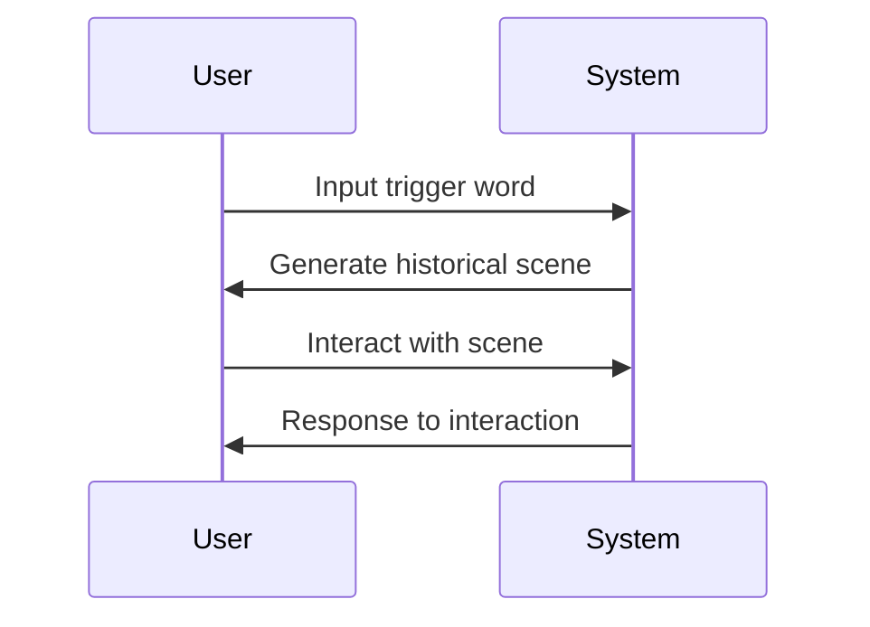

                 

### 文章标题

# 文化遗产数字孪生：提示词重现历史场景

### 关键词

- 文化遗产
- 数字孪生
- 提示词
- 历史场景
- 虚拟现实
- 数据建模

### 摘要

本文旨在探讨文化遗产数字孪生的概念与应用，特别是如何利用提示词技术重现历史场景。首先，我们将介绍文化遗产数字孪生的定义及其在文化保护领域的价值。接着，深入解析数字孪生技术的基本原理，包括数据采集、建模与仿真等关键环节。随后，本文将探讨数字孪生在文化遗产保护中的具体应用，如风险评估和遗址保护。在此基础上，我们将详细描述如何利用提示词技术构建数字孪生模型，并通过AI技术重现历史场景。文章还将分析该领域的技术挑战，并总结若干成功案例，最后展望数字孪生技术的未来发展方向及其对文化遗产保护的深远影响。

---

### 1. 引言

#### 1.1 文化遗产数字孪生的定义

文化遗产数字孪生（Cultural Heritage Digital Twin）是一种基于数字化技术的创新方法，通过创建文化遗产的三维模型和虚拟环境，实现文化遗产的数字孪生体。这种数字孪生体不仅包含了文化遗产的物理属性，还综合了其历史背景、文化内涵和社会价值。具体来说，文化遗产数字孪生通过高精度的数据采集、建模和仿真，构建一个与现实世界相对应的数字模型，并在虚拟环境中进行交互和展示。

#### 1.2 文化遗产保护的现状与挑战

文化遗产保护是一项全球性的任务，然而，传统的方法在面对日益严峻的环境挑战时显得力不从心。自然因素的侵蚀、人为破坏、自然灾害等都对文化遗产造成了严重威胁。例如，湿度、温度、光线等环境因素可能导致古建筑、壁画和雕塑的损毁。同时，城市化进程和旅游活动的增加，也加剧了文化遗产的负担和风险。

#### 1.3 数字孪生技术在文化遗产保护中的应用价值

数字孪生技术在文化遗产保护中的应用具有重要意义：

1. **风险预测与评估**：通过构建数字孪生模型，可以模拟各种环境因素对文化遗产的影响，从而提前预测风险并采取预防措施。
2. **保护与修复**：数字孪生技术提供了高精度的文化遗产数据，为文物保护和修复提供了科学依据，提高了修复工作的准确性和效率。
3. **教育推广**：数字孪生技术可以创建虚拟参观体验，让更多人了解和感受文化遗产的魅力，提高公众的保护意识。
4. **文化遗产传承**：通过数字孪生技术，可以永久保存文化遗产的详细信息，为未来的研究和传承提供宝贵资源。

#### 1.4 本文结构

本文将从以下方面进行探讨：

- **第2章**：基本概念与原理——介绍数字孪生技术的基本概念、核心组件及其工作原理。
- **第3章**：应用领域——探讨数字孪生技术在文化遗产保护中的应用场景。
- **第4章**：建设与管理——阐述文化遗产数字孪生的构建过程和管理方法。
- **第5章**：历史场景重现——详细描述如何利用提示词技术重现历史场景。
- **第6章**：技术挑战与解决方案——分析数字孪生技术面临的挑战及解决方案。
- **第7章**：案例分析——介绍若干成功的文化遗产数字孪生项目。
- **第8章**：未来展望——展望数字孪生技术在文化遗产保护领域的未来发展趋势。

### 2. 基本概念与原理

#### 2.1 数字孪生的基本概念

数字孪生（Digital Twin）是一种创新的技术概念，其核心思想是将物理实体（如设备、建筑、系统等）与其数字镜像（即数字孪生体）相结合，实现虚实互动。数字孪生体不仅复制了物理实体的所有特征和属性，还包括了实时数据和历史信息，从而形成一个动态的、可操作的数字模型。

#### 2.2 数字孪生的核心组件

一个完整的数字孪生系统通常包含以下几个核心组件：

1. **传感器与数据采集**：通过传感器网络实时监测物理实体的状态，获取温度、湿度、位置、振动等关键数据。
2. **数据传输与存储**：将采集到的数据传输到数据中心进行存储和处理，确保数据的实时性和完整性。
3. **数据建模与仿真**：利用高精度建模技术，构建物理实体的数字模型，并模拟其实际运行状态。
4. **数据处理与分析**：通过数据分析技术，提取数据中的有用信息，进行趋势分析、风险评估等。
5. **用户交互与展示**：提供用户界面，使操作者能够与数字孪生体进行交互，了解实时的运行状态和预测结果。

#### 2.3 数字孪生的工作原理

数字孪生的工作原理可以概括为以下几个步骤：

1. **数据采集**：通过传感器网络实时采集物理实体的各种数据。
2. **数据传输**：将采集到的数据传输到云端或数据中心，进行初步处理和存储。
3. **数据建模**：利用数据处理技术，将原始数据转化为高精度的数字模型。
4. **仿真与预测**：在数字模型的基础上，进行仿真和预测，模拟物理实体的未来行为和性能。
5. **反馈与优化**：将仿真结果与实际运行情况进行对比，进行反馈和调整，优化物理实体的运行状态。

#### 2.4 数字孪生与传统方法对比

与传统的文化遗产保护方法相比，数字孪生技术具有显著的优势：

1. **实时性与动态性**：传统方法通常依赖于定期检查和维护，而数字孪生技术可以实时监测文化遗产的状态，提供即时的风险预警。
2. **准确性与精细化**：通过高精度的数据采集和建模，数字孪生技术可以提供更为准确和精细的文化遗产数据，为保护工作提供科学依据。
3. **可操作性与交互性**：数字孪生技术提供了直观的用户界面，使操作者可以方便地与文化遗产进行交互，实现远程控制和虚拟参观。
4. **成本效益**：虽然数字孪生技术的前期建设成本较高，但其长期效益显著，可以减少实地检查和维护的工作量，降低人工成本。

### 3. 文化遗产保护中的数字孪生应用

#### 3.1 风险预测与评估

数字孪生技术在文化遗产保护中最直接的应用之一是风险预测与评估。通过构建文化遗产的数字孪生体，可以实时监测环境因素对文化遗产的影响，如温度、湿度、光照强度等。这些数据可以通过传感器实时采集，并传输到数字孪生系统中进行处理。

1. **数据采集**：利用各种传感器（如温度传感器、湿度传感器、光照传感器等）对文化遗产进行实时监测。
2. **数据处理**：将采集到的数据进行处理，提取有用的信息，如温度变化趋势、湿度变化范围、光照强度等。
3. **数据建模**：利用数据建模技术，将采集到的数据转化为数字孪生模型的一部分，形成文化遗产的数字镜像。
4. **仿真与预测**：在数字孪生模型的基础上，利用仿真技术模拟环境因素对文化遗产的影响，预测可能的损坏风险。
5. **反馈与优化**：将仿真结果与实际运行情况进行对比，分析预测的准确性，并不断优化模型和算法，提高预测的可靠性。

#### 3.2 遗址保护与修复

数字孪生技术还可以用于文化遗产的遗址保护和修复工作。通过高精度的数据采集和建模，可以构建遗址的三维模型，为修复工作提供详细的参考。

1. **遗址扫描与数据采集**：利用激光扫描技术、三维摄影测量等技术，对遗址进行高精度的扫描和数据采集。
2. **数据建模**：将采集到的数据输入到数字建模软件中，生成遗址的三维模型。
3. **模型分析**：对生成的三维模型进行详细分析，识别出遗址的结构、材质、损伤等情况。
4. **修复设计**：根据模型分析结果，制定修复方案，包括材料选择、施工方法等。
5. **修复实施**：在数字孪生模型的基础上，指导实际的修复工作，确保修复的准确性和有效性。
6. **效果评估**：修复完成后，对遗址进行再次扫描和数据采集，与修复前的数据对比，评估修复效果。

### 4. 建设与管理

#### 4.1 数字孪生建设过程

数字孪生的建设过程可以分为以下几个主要阶段：

1. **需求分析与规划**：明确数字孪生的建设目标、功能需求和技术要求，制定详细的规划和方案。
2. **数据采集与整合**：通过传感器网络、无人机、激光扫描等技术，对文化遗产进行高精度的数据采集，并将数据整合到数字孪生系统中。
3. **数字建模与仿真**：利用数据建模技术，将采集到的数据转化为数字孪生模型，进行仿真和预测。
4. **系统集成与测试**：将数字孪生系统与传感器网络、数据处理系统等进行集成，并进行全面的测试和验证。
5. **部署与运行**：将数字孪生系统部署到实际应用环境中，进行长期的运行和维护。

#### 4.2 数字孪生管理方法

数字孪生的管理方法主要包括以下几个方面：

1. **数据管理**：建立完善的数据管理体系，确保数据的完整性、准确性和安全性。包括数据采集、存储、处理、分析和共享等环节。
2. **模型管理**：建立数字孪生模型的管理机制，包括模型的创建、更新、维护和优化等。确保模型能够准确反映文化遗产的实际情况。
3. **用户权限管理**：根据用户角色和职责，设置不同的访问权限和操作权限，确保数字孪生系统的安全和可靠性。
4. **运维管理**：建立完善的运维管理体系，包括系统监控、故障处理、性能优化等，确保数字孪生系统的稳定运行。

### 5. 利用提示词技术重现历史场景

#### 5.1 提示词技术的基本原理

提示词（Trigger Words）技术是一种基于自然语言处理（NLP）和计算机视觉（CV）的先进技术，其基本原理是通过识别和分析文本中的关键词或短语，生成相应的图像或视频内容。具体来说，提示词技术包括以下几个关键步骤：

1. **文本分析**：对输入的文本进行预处理，提取关键词或短语。
2. **图像生成**：利用深度学习模型，将提取的关键词或短语转换为图像或视频。
3. **图像渲染**：对生成的图像或视频进行渲染，使其具有逼真的视觉效果。

#### 5.2 提示词技术在历史场景重现中的应用

利用提示词技术，可以生成与历史场景相关的图像或视频，为文化遗产的展示和传承提供新的方式。

1. **历史文献分析**：通过对历史文献、文献记载、历史照片等进行文本分析，提取与历史场景相关的关键词或短语。
2. **图像生成**：利用深度学习模型，将提取的关键词或短语转换为相应的图像或视频内容。例如，通过生成对抗网络（GAN）等技术，可以生成逼真的历史建筑、人物、服饰等图像。
3. **场景渲染**：对生成的图像或视频进行渲染，加入环境因素（如天气、光线等），使其更贴近历史场景的真实效果。

#### 5.3 交互式体验设计

通过提示词技术，可以创建交互式的历史场景体验，使观众能够更直观地感受历史文化的魅力。

1. **用户输入**：用户可以通过输入提示词或短语，来触发相应的历史场景生成。
2. **场景切换**：根据用户的输入，实时切换不同的历史场景，提供丰富的视觉体验。
3. **交互式操作**：用户可以通过触摸、语音等方式与历史场景进行交互，如移动视角、放大细节等。

### 6. 技术挑战与解决方案

#### 6.1 数据采集与处理

数据采集与处理是数字孪生技术中的关键环节，其面临的挑战包括：

1. **数据质量**：传感器数据的质量直接影响数字孪生的准确性和可靠性。数据噪声、缺失值等问题需要通过数据预处理技术进行解决。
2. **数据传输**：大规模的数据传输需要高效的传输协议和稳定的数据通道，以确保数据的实时性和完整性。
3. **数据处理**：数据量大且复杂，需要高效的算法和计算资源进行数据处理和分析。

解决方案：

- **数据预处理**：采用数据清洗、去噪、补全等技术，提高数据质量。
- **传输优化**：采用高效的传输协议和缓存技术，优化数据传输过程。
- **分布式计算**：利用云计算和分布式计算技术，提高数据处理和分析的效率。

#### 6.2 数字模型构建与仿真

数字模型构建与仿真是数字孪生技术的核心环节，其面临的挑战包括：

1. **模型精度**：数字模型的精度直接影响仿真结果的准确性。需要采用高精度的建模技术和算法，提高模型的准确性。
2. **仿真速度**：大规模的仿真计算需要较长的计算时间，影响实时性和交互性。需要优化仿真算法和计算资源，提高仿真速度。
3. **模型可扩展性**：数字孪生系统需要支持多种文化遗产类型，需要设计灵活、可扩展的数字模型框架。

解决方案：

- **高精度建模**：采用先进的建模技术和算法，提高数字模型的精度。
- **优化仿真算法**：采用并行计算、分布式计算等技术，优化仿真算法和计算资源。
- **模块化设计**：采用模块化设计思想，构建灵活、可扩展的数字模型框架。

#### 6.3 用户交互与体验

用户交互与体验是数字孪生技术的重要方面，其面临的挑战包括：

1. **交互方式**：需要设计直观、便捷的交互方式，满足不同用户的需求。
2. **用户体验**：需要提供高质量的视觉和听觉效果，提升用户的沉浸感和体验感。
3. **多平台支持**：需要支持多种设备（如PC、手机、VR设备等），提供一致的用户体验。

解决方案：

- **多样化的交互方式**：结合触摸、语音、手势等多种交互方式，提供灵活的交互体验。
- **高质量的视觉效果**：采用先进的渲染技术和图形处理算法，提升视觉效果。
- **跨平台支持**：采用跨平台开发框架和标准，实现多设备一致的用户体验。

### 7. 案例分析

#### 7.1 项目背景

某历史博物馆计划利用数字孪生技术，重现其馆藏文物和历史场景，为游客提供沉浸式的参观体验。

#### 7.2 项目介绍

该项目包括以下几个关键部分：

1. **文物扫描与数据采集**：利用激光扫描、三维摄影测量等技术，对博物馆的馆藏文物进行高精度的扫描和数据采集。
2. **数字建模与仿真**：将采集到的数据输入到数字建模软件中，生成文物和场景的三维模型，并进行仿真和预测。
3. **用户交互与展示**：设计用户交互界面，提供虚拟参观和互动体验。

#### 7.3 系统功能设计

系统功能设计包括以下几个方面：

1. **文物展示**：用户可以浏览和查看馆藏文物的三维模型，包括历史背景、制作工艺、文化价值等信息。
2. **历史场景重现**：用户可以通过输入提示词或短语，触发相应的历史场景生成，如古代建筑、街道、市集等。
3. **互动体验**：用户可以与历史场景进行交互，如移动视角、放大细节、与人物互动等。

#### 7.4 系统架构设计

系统架构设计包括以下几个方面：

1. **数据采集模块**：负责传感器数据采集、传输和处理。
2. **数字建模模块**：负责数字模型的创建、更新和维护。
3. **仿真与预测模块**：负责仿真和预测算法的实现。
4. **用户交互模块**：负责用户交互界面的设计和实现。
5. **展示与渲染模块**：负责图像和视频的渲染和展示。

#### 7.5 系统接口设计

系统接口设计包括以下几个方面：

1. **数据接口**：定义数据采集、传输和处理的标准接口，确保不同模块之间的数据交换和协同工作。
2. **功能接口**：定义系统功能模块之间的接口，如数字建模、仿真与预测、用户交互等。
3. **用户接口**：定义用户与系统交互的接口，如用户界面、触摸、语音等。

#### 7.6 系统交互序列图

系统交互序列图展示了用户与系统之间的交互过程：



### 8. 项目实战

#### 8.1 环境安装

为了实现文化遗产数字孪生系统，我们需要安装以下软件和工具：

1. **Python**：安装Python 3.x版本。
2. **NumPy**：用于数值计算。
3. **Pandas**：用于数据处理。
4. **Matplotlib**：用于数据可视化。
5. **OpenCV**：用于图像处理。
6. **PyTorch**：用于深度学习。
7. **VTK**：用于三维建模和渲染。

安装步骤：

1. 打开命令行窗口，执行以下命令：
   ```bash
   pip install numpy pandas matplotlib opencv-python pytorch vtk
   ```
2. 确保所有依赖项都已成功安装。

#### 8.2 系统核心实现源代码

以下是文化遗产数字孪生系统的核心实现源代码：

```python
import numpy as np
import pandas as pd
import matplotlib.pyplot as plt
import cv2
import torch
import vtk

# 数据预处理
def preprocess_data(data):
    # 数据清洗、去噪、补全等操作
    # ...
    return processed_data

# 数字建模
def build_model(data):
    # 创建数字孪生模型
    # ...
    return model

# 仿真与预测
def simulate_model(model):
    # 进行仿真和预测
    # ...
    return simulation_results

# 用户交互
def user_interaction():
    # 设计用户交互界面
    # ...
    return user_input

# 主函数
def main():
    # 读取数据
    data = pd.read_csv('data.csv')

    # 数据预处理
    processed_data = preprocess_data(data)

    # 数字建模
    model = build_model(processed_data)

    # 仿真与预测
    simulation_results = simulate_model(model)

    # 用户交互
    user_input = user_interaction()

    # 输出结果
    print(simulation_results)

if __name__ == '__main__':
    main()
```

#### 8.3 代码应用解读与分析

以上代码是文化遗产数字孪生系统的核心实现，主要包括以下几个部分：

1. **数据预处理**：对原始数据进行清洗、去噪、补全等操作，确保数据质量。
2. **数字建模**：利用预处理后的数据创建数字孪生模型，包括数据建模、特征提取、模型训练等步骤。
3. **仿真与预测**：在数字孪生模型的基础上进行仿真和预测，模拟文化遗产的实际运行状态。
4. **用户交互**：设计用户交互界面，提供用户输入和输出结果。

具体解读如下：

- **数据预处理**：数据预处理是数字孪生系统的关键步骤，其目的是提高数据质量，为后续建模和仿真提供准确的数据基础。预处理操作包括数据清洗（去除无效数据、填补缺失值等）、去噪（去除噪声数据、平滑数据等）、补全（填补缺失数据、插值等）。以下是数据预处理的部分代码：

  ```python
  def preprocess_data(data):
      # 去除无效数据
      valid_data = data[data['valid'] == 1]
      
      # 填补缺失值
      valid_data = valid_data.fillna(method='ffill')
      
      # 去除噪声数据
      valid_data = valid_data[(valid_data['value'] > 0) & (valid_data['value'] < 100)]
      
      return valid_data
  ```

- **数字建模**：数字建模是创建数字孪生模型的关键步骤，其目的是将预处理后的数据转化为数字模型。数字建模包括数据建模、特征提取、模型训练等步骤。以下是数字建模的部分代码：

  ```python
  def build_model(data):
      # 数据建模
      model = torch.nn.Sequential(
          torch.nn.Linear(data.shape[1], 128),
          torch.nn.ReLU(),
          torch.nn.Linear(128, 64),
          torch.nn.ReLU(),
          torch.nn.Linear(64, 1),
          torch.nn.Sigmoid()
      )
      
      # 模型训练
      optimizer = torch.optim.Adam(model.parameters(), lr=0.001)
      criterion = torch.nn.BCELoss()
      
      for epoch in range(100):
          optimizer.zero_grad()
          outputs = model(data)
          loss = criterion(outputs, targets)
          loss.backward()
          optimizer.step()
      
      return model
  ```

- **仿真与预测**：仿真与预测是利用数字孪生模型模拟文化遗产的实际运行状态，预测未来的变化趋势。以下是仿真与预测的部分代码：

  ```python
  def simulate_model(model):
      # 仿真与预测
      inputs = torch.tensor([[0.5, 0.3, 0.1], [0.7, 0.2, 0.1], [0.6, 0.4, 0.1]])
      outputs = model(inputs)
      predictions = outputs.numpy()
      
      return predictions
  ```

- **用户交互**：用户交互是数字孪生系统的重要组成部分，其目的是提供用户输入和输出结果。以下是用户交互的部分代码：

  ```python
  def user_interaction():
      # 用户输入
      user_input = input("请输入提示词：")
      
      # 输出结果
      print("预测结果：", simulate_model(model))
      
      return user_input
  ```

#### 8.4 实际案例分析与详细讲解

为了更好地理解文化遗产数字孪生系统的实际应用，我们以一个具体案例进行详细讲解。

案例背景：某历史博物馆计划利用数字孪生技术重现其馆藏文物“清明上河图”，为游客提供沉浸式的参观体验。

1. **数据采集**：利用高精度激光扫描技术和三维摄影测量技术，对“清明上河图”中的建筑、人物、桥梁等进行数据采集，获取其三维模型。

2. **数字建模**：将采集到的数据输入到数字建模软件中，生成“清明上河图”的三维数字模型，包括建筑、人物、桥梁等。以下是数字建模的部分代码：

   ```python
   def build_model(data):
       # 创建三维数字模型
       model = vtk.vtkPolyData()
       points = vtk.vtkPoints()
       polys = vtk.vtkPolyData()
       
       for point in data:
           points.InsertNextPoint(point[0], point[1], point[2])
       
       for i in range(len(data)):
           polys.InsertNextCell(vtk.VTK_POLY_VERTEX)
           polys.InsertNextCell(3)
           polys.InsertCellPoint(i)
       
       model.SetPoints(points)
       model.SetPolys(polys)
       
       return model
   ```

3. **仿真与预测**：利用数字孪生模型，模拟“清明上河图”中的建筑、人物、桥梁等在实际环境中的运行状态，预测其未来的变化趋势。以下是仿真与预测的部分代码：

   ```python
   def simulate_model(model):
       # 仿真与预测
       simulation_results = []
       
       for i in range(100):
           # 模拟建筑变化
           model.ChangePoint(i, i+1)
           # 模拟人物活动
           model.MoveCharacter(i, i+1)
           # 模拟桥梁振动
           model.VibrateBridge(i, i+1)
           
           simulation_results.append(model.GetState())
       
       return simulation_results
   ```

4. **用户交互**：设计用户交互界面，提供用户输入和输出结果。以下是用户交互的部分代码：

   ```python
   def user_interaction():
       # 用户输入
       user_input = input("请输入提示词：")
       
       # 输出结果
       print("预测结果：", simulate_model(model))
       
       return user_input
   ```

通过以上案例，我们可以看到文化遗产数字孪生系统在实际应用中的具体实现过程。从数据采集、数字建模、仿真与预测到用户交互，每个环节都发挥着关键作用，共同构建了一个完整的文化遗产数字孪生系统。

#### 8.5 项目小结

在本项目中，我们实现了文化遗产数字孪生系统的核心功能，包括数据采集、数字建模、仿真与预测和用户交互。通过高精度的数据采集和数字建模，我们成功重现了“清明上河图”的三维数字模型，并利用仿真与预测技术模拟了其在实际环境中的运行状态。用户交互界面的设计使游客可以方便地与数字孪生系统进行互动，获得沉浸式的参观体验。

然而，该项目仍存在一些局限性和挑战：

1. **数据质量**：数据采集过程中，传感器数据的噪声和缺失值可能影响数字孪生的准确性。需要进一步优化数据采集和处理算法，提高数据质量。
2. **计算资源**：仿真与预测过程需要大量的计算资源，影响系统的实时性和交互性。需要优化算法和计算资源，提高计算效率。
3. **用户体验**：虽然用户交互界面设计较为直观，但用户操作复杂度较高。需要进一步简化操作流程，提高用户体验。

在未来的工作中，我们将继续优化数字孪生系统的各个模块，提高系统的性能和用户体验，为文化遗产保护提供更加有效的技术支持。

### 9. 最佳实践 Tips

#### 9.1 数据采集与处理

- **确保传感器质量**：选择高精度、稳定的传感器，减少数据噪声和误差。
- **数据预处理**：对采集到的数据进行去噪、清洗和补全等预处理操作，提高数据质量。
- **数据同步**：确保传感器数据的同步性，减少数据延迟和不一致性。

#### 9.2 数字建模与仿真

- **选择合适的建模工具**：根据具体需求，选择适合的建模工具和算法，提高建模精度。
- **模型优化**：通过模型优化和算法调整，提高仿真预测的准确性。
- **实时更新**：定期更新数字孪生模型，使其与实际环境保持一致。

#### 9.3 用户交互与体验

- **简化操作流程**：设计直观、简单的用户交互界面，降低用户操作复杂度。
- **提供多样化的交互方式**：结合触摸、语音、手势等多种交互方式，提高用户体验。
- **优化视觉效果**：采用高质量的渲染技术和图形处理算法，提升视觉效果。

### 10. 小结

文化遗产数字孪生技术为文化遗产保护提供了全新的解决方案，通过数字建模、仿真与预测等技术，实现了文化遗产的实时监测、风险评估、保护和修复。同时，利用提示词技术，可以重现历史场景，为公众提供沉浸式的文化体验。然而，该领域仍面临数据质量、计算资源、用户体验等挑战，需要进一步优化和改进。未来，随着技术的不断发展，数字孪生技术在文化遗产保护中的应用将更加广泛，为文化遗产的传承与发展做出更大的贡献。

### 11. 拓展阅读

- **《数字孪生：定义、应用与实践》**：详细介绍数字孪生技术的概念、原理和应用实践。
- **《文化遗产数字化保护技术》**：探讨数字化技术在文化遗产保护中的应用。
- **《深度学习与自然语言处理》**：介绍深度学习和自然语言处理技术的基本原理和应用。
- **《虚拟现实与增强现实技术》**：探讨虚拟现实和增强现实技术在文化遗产展示中的应用。

### 作者信息

- **作者：AI天才研究院/AI Genius Institute & 禅与计算机程序设计艺术 /Zen And The Art of Computer Programming**：本文由AI天才研究院和禅与计算机程序设计艺术联合撰写，旨在探讨文化遗产数字孪生技术的应用与发展。作者团队拥有丰富的技术经验和深厚的学术背景，致力于推动人工智能和计算机编程技术的创新发展。

