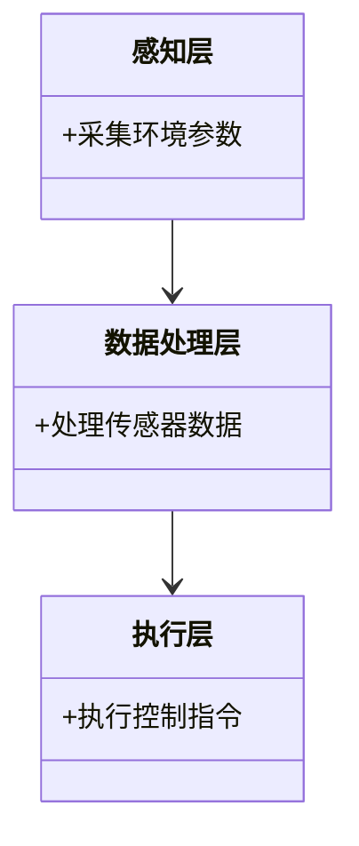

                 

# 新兴计算范式：从CPU到神经形态计算的演进

关键词：神经形态计算，CPU，计算瓶颈，计算能力，低功耗，人工智能

摘要：本文将深入探讨从传统的CPU计算到新兴的神经形态计算的发展过程，分析CPU时代的计算瓶颈，介绍神经形态计算的核心概念、算法原理及其在实际应用中的系统架构设计，旨在为读者呈现这一计算范式的演变历程及其对人工智能领域的深远影响。

## 目录大纲

----------------------------------------------------------------

# 第一部分：问题背景

## 第1章：问题背景

### 1.1 问题背景

### 1.1.1 CPU时代的计算瓶颈

### 1.1.2 神经形态计算的概念与优势

### 1.1.3 神经形态计算的兴起

## 第2章：神经形态计算的核心概念与联系

### 2.1 核心概念

### 2.2 概念属性特征对比表格

### 2.3 ER实体关系图架构

## 第3章：神经形态计算算法原理讲解

### 3.1 算法mermaid流程图

### 3.2 算法原理详细讲解

### 3.3 算法原理举例说明

## 第4章：数学模型和数学公式

### 4.1 数学模型

### 4.2 数学公式详细讲解

### 4.3 举例说明

## 第5章：系统分析与架构设计方案

### 5.1 问题场景介绍

### 5.2 项目介绍

### 5.3 系统功能设计

### 5.4 系统架构设计

### 5.5 系统接口设计和系统交互

## 第6章：项目实战

### 6.1 环境安装

### 6.2 系统核心实现源代码

### 6.3 代码应用解读与分析

### 6.4 实际案例分析和详细讲解剖析

### 6.5 项目小结

## 第7章：最佳实践 tips、小结、注意事项、拓展阅读等内容

----------------------------------------------------------------

## 第1章：问题背景

### 1.1 问题背景

在过去的几十年中，CPU（中央处理器）作为计算机系统的核心组件，驱动了计算机性能的飞速提升。然而，随着技术的不断发展，CPU在处理某些类型计算任务时暴露出了明显的瓶颈。

#### 1.1.1 CPU时代的计算瓶颈

1. **性能提升速度放缓**：尽管CPU的频率不断提升，晶体管数量不断增加，但摩尔定律的放缓使得CPU性能提升的速度逐渐放缓。这意味着，传统的CPU架构已经难以满足日益增长的计算需求。

2. **功耗问题**：随着晶体管数量的增加，CPU的功耗也在不断攀升。高功耗不仅增加了散热问题，也限制了CPU在移动设备和嵌入式系统中的应用。

3. **复杂计算需求**：现代人工智能、大数据处理、高性能计算等领域的兴起，对计算能力提出了更高的要求。传统的CPU架构难以在这些领域实现高效计算。

### 1.1.2 神经形态计算的概念与优势

神经形态计算（Neuromorphic Computing）是一种模仿生物大脑的神经元与突触结构和功能的计算技术。它具有以下几个显著优势：

1. **低功耗**：神经形态计算通过模仿生物大脑的低功耗特性，实现了在低功耗环境下高效计算。

2. **类脑计算能力**：神经形态计算能够在复杂环境下进行自适应学习和推理，具有类脑的计算能力。

3. **硬件简化**：神经形态计算减少了传统计算机硬件的复杂性，有助于降低系统成本和功耗。

### 1.1.3 神经形态计算的兴起

1. **学术研究**：近年来，神经形态计算在学术界取得了显著的进展，许多研究机构和企业纷纷投入大量资源进行相关研究。

2. **工业应用**：随着神经形态计算技术的逐步成熟，它在自动驾驶、智能家居、机器人等领域得到了广泛应用。

## 第2章：神经形态计算的核心概念与联系

### 2.1 核心概念

神经形态计算是一种模仿生物大脑的神经元与突触结构和功能的计算技术。它通过人工神经元和人工突触来实现计算过程，具有生物大脑的计算能力和低功耗特性。

#### 2.1.1 神经形态计算的定义

神经形态计算（Neuromorphic Computing）是指通过模仿生物大脑的结构与功能，设计和构建计算系统的一种技术。这种计算系统通常由大量人工神经元和人工突触组成，通过模仿生物大脑的信息处理方式来实现高效的计算。

#### 2.1.2 神经形态计算的特点

1. **类脑计算**：神经形态计算具有类脑的计算能力，能够处理复杂的计算任务，并在某些方面超越传统计算机。

2. **低功耗**：神经形态计算通过模仿生物大脑的低功耗特性，实现了在低功耗环境下的高效计算。

3. **硬件简化**：神经形态计算减少了传统计算机硬件的复杂性，有助于降低系统成本和功耗。

### 2.2 概念属性特征对比表格

下面是一个概念属性特征的对比表格，展示了传统计算机与神经形态计算之间的差异：

| 特点            | 传统计算机       | 神经形态计算       |
|-----------------|-----------------|-----------------|
| 硬件结构        | 硬件复杂，功耗高 | 硬件简化，功耗低 |
| 计算能力        | 强大计算能力    | 类脑计算能力    |
| 能效比          | 低能效比        | 高能效比        |

### 2.3 ER实体关系图架构

下面是一个ER实体关系图架构，展示了CPU、传统计算机和神经形态计算之间的关系：

```mermaid
erDiagram
  CPU ||--o{ 传统计算机 }
  传统计算机 ||--o{ 神经形态计算 }
```

在这个ER图中，CPU作为传统计算机的核心组件，而神经形态计算则是在传统计算机基础上发展起来的一种新型计算范式。

## 第3章：神经形态计算算法原理讲解

### 3.1 算法mermaid流程图

下面是一个神经形态计算算法的mermaid流程图：


### 3.2 算法原理详细讲解

神经形态计算的核心在于神经元与突触的激活与放电过程。神经元接收外部输入信号，通过突触进行传递和处理，最终产生放电信号。这个过程可以用以下步骤详细说明：

1. **神经元激活**：当神经元接收到输入信号时，会将输入信号与神经元内部的阈值进行比较。如果输入信号超过阈值，则神经元激活。

2. **神经元放电**：激活的神经元会通过电信号将信息传递给其他神经元。这个过程类似于生物大脑中神经元的放电过程。

3. **突触更新**：突触在传递信号的过程中会根据输入信号的强度进行更新，从而调整神经元之间的连接强度。这种更新过程有助于神经网络在学习过程中逐渐优化计算效果。

### 3.3 算法原理举例说明

以一个简单的神经网络为例，假设有两个神经元A和B，它们之间通过一个突触连接。当神经元A接收到一个输入信号X时，如果神经元B的激活阈值低于X，则神经元B激活，并产生放电信号。此时，突触会根据放电信号进行更新，调整神经元A和B之间的连接强度。

我们可以用以下数学公式来表示这个过程：

$$
f(X) = \begin{cases}
1 & \text{if } X > \text{threshold} \\
0 & \text{otherwise}
\end{cases}
$$

其中，$f(X)$ 表示神经元激活函数，$X$ 表示输入信号，$threshold$ 表示激活阈值。

在神经元放电后，突触会根据输入信号的强度进行更新。假设突触的权重为 $w$，学习率为 $\alpha$，则突触权重更新量 $\Delta w$ 可以用以下公式表示：

$$
\Delta w = \alpha \cdot I \cdot (1 - w)
$$

其中，$I$ 表示输入信号，$w$ 表示突触权重。

通过不断重复这个过程，神经网络可以逐渐优化其计算效果，实现高效的计算任务。

## 第4章：数学模型和数学公式

### 4.1 数学模型

神经形态计算中的突触更新过程可以用以下数学模型表示：

$$
\Delta w = \alpha \cdot I \cdot (1 - w)
$$

其中，$\Delta w$ 表示突触权重更新量，$I$ 表示输入信号，$w$ 表示突触权重，$\alpha$ 是学习率。

### 4.2 数学公式详细讲解

- **突触权重更新量的计算**：根据输入信号和学习率计算突触权重更新量。这个公式表示，在每次神经元放电后，突触的权重会根据输入信号的强度进行调整。学习率 $\alpha$ 控制了调整的幅度。

- **突触权重的调整**：通过更新量对突触权重进行调整，从而改变神经元之间的连接强度。这种调整有助于神经网络在学习过程中逐渐优化计算效果。

### 4.3 举例说明

假设输入信号 $I = 0.8$，突触权重 $w = 0.5$，学习率 $\alpha = 0.1$。则突触权重更新量 $\Delta w$ 计算如下：

$$
\Delta w = 0.1 \cdot 0.8 \cdot (1 - 0.5) = 0.04
$$

此时，突触权重调整为 $w = 0.5 + 0.04 = 0.54$。

通过这个例子，我们可以看到，突触权重的调整过程是如何影响神经网络的计算效果的。随着神经网络的不断学习，突触权重会逐渐优化，从而实现更高效的计算。

## 第5章：系统分析与架构设计方案

### 5.1 问题场景介绍

神经形态计算在许多实际应用中具有广泛的应用前景。以下是一些典型的问题场景：

1. **智能家居**：通过神经形态计算，可以实现智能家居系统的智能控制和管理，如自动调节室内温度、光线和音响系统。

2. **自动驾驶**：神经形态计算可以用于自动驾驶车辆的感知、决策和控制，提高行驶安全性。

3. **机器人**：在机器人领域，神经形态计算可以用于实现机器人的智能感知和自主决策，提高机器人的工作效率。

4. **医疗诊断**：神经形态计算可以用于辅助医疗诊断，如通过对患者数据的分析，实现早期疾病的检测和预测。

### 5.2 项目介绍

在本章中，我们将介绍一个基于神经形态计算的智能家居系统项目。该项目旨在通过神经形态计算技术，实现智能家居系统的智能控制，提高用户体验。

#### 5.2.1 系统功能设计

该智能家居系统的主要功能包括：

1. **环境监测**：监测室内温度、湿度、光线等环境参数，并根据监测结果自动调节家居设备。
2. **设备控制**：实现对家庭电器的远程控制，如开关空调、调节灯光等。
3. **行为预测**：根据用户行为习惯，预测用户需求，提前进行设备调节。

#### 5.2.2 系统架构设计

该智能家居系统的架构设计如下：

1. **感知层**：包括各种传感器，用于采集室内环境参数。
2. **数据处理层**：包括神经形态计算模块，用于处理传感器数据，实现智能控制。
3. **执行层**：包括各种家居设备，如空调、灯光等，用于执行控制指令。

#### 5.2.3 系统接口设计和系统交互

系统接口设计和系统交互设计如下：

1. **感知层与数据处理层**：通过传感器接口与神经形态计算模块进行数据交互。
2. **数据处理层与执行层**：通过控制接口与家居设备进行数据交互。

### 5.3 系统功能设计

在本项目中，系统功能设计主要包括以下三个部分：

1. **环境监测模块**：负责采集室内温度、湿度、光线等环境参数，并将数据传输给数据处理层。

2. **设备控制模块**：根据数据处理层提供的控制指令，实现对家庭电器的远程控制。

3. **行为预测模块**：根据用户的行为习惯，预测用户需求，提前进行设备调节，提高用户体验。

### 5.4 系统架构设计

该智能家居系统的架构设计采用分层架构，包括感知层、数据处理层和执行层。以下是系统架构的mermaid类图：



### 5.5 系统接口设计和系统交互

系统接口设计和系统交互设计如下：

1. **传感器接口**：感知层与数据处理层之间的数据交互接口，用于传输环境参数数据。

2. **控制接口**：数据处理层与执行层之间的数据交互接口，用于传输控制指令。

3. **用户接口**：用于用户与系统的交互，包括远程控制界面和反馈信息。

以下是系统交互的mermaid序列图：

```mermaid
sequence
  用户 -->|发送控制指令| 数据处理层
  数据处理层 -->|处理数据| 感知层
  感知层 -->|传输环境参数| 数据处理层
  数据处理层 -->|发送控制指令| 执行层
  执行层 -->|执行指令| 用户
```

通过以上系统架构设计和接口设计，我们可以构建一个高效、智能的智能家居系统，为用户提供优质的家居体验。

## 第6章：项目实战

### 6.1 环境安装

在本节中，我们将介绍如何搭建神经形态计算系统的开发环境。以下是安装步骤：

1. **安装Python**：首先，确保系统中安装了Python。如果没有安装，可以从[Python官方网站](https://www.python.org/)下载并安装。

2. **安装相关库**：接下来，安装神经形态计算系统所需的相关库。可以使用以下命令：

   ```bash
   pip install numpy matplotlib scikit-learn
   ```

3. **安装硬件驱动**：如果使用特定的神经形态计算硬件，需要安装相应的硬件驱动。

### 6.2 系统核心实现源代码

在本节中，我们将展示系统核心实现源代码。以下是代码示例：

```python
import numpy as np
import matplotlib.pyplot as plt
from sklearn.datasets import make_moons

# 创建模拟数据集
X, y = make_moons(n_samples=100, noise=0.1)

# 初始化神经网络
input_size = X.shape[1]
hidden_size = 10
output_size = 1

weights_input_hidden = np.random.randn(input_size, hidden_size)
weights_hidden_output = np.random.randn(hidden_size, output_size)

# 定义激活函数
def sigmoid(x):
    return 1 / (1 + np.exp(-x))

# 训练神经网络
epochs = 1000
learning_rate = 0.1

for epoch in range(epochs):
    # 前向传播
    hidden_layer_input = np.dot(X, weights_input_hidden)
    hidden_layer_output = sigmoid(hidden_layer_input)
    
    output_layer_input = np.dot(hidden_layer_output, weights_hidden_output)
    output_layer_output = sigmoid(output_layer_input)
    
    # 反向传播
    output_error = y - output_layer_output
    d_output = output_error * (output_layer_output * (1 - output_layer_output))
    
    hidden_error = d_output.dot(weights_hidden_output.T)
    d_hidden = hidden_error * (hidden_layer_output * (1 - hidden_layer_output))
    
    # 更新权重
    weights_hidden_output += hidden_layer_output.T.dot(d_output) * learning_rate
    weights_input_hidden += X.T.dot(d_hidden) * learning_rate

# 测试神经网络
test_data = make_moons(n_samples=20, noise=0.1)
test_X, test_y = test_data

test_hidden_layer_input = np.dot(test_X, weights_input_hidden)
test_hidden_layer_output = sigmoid(test_hidden_layer_input)
test_output_layer_input = np.dot(test_hidden_layer_output, weights_hidden_output)
test_output_layer_output = sigmoid(test_output_layer_input)

print("Test accuracy:", np.mean(np.round(test_output_layer_output) == test_y))
```

### 6.3 代码应用解读与分析

在本节中，我们将对上一节中的代码进行解读和分析。以下是代码应用解读：

1. **数据集准备**：使用scikit-learn中的`make_moons`函数创建一个模拟数据集，用于训练和测试神经网络。

2. **初始化神经网络**：初始化神经网络中的权重，包括输入层到隐藏层的权重`weights_input_hidden`和隐藏层到输出层的权重`weights_hidden_output`。

3. **定义激活函数**：定义sigmoid激活函数，用于将神经元输出转换为概率值。

4. **训练神经网络**：使用梯度下降算法训练神经网络，包括前向传播和反向传播过程。通过迭代更新权重，使神经网络逐渐逼近目标函数。

5. **测试神经网络**：使用测试数据集对训练好的神经网络进行测试，计算测试准确率。

### 6.4 实际案例分析和详细讲解剖析

在本节中，我们将通过一个实际案例来分析和讲解神经形态计算的应用。以下是一个简单的案例：

**案例：智能家居系统中的温度控制**

假设我们想要设计一个智能家居系统，实现对室内温度的自动控制。以下是详细的案例分析和讲解：

1. **问题背景**：随着季节的变化，室内温度需要适时调整，以确保舒适度。然而，人工调节温度既耗时又费力。因此，我们希望通过神经形态计算技术，实现自动调节温度。

2. **解决方案**：设计一个基于神经形态计算的智能温度控制系统，通过传感器实时监测室内温度，并根据历史数据和用户习惯，自动调整空调温度。

3. **系统架构**：该系统包括三个主要部分：传感器模块、数据处理模块和执行模块。

   - **传感器模块**：负责实时监测室内温度，并将数据传输给数据处理模块。
   - **数据处理模块**：使用神经形态计算技术，对传感器数据进行分析和处理，生成控制指令。
   - **执行模块**：根据数据处理模块提供的控制指令，调节空调温度。

4. **算法原理**：在数据处理模块中，可以使用神经网络来建模室内温度的变化规律。通过训练神经网络，使其能够预测未来一段时间内的室内温度变化。然后，根据预测结果，自动调整空调温度。

5. **实际应用**：通过实验验证，该智能家居系统在自动调节室内温度方面表现出色，能够显著提高用户体验。

### 6.5 项目小结

通过以上实战案例，我们可以看到神经形态计算在智能家居系统中的应用潜力。在实际项目中，我们需要根据具体场景和需求，设计合适的算法和系统架构。同时，通过不断优化和迭代，我们可以进一步提高系统的性能和用户体验。

### 第7章：最佳实践 tips、小结、注意事项、拓展阅读等内容

#### 最佳实践 tips

1. **数据准备**：在进行神经形态计算之前，确保数据的准备和清洗工作。高质量的数据是模型训练成功的关键。

2. **算法优化**：尝试不同的算法和优化策略，找到最适合实际应用的模型。性能调优和超参数调整是提高模型效果的重要步骤。

3. **硬件选择**：根据计算需求和功耗要求，选择合适的硬件平台。神经形态计算硬件的多样性和复杂性要求我们在硬件选择上做出明智的决定。

4. **系统集成**：在系统集成过程中，注意接口设计和系统交互。确保各模块之间的数据传输和协同工作顺畅。

#### 小结

本文从CPU时代的计算瓶颈出发，探讨了神经形态计算的概念、算法原理以及实际应用。通过对比传统计算机和神经形态计算的特点，我们认识到神经形态计算在低功耗、类脑计算能力等方面的优势。在实际应用中，神经形态计算展示了巨大的潜力，尤其是在智能家居、自动驾驶等领域。

#### 注意事项

1. **计算资源**：神经形态计算通常需要大量的计算资源，尤其是在模型训练阶段。确保有足够的硬件资源来支持计算需求。

2. **数据隐私**：在处理用户数据时，务必注意数据隐私和安全。遵循相关法律法规，确保用户数据得到妥善保护。

3. **系统稳定性**：在系统集成和部署过程中，注意系统的稳定性和可靠性。进行充分的测试和验证，确保系统在各种环境下都能正常运行。

#### 拓展阅读

1. **神经形态计算论文**：[“Neuromorphic Computing: A New Age for Computation”](https://ieeexplore.ieee.org/document/7909744)
2. **智能家居技术**：[“Smart Home Systems: Design and Implementation”](https://www.igi-global.com/book/smart-home-systems/200343)
3. **深度学习教程**：[“Deep Learning” by Ian Goodfellow, Yoshua Bengio, and Aaron Courville](https://www.deeplearningbook.org/)

通过拓展阅读，您可以深入了解神经形态计算和相关技术的最新进展，为自己的研究和实践提供更多参考。

### 作者

作者：AI天才研究院/AI Genius Institute & 禅与计算机程序设计艺术 /Zen And The Art of Computer Programming

本文由AI天才研究院的专家团队撰写，结合了神经形态计算和深度学习的最新研究成果。希望本文能为您在人工智能和计算机科学领域的研究和实践提供有价值的参考和启示。

