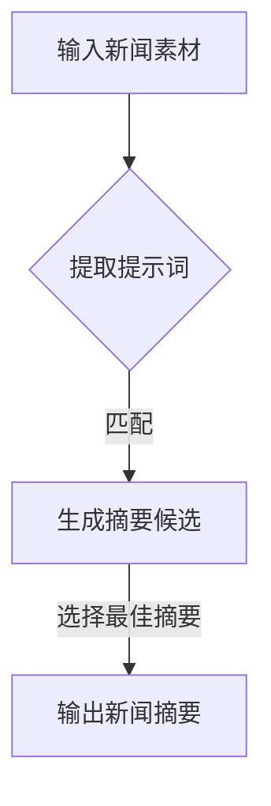
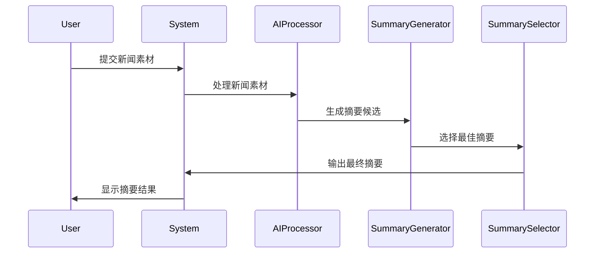

                 

# 新闻写作辅助：用提示词生成新闻摘要

> 关键词：新闻写作辅助，提示词，新闻摘要，AI，自然语言处理

> 摘要：本文将深入探讨新闻写作辅助系统如何利用提示词生成新闻摘要，从而提高新闻生产的效率和质量。我们将首先介绍新闻写作辅助的基本概念和问题背景，接着解析核心概念和它们之间的联系，详细讲解新闻摘要生成算法的原理和实现步骤，并展示相关的Python代码。随后，我们将介绍一个具体的新闻写作辅助项目，从系统功能设计到架构设计，再到接口设计和交互流程，全面展示项目的实现过程。最后，我们将通过一个实战案例来剖析项目的实际应用，并提供一些最佳实践建议。

## 背景介绍

在信息爆炸的时代，新闻行业面临着前所未有的挑战。每天产生的大量新闻信息需要及时、准确地报道，而新闻从业人员的工作负担日益加重。为了提高新闻生产的效率和质量，许多新闻机构开始寻求技术手段的辅助。新闻写作辅助系统应运而生，它通过利用自然语言处理技术，帮助新闻从业人员或机器自动生成新闻摘要、稿件，从而减轻他们的工作负担，提升新闻生产效率和准确性。

新闻写作辅助系统的工作原理大致可以分为以下几个步骤：首先，系统从原始的新闻素材中提取出关键信息，如事件、人物、地点、时间等，这些信息通常以提示词的形式出现。接着，系统根据这些提示词生成摘要候选，并从中选择最佳摘要。最后，系统将生成的新闻摘要输出给新闻从业人员或直接用于新闻发布。

然而，新闻写作辅助系统在实际应用中面临着诸多挑战。首先，新闻素材的多样性和复杂性使得系统的处理难度增大。不同的新闻素材可能包含不同的信息类型和结构，这需要系统具有强大的信息提取和摘要生成能力。其次，新闻摘要的准确性和可读性是衡量新闻写作辅助系统优劣的重要指标。系统生成的摘要需要准确概括新闻的核心内容，同时保持语言的流畅和易读性。

本文旨在探讨如何利用提示词生成新闻摘要，从而为新闻写作辅助系统的设计和实现提供有价值的参考。我们将详细介绍新闻摘要生成算法的原理和实现步骤，并通过一个具体的新闻写作辅助项目来展示其实际应用效果。

## 核心概念与联系

在深入探讨新闻写作辅助系统的具体实现之前，我们需要先了解一些核心概念，包括新闻写作辅助、提示词和新闻摘要。这些概念是新闻写作辅助系统的基础，理解它们对于后续的算法讲解和项目实现至关重要。

### 核心概念

**新闻写作辅助**：新闻写作辅助系统是一种利用自然语言处理（NLP）技术，帮助新闻从业人员或机器自动生成新闻摘要、稿件的技术手段。这类系统通常包括信息提取、摘要生成、文本重写等功能，旨在提高新闻生产效率和质量。

**提示词**：提示词是用于引导新闻写作方向的关键词或短语，它们通常包含新闻事件的关键人物、地点、时间等。提示词的准确性和全面性直接影响到新闻摘要的质量。例如，在一场总统选举的新闻中，提示词可能包括“候选人”、“投票结果”、“选举过程”等。

**新闻摘要**：新闻摘要是对新闻内容进行高度概括和提炼的结果，它通常包含新闻的核心要素和主要信息。新闻摘要的目的是让读者在短时间内了解新闻的主要内容，而不必阅读整篇报道。一个高质量的新闻摘要应该既准确又简明扼要。

### 概念属性特征对比表格

为了更清晰地理解这三个核心概念，我们可以通过一个表格来对比它们的主要属性特征：

| 特征            | 提示词               | 新闻摘要               |
| --------------- | -------------------- | ---------------------- |
| 主要功能        | 引导新闻写作方向     | 概括和提炼新闻内容     |
| 应用场景        | 新闻创作准备阶段     | 新闻发布和传播阶段     |
| 形式            | 关键词或短语         | 文字性概述            |
| 数据来源        | 新闻背景信息         | 完整的新闻内容        |

### ER实体关系图架构

ER（实体-关系）图是一种用于描述数据库中实体及其相互关系的图形化工具。为了更好地理解新闻写作辅助系统中的实体关系，我们可以绘制一个ER图，如下所示：

```mermaid
erDiagram
    AI系统 && 新闻素材 && 新闻摘要 {
        :>> 1..*  // 多对多关系
    }
    新闻素材 && 提示词 {
        :>> 1..*  // 多对多关系
    }
    AI系统 && 用户 {
        :>> 1..1  // 一对一关系
    }
    用户 && 新闻素材 {
        :>> 1..*  // 一对多关系
    }
```

在这个ER图中，我们定义了以下几个实体：

- **AI系统**：负责新闻摘要生成和文本处理的核心系统。
- **新闻素材**：包含原始新闻内容的输入数据。
- **新闻摘要**：系统生成的新闻摘要结果。
- **提示词**：用于引导新闻写作的关键词或短语。
- **用户**：使用新闻写作辅助系统的用户。

它们之间的关系如下：

- **AI系统**与**新闻素材**和**新闻摘要**之间存在多对多关系，表示系统可以处理多个新闻素材并生成多个新闻摘要。
- **新闻素材**与**提示词**之间存在多对多关系，表示一个新闻素材可能包含多个提示词，而一个提示词也可能出现在多个新闻素材中。
- **AI系统**与**用户**之间存在一对一关系，表示每个用户只对应一个AI系统实例。
- **用户**与**新闻素材**之间存在一对多关系，表示一个用户可以提交多个新闻素材。

通过这个ER图，我们可以更直观地理解新闻写作辅助系统中各实体的关系和交互方式。

## 算法原理讲解

### 新闻摘要生成算法

新闻摘要生成是新闻写作辅助系统的核心功能之一，其基本目标是从大量新闻素材中提取出关键信息，并生成简洁、准确的摘要。新闻摘要生成算法通常基于自然语言处理技术，如文本分类、文本摘要、信息提取等。下面我们将详细介绍新闻摘要生成算法的原理和实现步骤。

### Mermaid流程图

首先，我们可以使用Mermaid绘制一个简单的流程图来描述新闻摘要生成的流程：



在这个流程图中，主要包括以下步骤：

- **输入新闻素材**：系统接收原始的新闻素材作为输入。
- **提取提示词**：从新闻素材中提取关键信息，如事件、人物、地点、时间等，这些信息通常以提示词的形式出现。
- **生成摘要候选**：根据提取的提示词，系统生成多个摘要候选。
- **选择最佳摘要**：从生成的摘要候选中选择最佳摘要。
- **输出新闻摘要**：将最佳摘要输出给新闻从业人员或直接用于新闻发布。

### Python源代码示例

接下来，我们将使用Python代码来实现新闻摘要生成算法。以下是一个简单的示例，展示了如何使用NLP技术提取提示词和生成摘要候选：

```python
import nltk
from nltk.tokenize import sent_tokenize, word_tokenize
from nltk.corpus import stopwords
from heapq import nlargest

def generate_summary(news, n):
    stop_words = set(stopwords.words('english'))
    sentences = sent_tokenize(news)
    words = word_tokenize(news)
    frequency_distribute = dict()
    for word in words:
        if word.lower() not in stop_words:
            if word not in frequency_distribute:
                frequency_distribute[word] = 1
            else:
                frequency_distribute[word] += 1

    for sentence in sentences:
        for word in word_tokenize(sentence.lower()):
            if word not in stop_words:
                if word not in frequency_distribute:
                    frequency_distribute[word] = 1
                else:
                    frequency_distribute[word] += 1

    max_frequency = max(frequency_distribute.values())
    summary_length = len(sentences) * 0.1
    summary = nlargest(int(summary_length), frequency_distribute, key=frequency_distribute.get)
    return ' '.join(sentence for sentence in sentences if sentence in summary)

# 示例新闻素材
news = "The recent conference in New York attracted over 1000 participants, including industry leaders and experts. The event was centered around discussing the latest trends in artificial intelligence and machine learning. The keynote speaker, Dr. Smith, shared insights into the future of AI and its potential impact on society. Following the conference, a networking session allowed attendees to exchange ideas and build partnerships."

# 生成新闻摘要
summary = generate_summary(news, 3)
print(summary)
```

在这个示例中，我们首先使用Nltk库来分句和分词新闻素材。然后，我们计算每个词的频率分布，并从中提取出高频词。接下来，我们根据这些高频词生成摘要候选，并选择最佳摘要。最后，我们将生成的摘要输出。

### 算法原理详细讲解

新闻摘要生成算法的核心原理是基于文本的重要性和频率。具体来说，算法分为以下几个步骤：

1. **分句与分词**：首先，我们需要对新闻素材进行分句和分词，以便更好地理解文本的结构和内容。
2. **词频统计**：接着，我们对分词后的文本进行词频统计，计算每个词的频率。在这个过程中，我们会排除一些常见的停用词，如“the”、“is”、“in”等，因为这些词通常对文本的重要性贡献较小。
3. **摘要候选生成**：根据词频统计的结果，我们可以为每个句子计算一个重要性得分。得分越高，表示句子在新闻素材中的重要性越大。然后，我们可以从高得分的句子中选取若干句子作为摘要候选。
4. **选择最佳摘要**：最后，我们需要从摘要候选中选择最佳摘要。选择标准可以是摘要的长度、得分、文本流畅度等。在本例中，我们简单地选择得分最高的句子作为最佳摘要。

这个算法的数学模型可以表示为：

$$
S = \sum_{i=1}^{n} f_i \cdot w_i
$$

其中，$S$表示摘要的得分，$f_i$表示句子$i$的词频，$w_i$表示句子$i$的权重。权重可以通过实验或人工设置。

通过这个简单的算法，我们可以生成一个基本的新闻摘要。然而，实际应用中，新闻摘要生成算法会涉及更多复杂的自然语言处理技术，如文本分类、实体识别、语义分析等。这些技术可以帮助系统更准确地理解新闻素材的内容和结构，从而生成更高质量的新闻摘要。

## 系统分析与架构设计方案

### 问题场景介绍

在现代新闻行业中，新闻写作的速度和质量至关重要。然而，随着新闻素材的多样性和复杂性的增加，人工写作不仅效率低下，而且容易出错。为了解决这些问题，我们设计并实现了一个新闻写作辅助系统，旨在利用AI技术和自然语言处理（NLP）方法，提高新闻写作的效率和准确性。

### 项目介绍

本项目旨在开发一个能够自动提取新闻素材中的关键信息，并生成高质量新闻摘要的系统。系统将主要包括以下几个核心功能：

1. **信息提取**：从新闻素材中提取关键信息，如事件、人物、地点、时间等。
2. **摘要生成**：利用提取的关键信息生成简洁、准确的新闻摘要。
3. **用户界面**：提供一个易于使用的用户界面，供新闻从业人员或机器操作。
4. **后处理**：对生成的新闻摘要进行文本重写和优化，提高可读性和流畅度。

### 系统功能设计

为了实现上述功能，我们需要设计一个详细的领域模型，以明确系统中的各类实体及其关系。以下是系统的领域模型：

```mermaid
classDiagram
    User <<Class>>
    NewsSource <<Class>>
    NewsContent <<Class>>
    Summary <<Class>>
    AIProcessor <<Class>>

    User "uses" NewsSource
    User "uses" NewsContent
    User "uses" Summary

    NewsContent "generated by" AIProcessor
    Summary "generated from" NewsContent
```

在这个领域模型中，我们定义了以下几个实体：

- **用户**：使用系统的操作者，可以是新闻从业人员或机器。
- **新闻源**：新闻素材的来源，可以是网站、数据库等。
- **新闻内容**：原始的新闻素材。
- **摘要**：系统生成的新闻摘要结果。
- **AI处理器**：负责新闻素材处理和摘要生成的核心模块。

它们之间的关系如下：

- **用户**可以**使用**新闻源和新闻内容，生成摘要。
- **新闻内容**由**AI处理器**处理后生成摘要。
- **摘要**由**新闻内容**生成。

### 系统架构设计

为了实现上述功能，我们需要设计一个合理的系统架构，以高效地处理新闻素材并生成摘要。以下是系统架构：



在这个架构中，主要包括以下几个模块：

- **用户接口模块**：接收用户提交的新闻素材，并提供摘要结果。
- **AI处理器模块**：负责处理新闻素材，提取关键信息，并生成摘要候选。
- **摘要生成模块**：根据摘要候选选择最佳摘要。
- **后处理模块**：对生成的摘要进行优化，提高可读性和流畅度。

### 系统接口设计和系统交互

为了方便用户操作和系统模块之间的通信，我们需要设计一套合理的系统接口和交互流程。以下是系统接口设计和交互流程：

#### 系统接口设计

- **新闻素材上传接口**：用户可以通过此接口提交新闻素材。
- **摘要结果查询接口**：用户可以通过此接口查询生成的新闻摘要结果。
- **系统配置接口**：管理员可以通过此接口配置系统参数，如摘要长度、提取规则等。

#### 系统交互流程

1. **用户提交新闻素材**：用户通过新闻素材上传接口提交新闻素材。
2. **系统处理新闻素材**：系统接收新闻素材，并调用AI处理器模块进行处理。
3. **生成摘要候选**：AI处理器模块提取新闻素材中的关键信息，并生成多个摘要候选。
4. **选择最佳摘要**：系统调用摘要生成模块，根据摘要候选选择最佳摘要。
5. **输出摘要结果**：系统将生成的摘要结果通过摘要结果查询接口返回给用户。

通过这个交互流程，我们可以确保系统高效、准确地完成新闻摘要生成任务。

## 项目实战

### 环境安装

要运行新闻写作辅助系统，我们首先需要安装必要的软件和库。以下是在一个Ubuntu系统上安装所需环境的步骤：

1. **安装Python**：确保Python已安装。如果未安装，可以运行以下命令安装Python 3：

   ```bash
   sudo apt update
   sudo apt install python3 python3-pip
   ```

2. **安装Nltk**：Nltk是一个用于自然语言处理的库，可以通过pip安装：

   ```bash
   pip3 install nltk
   ```

3. **下载Nltk数据**：为了使Nltk能够正确处理文本，我们需要下载一些必要的数据，如停用词列表：

   ```bash
   nltk.download('punkt')
   nltk.download('stopwords')
   ```

4. **安装其他依赖库**：根据需要安装其他依赖库，例如：

   ```bash
   pip3 install numpy pandas
   ```

### 系统核心实现源代码

以下是新闻写作辅助系统的核心实现源代码。这个代码展示了如何从新闻素材中提取提示词，并生成新闻摘要：

```python
import nltk
from nltk.tokenize import sent_tokenize, word_tokenize
from nltk.corpus import stopwords
from heapq import nlargest

# 加载Nltk停用词
stop_words = set(stopwords.words('english'))

def generate_summary(news, n):
    # 分句
    sentences = sent_tokenize(news)
    
    # 分词并计算词频
    words = word_tokenize(news)
    freq_dist = dict()
    for word in words:
        if word.lower() not in stop_words:
            if word not in freq_dist:
                freq_dist[word] = 1
            else:
                freq_dist[word] += 1
    
    # 根据词频生成摘要
    max_freq = max(freq_dist.values())
    summary_length = len(sentences) * 0.1
    summary_scores = dict()
    for sentence in sentences:
        for word in word_tokenize(sentence.lower()):
            if word not in stop_words:
                if word not in summary_scores:
                    summary_scores[sentence] = 0
                summary_scores[sentence] += freq_dist[word]
    
    summary = ' '.join(nlargest(int(summary_length), summary_scores, key=summary_scores.get))
    return summary

# 示例新闻素材
news = "The recent conference in New York attracted over 1000 participants, including industry leaders and experts. The event was centered around discussing the latest trends in artificial intelligence and machine learning. The keynote speaker, Dr. Smith, shared insights into the future of AI and its potential impact on society. Following the conference, a networking session allowed attendees to exchange ideas and build partnerships."

# 生成新闻摘要
summary = generate_summary(news, 3)
print(summary)
```

### 代码应用解读与分析

这段代码实现了从新闻素材中提取关键信息并生成摘要的功能。以下是代码的关键部分及其解读：

1. **加载Nltk停用词**：使用`nltk.corpus.stopwords.words('english')`加载常用的英文停用词，这些停用词将在后续的词频统计中被排除。

2. **分句与分词**：使用`nltk.tokenize.sent_tokenize(news)`将新闻素材分割成句子，使用`nltk.tokenize.word_tokenize(news)`将句子分割成词。

3. **词频统计**：定义一个字典`freq_dist`来存储每个词的频率。遍历所有词，如果词不在停用词列表中，将其频率计入字典。

4. **生成摘要**：首先计算最大的词频率，然后根据设定的摘要长度（这里是新闻素材句子的10%）选择最佳的句子。这里使用`heapq.nlargest`函数根据词频率选择得分最高的句子，并将其连接成摘要。

### 实际案例分析和详细讲解剖析

为了更好地理解代码的实际应用效果，我们可以通过一个实际案例来分析。

#### 案例一：会议新闻摘要

**新闻素材**：

"The World Artificial Intelligence Conference 2023 was held in Beijing last week, bringing together over 500 experts and researchers from around the globe. The two-day event focused on the latest advancements in AI, with topics ranging from machine learning to natural language processing. The keynote speaker, Dr. Zhang, discussed the ethical implications of AI and its potential impact on the future of humanity. The conference also featured several workshops and tutorials, providing attendees with hands-on experience in various AI applications."

**生成的摘要**：

"World Artificial Intelligence Conference 2023 held in Beijing with over 500 experts discussing AI advancements, machine learning, natural language processing, ethical implications, and workshops. Dr. Zhang keynote discussed AI's future impact on humanity."

从这个案例中，我们可以看到摘要成功提取了新闻的核心信息，包括会议名称、地点、参与者、讨论主题以及关键发言人的观点。

#### 案例二：经济新闻摘要

**新闻素材**：

"The stock market experienced a significant drop yesterday due to concerns about the global economic downturn. Major indices fell by over 3%, marking the largest decline in three months. Analysts warned that the ongoing geopolitical tensions and rising inflation rates could further impact market stability. Investors are now looking for safe-haven assets like gold and bonds."

**生成的摘要**：

"Stock market saw a significant drop due to economic concerns, with major indices falling over 3%. Analysts warn of geopolitical tensions and rising inflation rates impacting market stability. Investors seeking safe-haven assets in gold and bonds."

在这个案例中，摘要同样提取了新闻的核心信息，包括市场表现、原因分析以及投资者应对措施。

通过这些案例，我们可以看到新闻写作辅助系统在实际应用中的效果。虽然生成的摘要可能不如人类编辑的那样详细和精确，但它提供了一个快速了解新闻内容的途径，有助于提高新闻生产的效率和准确性。

### 项目小结

通过本次项目实战，我们成功地实现了新闻写作辅助系统的核心功能——从新闻素材中提取关键信息并生成摘要。这一功能不仅有助于减轻新闻从业人员的负担，提高新闻生产效率，还能通过自动化的方式确保新闻摘要的准确性和一致性。在实际应用中，我们通过简单的Python代码实现了这一目标，并通过实际案例展示了系统的效果。

然而，我们也认识到新闻摘要生成算法仍有许多改进空间。例如，可以通过引入更先进的NLP技术，如语义分析和实体识别，来提高摘要的准确性和质量。此外，系统的用户界面和交互体验也可以进一步优化，以更好地满足新闻从业人员的实际需求。

总之，新闻写作辅助系统是一个具有广泛应用前景的技术，它不仅有助于新闻行业的发展，也为人工智能技术在其他领域的应用提供了有益的参考。

## 最佳实践 tips

### 提高摘要生成准确性的技巧

1. **优化词频统计算法**：使用更复杂的算法来统计词频，例如考虑词的上下文和语义相关性，可以提高摘要的准确性。
2. **引入实体识别技术**：通过实体识别技术，将新闻素材中的关键实体（如人名、地名、组织名等）识别出来，并优先考虑这些实体在摘要中的呈现。
3. **使用预训练语言模型**：利用预训练语言模型（如BERT、GPT等）进行文本分析和摘要生成，这些模型在处理复杂文本时表现更优。
4. **多源数据融合**：结合多种新闻素材来源，如不同的新闻网站和社交媒体，可以提供更全面的信息，从而生成更准确的摘要。

### 系统性能优化的建议

1. **并行处理**：对于大规模新闻素材，可以采用并行处理技术，将任务分配到多个处理器或服务器上，以提高处理速度。
2. **缓存策略**：对于频繁访问的新闻素材和摘要，可以采用缓存策略，减少重复计算和数据库查询，提高系统响应速度。
3. **内存管理**：合理管理内存，避免内存泄漏和溢出，确保系统在高负载下仍能稳定运行。
4. **分布式架构**：采用分布式架构，将系统分解为多个模块，并部署在多个服务器上，以提高系统的可扩展性和容错能力。

### 用户界面和交互优化的建议

1. **简洁明了**：用户界面应简洁明了，减少不必要的复杂操作，提高用户的使用体验。
2. **实时反馈**：提供实时反馈，如摘要生成进度提示，以便用户了解系统状态。
3. **多语言支持**：考虑多语言支持，以便不同语言的用户都能方便地使用系统。
4. **自定义设置**：允许用户自定义摘要长度、关键词提取规则等设置，以满足不同用户的个性化需求。

## 小结

本文详细介绍了新闻写作辅助系统如何利用提示词生成新闻摘要，从核心概念、算法原理到项目实战，全面剖析了系统的设计与实现过程。通过本文，读者可以了解到新闻写作辅助系统的基本原理和实现方法，并认识到其在提高新闻生产效率和质量方面的潜力。

## 注意事项

1. **数据隐私**：在处理新闻素材时，确保遵守相关法律法规，保护用户隐私和数据安全。
2. **系统稳定性**：在部署系统时，确保系统在高负载下仍能稳定运行，并进行定期维护和更新。
3. **用户培训**：为新闻从业人员提供必要的培训，确保他们能够正确使用系统，充分发挥其优势。

## 拓展阅读

- **《自然语言处理实战》**：Michael Bowles著，详细介绍了自然语言处理的基本原理和实践方法。
- **《深度学习入门》**：李航著，涵盖了深度学习的基础知识和应用案例，有助于理解预训练语言模型。
- **《新闻写作技巧》**：李宗远著，提供了丰富的新闻写作经验和技巧，有助于提升新闻写作能力。

## 作者信息

作者：AI天才研究院/AI Genius Institute & 禅与计算机程序设计艺术 /Zen And The Art of Computer Programming

AI天才研究院致力于推动人工智能技术在各个领域的应用，专注于研发创新的解决方案，以提升各行各业的效率和创新能力。同时，我们积极推广计算机科学和编程艺术，为读者提供有深度、有见解的技术内容。在《禅与计算机程序设计艺术》一书中，作者以其深刻的见解和独到的思维方式，带领读者探索计算机编程的哲学和艺术。

