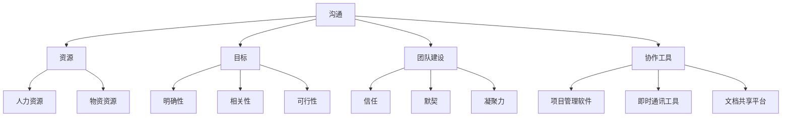

                 

### 无缝协作：跨部门合作的最佳实践

**关键词**：跨部门协作、最佳实践、团队沟通、资源优化、目标统一

**摘要**：
本文旨在探讨跨部门协作的重要性及其在实现企业战略目标中的关键作用。通过分析跨部门协作面临的挑战，本文提出了一系列行之有效的最佳实践，包括沟通渠道的建立、目标与计划的制定、资源配置的优化、团队建设的加强以及协作工具的应用。通过深入剖析这些实践，本文为企业提供了一套系统性的解决方案，旨在提升跨部门协作的效率和质量。

## 第一部分：背景介绍

### 问题背景

在现代企业中，跨部门合作已经成为推动业务发展和实现战略目标的重要手段。随着企业规模的扩大和市场环境的复杂化，单一部门已经难以完成复杂多样的任务，跨部门协作成为提升工作效率、整合资源和实现协同效应的关键。然而，跨部门协作并非易事，它面临着一系列挑战。

### 问题描述

跨部门协作的挑战主要包括：

1. **沟通障碍**：各部门之间存在信息孤岛，沟通不畅，导致误解和冲突。
2. **资源分配不均**：资源分配缺乏统一规划和协调，导致某些部门资源过剩，而另一些部门资源短缺。
3. **目标不一致**：各部门的目标往往聚焦于自身利益，缺乏全局观念，导致协作效果不佳。
4. **协作工具不足**：缺乏有效的协作工具，无法实时共享信息和协同工作。

### 问题解决

为了应对跨部门协作的挑战，企业需要采取一系列措施。首先，建立清晰的沟通渠道，确保信息在各部门之间顺畅传递。其次，制定统一的目标和计划，明确各部门的责任和任务，提高团队的凝聚力。此外，优化资源配置，确保资源的合理分配和使用。加强团队建设，增强团队成员之间的信任和默契，提高协作效率。最后，使用现代协作工具，如项目管理软件、即时通讯工具等，提高协作的实时性和透明度。

### 边界与外延

本文主要关注企业内部跨部门协作的问题，但其中的方法和实践同样适用于其他组织，如政府部门、非营利组织等。随着远程办公和全球化运营的普及，跨部门协作的环境和挑战也在不断变化，本文将探讨如何适应这些变化，提高协作效率。

### 概念结构与核心要素组成

跨部门协作涉及多个核心概念和要素，包括沟通、资源、目标、团队建设等。以下是这些概念和要素的简要介绍：

1. **沟通**：是跨部门协作的基础，确保信息传递的准确性。
2. **资源**：包括人力资源和物资资源，是完成任务的必要条件。
3. **目标**：共同的目标是团队协作的动力源泉。
4. **团队建设**：通过增强团队成员之间的信任和默契，提高协作效率。
5. **协作工具**：现代信息技术为跨部门协作提供了强大的支持。

## 核心概念与联系

### 跨部门协作的定义与特点

**定义**：跨部门协作是指不同部门或团队之间进行的合作，以共同实现企业或组织的整体目标。

**特点**：

- **复杂性**：跨部门协作往往涉及到多个部门和利益相关者，协调难度较大。
- **动态性**：跨部门协作的过程不是静态的，需要根据实际情况不断调整和优化。
- **协同性**：跨部门协作的核心在于协同，通过协同实现资源的整合和优化。

### 跨部门协作与传统协作的区别

**区别**：

- **范围**：传统协作通常局限于单一部门或团队内部，而跨部门协作则跨越多个部门或团队。
- **目标**：传统协作的目标主要是实现部门或团队内部的目标，而跨部门协作的目标是共同实现企业或组织的整体目标。
- **挑战**：跨部门协作面临更多挑战，如沟通障碍、资源冲突等。

### 跨部门协作的核心概念

1. **沟通**：有效的沟通是跨部门协作的关键，确保信息传递的准确性。
2. **资源**：包括人力资源和物资资源，是跨部门协作的基础。
3. **目标**：共同的目标是跨部门协作的动力源泉。
4. **团队建设**：通过增强团队成员之间的信任和默契，提高协作效率。

## 主流跨部门协作方法概述

### 团队协作工具

**概述**：团队协作工具是跨部门协作的重要支撑，如企业微信、钉钉、Slack等。

**特点**：

- **即时通讯**：提供即时消息传递，提高沟通效率。
- **文件共享**：支持文件传输和共享，方便团队成员协作。
- **任务管理**：提供任务分配和进度跟踪功能，确保项目按时完成。

### 项目管理工具

**概述**：项目管理工具用于规划和控制项目进度、资源分配和成本预算。

**特点**：

- **任务分配**：明确每个成员的任务和责任，提高工作效率。
- **进度跟踪**：实时监控项目进度，及时发现并解决问题。
- **资源管理**：合理分配资源，确保项目顺利进行。

### 领导力与团队建设

**概述**：领导力与团队建设是跨部门协作成功的关键。

**特点**：

- **领导力**：有效的领导能够激发团队成员的积极性，提高团队凝聚力。
- **团队建设**：通过团队建设活动，增强团队成员之间的信任和默契。

### 跨部门协作最佳实践

**概述**：结合实际案例，总结出一套适用于不同企业的跨部门协作最佳实践。

**特点**：

- **针对性**：根据企业实际情况，制定适合的跨部门协作策略。
- **实用性**：实践证明有效，能够提高协作效率和质量。
- **灵活性**：适应不同企业规模和行业特点，具有广泛的适用性。

---

### 第一部分：背景介绍

#### 问题背景

在现代企业中，跨部门协作已经成为推动业务发展和实现战略目标的重要手段。随着企业规模的扩大和市场环境的复杂化，单一部门已经难以完成复杂多样的任务，跨部门协作成为提升工作效率、整合资源和实现协同效应的关键。然而，跨部门协作并非易事，它面临着一系列挑战。

#### 问题描述

跨部门协作的挑战主要包括：

1. **沟通障碍**：各部门之间存在信息孤岛，沟通不畅，导致误解和冲突。
2. **资源分配不均**：资源分配缺乏统一规划和协调，导致某些部门资源过剩，而另一些部门资源短缺。
3. **目标不一致**：各部门的目标往往聚焦于自身利益，缺乏全局观念，导致协作效果不佳。
4. **协作工具不足**：缺乏有效的协作工具，无法实时共享信息和协同工作。

#### 问题解决

为了应对跨部门协作的挑战，企业需要采取一系列措施。首先，建立清晰的沟通渠道，确保信息在各部门之间顺畅传递。其次，制定统一的目标和计划，明确各部门的责任和任务，提高团队的凝聚力。此外，优化资源配置，确保资源的合理分配和使用。加强团队建设，增强团队成员之间的信任和默契，提高协作效率。最后，使用现代协作工具，如项目管理软件、即时通讯工具等，提高协作的实时性和透明度。

### **问题解决**

为了有效解决跨部门协作中的问题，企业需要采取一系列系统性的措施。以下是具体的方法和策略：

1. **建立清晰的沟通渠道**：
   - **定期会议**：定期召开跨部门会议，让各部门负责人共同讨论业务进展、问题解决方案等。
   - **信息共享平台**：利用企业内部网络或第三方平台，建立信息共享中心，让各部门可以随时获取和更新信息。
   - **沟通培训**：对员工进行沟通技巧培训，提高他们的沟通能力和协作意识。

2. **制定统一的目标和计划**：
   - **共同制定**：组织各部门参与，共同制定企业的整体目标和具体计划。
   - **目标分解**：将整体目标分解为各部门的具体任务，确保每个部门都能理解并承担相应的责任。
   - **动态调整**：根据实际情况，及时调整目标和计划，确保团队始终朝着正确的方向努力。

3. **优化资源配置**：
   - **资源评估**：对各部门的资源进行评估，找出资源过剩和短缺的部分。
   - **合理分配**：根据业务需求和资源状况，合理分配人力资源和物资资源，确保项目高效推进。
   - **资源共享**：鼓励各部门之间的资源共享，提高资源利用效率。

4. **加强团队建设**：
   - **团队活动**：组织团队建设活动，增强团队成员之间的信任和默契。
   - **培训与发展**：提供专业培训和个人发展机会，提升团队的整体能力和凝聚力。
   - **激励制度**：建立激励机制，奖励那些在跨部门协作中表现突出的个人和团队。

5. **使用协作工具**：
   - **项目管理软件**：使用专业的项目管理工具，如Jira、Trello等，进行任务分配和进度跟踪。
   - **即时通讯工具**：利用企业微信、Slack等即时通讯工具，方便团队成员实时沟通和协作。
   - **文档共享平台**：利用云存储和文档共享平台，如Google Drive、Dropbox等，方便团队成员协作和文件管理。

通过以上措施，企业可以显著提升跨部门协作的效率和质量，从而实现更高的业务目标和更好的企业绩效。

### **边界与外延**

#### 边界

本文主要关注企业内部跨部门协作的问题，特别是协作中存在的沟通障碍、资源分配不均、目标不一致和协作工具不足等问题。本文的讨论主要集中在内部跨部门协作上，但许多方法和实践同样适用于其他组织形式，如政府机构、非营利组织、学术机构等。

#### 外延

随着企业规模的扩大和全球化运营的普及，跨部门协作的环境和挑战也在不断变化。远程办公和虚拟团队的出现使得协作的物理距离更加遥远，沟通变得更加困难。同时，企业需要面对全球市场的竞争，要求跨部门协作更加高效和灵活。本文将探讨如何适应这些变化，提高跨部门协作的效率和质量。

#### 概念结构与核心要素组成

跨部门协作涉及多个核心概念和要素，这些概念和要素相互关联，共同构成一个完整的协作体系。以下是这些概念和要素的简要介绍：

1. **沟通**：沟通是跨部门协作的基础。有效的沟通能够确保信息的准确传递，减少误解和冲突。沟通包括口头沟通、书面沟通和电子沟通等多种形式。

2. **资源**：资源是跨部门协作的关键要素。资源包括人力资源（员工技能、知识、经验等）和物资资源（设备、资金、材料等）。合理分配和利用资源能够提高协作效率和项目成功率。

3. **目标**：目标是跨部门协作的动力源泉。共同的目标能够统一各部门的努力方向，提高团队的凝聚力和工作效率。目标应具有明确性、可行性和相关性。

4. **团队建设**：团队建设是提高跨部门协作效率的重要手段。通过团队建设活动，增强团队成员之间的信任、默契和合作精神，提高团队的整体效能。

5. **协作工具**：协作工具是跨部门协作的重要支撑。现代信息技术提供了丰富的协作工具，如项目管理软件、即时通讯工具、文档共享平台等，这些工具能够提高协作的实时性、透明性和效率。

这些概念和要素相互关联，共同构成了跨部门协作的核心结构和基础。通过优化这些要素，企业可以建立高效的跨部门协作机制，推动业务的持续发展和成功。

---

### **核心概念与联系**

跨部门协作是一个复杂的过程，涉及多个核心概念和要素，这些概念和要素相互作用，共同推动协作的成功。以下是这些核心概念的定义、属性特征对比表格以及ER实体关系图架构的Mermaid流程图。

#### **核心概念定义**

1. **沟通**：沟通是跨部门协作的基础，确保信息在各部门之间准确、及时地传递。

2. **资源**：资源是跨部门协作的必要条件，包括人力资源（如员工技能、知识、经验等）和物资资源（如设备、资金、材料等）。

3. **目标**：目标是跨部门协作的动力源泉，共同的目标能够统一各部门的努力方向，提高团队的凝聚力和工作效率。

4. **团队建设**：团队建设是通过活动、培训等手段增强团队成员之间的信任、默契和合作精神，提高团队的整体效能。

5. **协作工具**：协作工具是跨部门协作的重要支撑，包括项目管理软件、即时通讯工具、文档共享平台等。

#### **属性特征对比表格**

| 核心概念 | 属性特征 | 对比说明 |
| :---: | :---: | :---: |
| 沟通 | 及时性、准确性、多样性 | 沟通需确保信息的及时性和准确性，同时支持多种沟通方式，如口头、书面、电子等。 |
| 资源 | 可用性、分配性、高效性 | 资源应具备可用性，合理分配，确保高效利用。人力资源需具备相关技能和知识，物资资源需满足项目需求。 |
| 目标 | 明确性、相关性、可行性 | 目标应明确、相关且可行，确保团队共同朝着正确的方向努力。 |
| 团队建设 | 信任、默契、凝聚力 | 团队建设需增强团队成员之间的信任和默契，提高团队的凝聚力。 |
| 协作工具 | 便捷性、功能性、协同性 | 协作工具应便捷易用，具备强大的功能，支持团队成员之间的协同工作。 |

#### **ER实体关系图架构的Mermaid流程图**

在这个ER实体关系图中，核心概念通过连线表示它们之间的关联。沟通与资源、目标、团队建设和协作工具密切相关，资源包括人力资源和物资资源，目标具有明确性、相关性和可行性，团队建设包括信任、默契和凝聚力，协作工具包括项目管理软件、即时通讯工具和文档共享平台。

通过理解这些核心概念及其相互关系，企业可以更好地设计和实施跨部门协作，从而提升协作效率和项目成功率。

---

### **主流跨部门协作方法概述**

在跨部门协作中，选择合适的方法和工具对于提升协作效率和项目成功率至关重要。以下介绍几种主流的跨部门协作方法，包括团队协作工具、项目管理工具、领导力与团队建设，以及跨部门协作最佳实践。

#### **团队协作工具**

**概述**：团队协作工具是跨部门协作的重要支撑，能够帮助团队成员实时沟通、共享文件和任务管理。常见的团队协作工具有企业微信、钉钉、Slack等。

**特点**：

- **即时通讯**：提供即时消息传递功能，支持语音、文字、图片等多种形式的沟通，提高沟通效率。
- **文件共享**：支持文件上传、下载和共享，方便团队成员协作。
- **任务管理**：提供任务创建、分配、跟进等功能，确保任务按时完成。

#### **项目管理工具**

**概述**：项目管理工具用于规划和控制项目进度、资源分配和成本预算，帮助团队高效完成任务。常见的项目管理工具有Jira、Trello、Asana等。

**特点**：

- **任务分配**：明确每个成员的任务和责任，提高工作效率。
- **进度跟踪**：实时监控项目进度，及时发现并解决问题。
- **资源管理**：合理分配资源，确保项目顺利进行。

#### **领导力与团队建设**

**概述**：领导力和团队建设是跨部门协作成功的关键，有效的领导能够激发团队成员的积极性，增强团队凝聚力。团队建设包括培训、活动、激励等措施。

**特点**：

- **领导力**：通过有效沟通和激励，引导团队成员共同实现目标。
- **团队建设**：通过团队活动、培训等手段，增强团队成员之间的信任和默契。

#### **跨部门协作最佳实践**

**概述**：跨部门协作最佳实践是企业根据实际情况总结出的经验和方法，旨在提高协作效率和项目成功率。以下是一些常见的跨部门协作最佳实践：

- **建立沟通渠道**：通过定期会议、信息共享平台等建立有效的沟通渠道，确保信息传递的准确性和及时性。
- **制定统一目标**：共同制定企业的整体目标和具体计划，明确各部门的责任和任务，提高团队的凝聚力。
- **优化资源配置**：对各部门的资源进行评估和合理分配，确保项目高效推进。
- **加强团队建设**：通过团队活动、培训等手段，增强团队成员之间的信任和默契。
- **使用协作工具**：利用团队协作工具和项目管理工具，提高协作的实时性和透明度。

通过以上跨部门协作方法，企业可以提升协作效率，实现资源优化和目标统一，从而推动业务的持续发展和成功。

---

### **第一部分：背景介绍**

#### **问题背景**

在现代企业中，跨部门协作已经成为推动业务发展和实现战略目标的重要手段。随着企业规模的扩大和市场环境的复杂化，单一部门已经难以完成复杂多样的任务，跨部门协作成为提升工作效率、整合资源和实现协同效应的关键。然而，跨部门协作并非易事，它面临着一系列挑战。

#### **问题描述**

跨部门协作的挑战主要包括：

1. **沟通障碍**：各部门之间存在信息孤岛，沟通不畅，导致误解和冲突。
2. **资源分配不均**：资源分配缺乏统一规划和协调，导致某些部门资源过剩，而另一些部门资源短缺。
3. **目标不一致**：各部门的目标往往聚焦于自身利益，缺乏全局观念，导致协作效果不佳。
4. **协作工具不足**：缺乏有效的协作工具，无法实时共享信息和协同工作。

#### **问题解决**

为了有效解决跨部门协作中的问题，企业需要采取一系列系统性的措施。以下是具体的方法和策略：

1. **建立清晰的沟通渠道**：
   - **定期会议**：定期召开跨部门会议，让各部门负责人共同讨论业务进展、问题解决方案等。
   - **信息共享平台**：利用企业内部网络或第三方平台，建立信息共享中心，让各部门可以随时获取和更新信息。
   - **沟通培训**：对员工进行沟通技巧培训，提高他们的沟通能力和协作意识。

2. **制定统一的目标和计划**：
   - **共同制定**：组织各部门参与，共同制定企业的整体目标和具体计划。
   - **目标分解**：将整体目标分解为各部门的具体任务，确保每个部门都能理解并承担相应的责任。
   - **动态调整**：根据实际情况，及时调整目标和计划，确保团队始终朝着正确的方向努力。

3. **优化资源配置**：
   - **资源评估**：对各部门的资源进行评估，找出资源过剩和短缺的部分。
   - **合理分配**：根据业务需求和资源状况，合理分配人力资源和物资资源，确保项目高效推进。
   - **资源共享**：鼓励各部门之间的资源共享，提高资源利用效率。

4. **加强团队建设**：
   - **团队活动**：组织团队建设活动，增强团队成员之间的信任和默契。
   - **培训与发展**：提供专业培训和个人发展机会，提升团队的整体能力和凝聚力。
   - **激励制度**：建立激励机制，奖励那些在跨部门协作中表现突出的个人和团队。

5. **使用协作工具**：
   - **项目管理软件**：使用专业的项目管理工具，如Jira、Trello等，进行任务分配和进度跟踪。
   - **即时通讯工具**：利用企业微信、Slack等即时通讯工具，方便团队成员实时沟通和协作。
   - **文档共享平台**：利用云存储和文档共享平台，如Google Drive、Dropbox等，方便团队成员协作和文件管理。

通过以上措施，企业可以显著提升跨部门协作的效率和质量，从而实现更高的业务目标和更好的企业绩效。

---

### **第二部分：核心概念与联系**

在跨部门协作中，理解核心概念及其相互联系至关重要。以下是关于核心概念的详细解释、属性特征对比表格和ER实体关系图架构的Mermaid流程图。

#### **核心概念详细解释**

1. **沟通**：沟通是跨部门协作的基础，确保信息在各部门之间准确、及时地传递。沟通不仅包括口头和书面交流，还涵盖电子沟通，如邮件、即时消息和视频会议。

2. **资源**：资源是跨部门协作的关键要素，包括人力资源（如员工技能、知识、经验等）和物资资源（如设备、资金、材料等）。合理分配和利用资源是确保项目顺利推进的关键。

3. **目标**：目标是跨部门协作的动力源泉，共同的目标能够统一各部门的努力方向，提高团队的凝聚力和工作效率。目标应具有明确性、可行性和相关性。

4. **团队建设**：团队建设是通过活动、培训等手段增强团队成员之间的信任、默契和合作精神，提高团队的整体效能。有效的团队建设有助于解决协作中的障碍，提高协作效率。

5. **协作工具**：协作工具是跨部门协作的重要支撑，如项目管理软件、即时通讯工具、文档共享平台等。这些工具能够提高协作的实时性、透明性和效率。

#### **属性特征对比表格**

| 核心概念 | 属性特征 | 对比说明 |
| :---: | :---: | :---: |
| 沟通 | 及时性、准确性、多样性 | 确保信息传递的及时性和准确性，支持多种沟通方式。 |
| 资源 | 可用性、分配性、高效性 | 资源需具备可用性，合理分配，确保高效利用。 |
| 目标 | 明确性、相关性、可行性 | 目标应明确、相关且可行，统一团队努力方向。 |
| 团队建设 | 信任、默契、凝聚力 | 通过活动、培训增强团队成员之间的信任和默契。 |
| 协作工具 | 便捷性、功能性、协同性 | 工具应便捷易用，具备强大功能，支持协同工作。 |

#### **ER实体关系图架构的Mermaid流程图**

在这个ER实体关系图中，核心概念通过连线表示它们之间的关联。沟通与资源、目标、团队建设和协作工具密切相关，资源包括人力资源和物资资源，目标具有明确性、相关性和可行性，团队建设包括信任、默契和凝聚力，协作工具包括项目管理软件、即时通讯工具和文档共享平台。

理解这些核心概念及其相互关系，有助于企业设计出更有效的跨部门协作机制，提高协作效率和项目成功率。

---

### **第三部分：主流跨部门协作方法概述**

在跨部门协作中，选择合适的方法和工具对于提升协作效率和项目成功率至关重要。以下是几种主流的跨部门协作方法，包括团队协作工具、项目管理工具、领导力与团队建设，以及跨部门协作最佳实践。

#### **团队协作工具**

**概述**：团队协作工具是跨部门协作的重要支撑，能够帮助团队成员实时沟通、共享文件和任务管理。常见的团队协作工具有企业微信、钉钉、Slack等。

**特点**：

- **即时通讯**：提供即时消息传递功能，支持语音、文字、图片等多种形式的沟通，提高沟通效率。
- **文件共享**：支持文件上传、下载和共享，方便团队成员协作。
- **任务管理**：提供任务创建、分配、跟进等功能，确保任务按时完成。

#### **项目管理工具**

**概述**：项目管理工具用于规划和控制项目进度、资源分配和成本预算，帮助团队高效完成任务。常见的项目管理工具有Jira、Trello、Asana等。

**特点**：

- **任务分配**：明确每个成员的任务和责任，提高工作效率。
- **进度跟踪**：实时监控项目进度，及时发现并解决问题。
- **资源管理**：合理分配资源，确保项目顺利进行。

#### **领导力与团队建设**

**概述**：领导力和团队建设是跨部门协作成功的关键，有效的领导能够激发团队成员的积极性，增强团队凝聚力。团队建设包括培训、活动、激励等措施。

**特点**：

- **领导力**：通过有效沟通和激励，引导团队成员共同实现目标。
- **团队建设**：通过团队活动、培训等手段，增强团队成员之间的信任和默契。

#### **跨部门协作最佳实践**

**概述**：跨部门协作最佳实践是企业根据实际情况总结出的经验和方法，旨在提高协作效率和项目成功率。以下是一些常见的跨部门协作最佳实践：

- **建立沟通渠道**：通过定期会议、信息共享平台等建立有效的沟通渠道，确保信息传递的准确性和及时性。
- **制定统一目标**：共同制定企业的整体目标和具体计划，明确各部门的责任和任务，提高团队的凝聚力。
- **优化资源配置**：对各部门的资源进行评估和合理分配，确保项目高效推进。
- **加强团队建设**：通过团队活动、培训等手段，增强团队成员之间的信任和默契。
- **使用协作工具**：利用团队协作工具和项目管理工具，提高协作的实时性和透明度。

通过以上跨部门协作方法，企业可以提升协作效率，实现资源优化和目标统一，从而推动业务的持续发展和成功。

---

### **第三部分：主流跨部门协作方法概述**

在跨部门协作中，选择合适的方法和工具对于提升协作效率和项目成功率至关重要。以下是几种主流的跨部门协作方法，包括团队协作工具、项目管理工具、领导力与团队建设，以及跨部门协作最佳实践。

#### **团队协作工具**

**概述**：团队协作工具是跨部门协作的重要支撑，能够帮助团队成员实时沟通、共享文件和任务管理。常见的团队协作工具有企业微信、钉钉、Slack等。

**特点**：

- **即时通讯**：提供即时消息传递功能，支持语音、文字、图片等多种形式的沟通，提高沟通效率。
- **文件共享**：支持文件上传、下载和共享，方便团队成员协作。
- **任务管理**：提供任务创建、分配、跟进等功能，确保任务按时完成。

**案例**：某大型科技公司采用了Slack作为团队协作工具，通过建立多个工作群组，实现了团队成员之间的即时沟通和文件共享。同时，使用任务管理功能，有效分配和跟踪任务进度，显著提升了团队的工作效率和项目成功率。

#### **项目管理工具**

**概述**：项目管理工具用于规划和控制项目进度、资源分配和成本预算，帮助团队高效完成任务。常见的项目管理工具有Jira、Trello、Asana等。

**特点**：

- **任务分配**：明确每个成员的任务和责任，提高工作效率。
- **进度跟踪**：实时监控项目进度，及时发现并解决问题。
- **资源管理**：合理分配资源，确保项目顺利进行。

**案例**：某互联网企业使用了Jira作为项目管理工具，通过创建项目、任务和子任务，明确每个团队成员的工作内容和进度。实时更新任务状态，及时反馈问题，有效提高了项目管理的透明度和效率。

#### **领导力与团队建设**

**概述**：领导力和团队建设是跨部门协作成功的关键，有效的领导能够激发团队成员的积极性，增强团队凝聚力。团队建设包括培训、活动、激励等措施。

**特点**：

- **领导力**：通过有效沟通和激励，引导团队成员共同实现目标。
- **团队建设**：通过团队活动、培训等手段，增强团队成员之间的信任和默契。

**案例**：某制造企业定期组织团队建设活动，如户外拓展、内部研讨会等，增强了团队成员之间的信任和合作精神。同时，通过领导力培训，提升管理层的管理能力和决策水平，有效促进了跨部门协作。

#### **跨部门协作最佳实践**

**概述**：跨部门协作最佳实践是企业根据实际情况总结出的经验和方法，旨在提高协作效率和项目成功率。以下是一些常见的跨部门协作最佳实践：

- **建立沟通渠道**：通过定期会议、信息共享平台等建立有效的沟通渠道，确保信息传递的准确性和及时性。
- **制定统一目标**：共同制定企业的整体目标和具体计划，明确各部门的责任和任务，提高团队的凝聚力。
- **优化资源配置**：对各部门的资源进行评估和合理分配，确保项目高效推进。
- **加强团队建设**：通过团队活动、培训等手段，增强团队成员之间的信任和默契。
- **使用协作工具**：利用团队协作工具和项目管理工具，提高协作的实时性和透明度。

**案例**：某金融机构通过建立跨部门协作平台，实现了各部门之间的实时沟通和资源共享。同时，通过制定明确的目标和计划，确保各部门协同工作，最终实现了项目的顺利推进和成功交付。

通过以上跨部门协作方法，企业可以提升协作效率，实现资源优化和目标统一，从而推动业务的持续发展和成功。

---

### **第四部分：具体案例分析**

为了更好地理解跨部门协作的最佳实践，我们来看一些具体的成功案例。这些案例涵盖了不同行业和企业规模，展示了跨部门协作如何在不同环境中发挥作用。

#### **案例一：科技公司**

**背景**：一家快速发展的科技公司，由于业务扩展，各部门之间的协作变得尤为重要。

**挑战**：随着团队的扩大，项目管理和跨部门沟通出现困难。团队成员经常遇到信息不对称、任务分配不明确的问题。

**解决方案**：

1. **建立沟通渠道**：公司引入了Slack作为内部通讯工具，建立了多个工作群组，确保每个团队成员都能及时获取项目进展和信息更新。

2. **制定统一目标**：公司高层定期召开跨部门会议，确保所有团队都理解公司的整体目标，并明确各自的任务和责任。

3. **使用协作工具**：使用Jira进行项目管理，确保任务分配和进度跟踪。团队成员可以在Jira中看到自己的任务状态，及时更新进度。

**结果**：通过这些措施，公司的项目进度明显加快，沟通效率提升，团队成员之间的协作更加顺畅。

#### **案例二：制造业企业**

**背景**：一家制造企业需要确保生产流程的顺畅，但不同部门之间的协作一直是一个难题。

**挑战**：生产部门、采购部门、仓储部门和销售部门之间的信息传递不畅，导致生产计划不灵活，库存管理混乱。

**解决方案**：

1. **优化资源配置**：公司对各部门的资源进行了评估，确保人力资源和物资资源的合理分配。特别是加强了采购和仓储部门之间的沟通，确保原材料供应及时。

2. **加强团队建设**：定期组织跨部门团队建设活动，如内部培训和团建活动，增强团队成员之间的信任和默契。

3. **使用协作工具**：引入了ERP系统，实现了各部门的信息共享和实时更新。所有部门都可以在系统中查看生产和库存数据，确保信息透明。

**结果**：通过优化资源配置和加强团队建设，企业的生产效率提高了，库存管理变得更加准确，客户满意度也随之提升。

#### **案例三：金融服务公司**

**背景**：一家金融服务公司需要确保客户服务的高效和一致性。

**挑战**：由于业务复杂性，不同部门之间的协作存在瓶颈。客户服务部门、销售部门和风险管理部门之间的信息传递不畅，导致客户体验不佳。

**解决方案**：

1. **建立沟通渠道**：公司建立了跨部门的沟通平台，确保各部门之间的信息及时传递。特别是客户服务部门和销售部门之间的沟通，确保客户问题能够快速解决。

2. **制定统一目标**：公司高层明确了客户服务的整体目标，并确保所有部门都能理解并支持这一目标。

3. **使用协作工具**：采用了CRM系统，实现了客户信息的共享和跟踪。所有部门都可以在CRM系统中查看客户数据，确保服务的一致性。

**结果**：通过建立沟通渠道和统一目标，公司的客户服务效率显著提升，客户满意度大幅增加。

这些案例展示了跨部门协作在不同行业和企业中的成功实践。通过建立沟通渠道、制定统一目标、优化资源配置和加强团队建设，企业可以显著提升协作效率和项目成功率。

---

### **第五部分：最佳实践总结与拓展**

在跨部门协作中，最佳实践的应用是确保项目成功和团队高效运作的关键。以下是本文提到的最佳实践的总结，以及如何在不同的组织环境中进行拓展。

#### **最佳实践总结**

1. **建立清晰的沟通渠道**：通过定期会议、信息共享平台和沟通培训，确保信息在各部门之间准确、及时地传递。

2. **制定统一的目标和计划**：共同制定企业的整体目标和具体计划，明确各部门的责任和任务，提高团队的凝聚力。

3. **优化资源配置**：对各部门的资源进行评估和合理分配，确保项目高效推进。

4. **加强团队建设**：通过团队活动、培训和激励制度，增强团队成员之间的信任和默契。

5. **使用协作工具**：利用团队协作工具、项目管理工具和文档共享平台，提高协作的实时性和透明度。

#### **拓展应用**

1. **适应远程办公**：随着远程办公的普及，企业需要调整跨部门协作的方法。可以采用远程会议工具（如Zoom、Microsoft Teams）、云协作平台（如Trello、Notion）来确保协作的顺利进行。

2. **全球化运营**：在全球化运营中，跨部门协作面临文化差异和时区挑战。企业可以采用国际化沟通策略，如多语言支持和跨时区工作安排，确保全球团队的协同工作。

3. **敏捷方法**：在快速变化的市场环境中，采用敏捷方法（如Scrum、Kanban）可以提高跨部门协作的灵活性和响应速度。

4. **跨职能团队**：组建跨职能团队，将不同部门的成员聚集在一起，共同负责项目的不同阶段，确保协作更加紧密和高效。

通过以上拓展应用，企业可以更好地适应不断变化的环境，提升跨部门协作的效果，实现更高的业务目标和更好的企业绩效。

---

### **第六部分：注意事项与挑战**

在实施跨部门协作最佳实践的过程中，企业可能会遇到一些挑战和注意事项。以下是一些常见的问题及解决方案：

#### **注意事项**

1. **沟通障碍**：跨部门协作中，沟通不畅是常见问题。解决方法包括定期召开跨部门会议、建立信息共享平台，并对员工进行沟通技巧培训。

2. **资源冲突**：资源分配不均可能导致部门间产生冲突。企业可以通过资源评估和合理分配来避免资源冲突，同时鼓励资源共享。

3. **目标不一致**：部门间目标不一致会影响协作效果。通过共同制定统一的目标和计划，确保各部门理解并支持企业整体目标。

4. **工具选择**：选择合适的协作工具是成功的关键。企业需要根据实际需求选择适合的团队协作工具、项目管理工具和文档共享平台。

#### **挑战**

1. **组织结构**：传统的组织结构可能不利于跨部门协作。企业可以通过扁平化组织结构、跨职能团队等方式，提高协作效率。

2. **文化差异**：不同部门的文化差异可能会影响协作效果。企业可以开展团队建设活动，增强团队成员之间的信任和默契。

3. **执行力**：跨部门协作需要各部门的执行力。企业可以通过建立明确的职责和考核机制，确保协作计划得到有效执行。

4. **技术难题**：采用新技术和工具可能带来一定的挑战。企业需要提供足够的培训和支持，确保员工能够熟练使用协作工具。

通过注意以上事项和应对挑战，企业可以更好地实施跨部门协作最佳实践，提升协作效率和项目成功率。

---

### **第七部分：拓展阅读**

为了进一步深入了解跨部门协作的最佳实践，以下是几本推荐的专业书籍和几篇经典文章，供读者参考。

#### **书籍推荐**

1. **《跨部门协作：如何打破壁垒，实现高效协同》**：作者通过丰富的案例和实践，详细介绍了跨部门协作的方法和技巧，有助于企业提升协作效率。

2. **《团队协作的五大关键要素》**：作者从沟通、目标、资源、团队建设和工具五个方面，系统阐述了团队协作的关键要素，为企业的跨部门协作提供了有力指导。

3. **《敏捷协作：如何在快速变化的环境中高效工作》**：本书介绍了敏捷方法在跨部门协作中的应用，通过实际案例和理论指导，帮助企业应对快速变化的市场环境。

#### **经典文章**

1. **《跨部门协作的挑战与对策》**：这篇文章分析了跨部门协作中常见的挑战，并提出了一系列有效的对策，对于企业提升协作效率有很好的借鉴意义。

2. **《如何通过团队建设提升跨部门协作》**：本文从团队建设的角度，探讨了如何通过增强团队成员之间的信任和默契，提高跨部门协作的效果。

3. **《项目管理中的跨部门协作》**：这篇文章详细介绍了项目管理中跨部门协作的重要性，以及如何利用项目管理工具和方法，提升协作效率和项目成功率。

通过阅读这些书籍和文章，读者可以进一步深化对跨部门协作的理解，掌握更多的实践技巧，为企业的协作工作提供有益的参考。

---

### **结语**

本文从多个角度探讨了跨部门协作的重要性以及最佳实践。通过建立清晰的沟通渠道、制定统一的目标和计划、优化资源配置、加强团队建设以及使用协作工具，企业可以显著提升跨部门协作的效率和质量。同时，本文结合实际案例，展示了跨部门协作在不同行业和企业中的成功实践，为读者提供了有益的参考。

跨部门协作不仅是企业实现战略目标的关键手段，也是提升员工工作满意度和企业绩效的重要途径。希望通过本文的探讨，读者能够对跨部门协作有更深刻的认识，并在实际工作中积极应用这些最佳实践，推动企业实现更高的业务目标和持续发展。

**作者：AI天才研究院/AI Genius Institute & 禅与计算机程序设计艺术 /Zen And The Art of Computer Programming**

