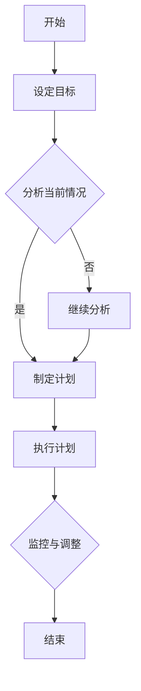

                 

### 时间管理：提高领导效率的关键

> 关键词：时间管理、领导效率、方法论、实践应用、优化策略

> 摘要：本文将深入探讨时间管理在提高领导效率方面的关键作用。通过分析时间管理的背景、基础理论、实践应用及优化策略，本文旨在为领导者提供一套系统、实用的时间管理方法论，助力其在快节奏的工作环境中保持高效和卓越的表现。

### 第一部分：时间管理的背景与重要性

## 第1章：时间管理的重要性与背景

### 1.1 问题背景

在现代职场中，时间和效率成为了衡量一个人、一个团队乃至一个企业成功与否的关键因素。领导者作为团队的舵手，他们的时间管理能力直接影响到整个团队的工作效率和绩效。因此，如何进行有效的时间管理，成为了领导者亟需解决的问题。

### 1.2 时间管理的定义与内涵

时间管理是指通过规划、组织和控制时间，以达到个人和团队目标的一种活动。它不仅仅是对时间的分配，更是一种管理技能，涉及到对任务的优先级排序、对时间的合理分配以及对时间的自我监控。

### 1.3 时间管理的重要性和挑战

时间管理对领导者的意义在于：
1. **提高工作效率**：合理的时间管理能够帮助领导者更高效地完成工作任务。
2. **优化团队绩效**：领导者的时间管理能力能够带动整个团队的工作效率和绩效。
3. **减轻压力**：通过有效的时间管理，领导者可以减少工作压力，提高生活质量。

然而，时间管理也面临着诸多挑战：
1. **任务繁多**：领导者常常面临多重任务，需要有效筛选和优先排序。
2. **沟通障碍**：时间的浪费往往源于无效的沟通和协调。
3. **习惯依赖**：一些领导者可能习惯了随意的工作方式，难以适应系统的时间管理。

## 第2章：时间管理的基础理论

### 2.1 时间管理的基本原则

时间管理的基本原则包括：
1. **优先级排序**：将任务按照重要性和紧急性进行排序，优先处理最重要且最紧急的任务。
2. **时间块管理**：将时间划分为不同的块，每个块专注于处理特定类型的工作。
3. **避免拖延**：通过制定明确的目标和计划，减少拖延现象的发生。

### 2.2 时间管理的核心概念

时间管理的核心概念包括：
1. **时间浪费分析**：识别和分析时间浪费的原因，制定针对性的改进措施。
2. **时间利用效率**：通过提高时间的利用效率，实现工作的最大化成果。
3. **自我管理能力**：领导者需要具备良好的自我管理能力，包括时间管理、情绪管理、目标管理等。

### 2.3 时间管理的基本方法和工具

时间管理的方法和工具包括：
1. **时间日志**：记录每天的时间使用情况，帮助领导者识别时间浪费点。
2. **甘特图**：用于规划项目进度和任务分配。
3. **任务清单**：将工作任务列出清单，有助于跟踪任务进度和完成情况。

## 第3章：时间管理心理学

### 3.1 时间感知与时间态度

时间感知是指个体对时间的感知和认知，时间态度则是指个体对时间管理的看法和态度。正确的时间感知和积极的时间态度是有效时间管理的基础。

### 3.2 时间管理动机与心理障碍

时间管理动机包括提高工作效率、减轻压力、实现目标等。而心理障碍如拖延症、焦虑症等则会影响时间管理的有效性。

### 3.3 提高时间管理能力的方法

提高时间管理能力的方法包括：
1. **自我监控**：定期检查自己的时间使用情况，调整时间管理策略。
2. **时间管理培训**：通过专业培训提高时间管理技能。
3. **实践和反馈**：通过不断的实践和反馈，不断完善时间管理方法。

### 第二部分：时间管理的实践应用

## 第4章：领导者的时间管理

### 4.1 领导者的时间管理挑战

领导者的时间管理挑战主要包括：
1. **会议过多**：会议常常占用大量时间，而会议效率低下则会造成时间的极大浪费。
2. **突发事件**：突发事件会打乱原本的时间计划，需要领导者具备快速调整能力。
3. **决策耗时**：领导者在做出决策时，需要权衡各种因素，这往往需要较长时间。

### 4.2 领导者的时间管理策略

领导者的时间管理策略包括：
1. **会议管理**：通过控制会议时间、明确会议目标和议程来提高会议效率。
2. **优先级管理**：将工作任务进行优先级排序，确保重要且紧急的任务得到及时处理。
3. **时间块管理**：将一天的时间划分为不同的块，每个块专注于处理特定类型的工作。

### 4.3 领导者的时间管理实践

领导者的时间管理实践包括：
1. **设定明确目标**：为每个工作日设定明确的目标和计划。
2. **定期回顾和调整**：每周或每月进行时间管理效果的回顾和调整。
3. **培养良好习惯**：通过实践培养良好的时间管理习惯，如及时完成任务、避免拖延等。

## 第5章：团队时间管理

### 5.1 团队时间管理的意义

团队时间管理的意义在于：
1. **提高团队效率**：通过有效的时间管理，团队能够更高效地完成任务。
2. **减少时间浪费**：通过团队时间管理，可以减少不必要的会议和沟通，提高工作效率。
3. **增强团队凝聚力**：通过共同的时间管理实践，增强团队成员之间的协作和凝聚力。

### 5.2 团队时间管理的策略与方法

团队时间管理的策略与方法包括：
1. **共同制定计划**：团队共同制定时间管理计划，确保每个人都知道自己的职责和目标。
2. **定期沟通和反馈**：定期进行团队沟通，分享时间管理经验和反馈。
3. **使用时间管理工具**：引入时间管理工具，如甘特图、任务清单等，帮助团队更好地管理时间。

### 5.3 团队时间管理的实践案例

团队时间管理的实践案例包括：
1. **项目团队的时间管理**：通过项目计划和时间管理工具，确保项目按期完成。
2. **销售团队的时间管理**：通过销售日志和任务清单，提高销售效率和业绩。
3. **研发团队的时间管理**：通过时间块管理和任务优先级排序，提高研发效率和质量。

## 第6章：时间管理与个人发展

### 6.1 时间管理对个人成长的影响

时间管理对个人成长的影响包括：
1. **提高工作效率**：通过有效的时间管理，个人能够更高效地完成任务，提高工作效率。
2. **优化个人生活**：通过合理的时间管理，个人能够更好地平衡工作与生活，提高生活质量。
3. **实现个人目标**：通过设定明确的目标和计划，个人能够更好地实现自己的职业和人生目标。

### 6.2 个人发展中的时间管理策略

个人发展中的时间管理策略包括：
1. **设定长期和短期目标**：为个人发展设定明确的目标和计划，确保目标的可实现性和时效性。
2. **持续学习和提升**：通过不断学习和提升自己的技能和知识，实现个人职业发展的目标。
3. **平衡工作与生活**：通过合理的时间管理，确保工作与生活的平衡，提高个人幸福感。

### 6.3 提高个人时间管理能力的方法

提高个人时间管理能力的方法包括：
1. **自我监控和反思**：通过自我监控和反思，了解自己的时间使用情况，找出改进点。
2. **学习和借鉴**：学习他人的时间管理方法和经验，借鉴并应用到自己的实践中。
3. **实践和调整**：通过不断的实践和调整，不断完善自己的时间管理方法。

### 第三部分：时间管理的优化与提升

## 第7章：时间管理优化策略

### 7.1 评估时间管理效果的方法

评估时间管理效果的方法包括：
1. **工作日志分析**：通过工作日志分析，了解自己的时间使用情况，评估时间管理效果。
2. **团队反馈**：通过团队反馈，了解团队成员对时间管理策略的看法和建议。
3. **绩效指标**：通过绩效指标，如任务完成率、工作效率等，评估时间管理效果。

### 7.2 优化时间管理的方法与实践

优化时间管理的方法与实践包括：
1. **改进工作流程**：通过优化工作流程，减少不必要的环节和时间浪费。
2. **引入时间管理工具**：引入先进的时间管理工具，提高时间管理效率。
3. **培训和学习**：定期进行时间管理培训和学习，提升时间管理能力。

### 7.3 时间管理优化案例解析

时间管理优化案例解析包括：
1. **案例分析**：通过具体案例，分析时间管理优化前后的效果和变化。
2. **经验分享**：分享时间管理优化的成功经验和实践方法。
3. **问题解决**：针对时间管理中存在的问题，提出解决方案和优化建议。

## 第8章：时间管理的未来趋势与挑战

### 8.1 时间管理的新趋势

时间管理的新趋势包括：
1. **数字化转型**：随着数字化技术的发展，时间管理工具和方法的数字化程度越来越高。
2. **个性化管理**：根据个体差异，提供个性化的时间管理方案和策略。
3. **智能化管理**：通过人工智能技术，实现时间管理的智能化和自动化。

### 8.2 时间管理的未来挑战

时间管理的未来挑战包括：
1. **技术发展带来的挑战**：技术的快速发展对时间管理提出了新的要求和挑战。
2. **工作与生活的平衡**：随着工作压力的增加，如何在工作与生活之间找到平衡成为一个重要课题。
3. **时间管理教育的普及**：提高全民的时间管理意识和管理能力，是一个长期而艰巨的任务。

### 8.3 面对未来挑战的时间管理策略

面对未来挑战的时间管理策略包括：
1. **持续学习和提升**：随着时间管理技术的发展，领导者需要不断学习和提升自己的时间管理能力。
2. **适应变化**：领导者需要具备快速适应变化的能力，灵活调整时间管理策略。
3. **团队合作**：通过团队合作，共同面对和解决时间管理中的问题和挑战。

## 第9章：总结与展望

### 9.1 时间管理的总体成效

时间管理的总体成效在于：
1. **提高工作效率**：通过有效的时间管理，领导者能够更高效地完成任务，提高工作效率。
2. **优化团队绩效**：通过团队时间管理，提高团队整体的工作效率和绩效。
3. **促进个人发展**：通过时间管理，个人能够更好地实现自己的职业和人生目标。

### 9.2 未来的研究方向

未来的研究方向包括：
1. **时间管理技术**：研究和发展新的时间管理技术和工具，提高时间管理的效率和效果。
2. **个性化管理**：探索个性化时间管理方案，满足不同个体的需求。
3. **时间管理心理学**：深入研究时间管理心理学，提高时间管理的效果和可持续性。

### 9.3 对领导者的启示

对领导者的启示包括：
1. **重视时间管理**：领导者需要重视时间管理，将其作为提升工作效率和团队绩效的重要手段。
2. **持续学习和提升**：领导者需要不断学习和提升自己的时间管理能力，以应对不断变化的工作环境和挑战。
3. **以身作则**：领导者应该以身作则，通过自己的实践和榜样作用，带动团队成员共同提升时间管理能力。

作者：AI天才研究院/AI Genius Institute & 禅与计算机程序设计艺术 /Zen And The Art of Computer Programming

---

本文深入探讨了时间管理在提高领导效率方面的关键作用，通过分析时间管理的背景、基础理论、实践应用及优化策略，为领导者提供了一套系统、实用的时间管理方法论。在未来的工作中，领导者需要不断学习和提升自己的时间管理能力，以应对快节奏的工作环境和不断变化的挑战，实现个人和团队的卓越表现。

### 时间管理的基本原则与核心概念

时间管理，作为一种提升工作效率和个人效能的重要手段，其基础在于一系列的基本原则和核心概念的运用。理解并掌握这些原则和概念，能够帮助我们在日常工作和生活中更加高效地管理时间。

#### 3.1 基本原则

**优先级排序**：优先级排序是时间管理的核心原则之一。在面对多个任务时，我们需要根据任务的重要性和紧急性进行排序，确保最重要且最紧急的任务优先处理。具体来说，可以使用艾森豪威尔矩阵（Eisenhower Matrix）来帮助判断任务的优先级。

**时间块管理**：时间块管理是将时间划分为不同的块，每个块专注于处理特定类型的工作。这种方法能够帮助我们在处理任务时保持专注，减少任务切换带来的时间浪费。例如，将一天的时间划分为工作块、休息块和计划块，每个块都有明确的任务和目标。

**避免拖延**：拖延是时间管理中的大敌。避免拖延的方法包括设定明确的目标和截止日期、使用番茄工作法（Pomodoro Technique）来提高专注力，以及通过自我激励和自我监控来克服拖延症。

#### 3.2 核心概念

**时间浪费分析**：时间浪费分析是识别和分析我们在日常工作和生活中时间浪费的原因。通过记录和分析时间使用情况，我们可以发现时间浪费的常见原因，如会议效率低、任务重复等，并制定相应的改进措施。

**时间利用效率**：时间利用效率是指我们在单位时间内完成的工作量。提高时间利用效率的方法包括减少不必要的任务、优化工作流程、提高会议效率等。

**自我管理能力**：自我管理能力是时间管理的重要基础。它包括时间管理能力、情绪管理能力、目标管理能力等。提升自我管理能力可以帮助我们更好地规划时间、调整情绪、设定目标，从而实现高效的工作和生活。

#### 3.3 基本方法和工具

**时间日志**：时间日志是一种记录每天时间使用情况的方法。通过记录时间日志，我们可以了解自己的时间分配情况，发现时间浪费点，并制定改进措施。

**甘特图**：甘特图是一种常用的项目管理工具，用于规划项目进度和任务分配。通过甘特图，我们可以直观地了解任务的完成情况，调整任务优先级，确保项目按期完成。

**任务清单**：任务清单是将工作任务列成清单，以便跟踪任务进度和完成情况。通过任务清单，我们可以清晰地了解每个任务的执行情况，确保任务按时完成。

**番茄工作法**：番茄工作法是一种简单而有效的时间管理方法，通过将工作时间划分为25分钟的工作块和5分钟的休息时间，提高专注力和工作效率。

### 3.4 概念属性特征对比表格

| 时间管理方法 | 特点 | 适用场景 |
| --- | --- | --- |
| 优先级排序 | 根据任务的重要性和紧急性进行排序 | 处理多任务时 |
| 时间块管理 | 将时间划分为不同的块，专注处理特定任务 | 提高专注力 |
| 避免拖延 | 设定明确的目标和截止日期，提高专注力 | 避免任务拖延 |
| 时间浪费分析 | 识别和分析时间浪费的原因 | 发现时间浪费点 |
| 时间利用效率 | 提高单位时间的工作量 | 提高工作效率 |
| 自我管理能力 | 提高时间管理、情绪管理和目标管理能力 | 实现高效工作 |
| 时间日志 | 记录每天的时间使用情况 | 了解时间分配 |
| 甘特图 | 规划项目进度和任务分配 | 项目管理 |
| 任务清单 | 跟踪任务进度和完成情况 | 完成任务 |
| 番茄工作法 | 每25分钟工作后休息5分钟 | 提高专注力 |

### 3.5 时间管理的 Mermaid 流程图

下面是时间管理流程的 Mermaid 流程图，展示了时间管理的主要步骤和方法：

### 时间管理心理学

时间管理不仅仅是技术和方法的运用，还涉及到心理学层面的因素。心理学对时间管理的理解，为我们提供了更深入的方法来提高时间管理的有效性。

#### 3.1 时间感知与时间态度

**时间感知**是指我们对时间的感知和认知。时间感知与个体的心理状态密切相关。例如，焦虑和压力会影响人们对时间的感知，使得时间感觉变得更短或更长。而积极的情绪状态，如乐观和自信，则能帮助我们更有效地感知和利用时间。

**时间态度**是指个体对时间管理的看法和态度。时间态度决定了我们对待时间的态度和行为。积极的时间态度，如认为时间宝贵、愿意投入时间去学习和提升自己，能够促进时间管理的效果。

#### 3.2 时间管理动机与心理障碍

**时间管理动机**是指推动个体进行时间管理的内在动力。动机可以分为内在动机和外在动机。内在动机，如提高工作效率、实现个人目标，能够让我们更主动地管理时间。外在动机，如工作压力、绩效评估，则可能带来一定的负面影响，如增加焦虑和压力。

**心理障碍**是指影响时间管理效果的心理因素。常见的心理障碍包括：

- **拖延症**：个体因为焦虑、恐惧或缺乏动力，导致任务延期或未完成。
- **时间错觉**：由于对时间的感知不准确，导致时间管理失效。
- **任务过多**：面对过多的任务，个体可能会感到困惑和无从下手，从而影响时间管理。

#### 3.3 提高时间管理能力的方法

要提高时间管理能力，我们需要从心理学角度出发，采取以下方法：

- **自我监控与反思**：通过记录和反思自己的时间使用情况，识别时间浪费点和心理障碍，并制定改进计划。
- **积极的心理状态**：保持积极的心态，如乐观、自信和专注，能够帮助我们更有效地管理时间。
- **时间管理培训**：参加时间管理培训，学习有效的技巧和方法，提高时间管理能力。
- **实践与反馈**：通过不断实践和反馈，完善时间管理方法，提高时间管理的可持续性。

### 时间管理心理学对领导者的启示

对于领导者来说，理解时间管理心理学的重要性不言而喻。领导者不仅需要管理好自己的时间，还需要引导团队成员进行时间管理。以下是时间管理心理学对领导者的启示：

1. **建立积极的工作氛围**：通过鼓励和表扬，建立积极的工作氛围，提高团队成员的时间管理动机和效能。
2. **提供心理支持**：在团队成员遇到时间管理问题时，提供心理支持和帮助，帮助他们克服拖延和其他心理障碍。
3. **培养良好的时间观念**：通过培训和分享，培养团队成员的时间观念，提高他们对时间的重视和有效利用。
4. **关注团队成员的心理健康**：时间管理不仅仅是技术层面的，还需要关注团队成员的心理健康，确保他们在工作中有良好的心理状态。

### 总结

时间管理心理学为我们提供了理解时间管理的心理机制和方法，帮助我们更有效地进行时间管理。通过积极的时间感知和态度，克服心理障碍，领导者可以提升自己的时间管理能力，从而提高工作效率和团队绩效。同时，领导者也需要关注团队成员的心理状态，提供必要的心理支持和帮助，共同实现个人和团队的目标。

### 领导者的时间管理挑战与策略

在快节奏的现代工作环境中，领导者面临的时间管理挑战愈发复杂和严峻。以下将详细分析领导者时间管理中的主要挑战，并提出相应的策略和方法，以帮助领导者更好地应对这些挑战。

#### 4.1 领导者的时间管理挑战

**1. 会议过多**

会议是领导者日常工作中不可避免的一部分，但过多的会议往往会占用大量的时间，导致领导者无法专注于其他重要任务。会议效率低下也是一个普遍问题，很多会议可能因为准备不充分、目标不明确或参与人员不专注，而浪费了大量时间。

**2. 突发事件**

突发事件是领导者工作中的一大挑战。无论是突发的业务问题、技术故障，还是紧急的客户需求，都需要领导者立即响应和处理。这些突发事件往往打乱了领导者原本的时间计划，使得时间管理变得更为复杂。

**3. 决策耗时**

领导者在做出决策时，需要综合考虑各种因素，权衡不同的选择。这个过程往往需要耗费大量时间和精力，尤其是对于复杂的问题或需要跨部门协作的决策。长时间的决策过程可能导致领导者无法专注于其他任务，影响整体工作效率。

**4. 人际交往**

领导者需要与团队成员、上级、下属和合作伙伴进行频繁的沟通和交往。这些人际交往虽然对于团队协作和业务发展至关重要，但也会占用大量的时间，尤其是在处理冲突和解决问题时。

#### 4.2 领导者的时间管理策略

**1. 会议管理**

为了提高会议效率，领导者可以采取以下策略：

- **明确会议目标**：每次会议前，明确会议的目标和议程，确保会议有明确的主题和方向。
- **限制会议时间**：设定合理的会议时间，避免过长的会议时间，提高会议效率。
- **减少参会人员**：仅邀请必要的人员参加会议，减少不必要的参与，提高会议的专注度和效率。
- **会议前准备**：确保会议前的准备工作充分，包括资料准备、议题讨论等，避免会议中出现因信息不足或准备不充分而导致的延误。

**2. 突发事件管理**

针对突发事件，领导者可以采取以下策略：

- **快速响应**：建立快速响应机制，确保在突发事件发生时，领导者能够迅速作出反应。
- **优先级排序**：根据事件的紧急程度和影响范围，对突发事件进行优先级排序，确保重要且紧急的事件得到及时处理。
- **授权管理**：对于一些较小的突发事件，可以授权给团队成员处理，减轻领导者的工作负担。

**3. 决策管理**

为了提高决策效率，领导者可以采取以下策略：

- **信息收集**：在做出决策前，充分收集相关信息，确保决策基于充分的信息基础。
- **决策模板**：建立决策模板，对于常见问题，使用模板进行快速决策。
- **跨部门协作**：对于需要跨部门协作的决策，提前沟通，明确各方职责，提高决策效率。

**4. 人际交往管理**

对于人际交往，领导者可以采取以下策略：

- **沟通计划**：制定定期的人际交往计划，确保与团队成员、上级和合作伙伴的沟通有规律。
- **高效沟通**：使用有效的沟通工具和方法，如即时通讯工具、电子邮件等，提高沟通效率。
- **冲突管理**：建立冲突管理机制，对于冲突问题，及时处理，避免影响团队协作。

#### 4.3 领导者的时间管理实践

**1. 设定明确目标**

领导者需要为自己和团队设定明确的目标，这些目标应当是具体、可衡量、可实现、相关性强和时限性的（SMART）。通过明确的目标，领导者可以更有效地分配时间和资源，确保工作朝着正确的方向推进。

**2. 定期回顾和调整**

领导者需要定期回顾时间管理的效果，检查目标是否达成，时间分配是否合理。通过回顾和调整，领导者可以不断优化时间管理策略，提高工作效率。

**3. 培养良好习惯**

领导者需要通过实践培养良好的时间管理习惯，如及时完成任务、避免拖延、合理安排工作和休息时间。良好习惯的养成对于长期的时间管理至关重要。

**4. 借助工具**

领导者可以借助各种时间管理工具，如时间日志、任务清单、甘特图等，来帮助自己更有效地管理时间。这些工具可以帮助领导者更好地规划和跟踪任务进度，提高工作效率。

### 总结

领导者的时间管理挑战在于会议过多、突发事件、决策耗时和人际交往。通过明确会议目标、快速响应突发事件、高效决策和合理管理人际交往，领导者可以更好地应对这些挑战。同时，领导者需要通过设定明确目标、定期回顾和调整、培养良好习惯以及借助工具等方法，不断提升自己的时间管理能力，从而提高工作效率和团队绩效。

### 团队时间管理的意义与策略

在组织运作中，团队时间管理扮演着至关重要的角色。有效的团队时间管理不仅能够提高工作效率，还能增强团队凝聚力和整体绩效。以下将详细探讨团队时间管理的意义、策略与方法。

#### 5.1 团队时间管理的意义

**1. 提高工作效率**

团队时间管理有助于提高工作效率，通过合理的任务分配和时间规划，确保每个成员都能在最佳状态下完成工作。团队时间管理还可以减少不必要的会议和沟通，避免时间浪费，使团队成员能够更专注于核心任务。

**2. 减少冲突和误解**

通过明确任务分配和职责，团队时间管理可以减少因任务重叠或责任不清而产生的冲突和误解。团队成员对各自的任务和责任有清晰的认知，能够更好地协调合作，提高工作效率。

**3. 增强团队凝聚力**

共同的时间管理实践可以增强团队成员之间的信任和合作，提升团队凝聚力。通过团队协作，共同面对挑战和解决问题，团队成员能够更好地理解和支持彼此，形成更紧密的团队关系。

**4. 提升整体绩效**

团队时间管理有助于提升整体绩效，通过有效的任务规划和时间利用，团队能够更快速地完成项目，提高产出质量。此外，团队时间管理还可以帮助组织更好地实现战略目标，提升整体竞争力。

#### 5.2 团队时间管理的策略与方法

**1. 共同制定计划**

团队时间管理的第一步是共同制定计划。团队成员应共同参与计划制定，明确每个成员的任务和责任，确保任务分配合理。制定计划时，应考虑任务的优先级、资源需求和项目期限，制定具体的行动步骤和时间表。

**2. 定期沟通和反馈**

定期沟通和反馈是团队时间管理的重要环节。团队应定期召开会议，检查任务进度，分享工作成果，识别和解决问题。通过有效的沟通和反馈，团队成员能够保持信息的透明和畅通，确保任务按时完成。

**3. 使用时间管理工具**

使用时间管理工具，如甘特图、任务清单和时间跟踪软件，可以帮助团队更好地规划和管理时间。这些工具能够直观地展示任务进度和资源分配，帮助团队成员更好地协调工作，提高工作效率。

**4. 培养良好的时间管理习惯**

团队成员应培养良好的时间管理习惯，如及时完成任务、避免拖延、合理安排工作和休息时间。良好的时间管理习惯不仅能够提高个人工作效率，还能带动整个团队的积极性和协作能力。

**5. 设定明确的目标和里程碑**

在团队时间管理中，设定明确的目标和里程碑是非常重要的。团队应制定具体的、可衡量的目标，并为每个目标设定明确的里程碑。通过设定目标和里程碑，团队能够更好地跟踪进度，确保项目按时完成。

**6. 培训和指导**

为了确保团队时间管理的有效性，领导者应提供培训和指导，帮助团队成员掌握时间管理的方法和技巧。通过培训和指导，团队成员能够更好地理解时间管理的重要性，提高时间管理能力。

#### 5.3 团队时间管理的实践案例

**1. 项目团队的时间管理**

在一个大型项目团队中，时间管理是确保项目成功的关键。以下是一个项目团队时间管理的实践案例：

- **共同制定计划**：项目团队在项目启动阶段，共同制定了详细的计划，明确了每个成员的任务和责任，并制定了具体的时间表。
- **定期沟通和反馈**：团队每周召开一次会议，检查任务进度，分享工作成果，确保任务按时完成。
- **使用时间管理工具**：团队使用甘特图和任务清单来跟踪任务进度，确保任务按计划进行。
- **设定明确的目标和里程碑**：项目团队为每个阶段设定了明确的目标和里程碑，确保项目按时完成。

通过有效的团队时间管理，项目团队不仅按时完成了任务，还提高了项目的质量和效率。

**2. 销售团队的时间管理**

在销售团队中，时间管理同样至关重要。以下是一个销售团队时间管理的实践案例：

- **定期沟通和反馈**：销售团队每月召开一次销售会议，分析销售数据，识别问题，制定改进计划。
- **使用时间管理工具**：销售团队使用CRM系统来跟踪客户信息和销售进度，提高销售效率。
- **培养良好的时间管理习惯**：团队成员通过培训和指导，培养了良好的时间管理习惯，如及时跟进客户、合理安排销售活动。
- **设定明确的目标和里程碑**：销售团队为每个季度设定了明确的目标和里程碑，确保销售目标的实现。

通过有效的团队时间管理，销售团队提高了销售业绩，增强了客户满意度。

**3. 研发团队的时间管理**

在研发团队中，时间管理对项目进度和质量至关重要。以下是一个研发团队时间管理的实践案例：

- **共同制定计划**：研发团队在项目启动阶段，共同制定了详细的计划，明确了每个开发人员的工作任务和进度。
- **定期沟通和反馈**：团队每周召开一次开发会议，检查代码进度，解决技术问题，确保项目按时完成。
- **使用时间管理工具**：团队使用JIRA等项目管理工具来跟踪任务进度，确保任务按计划进行。
- **培养良好的时间管理习惯**：团队成员通过培训和指导，培养了良好的时间管理习惯，如及时提交代码、合理安排开发任务。

通过有效的团队时间管理，研发团队确保了项目按时完成，提高了代码质量和开发效率。

### 总结

团队时间管理对于提高工作效率、减少冲突和误解、增强团队凝聚力和提升整体绩效具有重要意义。通过共同制定计划、定期沟通和反馈、使用时间管理工具、培养良好习惯和设定明确目标等方法，团队能够更有效地管理时间，实现更高的绩效。实践案例表明，有效的团队时间管理能够带来显著的工作效果和团队成果。

### 时间管理对个人发展的影响

时间管理不仅是提高工作效率的工具，更是个人成长和职业发展的关键。通过合理的时间管理，个人可以更好地实现自己的目标，提升综合能力和素质，从而在职场中脱颖而出。

#### 6.1 时间管理对个人成长的影响

**1. 提高工作效率**

有效的时间管理有助于个人提高工作效率。通过设定明确的目标和优先级排序，个人能够集中精力处理最重要和最紧急的任务，避免因任务繁杂而导致的拖延和效率低下。此外，时间块管理和避免拖延的方法可以帮助个人更好地保持专注，减少无效时间的浪费。

**2. 促进知识积累**

合理的时间管理可以帮助个人更好地规划学习和工作的时间，从而实现知识的持续积累和深化。通过设定学习目标和定期复习，个人可以不断提升自己的知识和技能，为职业发展打下坚实的基础。

**3. 提升综合素质**

时间管理不仅关注工作任务的完成，还涉及情绪管理、目标管理等多方面能力。通过有效的自我管理和时间管理，个人能够更好地控制自己的情绪，设定并实现长期目标，提升自身的综合素质，为职业发展提供支持。

**4. 提高生活质量**

合理的时间管理有助于个人更好地平衡工作与生活，减少工作压力，提高生活质量。通过合理安排工作和休息时间，个人可以保持身心健康，享受更加充实和快乐的生活。

#### 6.2 个人发展中的时间管理策略

**1. 设定明确的目标**

在个人发展中，设定明确的目标是时间管理的重要一环。个人应当根据自身的职业规划和兴趣，设定短期和长期目标，并将其具体化、可衡量。例如，设定每天阅读一定时间、每月完成一定的学习任务等。

**2. 制定详细的计划**

为了实现目标，个人需要制定详细的计划。计划应包括具体的时间安排和任务分配，确保每个目标都有明确的执行步骤和时间节点。通过详细的计划，个人可以更好地跟踪进度，及时调整策略，确保目标的实现。

**3. 保持专注和高效**

在执行计划时，个人需要保持专注和高效。时间块管理和番茄工作法等方法可以帮助个人更好地保持专注，减少任务切换带来的时间浪费。此外，定期休息和放松也是保持高效的重要手段。

**4. 持续学习和反思**

个人发展是一个持续的过程，需要不断地学习和反思。个人应当定期回顾自己的时间管理效果，识别改进点，调整策略。同时，通过参加培训、阅读书籍、交流学习等方式，持续提升自己的知识和技能。

**5. 平衡工作与生活**

在个人发展中，平衡工作与生活至关重要。个人应当合理安排工作时间，确保有足够的休息和娱乐时间。通过培养兴趣爱好、进行体育锻炼和社交活动，个人可以更好地放松身心，提高生活质量。

#### 6.3 提高个人时间管理能力的方法

**1. 自我监控和反思**

自我监控和反思是提高个人时间管理能力的重要方法。个人应当定期记录自己的时间使用情况，分析时间浪费点，制定改进措施。通过反思和总结，个人可以不断优化自己的时间管理方法，提高效率。

**2. 学习他人的经验**

学习他人的时间管理经验和技巧，可以帮助个人快速提升时间管理能力。通过阅读相关书籍、参加培训、听取讲座等方式，个人可以了解各种时间管理方法和策略，并将其应用到自己的实践中。

**3. 借助工具**

使用各种时间管理工具，如日历、任务清单、时间跟踪软件等，可以帮助个人更好地规划和跟踪时间。这些工具能够提供直观的数据和信息，帮助个人更有效地管理时间。

**4. 持续实践和调整**

时间管理不是一蹴而就的，需要个人持续实践和调整。通过不断的实践，个人可以逐步掌握有效的时间管理方法，并将其融入自己的日常生活和工作中。同时，根据实际情况和变化，个人需要灵活调整时间管理策略，确保其持续有效。

### 总结

时间管理对个人发展具有重要的影响，通过提高工作效率、促进知识积累、提升综合素质和提高生活质量等方面，助力个人在职场中取得成功。为了实现个人目标，个人需要设定明确的目标、制定详细的计划、保持专注和高效、持续学习和反思，并借助工具和实践不断提升自己的时间管理能力。

### 时间管理优化策略

为了提高时间管理的效果，领导者需要不断评估现有策略的执行情况，发现存在的问题，并采取相应的优化措施。以下将详细探讨评估时间管理效果的方法、优化时间管理的方法与实践，以及具体的时间管理优化案例解析。

#### 7.1 评估时间管理效果的方法

**1. 工作日志分析**

工作日志分析是一种常用的评估方法，通过记录每天的工作内容和时间使用情况，领导者可以全面了解团队成员的时间分配情况。通过分析工作日志，可以发现时间浪费的环节，如不必要的会议、任务重复等，从而制定针对性的改进措施。

**2. 绩效指标分析**

绩效指标分析是通过关键绩效指标（KPI）来评估时间管理效果的一种方法。领导者可以设定具体的绩效指标，如任务完成率、项目进度等，通过对比实际完成情况与预期目标，评估时间管理的有效性。绩效指标分析有助于识别团队中的问题，制定改进计划。

**3. 团队反馈**

团队反馈是另一种评估时间管理效果的有效方法。通过定期收集团队成员的反馈意见，领导者可以了解团队成员对现有时间管理策略的看法和建议。这些反馈信息有助于领导者发现存在的问题，调整时间管理策略，提高团队的满意度。

**4. 客户满意度调查**

对于服务型团队，客户满意度调查也是一种重要的评估方法。通过了解客户对服务质量和响应时间的评价，领导者可以评估时间管理策略对客户满意度的影响，从而优化时间管理方法。

#### 7.2 优化时间管理的方法与实践

**1. 工作流程优化**

工作流程优化是提高时间管理效果的重要手段。通过分析现有工作流程，领导者可以识别出冗长、低效的环节，进行简化或自动化处理。例如，引入新的技术工具或流程改进措施，如使用项目管理软件、实施自动化流程等，可以显著提高工作效率。

**2. 时间管理培训**

为了提高团队成员的时间管理能力，领导者可以定期组织时间管理培训。培训内容可以包括时间管理的基本原则、方法工具、心理技巧等。通过培训，团队成员可以学习到有效的时间管理策略，提高工作效率。

**3. 借助工具**

借助先进的时间管理工具，如甘特图、任务清单、时间跟踪软件等，领导者可以更好地规划和跟踪任务进度。这些工具提供了直观的数据和图形展示，帮助领导者更清晰地了解团队的时间分配和任务完成情况，从而优化时间管理。

**4. 激励机制**

建立有效的激励机制，可以激发团队成员的积极性，提高时间管理的效果。例如，设立时间管理奖、奖励按时完成任务或提高工作效率的团队成员，可以激发团队成员的竞争意识和工作热情。

**5. 自我管理和团队协作**

领导者应当鼓励团队成员进行自我管理和团队协作。通过设定明确的目标和计划，团队成员可以更好地管理自己的时间，避免拖延和任务积压。同时，通过团队合作，可以更好地协调工作，提高整体工作效率。

#### 7.3 时间管理优化案例解析

**1. 案例一：工作流程优化**

某公司的研发团队在项目推进过程中，发现研发流程中存在多个冗长的环节，如代码审查、测试等。为了提高时间管理效果，团队决定对工作流程进行优化。

- **步骤一**：分析现有工作流程，识别冗长、低效的环节。
- **步骤二**：引入自动化工具，如自动化代码审查和测试工具，减少人工干预。
- **步骤三**：简化流程，将多个步骤合并为单个步骤，减少流程复杂度。
- **步骤四**：实施新流程，跟踪效果，并根据实际情况进行持续优化。

通过工作流程优化，研发团队提高了任务完成速度，缩短了项目周期，提高了整体工作效率。

**2. 案例二：时间管理培训**

某公司的销售团队在时间管理方面存在较大问题，如任务拖延、会议效率低等。为了提高团队的时间管理能力，公司决定组织时间管理培训。

- **步骤一**：邀请专业培训机构，为团队成员提供时间管理培训。
- **步骤二**：培训内容涵盖时间管理的基本原则、方法工具、心理技巧等。
- **步骤三**：培训后，要求团队成员制定个人时间管理计划，并定期进行反馈和评估。
- **步骤四**：通过定期培训和指导，持续提升团队成员的时间管理能力。

通过时间管理培训，销售团队的工作效率显著提高，任务完成率上升，客户满意度提升。

**3. 案例三：激励机制**

某公司的生产部门为了提高时间管理效果，决定建立激励机制，鼓励团队成员按时完成任务。

- **步骤一**：设定明确的绩效指标，如任务完成率、生产效率等。
- **步骤二**：设立时间管理奖，对按时完成任务或提高工作效率的团队成员进行奖励。
- **步骤三**：通过公开表彰和奖励，激励团队成员的工作热情和积极性。
- **步骤四**：定期评估激励机制的效果，根据实际情况进行调整和优化。

通过激励机制，生产部门的工作效率显著提高，任务积压现象减少，整体生产效率提升。

### 总结

时间管理的优化策略包括评估时间管理效果、优化工作流程、时间管理培训、借助工具、激励机制等。通过具体案例的解析，可以看出优化策略在实践中取得了显著的效果。领导者应根据实际情况，灵活运用优化策略，不断提升团队的时间管理能力，提高工作效率和整体绩效。

### 时间管理的未来趋势与挑战

随着技术的飞速发展和社会的快速变化，时间管理面临着新的趋势和挑战。了解这些趋势和挑战，对于领导者来说至关重要，因为它们不仅影响到个人的工作效率，也直接关系到团队和组织的整体绩效。

#### 8.1 时间管理的新趋势

**1. 数字化转型**

数字化转型是当前时间管理的重要趋势之一。随着云计算、大数据、人工智能等技术的发展，越来越多的时间管理工具和平台变得更加智能化和高效。例如，基于人工智能的日程管理工具可以自动识别会议安排，优化时间使用，甚至预测并调整日程安排，以适应不断变化的工作需求。

**2. 个性化管理**

个性化管理是一种新的时间管理趋势，它强调根据个体差异制定个性化的时间管理方案。传统的“一刀切”的时间管理方法已经不再适应多样化的工作环境和生活方式。通过个性化管理，领导者可以更精准地了解团队成员的需求和习惯，为他们提供更加适合的时间管理建议和工具。

**3. 智能化工具**

智能化工具的普及，使得时间管理更加便捷和高效。例如，智能手表、智能手环等设备可以实时监测个人活动，记录运动和睡眠数据，帮助用户更好地管理身体和情绪状态。这些数据可以用于优化时间管理策略，提高工作效率和生活质量。

**4. 远程工作**

远程工作的普及也为时间管理带来了新的挑战和机遇。远程工作使得时间管理的边界变得更加模糊，团队成员需要更灵活的时间管理策略来适应分散的工作环境。同时，远程工作也要求领导者具备更高的沟通和协作能力，以确保远程团队的效率和凝聚力。

#### 8.2 时间管理的未来挑战

**1. 技术发展带来的挑战**

技术发展的速度越来越快，新的工具和平台不断涌现，这给时间管理带来了新的挑战。领导者需要不断学习和适应新的技术，以便更好地利用这些工具提高工作效率。同时，技术发展也带来了信息过载的问题，如何在海量信息中找到关键信息，成为时间管理的重要课题。

**2. 工作与生活的平衡**

在现代社会，工作与生活的平衡是一个重要的挑战。随着工作压力的增加，领导者需要在忙碌的工作中找到平衡，确保有足够的时间照顾家庭和进行个人发展。远程工作和灵活工作制度为工作与生活的平衡提供了可能性，但也需要领导者具备更高的自我管理能力和时间管理技巧。

**3. 时间管理教育的普及**

时间管理教育对于提高全民的时间管理意识和技能至关重要。然而，目前时间管理教育在许多地区仍然没有得到足够的重视。未来的时间管理教育需要更加普及和系统，以便让更多的人掌握有效的时间管理方法，提高生活和工作质量。

**4. 领导者的时间管理能力**

领导者作为团队的核心，其时间管理能力直接影响到整个团队的工作效率和绩效。然而，许多领导者并没有接受过专业的时间管理培训，缺乏有效的时间管理技能。未来的时间管理发展需要加强对领导者时间管理能力的培养，提升他们的管理水平和领导能力。

#### 8.3 面对未来挑战的时间管理策略

**1. 持续学习和适应**

面对技术发展的挑战，领导者需要持续学习和适应新的工具和方法。定期参加培训、阅读相关书籍和文章，了解最新的时间管理趋势和工具，是提升时间管理能力的重要途径。

**2. 培养良好的自我管理习惯**

良好的自我管理习惯是有效时间管理的基础。领导者需要通过实践培养自我管理能力，如设定明确的目标、制定详细的计划、避免拖延等。通过自我管理，领导者可以更好地掌控自己的时间和工作，提高工作效率。

**3. 灵活运用工具**

智能化工具和平台的普及，为领导者提供了更多高效管理时间的手段。领导者可以根据实际情况灵活运用这些工具，如日程管理软件、任务跟踪工具等，提高时间管理的效率和效果。

**4. 强化团队沟通**

在远程工作环境中，强化团队沟通至关重要。领导者需要建立有效的沟通机制，确保团队成员之间的信息畅通和协作顺畅。通过定期召开视频会议、即时通讯工具等方式，保持团队的凝聚力，提高工作效率。

**5. 重视时间管理教育**

为了提升全民的时间管理意识和技能，领导者需要重视时间管理教育。可以通过内部培训、讲座、研讨会等形式，向团队成员传授时间管理的方法和技巧，提高整体时间管理水平。

### 总结

时间管理的未来趋势包括数字化转型、个性化管理、智能化工具和远程工作。同时，时间管理也面临着技术发展、工作与生活平衡、时间管理教育普及和领导者时间管理能力提升等挑战。领导者需要持续学习和适应新的趋势，培养良好的自我管理习惯，灵活运用工具，强化团队沟通，并重视时间管理教育，以应对未来的挑战，提升团队和组织的整体绩效。

### 总结与展望

时间管理在提高领导效率方面扮演着至关重要的角色。通过本文的探讨，我们明确了时间管理的核心原则、理论基础和实践应用，并提出了一系列优化策略和未来展望。

#### 9.1 时间管理的总体成效

时间管理的总体成效体现在多个方面：

1. **提高工作效率**：通过科学的时间分配和任务管理，领导者能够更高效地完成任务，减少不必要的拖延和时间浪费。
2. **优化团队绩效**：有效的团队时间管理能够增强团队协作，提高整体工作效率和产出质量。
3. **促进个人发展**：合理的时间管理不仅有助于提升工作效率，还能促进个人知识和技能的积累，提升综合素质。
4. **改善生活质量**：通过平衡工作和生活，领导者能够更好地管理自己的时间和精力，提高生活质量。

#### 9.2 未来的研究方向

在未来的研究中，我们应当关注以下几个方面：

1. **个性化时间管理**：探索如何根据个体差异，制定更加个性化的时间管理方案，提高时间管理的有效性。
2. **智能时间管理工具**：研究和发展新一代智能时间管理工具，利用人工智能和大数据技术，提高时间管理的自动化和智能化水平。
3. **跨文化时间管理**：研究不同文化背景下时间管理的方法和效果，探索跨文化时间管理的最佳实践。
4. **时间管理与心理健康**：探讨时间管理对个体心理健康的影响，以及如何通过时间管理改善心理健康。

#### 9.3 对领导者的启示

对于领导者来说，以下几点启示尤为重要：

1. **重视时间管理**：将时间管理作为提升工作效率和个人效能的重要手段，持续关注和改进时间管理策略。
2. **自我管理**：领导者应当具备良好的自我管理能力，包括时间管理、情绪管理和目标管理，以身作则，带动团队成员共同提升。
3. **灵活应用工具**：充分利用现代科技和工具，提高时间管理效率，如使用日程管理软件、任务跟踪工具等。
4. **持续学习和反思**：不断学习和反思，根据实际情况调整和优化时间管理策略，确保时间管理的持续有效性。

时间管理不仅是一门技术，更是一种生活方式。通过合理的时间管理，领导者不仅能够提高个人和团队的工作效率，还能实现更加平衡和充实的生活。让我们共同努力，不断提升时间管理能力，迎接未来的挑战，实现个人和组织的卓越表现。

作者：AI天才研究院/AI Genius Institute & 禅与计算机程序设计艺术 /Zen And The Art of Computer Programming

---

本文深入探讨了时间管理在提高领导效率方面的关键作用，通过分析时间管理的背景、基础理论、实践应用及优化策略，为领导者提供了一套系统、实用的时间管理方法论。希望本文能为读者带来启发，帮助他们在快节奏的工作环境中保持高效和卓越的表现。在未来的道路上，让我们继续携手前行，不断探索和提升时间管理的艺术。

