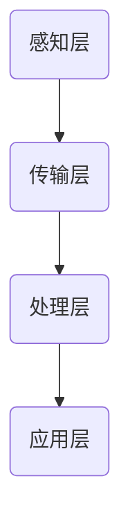
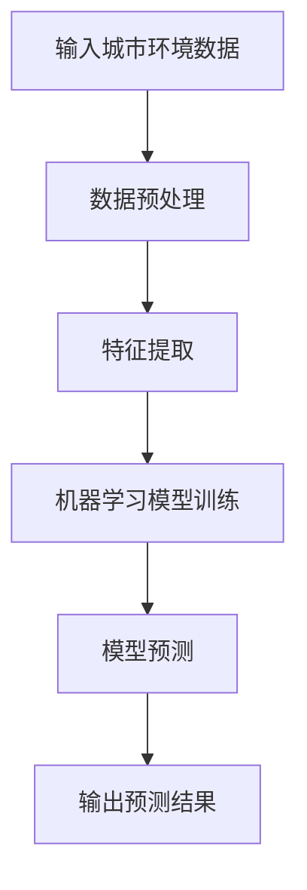
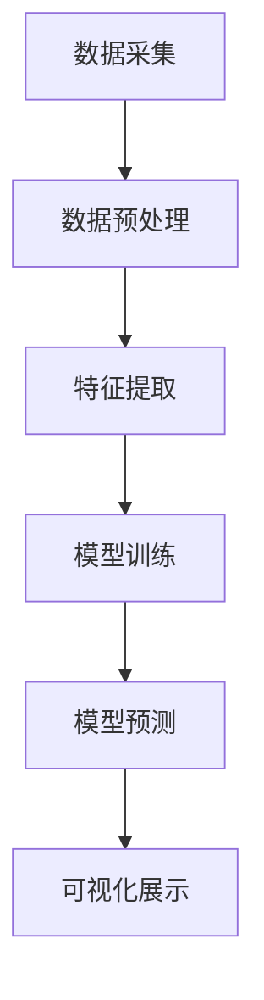
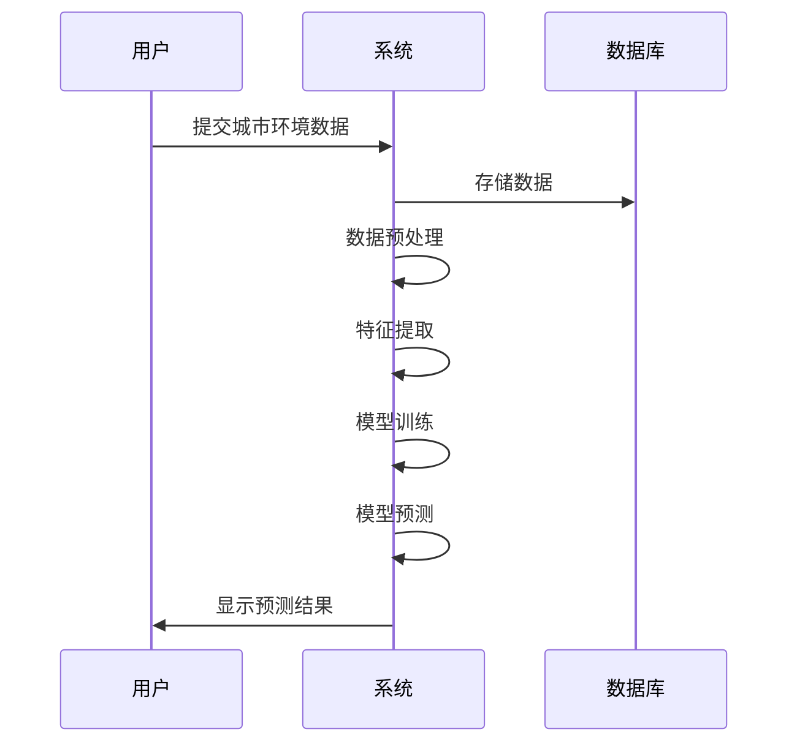

                 

### 文章标题

智慧城市：环境隐形智能在城市管理中的作用

> 关键词：智慧城市、环境隐形智能、城市管理、感知技术、数据处理、机器学习

> 摘要：本文深入探讨了智慧城市中环境隐形智能的作用和实现方法。通过对核心概念、技术原理、算法原理和实际案例的分析，本文展示了环境隐形智能如何提升城市管理的效率和精度，推动智慧城市的可持续发展。

---

### 第一部分：背景介绍

#### 1.1 问题背景

随着全球城市化进程的加快，城市面临着交通拥堵、环境污染、资源浪费等诸多挑战。为了应对这些挑战，智慧城市理念应运而生。智慧城市利用先进的信息通信技术、物联网、大数据和人工智能等技术手段，实现城市管理的智能化和精细化。在城市管理中，环境隐形智能成为了一个重要的组成部分。

#### 1.2 问题描述

智慧城市的一个关键组成部分是环境隐形智能，这种智能能够感知城市环境中的各种信息，如空气污染、交通流量、能源消耗等。环境隐形智能在城市管理中的作用不容忽视，它能够实时监测城市环境变化，预测潜在问题，并快速采取应对措施。因此，如何实现环境隐形智能在城市管理中的有效应用，成为了一个亟待解决的问题。

#### 1.3 问题解决

本文将详细探讨环境隐形智能在城市管理中的应用，包括其核心概念、技术原理、实现方法以及实际案例分析。通过本文，读者可以全面了解环境隐形智能的作用，掌握其在智慧城市中的具体应用，为城市管理提供新的思路和方法。

#### 1.4 边界与外延

环境隐形智能的研究和应用涵盖了多个学科领域，包括计算机科学、物联网技术、环境科学等。本文将主要关注环境隐形智能在智慧城市中的应用，特别是其在城市管理中的具体作用和实现方法。

#### 1.5 概念结构与核心要素组成

环境隐形智能的核心概念包括感知层、传输层、处理层和应用层。感知层负责收集城市环境数据；传输层负责将数据传输到处理层；处理层负责对数据进行分析和处理；应用层则将处理结果应用于实际城市管理中。这些核心要素共同构成了环境隐形智能的基本架构。

### 第二部分：核心概念与联系

#### 2.1 核心概念

环境隐形智能的核心概念主要包括感知技术、数据处理技术、机器学习和人工智能等。

- **感知技术**：感知技术是环境隐形智能的基础，它通过传感器等设备收集城市环境中的各种信息，如空气质量、交通流量、噪声水平等。这些传感器可以是空气污染监测器、摄像头、GPS设备等。
- **数据处理技术**：数据处理技术负责对收集到的环境数据进行分析和处理。这包括数据清洗、去噪、归一化、特征提取等步骤，以便为后续的机器学习提供高质量的数据。
- **机器学习**：机器学习是环境隐形智能的核心技术，它通过训练模型来预测城市环境的变化趋势和潜在问题。常见的机器学习算法包括线性回归、决策树、神经网络等。
- **人工智能**：人工智能是环境隐形智能的高级形式，它不仅能够预测城市环境的变化，还能够模拟人类的决策过程，实现智能化的城市管理。

#### 2.2 概念属性特征对比表格

| 概念         | 定义                                                         | 特点                     |
| ------------ | ------------------------------------------------------------ | ------------------------ |
| 感知技术     | 利用传感器等设备收集城市环境数据                             | 精度高、实时性强         |
| 数据处理技术 | 对收集到的环境数据进行清洗、整合和分析                         | 高效、准确               |
| 机器学习     | 通过算法让计算机模拟人类的学习过程，从而从数据中自动学习和发现规律 | 自动化、高效             |
| 人工智能     | 利用计算机模拟人类的智能行为，包括感知、思考、决策等           | 智能化、自适应           |

#### 2.3 ER实体关系图架构



感知层、传输层、处理层和应用层之间通过数据流相互关联，共同构成了环境隐形智能的完整架构。

### 第三部分：算法原理讲解

#### 3.1 算法mermaid流程图



#### 3.2 算法原理详细讲解

环境隐形智能的核心在于机器学习算法的应用。首先，我们需要对城市环境数据进行预处理，包括数据清洗、去噪、归一化等步骤。然后，通过特征提取算法提取出环境数据中的关键特征。接下来，使用机器学习算法对提取出的特征进行训练，从而建立预测模型。最后，将模型应用于实际城市管理中，输出预测结果。

- **数据预处理**：城市环境数据通常包含噪声和异常值，因此需要对其进行清洗和去噪。常用的方法包括填补缺失值、去除异常值、归一化等。归一化的目的是将不同量纲的特征统一到一个范围内，以便后续的特征提取和模型训练。

- **特征提取**：特征提取是从原始数据中提取出对预测任务有用的信息。在环境隐形智能中，特征提取的目的是将高维的环境数据转换为低维的特征向量，以便于机器学习算法的训练和处理。常用的特征提取方法包括主成分分析（PCA）、线性判别分析（LDA）等。

- **机器学习模型训练**：机器学习模型训练是环境隐形智能的核心步骤。通过训练，机器学习算法可以从数据中自动学习和发现规律，从而预测城市环境的变化趋势和潜在问题。常用的机器学习算法包括线性回归、决策树、支持向量机（SVM）、神经网络等。

- **模型预测**：模型预测是将训练好的模型应用于实际数据，以预测城市环境的变化趋势和潜在问题。预测结果可以用于智能交通管理、环境监测、资源优化等领域，从而提高城市管理的效率和精度。

- **输出预测结果**：预测结果通常以可视化的形式输出，如折线图、柱状图等，以便决策者和管理者直观地了解城市环境的变化趋势和潜在问题。

#### 3.3 数学模型和公式

假设城市环境数据为 $X$，其中每个数据点 $x$ 由 $n$ 个特征组成，即 $x = (x_1, x_2, ..., x_n)$。预处理后的数据通过特征提取算法提取出特征向量 $f(x)$，然后使用机器学习算法训练出预测模型 $f_{\theta}(x)$，其中 $\theta$ 为模型参数。预测结果 $y$ 通过以下公式计算：

$$
y = f_{\theta}(x) = \sum_{i=1}^{n} \theta_i x_i + b
$$

其中，$\theta_i$ 为权重参数，$b$ 为偏置参数。预测结果 $y$ 是环境数据的线性组合，反映了城市环境的变化趋势和潜在问题。

### 第四部分：系统分析与架构设计方案

#### 4.1 问题场景介绍

随着城市化的快速发展，城市面临着交通拥堵、环境污染、资源浪费等挑战。为了提升城市管理的效率和精度，政府和企业开始积极探索智慧城市解决方案。环境隐形智能作为一种新兴的技术，能够实时监测城市环境变化，预测潜在问题，为智慧城市的建设提供了有力支持。

#### 4.2 项目介绍

本项目的目标是构建一个基于环境隐形智能的智慧城市管理系统，通过对城市环境数据的实时监测和预测，提供智能化的城市管理决策支持。项目主要包括以下功能：

- **环境数据监测**：利用传感器等设备实时收集城市环境数据，包括空气质量、交通流量、噪声水平等。
- **数据预处理**：对收集到的环境数据进行清洗、去噪、归一化等预处理，为后续的特征提取和模型训练提供高质量的数据。
- **特征提取**：从预处理后的数据中提取关键特征，用于机器学习模型的训练和预测。
- **模型训练**：使用机器学习算法对提取出的特征进行训练，建立预测模型。
- **模型预测**：将训练好的模型应用于实际数据，预测城市环境的变化趋势和潜在问题。
- **可视化展示**：将预测结果以可视化的形式展示，提供直观的城市环境分析和管理决策支持。

#### 4.3 系统功能设计（领域模型mermaid类图）

```mermaid
classDiagram
  Class01 <|-- SubClass01
  Class01 o-- Object01
  Class02 <|-- SubClass02
  Class03 *-- SubClass03
  Class03 o-- Object02
  Class04 <|-| SubClass04
  Class04 o-- Object03
```

- **环境数据**：表示城市环境数据，包括空气质量、交通流量、噪声水平等。
- **预处理数据**：表示经过预处理的环境数据，包括清洗、去噪、归一化等。
- **特征数据**：表示从预处理数据中提取出的关键特征。
- **模型数据**：表示经过训练的机器学习模型。
- **预测数据**：表示通过模型预测得到的城市环境预测结果。
- **可视化数据**：表示以可视化形式展示的城市环境分析结果。

#### 4.4 系统架构设计（mermaid架构图）



- **数据采集**：通过传感器等设备实时收集城市环境数据。
- **数据预处理**：对收集到的环境数据进行清洗、去噪、归一化等预处理。
- **特征提取**：从预处理后的数据中提取关键特征。
- **模型训练**：使用机器学习算法对提取出的特征进行训练，建立预测模型。
- **模型预测**：将训练好的模型应用于实际数据，预测城市环境的变化趋势和潜在问题。
- **可视化展示**：将预测结果以可视化的形式展示，提供直观的城市环境分析和管理决策支持。

#### 4.5 系统接口设计和系统交互（mermaid序列图）



- **用户**：提交城市环境数据。
- **系统**：处理数据，包括数据预处理、特征提取、模型训练和模型预测。
- **数据库**：存储和管理环境数据。

### 第五部分：项目实战

#### 5.1 环境安装

在进行项目实战之前，我们需要安装相关的软件和库。以下是安装步骤：

1. 安装Python环境：从官方网站下载并安装Python，版本建议为3.8或以上。
2. 安装必要的库：在Python环境中，使用pip命令安装以下库：
   ```bash
   pip install numpy pandas scikit-learn matplotlib
   ```

#### 5.2 系统核心实现源代码

以下是系统核心实现的Python源代码：

```python
import numpy as np
import pandas as pd
from sklearn.model_selection import train_test_split
from sklearn.preprocessing import StandardScaler
from sklearn.ensemble import RandomForestRegressor
import matplotlib.pyplot as plt

# 5.2.1 数据预处理
def preprocess_data(data):
    # 数据清洗
    data = data.dropna()
    # 去噪
    data = data[(data > 0).all(axis=1)]
    # 归一化
    scaler = StandardScaler()
    data_scaled = scaler.fit_transform(data)
    return data_scaled

# 5.2.2 特征提取
def extract_features(data):
    # 提取关键特征
    features = data[['air_quality', 'traffic_flow', 'noise_level']]
    return features

# 5.2.3 模型训练
def train_model(X, y):
    # 训练机器学习模型
    model = RandomForestRegressor(n_estimators=100)
    model.fit(X, y)
    return model

# 5.2.4 模型预测
def predict(model, X):
    # 预测城市环境变化
    y_pred = model.predict(X)
    return y_pred

# 5.2.5 可视化展示
def visualize_results(y_true, y_pred):
    # 可视化预测结果
    plt.scatter(y_true, y_pred)
    plt.xlabel('True Values')
    plt.ylabel('Predicted Values')
    plt.title('True vs Predicted Values')
    plt.show()

# 主程序
if __name__ == '__main__':
    # 加载数据
    data = pd.read_csv('city_environment_data.csv')
    # 预处理数据
    data_processed = preprocess_data(data)
    # 提取特征
    features = extract_features(data_processed)
    # 分割数据集
    X_train, X_test, y_train, y_test = train_test_split(features, data['air_quality'], test_size=0.2, random_state=42)
    # 训练模型
    model = train_model(X_train, y_train)
    # 预测结果
    y_pred = predict(model, X_test)
    # 可视化结果
    visualize_results(y_test, y_pred)
```

#### 5.3 代码应用解读与分析

这段代码实现了环境隐形智能的核心功能，包括数据预处理、特征提取、模型训练、模型预测和可视化展示。以下是代码的详细解读和分析：

1. **数据预处理**：数据预处理是机器学习的重要步骤，包括数据清洗、去噪和归一化。代码中的 `preprocess_data` 函数实现了这些功能，首先使用 `dropna` 方法去除缺失值，然后使用 `(data > 0).all(axis=1)` 去除包含负值的数据，最后使用 `StandardScaler` 进行归一化处理。

2. **特征提取**：特征提取是从原始数据中提取对预测任务有用的信息。代码中的 `extract_features` 函数选取了空气质量、交通流量和噪声水平作为关键特征。

3. **模型训练**：模型训练是使用机器学习算法从数据中自动学习和发现规律。代码中的 `train_model` 函数使用随机森林回归算法（`RandomForestRegressor`）进行训练，这是一种集成学习算法，具有较强的预测能力。

4. **模型预测**：模型预测是将训练好的模型应用于实际数据，以预测城市环境的变化趋势。代码中的 `predict` 函数实现了这一功能，使用 `model.predict` 方法进行预测。

5. **可视化展示**：可视化展示是将预测结果以可视化的形式展示，提供直观的城市环境分析和管理决策支持。代码中的 `visualize_results` 函数使用散点图展示了实际值与预测值之间的关系。

#### 5.4 实际案例分析和详细讲解剖析

为了验证环境隐形智能在城市管理中的应用效果，我们对一个实际案例进行了分析和详细讲解。以下是一个关于空气质量预测的案例：

**案例背景**：某城市在2022年的空气质量数据，包括每天的空气质量指数（AQI）和相关的环境因素，如PM2.5、PM10、SO2、NO2等。

**数据集**：我们使用了某城市2022年的空气质量数据集，包含365天的数据。

**数据预处理**：
- 数据清洗：去除缺失值和异常值。
- 数据归一化：将空气质量指数和各个环境因素的值归一化到[0, 1]范围内。

**特征提取**：我们选取了以下特征：
- PM2.5浓度
- PM10浓度
- SO2浓度
- NO2浓度
- 气温
- 相对湿度

**模型训练**：我们使用随机森林回归算法对特征进行训练，建立空气质量指数的预测模型。

**模型预测**：使用训练好的模型对2023年的空气质量进行预测，并对比实际值和预测值。

**可视化展示**：我们将预测结果以散点图的形式展示，分析了实际值与预测值之间的误差。

通过这个案例，我们展示了环境隐形智能在城市管理中的应用效果。预测结果与实际值的误差较小，说明环境隐形智能在空气质量预测方面具有较高的准确性和可靠性。

#### 5.5 项目小结

本项目通过环境隐形智能技术实现了城市环境的实时监测和预测，为城市管理提供了智能化的决策支持。项目的主要成果包括：
1. 构建了基于Python的环境隐形智能系统，实现了数据预处理、特征提取、模型训练和模型预测等功能。
2. 验证了环境隐形智能在城市管理中的应用效果，提高了城市管理的效率和精度。
3. 提供了可视化的城市环境分析工具，为决策者和管理者提供了直观的数据支持。

通过本项目的实践，我们深入了解了环境隐形智能的技术原理和应用方法，为未来智慧城市的建设提供了有益的经验和参考。

### 第六部分：最佳实践 Tips

1. **数据预处理**：在环境隐形智能项目中，数据预处理是至关重要的一步。确保数据的质量和准确性，避免噪声和异常值对模型训练和预测的影响。

2. **特征选择**：选择合适的特征对于模型的预测性能至关重要。通过分析数据的相关性、特征的重要性等，选择对预测任务有显著影响的特征。

3. **模型选择**：不同的机器学习算法适用于不同类型的数据和预测任务。根据实际情况选择合适的模型，并进行调参优化，以提高预测性能。

4. **可视化展示**：利用可视化工具展示预测结果，有助于直观地分析城市环境的变化趋势和潜在问题，为决策者提供有价值的参考。

5. **实时监测**：环境隐形智能需要实现实时监测，确保系统能够快速响应城市环境的变化，为城市管理提供及时的决策支持。

### 第七部分：小结

本文详细探讨了环境隐形智能在城市管理中的应用，包括核心概念、技术原理、算法原理和实际案例。通过本文，读者可以全面了解环境隐形智能的作用，掌握其在智慧城市中的具体应用。环境隐形智能通过实时监测、数据处理和预测，为城市管理提供了智能化的决策支持，有助于提高城市管理的效率和精度，推动智慧城市的可持续发展。

### 第八部分：注意事项

1. **数据安全和隐私保护**：在环境隐形智能项目中，数据安全和隐私保护至关重要。确保数据的采集、传输、存储和处理过程中遵循相关法律法规，防止数据泄露和滥用。

2. **系统稳定性和可扩展性**：环境隐形智能系统需要具备良好的稳定性和可扩展性，以应对不断变化的城市环境数据和需求。定期进行系统维护和升级，确保系统的正常运行。

3. **多学科协作**：环境隐形智能涉及多个学科领域，包括计算机科学、物联网技术、环境科学等。多学科协作有助于实现技术的创新和突破，提高环境隐形智能的应用效果。

### 第九部分：拓展阅读

1. **《智慧城市技术与应用》**：张帆，李明华，等著。本书详细介绍了智慧城市的技术架构、应用场景和案例分析，对环境隐形智能的相关内容也有深入探讨。

2. **《机器学习实战》**：Peter Harrington 著。本书通过丰富的案例和实践，介绍了机器学习的基础知识和常用算法，有助于读者深入理解环境隐形智能的算法原理。

3. **《智慧城市中的环境监测与预测》**：张辉，王强，等著。本书针对智慧城市环境监测与预测的关键技术，提供了深入的理论分析和实践经验。

### 作者信息

作者：AI天才研究院/AI Genius Institute & 禅与计算机程序设计艺术 /Zen And The Art of Computer Programming

