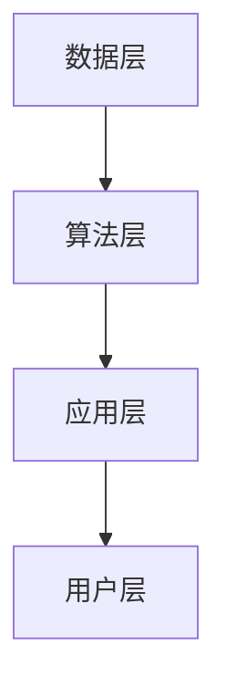
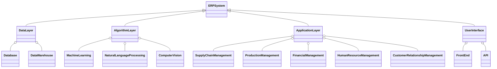

                 

### 第1章：引言

#### 1.1 问题背景

在当今全球化的商业环境中，企业面临着日益激烈的市场竞争和不断变化的经济形势。为了保持竞争优势，企业需要高效地管理其资源，包括人员、物料、资金和信息等。传统的企业资源规划（ERP）系统通过集成多个业务模块，如供应链管理、生产管理、财务管理等，帮助企业实现资源的最优化配置。然而，随着企业规模的扩大和数据量的增加，传统ERP系统逐渐暴露出其局限性，如数据处理效率低下、系统灵活性不足等。

#### 1.2 问题描述

问题描述主要集中在以下几个方面：

1. **数据孤岛**：不同部门之间的数据不能有效共享，导致信息滞后和决策失误。
2. **系统复杂性**：传统ERP系统架构复杂，难以维护和升级。
3. **决策支持**：传统ERP系统无法提供实时、准确的决策支持。
4. **适应能力**：传统ERP系统难以适应快速变化的市场需求。

#### 1.3 问题解决

为了解决上述问题，AI技术的引入成为了一种可行的方案。智能ERP系统利用AI技术，如机器学习、自然语言处理、计算机视觉等，能够提供更加智能化、自适应的解决方案，从而提升企业的运营效率和决策能力。

#### 1.4 边界与外延

智能ERP系统的边界包括以下几个方面：

1. **技术边界**：涉及AI技术的应用，如机器学习算法、自然语言处理等。
2. **业务边界**：涉及不同业务模块的集成，如供应链管理、生产管理、财务管理等。
3. **数据边界**：涉及大数据技术的应用，如数据清洗、数据挖掘等。

智能ERP系统不仅仅是一个技术工具，它还需要与企业的业务流程深度融合，才能真正发挥其价值。

#### 1.5 概念结构与核心要素组成

智能ERP系统由以下几个核心要素组成：

1. **数据层**：包括企业内部和外部的数据，如客户数据、供应链数据、财务数据等。
2. **算法层**：包括各种AI算法，如机器学习、深度学习等。
3. **应用层**：包括各种业务应用模块，如供应链管理、生产管理、财务管理等。
4. **用户层**：包括企业内部和外部的用户，如管理人员、销售人员、客户等。

智能ERP系统的结构如图1所示：



以上是智能ERP系统的基本概念和组成结构。接下来，我们将对智能ERP系统进行更详细的探讨。

### 智能ERP系统的核心概念与联系

#### 核心概念

智能ERP系统是由传统ERP系统与人工智能（AI）技术相结合的新型企业管理系统。它集成了机器学习、自然语言处理、计算机视觉等技术，能够实现自动化决策、智能推荐、实时数据分析等功能。以下是智能ERP系统的核心概念：

1. **机器学习**：通过历史数据训练模型，实现自动化预测和决策。
2. **自然语言处理（NLP）**：理解和处理人类语言，实现人机交互。
3. **计算机视觉**：对图像和视频进行理解和分析，实现自动识别和分类。
4. **数据挖掘**：从大量数据中提取有价值的信息。
5. **业务流程管理（BPM）**：优化企业业务流程，提高效率。

#### 概念属性特征对比表格

| 概念        | 属性特征                                                       |
| ----------- | ------------------------------------------------------------ |
| 机器学习    | 自动化决策、预测分析、模式识别等                           |
| 自然语言处理 | 人机交互、文本分析、语音识别等                           |
| 计算机视觉  | 图像识别、视频分析、目标检测等                           |
| 数据挖掘    | 信息提取、趋势分析、关联规则发现等                       |
| 业务流程管理 | 流程优化、资源分配、效率提升等                           |

#### ER实体关系图架构

为了更好地理解智能ERP系统的核心概念及其相互关系，我们可以使用ER（实体关系）图进行表示。以下是一个简化的ER图：

```mermaid
erDiagram
  数据层 ||--|{ 算法层 }
  算法层 ||--|{ 应用层 }
  应用层 ||--|{ 用户层 }
  
  数据层 --|{ 机器学习 }
  算法层 --|{ 自然语言处理 }
  算法层 --|{ 计算机视觉 }
  算法层 --|{ 数据挖掘 }
  应用层 --|{ 业务流程管理 }
```

通过ER图，我们可以清晰地看到各个核心概念之间的关系，以及它们在智能ERP系统中的位置和作用。这种结构化的表示方式有助于我们更好地理解和设计智能ERP系统。

### 人工智能技术在智能ERP系统中的应用

人工智能（AI）技术在智能ERP系统中扮演着至关重要的角色，它们的应用极大地提升了企业的运营效率和决策质量。以下是AI技术在智能ERP系统中的应用概述：

#### 1. 机器学习

机器学习是AI技术的重要组成部分，它在智能ERP系统中有着广泛的应用。通过机器学习算法，ERP系统能够从历史数据中学习，自动发现数据中的模式和趋势，从而实现预测分析和自动化决策。例如，在供应链管理中，机器学习算法可以预测未来几个月的需求量，帮助企业合理安排库存和生产计划。

**应用实例**：在一个制造企业中，ERP系统利用机器学习算法对历史销售数据进行分析，预测未来的需求量。通过这种预测，企业可以提前采购原材料，避免库存过剩或短缺，从而降低成本，提高生产效率。

#### 2. 自然语言处理（NLP）

自然语言处理技术使得ERP系统具备了处理和理解人类语言的能力。通过NLP技术，ERP系统可以自动处理客户订单、合同、发票等文本信息，实现自动化审批和数据分析。此外，NLP还可以用于客户服务，通过智能客服系统，提供24/7的在线支持，提高客户满意度。

**应用实例**：在一个零售企业中，ERP系统利用NLP技术处理客户反馈，自动生成报告，帮助企业识别客户需求，优化产品和服务。

#### 3. 计算机视觉

计算机视觉技术在智能ERP系统中用于图像和视频的分析，能够实现自动识别和分类。在仓储管理中，计算机视觉技术可以自动识别货物，快速完成库存盘点；在生产过程中，计算机视觉技术可以监控生产设备的运行状态，预防故障。

**应用实例**：在一个物流公司中，ERP系统利用计算机视觉技术自动识别货物，提高仓储和配送效率。通过计算机视觉技术，企业能够实时跟踪货物的位置，确保货物准确无误地送达客户手中。

#### 4. 数据挖掘

数据挖掘技术用于从大量数据中提取有价值的信息，帮助企业在决策过程中获取洞见。在财务管理中，数据挖掘技术可以分析历史财务数据，预测未来的财务状况；在人力资源管理中，数据挖掘技术可以分析员工绩效数据，为企业提供人才管理和培训的依据。

**应用实例**：在一个金融服务公司中，ERP系统利用数据挖掘技术分析客户交易数据，预测潜在的风险和欺诈行为，帮助企业制定相应的风险控制策略。

通过上述实例可以看出，人工智能技术在智能ERP系统中的应用不仅提升了企业的运营效率，还为企业提供了更准确的决策支持。随着AI技术的不断进步，智能ERP系统的应用范围将进一步扩大，为企业创造更大的价值。

### 智能ERP系统中的自然语言处理（NLP）应用

自然语言处理（NLP）作为人工智能（AI）技术的一个重要分支，在智能ERP系统中发挥着关键作用。NLP技术通过模拟人类语言处理过程，使计算机能够理解、解释和生成自然语言，从而实现人机交互和信息自动化处理。

#### NLP在智能ERP系统中的应用

NLP在智能ERP系统中的应用主要体现在以下几个方面：

1. **自动文本分析**：NLP技术可以自动分析文本信息，如客户订单、合同、发票等，提取关键信息并生成报告。这种自动化的文本分析不仅提高了数据处理的效率，还减少了人为错误。

2. **智能客服系统**：通过NLP技术，智能ERP系统可以构建智能客服系统，实现与客户的实时互动。智能客服系统能够理解客户的问题，并提供准确的答复，从而提高客户满意度。

3. **智能合同管理**：NLP技术可以自动解析合同条款，识别关键条款和条件，帮助企业在合同管理中降低风险，提高合同执行效率。

4. **语音识别**：NLP技术可以结合语音识别技术，将客户的语音转化为文本，实现语音与文本的双向交互。这种应用特别适合于客户服务场景，使得客户可以通过语音快速获得所需信息。

#### 应用实例

以某大型零售企业为例，该企业引入NLP技术优化其ERP系统。通过NLP，ERP系统能够自动处理客户订单和合同。具体应用如下：

1. **订单处理**：客户通过电子邮件或网站提交订单，NLP技术自动提取订单中的关键信息，如商品名称、数量、价格等，并生成订单确认报告。

2. **合同管理**：ERP系统利用NLP技术分析合同文本，识别关键条款，如交货日期、付款条件等。通过这种分析，企业能够及时发现潜在的风险，并采取相应的措施。

3. **智能客服**：智能客服系统通过NLP技术理解客户的问题，并快速生成回答。例如，当客户询问订单状态时，系统会自动查询订单数据库，并生成包含订单状态、预计交货日期等信息的答复。

通过NLP技术的应用，智能ERP系统能够实现高效的信息处理和自动化操作，显著提高了企业的运营效率和客户服务水平。

### 智能ERP系统中的机器学习应用

机器学习（Machine Learning，ML）作为人工智能（AI）的重要分支，在智能ERP系统中发挥着关键作用。它通过数据分析和模式识别，为企业的运营提供强大的决策支持。以下是机器学习在智能ERP系统中的具体应用：

#### 1. 预测分析

机器学习算法可以分析历史数据，识别数据中的模式，并利用这些模式进行未来预测。例如，在供应链管理中，通过机器学习算法，ERP系统可以预测未来几个月的需求量。这种预测分析帮助企业合理安排库存和生产计划，避免库存过剩或短缺。

**应用实例**：一个制造企业利用机器学习算法分析历史销售数据，预测未来的需求量。根据预测结果，企业可以提前采购原材料，减少库存成本，并确保生产计划的顺利进行。

#### 2. 自动化决策

机器学习算法能够根据历史数据和实时数据，自动做出决策。例如，在人力资源管理中，ERP系统可以利用机器学习算法自动评估员工的绩效，并根据评估结果进行晋升、调薪等决策。

**应用实例**：一家大型金融机构利用机器学习算法分析员工的绩效数据，自动生成绩效评估报告。根据评估结果，企业能够及时调整员工的工作任务和薪酬待遇，提高员工的工作积极性。

#### 3. 智能推荐

机器学习算法可以分析用户的历史行为数据，为用户推荐合适的产品或服务。例如，在电子商务中，ERP系统可以利用机器学习算法分析用户的购物习惯，推荐相关的商品。

**应用实例**：一个在线零售平台利用机器学习算法分析用户的购买历史，推荐相关的商品。这种智能推荐不仅提高了客户的购物体验，还增加了平台的销售额。

#### 4. 风险管理

机器学习算法可以帮助企业识别潜在的风险，并采取预防措施。例如，在金融行业，ERP系统可以利用机器学习算法分析客户的交易数据，预测潜在的交易风险。

**应用实例**：一家银行利用机器学习算法分析客户的交易数据，识别异常交易行为。通过这种分析，银行可以及时采取措施，防止欺诈行为的发生。

通过机器学习的应用，智能ERP系统能够为企业提供实时、准确的决策支持，提高企业的运营效率和竞争力。

### 智能ERP系统中的深度学习应用

深度学习（Deep Learning，DL）作为人工智能（AI）的一个重要分支，通过模拟人脑神经网络结构，实现了复杂模式的识别和数据的深度挖掘。在智能ERP系统中，深度学习技术的应用极大地提升了系统的智能化水平和决策能力。以下是深度学习在智能ERP系统中的具体应用：

#### 1. 供应链优化

深度学习算法可以分析供应链中的海量数据，识别供应链中的瓶颈和潜在问题，从而优化供应链管理。通过预测未来的需求变化，深度学习技术可以帮助企业更准确地安排生产和库存，减少供应链成本。

**应用实例**：一个电子产品制造企业利用深度学习算法分析历史销售数据和供应链数据，预测未来的市场需求。根据预测结果，企业优化了生产计划和库存管理，减少了原材料和库存成本。

#### 2. 生产自动化

深度学习技术在生产过程中可以用于自动化控制，例如，通过分析传感器数据，深度学习算法可以实时调整生产设备的参数，确保生产过程的稳定性和效率。

**应用实例**：一家汽车制造厂利用深度学习算法优化生产线的自动化控制。深度学习模型通过对传感器数据的分析，实时调整生产设备的运行参数，提高了生产线的生产效率。

#### 3. 质量控制

深度学习技术可以用于质量检测和故障诊断。通过分析生产过程中的数据，深度学习算法可以识别生产过程中的质量问题，提前预警并采取纠正措施。

**应用实例**：一家食品加工企业利用深度学习算法对生产过程中的数据进行分析，实时检测产品质量。通过深度学习算法的预警，企业能够及时发现和处理质量问题，确保产品质量。

#### 4. 客户行为预测

深度学习算法可以分析客户的购买行为数据，预测客户的潜在需求和偏好，从而为企业提供个性化的推荐和服务。

**应用实例**：一个电子商务平台利用深度学习算法分析客户的购物历史和浏览行为，预测客户的购买意图。根据预测结果，平台可以推荐相关的商品，提高客户的购物体验和满意度。

通过深度学习的应用，智能ERP系统不仅能够提高企业的运营效率，还能提供更加精准的决策支持，帮助企业实现数字化转型和持续创新。

### 智能ERP系统中的计算机视觉应用

计算机视觉（Computer Vision，CV）作为人工智能（AI）的一个重要分支，通过模拟人眼对图像的感知和处理能力，使得计算机能够自动分析和理解图像信息。在智能ERP系统中，计算机视觉技术的应用极大地提升了系统的智能化水平，以下是计算机视觉在智能ERP系统中的具体应用：

#### 1. 库存管理

计算机视觉技术可以用于自动识别和跟踪仓库中的库存物品。通过在仓库内安装摄像头，计算机视觉系统可以实时监控库存物品的进出库情况，自动更新库存数据。

**应用实例**：一个大型零售连锁店利用计算机视觉技术监控仓库的库存。通过摄像头和图像识别算法，系统能够自动识别货物的种类和数量，减少人工盘点的时间和错误率。

#### 2. 生产监控

计算机视觉技术可以用于生产线的监控，实时检测产品的质量，识别生产过程中出现的异常情况。

**应用实例**：一家电子产品制造企业利用计算机视觉系统监控生产线的质量。通过摄像头和图像识别算法，系统能够实时检测产品的外观和功能，确保每个产品都符合质量标准。

#### 3. 运输与配送

计算机视觉技术可以用于物流运输和配送过程中的监控，通过图像识别技术，系统能够自动识别运输车辆和货物的状态，确保物流过程的透明和高效。

**应用实例**：一家物流公司利用计算机视觉技术监控运输过程中的车辆和货物。通过摄像头和图像识别算法，系统能够实时监控货物的位置和状态，提高运输和配送的效率。

#### 4. 客户服务

计算机视觉技术可以用于客户服务的自动化，例如，通过图像识别技术，系统可以自动识别客户的身份和需求，提供个性化的服务。

**应用实例**：一个在线零售平台利用计算机视觉技术提供智能客服服务。通过摄像头和图像识别算法，系统能够自动识别客户的面部表情和提问，提供相应的回答和建议，提高客户的购物体验。

通过计算机视觉技术的应用，智能ERP系统能够实现更高效、更准确的库存管理、生产监控、运输配送和客户服务，从而提高企业的整体运营效率和客户满意度。

### AI技术在企业资源规划中的应用

人工智能（AI）技术在企业资源规划（ERP）中的应用正日益深入，通过对传统ERP系统的升级和优化，AI技术为企业带来了前所未有的运营效率和决策支持。以下是AI技术在ERP系统中的应用及其优势：

#### 1. 供应链管理

**应用**：AI技术可以优化供应链的各个环节，从需求预测、库存管理到物流调度。例如，通过机器学习算法，ERP系统可以分析历史销售数据和市场需求，预测未来几个月的需求量，从而帮助企业合理安排库存和生产计划。

**优势**：预测准确性高，减少库存成本，提高供应链响应速度。

#### 2. 生产管理

**应用**：AI技术可以用于生产过程的监控和优化，如通过计算机视觉技术监控生产线的运行状态，或利用机器学习算法优化生产流程。此外，AI还可以用于设备维护预测，通过分析设备运行数据，提前发现潜在故障，减少设备停机时间。

**优势**：提高生产效率，减少设备故障率，延长设备使用寿命。

#### 3. 财务管理

**应用**：AI技术可以用于财务数据的分析和管理，如通过自然语言处理技术自动处理财务报表，通过机器学习算法预测财务状况，及时发现潜在风险。

**优势**：提高财务数据处理的效率，减少人为错误，提升财务决策的准确性。

#### 4. 人力资源管理

**应用**：AI技术可以用于招聘、员工绩效评估和培训等方面。例如，通过机器学习算法，ERP系统可以分析简历，筛选合适的候选人；通过自然语言处理技术，系统可以评估员工的绩效，并提供培训建议。

**优势**：提高招聘和绩效评估的效率，提升员工满意度，增强企业的竞争力。

#### 5. 客户关系管理

**应用**：AI技术可以用于客户数据分析，通过分析客户的行为数据和反馈，ERP系统可以提供个性化的推荐和服务，提高客户满意度。

**优势**：提高客户服务水平，提升客户忠诚度，增加销售额。

综上所述，AI技术在ERP系统中的应用不仅提升了企业的运营效率，还为企业提供了更加精准的决策支持。随着AI技术的不断发展和应用，ERP系统将变得更加智能化和高效，为企业创造更多的价值。

### 智能ERP系统设计原则

设计智能ERP系统是一个复杂且涉及多方面考量的过程。为了确保系统的高效性和可扩展性，以下是智能ERP系统设计的一些基本原则：

#### 1. 需求分析

在系统设计之初，深入的需求分析是至关重要的。这包括了解企业的业务流程、业务需求以及未来的发展计划。需求分析不仅要涵盖当前的业务需求，还要考虑潜在的业务扩展和变化。通过与业务团队的紧密合作，设计师可以确保系统设计能够满足企业的实际需求。

#### 2. 模块化设计

模块化设计是一种将系统划分为多个独立模块的方法，每个模块负责特定的功能。这种方法有助于提高系统的可维护性和可扩展性。模块之间通过标准的接口进行通信，从而确保系统的灵活性和可适应性。例如，智能ERP系统可以划分为供应链管理模块、生产管理模块、财务管理模块等。

#### 3. 可扩展性

智能ERP系统的设计应考虑到未来的扩展需求。这意味着系统应该能够轻松地集成新的功能模块和业务流程。例如，随着企业业务的发展，系统可能需要增加新的业务功能，或者与企业外的其他系统进行集成。设计时应采用模块化和组件化的方法，确保系统能够灵活扩展。

#### 4. 易用性

易用性是智能ERP系统设计的关键因素之一。系统应提供直观的界面和用户友好的操作流程，以便用户能够轻松地使用和管理系统。例如，设计时应采用统一的风格和布局，确保用户在不同模块之间切换时能够保持一致性。

#### 5. 性能优化

性能优化是智能ERP系统设计的另一个重要方面。系统应能够快速响应用户操作，处理大量数据，并确保系统在高负载情况下仍能稳定运行。这需要通过高效的算法和数据结构设计，以及优化数据库查询来实现。

#### 6. 安全性

安全性是智能ERP系统设计中不可忽视的问题。系统设计应包括全面的安全措施，如数据加密、访问控制、身份验证等，以确保数据的机密性和完整性。此外，还应定期进行安全审计和漏洞修复，以防范潜在的安全威胁。

#### 7. 用户体验

用户体验（UX）设计在智能ERP系统中同样重要。通过用户研究和原型设计，设计师可以了解用户的需求和痛点，从而创建符合用户期望的系统界面和交互流程。良好的用户体验能够提高用户的工作效率，减少培训成本。

通过遵循上述设计原则，智能ERP系统能够更好地满足企业的需求，提升企业的运营效率，并为企业的长期发展奠定坚实的基础。

### 智能ERP系统架构设计

智能ERP系统的架构设计是确保系统高效、稳定和可扩展性的关键环节。一个良好的架构设计不仅能够满足当前的业务需求，还能够适应未来的变化和发展。以下是智能ERP系统架构设计的步骤、关键组件和整体架构。

#### 1. 系统架构设计步骤

（1）需求分析：深入了解企业的业务流程、需求和技术环境，确定系统需要实现的功能和性能要求。

（2）架构规划：根据需求分析结果，设计系统的整体架构，包括系统模块、数据流和功能分配。

（3）组件设计：细化每个模块的设计，确定组件的功能、接口和数据结构。

（4）性能优化：对系统进行性能评估，优化数据库查询、算法设计和缓存策略。

（5）安全性设计：确保系统的安全性，包括数据加密、身份验证和访问控制。

（6）用户体验设计：设计直观易用的用户界面，提高用户操作效率。

（7）测试与部署：进行全面的系统测试，确保系统符合设计要求，然后进行部署。

#### 2. 关键组件

智能ERP系统架构包括以下几个关键组件：

（1）数据层：负责存储和管理系统数据，包括关系数据库、NoSQL数据库和数据仓库。

（2）算法层：包括各种AI算法，如机器学习、自然语言处理和计算机视觉等，负责数据分析和智能决策。

（3）应用层：包括业务应用模块，如供应链管理、生产管理、财务管理等，实现具体的业务功能。

（4）用户层：包括用户界面和API接口，供用户进行操作和数据访问。

#### 3. 整体架构

智能ERP系统的整体架构可以分为以下几个层次：

（1）基础设施层：包括服务器、存储和网络设备等硬件资源，以及操作系统和中间件软件。

（2）数据层：利用关系数据库和NoSQL数据库存储和管理企业数据，同时通过数据仓库进行数据分析和报告生成。

（3）算法层：利用机器学习、自然语言处理和计算机视觉等技术，对数据进行处理和分析，提供智能决策支持。

（4）应用层：实现各个业务模块的功能，如供应链管理、生产管理、财务管理等，提供业务流程管理和数据分析工具。

（5）用户层：提供用户界面和API接口，供用户进行操作和数据访问。

通过以上架构设计，智能ERP系统可以高效地处理海量数据，提供实时、准确的决策支持，同时具备良好的扩展性和灵活性，能够适应企业的发展需求。

### 智能ERP系统功能模块设计

智能ERP系统的功能模块设计是实现系统功能的关键步骤，它决定了系统在实际应用中的灵活性和高效性。以下是智能ERP系统功能模块设计的详细步骤、领域模型类图和模块化设计思路。

#### 1. 功能模块设计步骤

（1）需求分析：深入理解企业的业务需求，确定各个功能模块的具体需求。

（2）功能定义：根据需求分析结果，定义每个功能模块的具体功能。

（3）模块划分：将系统功能划分为多个独立的模块，确保每个模块具有清晰的功能边界。

（4）接口设计：设计模块之间的接口，确保模块之间的通信和数据交换。

（5）模块实现：根据模块设计，编写代码并实现功能。

（6）模块测试：对每个模块进行单元测试和集成测试，确保模块功能正确且性能良好。

（7）模块部署：将模块部署到服务器上，确保模块能够在实际环境中运行。

#### 2. 领域模型类图

领域模型类图是智能ERP系统功能模块设计的可视化工具，它能够清晰地展示各个模块之间的关系和功能。以下是一个简化的领域模型类图：



在这个类图中，ERP系统包括数据层、算法层、应用层和用户层。每个层次包含多个子模块，如数据层包括数据库和数据仓库，算法层包括机器学习、自然语言处理和计算机视觉，应用层包括供应链管理、生产管理、财务管理、人力资源管理、客户关系管理等。

#### 3. 模块化设计思路

模块化设计是将系统功能划分为多个独立的模块，每个模块具有清晰的功能边界和接口。以下是模块化设计的几个关键点：

（1）模块独立性：每个模块应具有独立的功能和接口，确保模块之间的低耦合性。

（2）模块复用性：设计时应考虑到模块的复用性，以便在未来的系统中可以方便地替换或扩展模块。

（3）模块扩展性：设计时应考虑到模块的扩展性，确保在业务需求变化时，模块可以灵活扩展。

（4）模块测试性：设计时应确保每个模块可以单独测试，以便在系统开发过程中及时发现和修复问题。

通过模块化设计，智能ERP系统可以更加灵活地适应企业的需求变化，提高系统的可维护性和可扩展性。

### 智能ERP系统开发流程

智能ERP系统的开发流程是确保系统质量和实现功能的关键步骤。以下将从系统需求分析、系统设计、系统编码、系统测试和系统部署等方面详细描述智能ERP系统的开发流程。

#### 1. 系统需求分析

系统需求分析是智能ERP系统开发的第一步，也是最为关键的一步。在这个阶段，开发团队需要与企业的业务部门进行深入沟通，了解企业的业务流程、需求和技术环境。具体步骤如下：

（1）需求收集：通过访谈、问卷调查、文档分析等方式收集企业的业务需求。

（2）需求整理：对收集到的需求进行分类、归纳和优先级排序，确保需求的完整性。

（3）需求文档编写：将整理后的需求编写成需求文档，作为后续设计和开发的依据。

#### 2. 系统设计

系统设计阶段是根据需求文档进行系统架构设计、模块设计和接口设计。具体步骤如下：

（1）架构设计：设计系统的整体架构，包括数据层、算法层、应用层和用户层，确保系统的可扩展性和灵活性。

（2）模块设计：根据需求，将系统功能划分为多个模块，每个模块具有独立的功能和接口。

（3）接口设计：设计模块之间的接口，确保模块之间的数据通信和功能调用。

（4）设计文档编写：将设计结果编写成设计文档，作为后续编码和测试的依据。

#### 3. 系统编码

系统编码阶段是根据系统设计和设计文档进行代码编写，实现系统功能。具体步骤如下：

（1）代码编写：根据设计文档，编写各个模块的代码，实现系统的功能。

（2）代码评审：对编写的代码进行评审，确保代码的质量和符合设计要求。

（3）代码重构：根据评审结果，对代码进行重构和优化，提高代码的可读性和可维护性。

#### 4. 系统测试

系统测试阶段是验证系统功能是否正确、性能是否满足要求的重要环节。具体步骤如下：

（1）单元测试：对每个模块进行单元测试，确保模块功能的正确性。

（2）集成测试：对系统进行集成测试，确保模块之间的接口和数据通信的正确性。

（3）系统测试：对整个系统进行测试，包括功能测试、性能测试、安全测试等，确保系统整体的质量。

（4）回归测试：在每次修改后，进行回归测试，确保修改没有引入新的问题。

#### 5. 系统部署

系统部署阶段是将开发完成的智能ERP系统部署到生产环境中，使其能够正常运行。具体步骤如下：

（1）环境准备：准备服务器、数据库和其他相关软件环境。

（2）部署配置：将系统部署到服务器上，并进行相应的配置。

（3）数据迁移：将现有数据迁移到新系统中，确保数据的完整性和一致性。

（4）上线测试：在部署后，进行上线测试，确保系统在实际运行环境中的稳定性。

（5）用户培训：对用户进行培训，确保用户能够熟练使用系统。

通过以上开发流程，智能ERP系统可以高效地完成从需求分析到系统部署的整个过程，确保系统的质量和功能的实现。

### 智能ERP系统测试与部署

在智能ERP系统的开发过程中，测试与部署是确保系统质量和稳定运行的关键环节。以下是智能ERP系统测试与部署的详细步骤。

#### 1. 测试阶段

（1）单元测试：对系统中的各个功能模块进行单独测试，确保每个模块的功能正确性。

（2）集成测试：将各个功能模块组合在一起，进行集成测试，确保模块之间的接口和数据通信正确。

（3）系统测试：对整个系统进行全面测试，包括功能测试、性能测试、安全测试等，确保系统整体的质量。

（4）回归测试：在每次修改后，进行回归测试，确保修改没有引入新的问题。

#### 2. 部署阶段

（1）环境准备：准备服务器、数据库和其他相关软件环境，确保系统运行的基础设施。

（2）部署配置：将系统部署到服务器上，并进行相应的配置，包括网络设置、权限配置等。

（3）数据迁移：将现有数据迁移到新系统中，确保数据的完整性和一致性。

（4）上线测试：在部署后，进行上线测试，确保系统在实际运行环境中的稳定性。

（5）用户培训：对用户进行培训，确保用户能够熟练使用系统。

#### 3. 具体步骤

（1）编写测试计划：根据系统需求和设计文档，编写详细的测试计划，明确测试目标、测试方法、测试用例等。

（2）执行测试用例：按照测试计划，执行各个测试用例，记录测试结果。

（3）缺陷管理：对测试过程中发现的缺陷进行记录、分类、分配和跟踪，确保缺陷得到及时修复。

（4）环境搭建：准备测试环境，包括服务器、数据库、网络等，确保测试环境的可复现性。

（5）自动化测试：编写自动化测试脚本，对系统进行自动化测试，提高测试效率和覆盖范围。

（6）部署前检查：在系统部署前，对系统进行全面的检查，包括代码审查、配置检查等，确保系统部署的顺利进行。

（7）部署：根据部署计划，将系统部署到生产环境中，确保系统的稳定运行。

（8）监控与维护：在系统上线后，对系统进行实时监控和维护，确保系统的稳定性和性能。

通过上述步骤，智能ERP系统可以确保在测试和部署过程中发现和解决问题，提高系统的质量和可靠性。

### 智能供应链管理系统案例

智能供应链管理系统是智能ERP系统的重要组成部分，通过AI技术的应用，实现了供应链管理的智能化和高效化。以下是一个智能供应链管理系统的实际案例，详细描述了系统的需求场景、实现过程和项目效果。

#### 1. 需求场景

某大型零售企业面临以下供应链管理问题：

- **库存管理**：库存水平不透明，难以实时监控，导致库存过剩或短缺。
- **需求预测**：依赖经验进行需求预测，预测准确性低，导致采购和生产计划的制定不够科学。
- **物流优化**：物流配送效率低，运输成本高，且无法实时跟踪货物运输状态。
- **风险管理**：供应链中存在潜在的风险，如供应商不可靠、物流延迟等，缺乏有效的预警机制。

#### 2. 实现过程

（1）需求分析

通过对企业的供应链管理需求进行深入分析，确定智能供应链管理系统需要实现以下功能：

- **库存管理**：实时监控库存水平，实现库存预警。
- **需求预测**：利用机器学习算法，根据历史销售数据和市场趋势，进行精准的需求预测。
- **物流优化**：优化物流路线和配送计划，降低运输成本。
- **风险管理**：构建风险预警模型，提前识别和应对供应链风险。

（2）系统设计

根据需求分析结果，智能供应链管理系统的架构设计包括以下几个模块：

- **数据层**：包括关系数据库和NoSQL数据库，用于存储供应链相关数据。
- **算法层**：包括机器学习算法、自然语言处理算法等，用于数据处理和智能分析。
- **应用层**：包括库存管理、需求预测、物流优化和风险管理等模块，实现具体的业务功能。
- **用户层**：包括用户界面和API接口，供用户进行操作和数据访问。

（3）系统实现

- **库存管理模块**：通过实时数据采集，如RFID、传感器等，获取库存信息，并利用数据库进行存储。系统采用实时数据分析和预警机制，当库存水平低于设定阈值时，自动触发预警。
- **需求预测模块**：利用机器学习算法，对历史销售数据进行分析，结合市场趋势，预测未来几个月的需求量。预测结果用于指导采购和生产计划的制定。
- **物流优化模块**：结合物流数据和地图信息，利用算法优化物流路线和配送计划。系统可以实时跟踪货物运输状态，确保物流配送的透明和高效。
- **风险管理模块**：通过自然语言处理技术，分析供应链中的文本信息，如合同、公告等，识别潜在风险。同时，利用机器学习算法，构建风险预警模型，提前预警并采取相应措施。

（4）系统测试与部署

在系统开发完成后，进行全面的测试和部署。测试包括单元测试、集成测试和系统测试，确保系统的功能正确性和性能。测试完成后，系统部署到生产环境中，并进行了上线测试，确保系统在实际运行环境中的稳定性。

#### 3. 项目效果

智能供应链管理系统的实施，带来了显著的效果：

- **库存管理**：通过实时监控和预警机制，企业实现了库存水平透明化，降低了库存过剩和短缺的风险，提高了库存周转率。
- **需求预测**：预测准确性显著提高，采购和生产计划的制定更加科学，减少了库存成本和缺货率。
- **物流优化**：物流配送效率提高，运输成本降低，客户满意度提升。
- **风险管理**：风险预警机制有效，企业能够提前识别和应对潜在风险，保障供应链的稳定性。

通过智能供应链管理系统的实施，企业实现了供应链管理的智能化和高效化，提升了运营效率和竞争力。

### 智能生产管理系统案例

智能生产管理系统是智能ERP系统中的关键模块，通过AI技术的应用，实现了生产过程的自动化和优化。以下是一个智能生产管理系统的实际案例，详细描述了系统的需求场景、实现过程和项目效果。

#### 1. 需求场景

某大型制造业企业面临以下生产管理问题：

- **生产计划**：生产计划制定不够科学，导致生产资源浪费和效率低下。
- **生产监控**：生产过程中的数据采集和监控不足，难以实时掌握生产状态。
- **设备维护**：设备维护不够及时，故障率高，影响了生产线的稳定运行。
- **质量管理**：产品质量监控不足，质量问题频发，影响了企业的品牌形象和市场份额。

#### 2. 实现过程

（1）需求分析

通过对企业的生产管理需求进行深入分析，确定智能生产管理系统需要实现以下功能：

- **生产计划**：根据市场需求和原材料库存，智能生成科学合理的生产计划。
- **生产监控**：实时采集生产数据，监控生产过程，确保生产进度和质量。
- **设备维护**：通过数据分析和预测，实现设备维护的自动化和智能化。
- **质量管理**：实时监控产品质量，识别和解决质量问题，提升产品质量。

（2）系统设计

根据需求分析结果，智能生产管理系统的架构设计包括以下几个模块：

- **数据层**：包括关系数据库和物联网设备，用于存储和处理生产相关数据。
- **算法层**：包括机器学习算法、自然语言处理算法等，用于数据分析和智能决策。
- **应用层**：包括生产计划、生产监控、设备维护和质量管理等模块，实现具体的业务功能。
- **用户层**：包括用户界面和API接口，供用户进行操作和数据访问。

（3）系统实现

- **生产计划模块**：利用机器学习算法，对市场需求、原材料库存和生产线负荷进行分析，生成科学合理的生产计划。生产计划可以灵活调整，以应对市场变化。
- **生产监控模块**：通过物联网设备实时采集生产数据，如设备状态、生产进度、产品质量等。系统可以实时监控生产状态，确保生产进度和质量。
- **设备维护模块**：通过数据分析和预测，提前识别设备故障风险，制定维护计划。系统可以自动调度维护人员，确保设备按时维护，减少故障率和停机时间。
- **质量管理模块**：通过实时监控产品质量，识别和解决质量问题。系统可以自动记录质量问题，生成质量报告，为企业提供质量改进的依据。

（4）系统测试与部署

在系统开发完成后，进行全面的测试和部署。测试包括单元测试、集成测试和系统测试，确保系统的功能正确性和性能。测试完成后，系统部署到生产环境中，并进行了上线测试，确保系统在实际运行环境中的稳定性。

#### 3. 项目效果

智能生产管理系统的实施，带来了显著的效果：

- **生产计划**：生产计划科学合理，生产资源利用率提高，生产效率提升。
- **生产监控**：生产过程数据实时监控，生产进度和质量得到有效保障。
- **设备维护**：设备维护及时，故障率降低，生产线的稳定性提高。
- **质量管理**：产品质量监控严格，质量问题得到及时解决，产品质量提升。

通过智能生产管理系统的实施，企业实现了生产过程的自动化和优化，提升了生产效率和产品质量，增强了企业的竞争力。

### 智能人力资源管理系统案例

智能人力资源管理系统是智能ERP系统的重要组成部分，通过AI技术的应用，实现了人力资源管理过程的智能化和高效化。以下是一个智能人力资源管理系统（HRMS）的实际案例，详细描述了系统的需求场景、实现过程和项目效果。

#### 1. 需求场景

某大型跨国公司面临以下人力资源管理问题：

- **招聘管理**：招聘流程繁琐，招聘周期长，难以快速响应市场变化。
- **员工绩效管理**：绩效评估不够科学，缺乏有效的绩效反馈机制，员工积极性不高。
- **培训与开发**：培训计划制定不合理，培训效果评估困难，员工技能提升缓慢。
- **薪酬管理**：薪酬体系不够透明，薪酬分配不合理，员工满意度低。

#### 2. 实现过程

（1）需求分析

通过对企业的人力资源管理需求进行深入分析，确定智能HRMS需要实现以下功能：

- **招聘管理**：自动化招聘流程，提高招聘效率。
- **员工绩效管理**：智能评估员工绩效，提供有效的绩效反馈。
- **培训与开发**：自动生成培训计划，实时评估培训效果。
- **薪酬管理**：透明化薪酬体系，确保薪酬分配公平合理。

（2）系统设计

根据需求分析结果，智能HRMS的架构设计包括以下几个模块：

- **数据层**：包括关系数据库和NoSQL数据库，用于存储和处理人力资源管理相关数据。
- **算法层**：包括机器学习算法、自然语言处理算法等，用于数据处理和智能决策。
- **应用层**：包括招聘管理、员工绩效管理、培训与开发、薪酬管理等模块，实现具体的业务功能。
- **用户层**：包括用户界面和API接口，供用户进行操作和数据访问。

（3）系统实现

- **招聘管理模块**：利用机器学习算法，分析简历内容，筛选合适的候选人。系统可以自动化发送面试通知，并利用自然语言处理技术分析面试结果，提高招聘效率。
- **员工绩效管理模块**：通过数据分析和模型评估，生成详细的绩效报告。系统可以自动生成绩效反馈，帮助员工了解自己的表现，并提供改进建议。
- **培训与开发模块**：根据员工岗位和技能需求，自动生成培训计划。系统可以实时记录培训过程和效果，为企业提供培训评估的依据。
- **薪酬管理模块**：利用数据分析和算法，确保薪酬分配的公平合理。系统可以自动计算薪酬，并提供薪酬调整建议。

（4）系统测试与部署

在系统开发完成后，进行全面的测试和部署。测试包括单元测试、集成测试和系统测试，确保系统的功能正确性和性能。测试完成后，系统部署到生产环境中，并进行了上线测试，确保系统在实际运行环境中的稳定性。

#### 3. 项目效果

智能HRMS的实施，带来了显著的效果：

- **招聘管理**：招聘流程自动化，招聘周期缩短，招聘效率提高。
- **员工绩效管理**：绩效评估科学合理，绩效反馈及时有效，员工积极性提升。
- **培训与开发**：培训计划科学合理，培训效果评估准确，员工技能提升显著。
- **薪酬管理**：薪酬体系透明化，薪酬分配公平合理，员工满意度提升。

通过智能HRMS的实施，企业实现了人力资源管理过程的智能化和高效化，提升了人力资源管理水平和员工满意度，增强了企业的竞争力。

### 智能财务管理系统案例

智能财务管理系统是智能ERP系统的重要组成部分，通过AI技术的应用，实现了财务管理过程的智能化和高效化。以下是一个智能财务管理系统的实际案例，详细描述了系统的需求场景、实现过程和项目效果。

#### 1. 需求场景

某大型跨国公司面临以下财务管理问题：

- **会计核算**：会计核算流程繁琐，数据处理效率低，错误率高。
- **财务预测**：财务预测不够准确，难以为企业决策提供有效支持。
- **成本管理**：成本管理不够精细，难以实现成本优化。
- **风险管理**：风险管理不足，难以应对财务风险。

#### 2. 实现过程

（1）需求分析

通过对企业的财务管理需求进行深入分析，确定智能财务管理系统需要实现以下功能：

- **会计核算**：自动化会计核算流程，提高数据处理效率和准确性。
- **财务预测**：利用机器学习算法，准确预测财务数据，为企业决策提供支持。
- **成本管理**：精细化成本管理，实现成本优化。
- **风险管理**：构建风险预警模型，提前识别和应对财务风险。

（2）系统设计

根据需求分析结果，智能财务管理系统的架构设计包括以下几个模块：

- **数据层**：包括关系数据库和NoSQL数据库，用于存储和处理财务管理相关数据。
- **算法层**：包括机器学习算法、自然语言处理算法等，用于数据处理和智能决策。
- **应用层**：包括会计核算、财务预测、成本管理和风险管理等模块，实现具体的业务功能。
- **用户层**：包括用户界面和API接口，供用户进行操作和数据访问。

（3）系统实现

- **会计核算模块**：利用自然语言处理技术，自动处理会计凭证和账单，生成会计报表。系统可以实时更新财务数据，提高数据处理效率和准确性。
- **财务预测模块**：利用机器学习算法，分析历史财务数据和市场趋势，预测未来财务数据。预测结果可以用于指导企业财务决策，提高决策的准确性和科学性。
- **成本管理模块**：通过数据分析和算法优化，实现成本精细化管理和优化。系统可以实时监控成本变动，提供成本分析和报告，帮助企业制定成本控制策略。
- **风险管理模块**：构建风险预警模型，通过分析财务数据和风险指标，提前识别潜在风险。系统可以自动生成风险报告，并提供风险应对建议，帮助企业有效管理财务风险。

（4）系统测试与部署

在系统开发完成后，进行全面的测试和部署。测试包括单元测试、集成测试和系统测试，确保系统的功能正确性和性能。测试完成后，系统部署到生产环境中，并进行了上线测试，确保系统在实际运行环境中的稳定性。

#### 3. 项目效果

智能财务管理系统的实施，带来了显著的效果：

- **会计核算**：自动化会计核算流程，提高了数据处理效率和准确性，减少了人为错误。
- **财务预测**：预测准确性提高，为企业决策提供了有力的支持，提高了决策的科学性。
- **成本管理**：成本管理精细化，实现了成本优化，降低了企业的运营成本。
- **风险管理**：风险预警机制有效，提前识别和应对了潜在财务风险，保障了企业的财务安全。

通过智能财务管理系统的实施，企业实现了财务管理过程的智能化和高效化，提升了财务管理水平和决策能力，增强了企业的竞争力。

### 智能客户关系管理系统案例

智能客户关系管理系统（CRM）是智能ERP系统中的关键模块，通过AI技术的应用，实现了客户服务的智能化和个性化。以下是一个智能CRM系统的实际案例，详细描述了系统的需求场景、实现过程和项目效果。

#### 1. 需求场景

某大型跨国公司面临以下客户服务问题：

- **客户数据分析**：客户数据分散，难以进行有效分析，无法精准了解客户需求。
- **客户服务**：客户服务响应速度慢，服务质量不高，客户满意度低。
- **销售预测**：销售预测不准确，影响了销售策略的制定和执行。
- **客户体验**：客户体验不佳，投诉率较高，影响了品牌形象。

#### 2. 实现过程

（1）需求分析

通过对公司的客户服务需求进行深入分析，确定智能CRM系统需要实现以下功能：

- **客户数据分析**：通过大数据分析和机器学习，深入挖掘客户数据，精准了解客户需求。
- **客户服务**：自动化客户服务流程，提高服务效率和客户满意度。
- **销售预测**：利用机器学习算法，预测销售趋势，为销售策略提供数据支持。
- **客户体验**：提供个性化服务，提升客户体验，降低投诉率。

（2）系统设计

根据需求分析结果，智能CRM系统的架构设计包括以下几个模块：

- **数据层**：包括关系数据库和NoSQL数据库，用于存储和处理客户相关数据。
- **算法层**：包括机器学习算法、自然语言处理算法等，用于数据分析和智能决策。
- **应用层**：包括客户数据分析、客户服务、销售预测和客户体验等模块，实现具体的业务功能。
- **用户层**：包括用户界面和API接口，供用户进行操作和数据访问。

（3）系统实现

- **客户数据分析模块**：通过大数据分析和机器学习算法，分析客户行为数据，如浏览记录、购买历史等，精准了解客户需求。系统可以生成详细的客户画像，帮助企业制定个性化的营销策略。
- **客户服务模块**：利用自然语言处理技术和机器人客服，自动化处理客户咨询和投诉。系统可以24/7在线服务，提高客户服务的响应速度和效率，提升客户满意度。
- **销售预测模块**：利用机器学习算法，分析历史销售数据和市场趋势，预测未来销售趋势。预测结果可以用于指导销售策略的制定和调整，提高销售准确性。
- **客户体验模块**：通过个性化推荐和服务，提升客户体验。系统可以根据客户喜好和需求，提供个性化的产品推荐和服务，降低投诉率，增强客户忠诚度。

（4）系统测试与部署

在系统开发完成后，进行全面的测试和部署。测试包括单元测试、集成测试和系统测试，确保系统的功能正确性和性能。测试完成后，系统部署到生产环境中，并进行了上线测试，确保系统在实际运行环境中的稳定性。

#### 3. 项目效果

智能CRM系统的实施，带来了显著的效果：

- **客户数据分析**：通过大数据分析和机器学习，公司能够更精准地了解客户需求，提高了营销效果。
- **客户服务**：自动化客户服务流程，提高了服务效率和客户满意度，客户投诉率显著下降。
- **销售预测**：预测准确性提高，为销售策略提供了有力的数据支持，提高了销售业绩。
- **客户体验**：个性化服务和推荐，提升了客户体验，增强了客户忠诚度，为公司赢得了更多的市场份额。

通过智能CRM系统的实施，公司实现了客户服务的智能化和个性化，提升了客户满意度和忠诚度，增强了企业的竞争力。

### AI在ERP系统中的挑战与解决方案

尽管AI技术在ERP系统中展现了巨大的潜力，但其实际应用仍面临诸多挑战。以下是AI在ERP系统中的一些主要挑战及其解决方案。

#### 1. 数据隐私与安全问题

**挑战**：ERP系统中存储了大量的敏感数据，包括财务信息、客户数据和员工信息。AI技术的应用可能带来数据泄露和安全风险。

**解决方案**：企业应实施严格的数据加密措施，确保数据在传输和存储过程中得到保护。此外，采用多因素认证、访问控制等技术，加强系统的安全性。同时，制定明确的数据隐私政策，确保用户知情权和个人数据的保护。

#### 2. 数据质量与准确性问题

**挑战**：AI系统依赖于高质量的数据进行分析和决策。数据质量差或准确性不足，可能导致错误的分析结果和决策。

**解决方案**：建立完善的数据质量管理机制，定期进行数据清洗和更新。采用数据验证和校验技术，确保数据的准确性和一致性。此外，引入数据治理工具，实现数据的标准化和规范化管理。

#### 3. AI算法的透明性与可解释性问题

**挑战**：AI算法的黑盒性质可能导致决策过程的不可解释性，给企业带来信任危机。

**解决方案**：开发可解释的AI模型，使得企业能够理解和追踪决策过程。使用可视化和解释工具，帮助企业解释AI算法的决策依据。同时，建立算法审计和透明性评估机制，确保算法的公正性和合规性。

#### 4. 技术更新与维护问题

**挑战**：AI技术更新速度快，ERP系统需要不断进行技术升级和维护，以保持其先进性和竞争力。

**解决方案**：采用模块化设计和微服务架构，使系统易于升级和维护。建立敏捷的开发和部署流程，确保系统能够快速响应技术变化。此外，引入自动化工具，提高系统的自动化测试和部署效率。

#### 5. 跨部门协作与组织文化问题

**挑战**：AI在ERP系统中的应用涉及多个部门，需要跨部门协作。同时，组织文化可能对AI技术的接受度较低，影响技术的落地实施。

**解决方案**：建立跨部门协作机制，明确各部门的职责和角色。通过培训和教育，提高员工对AI技术的认识和接受度。同时，营造开放和创新的组织文化，鼓励员工尝试和接受新技术。

通过上述解决方案，企业可以有效应对AI在ERP系统中的应用挑战，确保技术的顺利实施和持续发展。

### 智能ERP系统的未来发展趋势

随着人工智能（AI）技术的不断进步，智能ERP系统正朝着更加智能化、数字化和平台化的方向迅速发展。以下是对智能ERP系统未来发展趋势的探讨：

#### 1. 新技术的应用前景

**深度学习和大数据**：深度学习算法在智能ERP系统中将得到更广泛的应用，如用于复杂的业务预测和智能决策。同时，大数据技术的应用将进一步提升数据分析和处理的效率，为企业提供更丰富的洞见。

**区块链技术**：区块链技术的引入将增强ERP系统的数据安全性和透明度，特别是在财务管理、供应链管理和客户关系管理等方面。区块链的不可篡改性将有助于防止数据篡改和欺诈行为。

**物联网（IoT）**：物联网技术的普及将使得ERP系统能够更好地集成和利用各种传感器数据，实现实时监控和自动化控制，从而提升生产效率和管理水平。

#### 2. 智能化与数字化转型的深入融合

**智能化**：未来的智能ERP系统将更加智能化，通过自主学习、自适应调整和智能预测，为企业提供更精准的决策支持。例如，智能ERP系统将能够根据市场趋势和客户需求，自动调整生产和库存计划。

**数字化转型**：智能ERP系统将推动企业的数字化转型，实现业务流程的全面数字化和自动化。企业将能够通过统一的数字化平台，实现数据的高效共享和协同工作，提高整体运营效率。

#### 3. ERP系统的云化与平台化

**云化**：随着云计算技术的成熟，越来越多的智能ERP系统将采用云架构，实现更灵活的部署和更高的可扩展性。云化ERP系统将使得企业能够快速响应市场需求，降低IT成本。

**平台化**：智能ERP系统将向平台化方向发展，不仅为企业内部提供统一的管理平台，还可以为外部合作伙伴提供开放的应用接口，实现跨企业的业务协同。平台化ERP系统将有助于企业实现更广泛的业务生态合作。

#### 4. 跨行业与跨领域的应用探索

**跨行业应用**：智能ERP系统将不断拓展其应用范围，从传统的制造业、零售业扩展到金融、医疗、教育等多个行业，为不同行业提供定制化的解决方案。

**跨领域应用**：智能ERP系统将融合更多跨领域的先进技术，如人工智能、区块链、物联网等，实现更全面的业务覆盖和更深层次的智能化应用。

综上所述，智能ERP系统的未来发展将更加智能化、数字化和平台化，通过新技术的应用和跨行业的融合，为企业带来更高效、更智能的管理体验。

### 智能ERP系统的人才培养与技能提升

智能ERP系统的成功实施与运行离不开专业人才的培养和技能提升。以下是一些关键领域的技能需求和提升策略：

#### 1. 数据科学技能

**技能需求**：数据科学家和分析师需要熟练掌握机器学习、数据挖掘和统计分析等技能，能够从海量数据中提取有价值的信息。

**提升策略**：参加数据科学相关的在线课程和专业培训，如Coursera、Udacity和edX等平台提供的课程。同时，通过实际项目经验，如参与数据竞赛或内部项目，提升数据分析和建模能力。

#### 2. AI与机器学习技能

**技能需求**：AI工程师和开发人员需要熟悉深度学习、自然语言处理和计算机视觉等AI技术，能够将AI模型集成到ERP系统中。

**提升策略**：学习TensorFlow、PyTorch等深度学习框架，参与AI相关的在线课程和专业培训，如Google的AI课程。此外，通过开源项目和社区合作，提升AI技术的实际应用能力。

#### 3. ERP系统专业知识

**技能需求**：ERP系统实施和管理人员需要深入了解ERP系统的架构、功能模块和业务流程，能够根据企业需求进行系统配置和优化。

**提升策略**：参加ERP系统相关的培训和认证课程，如SAP、Oracle等提供的认证课程。通过实际项目经验，提高系统实施和管理能力。

#### 4. 数据工程技能

**技能需求**：数据工程师需要具备数据存储、数据清洗、数据建模和数据流管理等方面的技能，确保数据的准确性和可用性。

**提升策略**：学习Apache Spark、Hadoop等大数据处理技术，参加相关的培训课程。通过参与大数据项目，提升数据处理和管理能力。

#### 5. 信息技术与管理技能

**技能需求**：IT经理和项目经理需要具备项目管理、团队协作和业务分析等综合技能，能够协调不同部门和团队，确保项目的顺利进行。

**提升策略**：参加项目管理相关的培训课程，如PMP认证。通过参与实际项目，提高项目管理和团队协作能力。

通过上述策略，企业和个人可以不断提升相关技能，为智能ERP系统的成功实施和运营打下坚实的基础。

### 附录

#### A. 术语表

- **ERP**：企业资源规划（Enterprise Resource Planning）系统，用于整合企业管理中各个模块的数据和流程。
- **AI**：人工智能（Artificial Intelligence），通过模拟人类智能行为，实现自动化决策和数据分析。
- **NLP**：自然语言处理（Natural Language Processing），用于理解和生成自然语言。
- **ML**：机器学习（Machine Learning），通过数据分析和模式识别，实现自动化决策和预测。
- **DL**：深度学习（Deep Learning），基于多层神经网络，实现复杂的数据分析和模式识别。
- **IoT**：物联网（Internet of Things），将物理设备通过互联网连接，实现数据交换和自动化控制。

#### B. 参考文献

1. Murphy, K.P. (2012). Machine Learning: A Probabilistic Perspective. MIT Press.
2. Russell, S., & Norvig, P. (2020). Artificial Intelligence: A Modern Approach. Prentice Hall.
3.哂井, 関. (2016). 自然言語処理. 東京: 牧ラ书房.
4. 关于ERP系统的更多信息，请参阅：https://www.sap.com/digital_assets/insights/blogs/erp-overview-101.html
5. 有关AI技术的详细介绍，请参阅：https://www.ibm.com/zh-cn/topics/artificial-intelligence

#### C. 相关资源

- **在线课程**：
  - Coursera: https://www.coursera.org/
  - Udacity: https://www.udacity.com/
  - edX: https://www.edx.org/

- **开源项目**：
  - TensorFlow: https://www.tensorflow.org/
  - PyTorch: https://pytorch.org/

- **专业论坛**：
  - Stack Overflow: https://stackoverflow.com/
  - GitHub: https://github.com/

这些资源可以帮助读者进一步了解智能ERP系统和AI技术的相关知识和应用实践。

