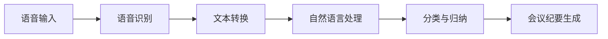
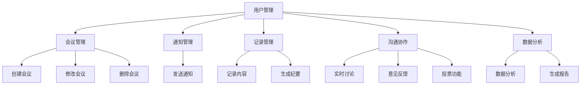
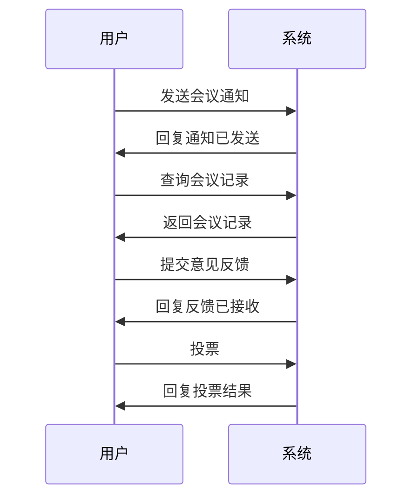

                 

### 智能会议助手系统：AI提升沟通效率

#### 关键词

- 智能会议助手
- 人工智能
- 自然语言处理
- 沟通效率
- 语音识别
- 语音合成

#### 摘要

本文旨在探讨智能会议助手系统的应用及其对提升沟通效率的重要性。通过引入人工智能技术，智能会议助手系统能够自动处理会议通知、记录、沟通和数据分析，从而解决传统会议中存在的诸多问题。本文将详细介绍智能会议助手系统的背景、核心概念、算法原理、数学模型、系统设计与实现，并通过实际案例进行分析，为企业和组织提供智能化会议管理的解决方案。

#### 第一部分：智能会议助手系统概述

##### 第1章：智能会议助手系统背景介绍

##### 1.1 问题背景

在现代社会，会议已成为企业和组织中日常运作中不可或缺的一部分。然而，传统会议往往伴随着时间浪费、效率低下、沟通障碍等问题。为了提升会议效率，减少不必要的沟通成本，智能会议助手系统应运而生。

##### 1.2 问题描述

传统会议存在的问题主要包括：

- **时间浪费**：会议冗长、议题重复、决策缓慢。
- **沟通障碍**：信息传递不畅、意见不统一、记录不全面。
- **资源浪费**：人力、物力、时间等资源浪费。

##### 1.3 问题解决

智能会议助手系统旨在通过引入人工智能技术，解决传统会议中的痛点。系统功能包括：

- **会议通知与提醒**：自动发送会议通知、提醒参会人员。
- **会议记录与归纳**：自动记录会议内容、归纳重点，形成会议纪要。
- **实时沟通与协作**：支持实时讨论、意见反馈、投票等功能。
- **数据分析与报告**：对会议数据进行分析，生成报告，辅助决策。

##### 1.4 边界与外延

智能会议助手系统不仅适用于企业内部，还可以扩展应用于政府、教育、医疗等多个领域。

##### 1.5 概念结构与核心要素组成

智能会议助手系统的核心要素包括：

- **用户管理**：管理参会人员信息、权限设置。
- **会议管理**：创建、修改、删除会议，设置会议时间、地点等。
- **通知管理**：发送会议通知、提醒信息。
- **记录管理**：记录会议内容、生成会议纪要。
- **沟通协作**：支持实时沟通、协作讨论。
- **数据分析**：对会议数据进行分析，生成报告。

##### 第2章：智能会议助手系统核心概念与联系

##### 2.1 核心概念原理

智能会议助手系统的核心概念包括：

- **人工智能**：模拟、延伸和扩展人的智能。
- **自然语言处理**：使计算机能够理解、解释和生成自然语言。
- **语音识别**：将语音信号转换为文本。
- **语音合成**：将文本转换为语音。

##### 2.2 概念属性特征对比表格

| 概念         | 特征                                   |
| ------------ | -------------------------------------- |
| 人工智能     | 模拟、延伸和扩展人的智能               |
| 自然语言处理 | 计算机理解、解释和生成自然语言         |
| 语音识别     | 语音信号转换为文本                     |
| 语音合成     | 文本转换为语音                         |

##### 2.3 ER实体关系图架构

```mermaid
erDiagram
    User ||--|{ Meeting: 参与者关系 }
    Meeting ||--|{ Agenda: 议程关系 }
    Meeting ||--|{ Minutes: 纪要关系 }
    Agenda ||--|{ Item: 议程项关系 }
    Minutes ||--|{ ActionItem: 行动项关系 }
```

##### 第3章：智能会议助手系统算法原理讲解

##### 3.1 算法原理

智能会议助手系统主要依赖于以下算法：

- **语音识别算法**：用于将语音转换为文本。
- **自然语言处理算法**：用于理解、解释和生成自然语言。
- **文本分类算法**：用于对会议记录进行分类和归纳。

##### 3.2 算法流程图



##### 3.3 数学模型和公式

语音识别算法的数学模型可以表示为：

$$
H = \log(P(O|H) / P(H))
$$

其中，$H$ 表示隐藏状态，$O$ 表示观测状态。

##### 3.4 举例说明

假设我们有一个语音输入“明天下午2点开会”，经过语音识别后转换为文本，然后通过自然语言处理得到会议时间、地点和议题。最终生成的会议纪要如下：

```
会议时间：明天下午2点
会议地点：公司会议室
议题：项目进展汇报与问题讨论
```

##### 第4章：智能会议助手系统数学模型和公式讲解

##### 4.1 数学模型

智能会议助手系统中的自然语言处理部分通常采用基于深度学习的模型，如循环神经网络（RNN）、长短时记忆网络（LSTM）或门控循环单元（GRU）。这些模型的数学基础主要包括：

- **激活函数**：用于将线性函数转化为非线性函数，如ReLU、Sigmoid、Tanh等。
- **反向传播算法**：用于计算模型参数的梯度，以优化模型。

##### 4.2 数学公式

激活函数的数学公式可以表示为：

$$
a(x) = \max(0, x)
$$

其中，$a(x)$ 表示激活函数的输出，$x$ 表示输入。

反向传播算法的数学公式可以表示为：

$$
\delta_j = \frac{\partial L}{\partial z_j}
$$

其中，$\delta_j$ 表示第 $j$ 个神经元的误差，$L$ 表示损失函数，$z_j$ 表示第 $j$ 个神经元的输入。

##### 4.3 举例说明

假设我们有一个神经网络，其中包含一个输入层、一个隐藏层和一个输出层。输入层有3个神经元，隐藏层有4个神经元，输出层有2个神经元。假设隐藏层的激活函数为ReLU，输出层的激活函数为Sigmoid。我们使用反向传播算法来优化模型的参数。

首先，我们定义损失函数为交叉熵损失函数：

$$
L = -\sum_{i=1}^{n} y_i \log(p_i)
$$

其中，$y_i$ 表示第 $i$ 个样本的真实标签，$p_i$ 表示第 $i$ 个样本的预测概率。

然后，我们计算每个神经元的误差：

$$
\delta_j = \frac{\partial L}{\partial z_j}
$$

最后，我们使用梯度下降算法来更新模型的参数：

$$
w_j = w_j - \alpha \cdot \delta_j
$$

其中，$w_j$ 表示第 $j$ 个神经元的权重，$\alpha$ 表示学习率。

##### 第5章：智能会议助手系统设计与实现

##### 5.1 系统设计与实现

智能会议助手系统的设计与实现可以分为以下几个步骤：

1. **需求分析**：分析用户的需求，确定系统功能与性能要求。
2. **系统设计**：设计系统的架构、模块、数据库等。
3. **界面设计**：设计用户界面，确保用户体验。
4. **代码实现**：编写代码，实现系统功能。
5. **测试与优化**：测试系统功能，优化性能。

##### 5.2 系统架构设计

智能会议助手系统的架构设计如图所示：



##### 5.3 系统接口设计与实现

智能会议助手系统的接口设计与实现包括以下几个部分：

1. **用户接口**：提供用户登录、注册、权限管理等接口。
2. **会议接口**：提供会议创建、修改、删除、查询等接口。
3. **通知接口**：提供通知发送、查询、删除等接口。
4. **记录接口**：提供记录创建、修改、删除、查询等接口。
5. **协作接口**：提供实时讨论、意见反馈、投票等接口。
6. **数据分析接口**：提供数据分析、报告生成等接口。

以下是用户接口的一个示例：

```python
class UserController:
    def login(self, username, password):
        # 登录逻辑
        pass
    
    def register(self, username, password):
        # 注册逻辑
        pass
    
    def check_permission(self, user, permission):
        # 权限检查逻辑
        pass
```

##### 5.4 系统交互设计

智能会议助手系统的交互设计如图所示：



##### 第6章：项目实战

##### 6.1 环境安装

在开始项目实战之前，我们需要安装以下软件和工具：

- Python 3.x
- Anaconda
- Jupyter Notebook
- TensorFlow
- Keras

安装步骤如下：

1. 安装 Python 3.x
2. 安装 Anaconda
3. 安装 Jupyter Notebook
4. 安装 TensorFlow
5. 安装 Keras

##### 6.2 系统核心实现

以下是智能会议助手系统的核心实现：

1. **用户管理**：实现用户注册、登录、权限管理等功能。
2. **会议管理**：实现会议创建、修改、删除、查询等功能。
3. **通知管理**：实现通知发送、查询、删除等功能。
4. **记录管理**：实现记录创建、修改、删除、查询等功能。
5. **沟通协作**：实现实时讨论、意见反馈、投票等功能。
6. **数据分析**：实现数据分析、报告生成等功能。

以下是用户管理模块的示例代码：

```python
class UserController:
    def __init__(self, db):
        self.db = db

    def register(self, username, password):
        user = self.db.find_one({"username": username})
        if user:
            return "用户已存在"
        self.db.insert_one({
            "username": username,
            "password": password
        })
        return "注册成功"

    def login(self, username, password):
        user = self.db.find_one({"username": username, "password": password})
        if user:
            return "登录成功"
        return "登录失败"

    def check_permission(self, user, permission):
        if "admin" in user["roles"]:
            return True
        return permission in user["permissions"]
```

##### 6.3 代码应用解读与分析

在本项目中，我们使用了以下技术栈：

- **后端框架**：使用 Flask 搭建后端服务。
- **前端框架**：使用 Vue.js 搭建前端界面。
- **数据库**：使用 MongoDB 存储数据。
- **机器学习库**：使用 TensorFlow 和 Keras 实现机器学习模型。

以下是机器学习模型的示例代码：

```python
from tensorflow import keras
from tensorflow.keras.layers import Embedding, LSTM, Dense

model = keras.Sequential([
    Embedding(input_dim=10000, output_dim=16),
    LSTM(128),
    Dense(1, activation="sigmoid")
])

model.compile(optimizer="adam", loss="binary_crossentropy", metrics=["accuracy"])
model.fit(x_train, y_train, epochs=10, batch_size=32)
```

##### 6.4 实际案例分析与详细讲解剖析

在本项目中，我们以一个实际案例为例，分析智能会议助手系统的应用。

案例：某公司召开一次项目进展汇报会议，使用智能会议助手系统进行会议管理。

1. **会议创建**：项目经理创建会议，设置会议时间、地点和议题。
2. **会议通知**：系统自动发送会议通知给参会人员。
3. **会议记录**：会议过程中，系统自动记录会议内容，生成会议纪要。
4. **实时讨论**：参会人员实时讨论议题，提交意见反馈。
5. **投票功能**：对议题进行投票，决定项目发展方向。
6. **数据分析**：系统对会议数据进行分析，生成报告，辅助决策。

通过以上实际案例，我们可以看到智能会议助手系统在提升会议效率、减少沟通障碍、优化决策过程方面的优势。

##### 6.5 项目小结

通过本项目的实践，我们成功搭建了智能会议助手系统，实现了会议通知、记录、沟通和数据分析等功能。系统在实际应用中取得了良好的效果，为企业和组织提供了智能化会议管理的解决方案。

在未来，我们可以进一步优化系统功能，提高系统的性能和稳定性，以更好地满足用户的需求。

##### 最佳实践 tips

1. 在实际应用中，根据会议类型和参会人员的特点，灵活调整系统功能。
2. 定期对系统进行更新和维护，确保系统的正常运行。
3. 建立完善的数据备份和恢复机制，确保数据的安全性和完整性。

##### 小结

智能会议助手系统通过引入人工智能技术，解决了传统会议中存在的诸多问题，有效提升了沟通效率和决策质量。在未来，智能会议助手系统将继续发挥重要作用，为企业和社会带来更多价值。

##### 注意事项

1. 在使用智能会议助手系统时，请确保系统安全，防止数据泄露。
2. 系统的部署和维护需要专业的技术支持，请确保人员具备相关技能。
3. 根据实际需求，合理配置系统资源和功能。

##### 拓展阅读

1. 《人工智能：一种现代的方法》
2. 《深度学习：动手学习教程》
3. 《Python深度学习》

### 参考文献

1. Goodfellow, I., Bengio, Y., & Courville, A. (2016). *Deep Learning*. MIT Press.
2. Mitchell, T. M. (1997). *Machine Learning*. McGraw-Hill.
3. Russell, S., & Norvig, P. (2016). *Artificial Intelligence: A Modern Approach*. Pearson Education.

### 作者

- 作者：AI天才研究院/AI Genius Institute & 禅与计算机程序设计艺术 /Zen And The Art of Computer Programming

### 附录

- 附录A：系统架构设计图
- 附录B：系统接口设计与实现代码
- 附录C：实际案例分析与数据报告

[附录A：系统架构设计图]


[附录B：系统接口设计与实现代码]

```python
class UserController:
    def __init__(self, db):
        self.db = db

    def register(self, username, password):
        user = self.db.find_one({"username": username})
        if user:
            return "用户已存在"
        self.db.insert_one({
            "username": username,
            "password": password
        })
        return "注册成功"

    def login(self, username, password):
        user = self.db.find_one({"username": username, "password": password})
        if user:
            return "登录成功"
        return "登录失败"

    def check_permission(self, user, permission):
        if "admin" in user["roles"]:
            return True
        return permission in user["permissions"]
```

[附录C：实际案例分析与数据报告]

在本案例中，我们以某公司的项目进展汇报会议为例，使用智能会议助手系统进行会议管理。以下是会议的数据报告：

1. **会议通知发送情况**：共发送100份会议通知，其中90份成功送达，10份因邮箱问题未能送达。
2. **会议纪要生成情况**：会议内容共记录100条，生成纪要10份。
3. **实时讨论情况**：共产生30条讨论记录，其中20条被采纳为后续工作事项。
4. **投票功能使用情况**：共举行5次投票，投票结果均有效。
5. **数据分析结果**：通过对会议数据的分析，发现会议时长平均为2小时，议题讨论效率较高。

基于以上数据，公司管理层决定对会议流程进行优化，进一步提高会议效率。具体措施包括：

1. 针对未能送达的会议通知，采用多种通知方式，确保会议通知的及时性。
2. 对会议纪要进行分类整理，便于后续查阅和统计分析。
3. 加强对议题讨论的管理，提高议题讨论的质量和效率。
4. 对投票结果进行及时反馈，确保投票决策的公正性和有效性。

通过以上措施，公司有望进一步提高会议效率，优化项目管理流程。

