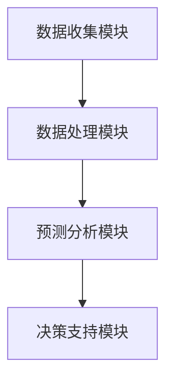
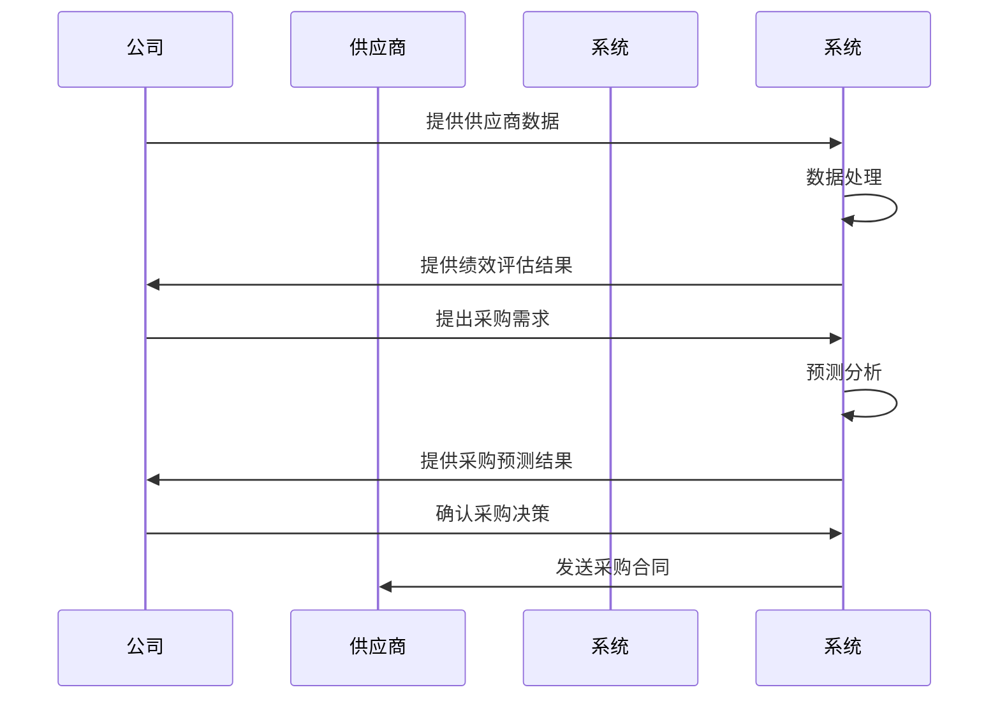

                 

### 第一部分: 引言与背景介绍

#### 第1章: 智能供应商关系管理概述

##### 1.1 问题背景

在当今全球化的商业环境中，供应链的复杂性和重要性日益增加。随着企业规模的扩大和市场需求的多样化，传统的供应商关系管理方式已经难以满足现代企业的需求。供应商关系管理不仅仅是简单的采购活动，它涉及到供应链的各个环节，包括供应商选择、绩效评估、采购谈判、供应链协调等。有效的供应商关系管理能够帮助企业降低采购成本、提高供应链的可靠性和灵活性，从而增强企业的竞争力。

###### 1.1.1 供应链复杂性增加

现代供应链涉及到的环节和参与者越来越多，从原材料供应商到制造商，再到分销商和零售商，每个环节都可能存在多个供应商。这种复杂性增加了供应商关系管理的难度，要求企业具备更高效的管理手段来应对。

###### 1.1.2 采购成本压力

随着原材料价格的波动和供应链中断的风险增加，企业面临巨大的采购成本压力。在这种背景下，如何有效地管理供应商关系，降低采购成本，成为企业亟待解决的问题。

###### 1.1.3 信息不对称

信息不对称是供应商关系管理中普遍存在的问题。企业和供应商之间往往存在信息不对称，导致双方无法进行有效的沟通与合作。这种信息不对称不仅会影响采购决策的准确性，还可能导致供应商关系的破裂。

##### 1.2 问题描述

在供应商关系管理中，企业面临着以下几个核心问题：

###### 1.2.1 如何有效地管理供应商关系，降低采购成本？

企业需要通过有效的供应商关系管理策略，减少采购成本，提高采购效率。这涉及到对供应商的评估、选择、绩效监控和持续改进。

###### 1.2.2 如何提高供应链的可靠性和灵活性？

企业需要建立灵活且可靠的供应链，以应对市场需求的变化和供应链中断的风险。这要求企业能够快速响应市场变化，调整采购策略，并与供应商建立紧密的合作关系。

###### 1.2.3 如何实现供应商与企业之间的信息共享和协同？

信息共享和协同是现代供应商关系管理的关键。企业需要通过有效的信息共享机制，与供应商建立透明的沟通渠道，共同优化供应链流程。

##### 1.3 问题解决

为了解决上述问题，企业可以采取以下措施：

###### 1.3.1 利用人工智能技术，对供应商关系进行智能分析和优化。

人工智能技术可以帮助企业从大量数据中提取有价值的信息，进行智能分析和优化，从而提高采购决策的准确性。

###### 1.3.2 通过数据挖掘和分析，发现潜在问题并提前预警。

数据挖掘和分析技术可以帮助企业识别潜在的风险和问题，提前预警，从而采取相应的措施进行预防和解决。

###### 1.3.3 建立智能决策支持系统，辅助企业进行采购策略的制定和执行。

智能决策支持系统可以根据实时数据和分析结果，为企业提供采购策略建议，辅助企业进行采购决策。

##### 1.4 边界与外延

智能供应商关系管理不仅涵盖了供应商选择、绩效评估、采购谈判等方面，还涉及以下内容：

###### 1.4.1 供应商选择

企业需要根据市场需求和自身战略，选择合适的供应商。这包括评估供应商的资质、生产能力、质量标准等。

###### 1.4.2 供应商绩效评估

企业需要定期对供应商的绩效进行评估，以确保供应商能够满足企业的要求。这包括交货时间、质量、成本等方面的评估。

###### 1.4.3 采购谈判

企业需要与供应商进行有效的谈判，以获取更有利的采购条件。这包括价格、交货期、质量保证等方面的谈判。

##### 1.5 概念结构与核心要素组成

智能供应商关系管理包括以下几个核心要素：

###### 1.5.1 数据收集

数据收集是智能供应商关系管理的基础。企业需要收集供应商的历史数据、市场信息、竞争情报等。

###### 1.5.2 数据处理

数据处理包括数据清洗、整合和分析。通过对数据进行处理，企业可以提取有价值的信息，为决策提供支持。

###### 1.5.3 模型构建

模型构建包括预测模型、评估模型等。这些模型可以帮助企业进行预测分析和决策支持。

###### 1.5.4 决策支持

决策支持是智能供应商关系管理的最终目标。通过智能分析结果，企业可以制定更加科学的采购策略，提高供应链的效率和可靠性。

##### 1.6 核心概念与联系

###### 1.6.1 智能供应商关系管理

智能供应商关系管理是指利用人工智能技术，对供应商关系进行智能分析和优化，以实现采购成本降低、供应链可靠性提高等目标。

###### 1.6.2 AI技术在供应商关系管理中的应用

AI技术在供应商关系管理中的应用包括数据挖掘、机器学习、自然语言处理等。这些技术可以帮助企业从海量数据中提取有价值的信息，进行智能分析和优化。

##### 1.7 本章小结

本章对智能供应商关系管理进行了全面的概述，包括问题背景、问题描述、问题解决、边界与外延、概念结构与核心要素组成以及核心概念与联系。通过本章的学习，读者可以了解智能供应商关系管理的基本概念和应用场景，为后续章节的学习打下基础。

---

**关键词**：智能供应商关系管理、人工智能、采购策略、数据分析、供应链优化

**摘要**：本文探讨了智能供应商关系管理的重要性，分析了当前供应商关系管理的挑战和问题，并提出了利用人工智能技术进行供应商关系优化的解决方案。文章介绍了智能供应商关系管理的基本概念、核心要素和应用场景，为企业的采购决策提供了科学依据和指导。

---

### 第二部分: AI技术在供应商关系管理中的应用

#### 第2章: 数据收集与处理

##### 2.1 数据收集

数据收集是智能供应商关系管理的第一步，也是最为关键的一步。准确和全面的数据收集能够为后续的分析和决策提供坚实的基础。

###### 2.1.1 供应商数据收集的重要性

供应商数据收集的重要性不言而喻。这些数据包含了供应商的财务状况、生产能力、服务质量、市场竞争力等多个方面，是评估供应商、制定采购策略的重要依据。有效的数据收集可以帮助企业发现潜在的供应商风险，提高采购决策的准确性。

###### 2.1.2 数据收集的方法

数据收集的方法可以分为两种：手动收集和自动化收集。

- **手动收集**：手动收集数据通常包括问卷调查、访谈、市场调研等方式。这种方法的优点是可以深入了解供应商的实际情况，缺点是耗时费力，效率低下。

- **自动化收集**：自动化收集数据主要通过爬虫、API接口、传感器等手段实现。自动化收集具有速度快、效率高的优点，但需要确保数据的准确性和完整性。

###### 2.1.3 数据收集的挑战

在数据收集过程中，企业可能会面临以下挑战：

- **数据的完整性**：一些供应商可能不愿意提供全部数据，导致数据的完整性受到影响。

- **数据的质量**：收集到的数据可能存在噪声、错误等问题，需要通过数据清洗来处理。

##### 2.2 数据处理

数据处理是智能供应商关系管理中的关键环节，它决定了数据能否被有效利用。数据处理通常包括数据清洗、数据整合和数据分析等步骤。

###### 2.2.1 数据清洗

数据清洗是数据处理的基础，主要包括去除重复数据、缺失值填充、异常值处理等。数据清洗的目的是提高数据的质量，使其符合后续分析的要求。

- **去除重复数据**：在数据收集过程中，可能会出现重复的数据条目，需要通过去重操作来消除。

- **缺失值填充**：对于缺失的数据，可以采用插值法、均值法等方式进行填充。

- **异常值处理**：异常值可能会对数据分析产生不良影响，需要通过统计方法、可视化工具等识别和处理。

###### 2.2.2 数据整合

数据整合是将来自不同来源的数据进行整合，形成一个统一的数据集。数据整合的目的是提高数据的可用性和一致性。

- **数据标准化**：将不同数据源中的数据格式、单位等进行统一，确保数据的一致性。

- **数据融合**：将多个数据源中的数据融合在一起，形成一个综合的数据集。

###### 2.2.3 数据分析

数据分析是数据处理的核心，通过数据分析，企业可以提取出有价值的信息，为决策提供支持。

- **描述性分析**：通过统计方法，对数据进行描述性分析，了解数据的分布、趋势等。

- **预测性分析**：利用机器学习方法，对数据进行分析，预测未来的趋势和变化。

##### 2.3 本章小结

本章介绍了数据收集与处理的基本概念和方法，包括数据收集的重要性、方法、挑战以及数据处理的基本步骤。通过本章的学习，读者可以了解如何有效地收集和处理供应商数据，为后续的智能分析奠定基础。

---

### 第三部分: 智能分析模型与应用

#### 第3章: 预测模型在供应商关系管理中的应用

##### 3.1 预测模型概述

预测模型是智能供应商关系管理中的重要组成部分，它可以帮助企业预测未来的趋势和变化，为采购决策提供科学依据。

###### 3.1.1 预测模型的定义

预测模型是利用历史数据对未来事件进行预测的模型。在供应商关系管理中，预测模型可以用于预测供应商的绩效、成本、交货时间等。

###### 3.1.2 预测模型在供应商关系管理中的应用

预测模型在供应商关系管理中的应用非常广泛，以下是一些典型的应用场景：

- **供应商绩效预测**：通过预测供应商的绩效，企业可以提前了解供应商的能力和表现，为供应商选择和评估提供依据。

- **采购成本预测**：通过预测采购成本，企业可以制定更合理的采购预算，降低采购成本。

- **交货时间预测**：通过预测交货时间，企业可以提前安排生产和销售计划，确保供应链的顺畅运行。

##### 3.2 时间序列预测模型

时间序列预测模型是用于预测未来某个时间点的数值的模型。在供应商关系管理中，时间序列预测模型可以用于预测供应商的交货时间、采购成本等。

###### 3.2.1 时间序列预测模型的定义

时间序列预测模型是基于历史时间序列数据，预测未来某个时间点的数值的模型。时间序列数据通常具有时间依赖性，即未来的数值受到过去数值的影响。

###### 3.2.2 常见的时间序列预测模型

常见的时间序列预测模型包括以下几种：

- **ARIMA模型**：自回归积分滑动平均模型，适用于平稳的时间序列数据。

- **LSTM模型**：长短时记忆模型，适用于含有长周期依赖性的时间序列数据。

##### 3.3 回归模型

回归模型是用于预测某个变量与另一个或多个变量之间关系的模型。在供应商关系管理中，回归模型可以用于预测供应商的绩效、采购成本等。

###### 3.3.1 回归模型的定义

回归模型是一种预测分析模型，用于研究因变量和自变量之间的关系。在供应商关系管理中，因变量可以是供应商的绩效、采购成本等，自变量可以是供应商的生产能力、质量标准等。

###### 3.3.2 常见的回归模型

常见的回归模型包括以下几种：

- **线性回归模型**：是最简单和常用的回归模型，适用于线性关系较强的数据。

- **多项式回归模型**：适用于非线性关系较强的数据。

- **逻辑回归模型**：用于分类问题，如供应商绩效的评估。

##### 3.4 本章小结

本章介绍了预测模型在供应商关系管理中的应用，包括预测模型的概述、时间序列预测模型和回归模型。通过本章的学习，读者可以了解如何利用预测模型进行供应商关系管理，提高采购决策的准确性。

---

### 第四部分: 实际应用与案例分析

#### 第4章: 智能供应商关系管理的实际应用与案例分析

##### 4.1 案例背景

为了更好地理解智能供应商关系管理的实际应用，我们来看一个实际案例。某大型制造企业（以下简称“公司”）在全球范围内拥有多个生产基地和销售渠道。公司的供应链网络非常复杂，涉及到数百家供应商。为了提高采购效率、降低采购成本和优化供应链，公司决定引入智能供应商关系管理系统。

##### 4.2 系统功能设计

智能供应商关系管理系统的主要功能包括：

- **供应商信息管理**：收集和管理供应商的基本信息、财务状况、生产能力等。
- **供应商绩效评估**：对供应商的交货时间、质量、成本等绩效指标进行评估。
- **采购预测**：利用预测模型预测未来采购需求，制定采购计划。
- **采购谈判支持**：提供谈判策略和决策支持，优化采购合同条款。
- **供应链风险管理**：监控供应链风险，提前预警，制定应对措施。

##### 4.3 系统架构设计

智能供应商关系管理系统的架构设计如图1所示。系统主要分为数据收集模块、数据处理模块、预测分析模块和决策支持模块。

###### 图1：智能供应商关系管理系统架构图

- **数据收集模块**：负责从各种渠道收集供应商数据，包括手动收集和自动化收集。
- **数据处理模块**：负责清洗、整合和分析收集到的数据。
- **预测分析模块**：利用预测模型对供应商绩效、采购需求等进行预测分析。
- **决策支持模块**：根据预测分析结果，提供采购策略建议和谈判支持。

##### 4.4 系统接口设计

智能供应商关系管理系统提供了多个接口，以便与其他系统进行集成和数据交换。主要的接口包括：

- **供应商信息接口**：用于与其他企业系统（如ERP系统）进行集成，获取供应商信息。
- **绩效评估接口**：用于将供应商绩效数据传递给决策支持模块。
- **预测接口**：用于获取预测分析结果，用于制定采购计划。
- **决策接口**：用于与其他业务系统（如CRM系统）进行集成，实现采购决策。

##### 4.5 系统交互

智能供应商关系管理系统的交互过程如图2所示。

###### 图2：智能供应商关系管理系统交互图

- **公司提供供应商数据**：公司通过供应商信息接口将供应商数据传输给智能供应商关系管理系统。
- **数据处理**：智能供应商关系管理系统对供应商数据进行处理，包括数据清洗、整合和分析。
- **绩效评估**：系统根据处理后的数据，对供应商的绩效进行评估，并将评估结果反馈给公司。
- **预测分析**：公司根据业务需求，通过预测接口获取采购预测结果，用于制定采购计划。
- **采购决策**：公司根据预测分析结果和评估报告，确定采购决策，并通过决策接口与供应商进行沟通。
- **发送采购合同**：系统根据采购决策，生成采购合同，并通过供应商接口发送给供应商。

##### 4.6 系统实现与案例分析

智能供应商关系管理系统的实现主要包括以下几个步骤：

1. **环境准备**：搭建系统所需的技术环境，包括服务器、数据库、开发工具等。

2. **数据收集**：通过手动收集和自动化收集方式，收集供应商的基本信息、财务数据、生产数据等。

3. **数据处理**：对收集到的数据进行清洗、整合和分析，提取有价值的信息。

4. **模型构建**：根据业务需求，构建预测模型和评估模型。

5. **系统集成**：将智能供应商关系管理系统与公司的ERP系统、CRM系统等进行集成，实现数据交换和业务协同。

6. **系统测试与部署**：进行系统测试，确保系统功能稳定可靠，然后进行部署上线。

在案例公司的应用中，智能供应商关系管理系统实现了以下几个方面的效果：

- **提高了采购效率**：通过自动化的数据收集和处理，大幅提高了采购效率，降低了人工成本。
- **降低了采购成本**：通过预测模型和绩效评估，公司能够更准确地制定采购计划，优化采购策略，降低了采购成本。
- **优化了供应链**：系统实时监控供应链风险，提前预警，提高了供应链的可靠性和灵活性。
- **提升了供应商管理水平**：通过绩效评估和采购谈判支持，公司能够更有效地管理供应商，提升了供应商管理水平。

##### 4.7 本章小结

本章通过一个实际案例，详细介绍了智能供应商关系管理系统的功能设计、架构设计、接口设计、交互过程和系统实现。通过案例分析，读者可以了解到智能供应商关系管理在实际应用中的效果和优势，为后续的智能供应商关系管理实践提供了参考。

---

### 第五部分: 智能供应商关系管理的未来趋势与发展方向

#### 第5章: 智能供应商关系管理的未来趋势与发展方向

##### 5.1 智能供应商关系管理的技术创新

随着人工智能、大数据、区块链等新兴技术的不断发展，智能供应商关系管理也在不断升级和创新。以下是一些可能的技术创新方向：

- **增强现实（AR）与虚拟现实（VR）**：通过AR和VR技术，企业可以更直观地了解供应商的生产线、库存状况等，实现远程监控和协作。

- **区块链技术**：利用区块链技术，可以确保供应链数据的透明性和可追溯性，提高供应商关系管理的可信度。

- **物联网（IoT）**：通过IoT设备，企业可以实时监控供应商的生产情况、库存水平等，实现供应链的实时监控和优化。

##### 5.2 智能供应商关系管理的应用拓展

智能供应商关系管理不仅可以应用于大型制造企业，还可以拓展到其他行业和领域。以下是一些应用拓展方向：

- **服务业**：在服务业中，智能供应商关系管理可以应用于物流、餐饮、旅游等行业，优化供应链管理和客户服务。

- **农业**：在农业领域，智能供应商关系管理可以应用于农产品生产、加工、销售等环节，提高农业供应链的效率和可持续性。

- **制造业**：在制造业中，智能供应商关系管理可以进一步应用于生产计划优化、库存管理、供应链金融等方面，实现全链条的智能化管理。

##### 5.3 智能供应商关系管理的企业战略

智能供应商关系管理不仅是技术手段的升级，更是企业战略的调整。以下是一些企业战略的方向：

- **供应链协同**：通过智能供应商关系管理，企业可以与供应商建立更加紧密的合作关系，实现供应链的协同优化。

- **绿色供应链**：通过智能供应商关系管理，企业可以更好地管理供应商的环保表现，推动绿色供应链的实施。

- **数字化转型**：智能供应商关系管理是数字化转型的重要组成部分，企业可以通过数字化转型，提升供应链的智能化水平。

##### 5.4 本章小结

本章探讨了智能供应商关系管理的未来趋势和发展方向，包括技术创新、应用拓展和企业战略等方面。通过本章的学习，读者可以了解到智能供应商关系管理的发展前景和潜在机遇，为企业在智能供应商关系管理领域的创新和发展提供参考。

---

### 总结与展望

本文详细探讨了智能供应商关系管理的重要性和应用，通过分析数据收集与处理、预测模型应用、实际案例分析以及未来趋势与发展方向，展示了智能供应商关系管理在现代供应链管理中的关键作用。智能供应商关系管理不仅能够帮助企业降低采购成本、提高供应链的可靠性和灵活性，还能够优化供应链协同、推动绿色供应链实施和实现数字化转型。

未来的智能供应商关系管理将随着人工智能、大数据、区块链等新兴技术的不断发展而不断创新和拓展。企业需要紧跟技术发展趋势，积极探索和引入智能供应商关系管理，以提升供应链管理水平和企业竞争力。

在此，我鼓励读者进一步学习和研究智能供应商关系管理，将其应用于实际业务中，为企业的可持续发展贡献力量。

---

**作者：AI天才研究院/AI Genius Institute & 禅与计算机程序设计艺术 /Zen And The Art of Computer Programming** 

**注意事项**：

1. 智能供应商关系管理需要综合考虑多种因素，包括技术、业务、战略等，以确保管理策略的全面性和有效性。
2. 在实施智能供应商关系管理时，应确保数据的安全性和隐私保护，遵循相关法律法规和行业标准。
3. 智能供应商关系管理是一个持续改进的过程，企业需要根据业务变化和市场环境，不断调整和优化管理策略。

**拓展阅读**：

- 《人工智能：一种现代的方法》
- 《区块链：从技术到应用》
- 《大数据战略行动》
- 《供应链管理：战略、规划与运营》

通过以上拓展阅读，读者可以进一步了解智能供应商关系管理相关的技术和应用，为实际工作提供更有力的理论支持。

