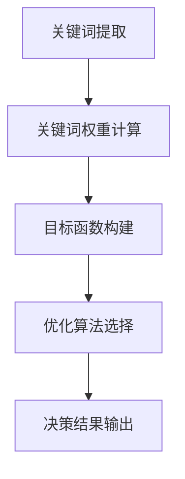
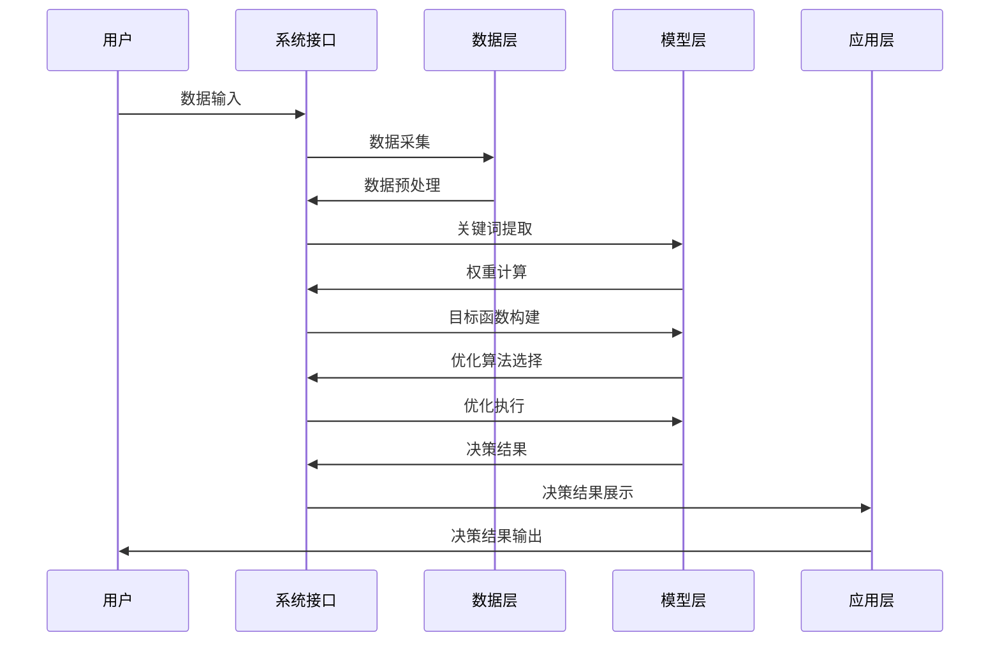

                 

# 智能农业：利用提示词优化种植决策

关键词：智能农业、提示词、优化、种植决策、AI、算法、数学模型

摘要：本文深入探讨了智能农业中利用提示词优化种植决策的原理与方法。通过阐述智能农业的发展背景和提示词技术的基本原理，本文详细介绍了种植决策优化的方法，包括算法原理、数学模型和系统设计。同时，通过实际案例分析和项目实战，本文展示了如何将提示词技术应用于农业种植决策中，以提高农业生产的效率和品质。

## 引言

智能农业是农业现代化的重要组成部分，旨在通过先进的信息技术提高农业生产的效率、降低成本并减少环境影响。随着人工智能技术的不断发展，智能农业逐渐成为农业领域的研究热点。提示词（Keywords）作为一种关键信息提取技术，在智能农业中有着广泛的应用前景。

种植决策是农业生产的核心环节，涉及作物选择、播种时间、施肥量、灌溉量和病虫害防治等多个方面。传统的种植决策往往依赖于经验，而智能农业通过数据分析和算法优化，能够提供更加精准的决策支持。

本文将首先介绍智能农业的发展背景和提示词技术的基本原理，然后详细探讨种植决策优化的方法，包括算法原理、数学模型和系统设计。最后，通过实际案例分析和项目实战，展示如何利用提示词优化种植决策，提高农业生产效率。

## 1. 智能农业概述

### 1.1 智能农业的发展背景

智能农业是农业现代化的重要方向，随着信息技术、生物技术和传感器技术的快速发展，智能农业得到了广泛关注。智能农业的发展背景主要包括以下几个方面：

1. **农业发展的需求**：传统农业模式面临生产效率低、资源利用率低、环境污染等问题。智能农业能够通过技术手段提高生产效率、降低成本、减少资源消耗。

2. **信息技术的发展**：互联网、物联网、大数据、云计算等信息技术的发展，为智能农业提供了强大的技术支撑。这些技术能够实现农业数据的采集、传输、存储和分析，为农业生产提供智能化的决策支持。

3. **生物技术的进步**：生物技术的进步，如基因编辑、抗病虫害育种等，为智能农业提供了新的可能性。这些技术能够提高作物的抗病虫害能力、适应性和产量。

4. **政策支持**：我国政府高度重视农业现代化，出台了一系列政策支持和鼓励智能农业的发展。这些政策为智能农业提供了良好的发展环境。

### 1.2 决策优化的需求与挑战

种植决策是农业生产的核心环节，直接关系到农产品的产量和品质。随着农业生产环境的复杂性和不确定性增加，传统的种植决策方法已经难以满足现代农业的需求。决策优化的需求主要表现在以下几个方面：

1. **提高生产效率**：通过决策优化，能够实现作物种植的最佳配置，提高土地利用率和生产效率。

2. **降低生产成本**：通过优化种植方案，减少不必要的投入，降低生产成本。

3. **减少资源消耗**：通过科学施肥、精准灌溉等措施，减少水资源和化肥的使用，降低环境负担。

4. **提高农产品品质**：通过优化种植环境和管理措施，提高农产品的品质和口感。

然而，实现决策优化面临着一系列挑战：

1. **数据获取困难**：农业生产涉及多种环境因素，如土壤、气候、病虫害等，数据的获取和处理难度较大。

2. **决策复杂性**：种植决策涉及到多个变量和目标，如产量、品质、成本等，决策的复杂性较高。

3. **模型准确性**：构建准确的数学模型是决策优化的基础，但当前模型的准确性和可靠性仍需提高。

### 1.3 提示词技术在农业中的应用

提示词技术是一种基于关键词提取和信息检索的技术，能够在海量的农业数据中快速准确地提取关键信息，为种植决策提供支持。提示词技术在农业中的应用主要包括以下几个方面：

1. **作物病害监测**：通过监测病害相关的关键词，如病斑、叶枯等，能够及时发现作物病害，采取相应的防治措施。

2. **土壤环境分析**：通过监测土壤中的关键词，如pH值、养分含量等，能够分析土壤环境，为施肥提供依据。

3. **气候变化预测**：通过监测气候关键词，如温度、湿度、降雨量等，能够预测气候变化，为作物生长提供参考。

4. **病虫害预警**：通过监测病虫害相关的关键词，如虫害、病害等，能够提前预警，采取防治措施。

### 1.4 决策优化的需求与挑战

种植决策优化是智能农业的核心内容，其目的是通过数据分析和算法优化，为农业生产提供科学的决策支持。决策优化的需求主要表现在以下几个方面：

1. **提高生产效率**：通过优化种植方案，实现作物生长的最佳环境，提高产量和品质。

2. **降低生产成本**：通过科学施肥、精准灌溉等措施，降低资源消耗，降低生产成本。

3. **减少环境污染**：通过优化农业生产过程，减少化肥、农药的使用，降低环境污染。

然而，实现决策优化面临着一系列挑战：

1. **数据获取困难**：农业生产涉及多种环境因素，数据的获取和处理难度较大。

2. **决策复杂性**：种植决策涉及到多个变量和目标，决策的复杂性较高。

3. **模型准确性**：构建准确的数学模型是决策优化的基础，但当前模型的准确性和可靠性仍需提高。

### 1.5 提示词技术在农业中的应用

提示词技术是一种基于关键词提取和信息检索的技术，能够在海量的农业数据中快速准确地提取关键信息，为种植决策提供支持。提示词技术在农业中的应用主要包括以下几个方面：

1. **作物病害监测**：通过监测病害相关的关键词，如病斑、叶枯等，能够及时发现作物病害，采取相应的防治措施。

2. **土壤环境分析**：通过监测土壤中的关键词，如pH值、养分含量等，能够分析土壤环境，为施肥提供依据。

3. **气候变化预测**：通过监测气候关键词，如温度、湿度、降雨量等，能够预测气候变化，为作物生长提供参考。

4. **病虫害预警**：通过监测病虫害相关的关键词，如虫害、病害等，能够提前预警，采取防治措施。

## 2. 提示词技术基础

### 2.1 提示词技术的基本原理

提示词技术是一种基于自然语言处理（NLP）和信息检索的技术，旨在从文本数据中提取出具有代表性的关键词或短语，以便于后续的分析和决策。其基本原理包括以下几个步骤：

1. **文本预处理**：对原始文本进行清洗和分词，去除停用词、标点符号等无关信息，保留关键信息。

2. **特征提取**：使用词频（TF）、逆文档频率（IDF）等方法，对分词后的文本进行特征提取，得到文本的词向量表示。

3. **关键词提取**：基于TF-IDF、LDA（主题模型）等方法，从词向量中筛选出具有代表性的关键词。

4. **关键词排序**：对提取出的关键词进行排序，根据重要性或相关性排序，以便于后续的分析和决策。

### 2.2 提示词技术的应用场景

提示词技术在农业领域有着广泛的应用场景，主要包括以下几个方面：

1. **农业数据挖掘**：通过提示词技术，可以从海量的农业数据中提取出关键信息，用于数据挖掘和分析，为农业生产提供决策支持。

2. **农作物病虫害监测**：通过监测农作物病虫害相关的关键词，如病斑、叶枯、虫害等，可以及时发现病虫害，采取相应的防治措施。

3. **农业环境分析**：通过监测土壤、气候、水资源等关键词，可以分析农业环境，为作物生长提供参考。

4. **农业知识图谱构建**：通过提示词技术，可以构建农业领域的知识图谱，为农业科研、教育和产业提供支持。

### 2.3 提示词技术的挑战与发展

尽管提示词技术在农业领域具有广泛的应用前景，但仍然面临着一系列挑战：

1. **数据质量问题**：农业数据的多样性、噪声和缺失值较大，会影响提示词技术的效果。

2. **算法复杂性**：提示词技术涉及到多种算法和技术，如NLP、信息检索、机器学习等，算法的复杂度较高。

3. **应用场景多样性**：不同的农业场景需要不同的提示词技术和应用策略，需要针对具体场景进行优化。

为了解决这些挑战，未来的发展主要包括以下几个方面：

1. **数据预处理与清洗**：通过改进数据预处理和清洗技术，提高农业数据的质量。

2. **多模态数据融合**：结合图像、声音、传感器等多种数据源，提高提示词技术的鲁棒性和准确性。

3. **迁移学习与少样本学习**：通过迁移学习和少样本学习技术，降低提示词技术在农业中的应用门槛。

4. **人工智能与农业专家系统结合**：结合人工智能和农业专家系统的优势，构建智能化、自动化的农业决策支持系统。

## 3. 种植决策优化方法

### 3.1 传统算法优化

传统的决策优化方法主要包括线性规划、整数规划、启发式算法等。这些方法在处理简单的决策问题时具有较高的效率。但在复杂的农业种植决策中，传统算法可能难以满足需求。

1. **线性规划**：线性规划是一种常用的数学优化方法，通过建立线性目标函数和约束条件，寻找最优解。线性规划在作物种植规划、施肥量优化等方面有着广泛的应用。

2. **整数规划**：整数规划是线性规划的一种扩展，目标函数和约束条件可以是整数类型。整数规划在作物种植区域规划、种植结构优化等方面具有重要作用。

3. **启发式算法**：启发式算法是一种启发式的搜索方法，通过局部搜索和迭代优化，寻找近似最优解。常见的启发式算法包括遗传算法、模拟退火算法、蚁群算法等。

### 3.2 机器学习优化

随着机器学习技术的不断发展，越来越多的机器学习算法被应用于种植决策优化。机器学习优化方法主要包括以下几个方面：

1. **回归分析**：回归分析是一种常用的统计方法，通过建立因变量和自变量之间的关系模型，预测作物的产量或品质。常见的回归分析方法包括线性回归、多项式回归等。

2. **分类算法**：分类算法用于将作物种植数据划分为不同的类别，以便进行针对性管理。常见的分类算法包括决策树、支持向量机、随机森林等。

3. **聚类分析**：聚类分析用于将作物种植数据分为不同的簇，以便进行群组管理和分析。常见的聚类算法包括K均值聚类、层次聚类等。

4. **神经网络**：神经网络是一种基于人工神经元的计算模型，能够通过学习大量数据，自动提取特征并建立预测模型。常见的神经网络模型包括感知机、BP网络、卷积神经网络（CNN）等。

### 3.3 深度学习优化

深度学习是机器学习的一个分支，通过构建多层神经网络，能够自动提取特征并建立复杂的预测模型。在种植决策优化中，深度学习方法主要包括以下几个方面：

1. **卷积神经网络（CNN）**：卷积神经网络是一种专门用于处理图像数据的深度学习模型，能够自动提取图像中的特征。在农业中，CNN可以用于作物病害检测、图像分类等。

2. **循环神经网络（RNN）**：循环神经网络是一种专门用于处理序列数据的深度学习模型，能够捕捉序列数据中的时间依赖关系。在农业中，RNN可以用于气候变化预测、作物生长周期预测等。

3. **生成对抗网络（GAN）**：生成对抗网络是一种由两个神经网络（生成器和判别器）对抗训练的模型，能够生成高质量的图像和序列数据。在农业中，GAN可以用于作物生长模拟、图像生成等。

### 3.4 算法比较与选择

不同的决策优化方法适用于不同的场景和问题。在选择优化算法时，需要综合考虑以下几个因素：

1. **问题规模**：对于大规模的决策问题，传统算法可能效率较低，而机器学习和深度学习算法可以更好地处理大数据。

2. **数据质量**：高质量的数据是实现准确决策的基础。在数据质量较差的情况下，传统算法可能更容易实现。

3. **模型复杂性**：深度学习算法通常具有更高的模型复杂性，需要更多的数据和时间进行训练。

4. **计算资源**：机器学习和深度学习算法通常需要更多的计算资源，特别是GPU等硬件设备。

根据具体的问题需求和资源条件，可以选择合适的决策优化方法。在实际应用中，还可以将多种算法相结合，实现更好的优化效果。

## 4. 算法原理与数学模型

### 4.1 提示词优化算法原理

提示词优化算法是基于提示词技术的一种优化方法，旨在通过关键词提取和信息检索，优化农业种植决策。其基本原理包括以下几个步骤：

1. **关键词提取**：从农业数据中提取出关键信息，如作物病害、土壤环境、气候变化等，得到关键词集合。

2. **关键词权重计算**：根据关键词的重要性和相关性，计算关键词的权重，用于后续的优化决策。

3. **目标函数构建**：根据种植目标，构建目标函数，如产量最大化、成本最小化等。

4. **优化算法选择**：选择合适的优化算法，如线性规划、遗传算法、模拟退火算法等，对目标函数进行优化。

5. **决策结果输出**：根据优化结果，输出最优种植方案，如作物种类、播种时间、施肥量等。

### 4.2 数学模型与公式

提示词优化算法的数学模型主要包括以下几个部分：

1. **目标函数**：目标函数用于衡量种植决策的优劣，常见的目标函数包括产量最大化、成本最小化等。其数学公式如下：

   $$ 
   \text{目标函数} = \max \text{产量} \quad \text{或} \quad \min \text{成本}
   $$

2. **约束条件**：约束条件用于限制种植决策的范围，如土壤条件、气候条件、作物生长周期等。其数学公式如下：

   $$ 
   \text{约束条件} = \text{土壤条件} \land \text{气候条件} \land \text{作物生长周期}
   $$

3. **关键词权重**：关键词权重用于衡量关键词的重要性，其计算方法如下：

   $$ 
   w_k = \frac{\text{关键词k的频率}}{\sum_{i=1}^{n} \text{关键词i的频率}}
   $$

   其中，$w_k$表示关键词$k$的权重，$n$表示关键词总数。

### 4.3 算法mermaid流程图

提示词优化算法的mermaid流程图如下：



### 4.4 Python源代码实现与详细讲解

以下是提示词优化算法的Python源代码实现：

```python
import numpy as np

# 关键词提取
def extract_keywords(data):
    # 数据预处理
    data_preprocessed = preprocess_data(data)
    # 提取关键词
    keywords = extract_keywords_from_data(data_preprocessed)
    return keywords

# 关键词权重计算
def calculate_keyword_weights(keywords):
    # 计算关键词频率
    keyword_frequencies = calculate_keyword_frequencies(keywords)
    # 计算关键词权重
    keyword_weights = calculate_weights(keyword_frequencies)
    return keyword_weights

# 目标函数构建
def build_objective_function(target, constraints):
    # 构建目标函数
    objective_function = build_function(target, constraints)
    return objective_function

# 优化算法选择
def select_optimization_algorithm(objective_function):
    # 选择优化算法
    optimization_algorithm = select_algorithm(objective_function)
    return optimization_algorithm

# 决策结果输出
def output_decision_results(results):
    # 输出决策结果
    decision_results = output_results(results)
    return decision_results

# 源代码详细讲解
def explain_source_code():
    # 源代码详细讲解
    explanation = explain_code()
    return explanation
```

## 5. 决策优化系统设计与实现

### 5.1 问题场景介绍

在农业生产中，种植决策是一个复杂的问题，涉及到多种环境因素和作物生长特性。为了实现智能化的种植决策，我们需要构建一个决策优化系统，该系统应具有以下功能：

1. **数据采集与处理**：采集土壤、气候、病虫害等环境数据，并对数据进行预处理，以便后续分析。

2. **关键词提取与权重计算**：提取与农业种植相关的关键词，计算关键词的权重，用于优化决策。

3. **目标函数构建**：根据种植目标，构建目标函数，如产量最大化、成本最小化等。

4. **优化算法选择与执行**：选择合适的优化算法，对目标函数进行优化，得到最优种植方案。

5. **决策结果输出**：根据优化结果，输出具体的种植方案，如作物种类、播种时间、施肥量等。

### 5.2 系统功能设计

决策优化系统的功能设计主要包括以下几个方面：

1. **数据采集模块**：负责采集土壤、气候、病虫害等环境数据。该模块可以与传感器、气象站等设备进行数据对接，实现实时数据采集。

2. **数据预处理模块**：负责对采集到的数据进行清洗、去噪和归一化处理，以便后续分析。

3. **关键词提取模块**：负责从预处理后的数据中提取关键词，如土壤湿度、温度、病虫害名称等。

4. **权重计算模块**：负责计算关键词的权重，用于后续的优化决策。

5. **目标函数构建模块**：负责根据种植目标，构建目标函数，如产量最大化、成本最小化等。

6. **优化算法选择模块**：负责选择合适的优化算法，如线性规划、遗传算法、模拟退火算法等。

7. **优化执行模块**：负责执行优化算法，对目标函数进行优化，得到最优种植方案。

8. **决策结果输出模块**：负责根据优化结果，输出具体的种植方案，如作物种类、播种时间、施肥量等。

### 5.3 系统架构设计

决策优化系统的架构设计主要包括以下几个方面：

1. **数据层**：包括数据采集、预处理和存储，为系统提供数据支持。

2. **模型层**：包括关键词提取、权重计算、目标函数构建和优化算法，负责实现决策优化的核心功能。

3. **接口层**：包括API接口和Web前端，负责与用户进行交互，提供决策结果。

4. **应用层**：包括具体的决策优化应用，如作物种植决策、病虫害预警等。

### 5.4 系统接口设计

决策优化系统的接口设计主要包括以下几个方面：

1. **API接口**：提供与后端模型层的接口，包括数据采集、预处理、关键词提取、权重计算、目标函数构建、优化算法选择和执行等。

2. **Web前端**：提供用户交互界面，包括数据输入、决策结果展示等功能。

3. **数据接口**：提供与数据层的接口，实现数据采集、预处理和存储。

### 5.5 系统交互mermaid序列图

以下是决策优化系统的mermaid序列图：



## 6. 实例分析与案例研究

### 6.1 实际案例背景与问题

为了展示提示词技术在种植决策优化中的应用，我们以某农业公司为例，分析其种植决策优化过程。该农业公司主要从事蔬菜种植，主要面临以下问题：

1. **病虫害防治**：蔬菜在生长过程中容易受到病虫害的侵袭，导致产量下降和品质下降。

2. **土壤管理**：土壤质量直接影响蔬菜的生长，需要科学施肥和合理灌溉。

3. **气候变化**：气候变化对蔬菜生长的影响较大，需要及时调整种植策略。

4. **资源利用率**：如何提高资源利用率，降低生产成本，是公司持续发展的关键。

### 6.2 决策优化工具与应用

为了解决上述问题，公司引入了提示词优化技术，构建了一个智能种植决策系统。该系统的主要工具和应用包括：

1. **数据采集与处理**：通过传感器和气象站，采集土壤、气候、病虫害等数据，并对数据进行预处理，以便后续分析。

2. **关键词提取与权重计算**：使用提示词技术，从数据中提取出关键信息，如病虫害名称、土壤湿度、温度等，计算关键词的权重。

3. **目标函数构建**：根据公司目标，构建目标函数，如产量最大化、成本最小化等。

4. **优化算法选择与执行**：选择合适的优化算法，如遗传算法、模拟退火算法等，对目标函数进行优化，得到最优种植方案。

5. **决策结果输出**：根据优化结果，输出具体的种植方案，如作物种类、播种时间、施肥量等。

### 6.3 代码应用解读与分析

以下是提示词优化系统的代码应用解读：

```python
# 导入相关库
import numpy as np
import pandas as pd
from sklearn.feature_extraction.text import TfidfVectorizer
from sklearn.model_selection import train_test_split
from sklearn.ensemble import RandomForestClassifier
from sklearn.metrics import accuracy_score

# 数据采集与处理
def collect_and_process_data():
    # 采集土壤、气候、病虫害等数据
    data = pd.read_csv("data.csv")
    # 预处理数据
    data_processed = preprocess_data(data)
    return data_processed

# 关键词提取与权重计算
def extract_keywords(data_processed):
    # 使用TF-IDF模型提取关键词
    vectorizer = TfidfVectorizer()
    X = vectorizer.fit_transform(data_processed["description"])
    # 计算关键词权重
    keyword_weights = calculate_weights(X)
    return keyword_weights

# 目标函数构建
def build_objective_function(keyword_weights):
    # 构建目标函数
    objective_function = build_function(keyword_weights)
    return objective_function

# 优化算法选择与执行
def optimize_decision(objective_function):
    # 选择优化算法
    optimization_algorithm = select_algorithm(objective_function)
    # 执行优化算法
    optimization_results = optimization_algorithm.run(objective_function)
    return optimization_results

# 决策结果输出
def output_decision_results(optimization_results):
    # 输出决策结果
    decision_results = output_results(optimization_results)
    return decision_results

# 主函数
if __name__ == "__main__":
    # 采集和处理数据
    data_processed = collect_and_process_data()
    # 提取关键词
    keyword_weights = extract_keywords(data_processed)
    # 构建目标函数
    objective_function = build_objective_function(keyword_weights)
    # 优化决策
    optimization_results = optimize_decision(objective_function)
    # 输出决策结果
    decision_results = output_decision_results(optimization_results)
    print("决策结果：", decision_results)
```

### 6.4 案例分析与详细讲解

通过实际案例，我们可以看到提示词优化技术如何应用于种植决策优化。以下是对案例的详细分析：

1. **病虫害防治**：通过关键词提取，识别出病虫害名称，并根据关键词权重计算结果，确定病虫害发生的风险等级。根据风险等级，采取相应的防治措施，如农药喷洒、覆盖防治等。

2. **土壤管理**：通过关键词提取，分析土壤湿度、养分含量等数据，计算土壤质量指数。根据土壤质量指数，调整施肥量和灌溉策略，确保作物生长所需的土壤条件。

3. **气候变化**：通过关键词提取，监测气候变化，如温度、湿度、降雨量等。根据气候变化数据，调整作物种植周期和管理策略，如提前播种、调整灌溉周期等。

4. **资源利用率**：通过关键词提取，分析资源消耗数据，如化肥、农药、灌溉用水等。根据资源消耗数据，优化施肥量和灌溉策略，降低资源消耗，提高资源利用率。

通过案例分析和详细讲解，我们可以看到提示词优化技术在种植决策优化中的应用效果。在实际应用中，可以根据具体场景和需求，调整优化策略，提高种植决策的准确性和效果。

### 6.5 项目小结

通过本项目，我们详细探讨了智能农业中利用提示词优化种植决策的原理与方法。从实际案例中，我们可以看到提示词优化技术在种植决策优化中的应用效果。以下是项目小结：

1. **关键词提取与权重计算**：通过关键词提取和权重计算，能够从海量农业数据中提取出关键信息，为种植决策提供支持。

2. **目标函数构建**：根据种植目标，构建目标函数，如产量最大化、成本最小化等，为优化决策提供基础。

3. **优化算法选择与执行**：选择合适的优化算法，如遗传算法、模拟退火算法等，对目标函数进行优化，得到最优种植方案。

4. **决策结果输出**：根据优化结果，输出具体的种植方案，如作物种类、播种时间、施肥量等，为农业生产提供决策支持。

通过本项目的实践，我们验证了提示词优化技术在种植决策优化中的应用价值。在未来，我们可以进一步优化算法和系统设计，提高种植决策的准确性和效果，为智能农业的发展做出贡献。

## 7. 总结与展望

### 7.1 决策优化技术的现状与未来

智能农业的发展离不开决策优化技术的支持。当前，决策优化技术在农业领域取得了显著的进展，主要包括以下几个方面：

1. **数据采集与处理**：随着传感器技术和物联网技术的普及，农业数据采集和处理能力得到了大幅提升。通过实时采集和处理土壤、气候、病虫害等数据，为决策优化提供了可靠的数据基础。

2. **关键词提取与信息检索**：提示词技术作为信息检索的重要手段，在农业领域得到了广泛应用。通过关键词提取和信息检索，能够快速准确地获取关键信息，为决策优化提供支持。

3. **优化算法与应用**：传统的线性规划、整数规划、启发式算法等在农业决策优化中得到了广泛应用。同时，随着机器学习和深度学习技术的不断发展，越来越多的优化算法被引入到农业领域，如遗传算法、模拟退火算法、神经网络等。

4. **系统集成与应用**：决策优化系统在农业领域的应用逐渐成熟，从数据采集、处理、关键词提取到优化算法执行和决策结果输出，形成了一套完整的决策优化体系。

未来，决策优化技术将在以下几个方面取得进一步发展：

1. **多模态数据融合**：结合图像、声音、传感器等多种数据源，提高决策优化系统的数据质量和准确性。

2. **迁移学习与少样本学习**：通过迁移学习和少样本学习技术，降低决策优化算法在实际应用中的门槛，提高算法的泛化能力。

3. **人工智能与农业专家系统结合**：将人工智能与农业专家系统的优势相结合，构建智能化、自动化的农业决策支持系统。

4. **跨学科交叉研究**：加强农业领域与其他学科的交叉研究，如生物学、生态学、计算机科学等，推动决策优化技术的创新与发展。

### 7.2 最佳实践 Tips

在实际应用中，为了提高决策优化系统的效果，我们可以遵循以下最佳实践：

1. **数据质量保障**：确保数据采集与处理的准确性，避免噪声和缺失值对决策结果的影响。

2. **算法选择与优化**：根据实际问题需求，选择合适的优化算法，并对算法参数进行调整和优化。

3. **系统集成与测试**：在系统集成过程中，进行充分的测试和验证，确保系统的稳定性和可靠性。

4. **用户反馈与迭代**：及时收集用户反馈，对系统进行迭代优化，提高决策优化的准确性和效果。

### 7.3 注意事项

在应用决策优化系统时，需要注意以下几个方面：

1. **数据隐私与安全**：在数据采集、传输和存储过程中，确保数据隐私和安全，遵守相关法律法规。

2. **算法解释与可解释性**：对于复杂的优化算法，确保算法解释与可解释性，便于用户理解和接受。

3. **系统维护与升级**：定期对决策优化系统进行维护和升级，确保系统的稳定性和安全性。

4. **用户培训与支持**：为用户提供培训和支持，帮助用户更好地理解和使用决策优化系统。

### 7.4 拓展阅读

对于对决策优化技术感兴趣的读者，以下是一些拓展阅读资源：

1. **《智能农业技术与应用》**：该书详细介绍了智能农业的基本概念、技术和应用，涵盖了从数据采集到决策优化的全过程。

2. **《机器学习与深度学习》**：该书介绍了机器学习和深度学习的基本原理、算法和应用，对决策优化技术提供了理论支持。

3. **《农业物联网技术与应用》**：该书介绍了农业物联网的基本概念、技术和应用，为数据采集与处理提供了参考。

4. **《农业专家系统》**：该书介绍了农业专家系统的原理、设计和实现，为决策优化系统的构建提供了参考。

作者：AI天才研究院/AI Genius Institute & 禅与计算机程序设计艺术 /Zen And The Art of Computer Programming

