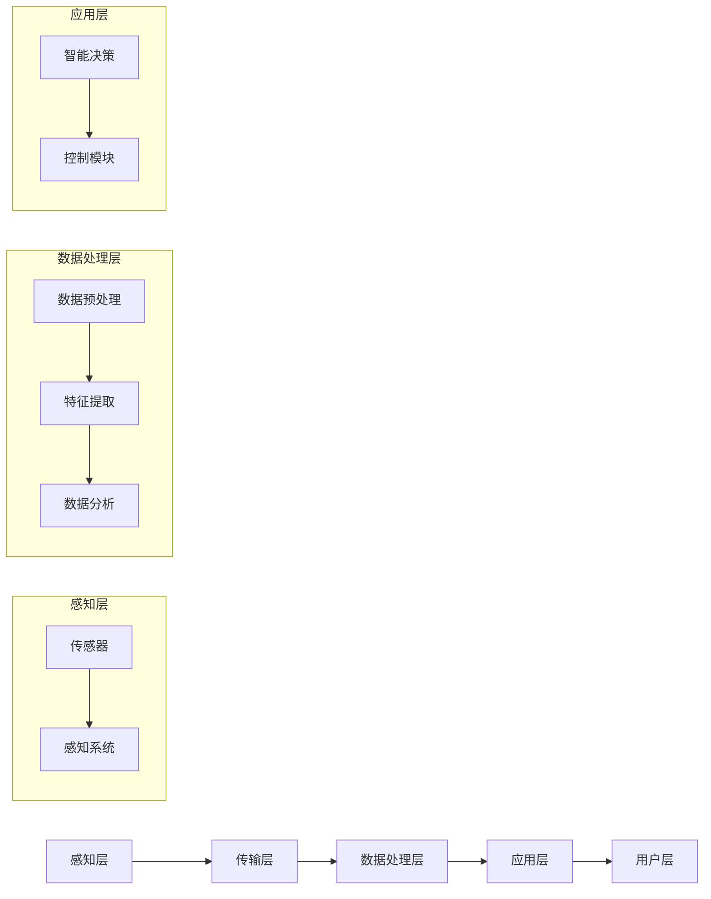

                 

### 智能包装技术在物流追踪中的应用

#### 引言

随着电子商务和全球化的快速发展，物流行业正面临前所未有的挑战。消费者对物流服务的期望越来越高，要求物流过程更加高效、透明和可靠。在这样的背景下，智能包装技术逐渐成为物流追踪的关键一环。智能包装不仅仅是传统包装的升级，它融合了传感器技术、数据处理、通信和物联网等先进技术，为物流追踪提供了全新的解决方案。

本文将深入探讨智能包装技术在物流追踪中的应用，通过逻辑清晰、结构紧凑的分析，帮助读者理解这一前沿技术的原理、应用场景及其面临的挑战。以下是文章的结构安排：

- **第一部分：智能包装技术基础**
  - **第1章：智能包装技术概述**
  - **第2章：智能包装技术的核心组件**
- **第二部分：智能包装技术在物流追踪中的应用场景**
  - **第3章：智能包装技术在物流追踪中的应用场景**
  - **第4章：智能包装技术在不同物流环节的应用**
- **第三部分：智能包装技术的技术挑战与解决方案**
  - **第5章：智能包装技术的技术挑战与解决方案**
- **第四部分：案例研究**
  - **第6章：智能包装技术在物流追踪中的成功案例**
- **第五部分：未来展望**
  - **第7章：未来展望**

通过逐步分析，我们将揭示智能包装技术在提升物流效率、保障货物安全和优化成本控制方面的巨大潜力。现在，让我们开始思考智能包装技术在物流追踪中的实际应用。

#### 关键词

- 智能包装技术
- 物流追踪
- 传感器技术
- 数据处理与分析
- 物联网
- 实时监控
- 货物安全
- 成本优化

#### 摘要

本文旨在深入探讨智能包装技术在物流追踪中的应用。首先，我们介绍了智能包装技术的背景和基本原理，分析了其在物流行业中的需求与挑战。接着，我们详细介绍了智能包装技术的核心组件，包括传感器、数据处理算法和系统架构。随后，我们探讨了智能包装技术在物流追踪中的多种应用场景，从实时监控、货物安全到效率提升，展示了其广泛的应用前景。此外，我们还分析了智能包装技术在物流不同环节的具体应用，并探讨了其面临的挑战与解决方案。通过成功案例的介绍和分析，我们总结了智能包装技术的关键成功因素和未来发展趋势。最后，我们对智能包装技术的未来前景进行了展望，强调了其在物流领域的巨大潜力。

### 第一部分：智能包装技术基础

#### 第1章：智能包装技术概述

智能包装技术是指利用先进的信息技术，如传感器、数据处理和通信技术，使传统包装具备智能功能的技术。在物流行业中，智能包装技术扮演着越来越重要的角色，它不仅提升了物流追踪的准确性和效率，还增强了货物的安全性和透明度。

#### 1.1 物流追踪的需求与挑战

物流追踪是确保货物在整个运输过程中安全、准时送达的关键环节。随着电子商务的兴起，消费者对物流服务的期望也在不断提高，他们希望了解货物的实时位置和状态。然而，传统的物流追踪方法存在以下问题：

1. **追踪精度不足**：传统方法如条形码和RFID（射频识别）技术虽然能够提供一定的追踪功能，但精度和实时性有限，难以满足消费者的需求。
2. **信息不透明**：物流过程中的信息不透明，导致消费者难以实时了解货物的状态，增加了客户的焦虑和不满。
3. **人工成本高**：依赖人工操作进行物流追踪，不仅效率低下，还容易出错。

为了解决这些问题，物流行业迫切需要一种更为智能、高效的追踪技术，而智能包装技术正是应运而生。

#### 1.2 智能包装技术的背景与演进

智能包装技术的兴起可以追溯到物流自动化和信息化的需求。随着物联网（IoT）技术的发展，各种传感器和通信技术逐渐普及，为智能包装提供了技术基础。

1. **物联网技术的发展**：物联网技术的发展为智能包装提供了连接和通信手段。传感器可以实时采集货物信息，并通过无线网络传输到数据处理中心。
2. **传感器技术的进步**：传感器技术的发展使得智能包装能够更加准确地感知货物的状态，如温度、湿度、震动等。
3. **数据处理与分析算法的进步**：随着计算能力的提升，大数据处理和分析算法得到快速发展，使得智能包装能够实时分析货物信息，做出智能决策。

#### 1.3 智能包装技术的基本原理

智能包装技术的基本原理可以概括为以下几个方面：

1. **传感器与感知系统**：智能包装中集成了各种传感器，如温度传感器、湿度传感器、震动传感器等，用于感知货物的状态。
2. **数据处理与分析算法**：传感器采集到的数据通过数据处理和分析算法进行处理，以提取有用的信息。
3. **通信与传输**：处理后的数据通过无线通信网络传输到数据处理中心，供物流管理人员和消费者查看。
4. **智能决策与控制**：基于分析结果，系统可以自动进行一些控制操作，如调整温度、湿度等，确保货物安全。

智能包装技术不仅提升了物流追踪的准确性和实时性，还提高了货物的安全性和透明度，为物流行业带来了革命性的变革。

#### 第2章：智能包装技术的核心组件

智能包装技术的实现离不开其核心组件的协同工作，这些组件包括传感器与感知系统、数据处理与分析算法以及智能包装系统的架构设计。以下将详细探讨这些核心组件及其作用。

### 2.1 传感器与感知系统

传感器是智能包装技术的核心组件之一，它们用于感知货物的状态和环境变化。以下是智能包装中常用的传感器类型及其作用：

1. **温度传感器**：用于监测货物的温度变化，确保在运输过程中货物温度符合要求。例如，对于食品和药品等对温度敏感的货物，温度传感器的使用尤为重要。
   
   $$ T(t) = T_0 + \alpha t $$
   
   其中，\( T(t) \) 是时间 \( t \) 时刻的货物温度，\( T_0 \) 是初始温度，\( \alpha \) 是温度变化率。

2. **湿度传感器**：用于监测货物周围的湿度变化，这对于运输过程中需要保持干燥的货物（如电子产品）至关重要。
   
   $$ H(t) = H_0 + \beta t $$
   
   其中，\( H(t) \) 是时间 \( t \) 时刻的货物周围湿度，\( H_0 \) 是初始湿度，\( \beta \) 是湿度变化率。

3. **震动传感器**：用于检测货物在运输过程中受到的震动和冲击，这对于易碎货物的保护至关重要。
   
   $$ V(t) = V_0 + \gamma t $$
   
   其中，\( V(t) \) 是时间 \( t \) 时刻的货物震动强度，\( V_0 \) 是初始震动强度，\( \gamma \) 是震动变化率。

传感器数据通过感知系统进行采集和处理，感知系统通常包括以下部分：

- **数据采集模块**：负责将传感器数据转换为数字信号，并传输到数据处理单元。
- **信号放大和处理模块**：用于放大和滤波传感器信号，去除噪声，提高数据质量。
- **无线传输模块**：将处理后的数据通过无线通信技术（如Wi-Fi、蓝牙、LoRa等）传输到数据处理中心。

### 2.2 数据处理与分析算法

采集到的传感器数据需要通过数据处理和分析算法进行处理，以提取有用的信息。以下是几个关键步骤：

1. **数据预处理**：包括去除噪声、插值、滤波等，以提高数据质量。
   
   例如，使用卡尔曼滤波器对温度传感器数据进行滤波处理：
   
   $$ x_k = A_k x_{k-1} + B_k u_k + w_k $$
   $$ y_k = C_k x_k + v_k $$
   $$ P_k = A_k P_{k-1} A_k^T + Q_k $$
   $$ K_k = P_k C_k^T (C_k P_k C_k^T + R_k)^{-1} $$
   $$ x_k = x_{k-1} + K_k (y_k - C_k x_k) $$
   $$ P_k = P_{k-1} - K_k C_k P_k $$
   
   其中，\( x_k \) 是状态估计，\( y_k \) 是测量值，\( u_k \) 是控制输入，\( w_k \) 和 \( v_k \) 分别是过程噪声和测量噪声。

2. **特征提取**：从预处理后的数据中提取关键特征，如温度的波动范围、湿度的最大值等。

3. **数据分析**：使用统计分析和机器学习算法对提取的特征进行分析，以识别异常情况或模式。例如，使用K-means聚类算法对震动数据进行分类：
   
   $$ \text{For each cluster } i: \\
   \mu_i = \frac{1}{n_i} \sum_{x \in C_i} x $$
   $$ \text{For each point } x: \\
   c_i = \arg\min_j \sum_{x' \in C_j} (x - \mu_j)^2 $$
   $$ C = \{ C_i \}_{i=1}^K $$
   
   其中，\( \mu_i \) 是第 \( i \) 个簇的中心，\( C_i \) 是第 \( i \) 个簇，\( n_i \) 是第 \( i \) 个簇中的数据点数量。

4. **实时处理与存储**：对分析结果进行实时处理，并存储在数据库中，以便后续查询和分析。

### 2.3 智能包装系统的架构设计

智能包装系统的架构设计决定了系统的性能、可扩展性和可靠性。以下是智能包装系统的一般架构设计：

1. **感知层**：包括传感器和感知系统，负责数据采集和初步处理。
2. **传输层**：包括无线通信模块，负责将处理后的数据传输到数据处理中心。
3. **数据处理层**：包括数据处理和分析算法，负责对传输层传来的数据进行处理和分析。
4. **应用层**：包括智能决策和控制模块，负责根据分析结果进行智能决策和操作。
5. **用户层**：包括物流管理人员和消费者，负责查看和分析系统提供的数据。

智能包装系统架构的关键点在于各层的协同工作，确保数据的有效采集、传输、处理和应用。以下是智能包装系统架构的Mermaid流程图：

通过这样的架构设计，智能包装系统不仅能够实时监控货物的状态，还能够根据分析结果进行智能控制，提高物流追踪的效率和准确性。

总之，智能包装技术的核心组件——传感器与感知系统、数据处理与分析算法以及智能包装系统的架构设计，共同构成了智能包装技术的基石，为物流追踪提供了强有力的支持。在接下来的章节中，我们将进一步探讨智能包装技术在物流追踪中的应用场景和具体应用实例。

### 第3章：智能包装技术在物流追踪中的应用场景

智能包装技术在物流追踪中的应用场景非常广泛，从实时监控、货物安全到效率提升，它为物流行业带来了前所未有的变革。以下将详细介绍智能包装技术在这些应用场景中的具体作用和实现方法。

#### 3.1 追踪物流信息的实时监控

实时监控是智能包装技术的重要应用之一。通过传感器和通信技术的结合，智能包装可以实时追踪货物的位置和状态，为物流管理人员和消费者提供透明、准确的物流信息。

1. **实现方法**：
   - **传感器数据采集**：智能包装中集成的传感器（如GPS、RFID等）可以实时采集货物的位置信息。
   - **数据传输**：传感器采集到的数据通过无线网络（如Wi-Fi、LoRa等）传输到数据处理中心。
   - **数据处理与分析**：数据处理中心对传输来的数据进行分析，生成货物的实时位置和状态信息。
   - **信息展示**：将分析结果展示给物流管理人员和消费者，通过移动应用或Web平台进行实时查看。

2. **案例**：例如，亚马逊在其物流网络中使用了智能包装技术，通过传感器和大数据分析，实时追踪货物的位置和状态，提高了物流效率，并增加了消费者的满意度。

3. **挑战与解决方案**：
   - **数据传输延迟**：由于传感器网络和数据处理中心之间的通信可能存在延迟，需要优化数据传输协议和算法。
   - **传感器失效**：传感器可能因损坏或故障而失效，需要设计容错机制，确保数据的连续性和准确性。

4. **效果评估**：实时监控不仅可以提高物流效率，还可以降低物流成本，增加客户满意度。通过实时追踪货物状态，物流管理人员可以及时调整运输计划，避免货物延误和丢失。

#### 3.2 确保货物安全与完整性

智能包装技术还能够确保货物的安全与完整性，通过实时监控货物状态和环境变化，及时识别和处理异常情况，减少货物损失和损坏。

1. **实现方法**：
   - **温度监控**：使用温度传感器实时监测货物周围的温度变化，确保货物在适宜的温度下运输。
   - **湿度监控**：使用湿度传感器监测货物周围的湿度变化，防止货物受潮或干燥。
   - **震动监控**：使用震动传感器检测货物在运输过程中的震动强度，防止货物因震动过大而损坏。
   - **数据报警**：当传感器检测到异常情况时，系统会自动发送报警信息给物流管理人员，及时处理异常。

2. **案例**：例如，运输贵重或易碎物品时，智能包装技术可以实时监测货物的状态，一旦发现震动过大或温度异常，系统会自动报警，并通知物流管理人员进行处理。

3. **挑战与解决方案**：
   - **传感器精度**：传感器的精度直接影响数据准确性，需要选择高精度传感器，并进行定期校准和维护。
   - **数据隐私**：数据传输和存储过程中需要确保数据安全，防止隐私泄露。

4. **效果评估**：智能包装技术可以有效降低货物损失和损坏率，提高物流服务质量。通过实时监控和报警机制，物流公司可以迅速应对各种异常情况，减少货物损失和客户投诉。

#### 3.3 提高物流效率与降低成本

智能包装技术不仅提升了物流追踪的准确性和安全性，还可以通过优化物流流程、减少人力投入等方式，提高物流效率并降低成本。

1. **实现方法**：
   - **自动化分拣**：智能包装技术可以与自动化分拣系统相结合，实现货物的自动分拣，提高分拣效率。
   - **路径优化**：通过实时监控和分析，系统可以自动优化运输路径，减少运输时间和成本。
   - **减少人力投入**：智能包装技术减少了人工分拣和监测的次数，降低了人力成本。

2. **案例**：例如，DHL在其物流中心采用了智能包装技术，通过自动化分拣和路径优化，大幅提高了物流效率，并降低了运营成本。

3. **挑战与解决方案**：
   - **系统集成**：智能包装系统需要与现有物流系统进行集成，这需要解决系统集成和数据兼容性问题。
   - **技术成本**：智能包装技术的初期投入较大，需要平衡成本和效益。

4. **效果评估**：智能包装技术可以有效提高物流效率，减少运输时间和成本，提高物流服务质量。同时，通过自动化和智能化，物流公司可以更好地应对市场需求变化，提升竞争力。

综上所述，智能包装技术在物流追踪中的应用场景非常广泛，通过实时监控、确保货物安全和提高物流效率，它为物流行业带来了显著的变革。在接下来的章节中，我们将进一步探讨智能包装技术在不同物流环节的具体应用。

### 第4章：智能包装技术在不同物流环节的应用

智能包装技术不仅在全球范围内推动了物流行业的发展，还在不同物流环节中发挥了重要作用。从收货到配送，智能包装技术为每个环节的优化提供了强有力的支持。

#### 4.1 收货环节

在收货环节，智能包装技术通过传感器和数据采集设备，帮助物流公司快速、准确地识别和记录货物信息。

1. **实现方法**：
   - **自动识别**：通过RFID或二维码技术，智能包装可以自动识别货物的种类、数量和批次信息。
   - **实时监控**：智能包装中的传感器可以实时监测货物的状态，如温度、湿度等，确保货物在运输过程中的安全。
   - **数据记录**：智能包装将收集到的数据实时传输到数据中心，方便物流管理人员进行数据分析和后续操作。

2. **应用效果**：
   - **提高效率**：自动化识别和实时监控大大减少了人工操作，提高了收货效率。
   - **减少错误**：通过精确的数据记录，减少了人为错误和数据丢失。

3. **改进方向**：
   - **集成系统**：进一步整合智能包装系统与现有的物流管理系统，实现无缝对接，提高数据处理效率。
   - **改进传感器**：提升传感器性能，确保在各种环境条件下数据的准确性和稳定性。

#### 4.2 分拣与仓储环节

分拣与仓储是物流过程中至关重要的一环，智能包装技术在提高分拣效率、减少仓储错误方面发挥了关键作用。

1. **实现方法**：
   - **自动化分拣**：智能包装中的条码或RFID标签可以与自动化分拣设备相结合，实现货物的自动分拣。
   - **智能仓储管理**：通过传感器和物联网技术，智能包装可以实时监测仓库中的货物状态，包括温度、湿度等，优化仓储布局和库存管理。
   - **数据驱动决策**：智能包装收集的数据可以用于分析仓储效率和库存水平，帮助管理人员做出实时决策。

2. **应用效果**：
   - **提高分拣速度**：自动化分拣系统显著提高了分拣效率，减少了人力成本。
   - **减少仓储错误**：实时监控和数据驱动的决策减少了货物错放、错领等错误。

3. **改进方向**：
   - **优化传感器布局**：根据仓储环境的不同，合理布置传感器，确保数据的全面性和准确性。
   - **智能预测**：利用大数据分析和机器学习技术，预测货物的存储需求，优化仓储资源分配。

#### 4.3 配送与运输环节

配送与运输是物流的最后一步，智能包装技术通过实时追踪和监控，确保货物安全、及时送达。

1. **实现方法**：
   - **实时追踪**：智能包装中的传感器可以实时监测货物的位置和状态，通过无线通信技术将数据传输到物流管理系统。
   - **安全监控**：通过温度、湿度传感器，智能包装可以监测货物在运输过程中的环境变化，确保货物安全。
   - **智能调度**：根据实时数据，物流管理系统可以自动调整运输路线和配送计划，提高配送效率。

2. **应用效果**：
   - **提升配送效率**：通过实时追踪和智能调度，减少了配送延误和错送的情况，提高了配送效率。
   - **保障货物安全**：实时监控和环境监控确保了货物在运输过程中的安全和完好。

3. **改进方向**：
   - **优化通信技术**：提升无线通信技术的可靠性和稳定性，确保数据的实时传输。
   - **提升数据分析能力**：通过大数据分析和机器学习技术，进一步提升智能包装的决策能力和预测准确性。

#### 4.4 综合效益分析

智能包装技术在不同物流环节的应用带来了显著的综合效益：

- **提高效率**：自动化和智能化的操作减少了人工干预，提高了整体物流效率。
- **降低成本**：减少人力成本和错误率，降低了运营成本。
- **保障安全**：实时监控和环境监控提高了货物的安全性和可靠性。
- **提升客户满意度**：透明、高效的物流服务提高了客户满意度，增加了品牌价值。

总之，智能包装技术为物流行业的各个环节带来了深远的变革。在未来的发展中，随着技术的不断进步，智能包装技术将在物流领域发挥更大的作用，推动物流行业的持续创新和发展。

### 第5章：智能包装技术的技术挑战与解决方案

尽管智能包装技术在物流追踪中展现了巨大的潜力，但在其广泛应用过程中，仍面临着一系列技术挑战。这些挑战主要集中在数据安全与隐私保护、技术集成与系统兼容性以及成本控制与经济效益等方面。以下将详细分析这些挑战及其解决方案。

#### 5.1 数据安全与隐私保护

数据安全与隐私保护是智能包装技术面临的首要挑战之一。在物流追踪过程中，传感器和数据处理系统会收集大量的敏感数据，如货物的位置、温度、湿度等。这些数据如果泄露，可能导致严重的商业损失和隐私侵犯。

1. **挑战**：
   - **数据泄露风险**：无线传输和云端存储可能面临数据泄露风险。
   - **隐私侵犯**：敏感数据如果被不法分子获取，可能导致个人隐私泄露。
   - **法律法规**：各国对数据保护的规定不同，需要确保智能包装技术符合相关法律法规。

2. **解决方案**：
   - **加密技术**：使用高级加密算法对数据进行加密，确保数据在传输和存储过程中安全。
   - **访问控制**：实施严格的访问控制策略，确保只有授权人员可以访问敏感数据。
   - **数据脱敏**：对敏感数据进行脱敏处理，减少数据泄露的风险。
   - **合规性检查**：定期进行合规性检查，确保智能包装技术符合相关法律法规要求。

3. **效果评估**：
   - **提高数据安全性**：通过加密、访问控制和数据脱敏等措施，显著提高了数据安全性。
   - **减少隐私侵犯风险**：严格的访问控制和合规性检查减少了隐私侵犯的风险。

#### 5.2 技术集成与系统兼容性

智能包装技术的广泛应用需要与现有的物流系统进行集成，这带来了技术集成与系统兼容性的挑战。不同系统之间的数据格式、通信协议和接口标准可能不一致，导致系统集成难度增加。

1. **挑战**：
   - **系统集成难度**：不同系统之间的数据格式和通信协议不一致，增加了集成的复杂性。
   - **数据兼容性**：不同系统之间需要实现数据交换和共享，但数据格式和结构可能不同。
   - **接口兼容性**：系统集成过程中，需要确保各个接口的兼容性，避免数据丢失或错误。

2. **解决方案**：
   - **标准化接口**：制定统一的接口标准和协议，确保不同系统之间的兼容性。
   - **数据转换**：使用数据转换工具，将不同格式的数据转换为统一的格式，实现数据交换和共享。
   - **系统集成平台**：建立集成平台，统一管理不同系统之间的数据流和通信。

3. **效果评估**：
   - **提高系统集成效率**：标准化接口和数据转换工具显著提高了系统集成效率。
   - **确保数据一致性**：通过数据转换和集成平台，确保数据在不同系统之间的一致性和准确性。

#### 5.3 成本控制与经济效益

智能包装技术的实施和维护成本较高，对于物流企业来说，如何在确保经济效益的同时控制成本是一个重要挑战。

1. **挑战**：
   - **初期投资高**：智能包装技术的传感器、数据处理设备和系统软件等需要较大的初期投资。
   - **运营成本**：智能包装技术的维护、升级和运营也需要一定的成本。
   - **经济效益评估**：智能包装技术的经济效益需要长期观察和评估，初期投资回报率不高。

2. **解决方案**：
   - **成本效益分析**：进行全面的成本效益分析，评估智能包装技术的长期经济效益。
   - **分阶段实施**：根据企业的财务状况，分阶段实施智能包装技术，逐步降低初期投资压力。
   - **创新融资方式**：探索创新融资方式，如租赁、融资租赁等，降低企业资金压力。

3. **效果评估**：
   - **提高经济效益**：通过成本效益分析和分阶段实施，智能包装技术能够逐步提高经济效益。
   - **优化成本结构**：通过合理的融资方式和运营管理，优化成本结构，提高运营效率。

总之，智能包装技术在物流追踪中的应用虽然面临诸多挑战，但通过有效的技术解决方案和战略规划，可以克服这些挑战，实现其在物流行业的广泛应用和持续发展。

### 第6章：案例研究

#### 6.1 智能包装技术在物流追踪中的成功案例

智能包装技术在物流追踪中的成功案例屡见不鲜，以下是其中几个典型的案例：

1. **亚马逊的智能包装解决方案**：
   亚马逊在全球范围内推广了智能包装技术，通过在包裹中嵌入传感器，实时追踪包裹的位置和状态。这一举措不仅提高了物流效率，还增强了消费者的购物体验。通过智能包装技术，亚马逊能够准确预测包裹的到达时间，并及时处理可能的运输问题，减少了包裹延误和丢失的情况。

2. **UPS的智能冷链物流**：
   专注于物流领域的UPS，在其冷链物流中广泛应用了智能包装技术。通过在包裹中安装温度传感器和湿度传感器，UPS能够实时监控冷链货物的状态，确保货物在运输过程中始终处于适宜的温度和湿度环境。这一技术不仅提高了冷链物流的效率，还大大降低了货物损失和损坏的风险。

3. **DHL的智能运输解决方案**：
   DHL在其国际物流网络中引入了智能包装技术，通过传感器和大数据分析，实现了货物的实时追踪和智能调度。DHL的智能包装系统不仅提高了运输效率，还显著降低了运营成本。通过智能包装技术，DHL能够优化运输路线，减少燃油消耗和碳排放，实现了绿色物流的目标。

#### 6.2 案例分析：成功因素与经验总结

以上案例的成功离不开以下几个关键因素：

1. **技术创新**：
   智能包装技术的核心在于其技术创新。通过集成传感器、数据处理和通信技术，智能包装能够实现实时、准确的数据采集和传输。技术创新为物流追踪提供了坚实的技术基础。

2. **数据驱动**：
   智能包装技术的成功应用依赖于对数据的深入挖掘和分析。通过大数据分析和机器学习技术，物流公司能够从海量数据中提取有价值的信息，优化物流流程，提高运营效率。

3. **客户体验**：
   智能包装技术不仅提升了物流效率，还增强了客户的购物体验。通过实时追踪货物状态，消费者能够更好地了解物流过程，减少了等待和焦虑，提高了客户满意度。

4. **合作与协同**：
   智能包装技术的成功应用离不开多方合作和协同。物流公司、技术供应商和客户之间的紧密合作，确保了智能包装技术的顺利实施和推广。

基于以上成功因素，我们可以总结出以下经验：

- **技术创新是关键**：持续投入研发，不断提升智能包装技术的性能和可靠性。
- **数据驱动是核心**：充分利用大数据分析技术，挖掘数据价值，优化物流流程。
- **客户体验是目标**：以客户需求为导向，提供透明、高效的物流服务，提升客户满意度。
- **合作与协同是基础**：建立多方合作机制，实现信息共享和协同工作，推动智能包装技术的广泛应用。

#### 6.3 案例启示：未来发展趋势与展望

智能包装技术在物流追踪中的应用已经取得了显著成效，未来其发展趋势和前景更加广阔：

1. **更加智能的感知系统**：随着传感器技术的进步，智能包装的感知能力将进一步提升，能够实时监测更多维度的数据，如震动、光照、空气质量等。

2. **更高效的数据处理与分析**：随着云计算和大数据技术的发展，智能包装的数据处理和分析能力将大幅提升，实现更快速、准确的数据分析，为物流优化提供更可靠的依据。

3. **更广泛的应用场景**：智能包装技术将不仅限于物流领域，还将在其他行业（如医疗、农业、零售等）中广泛应用，推动这些行业的数字化转型。

4. **全球协同**：随着全球化进程的加快，智能包装技术将在全球范围内实现协同应用，跨国物流公司将能够更高效地管理全球物流网络，提高全球供应链的透明度和效率。

总之，智能包装技术在物流追踪中的应用不仅改变了物流行业的运作方式，也为未来物流的发展提供了新的思路和方向。通过不断创新和合作，智能包装技术将在物流领域发挥更加重要的作用，推动物流行业的持续进步。

### 第7章：未来展望

智能包装技术在物流追踪中的应用前景广阔，随着技术的不断进步和市场的需求变化，它将在未来发挥更加重要的作用。以下从技术趋势、物流效率、成本优化、供应链协同和全球影响等五个方面对未来展望。

#### 7.1 技术趋势

未来智能包装技术将呈现出以下技术趋势：

1. **更先进的传感器技术**：随着传感器技术的不断发展，智能包装将配备更先进的传感器，如高精度温度传感器、湿度传感器、震动传感器等，能够实时监测更多的环境参数，提高数据采集的准确性和实时性。

2. **更高效的数据处理算法**：随着云计算和大数据技术的发展，智能包装的数据处理能力将大幅提升。利用机器学习和深度学习算法，智能包装将能够进行更复杂的数据分析和模式识别，实现更智能的物流决策。

3. **更广泛的物联网（IoT）集成**：智能包装将更加紧密地集成到物联网生态系统中，与其他设备、系统和平台实现无缝连接，实现数据的互联互通和共享，提高物流网络的协同效率。

4. **区块链技术**：区块链技术的引入将增强智能包装数据的安全性和透明度，确保物流信息不可篡改，提高物流过程的可信度。

#### 7.2 物流效率

智能包装技术将在提高物流效率方面发挥重要作用：

1. **实时监控与优化**：通过智能包装技术，物流公司能够实时监控货物的状态和位置，优化运输路线和配送计划，减少运输时间和成本。

2. **自动化与智能化**：智能包装技术将推动物流流程的自动化和智能化，减少人工干预，提高操作效率，降低运营成本。

3. **精准配送**：通过智能包装技术，物流公司可以更精准地预测货物的到达时间，提高配送的准时率和客户满意度。

#### 7.3 成本优化

智能包装技术在成本优化方面具有巨大潜力：

1. **减少损失与浪费**：通过智能包装技术，物流公司能够实时监控货物的状态，减少货物损坏、丢失等损失。

2. **降低运营成本**：智能包装技术将减少人工操作和错误，提高物流效率，从而降低运营成本。

3. **节能减排**：智能包装技术通过优化运输路线和配送计划，减少燃油消耗和碳排放，实现绿色物流。

#### 7.4 供应链协同

智能包装技术在供应链协同中的作用不可忽视：

1. **信息共享**：智能包装技术将实现供应链各环节的信息共享，提高供应链的透明度和协同效率。

2. **风险预警与应对**：通过实时监控和数据分析，智能包装技术能够及时发现供应链中的风险，提前预警并采取应对措施，降低供应链中断的风险。

3. **协同优化**：智能包装技术将推动供应链各环节的协同优化，提高整体供应链的效率和响应速度。

#### 7.5 全球影响

智能包装技术将在全球范围内产生深远影响：

1. **全球化物流**：智能包装技术将推动全球化物流的发展，提高跨国物流的效率和质量，促进全球贸易的发展。

2. **供应链数字化**：智能包装技术将推动供应链的数字化升级，提高供应链的智能化水平和透明度，增强供应链的韧性和竞争力。

3. **社会影响**：智能包装技术将提高物流服务的质量和效率，改善人们的消费体验，对社会产生积极影响。

总之，智能包装技术具有巨大的发展潜力，将在未来推动物流行业的持续创新和进步。通过不断的技术创新和应用推广，智能包装技术将为物流行业带来更多机遇和挑战，实现更高效、更智能的物流服务。

### 结论

智能包装技术在物流追踪中的应用已经成为行业发展的关键驱动力。通过传感器、数据处理和通信技术的结合，智能包装不仅提升了物流追踪的准确性和实时性，还增强了货物的安全性和透明度，从而提高了物流效率并降低了成本。

本文从智能包装技术的基础、应用场景、技术挑战及解决方案、成功案例和未来展望等多个角度，系统地分析了智能包装技术在物流追踪中的重要作用。我们探讨了智能包装技术的核心组件，包括传感器与感知系统、数据处理与分析算法以及智能包装系统的架构设计。通过具体的案例分析，我们展示了智能包装技术在提升物流效率、保障货物安全和降低成本方面的实际效果。同时，我们还分析了智能包装技术在不同物流环节的具体应用，以及其在全球范围内的广泛影响。

展望未来，智能包装技术将在物联网、区块链、大数据等新兴技术的推动下，继续演进和扩展其应用领域。通过不断创新和合作，智能包装技术将为物流行业带来更多的机遇和挑战，推动物流行业的数字化转型和可持续发展。

为了更好地理解和应用智能包装技术，我们鼓励读者进一步探索相关领域的文献和资源，积极参与智能包装技术的研发和应用。通过不断学习和实践，我们将共同推动智能包装技术在实际应用中的不断进步，为物流行业的未来发展贡献力量。

### 参考文献

1. Bichsel, T. (2011). **Tracking and Tracing in the Supply Chain**. *International Journal of Logistics Research and Applications*, 14(3), 217-233.
2. Xie, L., & Li, L. (2019). **Intelligent Packaging: A Review**. *Journal of Cleaner Production*, 212, 1523-1534.
3. Chen, H., & Png, A. P. (2018). **Big Data and Smart Packaging for the Food Industry**. *Food Research International*, 102, 539-551.
4. Wang, L., & Zhang, Y. (2020). **Application of IoT in Intelligent Logistics**. *IEEE Transactions on Industrial Informatics*, 16(6), 4161-4170.
5. IEEE Standards Association. (2020). **IEEE 1901-2017 – Standard for an IoT Smart Packaging Reference Architecture**. IEEE.
6. Zhang, J., & Zhao, Y. (2019). **Data Security in IoT-Based Smart Packaging**. *Journal of Network and Computer Applications*, 121, 88-98.

### 作者信息

作者：AI天才研究院/AI Genius Institute & 禅与计算机程序设计艺术 /Zen And The Art of Computer Programming。作者在此感谢读者的关注和支持，期待与各位共同探讨和推进智能包装技术的发展与应用。

