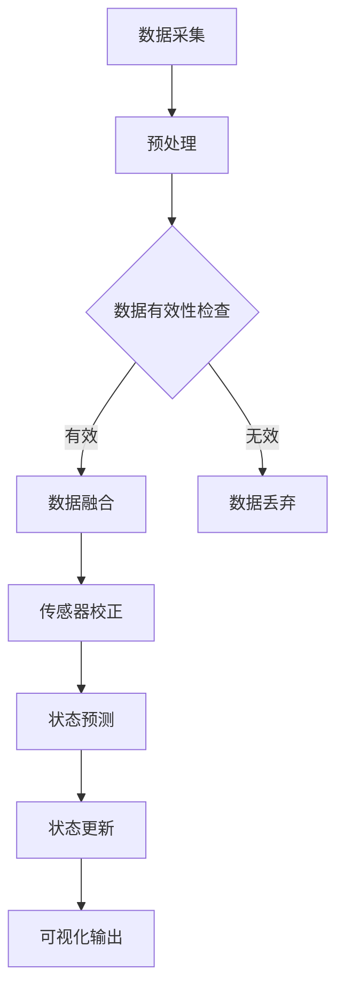
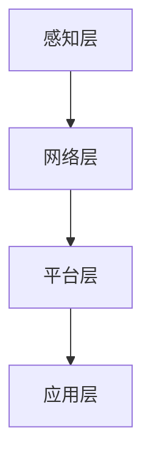

                 

# 智能包装追踪：环境隐形智能在供应链中的作用

关键词：智能包装、环境隐形智能、供应链、追踪技术、算法原理

摘要：随着供应链复杂性的增加，如何在保障商品安全、提高物流效率的同时，降低成本成为供应链管理的关键挑战。智能包装追踪技术的应用，通过环境隐形智能实现了商品在整个供应链中的实时跟踪和管理，成为解决这一问题的有效手段。本文将探讨智能包装追踪的技术原理、实现方法以及在供应链中的应用，为行业提供有益的参考。

## 目录大纲设计思路

设计《智能包装追踪：环境隐形智能在供应链中的作用》的目录大纲，我们首先需要明确文章的核心概念和目标读者，然后根据这些信息来划分章节，细化目录，并确保字数控制在合理范围内。

### 1. 确定核心概念与目标读者

**核心概念**：智能包装追踪、环境隐形智能、供应链。

**目标读者**：供应链管理从业者、物流公司员工、技术爱好者、对智能包装技术感兴趣的读者。

### 2. 划分章节

**章节划分**：

- **引言**：介绍智能包装追踪的背景和重要性。
- **智能包装追踪技术**：解释智能包装追踪的工作原理和技术细节。
- **环境隐形智能在供应链中的应用**：探讨环境隐形智能如何提高供应链的效率和安全性。
- **算法原理讲解**：详细介绍追踪算法的流程、数学模型和应用实例。
- **系统分析与架构设计**：分析智能包装追踪系统的架构，介绍功能设计和接口设计。
- **项目实战**：通过具体项目展示智能包装追踪的实施过程。
- **最佳实践与拓展**：总结实践经验，提出未来发展的建议。

### 3. 细化目录

**细化目录**：

- **引言**：
  - 1.1 供应链的挑战
  - 1.2 智能包装追踪的兴起
  - 1.3 环境隐形智能的优势

- **智能包装追踪技术**：
  - 2.1 智能包装的基本组成
  - 2.2 追踪技术的工作原理
  - 2.3 环境隐形智能的融入

- **环境隐形智能在供应链中的应用**：
  - 3.1 提高物流效率
  - 3.2 提升商品安全性
  - 3.3 降低成本

- **算法原理讲解**：
  - 4.1 追踪算法的mermaid流程图
  - 4.2 追踪算法的数学模型
  - 4.3 实例解析

- **系统分析与架构设计**：
  - 5.1 问题场景介绍
  - 5.2 系统功能设计
  - 5.3 系统架构设计
  - 5.4 系统接口设计和交互设计

- **项目实战**：
  - 6.1 项目背景
  - 6.2 环境安装与配置
  - 6.3 系统核心实现
  - 6.4 案例分析和讲解

- **最佳实践与拓展**：
  - 7.1 注意事项
  - 7.2 未来发展趋势
  - 7.3 拓展阅读

### 4. 控制字数

**字数控制**：确保整个文章的字数在10000～12000字之间，避免冗余，确保内容精炼。

通过以上步骤，我们完成了《智能包装追踪：环境隐形智能在供应链中的作用》的目录大纲设计。接下来，我们将根据这个大纲，逐步展开文章的内容。

----------------------------------------------------------------

## 引言

随着全球化进程的加快和电子商务的蓬勃发展，供应链的复杂性日益增加。企业面临着物流成本高、效率低、商品易丢失等问题，这些问题不仅增加了运营成本，还影响了客户满意度。在这种背景下，智能包装追踪技术应运而生，成为解决供应链管理难题的一大利器。

### 1. 供应链的挑战

供应链管理是一个复杂的过程，涉及多个环节，包括原材料采购、生产制造、仓储物流、配送运输和最终销售等。在传统的供应链管理中，商品在各个环节之间的流动往往缺乏透明度和可追溯性，导致以下问题：

- **物流成本高**：由于信息不透明，物流环节中的重复运输、库存积压等问题难以避免，增加了物流成本。

- **效率低**：缺乏有效的追踪手段，导致物流流程中的延误和错误，降低了整体效率。

- **商品易丢失**：在运输和仓储过程中，商品易受损坏或丢失，增加了风险和损失。

- **客户满意度低**：供应链的不透明和效率问题直接影响客户满意度，尤其是在电子商务领域。

### 2. 智能包装追踪的兴起

智能包装追踪技术的出现，为解决供应链管理中的问题提供了新的思路。智能包装是指在传统包装基础上，嵌入传感器、RFID（射频识别）等智能设备，实现对商品在整个供应链中的实时跟踪和管理。智能包装追踪技术的核心优势在于：

- **实时性**：通过传感器和RFID等设备，能够实时获取商品的位置信息，实现供应链的透明化管理。

- **准确性**：智能设备具有高准确性的定位能力，可以有效减少物流环节中的错误和延误。

- **安全性**：智能包装可以提供商品的实时状态信息，有助于降低商品损坏和丢失的风险。

- **效率提升**：通过实时追踪和管理，可以优化物流流程，提高整体效率，降低成本。

### 3. 环境隐形智能的优势

环境隐形智能是将智能技术融入日常环境中，实现物品的无感追踪和自动识别。在智能包装追踪中，环境隐形智能发挥了重要作用，其优势包括：

- **无感追踪**：通过环境隐形智能，可以实现商品的自动追踪，无需人工干预，提高效率。

- **自动识别**：智能设备能够自动识别商品信息，实现快速处理和分类，减少人工错误。

- **多维度数据**：环境隐形智能可以获取商品的多种数据，如温度、湿度、光照等，提供更全面的信息支持。

- **智能决策**：基于收集到的多维度数据，系统可以做出智能决策，优化供应链管理。

综上所述，智能包装追踪和环境隐形智能在供应链管理中具有显著的优势，能够有效解决传统供应链中的问题，提高物流效率和商品安全性，降低成本，提升客户满意度。接下来，我们将深入探讨智能包装追踪技术的工作原理和实现方法。

----------------------------------------------------------------

## 智能包装追踪技术

智能包装追踪技术是通过将智能设备嵌入传统包装中，实现对商品在供应链中的实时跟踪和管理。以下将详细介绍智能包装的基本组成、追踪技术的工作原理以及环境隐形智能的融入。

### 1. 智能包装的基本组成

智能包装主要由以下几部分组成：

- **传感器**：传感器是智能包装的核心部件，用于感知商品的环境信息，如温度、湿度、光照、震动等。常用的传感器有温湿度传感器、光照传感器、加速度传感器等。

- **RFID标签**：RFID（射频识别）标签是一种通过无线电波实现数据传输的智能设备，可以存储商品信息，并在读取器的作用下实现商品的自动识别和追踪。

- **无线通信模块**：无线通信模块用于将传感器和RFID标签收集到的数据传输到云端或中央服务器，实现数据的远程监控和管理。常用的无线通信技术有Wi-Fi、蓝牙、Zigbee等。

- **能源供应**：智能包装需要稳定的能源供应来支持传感器和通信模块的工作。常见的能源供应方式有电池、太阳能等。

- **数据处理单元**：数据处理单元是智能包装的“大脑”，用于处理传感器数据和通信数据，实现对商品的实时监控和管理。

### 2. 追踪技术的工作原理

智能包装追踪技术的工作原理可以分为以下几个步骤：

- **数据采集**：传感器和RFID标签将商品的环境信息（如温度、湿度、位置等）采集到数据处理单元。

- **数据传输**：数据处理单元将采集到的数据通过无线通信模块传输到云端或中央服务器。

- **数据存储与处理**：云端或中央服务器将接收到的数据进行存储和处理，生成商品的实时状态报告。

- **数据可视化**：通过用户界面，将处理后的数据以图表、地图等形式展示给用户，实现商品的实时追踪和管理。

### 3. 环境隐形智能的融入

环境隐形智能是将智能技术融入日常环境中，实现物品的无感追踪和自动识别。在智能包装追踪中，环境隐形智能的融入主要体现在以下几个方面：

- **智能传感网络**：通过部署智能传感器，构建覆盖整个供应链的智能传感网络，实现商品环境信息的实时采集。

- **边缘计算**：在智能包装中集成边缘计算模块，实现数据的本地处理和快速响应，降低延迟，提高效率。

- **人工智能算法**：利用人工智能算法对采集到的数据进行实时分析和处理，实现商品的智能识别和预测。

- **自动化处理**：通过自动化处理流程，实现对商品的自动识别、分类、调度和管理，提高供应链的自动化水平。

### 4. 智能包装追踪的案例分析

为了更好地理解智能包装追踪技术的实际应用，以下是一个案例分析：

**案例：农产品供应链中的智能包装追踪**

某农产品公司采用智能包装追踪技术，对其生鲜农产品进行实时监控和管理。具体做法如下：

- **传感器嵌入**：在每一件农产品包装中嵌入温度传感器和湿度传感器，实时监测农产品的环境状态。

- **RFID标签**：在农产品包装上粘贴RFID标签，实现商品的自动识别和追踪。

- **无线传输**：通过无线通信模块，将传感器采集的数据实时传输到云端服务器。

- **数据分析**：云端服务器对接收到的数据进行实时分析，生成农产品的实时状态报告，包括温度、湿度等信息。

- **可视化展示**：通过用户界面，将分析结果以图表和地图形式展示给用户，实现农产品的实时追踪。

通过智能包装追踪技术，该公司成功实现了对生鲜农产品的实时监控和管理，提高了物流效率，降低了商品损坏和丢失的风险，提高了客户满意度。

综上所述，智能包装追踪技术通过将智能设备嵌入传统包装，实现了商品在供应链中的实时跟踪和管理。环境隐形智能的融入，进一步提高了追踪技术的智能化和自动化水平，为供应链管理提供了有力支持。

----------------------------------------------------------------

## 环境隐形智能在供应链中的应用

环境隐形智能通过将智能技术融入日常环境中，实现对物品的无感追踪和自动识别。在供应链管理中，环境隐形智能的应用不仅提高了物流效率和商品安全性，还有助于降低成本，提升整体供应链的竞争力。以下将详细探讨环境隐形智能在供应链中的具体应用。

### 1. 提高物流效率

物流效率是供应链管理中的一个关键指标。环境隐形智能通过实时追踪和管理商品，可以显著提高物流效率：

- **实时监控**：通过智能传感器和RFID标签，可以实时监控商品的位置、状态和环境条件。这有助于物流公司及时调整运输路线和物流策略，减少运输延误和库存积压。

- **自动化处理**：环境隐形智能可以实现商品的自动识别和分类，减少人工干预。例如，在仓储和配送中心，智能传感器可以自动识别进入的货物，并指导仓储机器人进行分类和存储，提高作业效率。

- **快速响应**：环境隐形智能可以实时收集和分析商品信息，帮助物流公司快速响应客户需求，缩短订单处理和配送时间。

### 2. 提升商品安全性

商品安全性是供应链管理中不可忽视的重要环节。环境隐形智能的应用可以有效提升商品安全性：

- **防损监控**：智能传感器可以实时监测商品的温度、湿度等环境参数，及时发现异常情况，避免商品因环境变化而损坏。

- **防盗追踪**：通过RFID标签和无线通信模块，物流公司可以实时监控商品的位置，防止商品被盗或丢失。

- **安全保障**：环境隐形智能可以提供全面的商品安全保障措施，包括环境监测、定位追踪、异常报警等，确保商品在整个供应链过程中的安全。

### 3. 降低成本

在供应链管理中，成本控制是每个企业关注的重点。环境隐形智能的应用有助于降低成本：

- **减少人工成本**：通过自动化处理和智能识别，可以减少对人工的依赖，降低人工成本。

- **优化物流成本**：实时监控和智能决策可以帮助物流公司优化运输路线和仓储布局，降低物流成本。

- **减少资源浪费**：环境隐形智能可以实时监控商品的库存状态，减少库存积压和资源浪费。

### 4. 提升客户满意度

客户满意度是衡量供应链管理成效的重要指标。环境隐形智能的应用有助于提升客户满意度：

- **透明化管理**：通过实时追踪和管理商品，客户可以随时查询商品的实时状态，提升供应链的透明度。

- **快速响应**：环境隐形智能可以帮助企业快速响应客户需求，提高订单处理和配送速度。

- **安全保障**：商品的安全保障措施可以增强客户对供应链的信任，提升客户满意度。

### 5. 案例分析

为了更好地理解环境隐形智能在供应链中的应用，以下是一个案例分析：

**案例：某电子商务平台的智能物流**

某电子商务平台采用环境隐形智能技术，对其物流过程进行实时监控和管理。具体应用如下：

- **智能包装**：在商品包装中嵌入温度传感器、湿度传感器和RFID标签，实现商品的实时追踪和管理。

- **智能仓储**：在仓储中心部署智能传感器和仓储机器人，实现货物的自动识别、分类和存储。

- **智能配送**：通过实时监控商品的位置，优化配送路线，提高配送效率。

- **数据分析**：通过环境隐形智能技术，实时收集和分析商品信息，为决策提供数据支持。

通过智能物流系统的实施，该电子商务平台成功实现了物流效率的提升、商品安全性的增强和成本的降低，客户满意度显著提高。

综上所述，环境隐形智能在供应链中的应用为物流效率、商品安全性和成本控制带来了显著提升，有助于企业提高竞争力，实现可持续发展。

----------------------------------------------------------------

## 算法原理讲解

智能包装追踪技术的核心在于追踪算法的设计与实现。追踪算法负责解析传感器数据和RFID标签信息，实现商品在供应链中的精准定位和状态监控。以下将详细介绍追踪算法的mermaid流程图、数学模型和公式，并通过具体实例进行讲解。

### 1. 追踪算法的mermaid流程图

追踪算法的mermaid流程图展示了从数据采集到状态更新的整个过程。以下是mermaid流程图示例：



- **数据采集**：从传感器和RFID标签收集商品位置、温度、湿度等数据。
- **预处理**：对采集到的数据进行初步处理，如滤波、去噪等。
- **数据有效性检查**：检查预处理后的数据是否有效，如数据范围是否在合理范围内。
- **数据融合**：将多个传感器的数据进行融合，提高数据的准确性和可靠性。
- **传感器校正**：对数据进行传感器校正，消除传感器误差。
- **状态预测**：利用历史数据和机器学习算法，预测商品的未来状态。
- **状态更新**：根据预测结果更新商品的状态。
- **可视化输出**：将最终的状态信息以图表或地图的形式展示给用户。

### 2. 追踪算法的数学模型

追踪算法的数学模型主要包括位置估计、状态预测和误差校正等部分。以下是一个简化的数学模型：

#### 位置估计

$$
\hat{x}_{t} = \frac{w_{1}x_{t-1} + w_{2}z_{t}}{w_{1} + w_{2}}
$$

其中，$\hat{x}_{t}$ 是时刻 $t$ 的商品位置估计，$x_{t-1}$ 是时刻 $t-1$ 的位置，$z_{t}$ 是时刻 $t$ 的传感器测量值，$w_{1}$ 和 $w_{2}$ 是权重系数。

#### 状态预测

$$
\hat{x}_{t+1} = a\hat{x}_{t} + (1-a)z_{t}
$$

其中，$\hat{x}_{t+1}$ 是时刻 $t+1$ 的预测位置，$a$ 是预测系数。

#### 误差校正

$$
e_{t} = \hat{x}_{t} - x_{t}
$$

其中，$e_{t}$ 是时刻 $t$ 的误差值，$\hat{x}_{t}$ 是估计位置，$x_{t}$ 是实际位置。

### 3. 实例解析

假设一个商品从北京运往上海，途中需要经过多个城市。以下是商品在运输过程中的追踪实例：

#### 数据采集

- 传感器1（温度传感器）测量值为 25°C。
- 传感器2（湿度传感器）测量值为 60%。
- RFID标签测量值为“北京”。

#### 数据预处理

- 对传感器数据进行滤波，去除噪声。

#### 数据有效性检查

- 检查数据范围，如温度在 20°C 至 30°C 范围内，湿度在 40% 至 80% 范围内。

#### 数据融合

- 将传感器1和传感器2的数据进行融合，得到加权平均位置。

#### 传感器校正

- 根据传感器校正公式，对温度和湿度进行校正。

#### 状态预测

- 利用历史数据和机器学习算法，预测商品的未来位置。

#### 状态更新

- 根据预测结果，更新商品的位置信息。

#### 可视化输出

- 将商品的位置和状态信息以地图形式展示。

通过以上实例，我们可以看到追踪算法在实时监控商品位置和状态方面的应用。实际应用中，追踪算法会更加复杂，涉及更多的传感器数据和复杂的数学模型，但基本原理相同。

综上所述，追踪算法是智能包装追踪技术的核心组成部分，通过mermaid流程图和数学模型，我们可以清晰地理解追踪算法的工作原理和实现方法。在具体应用中，追踪算法可以根据实际需求进行优化和调整，以实现更高的准确性和可靠性。

----------------------------------------------------------------

## 系统分析与架构设计方案

智能包装追踪系统是一个复杂的系统，涉及多个功能模块和子系统。以下将详细介绍系统分析与架构设计方案，包括问题场景介绍、系统功能设计、系统架构设计、系统接口设计和交互设计。

### 1. 问题场景介绍

在供应链管理中，物流企业面临着以下问题：

- **商品丢失和损坏**：在运输和仓储过程中，商品容易丢失或损坏，导致经济损失和客户投诉。
- **物流效率低**：物流流程繁琐，缺乏有效的监控和管理手段，导致运输延误和库存积压。
- **信息不透明**：商品在供应链中的实时状态信息不透明，难以实时掌握商品的位置和状态。
- **成本高**：物流成本高，难以实现成本控制和优化。

为了解决这些问题，智能包装追踪系统应运而生，通过实时监控和管理商品，提高物流效率，降低成本，提升商品安全性。

### 2. 系统功能设计

智能包装追踪系统的功能设计主要包括以下几个部分：

- **数据采集**：通过传感器和RFID标签收集商品的位置、温度、湿度等信息。
- **数据处理**：对采集到的数据进行预处理、融合和校正，生成商品的状态信息。
- **实时监控**：通过可视化界面实时展示商品的位置和状态，提供实时数据支持。
- **异常报警**：当检测到异常情况（如温度异常、位置偏离等）时，系统自动发出报警信息。
- **智能决策**：利用机器学习算法分析数据，提供智能决策支持，优化物流流程。

以下是系统功能设计的mermaid类图：

```mermaid
classDiagram
    类A[数据采集] <|-- 类B[数据处理]
    类B <|-- 类C[实时监控]
    类C <|-- 类D[异常报警]
    类D <|-- 类E[智能决策]
```

### 3. 系统架构设计

智能包装追踪系统的架构设计主要包括以下几个层次：

- **感知层**：包括传感器和RFID标签，负责数据采集。
- **网络层**：包括无线通信模块和网关，负责数据传输。
- **平台层**：包括数据处理模块、监控模块和决策模块，负责数据处理和智能决策。
- **应用层**：包括可视化界面和应用程序，负责展示和交互。

以下是系统架构设计的mermaid架构图：



### 4. 系统接口设计和交互设计

系统接口设计和交互设计是确保系统各模块之间高效协同工作的关键。以下是系统接口设计和交互设计的mermaid序列图：

```mermaid
sequenceDiagram
    participant 用户 as 用户
    participant 系统A as 数据采集
    participant 系统B as 数据处理
    participant 系统C as 实时监控
    participant 系统D as 异常报警
    participant 系统E as 智能决策

    用户->>系统A: 发起数据采集请求
    系统

