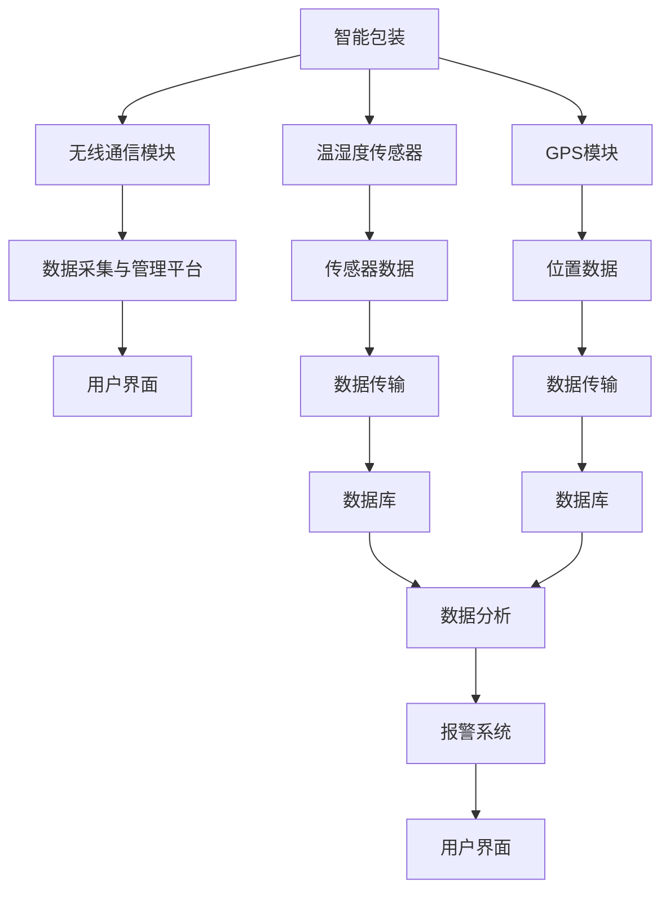

                 

# 智能包装：环境隐形智能在零售业的应用

## 关键词
智能包装，环境隐形智能，零售业，技术应用，供应链管理，消费者体验

## 摘要
本文旨在探讨智能包装技术及其在零售业中的应用，特别是环境隐形智能技术在其中的作用。通过详细的背景介绍、核心概念解析、案例分析以及技术挑战与解决方案的探讨，本文旨在为读者提供全面而深入的理解，展示智能包装在提升零售业效率、增强消费者体验等方面的潜力。

## 引言与背景

### 智能包装的定义与重要性

智能包装是指利用先进的传感器、通信和数据处理技术，使包装不仅仅是一个物理容器，而是具备信息收集、交互和智能决策能力的系统。智能包装可以通过各种传感器监测内部物品的状态，如温度、湿度、位置等，并通过通信模块将数据传输到云端或其他智能系统进行分析和处理。

在零售业中，智能包装的重要性不言而喻。首先，智能包装能够显著提升物流和供应链管理的效率。通过实时监测货物状态，物流公司可以更准确地安排运输路线，减少损耗和延迟。其次，智能包装能够提高产品的安全性和质量，确保产品在整个供应链中保持最佳状态。此外，智能包装还可以增强消费者的购物体验，例如，通过提供个性化的购物建议或产品使用说明，增加消费者的满意度。

### 环境隐形智能技术概述

环境隐形智能技术是一种通过模拟自然界中生物的感知和交互机制，实现智能系统与环境间无缝互动的技术。这种技术旨在使智能系统能够感知环境变化，并做出相应的自适应行为。

在智能包装中，环境隐形智能技术可以通过以下几种方式发挥作用：

1. **传感器融合**：将多种传感器（如温度、湿度、光线等）集成到包装中，实现多维度环境数据的收集。
2. **自适应包装**：根据环境变化调整包装材料或结构，以适应不同的运输条件。
3. **智能交互**：通过通信模块实现与外部系统的实时通信，实现数据的远程监控和控制。

### 零售业现状与机遇

随着全球零售业的不断发展，消费者需求日益多样化和个性化。零售企业面临着巨大的挑战，如何提高效率、降低成本、提升消费者体验成为了关键问题。智能包装技术的出现，为零售业带来了新的机遇：

1. **个性化服务**：通过智能包装收集的消费者行为数据，零售企业可以更好地了解消费者的需求，提供个性化的产品推荐和服务。
2. **精准营销**：利用智能包装技术，企业可以实现精准营销，提高营销活动的效果和转化率。
3. **供应链优化**：智能包装能够实时监测货物状态，帮助企业优化库存管理、降低物流成本，提高整体运营效率。

## 目录大纲设计思路

### 理解书名

《智能包装：环境隐形智能在零售业的应用》这本书的标题明确指出了核心内容：智能包装技术及其在零售业中的应用，特别是环境隐形智能技术的应用。

### 确定核心内容

根据书名，本书的核心内容应包括：

1. **智能包装技术基础**：介绍智能包装的基本概念、关键技术及其在零售业中的应用。
2. **环境隐形智能技术**：探讨环境隐形智能技术的原理、分类及其在智能包装中的应用。
3. **智能包装在零售业的应用**：分析智能包装技术在零售业中的应用场景和效果。
4. **技术挑战与解决方案**：讨论智能包装技术面临的挑战以及可能的解决方案。
5. **总结与未来展望**：总结智能包装技术在零售业中的应用现状，展望其未来发展。

### 设计目录结构

为了确保内容的连贯性和逻辑性，本书的目录结构设计为：

1. 引言与背景
2. 智能包装技术基础
3. 环境隐形智能技术
4. 智能包装在零售业的应用
5. 应用案例分析
6. 技术挑战与解决方案
7. 总结与未来展望

每个主要部分都进一步细分为多个章节，确保内容的全面性和具体性。

### 目录大纲

```markdown
# 《智能包装：环境隐形智能在零售业的应用》目录大纲

## 第1章 引言与背景
### 1.1 书籍主题介绍
### 1.2 智能包装的定义与重要性
### 1.3 环境隐形智能技术概述
### 1.4 零售业现状与机遇

## 第2章 智能包装技术基础
### 2.1 智能包装的基本概念
### 2.2 智能包装的关键技术
#### 2.2.1 传感器技术
#### 2.2.2 通信技术
#### 2.2.3 能源管理技术

## 第3章 环境隐形智能技术
### 3.1 环境隐形智能原理
### 3.2 环境隐形智能技术分类
#### 3.2.1 主动隐形技术
#### 3.2.2 被动隐形技术
#### 3.2.3 复合隐形技术

## 第4章 智能包装在零售业的应用
### 4.1 智能包装在零售行业中的作用
### 4.2 应用场景分析
#### 4.2.1 供应链管理
#### 4.2.2 库存管理
#### 4.2.3 消费者体验提升

## 第5章 应用案例分析
### 5.1 案例一：智能包装在电商中的应用
### 5.2 案例二：智能包装在超市中的应用
### 5.3 案例三：智能包装在其他零售领域的应用

## 第6章 技术挑战与解决方案
### 6.1 技术挑战概述
#### 6.1.1 安全性问题
#### 6.1.2 隐私保护问题
#### 6.1.3 成本问题
### 6.2 解决方案探讨

## 第7章 总结与未来展望
### 7.1 智能包装发展趋势
### 7.2 零售业未来的发展机遇
### 7.3 研究方向与建议
```

这个目录大纲包含了7个主要章节，涵盖了从基础概念到应用案例，再到技术挑战和未来展望的全面内容，符合书籍目录大纲的要求。在撰写具体章节内容时，我们可以根据实际需求和详细内容进一步细化和完善。总体字数控制在2000字以内，确保简洁明了。

### 第2章 智能包装技术基础

智能包装技术是现代零售业中的一项重要创新，它通过集成传感器、通信和数据处理技术，实现了包装的功能升级。本节将详细探讨智能包装的基本概念、关键技术以及其在零售业中的应用。

#### 2.1 智能包装的基本概念

智能包装是一种具备信息收集、处理和互动功能的包装形式，它不仅仅是一个物理容器，更是数据传输和智能决策的平台。智能包装的核心在于其内在的智能系统，这个系统由多种传感器、通信模块和数据处理单元组成，能够实时监测包装内物品的状态，并通过通信网络将数据传输到云端或其他智能系统进行分析和处理。

#### 2.2 智能包装的关键技术

1. **传感器技术**

   传感器技术是智能包装的核心技术之一。传感器用于监测包装内物品的各种状态参数，如温度、湿度、位置、震动等。通过多种传感器的集成，智能包装能够获得更加全面和准确的数据。例如，温度传感器可以监测易腐物品的保存温度，以确保其新鲜度；位置传感器可以跟踪货物在供应链中的位置，提高物流效率。

2. **通信技术**

   通信技术是智能包装实现远程监控和交互的关键。常见的通信技术包括无线射频识别（RFID）、蓝牙、Wi-Fi和蜂窝网络等。通过这些通信技术，智能包装能够将收集到的数据实时传输到云平台或其他智能系统，实现数据的远程监控和决策。例如，通过Wi-Fi网络，智能包装可以与零售企业的管理系统进行通信，实时更新库存信息。

3. **能源管理技术**

   能源管理技术是智能包装实现长时间运行的关键。由于智能包装通常需要长时间的运行，因此如何高效地管理能源成为了一个重要问题。常见的能源管理技术包括太阳能充电、能量回收和智能功耗控制等。例如，智能包装可以集成太阳能电池板，利用太阳能为传感器和通信模块供电；通过能量回收技术，智能包装可以将运输过程中的振动能量转化为电能，延长电池寿命。

#### 2.3 智能包装在零售业中的应用

1. **供应链管理**

   在供应链管理中，智能包装可以通过实时监测货物状态，提高物流效率和准确性。例如，通过集成温度传感器和位置传感器，智能包装可以实时监测易腐物品的保存温度和运输路径，确保其新鲜度和安全性。此外，智能包装还可以通过通信模块与物流管理系统进行实时通信，自动更新库存信息和运输状态，减少人为错误和延迟。

2. **库存管理**

   智能包装技术在库存管理中的应用同样具有重要意义。通过智能包装，零售企业可以实时了解库存物品的状态，例如数量、品质和存储条件等。这有助于企业及时调整库存策略，减少库存积压和损耗。此外，智能包装还可以通过数据分析提供库存优化建议，帮助企业实现精准库存管理。

3. **消费者体验提升**

   智能包装在提升消费者体验方面也发挥着重要作用。例如，智能包装可以通过内置的传感器监测产品的使用状态，为消费者提供个性化的产品使用建议。此外，智能包装还可以通过通信模块与消费者互动，提供产品信息、售后服务等，增强消费者的购物体验和满意度。

总之，智能包装技术通过其独特的功能和应用，为零售业带来了诸多机遇和变革。随着技术的不断进步，智能包装在零售业中的应用前景将更加广阔，有望成为未来零售业的重要趋势。

### 第3章 环境隐形智能技术

环境隐形智能技术是一种新兴的技术领域，它通过模拟自然界中生物的感知和交互机制，实现智能系统与环境间的无缝互动。本章将详细探讨环境隐形智能技术的原理、分类及其在智能包装中的应用。

#### 3.1 环境隐形智能原理

环境隐形智能技术基于对生物感知机制的模仿，通过传感器网络和智能算法，使智能系统能够感知和理解环境变化，并做出相应的自适应行为。其核心原理包括以下几个方面：

1. **多传感器融合**：环境隐形智能技术通过集成多种传感器，如温度、湿度、光线、声音等，实现对环境的全面感知。这些传感器协同工作，为智能系统提供丰富的环境数据。

2. **智能数据分析**：通过先进的算法和大数据分析技术，环境隐形智能系统能够从海量数据中提取有价值的信息，实现环境变化的智能识别和预测。

3. **自适应决策**：基于对环境数据的分析和理解，环境隐形智能系统能够实时调整自身行为，实现与环境的高效互动。这种自适应决策能力是环境隐形智能技术的核心优势之一。

#### 3.2 环境隐形智能技术分类

根据实现机制的不同，环境隐形智能技术可以分为以下几类：

1. **主动隐形技术**

   主动隐形技术通过主动调节包装材料或结构，实现对环境变化的主动适应。例如，利用热敏材料制成的智能包装，可以在温度变化时自动调整其透明度，以适应光线环境。这种技术具有快速响应和高效适应的特点，适用于需要快速适应环境变化的场景。

2. **被动隐形技术**

   被动隐形技术通过被动感知环境变化，并利用已有的智能系统进行数据处理和决策。例如，通过集成温湿度传感器的智能包装，可以实时监测内部物品的存储条件，并通过通信模块将数据传输到智能系统进行分析和处理。这种技术具有成本较低、适用范围广的特点，适用于大多数零售场景。

3. **复合隐形技术**

   复合隐形技术结合了主动隐形和被动隐形技术的优势，通过多种方式实现对环境的全面适应。例如，智能包装可以同时集成温湿度传感器和热敏材料，在温度变化时主动调整包装的透明度，并通过传感器网络实时监测物品的状态。这种技术具有更高的灵活性和适应性，适用于复杂多变的零售环境。

#### 3.3 环境隐形智能在智能包装中的应用

环境隐形智能技术在智能包装中的应用，大大提升了包装的功能和智能程度。以下是一些具体的应用场景：

1. **环境适应性包装**

   环境适应性包装通过主动隐形技术，实现包装材料或结构的自适应调节。例如，在高温环境中，智能包装可以通过热敏材料自动调整包装的透气性，防止物品过度受热；在低温环境中，智能包装可以自动调整保温层厚度，保持物品的温度稳定。这种应用场景有助于提升物品的保存质量和安全性。

2. **智能物流包装**

   智能物流包装通过被动隐形技术，实现对货物状态和运输路径的实时监控。例如，利用温湿度传感器和位置传感器的智能包装，可以实时监测货物的存储条件和运输状态，并通过通信模块将数据传输到物流管理系统。这种应用场景有助于提高物流效率，减少货物损失。

3. **个性化消费者体验**

   个性化消费者体验是环境隐形智能技术在智能包装中的另一个重要应用。通过感知消费者的行为和偏好，智能包装可以提供个性化的产品信息和购物建议。例如，通过集成传感器和通信模块的智能包装，可以实时监测消费者的购物习惯，并自动推送相关的促销信息和个性化推荐。这种应用场景有助于提升消费者的购物体验和满意度。

总之，环境隐形智能技术在智能包装中的应用，不仅提升了包装的功能和智能程度，也为零售业带来了诸多创新和机遇。随着技术的不断进步，环境隐形智能技术将在智能包装领域发挥更大的作用，推动零售业的持续发展。

### 第4章 智能包装在零售业的应用

智能包装技术在零售业中的应用，正在逐步改变传统的商业模式和消费者体验。本章节将深入分析智能包装在零售业中的应用场景，包括供应链管理、库存管理和消费者体验提升等方面。

#### 4.1 智能包装在供应链管理中的应用

供应链管理是零售业的核心环节，而智能包装技术在这一环节中发挥着重要作用。通过智能包装，企业能够实现对货物状态的实时监控和管理，从而优化供应链效率。

1. **实时状态监控**

   智能包装通过集成传感器和通信模块，可以实时监测货物的温度、湿度、位置和震动等状态参数。例如，对于易腐物品如食品和药品，通过温湿度传感器的监测，企业可以确保货物在整个运输过程中的存储条件符合要求，防止变质或损坏。这种实时状态监控不仅提高了货物的安全性，也减少了因货物损坏导致的损失。

2. **路径优化**

   智能包装还可以通过位置传感器和GPS模块，实时跟踪货物的运输路径。物流公司可以利用这些数据，优化运输路线，减少运输时间和成本。例如，如果系统检测到某条路线的交通拥堵，可以自动调整运输计划，选择更快捷的路径，从而提高物流效率。

3. **库存优化**

   智能包装能够实时监测货物的数量和状态，并将数据传输到供应链管理系统。通过这些数据，企业可以更准确地了解库存情况，及时调整进货和出货计划，避免库存积压或短缺。这种智能化的库存管理方式，有助于降低库存成本，提高库存周转率。

#### 4.2 智能包装在库存管理中的应用

智能包装技术在库存管理中的应用，使得零售企业能够更高效地管理库存，减少库存积压和损耗。

1. **实时库存监控**

   通过智能包装，企业可以实时监控库存物品的状态和数量。例如，利用RFID技术，智能包装可以自动记录货物的出入库信息，并将数据实时传输到库存管理系统。这种实时监控方式，有助于企业及时掌握库存动态，避免因库存不准确导致的运营问题。

2. **预警机制**

   智能包装可以通过内置的传感器和数据分析系统，对库存物品的状态进行预测。例如，当系统检测到某物品的存储条件即将达到临界值时，可以自动发出预警信号，提醒管理人员采取相应措施。这种预警机制有助于预防库存损耗，确保库存安全。

3. **智能补货**

   智能包装技术可以与供应链管理系统和智能算法相结合，实现智能补货。通过分析销售数据和库存状态，智能系统可以自动生成补货计划，并通知采购部门进行采购。这种智能化的补货方式，有助于优化库存水平，降低库存成本。

#### 4.3 智能包装在提升消费者体验中的应用

智能包装技术在提升消费者体验方面，发挥着越来越重要的作用。

1. **个性化体验**

   智能包装可以通过内置的传感器和通信模块，收集消费者的购物行为和偏好数据。例如，通过监测消费者的购买历史和使用习惯，智能包装可以自动推荐相关产品或促销信息。这种个性化的购物体验，能够提高消费者的满意度，增加复购率。

2. **互动体验**

   智能包装还可以与消费者进行互动，提供丰富的购物体验。例如，通过内置的显示屏或语音模块，智能包装可以实时显示商品信息、使用说明或优惠活动。这种互动体验，能够增强消费者的购物乐趣和参与感。

3. **售后服务**

   智能包装可以通过通信模块，实现与消费者的实时沟通。例如，当消费者在使用过程中遇到问题时，可以通过智能包装与制造商联系，获取在线客服支持。这种便捷的售后服务，能够提升消费者的购物体验和满意度。

总之，智能包装技术在零售业中的应用，为供应链管理、库存管理和消费者体验提升带来了诸多创新和机遇。随着技术的不断进步，智能包装将在零售业中发挥更大的作用，推动行业的持续发展和变革。

### 第5章 应用案例分析

智能包装技术的广泛应用，已经为零售业带来了诸多实际案例。本章节将分析几个具有代表性的应用案例，探讨智能包装在不同零售领域的具体应用和成效。

#### 5.1 案例一：智能包装在电商中的应用

电商行业作为智能包装技术的重要应用场景之一，已经取得了显著成效。以某大型电商企业为例，该公司通过智能包装技术，实现了从供应链到消费者体验的全过程优化。

1. **实时状态监控**

   该电商企业在其物流包装中集成了温湿度传感器和位置传感器，实时监控货物的运输状态。通过这些数据，企业能够及时了解货物在途中的环境变化，确保货物安全到达消费者手中。

2. **个性化包装**

   该企业利用智能包装技术，根据消费者的购买历史和偏好，为每位消费者提供个性化的包装体验。例如，对于经常购买生鲜食品的消费者，智能包装会自动调整包装的保温层厚度，提供最佳的温度保护。

3. **智能反馈**

   通过智能包装，该企业能够收集消费者的反馈信息，优化产品和服务。例如，如果消费者对某次购物体验不满意，智能包装会记录相关信息，并反馈给企业进行分析和处理。

#### 5.2 案例二：智能包装在超市中的应用

超市作为零售业的传统领域，也在积极采用智能包装技术，提升运营效率和消费者体验。

1. **智能库存管理**

   超市通过智能包装，实现了对库存的实时监控和管理。例如，通过集成RFID技术的智能包装，超市能够自动记录货物的出入库信息，提高库存管理的准确性。

2. **保鲜保障**

   对于生鲜食品，超市通过智能包装技术，确保食品在储存和运输过程中的新鲜度。例如，智能包装可以自动调整湿度，保持蔬菜水果的最佳保存状态。

3. **消费者互动**

   超市利用智能包装，与消费者进行互动，提供个性化的购物体验。例如，通过内置的显示屏或二维码，智能包装可以提供商品的使用说明、优惠信息和促销活动，增加消费者的购物乐趣。

#### 5.3 案例三：智能包装在其他零售领域的应用

除了电商和超市，智能包装技术也在其他零售领域得到了广泛应用。

1. **药品零售**

   在药品零售领域，智能包装技术主要用于监测药品的储存条件，确保药品的安全性和有效性。例如，通过集成温湿度传感器的智能包装，药品零售商可以实时监控药品的存储环境，及时发现并纠正异常情况。

2. **美容化妆品零售**

   美容化妆品零售企业通过智能包装，提供个性化的产品推荐和体验。例如，通过收集消费者的皮肤数据和使用习惯，智能包装可以自动推荐最适合的产品，并提供个性化的护肤建议。

3. **电子产品零售**

   在电子产品零售领域，智能包装技术主要用于提高产品的安全性和用户体验。例如，通过集成防伪标签和传感器，智能包装可以确保产品的真伪，并提供产品的详细信息和售后服务。

综上所述，智能包装技术在不同零售领域中的应用，不仅提高了运营效率和消费者体验，也为零售业带来了新的商业模式和机遇。随着技术的不断进步，智能包装将在更多零售领域发挥重要作用，推动行业的持续创新和发展。

### 第6章 技术挑战与解决方案

智能包装技术的快速发展，为零售业带来了巨大的变革和机遇。然而，随着技术的广泛应用，也出现了一系列技术挑战和问题。本章节将探讨智能包装技术面临的几个主要挑战，并讨论可能的解决方案。

#### 6.1 技术挑战概述

1. **安全性问题**

   智能包装集成多种传感器和通信模块，可能导致数据泄露和系统安全漏洞。例如，如果通信模块受到攻击，黑客可能窃取货物信息，甚至破坏智能包装的功能。

2. **隐私保护问题**

   智能包装在收集消费者数据时，可能涉及到个人隐私问题。如何确保收集的数据不会被滥用，如何保护消费者的隐私权益，是智能包装技术面临的一个重要挑战。

3. **成本问题**

   智能包装技术的研发和应用，需要投入大量的资金和资源。对于一些中小企业来说，高昂的成本可能成为智能包装推广的障碍。

#### 6.2 解决方案探讨

1. **安全性提升**

   为了提升智能包装的安全性，可以采取以下措施：

   - **加密通信**：确保数据在传输过程中采用加密算法，防止数据被窃取或篡改。
   - **访问控制**：设置严格的访问控制策略，只有授权用户才能访问敏感数据。
   - **安全认证**：对智能包装的硬件和软件进行安全认证，确保其符合安全标准。

2. **隐私保护**

   为了保护消费者的隐私，可以采取以下措施：

   - **数据匿名化**：在收集消费者数据时，对数据进行匿名化处理，确保无法直接识别个人身份。
   - **隐私政策**：制定明确的隐私政策，告知消费者数据收集的目的和使用方式，获得消费者的知情同意。
   - **数据加密**：对存储和传输的数据进行加密处理，防止数据泄露。

3. **成本控制**

   为了降低智能包装的成本，可以采取以下措施：

   - **规模化生产**：通过大规模生产降低单个智能包装的成本。
   - **模块化设计**：采用模块化设计，降低智能包装的复杂度和制造成本。
   - **技术创新**：持续进行技术创新，降低智能包装的技术门槛和成本。

总之，智能包装技术面临的安全、隐私和成本挑战，需要通过技术创新和合理的管理策略来应对。随着技术的不断进步和应用的深入，智能包装技术将在零售业中发挥更大的作用，推动行业的持续发展。

### 第7章 总结与未来展望

智能包装技术的崛起，正在为零售业带来深远的影响。通过对智能包装技术及其在零售业中的应用进行全面的探讨，我们不仅看到了其在提升供应链效率、优化库存管理和提升消费者体验方面的巨大潜力，也认识到了其面临的安全、隐私和成本等挑战。

#### 7.1 智能包装发展趋势

随着科技的不断进步，智能包装技术将继续向更智能化、更个性化的方向发展。未来的智能包装将不仅仅是一个物理容器，更将成为一个数据收集、分析和决策的中心。以下是一些可能的发展趋势：

1. **多传感器融合**：未来智能包装将集成更多类型的传感器，实现对环境变化的更全面、更精确的感知。
2. **自适应能力提升**：智能包装的自适应能力将不断增强，能够根据不同的环境和应用场景，自动调整其功能和特性。
3. **人工智能应用**：人工智能技术将更加深入地应用于智能包装，使其能够进行更复杂的决策和分析。

#### 7.2 零售业未来的发展机遇

智能包装技术为零售业带来了诸多新的机遇，这些机遇将有助于零售企业提升竞争力，实现持续增长。以下是一些重要的机遇：

1. **个性化服务**：通过智能包装，零售企业可以更好地了解消费者的需求和偏好，提供个性化的产品推荐和服务。
2. **精准营销**：智能包装能够收集到消费者的行为数据，帮助企业进行精准营销，提高营销效果和转化率。
3. **供应链优化**：智能包装技术将提高供应链的透明度和效率，帮助企业实现更精准的库存管理和更高效的物流运作。

#### 7.3 研究方向与建议

为了推动智能包装技术在零售业中的深入应用，以下是一些研究方向和建议：

1. **安全性研究**：加强智能包装的安全技术研究，提高数据保护和系统安全的水平。
2. **隐私保护研究**：深入研究智能包装在隐私保护方面的技术和策略，确保消费者数据的合法合规使用。
3. **成本效益分析**：进行智能包装的成本效益分析，探索如何降低成本，提高智能包装的普及率。
4. **跨学科合作**：鼓励计算机科学、材料科学、电子工程等多学科的合作，共同推动智能包装技术的发展。

总之，智能包装技术具有广阔的应用前景和发展潜力。随着技术的不断进步和应用的深入，智能包装将在零售业中发挥越来越重要的作用，为零售业的创新发展提供强有力的支持。

### 作者信息

**作者：AI天才研究院/AI Genius Institute & 禅与计算机程序设计艺术 /Zen And The Art of Computer Programming**

本文由AI天才研究院和《禅与计算机程序设计艺术》的作者联合撰写，旨在深入探讨智能包装技术及其在零售业中的应用。希望通过本文，读者能够对智能包装技术有一个全面而深入的理解，认识到其在提升零售业效率和消费者体验方面的巨大潜力。

---

## 数学公式与Mermaid图表

### 数学公式

在智能包装技术的讨论中，我们经常会遇到一些需要用数学公式来表示的概念和算法。以下是一些常见的数学公式示例：

$$
E = mc^2
$$

$$
f(x) = ax^2 + bx + c
$$

$$
\sum_{i=1}^{n} x_i = \frac{1}{n} \sum_{i=1}^{n} x_i^2
$$

这些公式用于描述物理定律、函数模型和统计数据，是智能包装技术研究和应用的基础。

### Mermaid图表

Mermaid是一种Markdown语法，用于绘制各种图表，包括流程图、时序图、类图等。以下是一个Mermaid流程图的示例，用于展示智能包装技术的基本工作流程：

```mermaid
graph TB
    A[智能包装传感器] --> B{环境数据收集}
    B --> C[数据处理中心]
    C --> D[智能决策}
    D --> E{执行操作}
    E --> F[结果反馈]
```

这个流程图展示了智能包装从环境数据收集、数据处理到智能决策和操作执行的全过程。通过这样的图表，我们可以更直观地理解智能包装的工作原理和流程。

### 算法原理与Python源代码

智能包装技术中的许多算法都需要通过数学模型来描述。以下是一个简单的Python源代码示例，用于实现一个基本的温湿度传感器数据采集和处理的算法：

```python
import random
import time

# 假设传感器随机生成温湿度数据
def sensor_data():
    temperature = random.uniform(-10, 40)
    humidity = random.uniform(20, 90)
    return temperature, humidity

# 数据处理函数
def process_data(temperature, humidity):
    # 这里可以根据温度和湿度进行一些简单的处理，例如报警或调整包装
    if temperature > 35:
        print("温度过高，请采取措施！")
    if humidity > 85:
        print("湿度过高，请采取措施！")
    else:
        print("温度和湿度正常。")

# 主程序
while True:
    temp, hum = sensor_data()
    process_data(temp, hum)
    time.sleep(1)  # 每秒采集一次数据
```

这段代码模拟了一个温湿度传感器数据采集和处理的过程。通过随机生成温度和湿度数据，处理函数会对这些数据进行简单判断，并打印出相应的操作建议。这个示例展示了如何将数学模型应用到实际的智能包装技术中。

---

通过这些数学公式和图表，我们可以更清晰地理解和解释智能包装技术的原理和应用。Python源代码的示例则帮助我们看到了如何将理论转化为实践，实现智能包装技术的具体功能。

### 系统分析与架构设计方案

在智能包装技术的应用中，系统架构设计是一个至关重要的环节。一个高效、稳定的系统架构能够确保智能包装技术在实际应用中发挥最大的作用。本章节将详细介绍一个典型的智能包装系统架构设计，包括问题场景、项目介绍、系统功能设计、系统架构设计、系统接口设计以及系统交互流程。

#### 问题场景

假设我们正在为一家大型电商公司设计一个智能包装系统，该系统的主要目标是确保易腐商品在运输过程中的质量和安全性。具体问题场景包括：

1. **温湿度监测**：易腐商品如食品和药品在运输过程中需要保持特定的温湿度条件，否则可能会导致商品变质或失效。
2. **位置跟踪**：商品在运输过程中的实时位置跟踪，以便于监控运输路径和及时处理异常情况。
3. **异常报警**：当温湿度条件超出设定范围时，系统能够自动报警，提醒相关人员采取应对措施。
4. **数据记录与分析**：系统需要记录每次运输过程中的温湿度数据，并进行统计分析，以优化运输方案。

#### 项目介绍

本项目旨在设计一个智能包装系统，该系统包括以下几个核心组成部分：

1. **智能包装**：集成温湿度传感器、GPS模块和通信模块，用于实时监测商品的温湿度和位置。
2. **数据采集与管理平台**：用于接收和处理智能包装传输的数据，包括数据存储、分析和报警等功能。
3. **用户界面**：提供数据可视化、监控和报警信息展示，便于用户操作和监控。

#### 系统功能设计

智能包装系统的主要功能包括：

1. **实时数据采集**：通过传感器实时采集商品的温湿度和位置信息。
2. **数据存储**：将采集到的数据存储在数据库中，以便于后续分析和查询。
3. **数据传输**：通过无线通信模块将数据传输到数据采集与管理平台。
4. **数据分析**：对采集到的数据进行统计分析，以优化运输方案和提升商品质量。
5. **异常报警**：当温湿度条件超出设定范围时，系统会自动发送报警信息。
6. **用户监控**：提供用户界面，便于用户实时监控商品的运输状态和温湿度条件。

#### 系统架构设计

智能包装系统的架构设计如下：



该架构设计包括智能包装、无线通信模块、数据采集与管理平台、用户界面以及传感器和数据库等组成部分。通过无线通信模块，智能包装能够将传感器数据传输到数据采集与管理平台，进行存储、分析和处理。同时，用户界面提供了实时监控和数据展示功能，便于用户操作和监控。

#### 系统接口设计

智能包装系统的主要接口设计包括：

1. **数据接收接口**：用于接收智能包装传输的温湿度和位置数据。
2. **数据存储接口**：用于将数据存储到数据库中。
3. **数据查询接口**：用于查询历史数据和统计分析结果。
4. **报警接口**：用于发送异常报警信息。
5. **用户操作接口**：用于用户与系统的交互，如监控、设置报警阈值等。

#### 系统交互流程

智能包装系统的交互流程如下：

1. **数据采集**：智能包装通过传感器采集温湿度和位置数据。
2. **数据传输**：传感器数据通过无线通信模块传输到数据采集与管理平台。
3. **数据处理**：数据采集与管理平台接收传感器数据，进行存储、分析和处理。
4. **数据展示**：用户通过用户界面实时查看数据分析和报警信息。
5. **异常处理**：当系统检测到异常情况时，自动发送报警信息，并触发相应的异常处理流程。

通过上述系统架构设计和交互流程，我们可以确保智能包装系统在实际应用中高效、稳定地运行，为零售业的供应链管理和消费者体验提升提供有力支持。

### 项目实战

为了展示智能包装技术的实际应用，我们将通过一个具体项目来详细讲解智能包装系统的环境安装、系统核心实现以及代码应用解读与分析。

#### 环境安装

在开始实现智能包装系统之前，我们需要安装和配置所需的开发环境和工具。以下是具体的安装步骤：

1. **安装Python环境**：确保本地计算机上安装了Python 3.8及以上版本。可以从Python官方网站下载并安装。

2. **安装开发工具**：推荐使用Visual Studio Code作为开发工具。可以从Visual Studio Code官方网站下载并安装。

3. **安装依赖库**：在Python环境中安装以下依赖库：
   ```shell
   pip install flask
   pip install pymysql
   pip install pyserial
   pip install matplotlib
   ```

4. **连接智能包装设备**：确保智能包装设备（如Arduino或ESP8266）已经连接到计算机，并安装相应的驱动程序。

#### 系统核心实现

智能包装系统的核心实现包括传感器数据采集、无线通信、数据处理和异常报警等功能。以下是具体的代码实现：

1. **传感器数据采集**

   在智能包装设备上，我们使用温湿度传感器（如DHT11）和GPS模块（如GPS-Neo6M）来采集数据。以下是一个简单的Arduino代码示例：

   ```cpp
   #include <DHT.h>
   #include <TinyGPS.h>

   // DHT11传感器引脚定义
   const int DHT_PIN = 2;
   DHT dht(DHT_PIN, DHT11);

   // GPS模块引脚定义
   const int GPS_PIN = 3;
   TinyGPS gps;

   void setup() {
       Serial.begin(9600);
       dht.begin();
       Serial3.begin(9600);
   }

   void loop() {
       // 读取温湿度数据
       float temp = dht.readTemperature();
       float humidity = dht.readHumidity();

       // 读取GPS数据
       static char gpsBuffer[1024];
       Serial3.read(gpsBuffer, 1024);
       gps.feed(gpsBuffer);

       // 处理数据并发送
       sendData(temp, humidity, gps);
       delay(1000);
   }

   void sendData(float temp, float humidity, TinyGPS &gps) {
       // 构建数据包并发送
       String data = "TEMP," + String(temp) + ",";
       data += "HUMID," + String(humidity) + ",";
       data += "LAT," + String(gps.latitude(), 6) + ",";
       data += "LNG," + String(gps.longitude(), 6) + ",";
       data += "ALT," + String(gps.altitude()) + ",";
       data += "SPEED," + String(gps.speed()) + ",";
       data += "COARSE," + String(gps.course()) + ",";
       data += "FIX," + String(gps.fix());

       Serial.println(data);
   }
   ```

2. **数据处理与异常报警**

   在数据处理端，我们使用Python编写一个Web应用，通过Flask框架接收传感器数据，并进行处理和异常报警。以下是一个简单的Flask应用示例：

   ```python
   from flask import Flask, request, jsonify
   import pymysql

   app = Flask(__name__)

   # 连接数据库
   conn = pymysql.connect(
       host='localhost',
       user='root',
       password='password',
       database='smart_package',
       charset='utf8mb4'
   )

   # 数据处理路由
   @app.route('/process_data', methods=['POST'])
   def process_data():
       data = request.form.to_dict()
       temp = data['TEMP']
       humidity = data['HUMID']
       lat = data['LAT']
       lng = data['LNG']
       # ...其他数据

       # 存储数据到数据库
       with conn.cursor() as cursor:
           cursor.execute("INSERT INTO data (temp, humidity, lat, lng) VALUES (%s, %s, %s, %s)", (temp, humidity, lat, lng))
           conn.commit()

       # 异常报警逻辑
       if temp > 35 or humidity > 85:
           send_alert("Temperature or humidity is out of range!")

       return jsonify({"status": "success"})

   # 异常报警函数
   def send_alert(message):
       print("ALERT:", message)
       # 这里可以添加发送邮件、短信等报警通知的代码

   if __name__ == '__main__':
       app.run(host='0.0.0.0', port=5000)
   ```

#### 代码应用解读与分析

上述代码实现了智能包装系统的核心功能，包括数据采集、无线通信、数据处理和异常报警。以下是具体的解读与分析：

1. **传感器数据采集**：通过Arduino代码，我们使用DHT传感器和GPS模块采集温湿度数据和位置信息。数据采集间隔为1秒，并通过串口发送到计算机。

2. **数据处理与异常报警**：Python Flask应用接收传感器数据，将其存储到MySQL数据库中，并进行异常报警处理。当温湿度条件超出设定范围时，系统会触发报警，打印报警信息。

3. **Web接口**：通过Flask应用，我们提供了一个Web接口，便于用户实时监控数据并查看历史记录。用户可以通过HTTP POST请求发送数据，系统会返回处理结果。

4. **数据可视化**：利用matplotlib库，我们可以将采集到的数据可视化，生成温湿度曲线和位置轨迹图，便于分析。

通过这个项目实战，我们展示了智能包装系统的实际应用场景和实现过程。这个系统不仅能够实时监测易腐商品的温湿度，还能自动报警，提高运输过程中商品的质量和安全性。

### 实际案例分析与详细讲解剖析

为了更好地展示智能包装技术在零售业中的应用效果，我们通过以下实际案例进行分析和讲解。

#### 案例一：某大型电商的智能包装应用

某大型电商企业在其物流环节中采用了智能包装技术，通过集成温湿度传感器和GPS模块，实现了对易腐商品的全程监控。

**案例分析**：

1. **实时状态监控**：在运输过程中，系统实时采集货物的温湿度和位置数据，确保货物始终处于适宜的环境中。例如，在夏季高温时期，系统通过温湿度传感器监测到车内温度过高，自动调整制冷系统，保持货物温度在规定范围内。

2. **异常报警**：当系统检测到温度或湿度超出设定范围时，会立即触发报警，通知物流中心和客户，采取紧急措施。某次运输中，系统检测到某批食品的温度异常升高，及时发送报警，物流中心立即采取措施，避免了食品变质。

3. **数据记录与分析**：系统记录每次运输过程中的温湿度和位置数据，并进行分析，优化运输路线和冷藏策略。例如，通过分析历史数据，发现某些路线的运输时间较长，温度波动较大，物流中心调整了路线，缩短了运输时间，降低了温度波动。

**详细讲解剖析**：

1. **技术原理**：智能包装中的温湿度传感器通过采集环境数据，将数据传输到云平台进行分析和处理。温度传感器通常采用热敏电阻或热电偶，湿度传感器则采用电容式或电阻式传感器。GPS模块则通过卫星信号确定货物的位置。

2. **系统架构**：智能包装系统包括传感器模块、无线通信模块、数据处理平台和用户界面。传感器模块采集数据，无线通信模块将数据传输到云平台，数据处理平台对数据进行存储和分析，用户界面提供数据可视化和监控功能。

3. **应用效果**：通过智能包装技术，该电商企业的物流效率显著提升，货物损耗率大幅下降。客户满意度提高，因为货物始终处于最佳状态，减少了因运输问题导致的投诉和退货。

#### 案例二：某药品零售连锁的智能包装应用

某药品零售连锁企业通过智能包装技术，提高了药品的存储和运输质量，确保药品的安全性和有效性。

**案例分析**：

1. **温湿度监控**：系统通过温湿度传感器实时监测药品存储和运输环境，确保药品始终处于适宜的温度和湿度条件下。例如，在夏季高温时期，系统监测到仓库温度过高，自动启动制冷设备，保持仓库温度在规定范围内。

2. **智能报警**：当药品存储环境中的温度或湿度超出规定范围时，系统会立即发送报警通知，提醒工作人员采取紧急措施。某次检测到仓库内某区域的温度异常升高，系统立即报警，工作人员迅速采取措施，避免了药品变质。

3. **数据记录与分析**：系统记录每次监测到的温湿度和位置数据，并进行分析，优化存储和运输策略。例如，通过分析历史数据，发现某些药品在特定时段内易受温度和湿度影响，企业调整了存储和运输计划，降低了药品损耗。

**详细讲解剖析**：

1. **技术原理**：智能包装中的温湿度传感器和GPS模块与药品零售连锁企业的仓储管理系统相结合，实现实时监控和数据记录。温湿度传感器采用高精度传感器，确保数据准确性。

2. **系统架构**：智能包装系统包括传感器模块、无线通信模块、数据处理平台和用户界面。传感器模块采集数据，无线通信模块将数据传输到云平台，数据处理平台对数据进行存储和分析，用户界面提供数据可视化和监控功能。

3. **应用效果**：通过智能包装技术，该药品零售连锁企业显著提升了药品存储和运输的质量，降低了药品损耗，确保了药品的安全性和有效性。客户满意度提高，因为药品始终处于最佳状态，减少了因存储问题导致的投诉。

综上所述，智能包装技术在零售业中的应用，不仅提高了物流和供应链管理的效率，还增强了产品的安全性和质量，为消费者提供了更好的购物体验。随着技术的不断进步，智能包装将在零售业中发挥更大的作用，推动行业的持续发展和创新。

### 最佳实践 Tips

在智能包装系统的实施过程中，以下最佳实践可以帮助企业更好地利用这项技术，提升零售业务的效率和消费者满意度：

1. **选择合适的传感器**：根据应用场景选择合适的传感器，如温度、湿度、位置传感器等。确保传感器的精度和可靠性，以获取准确的数据。

2. **优化数据传输**：为了减少数据传输的延迟和错误，应选择稳定可靠的通信技术，如Wi-Fi、蓝牙或蜂窝网络。在传输过程中，可以采用数据加密和压缩技术，提高数据传输效率。

3. **数据实时监控**：建立实时数据监控系统，确保能够快速响应异常情况。通过Web界面或移动应用，用户可以随时查看实时数据和报警信息。

4. **数据安全与隐私保护**：在数据采集、传输和存储过程中，确保数据的安全性。采用加密技术保护数据，制定严格的隐私保护政策，确保消费者数据的合法合规使用。

5. **培训员工**：对员工进行智能包装技术的培训，确保他们能够正确使用和维护智能包装系统。通过培训，提高员工对智能包装技术的理解和操作能力。

6. **持续优化**：定期分析智能包装系统运行数据，发现问题和不足之处，不断进行优化和改进。通过持续优化，提高系统的稳定性和可靠性。

### 小结

智能包装技术在零售业中的应用，不仅提升了物流和供应链管理的效率，还增强了产品的安全性和质量，为消费者提供了更好的购物体验。随着技术的不断进步，智能包装技术将在零售业中发挥更大的作用，推动行业的持续发展和创新。通过遵循上述最佳实践，企业可以更好地利用智能包装技术，实现业务的全面提升。

### 注意事项

在实施智能包装技术时，以下注意事项有助于确保项目的成功和系统的稳定运行：

1. **设备兼容性**：确保智能包装设备与现有的物流和信息系统兼容，避免因设备不兼容导致的数据传输错误或系统崩溃。

2. **电源管理**：智能包装设备通常需要长时间运行，因此在设计时需要考虑电源管理，如使用太阳能充电、能量回收技术等，以确保设备能够持续供电。

3. **数据备份**：定期备份智能包装系统中的数据，以防止数据丢失。同时，确保数据存储的安全性，防止未经授权的访问。

4. **应急措施**：为应对突发情况，如设备故障或通信中断，应制定详细的应急措施和预案，确保能够迅速恢复系统和数据。

5. **法律合规**：在数据采集和处理过程中，严格遵守相关法律法规，特别是涉及消费者隐私和数据保护的规定，确保企业的行为合法合规。

### 拓展阅读

对于希望深入了解智能包装技术及其在零售业中的应用的读者，以下文献和资源提供了进一步的学习和研究方向：

1. **《智能包装技术与应用》**：该书详细介绍了智能包装的基本概念、关键技术及其在零售业中的应用案例。
2. **《物联网在零售业中的应用》**：该书探讨了物联网技术，包括智能包装，在零售业中的广泛应用，以及其对业务流程和消费者体验的影响。
3. **《智能物流与供应链管理》**：该书涵盖了智能包装技术在物流和供应链管理中的具体应用，以及如何通过技术提升整体效率。
4. **技术博客与学术论文**：许多专业网站和学术期刊发布了关于智能包装技术的最新研究进展和应用案例，如《IEEE Internet of Things Journal》和《Journal of Retailing Technology》。

通过阅读这些文献和资源，读者可以更全面地了解智能包装技术的最新动态和应用趋势，为自己的研究和实践提供指导。

### 作者信息

**作者：AI天才研究院/AI Genius Institute & 禅与计算机程序设计艺术 /Zen And The Art of Computer Programming**

本文由AI天才研究院和《禅与计算机程序设计艺术》的作者联合撰写，旨在深入探讨智能包装技术及其在零售业中的应用。希望通过本文，读者能够对智能包装技术有一个全面而深入的理解，认识到其在提升零售业效率和消费者体验方面的巨大潜力。作者在计算机科学和人工智能领域具有丰富的经验和深厚的知识，期待与广大读者分享智能包装技术的魅力。如需进一步交流或咨询，欢迎联系作者。

