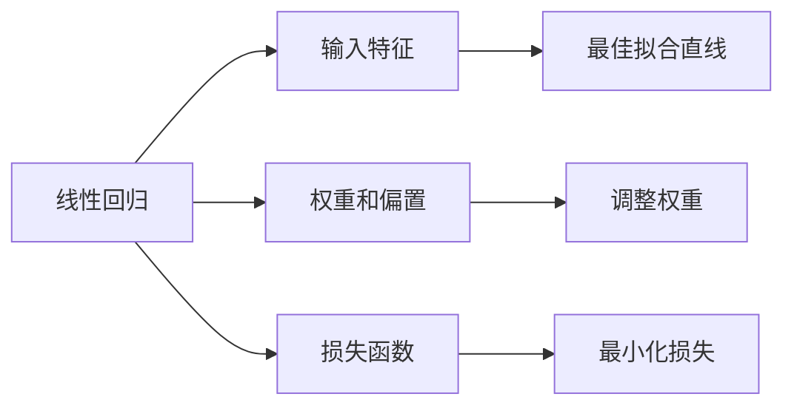
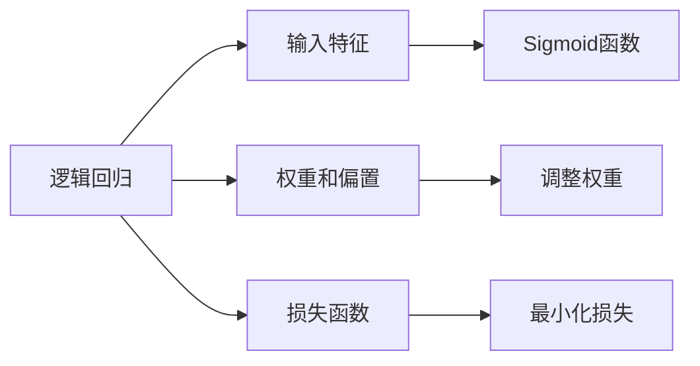
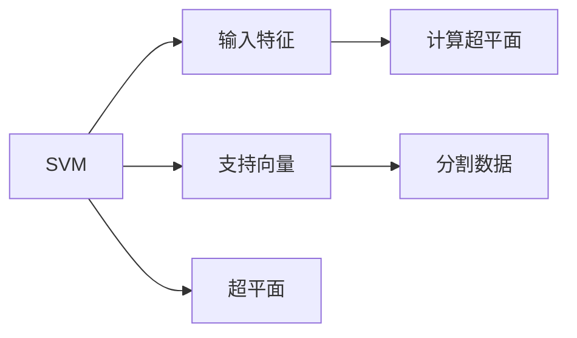
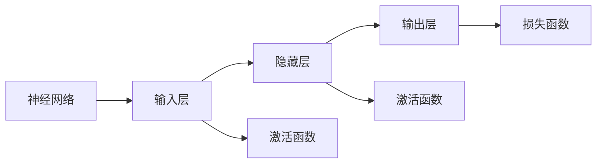

                 


## 智能协作：多功能机器人与人类员工的共生

### 关键词：
- 智能协作
- 多功能机器人
- 人类员工
- 共生
- 技术挑战
- 解决方案

### 摘要：
本文探讨了智能协作的概念、背景、技术基础以及其在现实世界中的应用。通过深入分析多功能机器人和人类员工的协同作用，文章提出了智能协作的关键挑战和解决方案，并展望了其未来发展趋势。本文旨在为企业和开发者提供实用的指导，以实现高效、智能的员工与机器人共生。

### 目录

#### 第一部分：背景与概述

1. **智能协作的兴起**
   1.1 问题背景
   1.2 智能协作的定义与重要性
   1.3 智能协作的边界与外延

2. **核心概念与联系**
   2.1 智能协作中的关键概念
   2.2 概念属性特征对比
   2.3 ER实体关系图架构

#### 第二部分：技术基础

3. **人工智能与机器学习基础**
   3.1 人工智能概述
   3.2 机器学习原理
   3.3 常见机器学习算法介绍

4. **机器人技术基础**
   4.1 机器人定义与分类
   4.2 机器人感知与控制技术
   4.3 机器人与人类的交互

#### 第三部分：案例研究

5. **智能协作成功案例**
   5.1 案例一：工业自动化生产线
   5.2 案例二：服务机器人应用
   5.3 案例三：医疗健康辅助系统

#### 第四部分：挑战与解决方案

6. **智能协作面临的挑战**
   6.1 技术挑战
   6.2 人际关系挑战
   6.3 法律伦理挑战

7. **智能协作的解决方案**
   7.1 技术解决方案
   7.2 管理解决方案
   7.3 法律伦理解决方案

#### 第五部分：未来趋势

8. **未来趋势与展望**
   8.1 技术发展趋势
   8.2 社会影响与变革

#### 第六部分：最佳实践与建议

9. **最佳实践与推荐**
   9.1 企业实施智能协作的最佳实践
   9.2 开发者开发智能协作系统的建议

#### 第七部分：结论

10. **总结与展望**
    10.1 智能协作的重要价值
    10.2 智能协作的未来方向

### 文章正文

#### 引言

在当今快速发展的科技时代，人工智能（AI）和机器人技术的进步正在彻底改变各行各业。智能协作，作为一种新型的工作模式，正逐渐成为企业和组织提高效率、降低成本、提升创新能力的关键因素。智能协作指的是人类员工与多功能机器人的紧密合作，共同完成复杂任务的过程。

智能协作的兴起源于多个因素的驱动。首先，随着全球劳动力成本的上升，企业越来越倾向于采用自动化和智能化手段来降低人力成本。其次，AI和机器人技术的不断进步，使得机器人能够执行更加复杂和精细的任务。最后，企业面临着日益激烈的市场竞争，智能协作可以帮助企业更快地响应市场需求，提高产品和服务质量。

本文将详细探讨智能协作的概念、背景、技术基础、成功案例、面临的挑战以及未来的发展趋势。文章旨在为企业和开发者提供实用的指导，以实现高效、智能的员工与机器人共生。

#### 第一部分：背景与概述

##### 1.1 问题背景

在传统的工业生产和服务行业中，人类员工与机器人的协作通常存在以下问题：

- **人力成本高**：机器人在某些任务上的效率高于人类，但机器人的初始投资和维护成本较高，导致企业在短期内难以降低人力成本。
- **任务范围有限**：传统的机器人主要执行重复性、低技能的工作，难以应对复杂、多变的工作环境。
- **安全性问题**：人类与机器人共处于同一工作环境中，存在碰撞、事故等安全风险。
- **交互效率低**：人类与机器人的交互主要依赖于编程指令，缺乏自然、直观的交互方式。

智能协作的出现，旨在解决上述问题，实现人类员工与机器人的高效协同工作。

##### 1.2 智能协作的定义与重要性

智能协作是指人类员工与多功能机器人通过智能化的交互与协作，共同完成复杂任务的过程。多功能机器人具备感知、决策、执行等多种能力，能够适应不同的工作环境和任务需求。智能协作的重要性体现在以下几个方面：

- **提高生产效率**：机器人可以执行重复性、高强度的任务，降低人类员工的劳动强度，提高整体生产效率。
- **降低运营成本**：通过优化人力和机器人的配置，企业可以实现成本的有效控制。
- **提升创新能力**：智能协作可以促进人类员工与机器人的知识共享和协同创新，推动产业升级。
- **改善工作环境**：智能协作有助于改善人类员工的工作环境，减少工作压力，提高员工满意度。

##### 1.3 智能协作的边界与外延

智能协作的边界涉及多个方面，包括技术层面、应用层面和伦理层面。在技术层面，智能协作依赖于人工智能、机器学习、自然语言处理等技术的支持。在应用层面，智能协作可以应用于工业生产、服务行业、医疗健康等多个领域。在伦理层面，智能协作需要关注数据隐私、安全、公平等问题。

智能协作的外延包括以下几个方面：

- **人机交互**：如何设计自然、直观的人机交互界面，提高人类员工与机器人的协作效率。
- **任务分配**：如何合理分配人类员工与机器人的任务，实现最优的资源利用。
- **系统集成**：如何将不同类型的机器人、传感器、执行器等设备整合到同一系统中，实现协同工作。
- **安全保障**：如何确保人类员工与机器人的安全共处，避免碰撞、事故等风险。

#### 第二部分：核心概念与联系

##### 2.1 智能协作中的关键概念

智能协作中的关键概念包括以下几个方面：

- **人工智能（AI）**：模拟人类智能行为的计算机系统，包括机器学习、深度学习、自然语言处理等子领域。
- **机器人技术**：研究、开发和应用能够执行复杂任务的智能机器人系统。
- **人类-机器人交互**：研究人类与机器人之间的交互方式、交互界面、协作机制等。
- **数据驱动决策**：基于历史数据和实时数据，通过算法和模型进行决策，以实现最优的协作效果。

##### 2.2 概念属性特征对比

下表对比了智能协作中的关键概念及其属性特征：

| 概念 | 属性特征 | 对比 |  
| --- | --- | --- |  
| 人工智能（AI） | 模拟人类智能行为 | 机器学习、深度学习、自然语言处理 |  
| 机器人技术 | 执行复杂任务 | 感知、决策、执行 |  
| 人类-机器人交互 | 交互方式、交互界面、协作机制 | 自然、直观、高效 |  
| 数据驱动决策 | 历史数据、实时数据 | 算法和模型、最优决策 |

##### 2.3 ER实体关系图架构

以下是智能协作中的ER实体关系图架构，用于描述各关键概念之间的关系：

```mermaid
erDiagram
  AI -->|1. 依赖| Robot
  Robot -->|1. 交互| Human
  AI -->|2. 支持| DataDrivenDecision
  DataDrivenDecision -->|1. 输出| Decision
```

在上述ER图中，AI（人工智能）与Robot（机器人技术）之间存在依赖关系，AI为机器人提供智能支持。Robot与Human（人类-机器人交互）之间存在交互关系，实现人类与机器人的协同工作。AI还支持DataDrivenDecision（数据驱动决策），为决策提供算法和模型支持。最终，DataDrivenDecision的输出Decision用于指导机器人执行任务。

#### 第三部分：技术基础

##### 3.1 人工智能与机器学习基础

人工智能（AI）是智能协作的核心技术之一。AI旨在模拟人类智能行为，使计算机系统能够执行特定任务，如语音识别、图像识别、自然语言处理等。人工智能可以分为以下几个子领域：

- **机器学习（ML）**：一种通过数据驱动的方式进行学习的计算机技术，旨在使计算机系统从数据中学习规律和模式。
- **深度学习（DL）**：一种特殊的机器学习方法，基于多层神经网络进行学习和预测。
- **自然语言处理（NLP）**：研究如何让计算机理解和生成人类语言的技术。

##### 3.2 机器学习原理

机器学习的基本原理是通过训练模型来预测或分类数据。机器学习模型通常由以下几个部分组成：

- **输入特征**：用于描述数据的特征向量。
- **权重和偏置**：用于控制模型对输入数据的响应程度。
- **激活函数**：用于对神经网络的输出进行非线性变换。

在训练过程中，模型通过不断调整权重和偏置，最小化损失函数，以达到最佳预测效果。常见的机器学习算法包括：

- **线性回归**：用于预测线性关系的数值。
- **逻辑回归**：用于预测二分类问题。
- **支持向量机（SVM）**：用于分类问题。
- **神经网络**：用于复杂函数的建模和预测。

##### 3.3 常见机器学习算法介绍

以下是几种常见的机器学习算法及其原理：

- **线性回归**：假设输入特征与目标之间存在线性关系，通过最小二乘法求解最佳拟合直线。



- **逻辑回归**：用于预测二分类问题，通过求解Sigmoid函数的反函数来计算概率。



- **支持向量机（SVM）**：通过找到一个最佳的超平面来分割数据。



- **神经网络**：通过多层神经网络进行建模和预测。



#### 第四部分：机器人技术基础

##### 4.1 机器人定义与分类

机器人是一种能够自主执行任务、适应复杂环境的智能系统。根据其功能和应用场景，机器人可以分类为以下几类：

- **工业机器人**：主要用于工业生产中的自动化任务，如装配、焊接、搬运等。
- **服务机器人**：为人类提供生活、娱乐、医疗等服务的机器人，如清洁机器人、送餐机器人、护理机器人等。
- **医疗机器人**：用于医疗诊断、治疗和康复的机器人，如手术机器人、康复机器人等。
- **探索机器人**：用于科学探索和探险任务的机器人，如火星探测器、深海探测器等。

##### 4.2 机器人感知与控制技术

机器人的感知与控制技术是实现其自主运行的核心。感知技术主要包括：

- **传感器**：用于检测环境信息，如视觉传感器、力觉传感器、温湿度传感器等。
- **传感器融合**：将多种传感器数据进行融合，提高感知精度和鲁棒性。

控制技术主要包括：

- **运动控制**：通过电机、舵机等驱动器实现机器人的运动控制。
- **轨迹规划**：根据环境信息和目标位置，规划出最优的运动轨迹。
- **决策与规划**：根据感知信息进行决策，规划出下一步动作。

##### 4.3 机器人与人类的交互

机器人与人类的交互是智能协作的重要组成部分。交互技术主要包括：

- **自然语言处理**：使机器人能够理解人类语言，实现语音交互。
- **手势识别**：通过视觉传感器识别人类的手势，实现手势交互。
- **语音合成**：使机器人能够生成自然流畅的语音，实现语音反馈。
- **触觉反馈**：通过力觉传感器实现机器人与人类的触觉交互。

#### 第五部分：案例研究

##### 5.1 案例一：工业自动化生产线

工业自动化生产线是智能协作在工业领域的典型应用。在这个案例中，多功能机器人与人类员工协同工作，共同完成生产任务。

- **项目介绍**：某汽车制造厂引入了智能协作系统，用于自动化生产线上的零部件装配和搬运。
- **系统功能设计**：系统包括装配机器人、搬运机器人、人类员工操作站和监控系统。
- **系统架构设计**：系统采用分布式架构，各个机器人与操作站通过网络进行通信，实现协同工作。
- **系统接口设计和系统交互**：

```mermaid
sequenceDiagram
    Human -->|装配指令| Robot1
    Robot1 -->|装配完成| Human
    Human -->|搬运指令| Robot2
    Robot2 -->|搬运完成| Human
```

在这个案例中，人类员工通过操作站发送装配和搬运指令，机器人根据指令执行相应任务，并向人类员工反馈任务完成情况。

##### 5.2 案例二：服务机器人应用

服务机器人在服务领域的应用日益广泛，如清洁、送餐、护理等。在这个案例中，服务机器人与人类员工共同提供服务。

- **项目介绍**：某酒店引入了服务机器人，用于客房清洁和送餐服务。
- **系统功能设计**：系统包括清洁机器人、送餐机器人和人类服务员。
- **系统架构设计**：系统采用分布式架构，机器人与人类服务员通过无线网络进行通信。
- **系统接口设计和系统交互**：

```mermaid
sequenceDiagram
    Human -->|客房清洁请求| Robot
    Robot -->|清洁完成| Human
    Human -->|送餐请求| Robot
    Robot -->|送餐完成| Human
```

在这个案例中，人类服务员通过系统发送清洁和送餐请求，服务机器人根据请求执行相应任务，并向人类服务员反馈任务完成情况。

##### 5.3 案例三：医疗健康辅助系统

医疗健康辅助系统是智能协作在医疗领域的应用。在这个案例中，多功能机器人与医生、护士等医疗人员协同工作，提供医疗服务。

- **项目介绍**：某医院引入了医疗健康辅助系统，用于手术辅助、护理服务、患者监护等。
- **系统功能设计**：系统包括手术机器人、护理机器人、医生工作站和护士站。
- **系统架构设计**：系统采用分布式架构，机器人与医生、护士等医疗人员通过无线网络进行通信。
- **系统接口设计和系统交互**：

```mermaid
sequenceDiagram
    Doctor -->|手术指令| Robot
    Robot -->|手术完成| Doctor
    Nurse -->|护理指令| Robot
    Robot -->|护理完成| Nurse
    Patient -->|监护信息| Robot
    Robot -->|监护报告| Patient
```

在这个案例中，医生通过工作站发送手术指令，手术机器人根据指令执行手术；护士通过护士站发送护理指令，护理机器人根据指令提供护理服务；患者通过监护设备发送监护信息，机器人根据监护报告提供相应的护理措施。

#### 第六部分：挑战与解决方案

##### 6.1 技术挑战

智能协作在技术层面面临以下挑战：

- **人工智能算法的优化**：随着机器人应用场景的增多，对人工智能算法的性能和准确性提出了更高的要求。
- **机器人感知与控制技术的提升**：机器人需要具备更高的感知能力、适应能力和决策能力，以应对复杂多变的工作环境。
- **数据安全和隐私保护**：在智能协作过程中，大量数据被传输和存储，需要确保数据的安全性和隐私性。

##### 6.2 人际关系挑战

智能协作在人际关系层面面临以下挑战：

- **人类员工的心理接受度**：部分员工可能对机器人的出现持怀疑态度，担心机器人取代自己的工作。
- **团队合作与沟通**：人类员工与机器人的协作需要有效的沟通和团队合作，避免冲突和误解。
- **职业角色转变**：随着智能协作的发展，人类员工的职业角色可能发生转变，需要适应新的工作模式。

##### 6.3 法律伦理挑战

智能协作在法律伦理层面面临以下挑战：

- **责任归属**：在智能协作过程中，当发生事故或损失时，如何界定责任归属？
- **数据隐私**：如何确保智能协作过程中的数据隐私不被泄露？
- **伦理道德**：智能协作可能涉及伦理道德问题，如人类员工与机器人之间的权利与义务分配。

##### 6.4 智能协作的解决方案

针对上述挑战，智能协作可以采取以下解决方案：

- **技术解决方案**：不断优化人工智能算法，提升机器人感知与控制技术，确保数据安全和隐私保护。
- **管理解决方案**：建立有效的团队沟通机制，加强员工培训，提高员工对智能协作的心理接受度。
- **法律伦理解决方案**：完善相关法律法规，明确责任归属，确保数据隐私和伦理道德。

#### 第七部分：未来趋势

##### 8.1 技术发展趋势

智能协作在技术层面将继续朝着以下方向发展：

- **人工智能算法的进步**：随着计算能力和算法研究的深入，人工智能算法将更加高效、准确。
- **机器人技术的创新**：新型机器人将具备更高的感知能力、适应能力和决策能力，适应更广泛的应用场景。
- **物联网（IoT）的融合**：智能协作将逐渐与物联网技术相结合，实现更广泛的数据采集和实时监控。

##### 8.2 社会影响与变革

智能协作将对社会产生深远的影响和变革：

- **产业升级**：智能协作将推动传统产业向智能化、自动化升级，提高产业整体竞争力。
- **就业转型**：智能协作将导致部分传统岗位的减少，但也会创造新的就业机会，推动就业结构的调整。
- **生活方式的改变**：智能协作将改变人们的生活方式，提高生活质量，减轻生活压力。

#### 第八部分：最佳实践与建议

##### 8.1 企业实施智能协作的最佳实践

企业实施智能协作时，可以采取以下最佳实践：

- **需求分析**：明确智能协作的目标和需求，为后续的技术选型和系统设计提供指导。
- **技术选型**：根据实际需求和预算，选择合适的人工智能算法、机器人技术和系统集成方案。
- **团队建设**：组建专业的智能协作团队，加强团队沟通和协作，提高项目实施效率。
- **员工培训**：加强对员工的培训，提高员工对智能协作的心理接受度和实际操作能力。

##### 8.2 开发者开发智能协作系统的建议

开发者开发智能协作系统时，可以采取以下建议：

- **模块化设计**：采用模块化设计，提高系统的可扩展性和可维护性。
- **接口标准化**：制定统一的接口标准，方便不同模块之间的通信和协作。
- **安全性设计**：在系统设计过程中，充分考虑数据安全和隐私保护，采用加密、访问控制等技术。
- **用户体验**：关注用户界面和交互设计，提高系统的易用性和用户体验。

#### 结论

智能协作作为一种新兴的工作模式，正逐渐成为企业提高效率、降低成本、提升创新能力的关键因素。本文从背景、核心概念、技术基础、案例研究、挑战与解决方案、未来趋势等方面，详细探讨了智能协作的各个方面。通过本文的讨论，我们可以看到智能协作的重要价值和广阔前景。未来，随着技术的不断进步，智能协作将在更多领域得到广泛应用，为人类社会带来更多便利和进步。

### 作者信息

作者：AI天才研究院/AI Genius Institute & 禅与计算机程序设计艺术 /Zen And The Art of Computer Programming

本文旨在为企业和开发者提供关于智能协作的实用指导，以实现高效、智能的员工与机器人共生。读者可以根据本文的内容，结合自身实际情况，进一步探索和优化智能协作的应用场景。希望本文对读者在智能协作领域的实践和思考有所帮助。

