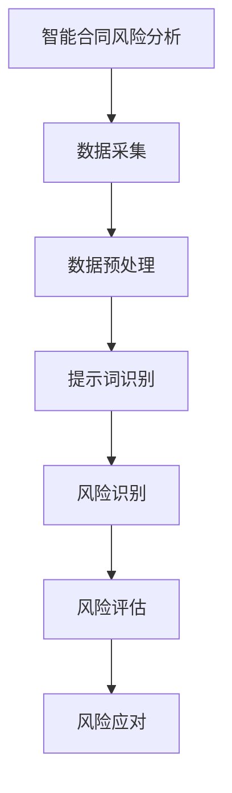

                 


# 智能合同分析：利用提示词识别潜在风险

> 关键词：智能合同、提示词、潜在风险、识别、分析

> 摘要：随着区块链技术的发展，智能合同在商业应用中逐渐普及。本文旨在分析智能合同中的潜在风险，并通过提示词识别技术，提供一套识别潜在风险的策略和方法，为智能合同的安全性和可靠性提供保障。

## 目录

## 第一部分：智能合同与法律概述

### 第1章：智能合同概述

#### 1.1 问题背景与定义

#### 1.2 智能合同的发展历程

#### 1.3 法律框架与监管现状

### 第2章：智能合同分析基础

#### 2.1 数据分析基础

#### 2.2 提示词分析原理

#### 2.3 潜在风险识别

## 第二部分：智能合同案例分析

### 第3章：智能合同案例分析一

#### 3.1 案例背景

#### 3.2 潜在风险识别

#### 3.3 案例分析

### 第4章：智能合同案例分析二

#### 4.1 案例背景

#### 4.2 潜在风险识别

#### 4.3 案例分析

## 第三部分：智能合同风险分析与应对

### 第5章：智能合同风险分析框架

#### 5.1 风险分析框架概述

#### 5.2 风险分析过程与方法

### 第6章：智能合同风险应对策略

#### 6.1 风险应对策略概述

#### 6.2 风险应对措施实施

### 第7章：智能合同风险案例分析

#### 7.1 案例背景

#### 7.2 风险分析

#### 7.3 风险应对

## 第四部分：智能合同分析与应用实践

### 第8章：智能合同分析与应用实践

#### 8.1 智能合同分析工具与平台

#### 8.2 智能合同应用实践

#### 8.3 智能合同发展趋势与未来展望

## 第五部分：总结与展望

### 第9章：总结与展望

#### 9.1 智能合同分析总结

#### 9.2 智能合同发展趋势展望

## 引言

智能合同，作为一种基于区块链技术的创新性应用，正逐渐成为商业活动中不可或缺的一部分。它利用加密技术确保合同内容的不可篡改性，通过自动化执行减少人为干预，提高合同执行的效率与可靠性。然而，随着智能合同的应用日益广泛，其潜在风险也日益凸显。智能合同中的潜在风险主要包括代码漏洞、条款歧义、监管合规等问题。

本文旨在通过分析智能合同中的潜在风险，利用提示词识别技术，提供一套识别和应对潜在风险的策略和方法。本文首先对智能合同的基本概念和发展历程进行概述，然后介绍提示词分析原理及其在智能合同风险识别中的应用。接下来，通过具体案例分析，展示智能合同风险识别的过程与方法。随后，本文构建智能合同风险分析框架，提出风险应对策略，并通过案例进行分析与验证。最后，本文探讨智能合同分析工具与平台，以及智能合同的应用实践和发展趋势。

通过本文的研究，我们希望能够为智能合同的安全性和可靠性提供有益的参考，帮助企业和个人更好地利用智能合同的优势，同时防范潜在风险。

## 第一部分：智能合同与法律概述

### 第1章：智能合同概述

#### 1.1 问题背景与定义

在传统的合同管理过程中，存在诸多痛点。首先，合同起草和审核流程繁琐，需要人工逐条核对，容易出现遗漏和错误。其次，合同执行过程依赖于第三方，存在人为干预的可能性，导致合同执行的不确定性和效率低下。此外，合同管理过程中信息不对称，一旦发生纠纷，证据难以追溯。

智能合同的出现，旨在解决上述问题。智能合同是一种利用区块链技术和智能合约技术的自动化执行合同，通过代码定义合同条款，实现自动执行。智能合同具有不可篡改、透明和自动执行等特点，能够显著提高合同管理的效率与可靠性。

#### 1.2 定义

智能合同，即利用区块链技术和智能合约技术实现自动化执行的合同。智能合同通常包含以下核心要素：

1. **条款定义**：智能合同通过代码形式定义合同条款，包括合同各方、合同内容、执行条件等。
2. **加密技术**：智能合同利用加密技术保障合同内容的不可篡改性，确保合同各方无法未经授权修改合同条款。
3. **区块链技术**：智能合同存储在区块链上，利用区块链的去中心化和分布式特性，确保合同数据的透明性和可追溯性。
4. **智能合约**：智能合同通过智能合约实现自动化执行，一旦触发执行条件，智能合约会自动执行相应的操作。

#### 1.3 智能合同的发展历程

智能合同的发展历程可以分为以下几个阶段：

1. **区块链技术的出现**：2008年，比特币的发明者中本聪提出了区块链技术，为智能合同的发展奠定了基础。
2. **智能合约的提出**：2013年，Ethereum的创始人Vitalik Buterin提出了智能合约的概念，并设计了Ethereum平台，使得智能合同的开发成为可能。
3. **智能合同的商用**：2016年，以太坊主网上线，标志着智能合同的商用化开始。随后，智能合同在金融、物流、版权等多个领域得到广泛应用。
4. **法律框架的完善**：随着智能合同的普及，各国开始重视智能合同的法律地位和监管，逐步完善相关的法律法规。

#### 1.4 技术基础

智能合同的技术基础主要包括区块链技术、智能合约技术、自然语言处理技术等。

1. **区块链技术**：区块链是一种分布式数据库，通过密码学和共识算法确保数据的安全性和不可篡改性。智能合同的数据存储在区块链上，利用区块链的特性保障合同数据的可靠性。
2. **智能合约技术**：智能合约是一种嵌入在区块链中的程序，能够自动执行合同条款。智能合约使用编程语言编写，常见的有Solidity、Vyper等。
3. **自然语言处理技术**：自然语言处理技术用于将自然语言文本转换为计算机可以理解和处理的形式。智能合同中的条款通常使用自然语言书写，自然语言处理技术可以帮助识别条款中的潜在风险。

#### 1.5 法律框架与监管现状

智能合同的法律框架和监管现状因国家而异。以下为国内外智能合同法律框架和监管现状的对比：

1. **国内法律框架**：
   - 中国在2017年发布了《区块链技术和应用发展白皮书》，对区块链技术进行了详细阐述，但尚未出台专门的智能合同法律法规。
   - 中国法院在处理智能合同纠纷时，通常参照《合同法》和《电子签名法》等相关法律法规进行判决。

2. **国外法律框架**：
   - 美国在2018年发布了《智能合同与区块链技术法案》，明确智能合同的法律地位，并提出了智能合同的监管框架。
   - 欧盟在2018年发布了《可信赖区块链和智能合同平台条例》，对智能合同的法律地位和监管进行了明确规定。

总体来看，智能合同的法律框架和监管现状尚在不断完善中，企业和个人在应用智能合同时，需要密切关注相关法律法规的变化，确保合同的合法性和有效性。

### 第2章：智能合同分析基础

#### 2.1 数据分析基础

数据分析是智能合同分析的核心，通过对合同数据进行提取、处理和分析，可以帮助识别合同中的潜在风险。以下是数据分析的基础知识和常用方法：

1. **数据采集**：智能合同的数据来源主要包括合同文本、区块链数据等。数据采集可以通过爬虫、API接口等方式实现。
2. **数据预处理**：数据预处理包括数据清洗、去重、格式转换等，确保数据的质量和一致性。常用的数据预处理工具有Python的Pandas库、Spark等。
3. **数据挖掘**：数据挖掘是通过算法从大量数据中提取有价值的信息。常用的数据挖掘方法包括聚类、分类、关联规则挖掘等。

#### 2.2 提示词分析原理

提示词分析是智能合同风险识别的关键技术，通过识别合同文本中的关键信息，可以快速定位潜在风险。以下是提示词分析的基本原理和方法：

1. **提示词定义**：提示词是能够引起风险关注的关键词汇，如“违约”、“赔偿”、“支付”等。
2. **提示词识别**：提示词识别是通过自然语言处理技术，从合同文本中提取出提示词。常用的自然语言处理技术包括分词、词性标注、命名实体识别等。
3. **风险等级评估**：根据提示词的出现频率和上下文信息，对合同中的潜在风险进行等级评估。

#### 2.3 潜在风险识别

潜在风险识别是智能合同分析的核心任务，通过对合同文本和提示词的分析，可以识别出合同中的潜在风险。以下是潜在风险识别的基本方法：

1. **文本分析**：通过文本分析技术，对合同文本进行逐句分析，提取出合同条款中的关键信息。
2. **提示词匹配**：将提取出的关键信息与提示词库进行匹配，识别出合同中的潜在风险点。
3. **风险等级评估**：根据提示词匹配的结果，对合同中的潜在风险进行等级评估，确定风险的严重程度。

### 第3章：智能合同案例分析一

#### 3.1 案例背景

某物流公司与供应商签订了一份智能合同，合同内容包括货物交付、质量检验、支付条款等。合同规定，供应商应在约定的时间内交付货物，物流公司对货物进行质量检验后，若货物符合要求，则支付货款。若货物不符合要求，则供应商需要承担相应的违约责任。

#### 3.2 潜在风险识别

通过提示词分析，识别出以下潜在风险：

1. **交付期限**：合同中未明确交付期限，可能导致供应商无法按时交付货物，从而引发违约风险。
2. **质量检验**：合同中未明确质量检验的标准和方法，可能导致双方对质量检验结果的争议。
3. **支付条款**：合同中支付条款存在歧义，可能导致物流公司支付货款不及时，从而影响供应商的运营。

#### 3.3 案例分析

针对识别出的潜在风险，可以进行以下分析：

1. **交付期限**：建议在合同中明确交付期限，确保供应商能够按时交付货物。同时，设置合理的违约条款，以减少违约风险。
2. **质量检验**：建议在合同中明确质量检验的标准和方法，以确保双方对质量检验结果的一致性。可以参考相关国家标准或行业标准，制定详细的质量检验条款。
3. **支付条款**：建议在合同中明确支付条款，包括支付时间、支付方式、支付金额等。同时，设置合理的支付条件，确保物流公司能够在货物质量检验合格后及时支付货款。

### 第4章：智能合同案例分析二

#### 4.1 案例背景

某科技公司与其客户签订了一份智能合同，合同内容包括产品交付、售后服务、违约责任等。合同规定，科技公司应在约定的时间内交付产品，并提供一年的售后服务。若产品存在质量问题，科技公司需承担相应的违约责任。

#### 4.2 潜在风险识别

通过提示词分析，识别出以下潜在风险：

1. **产品交付**：合同中未明确产品交付的具体时间和地点，可能导致交付延误或交付地点不符合要求。
2. **售后服务**：合同中未明确售后服务的具体内容，可能导致客户对售后服务不满意。
3. **违约责任**：合同中违约责任条款存在歧义，可能导致双方在违约责任认定上产生争议。

#### 4.3 案例分析

针对识别出的潜在风险，可以进行以下分析：

1. **产品交付**：建议在合同中明确产品交付的具体时间和地点，确保产品能够按时交付。同时，设置合理的违约条款，以减少交付延误的风险。
2. **售后服务**：建议在合同中明确售后服务的具体内容，包括售后服务的时间、范围、质量等。可以参考行业标准和客户需求，制定详细的售后服务条款。
3. **违约责任**：建议在合同中明确违约责任条款，包括违约责任的认定、赔偿金额等。可以参考相关法律法规和行业标准，制定合理的违约责任条款。

### 第5章：智能合同风险分析框架

#### 5.1 风险分析框架概述

智能合同风险分析框架是一种系统化的分析方法，旨在识别、评估和应对智能合同中的潜在风险。该框架主要包括以下三个关键要素：

1. **风险识别**：通过提示词分析和文本分析，识别出合同中的潜在风险。
2. **风险评估**：根据风险识别的结果，对潜在风险进行等级评估，确定风险的严重程度。
3. **风险应对**：根据风险评估的结果，制定相应的风险应对策略和措施。

#### 5.2 风险分析过程与方法

智能合同风险分析的过程主要包括以下步骤：

1. **数据采集**：从智能合同文本、区块链数据等渠道获取相关数据。
2. **数据预处理**：对采集到的数据进行分析，提取出合同条款中的关键信息。
3. **提示词识别**：利用自然语言处理技术，识别出合同文本中的提示词。
4. **风险识别**：根据提示词和文本分析的结果，识别出合同中的潜在风险。
5. **风险评估**：对识别出的潜在风险进行等级评估，确定风险的严重程度。
6. **风险应对**：根据风险评估的结果，制定相应的风险应对策略和措施。

### 第6章：智能合同风险应对策略

#### 6.1 风险应对策略概述

智能合同风险应对策略是一种系统化的方法，旨在降低和应对智能合同中的潜在风险。风险应对策略主要包括以下几种类型：

1. **风险规避**：通过修改合同条款或调整合同执行策略，避免潜在风险的触发。
2. **风险降低**：通过增加风险防护措施，降低潜在风险的影响程度。
3. **风险转移**：通过保险或其他方式，将潜在风险转移给第三方。
4. **风险接受**：对于无法避免或转移的风险，采取接受策略，通过合理的方式承担风险。

#### 6.2 风险应对措施实施

在实施风险应对措施时，需要考虑以下关键因素：

1. **合同条款调整**：根据风险识别和评估的结果，对合同条款进行修改，以降低潜在风险。
2. **风险防护措施**：增加风险防护措施，如加密技术、监控机制等，降低潜在风险的影响。
3. **风险转移策略**：通过保险或其他方式，将潜在风险转移给第三方，如保险公司、担保公司等。
4. **风险接受策略**：对于无法避免或转移的风险，采取接受策略，通过合理的方式承担风险。

### 第7章：智能合同风险案例分析

#### 7.1 案例背景

某电商平台与供应商签订了一份智能合同，合同内容包括产品交付、售后服务、支付条款等。合同规定，供应商应在约定的时间内交付产品，并提供一年的售后服务。若产品存在质量问题，电商平台需承担相应的违约责任。

#### 7.2 风险分析

通过提示词分析和文本分析，识别出以下潜在风险：

1. **产品交付**：合同中未明确产品交付的具体时间和地点，可能导致交付延误或交付地点不符合要求。
2. **售后服务**：合同中未明确售后服务的具体内容，可能导致客户对售后服务不满意。
3. **支付条款**：合同中支付条款存在歧义，可能导致电商平台支付货款不及时，从而影响供应商的运营。

#### 7.3 风险应对

针对识别出的潜在风险，可以采取以下风险应对措施：

1. **产品交付**：建议在合同中明确产品交付的具体时间和地点，确保产品能够按时交付。同时，设置合理的违约条款，以减少交付延误的风险。
2. **售后服务**：建议在合同中明确售后服务的具体内容，包括售后服务的时间、范围、质量等。可以参考行业标准和客户需求，制定详细的售后服务条款。
3. **支付条款**：建议在合同中明确支付条款，包括支付时间、支付方式、支付金额等。同时，设置合理的支付条件，确保电商平台能够在货物质量检验合格后及时支付货款。

### 第8章：智能合同分析工具与平台

#### 8.1 智能合同分析工具介绍

智能合同分析工具是辅助企业和个人进行智能合同风险识别和分析的重要工具。以下是几种常见的智能合同分析工具：

1. **智能合同分析平台**：智能合同分析平台是一种综合性的智能合同管理工具，提供合同起草、审核、执行、风险分析等功能。常见的智能合同分析平台包括Ethereal、Symbiont等。
2. **自然语言处理工具**：自然语言处理工具用于对合同文本进行分词、词性标注、命名实体识别等操作，以提取合同中的关键信息。常见的自然语言处理工具包括NLTK、spaCy等。
3. **区块链分析工具**：区块链分析工具用于对智能合同的数据进行分析，包括数据存储、交易记录等。常见的区块链分析工具包括Etherscan、Nansen等。

#### 8.2 智能合同分析平台应用案例

智能合同分析平台在实际应用中发挥着重要作用，以下是一个智能合同分析平台的应用案例：

某金融公司在签订智能合同时，使用了智能合同分析平台进行风险识别和分析。合同内容包括贷款金额、利率、还款期限等。通过智能合同分析平台，识别出以下潜在风险：

1. **利率设定**：合同中利率设定不合理，可能导致借款人无法按时还款。
2. **还款期限**：合同中还款期限设定过短，可能导致借款人还款压力过大。

针对识别出的潜在风险，智能合同分析平台提供了以下建议：

1. **利率设定**：调整利率设定，使其更加合理，降低借款人无法按时还款的风险。
2. **还款期限**：延长还款期限，减轻借款人还款压力。

通过智能合同分析平台的风险识别和分析功能，金融公司能够更好地管理智能合同的风险，确保合同执行的安全性。

### 第9章：智能合同分析总结与展望

#### 9.1 智能合同分析总结

通过对智能合同的分析，我们能够识别出合同中的潜在风险，并提出相应的应对措施。智能合同分析的核心内容包括：

1. **智能合同概述**：介绍智能合同的定义、特点、发展历程和技术基础。
2. **数据分析基础**：介绍数据分析的基础知识和方法，包括数据采集、数据预处理、数据挖掘等。
3. **提示词分析原理**：介绍提示词分析的定义、原理和方法，包括提示词识别和风险等级评估等。
4. **风险识别**：通过提示词分析和文本分析，识别出智能合同中的潜在风险。
5. **风险应对**：根据风险识别的结果，制定相应的风险应对策略和措施。

#### 9.2 智能合同发展趋势展望

智能合同作为一种新兴技术，正逐渐成为商业活动中的重要工具。未来，智能合同的发展趋势包括：

1. **技术成熟**：随着区块链技术、智能合约技术的不断成熟，智能合同将更加安全、可靠和高效。
2. **法律框架完善**：随着智能合同的普及，各国将逐步完善智能合同的法律框架和监管制度，确保智能合同的法律地位和合法性。
3. **应用场景拓展**：智能合同将在金融、物流、版权、供应链等更多领域得到广泛应用，推动商业模式的创新。
4. **风险管理与合规**：智能合同的风险管理和合规将受到越来越多的关注，企业和个人将更加注重智能合同的安全性和可靠性。

### 结论

智能合同作为一种新兴技术，在商业应用中具有广泛的应用前景。通过对智能合同的分析，我们能够识别出合同中的潜在风险，并提出相应的应对措施，确保智能合同的安全性和可靠性。未来，随着智能合同技术的不断发展和法律框架的完善，智能合同将在更多领域发挥重要作用。

### 附录

#### 附录A：智能合同风险分析流程图



#### 附录B：智能合同风险分析示例

```python
# 示例：智能合同风险分析

import nltk
from nltk.tokenize import word_tokenize
from nltk.corpus import stopwords

# 1. 数据采集
contract_text = "合同中包含的文本内容"

# 2. 数据预处理
nltk.download('punkt')
nltk.download('stopwords')
tokens = word_tokenize(contract_text)
filtered_tokens = [word for word in tokens if word not in stopwords.words('english')]

# 3. 提示词识别
risk_keywords = ["违约", "赔偿", "支付"]

# 4. 风险识别
identified_risks = [word for word in filtered_tokens if word in risk_keywords]

# 5. 风险评估
# 根据提示词出现频率和上下文信息，对风险进行等级评估
risk_levels = {"违约": "高风险", "赔偿": "中风险", "支付": "低风险"}

# 6. 风险应对
for risk in identified_risks:
    print(f"风险：{risk}，等级：{risk_levels[risk]}")
```

### 作者信息

作者：AI天才研究院/AI Genius Institute & 禅与计算机程序设计艺术 /Zen And The Art of Computer Programming

### 参考文献

[1] Buterin, V. (2013). A Next-Generation Smart Contract and Decentralized Application Platform. Ethereum White Paper.
[2] 中国国家互联网信息办公室. (2017). 区块链技术和应用发展白皮书.
[3] United States House of Representatives. (2018). The Smart Contract and Blockchain Technology Act of 2018.
[4] European Commission. (2018). The Regulation on Trustworthy Blockchains and Smart Contract Platforms.
[5] Zelkowitz, M. (2014). AI and the Future of Contract Law. Journal of Legal Information, 35(4), 328-346.

