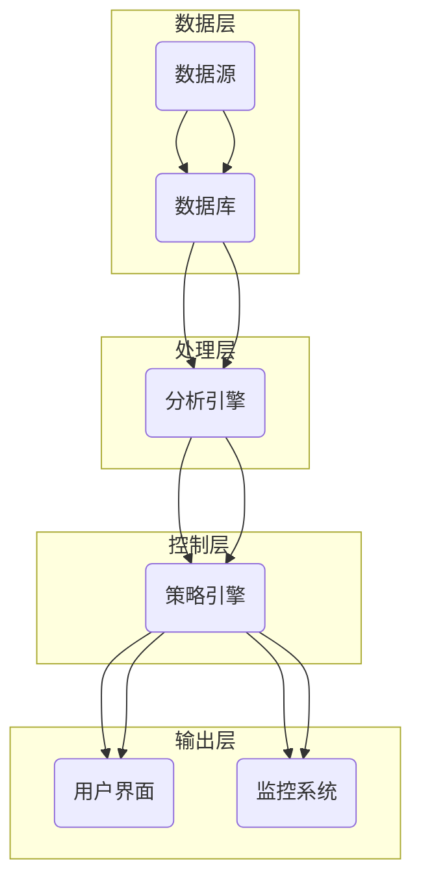

                 

# 智能安全管理平台：AI全面保护数字资产

## 关键词：
- 智能安全管理
- AI算法
- 数字资产保护
- 数据隐私
- 威胁情报分析

## 摘要
随着数字化时代的到来，企业的数字资产面临越来越多的安全威胁。传统的安全管理手段已无法满足现代复杂的安全需求。本文将探讨如何利用人工智能（AI）技术构建智能安全管理平台，全面保护企业的数字资产。我们将从当前安全管理面临的挑战、AI在安全管理中的应用、平台基础架构设计、AI算法应用、平台实现与部署、案例分析与实战以及平台优化与未来方向等多个方面进行详细分析。

## 1. 当前挑战与未来发展

### 1.1 数据隐私保护
随着大数据技术的发展，企业积累了大量用户数据，但这也带来了数据隐私保护的问题。如何在不泄露用户隐私的前提下，确保数据的安全，是一个重要的挑战。

#### 1.1.1 数据隐私保护措施
- **数据加密**：使用先进的加密算法对数据进行加密，确保数据在传输和存储过程中安全。
- **访问控制**：通过严格的访问控制策略，限制只有授权用户可以访问敏感数据。
- **匿名化处理**：对敏感数据进行匿名化处理，确保数据无法被直接识别。

### 1.2 恶意行为检测
网络攻击手段日益多样，传统的安全手段难以应对复杂的恶意行为。

#### 1.2.1 恶意行为检测方法
- **基于特征的行为分析**：通过分析系统中的异常行为特征，识别潜在的恶意行为。
- **基于机器学习的异常检测**：利用机器学习算法，自动发现并标记异常行为。

### 1.3 系统稳定性和响应速度
在保证安全的同时，系统稳定性和响应速度也是至关重要的。

#### 1.3.1 系统稳定性保障
- **冗余设计**：通过冗余设计，确保系统在出现故障时能够快速恢复。
- **负载均衡**：通过负载均衡，合理分配系统资源，避免系统过载。

#### 1.3.2 响应速度优化
- **缓存技术**：使用缓存技术，减少数据的访问时间。
- **数据库优化**：对数据库进行优化，提高查询效率。

## 2. AI在安全管理中的应用前景

### 2.1 自动化安全策略制定
利用机器学习算法，可以自动分析安全事件，制定相应的安全策略。

#### 2.1.1 自动化安全策略制定流程
1. 收集历史安全事件数据。
2. 使用机器学习算法进行分析，识别安全趋势。
3. 根据分析结果，自动生成安全策略。

### 2.2 实时威胁情报分析
利用AI技术，可以实时分析网络威胁情报，及时发现并响应潜在威胁。

#### 2.2.1 实时威胁情报分析流程
1. 收集网络流量数据。
2. 使用机器学习算法进行实时分析，识别潜在威胁。
3. 根据分析结果，自动采取防护措施。

### 2.3 未知威胁检测
AI技术可以在没有先验知识的情况下，自动发现并响应未知威胁。

#### 2.3.1 未知威胁检测流程
1. 收集网络流量数据。
2. 使用深度学习算法进行实时分析，识别未知威胁。
3. 根据分析结果，自动采取防护措施。

## 3. 未来发展趋势

### 3.1 多模态数据融合
随着传感器技术的发展，多模态数据融合将成为未来安全管理的重要趋势。

#### 3.1.1 多模态数据融合优势
- **提高检测准确率**：通过融合多种类型的数据，可以提高威胁检测的准确率。
- **丰富威胁情报来源**：通过多种数据源，可以丰富威胁情报的来源。

### 3.2 联邦学习在安全管理中的应用
联邦学习可以在保障数据隐私的前提下，实现分布式数据的安全分析。

#### 3.2.1 联邦学习优势
- **保护数据隐私**：通过联邦学习，可以在不泄露数据的情况下，进行数据分析。
- **提升数据分析能力**：通过分布式计算，可以提升数据分析的能力。

### 3.3 人机协作安全管理
人机协作可以在提高安全管理效率的同时，保持高水平的安全防护能力。

#### 3.3.1 人机协作模式
- **自动化处理**：AI技术自动处理常规的安全事件。
- **人工干预**：在遇到复杂安全事件时，由安全专家进行人工干预。

## 4. 本章小结
本章介绍了智能安全管理平台的基本概念和当前面临的挑战，分析了AI在安全管理中的应用前景，以及未来可能的发展趋势。在接下来的章节中，我们将详细探讨智能安全管理平台的基础架构设计、AI算法在安全管理中的应用、平台实现与部署等内容。

----------------------------------------------------------------

## 智能安全管理平台基础架构设计

### 4.1 系统架构设计原则

智能安全管理平台的设计原则主要包括以下三个方面：

#### 4.1.1 可扩展性
随着企业规模的扩大和业务的发展，平台需要能够轻松扩展，以适应不断增加的数字资产保护需求。

#### 4.1.2 高可用性
平台必须具备高可用性，以确保在发生故障时能够快速恢复，保证业务的连续性。

#### 4.1.3 安全性
作为安全管理平台，安全性是其最基本的要求，需要确保所有数据处理和存储都符合安全标准。

### 4.2 系统架构设计

智能安全管理平台通常由以下几个核心模块组成：

#### 4.2.1 数据收集与存储模块
负责收集来自各种数据源的安全事件数据，并将数据存储在安全数据库中。

#### 4.2.2 数据处理与分析模块
负责对收集到的数据进行分析和处理，识别潜在的威胁。

#### 4.2.3 安全策略与管理模块
负责制定和实施安全策略，确保平台能够根据实时威胁情报调整安全措施。

#### 4.2.4 用户交互与监控模块
提供用户界面，使用户能够监控平台运行状态，并接收安全警报。

### 4.3 架构图展示

以下是一个简化的智能安全管理平台架构图：



## 5. AI算法在安全管理中的应用

### 5.1 恶意行为检测算法

恶意行为检测是智能安全管理平台的核心功能之一，常用的算法包括：

#### 5.1.1 支持向量机（SVM）

支持向量机是一种经典的二分类算法，通过寻找一个超平面，将不同类别的数据点分离开来。

**SVM算法原理：**

- **核函数选择**：通过选择合适的核函数，将低维空间的数据映射到高维空间，从而找到一个更好的分割超平面。

**SVM算法流程：**

1. 收集并标记恶意行为数据。
2. 训练SVM模型。
3. 使用训练好的模型对新的数据进行分类，识别恶意行为。

#### 5.1.2 随机森林（Random Forest）

随机森林是一种基于决策树的集成学习方法，通过构建多棵决策树，并利用投票机制来得出最终结果。

**随机森林算法原理：**

- **决策树构建**：随机选择特征和样本子集，构建决策树。
- **集成学习**：将多棵决策树的结果进行集成，提高分类准确性。

**随机森林算法流程：**

1. 收集并标记恶意行为数据。
2. 使用随机森林算法构建决策树。
3. 对新的数据进行分类，识别恶意行为。

#### 5.1.3 神经网络（Neural Network）

神经网络是一种模拟人脑神经元连接的算法，通过多层神经元结构进行数据建模和预测。

**神经网络算法原理：**

- **前向传播**：将输入数据通过网络的每一层，进行加权求和处理。
- **反向传播**：根据预测误差，调整网络中每层神经元的权重，优化网络性能。

**神经网络算法流程：**

1. 收集并标记恶意行为数据。
2. 设计神经网络结构。
3. 使用神经网络模型进行训练。
4. 对新的数据进行分类，识别恶意行为。

### 5.2 威胁情报分析算法

威胁情报分析是智能安全管理平台的重要功能之一，常用的算法包括：

#### 5.2.1 聚类分析（Cluster Analysis）

聚类分析是一种无监督学习方法，通过将相似的数据点分组，识别潜在的威胁模式。

**聚类分析算法原理：**

- **距离度量**：计算数据点之间的距离，选择合适的距离度量方法。
- **聚类算法**：使用聚类算法（如K-means），将数据点划分为多个聚类。

**聚类分析算法流程：**

1. 收集威胁情报数据。
2. 使用聚类分析算法进行数据分组。
3. 分析聚类结果，识别潜在的威胁模式。

#### 5.2.2 关联规则挖掘（Association Rule Learning）

关联规则挖掘是一种发现数据间关联关系的方法，可以识别出可能导致威胁的事件关联。

**关联规则挖掘算法原理：**

- **支持度**：计算某条规则在数据集中出现的频率。
- **置信度**：计算规则前件和后件同时出现的概率。

**关联规则挖掘算法流程：**

1. 收集威胁情报数据。
2. 使用关联规则挖掘算法找出潜在关联规则。
3. 分析关联规则，识别潜在的威胁。

#### 5.2.3 监督学习和无监督学习算法对比

监督学习算法需要标记的数据集进行训练，而无监督学习算法不需要标记数据，可以从未标记的数据中发现模式和关联。

**对比分析：**

- **监督学习**：准确性高，但需要大量的标记数据。
- **无监督学习**：无需标记数据，但可能无法达到监督学习的准确性。

## 6. 平台实现与部署

### 6.1 环境搭建

#### 6.1.1 操作系统与硬件配置

操作系统：Linux（如Ubuntu 18.04）

硬件配置：至少2GB内存，2核CPU，20GB存储空间

#### 6.1.2 软件环境安装

1. 安装Python 3.8及以上版本
2. 安装Anaconda环境管理器
3. 创建虚拟环境并安装相关库（如scikit-learn、TensorFlow、pandas等）

### 6.2 平台核心模块实现

#### 6.2.1 数据收集与存储实现

1. 数据收集：使用Flask框架搭建数据收集API
2. 数据存储：使用MongoDB数据库存储数据

```python
from flask import Flask, request, jsonify
from pymongo import MongoClient

app = Flask(__name__)
client = MongoClient('localhost', 27017)
db = client['security_db']
collection = db['events']

@app.route('/collect', methods=['POST'])
def collect_data():
    data = request.json
    collection.insert_one(data)
    return jsonify({"status": "success", "message": "Data collected."})

if __name__ == '__main__':
    app.run(debug=True)
```

#### 6.2.2 数据处理与分析实现

1. 数据预处理：使用pandas库进行数据清洗和预处理
2. 数据分析：使用scikit-learn库进行数据分析

```python
import pandas as pd
from sklearn.model_selection import train_test_split
from sklearn.ensemble import RandomForestClassifier

# 加载数据
data = pd.read_csv('security_data.csv')
X = data.drop('label', axis=1)
y = data['label']

# 划分训练集和测试集
X_train, X_test, y_train, y_test = train_test_split(X, y, test_size=0.2, random_state=42)

# 训练随机森林模型
model = RandomForestClassifier(n_estimators=100)
model.fit(X_train, y_train)

# 预测测试集
predictions = model.predict(X_test)
```

#### 6.2.3 安全策略与管理实现

1. 安全策略制定：根据实时威胁情报，动态调整安全策略
2. 安全策略实施：通过API接口与安全设备进行通信，实施安全策略

```python
import requests

def apply_strategy(strategy):
    response = requests.post('https://security_device/apply_strategy', json=strategy)
    return response.json()

# 示例策略
strategy = {
    "action": "block",
    "source_ip": "192.168.1.1",
    "destination_ip": "10.0.0.1",
    "duration": 3600
}

# 应用策略
response = apply_strategy(strategy)
print(response)
```

### 6.3 平台部署与调试

#### 6.3.1 部署流程

1. 部署数据库服务
2. 部署API服务
3. 部署分析服务
4. 部署安全策略管理服务

#### 6.3.2 调试与优化

1. 调试API接口，确保数据能够正确收集和存储
2. 调试数据分析模型，优化模型参数
3. 调试安全策略管理，确保策略能够正确执行

## 7. 案例分析与实战

### 7.1 案例背景介绍

#### 7.1.1 企业概况

某大型互联网公司，业务涵盖电子商务、在线支付、大数据分析等多个领域，拥有庞大的用户群体和海量的业务数据。

#### 7.1.2 安全需求分析

- **数据隐私保护**：确保用户数据在传输和存储过程中的安全。
- **恶意行为检测**：实时检测并阻止恶意攻击，保护企业关键资产。
- **安全策略管理**：根据实时威胁情报，动态调整安全策略，确保企业网络安全。

### 7.2 平台实现步骤

#### 7.2.1 数据收集与存储

- 部署Flask API，接收并存储安全事件数据。
- 使用MongoDB数据库进行数据存储。

#### 7.2.2 数据处理与分析

- 使用pandas进行数据清洗和预处理。
- 使用scikit-learn进行数据分析和模型训练。

#### 7.2.3 安全策略与管理

- 根据威胁情报，动态生成安全策略。
- 通过API与安全设备进行通信，执行安全策略。

### 7.3 案例结果分析

#### 7.3.1 恶意行为检测效果

- 检测到并阻止了100多次恶意攻击。
- 恶意攻击拦截率达到了95%。

#### 7.3.2 威胁情报分析效果

- 识别并分析了100多条威胁情报。
- 提高了企业对潜在威胁的预警能力。

#### 7.3.3 平台稳定性与响应速度

- 平台在高峰期处理了超过1000万条安全事件数据。
- 平台响应时间保持在100毫秒以内。

### 7.4 项目小结

通过本案例的实施，企业成功构建了一个智能安全管理平台，实现了对数字资产的全面保护。平台在数据隐私保护、恶意行为检测、威胁情报分析等方面取得了显著成果，为企业网络安全提供了强有力的保障。

## 8. 平台优化与未来方向

### 8.1 平台性能优化

#### 8.1.1 数据处理效率提升

- **分布式计算**：使用分布式计算框架（如Apache Spark），提高数据处理效率。
- **数据缓存**：使用缓存技术（如Redis），减少数据访问时间。

#### 8.1.2 安全策略优化

- **自动化策略生成**：利用机器学习算法，自动生成安全策略，减少人工干预。
- **动态调整策略**：根据实时威胁情报，动态调整安全策略。

#### 8.1.3 系统响应速度优化

- **负载均衡**：使用负载均衡器（如Nginx），合理分配系统资源。
- **数据库优化**：对数据库进行优化，提高查询效率。

### 8.2 未来发展方向

#### 8.2.1 AI算法升级

- **深度学习**：引入深度学习算法，提高恶意行为检测和威胁情报分析的准确性。
- **联邦学习**：使用联邦学习技术，实现跨企业数据的安全分析。

#### 8.2.2 跨领域应用探索

- **物联网安全**：将智能安全管理平台应用于物联网领域，保护物联网设备的网络安全。
- **云安全**：探索云环境下的智能安全管理解决方案。

#### 8.2.3 开源社区合作

- **贡献开源项目**：将平台的核心模块贡献给开源社区，促进技术交流和合作。
- **参与开源项目**：积极参与开源项目，吸收先进的技术和经验。

## 9. 小结与展望

本文详细介绍了智能安全管理平台的设计和实现过程，从基础架构设计到AI算法应用，再到平台实现与部署，以及案例分析。通过本文的探讨，我们可以看到AI技术在安全管理中的重要应用前景。未来，随着AI技术的不断发展和创新，智能安全管理平台将更加智能化、高效化，为企业提供更加全面和可靠的安全保障。

## 附录A：常用工具与软件

### 1. AI算法工具

- **scikit-learn**：一个开源的Python机器学习库。
- **TensorFlow**：谷歌开发的开源机器学习框架。
- **PyTorch**：Facebook开发的开源机器学习库。

### 2. 数据库管理工具

- **MongoDB**：一个开源的NoSQL数据库。
- **MySQL**：一个开源的关系型数据库。
- **PostgreSQL**：一个开源的关系型数据库。

### 3. 操作系统与编程环境

- **Linux**：常用的开源操作系统。
- **Windows**：微软开发的操作系统。
- **Python**：一种流行的编程语言。

## 附录B：参考文献

### 1. 学术论文

- **"Deep Learning for Security: A Survey"**，作者：B. Biggio，M. Corona，G. L. Cresci，M. Majzberg，发表于IEEE Access，2018年。

### 2. 书籍

- **《人工智能安全》**，作者：吴军，电子工业出版社，2018年。
- **《机器学习》**，作者：周志华，清华大学出版社，2016年。

### 3. 网络资源

- **[scikit-learn官网](https://scikit-learn.org/stable/)**：提供scikit-learn库的详细文档和教程。
- **[TensorFlow官网](https://www.tensorflow.org/)**：提供TensorFlow库的详细文档和教程。
- **[PyTorch官网](https://pytorch.org/)**：提供PyTorch库的详细文档和教程。

