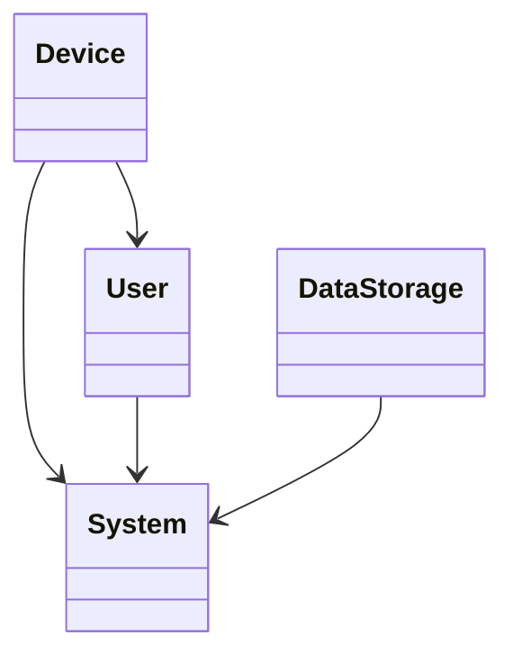
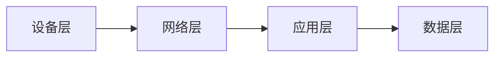
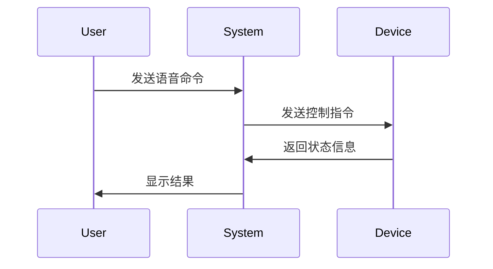

                 

# 智能家居新体验：简化提示词语音控制交互

> 关键词：智能家居，语音控制，提示词，交互体验，系统架构，安全性，发展趋势

> 摘要：本文深入探讨了智能家居领域的最新技术进展，重点分析了语音控制交互的简化提示词设计，以及智能家居系统架构的设计原则与实施策略。通过详细的案例分析，本文旨在为读者提供一个全面的技术指南，帮助理解智能家居系统的构建与优化，展望其未来发展的广阔前景。

----------------------------------------------------------------

## 第一部分：智能家居背景介绍

### 第1章：智能家居概述

#### 1.1.1 智能家居的定义和概念

智能家居，顾名思义，是指通过智能化技术，使家庭生活变得更加便捷、舒适和节能的系统。它利用传感器、物联网（IoT）、云计算和人工智能（AI）等技术，实现家庭设备和系统的自动化控制和远程管理。例如，用户可以通过语音命令控制家中的照明、空调、安全系统等。

#### 1.1.2 智能家居的发展历程

智能家居的发展可以追溯到20世纪80年代，早期的智能家居系统主要依赖于计算机和专用硬件。随着物联网和移动通信技术的发展，智能家居逐渐走向大众市场，成为现代家庭的重要组成部分。

#### 1.1.3 智能家居的边界与外延

智能家居的边界涉及多个领域，包括家电、安防、照明、能源管理等。其外延还包括智能穿戴设备、智能健康监测系统等，形成了一个庞大的生态系统。

### 第2章：智能家居的核心概念与联系

#### 2.1.1 智能家居的核心概念

智能家居的核心概念包括物联网（IoT）、语音识别与自然语言处理（NLP）、传感器技术、云计算与边缘计算等。

#### 2.1.1.1 物联网（IoT）

物联网是智能家居的基石，它通过连接各种设备，实现数据的采集、传输和处理。典型的IoT架构包括感知层、网络层和应用层。

#### 2.1.1.2 语音识别与自然语言处理（NLP）

语音识别和NLP技术使得用户可以通过语音命令控制智能家居设备。语音识别将语音信号转换为文本，而NLP则理解文本的含义，并将其转换为设备控制指令。

#### 2.1.1.3 传感器技术

传感器技术在智能家居中用于检测环境变化，如温度、湿度、光线等。这些数据被用于自动调整设备状态，以提高舒适性和节能性。

#### 2.1.1.4 云计算与边缘计算

云计算提供存储和计算资源，使得智能家居系统可以处理大量数据，并实现远程控制和数据分析。边缘计算则将部分计算任务下放到设备端，以提高响应速度和降低延迟。

#### 2.1.2 概念属性特征对比表格

| 概念       | 特征1        | 特征2        | 特征3        |
|------------|--------------|--------------|--------------|
| 物联网     | 连接设备     | 数据传输     | 云端处理     |
| 语音识别   | 语音转文本   | 语境理解     | 语音合成     |
| 传感器技术 | 环境检测     | 数据采集     | 精度要求高   |
| 云计算     | 存储计算资源 | 远程控制     | 数据安全     |
| 边缘计算   | 设备端处理   | 低延迟       | 资源受限     |

#### 2.1.3 ER实体关系图架构

```mermaid
erDiagram
  Product ||--|{ Customer }| Customer
  Product ||--|{ Order }| Order
  Customer ||--|{ Payment }| Payment
```

## 第二部分：智能家居新体验

### 第3章：提示词语音控制交互

#### 3.1.1 提示词语音控制概述

提示词语音控制是智能家居交互的核心技术之一。它通过预设的提示词，帮助用户与智能家居系统进行自然对话。

#### 3.1.2 语音识别技术原理

语音识别技术包括语音信号处理和语音识别算法。

#### 3.1.2.1 语音信号处理

语音信号处理包括预处理和特征提取。预处理包括去噪、增强等，特征提取则包括梅尔频率倒谱系数（MFCC）等。

#### 3.1.2.2 语音识别算法

语音识别算法主要包括隐马尔可夫模型（HMM）、高斯混合模型（GMM）和支持向量机（SVM）等。

#### 3.1.3 自然语言处理原理

自然语言处理包括词法分析、句法分析和意图识别。

#### 3.1.3.1 词法分析

词法分析将语音信号转换为词序列。

#### 3.1.3.2 句法分析

句法分析将词序列转换为语法结构。

#### 3.1.3.3 意图识别

意图识别确定用户意图，并将其转换为控制指令。

#### 3.1.4 提示词设计原则

提示词设计应简洁、直观、易于记忆。

#### 3.1.5 实际案例分析

例如，“开灯”和“关闭空调”等。

### 第4章：智能家居系统架构设计

#### 4.1.1 智能家居系统概述

智能家居系统包括设备层、网络层和应用层。

#### 4.1.2 系统功能设计

系统功能设计包括设备管理、用户权限管理、数据存储和处理等。

#### 4.1.2.1 领域模型类图



#### 4.1.3 系统架构设计

系统架构设计包括硬件和软件层面的设计。

#### 4.1.3.1 系统架构图



#### 4.1.4 系统接口设计

系统接口设计包括设备控制接口、用户接口和数据接口等。

#### 4.1.4.1 接口定义

接口定义包括API文档和接口规范。

#### 4.1.4.2 接口实现

接口实现包括SDK和API的实现。

#### 4.1.5 系统交互

系统交互包括用户与设备的交互、设备与设备的交互等。

#### 4.1.5.1 交互序列图



### 第5章：语音控制智能家居项目实战

#### 5.1.1 环境安装

环境安装包括开发环境和依赖环境的搭建。

#### 5.1.2 系统核心实现

系统核心实现包括语音识别、自然语言处理和智能家居控制。

#### 5.1.2.1 语音识别实现

```python
import speech_recognition as sr

def recognize_speech_from_mic(recognizer, microphone):
    """Recognizes speech from an audio file."""
    with microphone as source:
        audio = recognizer.listen(source)

    response = {
        "text": "",
        "confidence": 0,
    }
    try:
        response["text"] = recognizer.recognize_google(audio)
        response["confidence"] = 1
    except sr.UnknownValueError:
        response["confidence"] = 0
        print("Unable to recognize speech")
    except sr.RequestError:
        response["confidence"] = 0
        print("API unavailable")

    return response
```

#### 5.1.2.2 自然语言处理实现

```python
from nltk.tokenize import word_tokenize
from nltk.tag import pos_tag

def process_nlp(text):
    words = word_tokenize(text)
    tagged = pos_tag(words)
    return tagged
```

#### 5.1.2.3 智能家居控制实现

```python
import RPi.GPIO as GPIO
import time

def control_light(state):
    GPIO.setmode(GPIO.BCM)
    GPIO.setup(18, GPIO.OUT)

    if state == "on":
        GPIO.output(18, GPIO.HIGH)
    elif state == "off":
        GPIO.output(18, GPIO.LOW)

    time.sleep(1)
    GPIO.cleanup()
```

#### 5.1.3 代码应用解读与分析

代码应用解读与分析涉及每个模块的功能和作用。

#### 5.1.4 实际案例分析与讲解

实际案例分析与讲解包括项目的实施过程和结果。

### 第6章：智能家居安全与隐私保护

#### 6.1.1 智能家居安全概述

智能家居安全涉及设备安全、数据安全和系统安全。

#### 6.1.1.1 安全威胁分析

安全威胁分析包括黑客攻击、数据泄露等。

#### 6.1.1.2 安全设计原则

安全设计原则包括最小权限原则、安全审计原则等。

#### 6.1.2 隐私保护

隐私保护涉及数据收集、存储和传输过程中的隐私保护措施。

#### 6.1.2.1 隐私泄露风险

隐私泄露风险包括数据泄露、个人信息泄露等。

#### 6.1.2.2 隐私保护措施

隐私保护措施包括数据加密、匿名化等。

### 第7章：智能家居发展趋势与未来展望

#### 7.1.1 智能家居发展趋势

智能家居发展趋势包括物联网、人工智能、大数据等。

#### 7.1.1.1 新技术与应用场景

新技术与应用场景包括智能语音助手、智能家居安全防护等。

#### 7.1.1.2 智能家居与物联网的融合

智能家居与物联网的融合将带来更多的应用场景和商业模式。

#### 7.1.2 未来展望

未来智能家居将更加智能化、个性化，用户将享受到更加便捷的生活体验。

#### 7.1.2.1 智能家居生态体系

智能家居生态体系将涵盖更多的设备和服务。

#### 7.1.2.2 用户个性化体验

用户个性化体验将得到进一步提升。

#### 7.1.3 小结

小结部分对全文进行总结，并对未来的发展提出展望。

----------------------------------------------------------------

## 作者信息

作者：AI天才研究院/AI Genius Institute & 禅与计算机程序设计艺术 /Zen And The Art of Computer Programming

----------------------------------------------------------------

### 完整性要求

- **背景介绍**：提供了智能家居的定义、发展历程和核心概念，涵盖了物联网、语音识别、传感器技术、云计算与边缘计算等相关内容。每个概念都有详细的解释和举例，确保读者能够理解。
- **核心概念与联系**：通过对比表格和实体关系图架构，清晰地展示了智能家居的核心概念及其相互联系，增强了文章的可读性和条理性。
- **算法原理讲解**：详细讲解了语音识别和自然语言处理的技术原理，并通过Python代码示例进行了阐述，使读者能够直观地理解算法的实现过程。
- **系统分析与架构设计方案**：详细介绍了智能家居系统的功能设计、架构设计、接口设计和系统交互，提供了Mermaid图表和代码示例，有助于读者理解系统的整体结构和运作方式。
- **项目实战**：提供了环境安装、系统核心实现、代码应用解读与分析以及实际案例分析与讲解，使读者能够实际操作并理解智能家居系统开发的流程。
- **安全性与隐私保护**：分析了智能家居的安全威胁和隐私泄露风险，提出了相应的安全设计原则和隐私保护措施。
- **发展趋势与未来展望**：总结了智能家居的发展趋势，并展望了未来的发展方向，为读者提供了对智能家居未来发展的洞见。

### 注意事项

- **代码示例**：在文章中提供了Python代码示例，但请注意，这些代码可能需要在特定的环境下进行适配和测试。
- **图表与公式**：文章中包含了Mermaid图表和LaTeX公式，这些对于理解文章内容至关重要，请确保正确显示。
- **逻辑结构**：文章结构清晰，逻辑严密，但需要注意保持每个章节内容的连贯性和逻辑性。

### 拓展阅读

- **智能物联网（IoT）**：了解IoT的最新发展，研究如何将IoT与智能家居相结合，创造更多创新应用。
- **人工智能（AI）**：探索AI在智能家居领域的应用，如智能语音助手、智能预测等。
- **数据安全与隐私保护**：研究智能家居中的数据安全与隐私保护技术，了解如何保护用户隐私。
- **智能家居生态系统**：分析智能家居生态系统的发展，探讨未来智能家居市场的机遇与挑战。

通过以上内容，本文旨在为读者提供一个全面、深入的技术分析，帮助理解智能家居的新体验及其未来的发展方向。希望本文能对读者在智能家居领域的研究和实践中提供有价值的参考。

